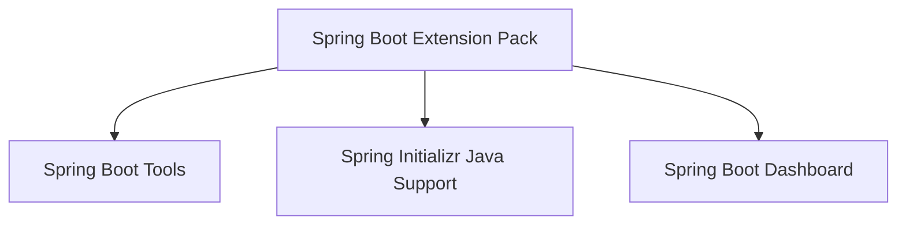
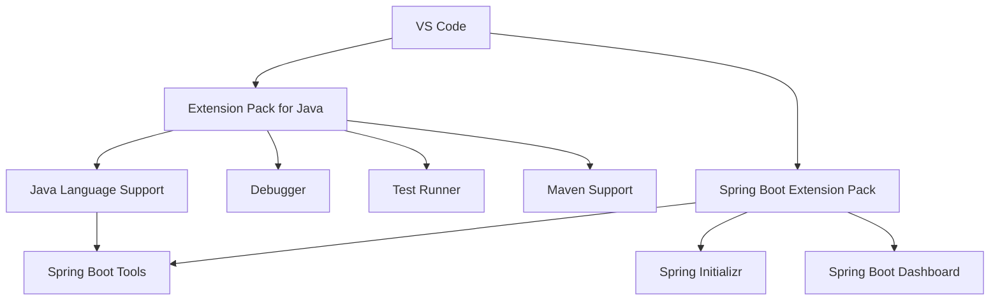

# Spring Boot Extension 구성 가이드

## 1. 문서 목적

본 문서는 VS Code에 Spring Boot 개발 기능을 추가하기 위해 **Spring Boot Extension Pack**을 설치하고 각 Extension의 역할을 설명한다.

현재 단계에서는 Spring Boot 프로젝트를 생성하지 않는다.

따라서 다음 내용에 집중한다.

- Spring Boot Extension Pack 설치
- Spring Boot Tools 역할
- Spring Initializr Java Support 역할
- Spring Boot Dashboard 역할
- Java Extension과 Spring Boot Extension의 관계
- 프로젝트 생성 이후 실제로 사용할 기능의 범위 이해

---

## 2. 사전 조건

다음 환경이 먼저 준비되어 있어야 한다.

- Eclipse Temurin JDK 준비
- Apache Maven 기본 환경 구성
- VS Code 설치
- Extension Pack for Java 설치

Spring Boot Extension은 Java 개발환경을 대체하는 것이 아니라 그 위에 Spring Boot 관련 기능을 추가한다.

```text
VS Code
   ↓
Extension Pack for Java
   ↓
Java 개발 기능
   ↓
Spring Boot Extension Pack
   ↓
Spring Boot 전용 개발 기능
```

---

# 3. Spring Boot Extension Pack 설치

Extensions 화면:

### Windows / Linux

```text
Ctrl + Shift + X
```

### macOS

```text
Command + Shift + X
```

검색:

```text
Spring Boot Extension Pack
```

Publisher가 VMware인지 확인한다.

Extension ID:

```text
vmware.vscode-boot-dev-pack
```

설치한다.

CLI:

```bash
code --install-extension vmware.vscode-boot-dev-pack
```

VS Code 공식 Java 문서에서도 Spring Boot 개발환경을 위해 Java Extension Pack과 Spring Boot Extension Pack 구성을 안내한다.

---

# 4. Spring Boot Extension Pack 구성

Spring Boot 개발에서 사용되는 주요 구성요소는 다음과 같다.



각 Extension은 역할이 다르다.

| Extension | 주요 역할 |
|---|---|
| Spring Boot Tools | Spring Boot Source 및 설정 파일 지원 |
| Spring Initializr Java Support | Spring Boot 프로젝트 생성 지원 |
| Spring Boot Dashboard | Workspace의 Spring Boot Application 관리 |

현재 단계에서는 프로젝트가 없으므로 설치와 역할 이해까지만 진행한다.

---

# 5. Spring Boot Tools

Extension ID:

```text
vmware.vscode-spring-boot
```

Spring Boot 개발에서 가장 중요한 Spring 전용 Extension이다.

Java Language Support 위에서 동작하며 Spring Boot에 특화된 기능을 제공한다.

주요 역할:

- Spring Boot 전용 코드 지원
- Spring 구성요소 탐색
- Spring 관련 자동완성
- Spring 관련 Navigation
- Spring Boot Configuration Property 지원
- `application.properties` 지원
- `application.yml` 지원
- Spring 관련 Validation
- Spring 코드 Template 지원
- Spring Boot 관련 정보 표시

구조:

```text
Language Support for Java
        ↓
Java Source 분석
        ↓
Spring Boot Tools
        ↓
Spring Framework / Spring Boot 전용 지원
```

Spring Boot Tools는 Java Language Support와 별개의 Java Engine이 아니라 Java 개발환경 위에 Spring 관련 이해를 추가하는 도구로 보면 된다.

---

# 6. Spring Boot 설정 파일 지원

Spring Boot Tools는 향후 다음과 같은 파일을 편집할 때 Spring Boot Configuration Property 지원을 제공한다.

```text
application.properties
application.yml
application-*.properties
application-*.yml
```

프로젝트 Dependency와 Spring Boot Metadata를 기반으로 다음 기능을 제공할 수 있다.

- Property 자동완성
- Property 설명
- 잘못된 Property 확인
- 설정 Key 탐색

현재는 아직 프로젝트가 없으므로 `application.yml`을 생성하지 않는다.

---

# 7. Spring Initializr Java Support

Extension ID:

```text
vscjava.vscode-spring-initializr
```

Spring Initializr를 VS Code에서 사용할 수 있도록 지원한다.

주요 역할:

- Spring Boot 프로젝트 생성 Wizard
- Spring Boot 버전 선택
- Java 버전 선택
- Maven / Gradle 선택
- Group 설정
- Artifact 설정
- Dependency 선택
- Spring Initializr 기반 Project 생성

Command Palette에서는 향후 다음과 같은 Spring Initializr 명령을 사용할 수 있다.

```text
Spring Initializr
```

이 Extension은 **다음 단계의 Spring Boot 프로젝트 생성 가이드에서 실제로 사용**한다.

> 현재 단계에서는 Spring Initializr를 실행하여 프로젝트를 생성하지 않는다.

---

# 8. Spring Boot Dashboard

Extension ID:

```text
vscjava.vscode-spring-boot-dashboard
```

Workspace 안의 Spring Boot 프로젝트를 한 곳에서 확인하고 관리할 수 있는 화면을 제공한다.

향후 주요 기능:

- Spring Boot Project 목록
- Application 상태 확인
- Application 시작
- Application 중지
- Debug 실행

현재는 프로젝트가 없으므로 Dashboard에 Spring Boot Application이 표시되지 않는 것이 정상이다.

```text
Spring Boot Dashboard
        ↓
현재: Application 없음
        ↓
프로젝트 생성 이후
        ↓
MicroServer Application 표시
```

---

# 9. Java Extension과 Spring Boot Extension의 관계

두 Extension Pack은 서로 중복 설치가 아니다.



역할을 구분하면 다음과 같다.

```text
Java Extension Pack
→ Java라는 언어와 Java Project를 개발하기 위한 기반

Spring Boot Extension Pack
→ Java 개발환경 위에서 Spring Boot를 이해하고 지원
```

따라서 MicroServer 개발환경에서는 두 Pack을 함께 사용한다.

---

# 10. 설치 상태 확인

Extensions 검색:

```text
@installed
```

다음 Extension을 확인한다.

```text
Spring Boot Extension Pack
Spring Boot Tools
Spring Initializr Java Support
Spring Boot Dashboard
```

CLI:

```bash
code --list-extensions
```

주요 Extension ID:

```text
vmware.vscode-boot-dev-pack
vmware.vscode-spring-boot
vscjava.vscode-spring-initializr
vscjava.vscode-spring-boot-dashboard
```

---

# 11. Spring 관련 명령 확인

Command Palette:

```text
Ctrl + Shift + P
```

macOS:

```text
Command + Shift + P
```

다음 키워드로 검색한다.

```text
Spring
```

또는:

```text
Spring Boot
```

Spring 관련 명령이 표시되면 Extension이 정상적으로 등록된 것이다.

현재는 프로젝트 생성 명령을 실행하지 않는다.

---

# 12. Spring Initializr를 지금 실행하지 않는 이유

현재 MicroServer 환경 구성 순서는 다음과 같다.

```text
JDK 준비
  ↓
Maven 기본 환경 구성
  ↓
VS Code 설치
  ↓
Java Extension
  ↓
Spring Boot Extension     ← 현재
  ↓
개발 지원 Extension / JDK 연계 확인
  ↓
Spring Boot 프로젝트 생성
```

Apache Maven 자체는 이미 앞 단계에서 준비되어 있다.

Spring Initializr Extension이 설치되었다고 여기서 바로 프로젝트를 생성하면
**VS Code 환경 구성 단계와 실제 프로젝트 생성 단계가 섞이게 된다.**

따라서 현재는 Spring Boot 개발에 필요한 Extension을 준비하고 역할을 이해하는 데까지만 진행한다.
Spring Initializr를 이용한 실제 프로젝트 생성은 다음 **Spring Boot 프로젝트 생성 가이드**에서 수행한다.

---

# 13. 현재 단계에서 하지 않는 작업

다음 작업은 아직 진행하지 않는다.

```text
Spring Initializr 실행
Spring Boot 프로젝트 생성
pom.xml 작성
Spring Dependency 추가
Application Class 작성
application.yml 작성
Spring Boot 실행
Spring Boot Debug
Actuator 설정
```

이 내용들은 이후 실제 프로젝트 생성 및 구현 가이드에서 다룬다.

---

# 14. 체크리스트

- [ ] Extension Pack for Java가 먼저 설치되어 있다.
- [ ] Spring Boot Extension Pack이 설치되어 있다.
- [ ] Spring Boot Tools가 설치되어 있다.
- [ ] Spring Initializr Java Support가 설치되어 있다.
- [ ] Spring Boot Dashboard가 설치되어 있다.
- [ ] Command Palette에서 Spring 관련 명령을 확인할 수 있다.
- [ ] Spring Initializr의 역할을 이해했다.
- [ ] Dashboard에 Application이 없는 것이 현재 단계에서는 정상임을 확인했다.
- [ ] 아직 Spring Boot 프로젝트를 생성하지 않았다.

---

# 15. 다음 단계

다음 문서에서는 Java / Spring Boot 개발 과정에서 사용할 지원 Extension과 VS Code Profile을 구성한다.

```text
Spring Boot Extension 구성
        ↓
개발 지원 Extension / Profile 구성
        ↓
JDK 연계 및 환경 운영 확인
```

## 참고

- Spring Boot in Visual Studio Code  
  <https://code.visualstudio.com/docs/java/java-spring-boot>

- Java Extensions for Visual Studio Code  
  <https://code.visualstudio.com/docs/java/extensions>

- Spring Boot Extension Pack  
  <https://marketplace.visualstudio.com/items?itemName=vmware.vscode-boot-dev-pack>
