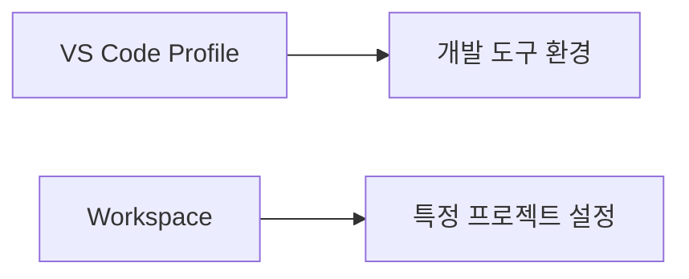
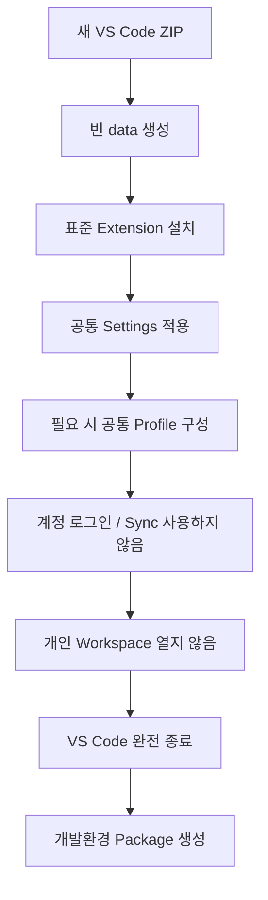

# 개발 지원 Extension 및 Profile 구성 가이드

## 1. 문서 목적

본 문서는 Java / Spring Boot 핵심 Extension 이외에 MicroServer 개발 과정에서 사용할 **YAML, XML, Container Tools** 등의 지원 Extension과 VS Code Profile 운영 방법을 설명한다.

핵심 Java / Spring Boot 기능과 보조 개발 기능을 분리하여 관리하는 것이 목적이다.

---

## 2. Extension 분류 기준

MicroServer의 VS Code Extension은 다음 세 수준으로 구분한다.

```text
필수
 ├─ Extension Pack for Java
 └─ Spring Boot Extension Pack

권장
 ├─ YAML
 ├─ XML
 └─ Container Tools

선택
 ├─ Git 보조 Extension
 ├─ Markdown 보조 Extension
 └─ 개인 생산성 Extension
```

핵심 원칙:

1. Java 기본 기능은 Java Extension Pack으로 통일한다.
2. Spring Boot 기능은 Spring Boot Extension Pack으로 통일한다.
3. 프로젝트에서 자주 사용하는 파일 형식은 공식 또는 신뢰 가능한 Extension을 사용한다.
4. 비슷한 기능을 제공하는 Extension을 불필요하게 중복 설치하지 않는다.
5. 개인 편의 Extension과 프로젝트 권장 Extension을 구분한다.

---


### 2.1 Portable VS Code에서는 Extension Set 자체를 함께 전달할 수 있음

Windows Portable Mode에서는 설치한 Extension이 다음 Directory에서 관리된다.

```text
C:\local-microserver\tools\vscode\data\extensions
```

따라서 필수 / 권장 Extension을 미리 설치한 배포용 Portable VS Code를 만들면
개발자마다 동일한 Extension을 처음부터 다시 설치하는 작업을 줄일 수 있다.

다만 **개발자가 개인적으로 사용하던 `data` Directory를 그대로 배포하지 않는다.**

배포용 Portable Instance는 프로젝트 표준 Extension과 Settings만 포함하도록 별도로 구성한다.


## 3. YAML Extension

Extension:

```text
YAML
```

Publisher:

```text
Red Hat
```

Extension ID:

```text
redhat.vscode-yaml
```

설치:

```bash
code --install-extension redhat.vscode-yaml
```

주요 역할:

- YAML Syntax Highlighting
- YAML 문법 오류 확인
- 자동완성
- Schema 기반 Validation
- YAML 구조 탐색

향후 다음 파일에서 사용할 수 있다.

```text
application.yml
docker-compose.yml
mkdocs.yml
GitHub Actions Workflow
기타 YAML 설정 파일
```

Spring Boot Tools도 `application.yml`에 Spring Boot 전용 기능을 제공하지만 YAML Extension은 일반 YAML 파일 전체를 지원한다.

따라서 두 Extension의 역할은 다음과 같이 구분할 수 있다.

```text
YAML Extension
→ YAML 파일 형식 자체 지원

Spring Boot Tools
→ application.yml 안의 Spring Boot Property 지원
```

---

## 4. XML Extension

Extension:

```text
XML
```

Publisher:

```text
Red Hat
```

Extension ID:

```text
redhat.vscode-xml
```

설치:

```bash
code --install-extension redhat.vscode-xml
```

주요 역할:

- XML Syntax Highlighting
- XML 자동완성
- XML Validation
- XML Formatting
- XML 구조 탐색
- XSD 기반 지원

MicroServer의 주 Build Script는 Gradle이므로 `build.gradle`에는 XML Extension이 필요하지 않다. 다만 Maven 비교 예제, XML 설정 파일, 기타 Java 생태계 XML 편집에 활용한다.

> 현재 단계에서는 실제 프로젝트의 `build.gradle` / `settings.gradle`을 생성하거나 수정하지 않는다.

---

## 5. Container Tools

Extension:

```text
Container Tools
```

Publisher:

```text
Microsoft
```

Extension ID:

```text
ms-azuretools.vscode-containers
```

설치:

```bash
code --install-extension ms-azuretools.vscode-containers
```

주요 역할:

- Docker / Podman Container 확인
- Container Image 확인
- Container 관리
- Container Registry 관련 작업
- Container 기반 개발 지원

MicroServer 프로젝트에서는 이후 Oracle Local Database와 개발용 Container 환경을 사용할 수 있으므로 권장한다.

예전 VS Code 자료에서는 `Docker` Extension을 기준으로 설명하는 경우가 있지만 신규 환경에서는 현재 Microsoft의 Container 개발 도구 구성을 확인하여 적용한다.

---

## 6. 프로젝트 권장 Extension 요약

| 구분 | Extension | ID | 기준 | 역할 |
|---|---|---|---|---|
| Java | Extension Pack for Java | `vscjava.vscode-java-pack` | 필수 | Java 개발환경 |
| Spring | Spring Boot Extension Pack | `vmware.vscode-boot-dev-pack` | 필수 | Spring Boot 개발환경 |
| YAML | YAML | `redhat.vscode-yaml` | 권장 | YAML 편집 / Validation |
| XML | XML | `redhat.vscode-xml` | 권장 | XML 편집 / Validation |
| Container | Container Tools | `ms-azuretools.vscode-containers` | 권장 | Container 관리 |

Extension Pack 내부 Extension은 별도로 다시 설치할 필요가 없다.

---

## 7. CLI를 이용한 기본 Extension 일괄 설치

`code` 명령을 사용할 수 있다면 다음과 같이 설치할 수 있다.

Windows Portable VS Code의 CLI를 명시적으로 사용한다.

```powershell
$code = "C:\local-microserver\tools\vscode\bin\code.cmd"

& $code --install-extension vscjava.vscode-java-pack
& $code --install-extension vmware.vscode-boot-dev-pack
& $code --install-extension redhat.vscode-yaml
& $code --install-extension redhat.vscode-xml
& $code --install-extension ms-azuretools.vscode-containers
```

`start-vscode.cmd` 또는 환경 초기화 Script로 Portable VS Code의 `bin`이 PATH에 포함된 경우에는 다음처럼 실행할 수 있다.

```powershell
code --install-extension redhat.vscode-yaml
```

설치된 Extension 목록:

Windows Portable 환경:

```powershell
& "C:\local-microserver\tools\vscode\bin\code.cmd" --list-extensions
```

Portable Extension Directory:

```text
C:\local-microserver\tools\vscode\data\extensions
```

주요 Extension ID 확인:

```text
vscjava.vscode-java-pack
vmware.vscode-boot-dev-pack
redhat.vscode-yaml
redhat.vscode-xml
ms-azuretools.vscode-containers
```

Pack 설치 시 포함된 개별 Extension도 목록에 함께 표시될 수 있다.

---

## 8. GUI에서 설치 상태 확인

Extensions 화면:

```text
@installed
```

확인 대상:

### Java

```text
Extension Pack for Java
Language Support for Java by Red Hat
Debugger for Java
Test Runner for Java
Gradle for Java
Project Manager for Java
Visual Studio IntelliCode
```

### Spring Boot

```text
Spring Boot Extension Pack
Spring Boot Tools
Spring Initializr Java Support
Spring Boot Dashboard
```

### 지원 도구

```text
YAML
XML
Container Tools
```

---

## 9. VS Code Profile

VS Code의 Profile 기능을 사용하면 개발 목적별로 Extension과 Settings 구성을 분리할 수 있다.

예:

```text
Default
Python
AI Development
MicroServer Java
```

Profile은 다음과 같은 경우 유용하다.

Portable Mode를 사용할 때 Profile의 의미를 다음처럼 구분한다.

```text
Portable Mode
→ VS Code User Data / Extension 전체의 저장 위치를 독립화

Profile
→ 하나의 VS Code 안에서 개발 목적별 Settings / Extension 구성을 논리적으로 구분

Workspace
→ 특정 프로젝트의 설정을 관리
```

즉 Portable Mode와 Profile은 서로 대체 관계가 아니다.

MicroServer 전용 Portable VS Code 하나만 사용하는 경우에는
Portable Instance 자체가 이미 독립된 개발환경이므로 Profile을 반드시 만들 필요는 없다.

반대로 하나의 Portable VS Code 안에서 Java / Python / AI 개발환경을 다시 분리하고 싶다면
Profile을 추가로 사용할 수 있다.

Portable Mode의 Profile 관련 User Data는 VS Code가 `data\user-data` 영역에서 관리한다.


- Python / Java 개발환경을 분리하고 싶은 경우
- 프로젝트와 무관한 Extension을 Java 개발환경에서 제외하고 싶은 경우
- Java 개발용 Extension Set을 별도로 유지하고 싶은 경우

---

## 10. Profile 생성

VS Code 메뉴:

```text
File
→ Preferences
→ Profiles
```

Command Palette:

```text
Profiles: Create Profile
```

예를 들어 다음 이름으로 생성할 수 있다.

```text
MicroServer Java
```

Profile 사용은 필수가 아니다.

개발자가 이미 다른 VS Code 개발환경을 많이 사용하고 있다면 MicroServer 전용 Profile을 만들어 Extension 구성을 분리하는 것을 권장할 수 있다.

---

## 11. Java Spring Profile Template

VS Code는 Java와 Spring 개발에 사용할 수 있는 Profile Template을 제공한다.

대표적으로 다음 Profile Template이 있다.

```text
Java General
Java Spring
```

Java Spring Profile은 Java 개발 Extension과 Spring Boot 관련 Extension을 포함하는 초기 구성을 빠르게 준비할 때 사용할 수 있다.

다만 MicroServer 프로젝트에서는 Extension의 역할을 이해하고 표준 구성을 명확히 하기 위해 본 가이드에서 각 Extension을 직접 확인한 후 Profile에 포함시키는 방식을 권장한다.

---

## 12. Profile과 Workspace의 차이

Profile과 Workspace는 목적이 다르다.



### Profile

개발 도구 환경을 구분한다.

예:

- Extension 목록
- Theme
- User Settings
- 개발 목적별 VS Code 구성

### Workspace

특정 프로젝트 설정을 관리한다.

예:

- 프로젝트 JDK
- Formatter
- Workspace Extension 추천
- 프로젝트별 Java 설정

따라서 Profile은 **개발자의 VS Code 환경**, Workspace는 **프로젝트 환경**이라고 구분하면 이해하기 쉽다.

---

## 13. Extension 자동 업데이트

VS Code Extension은 지속적으로 업데이트된다.

Extensions 화면에서 다음 상태를 확인할 수 있다.

```text
Installed
Enabled
Update
```

기본적으로 최신 Extension을 사용하는 것을 권장하지만 프로젝트 진행 중 특정 버전에서 문제가 발생하는 경우 팀에서 버전을 통일할 수 있다.

특히 다음 Extension은 Java / Spring 개발환경의 핵심이므로 Update 이후 문제가 발생했을 때 우선 확인한다.

```text
Language Support for Java
Debugger for Java
Gradle for Java
Spring Boot Tools
Spring Boot Dashboard
```

---

## 14. Extension 운영 원칙

프로젝트에서는 Extension을 무조건 많이 설치하지 않는다.

권장 원칙:

- 프로젝트에 필요한 기능인지 확인한다.
- Publisher를 확인한다.
- 유사 기능 중복 설치를 피한다.
- 필수 / 권장 / 개인용 Extension을 구분한다.
- 프로젝트 진행 중 문제가 있는 Extension은 팀에서 공유한다.
- 개인 인증정보를 Extension 설정에 저장소 형태로 공유하지 않는다.

---

## 15. Portable VS Code 배포 Package 구성

MicroServer Windows 개발환경의 목표는
VS Code를 포함한 주요 개발도구를 `C:\local-microserver` 아래에 모아
다른 개발자에게 전달하기 쉬운 형태로 만드는 것이다.

### 15.1 권장 Directory 구조

```text
C:\local-microserver
│
├─ tools
│  ├─ jdk
│  │  └─ temurin-25
│  │
│  ├─ gradle
│  │  └─ gradle-9.7.1
│  │
│  └─ vscode
│     ├─ Code.exe
│     ├─ bin
│     ├─ resources
│     └─ data
│        ├─ user-data
│        └─ extensions
│
├─ gradle-home
├─ workspace
├─ repos
└─ env
   ├─ setup.cmd
   ├─ setup.ps1
   └─ start-vscode.cmd
```

### 15.2 Package에 포함하기 좋은 항목

배포용 Package에는 다음과 같은 프로젝트 공통 환경을 포함할 수 있다.

- Eclipse Temurin JDK 25 LTS
- Gradle 9.7.1
- Windows ZIP Portable VS Code
- Java Extension Pack
- Spring Boot Extension Pack
- YAML / XML / Container Tools
- 공통 VS Code User Settings
- 필요하면 MicroServer 전용 Profile
- 환경 초기화 / 실행 Script
- 개발환경 Version을 기록한 README

### 15.3 개인 개발환경을 그대로 Package로 만들지 않음

Portable Mode의 `data`는 단순히 Extension만 저장하는 Directory가 아니다.

Settings, Profile, UI 상태와 VS Code가 관리하는 여러 User Data가 함께 존재할 수 있다.

따라서 다음 방식은 피한다.

```text
개발자가 몇 달간 사용한 Portable VS Code
        ↓
data 폴더 그대로 ZIP
        ↓
다른 개발자에게 전달
```

대신 배포용 Portable Instance를 처음부터 별도로 만든다.



### 15.4 배포용 Portable VS Code에서 피할 항목

다음 정보는 배포 Package에 포함하지 않는 것을 원칙으로 한다.

- Microsoft / GitHub 개인 계정 로그인 상태
- Settings Sync를 통해 내려온 개인 설정
- 개인 인증정보 / Token / Secret
- 개인 Repository의 최근 작업 상태
- 개인 프로젝트 전용 Settings
- 프로젝트와 무관한 개인 Extension
- OS Credential Store에 의존하는 인증정보

!!! important "Settings Sync"
    배포용 Portable VS Code는 Settings Sync를 사용하지 않는 것을 권장한다.

    Sync를 활성화하면 프로젝트가 준비한 기준 Settings / Extension 위에
    개인 계정의 설정이 다시 적용될 수 있어 개발자별 환경 차이가 생길 수 있다.

### 15.5 Extension Update와 재현성

Portable Package를 처음 전달하는 시점에는 동일한 Extension Set을 제공할 수 있지만,
개발자가 사용하면서 Extension이 자동 Update되면 시간이 지나며 Version이 달라질 수 있다.

따라서 장기 프로젝트에서는 다음 중 하나를 운영 정책으로 정할 수 있다.

```text
최신 Extension 사용
        또는
검증된 Extension Version 유지
        또는
문제 발생 Extension만 Version 통일
```

프로젝트 초기에는 지나치게 모든 Extension Version을 고정하기보다,
문제가 발생한 핵심 Extension의 Version을 팀에서 공유하고
필요할 때 배포 Package의 기준 Version을 갱신하는 방식이 현실적이다.

### 15.6 VS Code Version Update

Windows Portable ZIP은 자동 Update를 사용하지 않는다.

새 Version 적용 시에는 새 ZIP을 별도 Directory에 압축 해제하고,
기존 `data` Directory를 새 Version으로 옮겨 검증한 뒤 교체하는 방식이 안전하다.

배포용 Package Version을 변경했다면 README 등에 다음 기준을 기록하는 것이 좋다.

```text
VS Code       : <version>
JDK           : Temurin 25 LTS
Gradle        : 9.7.1
Java Pack     : <version>
Spring Pack   : <version>
Package Date  : YYYY-MM-DD
```

### 15.7 Portable Mode와 외부 의존성

Portable VS Code만 복사한다고 다음 도구까지 자동으로 준비되는 것은 아니다.

```text
Docker Desktop
Git
Database Server
사내 인증서
Proxy / Network 정책
보안 Agent
```

이러한 요소는 각 도구의 환경구성 가이드에서 별도로 관리한다.


## 16. 향후 `.vscode/extensions.json`

프로젝트 생성 이후에는 권장 Extension을 Workspace 차원에서 제안할 수 있다.

예상 구조:

```text
microserver/
 └─ .vscode/
     └─ extensions.json
```

이 파일을 사용하면 프로젝트를 연 개발자에게 권장 Extension을 안내할 수 있다.

> 아직 프로젝트 생성 전이므로 현재 단계에서는 실제 `extensions.json` 파일을 생성하지 않는다.

---

## 17. 체크리스트

- [ ] YAML Extension이 설치되어 있다.
- [ ] XML Extension이 설치되어 있다.
- [ ] Container Tools가 설치되어 있다.
- [ ] 필수 Extension과 권장 Extension의 차이를 이해했다.
- [ ] Portable `code.cmd --list-extensions`로 설치 상태를 확인할 수 있다.
- [ ] Windows Portable Extension이 `data\extensions` 아래에 저장되는 구조를 이해했다.
- [ ] VS Code Profile의 역할을 이해했다.
- [ ] Java Spring Profile Template이 있다는 것을 확인했다.
- [ ] Portable Mode, Profile, Workspace의 차이를 이해했다.
- [ ] 배포용 Portable VS Code는 개인 사용 Instance와 분리해서 구성해야 함을 이해했다.
- [ ] 아직 프로젝트용 `.vscode/extensions.json`을 만들지 않았다.

---

## 18. 다음 단계

다음 문서에서는 앞 단계에서 준비한 Eclipse Temurin JDK와
현재 구성한 VS Code Java Extension의 관계를 확인하고,
향후 프로젝트별 JDK를 어떤 시점에 연결할지 운영 방향을 정리한다.

```text
JDK 준비
   ↓
Gradle 준비
   ↓
VS Code / Java / Spring Extension
   ↓
지원 Extension / Profile       ← 현재 완료
   ↓
JDK 연계 및 VS Code 환경 운영 확인
   ↓
Spring Boot 프로젝트 생성
```

Gradle 기본 환경은 이미 VS Code 구성 전에 준비되어 있으므로
VS Code 환경 구성이 완료되면 별도의 Build Tool 설치 단계로 되돌아가지 않는다.

## 참고

- [VS Code Portable Mode](https://code.visualstudio.com/docs/setup/portable)

- VS Code Profiles  
  <https://code.visualstudio.com/docs/configure/profiles>

- YAML  
  <https://marketplace.visualstudio.com/items?itemName=redhat.vscode-yaml>

- XML  
  <https://marketplace.visualstudio.com/items?itemName=redhat.vscode-xml>

- Container Tools  
  <https://marketplace.visualstudio.com/items?itemName=ms-azuretools.vscode-containers>