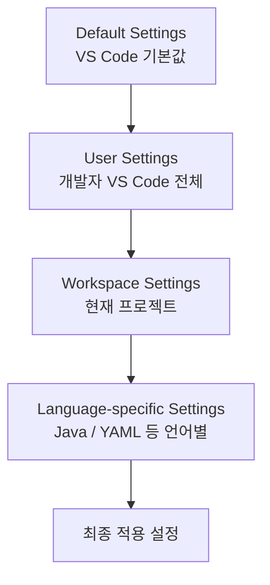

# VS Code 기본 설정 가이드

## 1. 문서 목적

본 문서는 설치가 완료된 MicroServer용 VS Code에서 Java / Spring Boot 개발을 시작하기 전에
필요한 기본 Editor 환경과 VS Code 사용 방법을 구성한다.

VS Code 설치, Windows ZIP 압축 해제, Portable `data` Directory 생성과 같은 작업은
이전 문서인 **VS Code 설치 가이드**에서 완료한 것을 전제로 한다.

현재 단계에서는 프로젝트를 생성하지 않는다.

따라서 본 문서는 다음 작업에 집중한다.

- VS Code 주요 화면 이해
- Command Palette 사용
- Extensions 화면 사용
- Integrated Terminal 확인
- Settings UI / Settings JSON 사용
- Portable VS Code User Settings에 기본 JDK Runtime 경로 등록
- UTF-8 Encoding 설정
- Auto Save 정책 이해
- Format On Save 정책 이해
- 공백 및 파일 끝 처리 설정 이해
- User Settings와 Workspace Settings의 차이 이해

Windows Portable Mode의 User Settings는 다음 영역에 저장된다.

```text
C:\local-microserver\tools\vscode\data\user-data\User\settings.json
```

## 2. VS Code 역할

VS Code는 기본 상태에서는 범용 Source Code Editor이다.

Java 및 Spring Boot 개발 기능은 이후 Extension을 설치하여 추가한다.

```text
VS Code
  │
  ├─ 기본 Editor 기능
  ├─ Terminal
  ├─ Git UI
  └─ Extension Platform
       │
       ├─ Java 개발 기능
       ├─ Spring Boot 개발 기능
       └─ YAML / XML / Container 기능
```

즉, 먼저 VS Code 자체를 정상적으로 사용할 수 있는 상태로 만든 뒤 Extension을 단계적으로 구성한다.

---

## 3. VS Code 주요 화면

VS Code의 주요 영역은 다음과 같다.

| 영역 | 역할 |
|---|---|
| Explorer | 폴더와 파일 탐색 |
| Search | Workspace 전체 검색 |
| Source Control | Git 변경사항 확인 |
| Run and Debug | 실행 및 Debug 관리 |
| Extensions | Extension 검색, 설치, 관리 |
| Terminal | VS Code 내부 Terminal |
| Problems | 오류 및 Warning 확인 |
| Output | VS Code 및 Extension 로그 확인 |
| Status Bar | Encoding, Git Branch 등 상태 확인 |

Java / Spring Boot 개발에서는 Explorer, Extensions, Terminal, Problems, Output을 자주 사용하게 된다.

---

## 4. Command Palette

Command Palette는 VS Code 및 설치된 Extension의 명령을 실행하는 핵심 기능이다.

### Windows / Linux

```text
Ctrl + Shift + P
```

### macOS

```text
Command + Shift + P
```

예를 들어 Java Extension을 설치하면 다음과 같은 명령이 Command Palette에 추가된다.

```text
Java: ...
```

Spring Boot Extension을 설치하면 Spring 관련 명령도 추가된다.

따라서 Extension 설치가 정상적으로 되었는지를 확인할 때도 Command Palette를 활용할 수 있다.

---

## 5. Extensions 화면

Extensions 화면에서는 VS Code의 개발 기능을 추가하거나 제거할 수 있다.

### Windows / Linux

```text
Ctrl + Shift + X
```

### macOS

```text
Command + Shift + X
```

Extensions 화면에서는 다음 작업이 가능하다.

- Extension 검색
- 설치
- Enable / Disable
- Update
- Uninstall
- Publisher 확인
- Extension ID 확인

MicroServer 프로젝트에서는 Extension 이름만 보고 설치하지 말고 **Publisher와 Extension ID를 함께 확인**하는 것을 권장한다.

---

## 6. Integrated Terminal

VS Code는 Editor 하단에서 Terminal을 사용할 수 있다.

메뉴:

```text
Terminal
→ New Terminal
```

Windows에서는 PowerShell, macOS에서는 zsh를 기본으로 사용할 수 있다.

향후 Git, Gradle, Docker 등 개발 도구 명령을 실행할 때 사용한다.

현재 단계에서는 실제 Gradle Build나 애플리케이션 실행을 진행하지 않는다.

---

## 7. VS Code Settings 이해 및 열기

VS Code의 `Settings`는 Editor 동작, 파일 처리 방식, Terminal, Extension 동작 등을 설정하는 영역이다.

현재 단계에서는 아직 Spring Boot 프로젝트가 없으므로 **프로젝트 전용 Workspace Settings를 만들기보다 VS Code 기본 설정 구조를 이해하고, Portable VS Code 전체에 적용해도 문제가 없는 최소 설정을 구성**한다.

여기에 다음 Java Extension 단계에서 바로 사용할 수 있도록 **설치된 JDK 25의 위치를 Portable User Settings에 등록하는 작업까지 포함**한다.

### 7.1 Settings UI 열기

단축키:

Windows:

```text
Ctrl + ,
```

macOS:

```text
Command + ,
```

또는 Command Palette에서 다음 명령을 실행할 수 있다.

```text
Preferences: Open Settings (UI)
```

Settings UI 상단의 검색창에서 설정 이름을 검색한다.

예:

```text
Files Encoding
Files Auto Save
Editor Format On Save
Trim Trailing Whitespace
```

Settings UI는 실제 설정 Key를 몰라도 검색해서 값을 확인할 수 있으므로 처음 VS Code를 구성할 때 가장 편리하다.

### 7.2 Settings JSON 열기

VS Code 설정은 UI뿐 아니라 JSON으로도 관리할 수 있다.

Command Palette:

```text
Ctrl + Shift + P
```

검색:

```text
Preferences: Open User Settings (JSON)
```

예:

```json
{
  "files.encoding": "utf8",
  "files.autoGuessEncoding": false
}
```

UI에서 변경한 설정과 JSON에서 변경한 설정은 같은 VS Code 설정을 서로 다른 방식으로 편집하는 것이다.

!!! info "Portable Mode의 User Settings 저장 위치"
    Windows Portable Mode에서는 User Settings가 일반 `%APPDATA%\Code`가 아니라
    Portable `data` 영역에서 관리된다.

    대표 경로:

    ```text
    C:\local-microserver\tools\vscode\data\user-data\User\settings.json
    ```

    따라서 배포용 Portable VS Code에 공통 User Settings를 적용하면
    해당 Settings도 `C:\local-microserver` Package와 함께 전달할 수 있다.

    단, **User Settings는 여전히 프로젝트 전용 설정이 아니다.**

    프로젝트별 JDK, Formatter, Build Tool 설정 등은
    Spring Boot 프로젝트 생성 이후 Workspace Settings에서 별도로 관리한다.


!!! tip "UI와 JSON 중 무엇을 사용해야 하는가?"
    현재 단계에서는 **Settings UI에서 값을 확인하는 방식**을 기본으로 한다.

    설정 Key의 의미를 이해하거나 여러 설정을 한 번에 확인해야 할 때는 `settings.json`을 사용하면 편리하다.

    프로젝트가 생성된 이후에는 프로젝트 공통 설정을 `.vscode/settings.json`으로 관리할 수 있다.


### 7.3 기본 JDK Runtime 경로 등록

Java Extension 가이드로 넘어가기 전에
Portable VS Code가 사용할 기본 JDK 위치를 **User Settings**에 미리 등록한다.

MicroServer Windows 표준 JDK 위치:

```text
C:\local-microserver\tools\jdk\temurin-25
```

먼저 JDK가 정상적으로 설치되어 있는지 PowerShell에서 확인한다.

```powershell
C:\local-microserver\tools\jdk\temurin-25\bin\java.exe -version
C:\local-microserver\tools\jdk\temurin-25\bin\javac.exe -version
```

`java`와 `javac` 모두 Version이 정상적으로 표시되면 JDK 설치 자체는 정상이다.

Portable VS Code에서 다음 명령으로 User Settings JSON을 연다.

```text
Ctrl + Shift + P
→ Preferences: Open User Settings (JSON)
```

Windows Portable Mode에서 실제 저장 위치는 다음과 같다.

```text
C:\local-microserver\tools\vscode\data\user-data\User\settings.json
```

현재 MicroServer 표준 JDK 25를 등록한다.

```json
{
  "java.jdt.ls.java.home": "C:\\local-microserver\\tools\\jdk\\temurin-25",

  "java.configuration.runtimes": [
    {
      "name": "JavaSE-25",
      "path": "C:\\local-microserver\\tools\\jdk\\temurin-25",
      "default": true
    }
  ]
}
```

!!! important "JDK Home을 지정한다"
    JDK 경로는 `bin` Directory가 아니라 **JDK Home Directory**를 지정한다.

    잘못된 예:

    ```text
    C:\local-microserver\tools\jdk\temurin-25\bin
    ```

    올바른 예:

    ```text
    C:\local-microserver\tools\jdk\temurin-25
    ```

`java.configuration.runtimes`는 배열이므로 향후 여러 JDK를 함께 등록할 수 있다.

예를 들어 JDK 21과 JDK 25를 함께 관리한다면 다음과 같이 구성할 수 있다.

```json
{
  "java.jdt.ls.java.home": "C:\\local-microserver\\tools\\jdk\\temurin-25",

  "java.configuration.runtimes": [
    {
      "name": "JavaSE-21",
      "path": "C:\\local-microserver\\tools\\jdk\\temurin-21"
    },
    {
      "name": "JavaSE-25",
      "path": "C:\\local-microserver\\tools\\jdk\\temurin-25",
      "default": true
    }
  ]
}
```

두 설정은 역할이 다르다.

| 설정 | 역할 | 현재 Scope |
|---|---|---|
| `java.jdt.ls.java.home` | Java Language Server 자체를 실행할 JDK | User Settings |
| `java.configuration.runtimes` | VS Code에서 사용할 수 있는 JDK Runtime 목록 | User Settings |
| 프로젝트 Target Java Version | 실제 프로젝트 Compile / Build 기준 Java Version | 프로젝트 생성 이후 |
| Gradle Toolchain | Gradle Build가 사용할 Java Version | 프로젝트 생성 이후 `build.gradle` |

현재는 아직 Java Extension을 설치하기 전 단계이므로
위 Java 관련 설정은 **다음 단계에서 Java Extension이 설치된 뒤 실제로 사용된다.**

즉 이 단계의 목적은
Java Extension 설치 직후 별도로 JDK를 다시 찾거나 설치하지 않도록
**Portable 개발환경의 표준 JDK 경로를 먼저 등록해 두는 것**이다.

설정 저장 후 VS Code를 한 번 Reload해도 된다.

```text
Ctrl + Shift + P
→ Developer: Reload Window
```

!!! note "현재는 Java 프로젝트가 없어도 정상"
    아직 Spring Boot / Java 프로젝트를 생성하지 않았으므로
    다음 단계에서 `Java: Configure Java Runtime`을 실행하면
    `There are no Java projects opened in the current workspace.` 메시지가 나타날 수 있다.

    이는 JDK 설치 오류가 아니라 **현재 Workspace에 Java 프로젝트가 아직 없다는 의미**이다.


### 7.4 설정값의 적용 위치 확인

VS Code 설정은 단순히 값만 보는 것보다 **어느 Scope에 설정되어 있는지** 확인하는 것이 중요하다.

개념적으로는 다음 순서로 구분할 수 있다.

```text
Default Settings
      ↓
User Settings
      ↓
Workspace Settings
      ↓
Folder / Language-specific Settings
```

같은 설정 Key가 더 구체적인 Scope에서 다시 정의되면 해당 범위에서는 그 값이 사용될 수 있다.

예를 들어 User Settings에서 `files.encoding`을 UTF-8로 지정했더라도 특정 Workspace에서 별도 값을 지정하면 해당 Workspace에서는 프로젝트 설정이 우선 적용될 수 있다.

### 7.5 변경한 설정 찾기와 초기화

Settings UI에서는 변경한 설정을 구분해서 확인할 수 있다.

설정을 기본값으로 되돌리고 싶다면 해당 설정의 메뉴에서 다음 기능을 사용할 수 있다.

```text
Reset Setting
```

설정 문제가 생겼을 때는 무조건 VS Code를 재설치하기보다 먼저 다음을 확인한다.

```text
1. User Settings에서 값을 변경했는가?
2. Workspace Settings가 같은 Key를 덮어쓰고 있는가?
3. Java / Markdown 등 언어별 설정이 있는가?
4. Extension이 자체 설정을 추가했는가?
```

이 구분을 이해해두면 이후 Java Extension과 Spring Boot Extension을 구성할 때 설정 충돌을 확인하기 쉽다.

## 8. 파일 Encoding 설정

Source와 설정 파일의 문자 Encoding은 개발자별 환경 차이를 줄이기 위해 통일하는 것이 좋다.

MicroServer 프로젝트의 기본 Encoding은 **UTF-8**을 사용한다.

### 8.1 Files: Encoding 확인

Settings에서 다음 항목을 검색한다.

```text
Files: Encoding
```

권장 값:

```text
UTF-8
```

설정 Key:

```json
"files.encoding": "utf8"
```

현재 Settings 화면에서 이미 `UTF-8`로 되어 있다면 별도의 변경은 필요하지 않다.

### 8.2 UTF-8을 사용하는 이유

MicroServer 프로젝트에서는 Java Source뿐 아니라 다음 파일도 UTF-8 기준으로 관리한다.

```text
Java
XML
YAML
Markdown
Properties
Shell Script
JSON
SQL
```

개발자마다 다른 Encoding을 사용하면 다음 문제가 발생할 수 있다.

- 한글 주석이 깨져 보임
- Markdown 문서의 한글이 깨짐
- Properties / YAML의 한글 값이 잘못 표시됨
- Git Diff에서 실제 내용 변경이 없는데 파일 전체가 변경된 것처럼 보임
- Build 또는 Script 처리 시 예상하지 못한 문자 변환 발생

따라서 프로젝트 Source와 설정 파일은 UTF-8을 기준으로 관리한다.

### 8.3 Files: Auto Guess Encoding

Settings에서 다음 항목을 검색한다.

```text
Files: Auto Guess Encoding
```

설정 Key:

```json
"files.autoGuessEncoding": false
```

MicroServer 신규 프로젝트에서는 기본적으로 **활성화하지 않는다.**

`Auto Guess Encoding`을 활성화하면 VS Code가 파일을 열 때 Encoding을 추측한다. 레거시 파일을 다룰 때는 편리할 수 있지만 신규 프로젝트에서는 개발자가 의도하지 않은 Encoding으로 파일이 해석될 가능성을 만들 수 있다.

따라서 기본 기준은 다음과 같다.

```text
Files: Encoding            = UTF-8
Files: Auto Guess Encoding = Off
```

!!! note "레거시 Source와는 구분"
    기존 시스템의 오래된 Source에는 `EUC-KR`, `CP949` 등 다른 Encoding이 사용된 경우가 있다.

    그런 파일을 분석하거나 수정해야 하는 별도 프로젝트에서는 `Auto Guess Encoding` 또는 파일별 Encoding 재열기를 검토할 수 있다.

    MicroServer 신규 프로젝트의 기본 정책은 UTF-8이다.

### 8.4 현재 파일의 Encoding 확인

Editor 오른쪽 아래 Status Bar에서 현재 파일의 Encoding을 확인할 수 있다.

예:

```text
UTF-8
```

Encoding 표시를 클릭하면 다음과 같은 기능을 사용할 수 있다.

```text
Reopen with Encoding
Save with Encoding
```

`Reopen with Encoding`은 파일 내용을 다른 Encoding으로 다시 해석할 때 사용하고, `Save with Encoding`은 실제 파일 저장 Encoding을 변경할 때 사용한다.

!!! warning "Save with Encoding 사용 시 주의"
    `Save with Encoding`은 실제 파일의 저장 Encoding을 변경할 수 있다.

    프로젝트 정책과 다른 Encoding으로 저장하면 Git Diff 또는 문자 깨짐이 발생할 수 있으므로 특별한 이유가 없다면 UTF-8을 유지한다.

## 9. Auto Save 설정

`Auto Save`는 파일을 직접 저장하지 않아도 특정 조건에서 자동으로 저장하는 기능이다.

Settings 검색:

```text
Files: Auto Save
```

설정 Key:

```json
"files.autoSave": "off"
```

대표적인 값은 다음과 같다.

| 값 | 의미 |
|---|---|
| `off` | 자동 저장하지 않음 |
| `afterDelay` | 일정 시간이 지나면 자동 저장 |
| `onFocusChange` | 다른 Editor로 이동할 때 저장 |
| `onWindowChange` | 다른 Window로 이동할 때 저장 |

MicroServer 프로젝트에서는 Auto Save를 **팀 공통 설정으로 강제하지 않는다.**

Auto Save는 개발자의 편의 기능에 가깝고 Source의 최종 형식을 결정하는 프로젝트 표준 설정은 아니기 때문이다.

현재 단계에서는 다음 정도로 이해하면 된다.

```text
Files: Auto Save = off 또는 개발자 개인 선호값
```

!!! tip "처음에는 off로 사용해도 충분"
    Java / Spring Boot 개발환경을 처음 구성할 때는 파일 저장 시점을 명확히 인지할 수 있도록 `off` 상태로 사용해도 좋다.

    이후 개발 방식에 익숙해진 뒤 개인 취향에 따라 변경할 수 있다.

## 10. Format On Save 설정

`Format On Save`는 파일을 저장할 때 Formatter를 자동 실행하는 기능이다.

Settings 검색:

```text
Editor: Format On Save
```

설정 Key:

```json
"editor.formatOnSave": false
```

현재 단계에서는 **활성화를 강제하지 않는다.**

아직 다음 항목이 정해지지 않았기 때문이다.

- Java Formatter
- 프로젝트 Code Style
- XML / YAML Formatter
- 언어별 Default Formatter
- Formatter Profile

Formatter 정책이 없는 상태에서 `Format On Save`를 먼저 활성화하면 개발자마다 설치된 Extension이나 Formatter에 따라 파일 전체가 불필요하게 변경될 수 있다.

따라서 현재 기준은 다음과 같다.

```text
Editor: Format On Save
→ 프로젝트 Formatter 정책 확정 전까지 팀 공통으로 강제하지 않음
```

프로젝트 생성 이후 Formatter 정책이 확정되면 Workspace Settings에서 설정할 수 있다.

예:

```json
{
  "editor.formatOnSave": true
}
```

언어별 설정도 가능하다.

```json
{
  "[java]": {
    "editor.formatOnSave": true
  },
  "[yaml]": {
    "editor.formatOnSave": true
  }
}
```

!!! warning "User Settings에서 전역 활성화 시 주의"
    `editor.formatOnSave`를 User Settings에서 전역으로 활성화하면 MicroServer가 아닌 다른 프로젝트에도 동일한 설정이 적용된다.

    레거시 Source까지 자동 Formatting될 수 있으므로 프로젝트 공통 Formatter 정책은 가능하면 프로젝트 생성 이후 Workspace Settings에서 관리한다.

## 11. 공백 및 파일 끝 처리 설정

Source 파일은 내용뿐 아니라 줄 끝 공백, 마지막 개행, Line Ending 차이 때문에도 Git Diff가 발생할 수 있다.

VS Code에서는 이러한 항목을 Settings에서 제어할 수 있다.

### 11.1 Trim Trailing Whitespace

Settings 검색:

```text
Files: Trim Trailing Whitespace
```

설정 Key:

```json
"files.trimTrailingWhitespace": true
```

파일 저장 시 각 줄 끝의 불필요한 공백을 제거하는 기능이다.

예:

```text
변경 전
String name = "microserver";····

변경 후
String name = "microserver";
```

신규 프로젝트에서는 불필요한 공백을 줄이는 데 도움이 된다.

다만 User Settings에 전역 적용하면 다른 프로젝트 파일에도 영향을 줄 수 있으므로, 프로젝트 정책으로 강제할 경우 프로젝트 생성 이후 `.editorconfig` 또는 Workspace Settings를 사용하는 것이 좋다.

### 11.2 Insert Final Newline

Settings 검색:

```text
Files: Insert Final Newline
```

설정 Key:

```json
"files.insertFinalNewline": true
```

활성화하면 파일 마지막에 개행 문자가 없을 경우 저장 시 자동으로 추가한다.

Source 관리 도구와 Unix 계열 도구에서는 파일 마지막 개행이 있는 형태를 일반적으로 사용하므로 신규 프로젝트에서 통일된 파일 형식을 유지하는 데 도움이 된다.

### 11.3 Line Ending 확인

VS Code Status Bar에서는 현재 파일의 Line Ending을 확인할 수 있다.

대표적인 값:

```text
LF
CRLF
```

운영체제 기본 경향은 다음과 같다.

```text
Windows      → CRLF
macOS/Linux  → LF
```

하지만 Git 설정이나 `.gitattributes` 정책에 따라 Repository 저장 기준은 별도로 통일할 수 있다.

현재 VS Code 설치 단계에서는 Line Ending을 User Settings에서 강제로 변경하지 않는다.

실제 프로젝트의 개행 정책은 프로젝트가 생성된 이후 Git / `.gitattributes` / `.editorconfig` 기준과 함께 정하는 것이 안전하다.

!!! note "공백/개행 설정은 프로젝트 정책과 함께 관리"
    `Trim Trailing Whitespace`, `Insert Final Newline`, `Line Ending`은 개발자 편의 설정처럼 보이지만 Git Diff에 직접 영향을 줄 수 있다.

    따라서 최종 프로젝트 공통 기준은 Workspace Settings나 `.editorconfig`로 관리하는 것이 좋다.

## 12. User Settings와 Workspace Settings

VS Code Settings는 **적용 범위(Scope)** 를 이해하는 것이 중요하다.

같은 설정 Key라도 어디에 정의했는지에 따라 적용 대상이 달라진다.



### 12.1 Default Settings

VS Code가 기본으로 제공하는 설정이다.

개발자가 아무 설정도 변경하지 않았을 때 사용하는 값이다.

예를 들어 `Files: Encoding`이 기본적으로 UTF-8이라면 별도로 User Settings를 추가하지 않아도 UTF-8로 동작할 수 있다.

따라서 모든 설정을 무조건 `settings.json`에 작성할 필요는 없다.

### 12.2 User Settings

User Settings는 현재 개발자가 사용하는 VS Code 전체에 적용된다.

Portable Mode에서는 여기서 말하는 "전체"가 **해당 Portable VS Code Instance 전체**를 의미한다.

개인 취향에 가까운 대표 설정은 다음과 같다.

- Theme
- Font Size
- 화면 Layout
- Auto Save
- 개인 단축키
- 개인 Terminal 설정
- 개인 UI 표시 방식
- Portable VS Code가 공통으로 사용할 JDK Runtime 위치 등록

반면 다음과 같이 **특정 프로젝트의 결과에 영향을 주는 값**을 User Scope에 무조건 강제하는 것은 주의한다.

```text
Formatter
Format On Save
Line Ending
프로젝트별 Target Java Version
프로젝트별 Build Tool / Gradle Toolchain 설정
```

!!! warning "User Settings는 다른 프로젝트에도 적용"
    하나의 VS Code로 MicroServer와 다른 Java 프로젝트 또는 레거시 프로젝트를 함께 개발할 수 있다.

    User Settings에 프로젝트 전용 값을 등록하면 다른 프로젝트까지 영향을 받을 수 있으므로 적용 범위를 확인해야 한다.

### 12.3 Workspace Settings

Workspace Settings는 특정 프로젝트 또는 Workspace에만 적용되는 설정이다.

MicroServer 프로젝트가 생성된 이후에는 다음과 같은 항목을 Workspace Settings로 관리할 수 있다.

- 프로젝트 Target Java Version
- 프로젝트별 Java Runtime 선택
- Formatter
- Source Encoding
- Java 관련 프로젝트 설정
- Build 관련 IDE 설정
- 프로젝트 권장 Extension과 연계되는 설정

향후 프로젝트가 생성되면 다음 구조를 사용할 수 있다.

```text
microserver/
└─ .vscode/
   ├─ settings.json
   └─ extensions.json
```

예:

```json
{
  "files.encoding": "utf8"
}
```

현재 단계에서는 아직 프로젝트가 없으므로 `.vscode/settings.json`이나 `.vscode/extensions.json`을 생성하지 않는다.

### 12.4 Language-specific Settings

VS Code는 특정 언어에만 적용되는 설정도 지원한다.

예:

```json
{
  "[java]": {
    "editor.formatOnSave": true
  },
  "[markdown]": {
    "editor.wordWrap": "on"
  }
}
```

Java와 Markdown처럼 파일 성격이 다른 경우 유용하다.

하지만 현재 단계에서는 아직 Formatter와 프로젝트 Code Style을 정의하지 않았으므로 언어별 Formatting 설정도 미리 강제하지 않는다.

### 12.5 현재 단계에서 권장하는 Settings 범위

현재 단계에서 확인할 기준을 정리하면 다음과 같다.

| 설정 | 현재 권장 | 적용 범위 |
|---|---|---|
| `files.encoding` | UTF-8 확인 | User 기본값 확인 |
| `files.autoGuessEncoding` | Off | User |
| `files.autoSave` | 개인 선택 | User |
| `editor.formatOnSave` | 아직 강제하지 않음 | 프로젝트 생성 이후 검토 |
| `files.trimTrailingWhitespace` | 사용 가능 | 프로젝트 공통화는 이후 검토 |
| `files.insertFinalNewline` | 사용 권장 | 프로젝트 공통화는 이후 검토 |
| Java Language Server 기본 JDK | Temurin 25 등록 | User |
| 사용 가능한 JDK Runtime 목록 | JDK 25 등록 | User |
| 프로젝트 Target Java Version | 현재 설정하지 않음 | 프로젝트 생성 이후 |
| Java Formatter | 현재 설정하지 않음 | 프로젝트 생성 이후 Workspace |
| `.vscode/settings.json` | 현재 생성하지 않음 | 프로젝트 생성 이후 |

### 12.6 현재 단계의 User Settings 예시

현재 프로젝트 생성 전 단계에서 굳이 User Settings JSON으로 명시한다면 다음 정도의 최소 설정만 사용할 수 있다.

```json
{
  "files.encoding": "utf8",
  "files.autoGuessEncoding": false,
  "files.autoSave": "off",

  "java.jdt.ls.java.home": "C:\\local-microserver\\tools\\jdk\\temurin-25",

  "java.configuration.runtimes": [
    {
      "name": "JavaSE-25",
      "path": "C:\\local-microserver\\tools\\jdk\\temurin-25",
      "default": true
    }
  ]
}
```

다만 `files.encoding` 등 VS Code 기본값이 이미 원하는 값이라면 동일한 값을 User Settings에 중복 작성하지 않아도 된다.
반면 MicroServer Portable 환경의 JDK 위치는 일반 설치 경로가 아니므로 `java.jdt.ls.java.home`과 `java.configuration.runtimes`는 명시적으로 등록하는 것을 기준으로 한다.

!!! tip "설정의 핵심은 많이 넣는 것이 아니라 Scope를 정확히 구분하는 것"
    VS Code Settings를 많이 등록한다고 개발환경이 더 안정적인 것은 아니다.

    개인 취향 설정은 User Settings에 두고, 프로젝트 결과에 영향을 주는 설정은 프로젝트가 생성된 이후 Workspace Settings 또는 `.editorconfig` 등 프로젝트 관리 파일로 통일하는 것이 중요하다.

## 13. 체크리스트

### 13.1 VS Code 기본 기능

- [ ] VS Code가 정상 실행된다.
- [ ] Explorer를 사용할 수 있다.
- [ ] Command Palette를 사용할 수 있다.
- [ ] Extensions 화면을 사용할 수 있다.
- [ ] Integrated Terminal을 사용할 수 있다.
- [ ] Output / Problems 화면을 확인할 수 있다.
- [ ] Status Bar에서 Encoding과 Line Ending 등의 상태를 확인할 수 있다.

### 13.2 Settings

- [ ] Settings UI를 열 수 있다.
- [ ] User Settings JSON을 여는 방법을 이해했다.
- [ ] `C:\local-microserver\tools\jdk\temurin-25`에 JDK가 설치되어 있음을 확인했다.
- [ ] `java.exe -version`과 `javac.exe -version`이 정상적으로 실행된다.
- [ ] Portable VS Code User Settings에 JDK 25 경로를 등록했다.
- [ ] `java.configuration.runtimes`는 여러 JDK를 등록할 수 있는 배열임을 이해했다.
- [ ] User Settings의 기본 JDK 등록과 프로젝트별 Target Java Version 설정이 다른 개념임을 이해했다.
- [ ] `Files: Encoding`이 `UTF-8`인지 확인했다.
- [ ] `Files: Auto Guess Encoding`이 `Off`인지 확인했다.
- [ ] Auto Save는 개인 편의 설정임을 이해했다.
- [ ] Format On Save는 Formatter 정책 확정 전에는 팀 공통으로 강제하지 않는다.
- [ ] Trim Trailing Whitespace의 역할을 이해했다.
- [ ] Insert Final Newline의 역할을 이해했다.
- [ ] LF / CRLF가 Line Ending을 의미한다는 것을 이해했다.
- [ ] Portable Mode에서는 User Settings가 `data` 아래에서 관리됨을 이해했다.
- [ ] User Settings와 Workspace Settings의 적용 범위를 이해했다.
- [ ] 프로젝트 전용 설정은 프로젝트 생성 이후 Workspace Settings로 관리할 수 있음을 이해했다.
- [ ] 아직 `.vscode/settings.json`이나 `.vscode/extensions.json`을 생성하지 않았다.

## 14. 다음 단계

VS Code 기본 설정과 JDK Runtime 경로 등록이 완료되면 Java 개발 기능을 추가한다.


다음 문서:

**[Java 개발 Extension 구성](java_extension_setup.md)**

현재 단계에서는 VS Code 자체와 기본 Editor 설정을 구성하고,
다음 Java Extension 가이드에서 바로 사용할 수 있도록 **Temurin JDK 25 Runtime 경로까지 User Settings에 등록**한다.

Java Language Server, Debugger, Test Runner, Gradle for Java 등 Extension 자체는 다음 가이드에서 구성한다.

## 15. 공식 참고

- [VS Code 공식 Download](https://code.visualstudio.com/Download)
- [VS Code Portable Mode](https://code.visualstudio.com/docs/setup/portable)
- [Installing VS Code on Windows](https://code.visualstudio.com/docs/setup/windows)
- [VS Code Command Line Interface](https://code.visualstudio.com/docs/configure/command-line)
## 16. 최종 User Settings 예시

앞에서 설명한 기본 설정을 한 번에 적용하려면
Portable VS Code의 User Settings 파일을 열어 아래 내용을 복사하여 사용할 수 있다.

User Settings 위치:

```text
C:\local-microserver\tools\vscode\data\user-data\User\settings.json
```

Command Palette에서는 다음 명령으로 열 수 있다.

```text
Ctrl + Shift + P
→ Preferences: Open User Settings (JSON)
```

MicroServer 개발환경의 기본 User Settings 예시는 다음과 같다.

```json
{
  "files.encoding": "utf8",
  "files.autoGuessEncoding": false,
  "files.autoSave": "off",
  "editor.formatOnSave": false,
  "files.trimTrailingWhitespace": true,
  "files.insertFinalNewline": true,

  "java.jdt.ls.java.home": "C:\\local-microserver\\tools\\jdk\\temurin-25",

  "java.configuration.runtimes": [
    {
      "name": "JavaSE-25",
      "path": "C:\\local-microserver\\tools\\jdk\\temurin-25",
      "default": true
    }
  ]
}
```

위 설정의 기준은 다음과 같다.

| 설정 | 기본값 | 설명 |
|---|---|---|
| `files.encoding` | `utf8` | 신규 Source와 설정 파일의 기본 Encoding |
| `files.autoGuessEncoding` | `false` | 신규 프로젝트에서는 Encoding 자동 추측 비활성화 |
| `files.autoSave` | `off` | 저장 시점을 명확하게 확인할 수 있도록 기본 Off |
| `editor.formatOnSave` | `false` | 프로젝트 Formatter 정책 확정 전까지 자동 Formatting 비활성화 |
| `files.trimTrailingWhitespace` | `true` | 저장 시 줄 끝 불필요한 공백 제거 |
| `files.insertFinalNewline` | `true` | 파일 마지막 개행 유지 |
| `java.jdt.ls.java.home` | Temurin 25 | Java Language Server가 사용할 기본 JDK |
| `java.configuration.runtimes` | JavaSE-25 | Portable VS Code에서 사용 가능한 JDK Runtime 등록 |

!!! important "프로젝트 전용 설정과 구분"
    이 파일은 **Portable VS Code User Settings**이므로
    해당 Portable VS Code에서 여는 Workspace에 공통 적용된다.

    프로젝트 생성 이후 다음과 같은 항목은 프로젝트별 설정으로 별도 관리할 수 있다.

    - 프로젝트 Target Java Version
    - Gradle Toolchain
    - Java Formatter
    - 프로젝트별 Format On Save 정책
    - 프로젝트별 Line Ending 정책
    - 프로젝트별 권장 Extension

!!! note "기존 settings.json에 내용이 있는 경우"
    기존 `settings.json`에 다른 설정이 이미 있다면
    위 JSON 전체를 그대로 덮어쓰기보다 필요한 Key를 기존 JSON Object 안에 추가한다.

    동일한 Key가 이미 존재한다면 중복으로 작성하지 말고 기존 값을 확인하여 수정한다.
