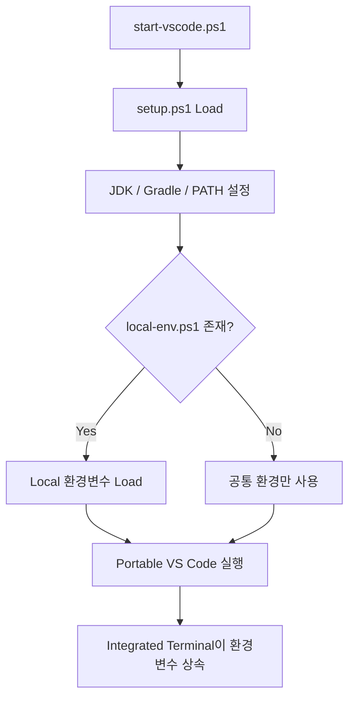

# VS Code 설치 가이드

## 1. 문서 목적

본 문서는 MicroServer 개발환경에서 사용할 Visual Studio Code를 설치하고,
`C:\local-microserver` 하위에서 독립적으로 관리할 수 있도록 Portable 환경을 구성하는 절차를 설명한다.

현재 Windows 표준 환경에서는 **VS Code Windows x64 ZIP 배포본**을 사용하며,
설치형 프로그램처럼 시스템 전역에 설치하지 않고 다음 위치에 압축 해제하여 사용한다.

```text
C:\local-microserver\tools\vscode
```

현재 MicroServer 개발환경의 VS Code 기준 Version은 다음과 같다.

```text
VS Code : 1.134.0
```

이 문서에서는 다음 작업에 집중한다.

- Windows용 VS Code ZIP 다운로드
- `C:\local-microserver\tools\vscode`에 압축 해제
- `data` Directory 생성 및 Portable Mode 활성화
- VS Code 실행 및 Version 확인
- `start-vscode.ps1`을 이용한 독립 실행
- 개발자별 Local Secret을 `local-env.ps1`로 분리
- Portable VS Code Update
- 다른 개발자에게 전달할 배포용 Portable 환경 구성
- macOS에서의 VS Code 설치 및 Portable Mode 참고

Editor의 Encoding, Auto Save, Format On Save, User Settings / Workspace Settings 등은
다음 문서인 **VS Code 기본 설정 가이드**에서 별도로 다룬다.

## 2. Windows 설치 - ZIP Portable Mode

MicroServer의 Windows 표준 VS Code 환경은 **User Installer가 아니라 ZIP 배포본 + Portable Mode**를 사용한다.

일반적인 개인 개발환경에서는 VS Code User Installer가 편리하지만,
MicroServer는 JDK, Gradle, VS Code와 주요 설정을 `C:\local-microserver` 아래에서
독립적으로 관리하고 다른 개발자에게 전달할 수 있는 구조를 지향한다.

### 2.1 Windows 표준 설치 방식

Windows 기준:

```text
배포 형식     : ZIP
설치 방식     : 압축 해제
VS Code 위치  : C:\local-microserver\tools\vscode
Portable Mode : 사용
User Installer: 프로젝트 표준 방식으로 사용하지 않음
```

!!! info "왜 ZIP 배포본을 사용하는가?"
    ZIP 배포본은 Installer를 실행하지 않고 Directory에 압축만 해제하면 실행할 수 있다.

    그리고 실행 Directory에 `data` 폴더를 만들면 VS Code Portable Mode를 사용할 수 있어
    Settings와 Extension을 VS Code Directory 가까이에 함께 보관할 수 있다.

### 2.2 Windows ZIP 다운로드

Visual Studio Code 공식 Download 페이지에서 Windows용 ZIP 배포본을 다운로드한다.

!!! tip "공식 Download 페이지"
    다음 페이지에서 VS Code의 운영체제별 배포본을 다운로드할 수 있다.

    **[Visual Studio Code 공식 Download](https://code.visualstudio.com/Download)**

    Windows 영역에는 다음과 같이 여러 배포 방식이 표시된다.

    ```text
    Windows
    ├─ User Installer
    ├─ System Installer
    ├─ .zip
    └─ CLI
    ```

    MicroServer에서는 이 중 **`.zip`** 을 사용한다.

#### 2.2.1 Download 페이지에서 ZIP 선택

공식 Download 페이지를 연다.

```text
https://code.visualstudio.com/Download
```

Windows 영역에서 다음 행을 찾는다.

```text
.zip
```

그다음 개발 PC Architecture에 맞는 항목을 선택한다.

```text
.zip
├─ x64
└─ Arm64
```

일반적인 Intel / AMD 기반 Windows 10·11 개발 PC:

```text
Operating System : Windows
Architecture     : x64
Distribution     : ZIP
Channel          : Stable
```

따라서 대부분의 일반적인 회사용 Windows 노트북과 Desktop에서는
**`.zip → x64`** 를 선택하면 된다.

#### 2.2.2 PC Architecture를 모르는 경우

Windows에서 다음 위치에서 확인할 수 있다.

```text
설정
→ 시스템
→ 정보
→ 시스템 종류
```

예:

```text
64비트 운영 체제, x64 기반 프로세서
```

이면:

```text
Windows x64 ZIP
```

을 선택한다.

ARM 기반 Processor라고 표시되는 Windows 장비라면:

```text
Windows Arm64 ZIP
```

을 선택한다.

!!! note "MicroServer 기본 문서는 Windows x64 기준"
    현재 MicroServer Windows 개발환경 가이드는
    일반적인 Intel / AMD 기반 **Windows x64 개발 PC**를 기본 기준으로 작성한다.

    Windows Arm64에서도 VS Code Portable Mode 자체는 사용할 수 있지만
    JDK와 기타 개발도구의 Architecture 지원 여부는 각 도구 가이드에서 별도로 확인한다.

#### 2.2.3 최신 Stable ZIP 직접 다운로드

Download 페이지를 거치지 않고 최신 Stable ZIP을 바로 받을 수도 있다.

**Windows x64:**

**[VS Code Windows x64 ZIP - Latest Stable 직접 다운로드](https://update.code.visualstudio.com/latest/win32-x64-archive/stable)**

**Windows Arm64:**

**[VS Code Windows Arm64 ZIP - Latest Stable 직접 다운로드](https://update.code.visualstudio.com/latest/win32-arm64-archive/stable)**

!!! info "`latest` 주소의 의미"
    위 직접 다운로드 주소의 `latest`는
    **현재 제공되는 최신 Stable Version**을 의미한다.

    예를 들어 새로운 Stable Version이 Release되면
    같은 URL로 접속해도 새 Version의 ZIP을 다운로드하게 된다.

    따라서 처음 개발환경을 구성할 때는 편리하지만,
    프로젝트 배포 Package를 운영할 때는 실제 검증한 VS Code Version을 별도로 기록한다.

#### 2.2.4 다운로드 파일 확인

Windows x64 ZIP의 파일명은 Version에 따라 다음과 같은 형태가 된다.

```text
VSCode-win32-x64-<version>.zip
```

현재 MicroServer 기준 예:

```text
VSCode-win32-x64-1.134.0.zip
```

일반 형식:

```text
VSCode-win32-x64-<version>.zip
```

!!! warning "User Installer와 혼동하지 않음"
    다음과 같은 Installer 파일을 다운로드한 경우 현재 가이드의 Portable Mode 대상이 아니다.

    ```text
    VSCodeUserSetup-*.exe
    VSCodeSetup-*.exe
    ```

    MicroServer Windows 개발환경 Package를 구성할 때는
    **`VSCode-win32-x64-*.zip` 형태의 ZIP 배포본**을 사용한다.

    Installer 방식은 일반 개인 설치 방식으로는 정상적인 방법이지만,
    이번 프로젝트의 Portable 개발환경 표준과는 목적이 다르다.

#### 2.2.5 다운로드 후 다음 작업

ZIP 다운로드가 완료되면 아직 Installer를 실행하는 과정은 없다.

다음 단계에서 ZIP의 내용을 아래 Directory에 압축 해제한다.

```text
C:\local-microserver\tools\vscode
```

진행 흐름:


### 2.3 VS Code Directory 준비

다음 Directory를 준비한다.

```text
C:\local-microserver\tools\vscode
```

PowerShell:

```powershell
New-Item -ItemType Directory -Force C:\local-microserver\tools\vscode
```

다운로드한 VS Code ZIP의 내용을 위 Directory에 압축 해제한다.

정상 구조의 예:

```text
C:\local-microserver\tools\vscode
├─ Code.exe
├─ bin\
├─ appx\
├─ policies\
├─ tools\
├─ ...
└─ ...
```

!!! note "VS Code Version에 따라 내부 Directory 구조가 달라질 수 있음"
    ZIP 배포본의 내부 Directory 구성은 VS Code Version에 따라 달라질 수 있다.

    예를 들어 일부 Version이나 기존 문서에서는 `resources` Directory가 보일 수 있지만,
    현재 사용하는 VS Code 1.134.0 ZIP에서는 해당 Directory가 최상위에 보이지 않을 수 있다.

    Portable 구성에서 반드시 확인할 핵심은 다음 항목이다.

    ```text
    C:\local-microserver\tools\vscode\Code.exe
    C:\local-microserver\tools\vscode\bin\code.cmd
    C:\local-microserver\tools\vscode\data
    ```

    따라서 `resources` Directory의 존재 여부를 Portable Mode 정상 여부의 판단 기준으로 사용하지 않는다.

중요한 것은 `Code.exe`가 바로 다음 위치에 존재하도록 정리하는 것이다.

```text
C:\local-microserver\tools\vscode\Code.exe
```

### 2.4 Portable Mode 활성화

Windows와 Linux에서 VS Code Portable Mode는
VS Code 실행 Directory 바로 아래에 **`data` Directory를 생성**하여 활성화한다.

PowerShell:

```powershell
New-Item -ItemType Directory -Force C:\local-microserver\tools\vscode\data
```

최종 구조:

```text
C:\local-microserver\tools\vscode
├─ Code.exe
├─ bin\
├─ appx\
├─ policies\
├─ tools\
├─ ...
└─ data\
```

이 상태에서 `Code.exe`를 실행하면 Portable Mode로 동작한다.

!!! important "`data` 폴더가 Portable Mode의 기준"
    단순히 VS Code ZIP을 압축 해제한 것만으로는
    VS Code 사용자 데이터가 모두 Portable 영역에 저장되는 것은 아니다.

    **VS Code 실행 Directory에 `data` 폴더가 존재해야 Portable Mode가 활성화된다.**

### 2.5 Portable `data` Directory의 역할

VS Code가 Portable Mode로 실행되면 Settings, Extension, UI 상태 등
VS Code가 관리하는 데이터가 `data` 아래에 저장된다.

대표 구조:

```text
C:\local-microserver\tools\vscode\data
├─ user-data
│  └─ User
│     └─ settings.json
└─ extensions
   └─ ...
```

역할:

| Directory | 역할 |
|---|---|
| `data\user-data` | Settings, Profile, UI 상태 등 VS Code User Data |
| `data\extensions` | 설치한 VS Code Extension |
| `data\tmp` | 선택적으로 Portable TMP 영역으로 사용 가능 |

일반 설치에서는 Settings와 Extension이 사용자 Profile Directory에 분산될 수 있지만,
Portable Mode에서는 VS Code 관련 데이터를 Package 안쪽으로 모을 수 있다.

```text
일반 설치
C:\Users\<사용자>\AppData\Roaming\Code
C:\Users\<사용자>\.vscode\extensions

Portable Mode
C:\local-microserver\tools\vscode\data\user-data
C:\local-microserver\tools\vscode\data\extensions
```

### 2.6 Portable VS Code 실행

PowerShell에서 직접 실행:

```powershell
& "C:\local-microserver\tools\vscode\Code.exe"
```

CLI Version 확인:

```powershell
& "C:\local-microserver\tools\vscode\bin\code.cmd" --version
```

VS Code Portable 자체의 실행 확인에는 위와 같이 **절대경로로 실행**해도 된다.

향후 `setup.ps1` 또는 `start-vscode.ps1`에서 VS Code의 `bin` Directory를
현재 Session PATH에 추가하면 다음 명령도 사용할 수 있다.

```powershell
code --version
```

### 2.7 PowerShell 기반 MicroServer VS Code 실행

MicroServer Windows 개발환경의 실행 Script는 **PowerShell(`.ps1`)을 기본으로 사용**한다.

기존 CMD Script를 병행하지 않고 다음 역할을 PowerShell Script로 분리한다.

```text
C:\local-microserver
│
├─ env
│  ├─ setup.ps1
│  ├─ start-vscode.ps1
│  ├─ create-vscode-shortcut.ps1
│  ├─ local-env.example.ps1
│  └─ local-env.ps1
│
├─ icons
│  └─ microserver.ico
│
└─ MicroServer VS Code.lnk
```

역할:

| 파일 | 역할 |
|---|---|
| `setup.ps1` | 현재 PowerShell Session에 JDK / Gradle / PATH / Local 환경변수 적용 |
| `start-vscode.ps1` | 환경을 준비한 뒤 Portable VS Code 실행 |
| `local-env.example.ps1` | 개발자별 Local 설정 Sample |
| `local-env.ps1` | 개발자 개인 Local Secret / 설정 |
| `create-vscode-shortcut.ps1` | MicroServer Root에 VS Code 실행 바로가기 생성 |
| `icons\microserver.ico` | 바로가기에서 사용할 MicroServer Icon |

!!! important "CMD Script를 기본 실행 방식으로 사용하지 않음"
    MicroServer Windows 개발환경의 공통 Script는 PowerShell을 기준으로 작성한다.

    `setup.ps1`, `start-vscode.ps1`, `local-env.ps1`를 기본 Package에 함께 제공하지 않는다.

### 2.7.1 `local-env.example.ps1`

배포 Package에는 실제 Secret이 없는 Sample을 포함한다.

```powershell
# MicroServer Local Environment Example

$env:ORACLE_PWD = '<strong-local-password>'
```

개발자는 최초 1회 다음과 같이 파일을 복사한다.

```text
local-env.example.ps1
        ↓ 복사
local-env.ps1
```

실제 `local-env.ps1` 예:

```powershell
# Developer Local Environment

$env:ORACLE_PWD = '<개발자-개인-로컬-비밀번호>'
```

!!! danger "`local-env.ps1`은 배포하지 않음"
    실제 Password, Token 등 개발자별 Secret이 들어갈 수 있으므로
    `C:\local-microserver` 개발환경 Package를 다른 개발자에게 전달할 때
    현재 개발자의 `local-env.ps1`은 제외한다.

    이 파일은 실제 Source Git Repository 밖에 있으므로
    프로젝트 `.gitignore`로 보호하는 파일이 아니다.

### 2.7.2 `setup.ps1`

`setup.ps1`은 현재 PowerShell Session에 MicroServer 개발환경을 적용하는 보조 Script이다.

주요 설정:

```text
LOCAL_MICROSERVER
JAVA_HOME
GRADLE_HOME
GRADLE_USER_HOME
PATH
ORACLE_PWD 등 Local 환경변수
```

일반 PowerShell에서 직접 Build 또는 환경 검증을 할 때는
**Dot Sourcing** 방식으로 실행한다.

```powershell
. C:\local-microserver\env\setup.ps1
```

앞의 `.`은 Script가 설정한 환경변수를 현재 PowerShell Session에 적용하기 위한 것이다.

### 2.7.3 `start-vscode.ps1`

일상적인 VS Code 개발에서는 `setup.ps1`을 직접 실행하기보다
`start-vscode.ps1`이 환경을 준비한 뒤 Portable VS Code를 실행한다.

동작 흐름:



개념적인 실행 Script:

```powershell
$setupScript = Join-Path $PSScriptRoot 'setup.ps1'

. $setupScript -Quiet

$codeExe = Join-Path $env:LOCAL_MICROSERVER 'tools\vscode\Code.exe'

Start-Process -FilePath $codeExe
```

### 2.7.4 MicroServer 실행 Icon

바로가기에서 사용할 Icon은 개발환경 Package에 다음 위치로 제공한다.

```text
C:\local-microserver\icons\microserver.ico
```

Icon 파일은 개발환경 Package 안에 계속 보관한다.

바탕화면에 `.ico` 파일 자체를 복사하는 것이 아니라
**이 Icon을 참조하는 Windows 바로가기(`.lnk`)를 바탕화면으로 복사해서 사용**한다.

### 2.7.5 VS Code 실행 바로가기 생성

다음 Script를 한 번 실행하면:

```text
C:\local-microserver\env\create-vscode-shortcut.ps1
```

다음 바로가기가 생성된다.

```text
C:\local-microserver\MicroServer VS Code.lnk
```

PowerShell:

```powershell
& C:\local-microserver\env\create-vscode-shortcut.ps1
```

생성되는 바로가기의 역할:

```text
MicroServer VS Code.lnk 더블클릭
        ↓
PowerShell 실행
        ↓
start-vscode.ps1
        ↓
setup.ps1
        ↓
local-env.ps1
        ↓
Portable VS Code
```

바로가기는 다음 Icon을 사용한다.

```text
C:\local-microserver\icons\microserver.ico
```

### 2.7.6 바탕화면에서 사용하는 방법

`create-vscode-shortcut.ps1` 실행 후 Windows Explorer에서 다음 파일을 찾는다.

```text
C:\local-microserver\MicroServer VS Code.lnk
```

이 파일을 **복사하여 Windows 바탕화면에 붙여넣는다.**

```text
C:\local-microserver\MicroServer VS Code.lnk
        ↓ 복사
Windows 바탕화면
        ↓
더블클릭
        ↓
MicroServer 개발환경이 적용된 VS Code 실행
```

!!! tip "바로가기 원본은 MicroServer Root에 유지"
    개발환경 Package에는 `C:\local-microserver\MicroServer VS Code.lnk`를 기준 바로가기로 유지한다.

    개발자는 필요할 경우 해당 바로가기를 바탕화면으로 복사하여 사용한다.

    Shortcut의 Target과 Icon은 `C:\local-microserver` 내부 경로를 참조하므로
    개발환경을 표준 경로에 배치하는 것이 중요하다.

!!! note "PowerShell Script 실행이 차단되는 경우"
    회사 보안정책이나 PowerShell 실행정책에 의해 `.ps1` Script 실행이 제한될 수 있다.

    본 가이드에서는 보안정책 변경이나 실행정책 우회 명령을 별도로 안내하지 않는다.

    **Script 실행이 차단되거나 권한 관련 경고가 발생하면 개발환경을 배포하거나 운영하는 팀에 문의한다.**

### 2.7.7 환경변수 확인

바로가기를 통해 VS Code를 실행한 뒤 Integrated PowerShell에서 설정 여부를 확인할 수 있다.

```powershell
$env:JAVA_HOME
$env:GRADLE_HOME
```

Secret 값은 직접 출력하지 않고 설정 여부만 확인한다.

```powershell
if ($env:ORACLE_PWD) {
    "ORACLE_PWD is set"
} else {
    "ORACLE_PWD is not set"
}
```

!!! warning "Local 환경변수 변경 후 VS Code 재시작"
    `local-env.ps1`을 수정한 경우 기존 Portable VS Code를 완전히 종료하고
    `MicroServer VS Code` 바로가기로 다시 실행한다.


### 2.8 Windows 설치 및 Portable Mode 확인

다음 파일과 Directory를 확인한다.

```text
C:\local-microserver\tools\vscode\Code.exe
C:\local-microserver\tools\vscode\bin\code.cmd
C:\local-microserver\tools\vscode\data
```

PowerShell:

```powershell
Test-Path C:\local-microserver\tools\vscode\Code.exe
Test-Path C:\local-microserver\tools\vscode\data
```

Version:

```powershell
& "C:\local-microserver\tools\vscode\bin\code.cmd" --version
```

두 `Test-Path`가 `True`이고 VS Code Version이 정상 출력되면
Windows Portable VS Code 기본 준비가 완료된 것이다.

### 2.9 Portable VS Code Update

Windows ZIP Portable Mode는 일반 Installer 방식의 자동 업데이트를 사용하지 않는다.

Update할 때는 다음 순서로 관리한다.

```text
새 VS Code ZIP 다운로드
        ↓
새 Directory에 압축 해제
        ↓
기존 Portable VS Code 종료
        ↓
기존 data Directory를 새 VS Code Directory로 이동/복사
        ↓
새 Code.exe 실행 및 검증
        ↓
이전 Version 정리
```

`data` Directory를 새 VS Code 설치 Directory로 옮기면
기존 Settings와 Extension을 이어서 사용할 수 있다.

!!! warning "실행파일 위에 무작정 덮어쓰지 않음"
    Update 시에는 새 Version을 별도 Directory에서 먼저 검증한 뒤
    `data`를 이동하는 방식이 문제 발생 시 이전 Version으로 되돌리기 쉽다.

### 2.10 다른 개발자에게 전달할 Portable 환경 만들기

MicroServer 개발환경 Package는 다음처럼 구성할 수 있다.

```text
C:\local-microserver                       ← Git Repository 아님
│
├─ tools
│  ├─ jdk
│  │  └─ temurin-25
│  ├─ gradle
│  │  └─ gradle-9.7.1
│  └─ vscode
│     ├─ Code.exe
│     └─ data
│        ├─ user-data
│        └─ extensions
│
├─ gradle-home
│
├─ workspace
│  ├─ microserver.code-workspace
│  ├─ microserver                         ← Git Repository
│  │  └─ .git
│  └─ microserver-docs                    ← 별도 Git Repository
│     └─ .git
│
├─ env
│  ├─ setup.ps1
│  ├─ start-vscode.ps1
│  ├─ create-vscode-shortcut.ps1
│  ├─ local-env.example.ps1               ← 배포 포함
│  └─ local-env.ps1                       ← 배포 제외
│
├─ icons
│  └─ microserver.ico
│
└─ MicroServer VS Code.lnk
```

이 구조의 장점은 다음과 같다.

- 개발도구의 위치를 한 Root에서 관리할 수 있다.
- VS Code Extension을 개발자마다 다시 설치하는 작업을 줄일 수 있다.
- 공통 VS Code Settings를 미리 적용할 수 있다.
- Windows 시스템 전역 Java / Gradle 설정에 대한 의존성을 줄일 수 있다.
- 개발환경 Package를 압축하여 동일 Root에 풀어 재사용하기 쉽다.
- 실제 Source Repository는 `workspace` 아래에서 개별 Git Repository로 관리할 수 있다.

하지만 **실제 개인 개발에 사용한 `data` 폴더를 그대로 다른 개발자에게 전달하는 것은 피한다.**

배포용 Portable VS Code는 별도로 깨끗하게 구성한다.

권장 절차:

```text
새 VS Code ZIP 압축 해제
        ↓
빈 data Directory 생성
        ↓
프로젝트 표준 Extension만 설치
        ↓
공통 Settings만 설정
        ↓
계정 로그인 / Settings Sync 사용하지 않음
        ↓
개인 Repository / Workspace 열지 않음
        ↓
VS Code 완전 종료
        ↓
배포 Package 생성
```

!!! important "Git 관리 범위와 개발환경 Package 범위는 다름"
    `C:\local-microserver` 자체는 Git Repository가 아니다.

    따라서 `C:\local-microserver\.gitignore`는 필요하지 않다.

    `.gitignore`는 `workspace\microserver` 같은 실제 Repository 내부에서 관리한다.

    반면 `local-env.ps1`는 Git과 관계없이 ZIP에 포함될 수 있으므로
    개발환경 배포 Package에서 별도로 제외한다.

!!! important "계정 / Credential / 개인 상태를 Package에 포함하지 않음"
    Portable `data`는 Settings와 Extension뿐 아니라 VS Code의 여러 User Data를 함께 관리한다.

    따라서 개인이 장기간 사용한 Portable 환경을 정리해서 배포하기보다
    **배포용 Instance를 처음부터 별도로 만드는 방식**이 안전하고 관리하기 쉽다.

### 2.11 Portable Mode의 범위

Portable VS Code Directory를 복사한다고 해서 다음 외부 요소까지 모두 자동으로 복제되는 것은 아니다.

```text
Git 설치
Docker Desktop / Docker Engine
OS Credential Store
외부 CLI
네트워크 / Proxy
인증서
사내 보안 Agent
```

MicroServer Package에서 JDK와 Gradle은 별도로 함께 제공할 수 있지만,
OS 설치나 권한이 필요한 도구는 각 개발 장비에서 별도 구성이 필요할 수 있다.

이 구분을 이해하면 Portable Mode를 "PC 전체 개발환경을 가상화하는 기능"으로 오해하지 않을 수 있다.

## 3. macOS 설치

macOS에서도 VS Code Portable Mode를 사용할 수 있다.

다만 현재 `C:\local-microserver` 표준 Root는 Windows 기준으로 정의되어 있으므로
macOS에서는 기존 개발환경 정책을 유지하면서 Portable Mode 사용 방법을 참고한다.

### 3.1 애플리케이션 준비

macOS용 Visual Studio Code는 공식 Download 페이지에서 다운로드한다.

!!! tip "macOS VS Code 다운로드"
    **[Visual Studio Code 공식 Download](https://code.visualstudio.com/Download)**

    macOS 영역에서 개발 장비에 맞는 항목을 선택한다.

    ```text
    Mac
    ├─ Intel chip
    ├─ Apple silicon
    └─ Universal
    ```

    Apple Silicon Mac은 `Apple silicon`,
    Intel Mac은 `Intel chip`을 선택한다.

    Windows와 달리 macOS Portable Mode는 Windows ZIP 방식이 아니라
    일반 VS Code Application과 `code-portable-data` Directory를 사용하는 방식이다.

일반적인 Application 위치:

```text
/Applications/Visual Studio Code.app
```

### 3.2 macOS Portable Mode

macOS에서는 Windows처럼 Application 내부에 `data`를 만드는 방식이 아니라,
**`Visual Studio Code.app`과 같은 위치에 `code-portable-data` Directory를 둔다.**

```text
Visual Studio Code.app
code-portable-data/
```

Portable User Data와 Extension은 이 Directory 아래에서 관리된다.

!!! note "macOS Portable Directory 이름"
    Stable VS Code는 `code-portable-data`를 사용한다.

    VS Code Insiders는 별도 Portable Directory 이름을 사용하므로
    Stable과 혼동하지 않는다.

### 3.3 quarantine으로 Portable Mode가 동작하지 않는 경우

다운로드한 macOS Application이 quarantine 상태이면 Portable Mode가 정상 동작하지 않을 수 있다.

필요한 경우 공식 가이드에 따라 quarantine Attribute를 확인하고 제거한다.

```bash
xattr -dr com.apple.quarantine "Visual Studio Code.app"
```

보안 정책이 적용된 회사 장비에서는 임의로 실행하기 전에
조직의 macOS 보안 정책을 우선 확인한다.

### 3.4 `code` 명령 PATH 등록

VS Code에서 Command Palette를 연다.

```text
Command + Shift + P
```

다음 명령을 검색한다.

```text
Shell Command: Install 'code' command in PATH
```

실행 후 새 Terminal에서 확인한다.

```bash
code --version
```

### 3.5 macOS Update

macOS Portable Mode는 Windows ZIP 방식과 Update 방식이 다르다.

macOS Application은 일반적인 VS Code Update 방식을 사용할 수 있으며
`code-portable-data`는 Application과 분리된 Portable User Data로 유지할 수 있다.

!!! note "Windows와 macOS 표준 경로는 구분"
    현재 MicroServer의 `C:\local-microserver` Package 구조는 Windows 개발환경 기준이다.

    macOS에서 전체 개발도구 Root를 별도로 표준화할 경우
    JDK / Gradle / VS Code Portable Directory 구조도 함께 조정한다.

## 4. 체크리스트

### 4.1 Windows 설치 및 Portable Mode

- [ ] Windows x64용 VS Code ZIP 배포본을 준비했다.
- [ ] 현재 기준 Version이 `1.134.0`인지 확인했다.
- [ ] VS Code가 `C:\local-microserver\tools\vscode`에 배치되어 있다.
- [ ] `C:\local-microserver\tools\vscode\Code.exe`가 존재한다.
- [ ] `C:\local-microserver\tools\vscode\bin\code.cmd`가 존재한다.
- [ ] `C:\local-microserver\tools\vscode\data` Directory를 직접 생성했다.
- [ ] `Code.exe`를 실행하여 VS Code가 정상 실행되는지 확인했다.
- [ ] `code.cmd --version`으로 Version을 확인했다.
- [ ] Portable Mode에서는 Settings와 Extension이 `data` 아래에서 관리됨을 이해했다.
- [ ] `resources` Directory 유무는 설치 성공 여부의 판단 기준이 아님을 이해했다.
- [ ] `local-env.example.cmd`와 `local-env.ps1`의 역할을 구분했다.
- [ ] `C:\local-microserver` Root는 Git Repository가 아님을 이해했다.

### 4.2 배포 환경

- [ ] 개인이 장기간 사용한 `data` Directory를 그대로 배포하지 않는다.
- [ ] 배포용 Portable VS Code는 별도 Instance로 구성한다.
- [ ] 배포용 Instance에서는 개인 계정 로그인과 Settings Sync를 사용하지 않는다.
- [ ] 프로젝트 표준 Extension과 공통 Settings만 포함한다.
- [ ] JDK / Gradle / Git / Docker 등 VS Code 외부 도구의 관리 범위를 구분한다.
- [ ] 실제 `local-env.ps1`는 개발환경 배포 Package에서 제외한다.
- [ ] `.gitignore`는 `workspace` 아래 실제 Repository에서 관리한다.
- [ ] `icons\microserver.ico`가 준비되어 있다.
- [ ] `MicroServer VS Code.lnk`를 생성하고 필요한 경우 바탕화면에 복사했다.
- [ ] PowerShell Script 실행이 보안정책으로 차단되면 개발환경 배포/운영 팀에 문의한다.

## 5. 다음 단계

VS Code 설치와 Portable Mode 구성이 완료되면 Editor의 기본 설정을 구성한다.


다음 문서:

**[VS Code 기본 설정](vscode_basic_setup.md)**

기본 설정 문서에서는 주요 화면, Command Palette, Integrated Terminal,
Encoding, Auto Save, Format On Save, User Settings와 Workspace Settings 등을 구성한다.

## 6. 공식 참고

- [VS Code 공식 Download](https://code.visualstudio.com/Download)
- [VS Code Portable Mode](https://code.visualstudio.com/docs/setup/portable)
- [Installing VS Code on Windows](https://code.visualstudio.com/docs/setup/windows)
- [VS Code Command Line Interface](https://code.visualstudio.com/docs/configure/command-line)
