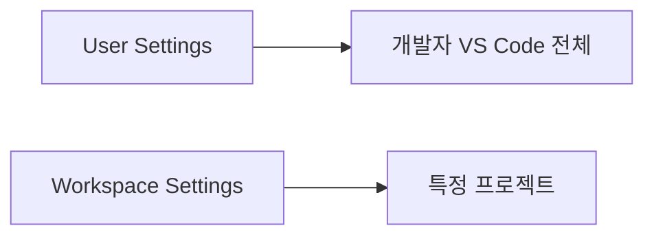

# VS Code 설치 및 기본 설정 가이드

## 1. 문서 목적

본 문서는 MicroServer 개발환경에서 사용할 Visual Studio Code를 Windows와 macOS에 설치하고, Java / Spring Boot 개발을 시작하기 전에 필요한 VS Code 기본 환경을 구성한다.

현재 단계에서는 프로젝트를 생성하지 않는다.

따라서 본 문서는 다음 작업에 집중한다.

- VS Code 설치
- `code` 명령 사용 준비
- VS Code 주요 화면 이해
- Command Palette 사용
- Extensions 화면 사용
- Integrated Terminal 확인
- UTF-8 등 기본 Editor 설정
- User Settings와 Workspace Settings의 차이 이해

---

## 2. VS Code 역할

VS Code는 기본 상태에서는 범용 Source Code Editor이다.

Java 및 Spring Boot 개발 기능은 이후 Extension을 설치하여 추가한다.

```text
VS Code
  │
  ├─ 기본 Editor 기능
  ├─ Terminal
  ├─ Git UI
  └─ Extension Platform
       │
       ├─ Java 개발 기능
       ├─ Spring Boot 개발 기능
       └─ YAML / XML / Container 기능
```

즉, 먼저 VS Code 자체를 정상적으로 사용할 수 있는 상태로 만든 뒤 Extension을 단계적으로 구성한다.

---

# 3. Windows 설치

## 3.1 VS Code 다운로드

Visual Studio Code 공식 사이트에서 Windows용 설치 파일을 다운로드한다.

일반적인 Windows x64 개발 PC에서는 다음 설치 형식을 사용할 수 있다.

```text
Windows x64 User Installer
```

환경에 따라 System Installer를 사용할 수도 있지만 개발자 PC에서는 User Installer만으로도 충분하다.

---

## 3.2 설치 옵션

설치 과정에서 다음 항목을 활성화하는 것을 권장한다.

- PATH에 VS Code 추가
- 파일을 Code로 열기 메뉴 등록
- 디렉터리를 Code로 열기 메뉴 등록
- 지원되는 파일 형식의 편집기로 Code 등록

특히 **PATH 등록**을 활성화하면 PowerShell이나 Command Prompt에서 `code` 명령을 사용할 수 있다.

---

## 3.3 설치 확인

VS Code를 실행하여 정상적으로 시작되는지 확인한다.

PowerShell을 새로 열고 다음 명령을 실행한다.

```powershell
code --version
```

정상적으로 설치되고 PATH가 등록되어 있다면 VS Code 버전이 표시된다.

> `code --version`이 실행되지 않더라도 VS Code 애플리케이션 자체는 정상 설치되어 있을 수 있다.
> 이 경우 설치 옵션의 PATH 등록 여부를 확인한다.

---

# 4. macOS 설치

## 4.1 애플리케이션 설치

macOS용 Visual Studio Code를 다운로드한 후 애플리케이션을 다음 위치에 배치한다.

```text
/Applications/Visual Studio Code.app
```

Applications에서 VS Code를 실행하여 정상적으로 시작되는지 확인한다.

---

## 4.2 `code` 명령 PATH 등록

VS Code에서 Command Palette를 연다.

```text
Command + Shift + P
```

다음 명령을 검색한다.

```text
Shell Command: Install 'code' command in PATH
```

명령을 실행한 후 기존 Terminal을 종료하고 새 Terminal을 실행한다.

확인:

```bash
code --version
```

---

# 5. VS Code 주요 화면

VS Code의 주요 영역은 다음과 같다.

| 영역 | 역할 |
|---|---|
| Explorer | 폴더와 파일 탐색 |
| Search | Workspace 전체 검색 |
| Source Control | Git 변경사항 확인 |
| Run and Debug | 실행 및 Debug 관리 |
| Extensions | Extension 검색, 설치, 관리 |
| Terminal | VS Code 내부 Terminal |
| Problems | 오류 및 Warning 확인 |
| Output | VS Code 및 Extension 로그 확인 |
| Status Bar | Encoding, Git Branch 등 상태 확인 |

Java / Spring Boot 개발에서는 Explorer, Extensions, Terminal, Problems, Output을 자주 사용하게 된다.

---

# 6. Command Palette

Command Palette는 VS Code 및 설치된 Extension의 명령을 실행하는 핵심 기능이다.

### Windows / Linux

```text
Ctrl + Shift + P
```

### macOS

```text
Command + Shift + P
```

예를 들어 Java Extension을 설치하면 다음과 같은 명령이 Command Palette에 추가된다.

```text
Java: ...
```

Spring Boot Extension을 설치하면 Spring 관련 명령도 추가된다.

따라서 Extension 설치가 정상적으로 되었는지를 확인할 때도 Command Palette를 활용할 수 있다.

---

# 7. Extensions 화면

Extensions 화면에서는 VS Code의 개발 기능을 추가하거나 제거할 수 있다.

### Windows / Linux

```text
Ctrl + Shift + X
```

### macOS

```text
Command + Shift + X
```

Extensions 화면에서는 다음 작업이 가능하다.

- Extension 검색
- 설치
- Enable / Disable
- Update
- Uninstall
- Publisher 확인
- Extension ID 확인

MicroServer 프로젝트에서는 Extension 이름만 보고 설치하지 말고 **Publisher와 Extension ID를 함께 확인**하는 것을 권장한다.

---

# 8. Integrated Terminal

VS Code는 Editor 하단에서 Terminal을 사용할 수 있다.

메뉴:

```text
Terminal
→ New Terminal
```

Windows에서는 PowerShell, macOS에서는 zsh를 기본으로 사용할 수 있다.

향후 Git, Maven, Docker 등 개발 도구 명령을 실행할 때 사용한다.

현재 단계에서는 실제 Maven Build나 애플리케이션 실행을 진행하지 않는다.

---

# 9. Settings 열기

VS Code Settings 단축키:

### Windows

```text
Ctrl + ,
```

### macOS

```text
Command + ,
```

Settings는 UI 화면에서 검색하여 변경할 수 있고, JSON으로 직접 설정할 수도 있다.

현재 단계에서는 프로젝트가 없으므로 개발자 PC 전체에 적용되는 기본 설정만 확인한다.

---

# 10. 파일 인코딩

Settings에서 다음 항목을 검색한다.

```text
Files Encoding
```

권장 값:

```text
UTF-8
```

MicroServer 프로젝트에서는 Java Source뿐 아니라 다음 파일도 UTF-8 기준으로 관리할 예정이다.

```text
Java
XML
YAML
Markdown
Properties
Shell Script
```

인코딩이 개발자별로 다르면 한글 주석이나 문서에서 불필요한 Diff가 발생할 수 있으므로 UTF-8 사용을 권장한다.

---

# 11. Auto Save

Settings 검색:

```text
Files Auto Save
```

Auto Save는 개인 개발 성향에 따라 사용할 수 있다.

예:

```text
off
afterDelay
onFocusChange
onWindowChange
```

Auto Save 여부는 프로젝트 Source의 결과에 직접 영향을 주는 설정이 아니므로 팀 공통 설정으로 강제하지 않아도 된다.

---

# 12. Format On Save

Settings 검색:

```text
Editor Format On Save
```

현재는 아직 프로젝트의 Java Formatter 정책을 정의하기 전이므로 특정 설정을 강제하지 않는다.

향후 Code Style과 Formatter 정책이 확정되면 Workspace Settings나 Formatter Profile을 통해 프로젝트 공통 기준으로 관리한다.

---

# 13. Trim Trailing Whitespace

Settings 검색:

```text
Trim Trailing Whitespace
```

이 기능은 파일 저장 시 줄 끝의 불필요한 공백을 제거한다.

프로젝트 공통 규칙은 프로젝트 생성 이후 `.editorconfig` 또는 Workspace Settings를 이용해 통일하는 것을 권장한다.

---

# 14. User Settings와 Workspace Settings

VS Code Settings는 적용 범위에 따라 구분된다.



## 14.1 User Settings

개발자 개인 취향에 가까운 설정이다.

예:

- Theme
- Font Size
- 화면 Layout
- Auto Save
- 개인 단축키
- 개인 Terminal 설정

## 14.2 Workspace Settings

프로젝트 전체에 통일할 필요가 있는 설정이다.

향후 다음과 같은 항목을 Workspace Settings로 관리할 수 있다.

- 프로젝트 JDK
- Java 관련 프로젝트 설정
- Formatter
- Source Encoding
- Build 관련 IDE 설정
- 프로젝트 권장 Extension

향후 프로젝트가 생성되면 다음 구조를 사용할 수 있다.

```text
microserver/
 └─ .vscode/
     ├─ settings.json
     └─ extensions.json
```

> 현재는 아직 프로젝트가 생성되지 않았으므로 `.vscode/settings.json`이나 `.vscode/extensions.json`을 생성하지 않는다.

---

# 15. 현재 단계에서 확인할 사항

다음 기능이 정상적으로 사용 가능한지만 확인한다.

- VS Code 실행
- Explorer
- Extensions
- Terminal
- Command Palette
- Settings
- Output
- Problems

이 단계에서는 다음 작업을 하지 않는다.

```text
프로젝트 폴더 열기
pom.xml 수정
Maven Build
Java Source 작성
Spring Boot 실행
Debug 실행
JUnit Test 작성
```

---

# 16. 체크리스트

- [ ] VS Code가 설치되어 있다.
- [ ] VS Code가 정상 실행된다.
- [ ] `code --version`을 사용할 수 있거나 VS Code 애플리케이션 실행이 정상이다.
- [ ] Command Palette를 사용할 수 있다.
- [ ] Extensions 화면을 사용할 수 있다.
- [ ] Integrated Terminal을 사용할 수 있다.
- [ ] Files Encoding을 UTF-8로 사용할 준비가 되어 있다.
- [ ] User Settings와 Workspace Settings의 차이를 이해했다.
- [ ] 아직 프로젝트 전용 Workspace 설정을 만들지 않았다.

---

# 17. 다음 단계

다음 문서에서는 VS Code에 Java 개발 기능을 추가한다.

```text
VS Code 설치 및 기본 설정
        ↓
Java 개발 Extension 구성
        ↓
Spring Boot Extension 구성
```
