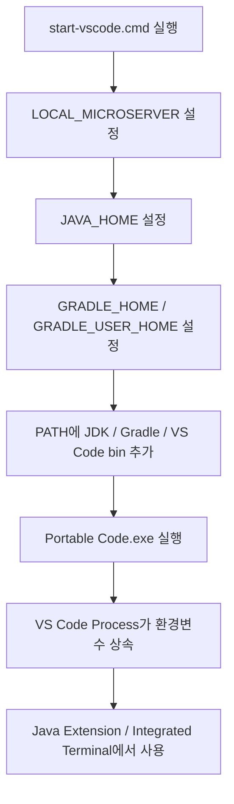
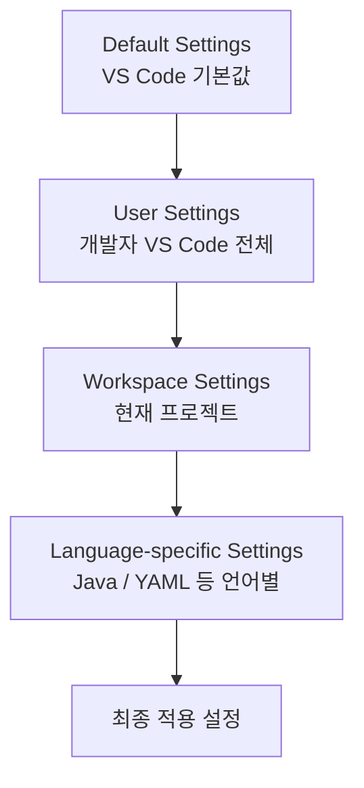

# VS Code 설치 및 기본 설정 가이드

## 1. 문서 목적

본 문서는 MicroServer 개발환경에서 사용할 Visual Studio Code를 Windows와 macOS에 설치하고, Java / Spring Boot 개발을 시작하기 전에 필요한 VS Code 기본 환경을 구성한다.

현재 단계에서는 프로젝트를 생성하지 않는다.

따라서 본 문서는 다음 작업에 집중한다.

- VS Code 설치
- `code` 명령 사용 준비
- VS Code 주요 화면 이해
- Command Palette 사용
- Extensions 화면 사용
- Integrated Terminal 확인
- UTF-8 등 기본 Editor 설정
- User Settings와 Workspace Settings의 차이 이해

---

## 2. VS Code 역할

VS Code는 기본 상태에서는 범용 Source Code Editor이다.

Java 및 Spring Boot 개발 기능은 이후 Extension을 설치하여 추가한다.

```text
VS Code
  │
  ├─ 기본 Editor 기능
  ├─ Terminal
  ├─ Git UI
  └─ Extension Platform
       │
       ├─ Java 개발 기능
       ├─ Spring Boot 개발 기능
       └─ YAML / XML / Container 기능
```

즉, 먼저 VS Code 자체를 정상적으로 사용할 수 있는 상태로 만든 뒤 Extension을 단계적으로 구성한다.

---

## 3. Windows 설치 - ZIP Portable Mode

MicroServer의 Windows 표준 VS Code 환경은 **User Installer가 아니라 ZIP 배포본 + Portable Mode**를 사용한다.

일반적인 개인 개발환경에서는 VS Code User Installer가 편리하지만,
MicroServer는 JDK, Gradle, VS Code와 주요 설정을 `C:\local-microserver` 아래에서
독립적으로 관리하고 다른 개발자에게 전달할 수 있는 구조를 지향한다.

### 3.1 Windows 표준 설치 방식

Windows 기준:

```text
배포 형식     : ZIP
설치 방식     : 압축 해제
VS Code 위치  : C:\local-microserver\tools\vscode
Portable Mode : 사용
User Installer: 프로젝트 표준 방식으로 사용하지 않음
```

!!! info "왜 ZIP 배포본을 사용하는가?"
    ZIP 배포본은 Installer를 실행하지 않고 Directory에 압축만 해제하면 실행할 수 있다.

    그리고 실행 Directory에 `data` 폴더를 만들면 VS Code Portable Mode를 사용할 수 있어
    Settings와 Extension을 VS Code Directory 가까이에 함께 보관할 수 있다.

### 3.2 Windows ZIP 다운로드

Visual Studio Code 공식 Download 페이지에서 Windows용 ZIP 배포본을 다운로드한다.

!!! tip "공식 Download 페이지"
    다음 페이지에서 VS Code의 운영체제별 배포본을 다운로드할 수 있다.

    **[Visual Studio Code 공식 Download](https://code.visualstudio.com/Download)**

    Windows 영역에는 다음과 같이 여러 배포 방식이 표시된다.

    ```text
    Windows
    ├─ User Installer
    ├─ System Installer
    ├─ .zip
    └─ CLI
    ```

    MicroServer에서는 이 중 **`.zip`** 을 사용한다.

#### 3.2.1 Download 페이지에서 ZIP 선택

공식 Download 페이지를 연다.

```text
https://code.visualstudio.com/Download
```

Windows 영역에서 다음 행을 찾는다.

```text
.zip
```

그다음 개발 PC Architecture에 맞는 항목을 선택한다.

```text
.zip
├─ x64
└─ Arm64
```

일반적인 Intel / AMD 기반 Windows 10·11 개발 PC:

```text
Operating System : Windows
Architecture     : x64
Distribution     : ZIP
Channel          : Stable
```

따라서 대부분의 일반적인 회사용 Windows 노트북과 Desktop에서는
**`.zip → x64`** 를 선택하면 된다.

#### 3.2.2 PC Architecture를 모르는 경우

Windows에서 다음 위치에서 확인할 수 있다.

```text
설정
→ 시스템
→ 정보
→ 시스템 종류
```

예:

```text
64비트 운영 체제, x64 기반 프로세서
```

이면:

```text
Windows x64 ZIP
```

을 선택한다.

ARM 기반 Processor라고 표시되는 Windows 장비라면:

```text
Windows Arm64 ZIP
```

을 선택한다.

!!! note "MicroServer 기본 문서는 Windows x64 기준"
    현재 MicroServer Windows 개발환경 가이드는
    일반적인 Intel / AMD 기반 **Windows x64 개발 PC**를 기본 기준으로 작성한다.

    Windows Arm64에서도 VS Code Portable Mode 자체는 사용할 수 있지만
    JDK와 기타 개발도구의 Architecture 지원 여부는 각 도구 가이드에서 별도로 확인한다.

#### 3.2.3 최신 Stable ZIP 직접 다운로드

Download 페이지를 거치지 않고 최신 Stable ZIP을 바로 받을 수도 있다.

**Windows x64:**

**[VS Code Windows x64 ZIP - Latest Stable 직접 다운로드](https://update.code.visualstudio.com/latest/win32-x64-archive/stable)**

**Windows Arm64:**

**[VS Code Windows Arm64 ZIP - Latest Stable 직접 다운로드](https://update.code.visualstudio.com/latest/win32-arm64-archive/stable)**

!!! info "`latest` 주소의 의미"
    위 직접 다운로드 주소의 `latest`는
    **현재 제공되는 최신 Stable Version**을 의미한다.

    예를 들어 새로운 Stable Version이 Release되면
    같은 URL로 접속해도 새 Version의 ZIP을 다운로드하게 된다.

    따라서 처음 개발환경을 구성할 때는 편리하지만,
    프로젝트 배포 Package를 운영할 때는 실제 검증한 VS Code Version을 별도로 기록한다.

#### 3.2.4 다운로드 파일 확인

Windows x64 ZIP의 파일명은 Version에 따라 다음과 같은 형태가 된다.

```text
VSCode-win32-x64-<version>.zip
```

예시 형식:

```text
VSCode-win32-x64-x.xx.x.zip
```

!!! warning "User Installer와 혼동하지 않음"
    다음과 같은 Installer 파일을 다운로드한 경우 현재 가이드의 Portable Mode 대상이 아니다.

    ```text
    VSCodeUserSetup-*.exe
    VSCodeSetup-*.exe
    ```

    MicroServer Windows 개발환경 Package를 구성할 때는
    **`VSCode-win32-x64-*.zip` 형태의 ZIP 배포본**을 사용한다.

    Installer 방식은 일반 개인 설치 방식으로는 정상적인 방법이지만,
    이번 프로젝트의 Portable 개발환경 표준과는 목적이 다르다.

#### 3.2.5 다운로드 후 다음 작업

ZIP 다운로드가 완료되면 아직 Installer를 실행하는 과정은 없다.

다음 단계에서 ZIP의 내용을 아래 Directory에 압축 해제한다.

```text
C:\local-microserver\tools\vscode
```

진행 흐름:


### 3.3 VS Code Directory 준비

다음 Directory를 준비한다.

```text
C:\local-microserver\tools\vscode
```

PowerShell:

```powershell
New-Item -ItemType Directory -Force C:\local-microserver\tools\vscode
```

다운로드한 VS Code ZIP의 내용을 위 Directory에 압축 해제한다.

정상 구조의 예:

```text
C:\local-microserver\tools\vscode
├─ Code.exe
├─ bin\
├─ locales\
├─ resources\
├─ ...
└─ ...
```

중요한 것은 `Code.exe`가 바로 다음 위치에 존재하도록 정리하는 것이다.

```text
C:\local-microserver\tools\vscode\Code.exe
```

### 3.4 Portable Mode 활성화

Windows와 Linux에서 VS Code Portable Mode는
VS Code 실행 Directory 바로 아래에 **`data` Directory를 생성**하여 활성화한다.

PowerShell:

```powershell
New-Item -ItemType Directory -Force C:\local-microserver\tools\vscode\data
```

최종 구조:

```text
C:\local-microserver\tools\vscode
├─ Code.exe
├─ bin\
├─ resources\
└─ data\
```

이 상태에서 `Code.exe`를 실행하면 Portable Mode로 동작한다.

!!! important "`data` 폴더가 Portable Mode의 기준"
    단순히 VS Code ZIP을 압축 해제한 것만으로는
    VS Code 사용자 데이터가 모두 Portable 영역에 저장되는 것은 아니다.

    **VS Code 실행 Directory에 `data` 폴더가 존재해야 Portable Mode가 활성화된다.**

### 3.5 Portable `data` Directory의 역할

VS Code가 Portable Mode로 실행되면 Settings, Extension, UI 상태 등
VS Code가 관리하는 데이터가 `data` 아래에 저장된다.

대표 구조:

```text
C:\local-microserver\tools\vscode\data
├─ user-data
│  └─ User
│     └─ settings.json
└─ extensions
   └─ ...
```

역할:

| Directory | 역할 |
|---|---|
| `data\user-data` | Settings, Profile, UI 상태 등 VS Code User Data |
| `data\extensions` | 설치한 VS Code Extension |
| `data\tmp` | 선택적으로 Portable TMP 영역으로 사용 가능 |

일반 설치에서는 Settings와 Extension이 사용자 Profile Directory에 분산될 수 있지만,
Portable Mode에서는 VS Code 관련 데이터를 Package 안쪽으로 모을 수 있다.

```text
일반 설치
C:\Users\<사용자>\AppData\Roaming\Code
C:\Users\<사용자>\.vscode\extensions

Portable Mode
C:\local-microserver\tools\vscode\data\user-data
C:\local-microserver\tools\vscode\data\extensions
```

### 3.6 Portable VS Code 실행

PowerShell에서 직접 실행:

```powershell
& "C:\local-microserver\tools\vscode\Code.exe"
```

CLI Version 확인:

```powershell
& "C:\local-microserver\tools\vscode\bin\code.cmd" --version
```

VS Code Portable 자체의 실행 확인에는 위와 같이 **절대경로로 실행**해도 된다.

향후 `setup.cmd` 또는 `start-vscode.cmd`에서 VS Code의 `bin` Directory를
현재 Session PATH에 추가하면 다음 명령도 사용할 수 있다.

```powershell
code --version
```

### 3.7 `start-vscode.cmd`를 이용한 독립 실행

VS Code는 Eclipse처럼 `eclipse.ini`에 JVM 경로를 지정해서 VS Code 자체를 Java로 실행하는 구조가 아니다.

VS Code 자체는 Java JDK로 실행되는 프로그램이 아니며,
**Java Extension과 Integrated Terminal이 JDK / Gradle 환경을 사용**한다.

따라서 MicroServer에서는 VS Code를 실행하기 전에 현재 Process에
프로젝트 개발도구 환경을 설정한 뒤 VS Code를 시작하는 Script를 사용할 수 있다.

예:

```cmd
@echo off

set "LOCAL_MICROSERVER=C:\local-microserver"

set "JAVA_HOME=%LOCAL_MICROSERVER%\tools\jdk\temurin-25"
set "GRADLE_HOME=%LOCAL_MICROSERVER%\tools\gradle\gradle-9.7.1"
set "GRADLE_USER_HOME=%LOCAL_MICROSERVER%\gradle-home"

set "PATH=%LOCAL_MICROSERVER%\tools\vscode\bin;%JAVA_HOME%\bin;%GRADLE_HOME%\bin;%PATH%"

start "" "%LOCAL_MICROSERVER%\tools\vscode\Code.exe"
```

권장 위치:

```text
C:\local-microserver\env\start-vscode.cmd
```

동작 흐름:



!!! note "System 환경변수를 영구 변경하는 Script가 아님"
    위 Script의 `set` 명령은 Script에서 시작되는 Process Tree에 환경을 전달하기 위한 것이다.

    Windows 시스템 전체의 `JAVA_HOME`이나 PATH를 영구 변경하는 방식과 구분한다.

!!! warning "이미 실행 중인 VS Code가 있을 때"
    VS Code는 이미 실행 중인 동일 User Data Instance가 있으면
    새 Process가 기존 Instance와 연결될 수 있다.

    JDK / Gradle 환경변수를 변경한 뒤 확실하게 새 환경을 적용하려면
    **MicroServer Portable VS Code를 완전히 종료한 후 `start-vscode.cmd`로 다시 실행**한다.

### 3.8 Windows 설치 및 Portable Mode 확인

다음 파일과 Directory를 확인한다.

```text
C:\local-microserver\tools\vscode\Code.exe
C:\local-microserver\tools\vscode\bin\code.cmd
C:\local-microserver\tools\vscode\data
```

PowerShell:

```powershell
Test-Path C:\local-microserver\tools\vscode\Code.exe
Test-Path C:\local-microserver\tools\vscode\data
```

Version:

```powershell
& "C:\local-microserver\tools\vscode\bin\code.cmd" --version
```

두 `Test-Path`가 `True`이고 VS Code Version이 정상 출력되면
Windows Portable VS Code 기본 준비가 완료된 것이다.

### 3.9 Portable VS Code Update

Windows ZIP Portable Mode는 일반 Installer 방식의 자동 업데이트를 사용하지 않는다.

Update할 때는 다음 순서로 관리한다.

```text
새 VS Code ZIP 다운로드
        ↓
새 Directory에 압축 해제
        ↓
기존 Portable VS Code 종료
        ↓
기존 data Directory를 새 VS Code Directory로 이동/복사
        ↓
새 Code.exe 실행 및 검증
        ↓
이전 Version 정리
```

`data` Directory를 새 VS Code 설치 Directory로 옮기면
기존 Settings와 Extension을 이어서 사용할 수 있다.

!!! warning "실행파일 위에 무작정 덮어쓰지 않음"
    Update 시에는 새 Version을 별도 Directory에서 먼저 검증한 뒤
    `data`를 이동하는 방식이 문제 발생 시 이전 Version으로 되돌리기 쉽다.

### 3.10 다른 개발자에게 전달할 Portable 환경 만들기

MicroServer 개발환경 Package는 다음처럼 구성할 수 있다.

```text
C:\local-microserver
│
├─ tools
│  ├─ jdk
│  │  └─ temurin-25
│  ├─ gradle
│  │  └─ gradle-9.7.1
│  └─ vscode
│     ├─ Code.exe
│     └─ data
│        ├─ user-data
│        └─ extensions
│
├─ gradle-home
├─ workspace
├─ repos
└─ env
   ├─ setup.cmd
   ├─ setup.ps1
   └─ start-vscode.cmd
```

이 구조의 장점은 다음과 같다.

- 개발도구의 위치를 한 Root에서 관리할 수 있다.
- VS Code Extension을 개발자마다 다시 설치하는 작업을 줄일 수 있다.
- 공통 VS Code Settings를 미리 적용할 수 있다.
- Windows 시스템 전역 Java / Gradle 설정에 대한 의존성을 줄일 수 있다.
- 개발환경 Package를 압축하여 동일 Root에 풀어 재사용하기 쉽다.

하지만 **실제 개인 개발에 사용한 `data` 폴더를 그대로 다른 개발자에게 전달하는 것은 피한다.**

배포용 Portable VS Code는 별도로 깨끗하게 구성한다.

권장 절차:

```text
새 VS Code ZIP 압축 해제
        ↓
빈 data Directory 생성
        ↓
프로젝트 표준 Extension만 설치
        ↓
공통 Settings만 설정
        ↓
계정 로그인 / Settings Sync 사용하지 않음
        ↓
개인 Repository / Workspace 열지 않음
        ↓
VS Code 완전 종료
        ↓
배포 Package 생성
```

!!! important "계정 / Credential / 개인 상태를 Package에 포함하지 않음"
    Portable `data`는 Settings와 Extension뿐 아니라 VS Code의 여러 User Data를 함께 관리한다.

    따라서 개인이 장기간 사용한 Portable 환경을 정리해서 배포하기보다
    **배포용 Instance를 처음부터 별도로 만드는 방식**이 안전하고 관리하기 쉽다.

### 3.11 Portable Mode의 범위

Portable VS Code Directory를 복사한다고 해서 다음 외부 요소까지 모두 자동으로 복제되는 것은 아니다.

```text
Git 설치
Docker Desktop / Docker Engine
OS Credential Store
외부 CLI
네트워크 / Proxy
인증서
사내 보안 Agent
```

MicroServer Package에서 JDK와 Gradle은 별도로 함께 제공할 수 있지만,
OS 설치나 권한이 필요한 도구는 각 개발 장비에서 별도 구성이 필요할 수 있다.

이 구분을 이해하면 Portable Mode를 "PC 전체 개발환경을 가상화하는 기능"으로 오해하지 않을 수 있다.

## 4. macOS 설치

macOS에서도 VS Code Portable Mode를 사용할 수 있다.

다만 현재 `C:\local-microserver` 표준 Root는 Windows 기준으로 정의되어 있으므로
macOS에서는 기존 개발환경 정책을 유지하면서 Portable Mode 사용 방법을 참고한다.

### 4.1 애플리케이션 준비

macOS용 Visual Studio Code는 공식 Download 페이지에서 다운로드한다.

!!! tip "macOS VS Code 다운로드"
    **[Visual Studio Code 공식 Download](https://code.visualstudio.com/Download)**

    macOS 영역에서 개발 장비에 맞는 항목을 선택한다.

    ```text
    Mac
    ├─ Intel chip
    ├─ Apple silicon
    └─ Universal
    ```

    Apple Silicon Mac은 `Apple silicon`,
    Intel Mac은 `Intel chip`을 선택한다.

    Windows와 달리 macOS Portable Mode는 Windows ZIP 방식이 아니라
    일반 VS Code Application과 `code-portable-data` Directory를 사용하는 방식이다.

일반적인 Application 위치:

```text
/Applications/Visual Studio Code.app
```

### 4.2 macOS Portable Mode

macOS에서는 Windows처럼 Application 내부에 `data`를 만드는 방식이 아니라,
**`Visual Studio Code.app`과 같은 위치에 `code-portable-data` Directory를 둔다.**

```text
Visual Studio Code.app
code-portable-data/
```

Portable User Data와 Extension은 이 Directory 아래에서 관리된다.

!!! note "macOS Portable Directory 이름"
    Stable VS Code는 `code-portable-data`를 사용한다.

    VS Code Insiders는 별도 Portable Directory 이름을 사용하므로
    Stable과 혼동하지 않는다.

### 4.3 quarantine으로 Portable Mode가 동작하지 않는 경우

다운로드한 macOS Application이 quarantine 상태이면 Portable Mode가 정상 동작하지 않을 수 있다.

필요한 경우 공식 가이드에 따라 quarantine Attribute를 확인하고 제거한다.

```bash
xattr -dr com.apple.quarantine "Visual Studio Code.app"
```

보안 정책이 적용된 회사 장비에서는 임의로 실행하기 전에
조직의 macOS 보안 정책을 우선 확인한다.

### 4.4 `code` 명령 PATH 등록

VS Code에서 Command Palette를 연다.

```text
Command + Shift + P
```

다음 명령을 검색한다.

```text
Shell Command: Install 'code' command in PATH
```

실행 후 새 Terminal에서 확인한다.

```bash
code --version
```

### 4.5 macOS Update

macOS Portable Mode는 Windows ZIP 방식과 Update 방식이 다르다.

macOS Application은 일반적인 VS Code Update 방식을 사용할 수 있으며
`code-portable-data`는 Application과 분리된 Portable User Data로 유지할 수 있다.

!!! note "Windows와 macOS 표준 경로는 구분"
    현재 MicroServer의 `C:\local-microserver` Package 구조는 Windows 개발환경 기준이다.

    macOS에서 전체 개발도구 Root를 별도로 표준화할 경우
    JDK / Gradle / VS Code Portable Directory 구조도 함께 조정한다.

## 5. VS Code 주요 화면

VS Code의 주요 영역은 다음과 같다.

| 영역 | 역할 |
|---|---|
| Explorer | 폴더와 파일 탐색 |
| Search | Workspace 전체 검색 |
| Source Control | Git 변경사항 확인 |
| Run and Debug | 실행 및 Debug 관리 |
| Extensions | Extension 검색, 설치, 관리 |
| Terminal | VS Code 내부 Terminal |
| Problems | 오류 및 Warning 확인 |
| Output | VS Code 및 Extension 로그 확인 |
| Status Bar | Encoding, Git Branch 등 상태 확인 |

Java / Spring Boot 개발에서는 Explorer, Extensions, Terminal, Problems, Output을 자주 사용하게 된다.

---

## 6. Command Palette

Command Palette는 VS Code 및 설치된 Extension의 명령을 실행하는 핵심 기능이다.

### Windows / Linux

```text
Ctrl + Shift + P
```

### macOS

```text
Command + Shift + P
```

예를 들어 Java Extension을 설치하면 다음과 같은 명령이 Command Palette에 추가된다.

```text
Java: ...
```

Spring Boot Extension을 설치하면 Spring 관련 명령도 추가된다.

따라서 Extension 설치가 정상적으로 되었는지를 확인할 때도 Command Palette를 활용할 수 있다.

---

## 7. Extensions 화면

Extensions 화면에서는 VS Code의 개발 기능을 추가하거나 제거할 수 있다.

### Windows / Linux

```text
Ctrl + Shift + X
```

### macOS

```text
Command + Shift + X
```

Extensions 화면에서는 다음 작업이 가능하다.

- Extension 검색
- 설치
- Enable / Disable
- Update
- Uninstall
- Publisher 확인
- Extension ID 확인

MicroServer 프로젝트에서는 Extension 이름만 보고 설치하지 말고 **Publisher와 Extension ID를 함께 확인**하는 것을 권장한다.

---

## 8. Integrated Terminal

VS Code는 Editor 하단에서 Terminal을 사용할 수 있다.

메뉴:

```text
Terminal
→ New Terminal
```

Windows에서는 PowerShell, macOS에서는 zsh를 기본으로 사용할 수 있다.

향후 Git, Gradle, Docker 등 개발 도구 명령을 실행할 때 사용한다.

현재 단계에서는 실제 Gradle Build나 애플리케이션 실행을 진행하지 않는다.

---

## 9. VS Code Settings 이해 및 열기

VS Code의 `Settings`는 Editor 동작, 파일 처리 방식, Terminal, Extension 동작 등을 설정하는 영역이다.

현재 단계에서는 아직 Spring Boot 프로젝트가 없으므로 **프로젝트 전용 Workspace Settings를 만들기보다 VS Code 기본 설정 구조를 이해하고, 개발 PC 전체에 적용해도 문제가 없는 최소 설정만 확인**한다.

### 9.1 Settings UI 열기

단축키:

Windows:

```text
Ctrl + ,
```

macOS:

```text
Command + ,
```

또는 Command Palette에서 다음 명령을 실행할 수 있다.

```text
Preferences: Open Settings (UI)
```

Settings UI 상단의 검색창에서 설정 이름을 검색한다.

예:

```text
Files Encoding
Files Auto Save
Editor Format On Save
Trim Trailing Whitespace
```

Settings UI는 실제 설정 Key를 몰라도 검색해서 값을 확인할 수 있으므로 처음 VS Code를 구성할 때 가장 편리하다.

### 9.2 Settings JSON 열기

VS Code 설정은 UI뿐 아니라 JSON으로도 관리할 수 있다.

Command Palette:

```text
Ctrl + Shift + P
```

검색:

```text
Preferences: Open User Settings (JSON)
```

예:

```json
{
  "files.encoding": "utf8",
  "files.autoGuessEncoding": false
}
```

UI에서 변경한 설정과 JSON에서 변경한 설정은 같은 VS Code 설정을 서로 다른 방식으로 편집하는 것이다.

!!! info "Portable Mode의 User Settings 저장 위치"
    Windows Portable Mode에서는 User Settings가 일반 `%APPDATA%\Code`가 아니라
    Portable `data` 영역에서 관리된다.

    대표 경로:

    ```text
    C:\local-microserver\tools\vscode\data\user-data\User\settings.json
    ```

    따라서 배포용 Portable VS Code에 공통 User Settings를 적용하면
    해당 Settings도 `C:\local-microserver` Package와 함께 전달할 수 있다.

    단, **User Settings는 여전히 프로젝트 전용 설정이 아니다.**

    프로젝트별 JDK, Formatter, Build Tool 설정 등은
    Spring Boot 프로젝트 생성 이후 Workspace Settings에서 별도로 관리한다.


!!! tip "UI와 JSON 중 무엇을 사용해야 하는가?"
    현재 단계에서는 **Settings UI에서 값을 확인하는 방식**을 기본으로 한다.

    설정 Key의 의미를 이해하거나 여러 설정을 한 번에 확인해야 할 때는 `settings.json`을 사용하면 편리하다.

    프로젝트가 생성된 이후에는 프로젝트 공통 설정을 `.vscode/settings.json`으로 관리할 수 있다.

### 9.3 설정값의 적용 위치 확인

VS Code 설정은 단순히 값만 보는 것보다 **어느 Scope에 설정되어 있는지** 확인하는 것이 중요하다.

개념적으로는 다음 순서로 구분할 수 있다.

```text
Default Settings
      ↓
User Settings
      ↓
Workspace Settings
      ↓
Folder / Language-specific Settings
```

같은 설정 Key가 더 구체적인 Scope에서 다시 정의되면 해당 범위에서는 그 값이 사용될 수 있다.

예를 들어 User Settings에서 `files.encoding`을 UTF-8로 지정했더라도 특정 Workspace에서 별도 값을 지정하면 해당 Workspace에서는 프로젝트 설정이 우선 적용될 수 있다.

### 9.4 변경한 설정 찾기와 초기화

Settings UI에서는 변경한 설정을 구분해서 확인할 수 있다.

설정을 기본값으로 되돌리고 싶다면 해당 설정의 메뉴에서 다음 기능을 사용할 수 있다.

```text
Reset Setting
```

설정 문제가 생겼을 때는 무조건 VS Code를 재설치하기보다 먼저 다음을 확인한다.

```text
1. User Settings에서 값을 변경했는가?
2. Workspace Settings가 같은 Key를 덮어쓰고 있는가?
3. Java / Markdown 등 언어별 설정이 있는가?
4. Extension이 자체 설정을 추가했는가?
```

이 구분을 이해해두면 이후 Java Extension과 Spring Boot Extension을 구성할 때 설정 충돌을 확인하기 쉽다.

## 10. 파일 Encoding 설정

Source와 설정 파일의 문자 Encoding은 개발자별 환경 차이를 줄이기 위해 통일하는 것이 좋다.

MicroServer 프로젝트의 기본 Encoding은 **UTF-8**을 사용한다.

### 10.1 Files: Encoding 확인

Settings에서 다음 항목을 검색한다.

```text
Files: Encoding
```

권장 값:

```text
UTF-8
```

설정 Key:

```json
"files.encoding": "utf8"
```

현재 Settings 화면에서 이미 `UTF-8`로 되어 있다면 별도의 변경은 필요하지 않다.

### 10.2 UTF-8을 사용하는 이유

MicroServer 프로젝트에서는 Java Source뿐 아니라 다음 파일도 UTF-8 기준으로 관리한다.

```text
Java
XML
YAML
Markdown
Properties
Shell Script
JSON
SQL
```

개발자마다 다른 Encoding을 사용하면 다음 문제가 발생할 수 있다.

- 한글 주석이 깨져 보임
- Markdown 문서의 한글이 깨짐
- Properties / YAML의 한글 값이 잘못 표시됨
- Git Diff에서 실제 내용 변경이 없는데 파일 전체가 변경된 것처럼 보임
- Build 또는 Script 처리 시 예상하지 못한 문자 변환 발생

따라서 프로젝트 Source와 설정 파일은 UTF-8을 기준으로 관리한다.

### 10.3 Files: Auto Guess Encoding

Settings에서 다음 항목을 검색한다.

```text
Files: Auto Guess Encoding
```

설정 Key:

```json
"files.autoGuessEncoding": false
```

MicroServer 신규 프로젝트에서는 기본적으로 **활성화하지 않는다.**

`Auto Guess Encoding`을 활성화하면 VS Code가 파일을 열 때 Encoding을 추측한다. 레거시 파일을 다룰 때는 편리할 수 있지만 신규 프로젝트에서는 개발자가 의도하지 않은 Encoding으로 파일이 해석될 가능성을 만들 수 있다.

따라서 기본 기준은 다음과 같다.

```text
Files: Encoding            = UTF-8
Files: Auto Guess Encoding = Off
```

!!! note "레거시 Source와는 구분"
    기존 시스템의 오래된 Source에는 `EUC-KR`, `CP949` 등 다른 Encoding이 사용된 경우가 있다.

    그런 파일을 분석하거나 수정해야 하는 별도 프로젝트에서는 `Auto Guess Encoding` 또는 파일별 Encoding 재열기를 검토할 수 있다.

    MicroServer 신규 프로젝트의 기본 정책은 UTF-8이다.

### 10.4 현재 파일의 Encoding 확인

Editor 오른쪽 아래 Status Bar에서 현재 파일의 Encoding을 확인할 수 있다.

예:

```text
UTF-8
```

Encoding 표시를 클릭하면 다음과 같은 기능을 사용할 수 있다.

```text
Reopen with Encoding
Save with Encoding
```

`Reopen with Encoding`은 파일 내용을 다른 Encoding으로 다시 해석할 때 사용하고, `Save with Encoding`은 실제 파일 저장 Encoding을 변경할 때 사용한다.

!!! warning "Save with Encoding 사용 시 주의"
    `Save with Encoding`은 실제 파일의 저장 Encoding을 변경할 수 있다.

    프로젝트 정책과 다른 Encoding으로 저장하면 Git Diff 또는 문자 깨짐이 발생할 수 있으므로 특별한 이유가 없다면 UTF-8을 유지한다.

## 11. Auto Save 설정

`Auto Save`는 파일을 직접 저장하지 않아도 특정 조건에서 자동으로 저장하는 기능이다.

Settings 검색:

```text
Files: Auto Save
```

설정 Key:

```json
"files.autoSave": "off"
```

대표적인 값은 다음과 같다.

| 값 | 의미 |
|---|---|
| `off` | 자동 저장하지 않음 |
| `afterDelay` | 일정 시간이 지나면 자동 저장 |
| `onFocusChange` | 다른 Editor로 이동할 때 저장 |
| `onWindowChange` | 다른 Window로 이동할 때 저장 |

MicroServer 프로젝트에서는 Auto Save를 **팀 공통 설정으로 강제하지 않는다.**

Auto Save는 개발자의 편의 기능에 가깝고 Source의 최종 형식을 결정하는 프로젝트 표준 설정은 아니기 때문이다.

현재 단계에서는 다음 정도로 이해하면 된다.

```text
Files: Auto Save = off 또는 개발자 개인 선호값
```

!!! tip "처음에는 off로 사용해도 충분"
    Java / Spring Boot 개발환경을 처음 구성할 때는 파일 저장 시점을 명확히 인지할 수 있도록 `off` 상태로 사용해도 좋다.

    이후 개발 방식에 익숙해진 뒤 개인 취향에 따라 변경할 수 있다.

## 12. Format On Save 설정

`Format On Save`는 파일을 저장할 때 Formatter를 자동 실행하는 기능이다.

Settings 검색:

```text
Editor: Format On Save
```

설정 Key:

```json
"editor.formatOnSave": false
```

현재 단계에서는 **활성화를 강제하지 않는다.**

아직 다음 항목이 정해지지 않았기 때문이다.

- Java Formatter
- 프로젝트 Code Style
- XML / YAML Formatter
- 언어별 Default Formatter
- Formatter Profile

Formatter 정책이 없는 상태에서 `Format On Save`를 먼저 활성화하면 개발자마다 설치된 Extension이나 Formatter에 따라 파일 전체가 불필요하게 변경될 수 있다.

따라서 현재 기준은 다음과 같다.

```text
Editor: Format On Save
→ 프로젝트 Formatter 정책 확정 전까지 팀 공통으로 강제하지 않음
```

프로젝트 생성 이후 Formatter 정책이 확정되면 Workspace Settings에서 설정할 수 있다.

예:

```json
{
  "editor.formatOnSave": true
}
```

언어별 설정도 가능하다.

```json
{
  "[java]": {
    "editor.formatOnSave": true
  },
  "[yaml]": {
    "editor.formatOnSave": true
  }
}
```

!!! warning "User Settings에서 전역 활성화 시 주의"
    `editor.formatOnSave`를 User Settings에서 전역으로 활성화하면 MicroServer가 아닌 다른 프로젝트에도 동일한 설정이 적용된다.

    레거시 Source까지 자동 Formatting될 수 있으므로 프로젝트 공통 Formatter 정책은 가능하면 프로젝트 생성 이후 Workspace Settings에서 관리한다.

## 13. 공백 및 파일 끝 처리 설정

Source 파일은 내용뿐 아니라 줄 끝 공백, 마지막 개행, Line Ending 차이 때문에도 Git Diff가 발생할 수 있다.

VS Code에서는 이러한 항목을 Settings에서 제어할 수 있다.

### 13.1 Trim Trailing Whitespace

Settings 검색:

```text
Files: Trim Trailing Whitespace
```

설정 Key:

```json
"files.trimTrailingWhitespace": true
```

파일 저장 시 각 줄 끝의 불필요한 공백을 제거하는 기능이다.

예:

```text
변경 전
String name = "microserver";····

변경 후
String name = "microserver";
```

신규 프로젝트에서는 불필요한 공백을 줄이는 데 도움이 된다.

다만 User Settings에 전역 적용하면 다른 프로젝트 파일에도 영향을 줄 수 있으므로, 프로젝트 정책으로 강제할 경우 프로젝트 생성 이후 `.editorconfig` 또는 Workspace Settings를 사용하는 것이 좋다.

### 13.2 Insert Final Newline

Settings 검색:

```text
Files: Insert Final Newline
```

설정 Key:

```json
"files.insertFinalNewline": true
```

활성화하면 파일 마지막에 개행 문자가 없을 경우 저장 시 자동으로 추가한다.

Source 관리 도구와 Unix 계열 도구에서는 파일 마지막 개행이 있는 형태를 일반적으로 사용하므로 신규 프로젝트에서 통일된 파일 형식을 유지하는 데 도움이 된다.

### 13.3 Line Ending 확인

VS Code Status Bar에서는 현재 파일의 Line Ending을 확인할 수 있다.

대표적인 값:

```text
LF
CRLF
```

운영체제 기본 경향은 다음과 같다.

```text
Windows      → CRLF
macOS/Linux  → LF
```

하지만 Git 설정이나 `.gitattributes` 정책에 따라 Repository 저장 기준은 별도로 통일할 수 있다.

현재 VS Code 설치 단계에서는 Line Ending을 User Settings에서 강제로 변경하지 않는다.

실제 프로젝트의 개행 정책은 프로젝트가 생성된 이후 Git / `.gitattributes` / `.editorconfig` 기준과 함께 정하는 것이 안전하다.

!!! note "공백/개행 설정은 프로젝트 정책과 함께 관리"
    `Trim Trailing Whitespace`, `Insert Final Newline`, `Line Ending`은 개발자 편의 설정처럼 보이지만 Git Diff에 직접 영향을 줄 수 있다.

    따라서 최종 프로젝트 공통 기준은 Workspace Settings나 `.editorconfig`로 관리하는 것이 좋다.

## 14. User Settings와 Workspace Settings

VS Code Settings는 **적용 범위(Scope)** 를 이해하는 것이 중요하다.

같은 설정 Key라도 어디에 정의했는지에 따라 적용 대상이 달라진다.



### 14.1 Default Settings

VS Code가 기본으로 제공하는 설정이다.

개발자가 아무 설정도 변경하지 않았을 때 사용하는 값이다.

예를 들어 `Files: Encoding`이 기본적으로 UTF-8이라면 별도로 User Settings를 추가하지 않아도 UTF-8로 동작할 수 있다.

따라서 모든 설정을 무조건 `settings.json`에 작성할 필요는 없다.

### 14.2 User Settings

User Settings는 현재 개발자가 사용하는 VS Code 전체에 적용된다.

Portable Mode에서는 여기서 말하는 "전체"가 **해당 Portable VS Code Instance 전체**를 의미한다.

개인 취향에 가까운 대표 설정은 다음과 같다.

- Theme
- Font Size
- 화면 Layout
- Auto Save
- 개인 단축키
- 개인 Terminal 설정
- 개인 UI 표시 방식

반면 다음과 같이 프로젝트 결과에 영향을 줄 수 있는 설정을 User Scope에 무조건 강제하는 것은 주의한다.

```text
Formatter
Format On Save
Line Ending
프로젝트 JDK
프로젝트별 Build Tool 설정
```

!!! warning "User Settings는 다른 프로젝트에도 적용"
    하나의 VS Code로 MicroServer와 다른 Java 프로젝트 또는 레거시 프로젝트를 함께 개발할 수 있다.

    User Settings에 프로젝트 전용 값을 등록하면 다른 프로젝트까지 영향을 받을 수 있으므로 적용 범위를 확인해야 한다.

### 14.3 Workspace Settings

Workspace Settings는 특정 프로젝트 또는 Workspace에만 적용되는 설정이다.

MicroServer 프로젝트가 생성된 이후에는 다음과 같은 항목을 Workspace Settings로 관리할 수 있다.

- 프로젝트 JDK
- Java Runtime
- Formatter
- Source Encoding
- Java 관련 프로젝트 설정
- Build 관련 IDE 설정
- 프로젝트 권장 Extension과 연계되는 설정

향후 프로젝트가 생성되면 다음 구조를 사용할 수 있다.

```text
microserver/
└─ .vscode/
   ├─ settings.json
   └─ extensions.json
```

예:

```json
{
  "files.encoding": "utf8",
  "java.configuration.runtimes": [
  ]
}
```

현재 단계에서는 아직 프로젝트가 없으므로 `.vscode/settings.json`이나 `.vscode/extensions.json`을 생성하지 않는다.

### 14.4 Language-specific Settings

VS Code는 특정 언어에만 적용되는 설정도 지원한다.

예:

```json
{
  "[java]": {
    "editor.formatOnSave": true
  },
  "[markdown]": {
    "editor.wordWrap": "on"
  }
}
```

Java와 Markdown처럼 파일 성격이 다른 경우 유용하다.

하지만 현재 단계에서는 아직 Formatter와 프로젝트 Code Style을 정의하지 않았으므로 언어별 Formatting 설정도 미리 강제하지 않는다.

### 14.5 현재 단계에서 권장하는 Settings 범위

현재 단계에서 확인할 기준을 정리하면 다음과 같다.

| 설정 | 현재 권장 | 적용 범위 |
|---|---|---|
| `files.encoding` | UTF-8 확인 | User 기본값 확인 |
| `files.autoGuessEncoding` | Off | User |
| `files.autoSave` | 개인 선택 | User |
| `editor.formatOnSave` | 아직 강제하지 않음 | 프로젝트 생성 이후 검토 |
| `files.trimTrailingWhitespace` | 사용 가능 | 프로젝트 공통화는 이후 검토 |
| `files.insertFinalNewline` | 사용 권장 | 프로젝트 공통화는 이후 검토 |
| 프로젝트 JDK | 현재 설정하지 않음 | 프로젝트 생성 이후 Workspace |
| Java Formatter | 현재 설정하지 않음 | 프로젝트 생성 이후 Workspace |
| `.vscode/settings.json` | 현재 생성하지 않음 | 프로젝트 생성 이후 |

### 14.6 현재 단계의 User Settings 예시

현재 프로젝트 생성 전 단계에서 굳이 User Settings JSON으로 명시한다면 다음 정도의 최소 설정만 사용할 수 있다.

```json
{
  "files.encoding": "utf8",
  "files.autoGuessEncoding": false,
  "files.autoSave": "off"
}
```

다만 현재 VS Code 기본값이 이미 원하는 값이라면 동일한 값을 User Settings에 중복 작성하지 않아도 된다.

!!! tip "설정의 핵심은 많이 넣는 것이 아니라 Scope를 정확히 구분하는 것"
    VS Code Settings를 많이 등록한다고 개발환경이 더 안정적인 것은 아니다.

    개인 취향 설정은 User Settings에 두고, 프로젝트 결과에 영향을 주는 설정은 프로젝트가 생성된 이후 Workspace Settings 또는 `.editorconfig` 등 프로젝트 관리 파일로 통일하는 것이 중요하다.

## 15. 현재 단계에서 확인할 사항

VS Code 설치 및 기본 설정 단계에서는 다음 기능과 설정을 확인한다.

### 15.1 VS Code 기능 확인

- VS Code 정상 실행
- Explorer
- Extensions
- Integrated Terminal
- Command Palette
- Settings
- Output
- Problems
- Status Bar

### 15.2 Settings 확인

다음 항목을 확인한다.

```text
Files: Encoding            = UTF-8
Files: Auto Guess Encoding = Off
Files: Auto Save           = 개인 선택
Editor: Format On Save     = 현재 단계에서는 강제하지 않음
```

`Trim Trailing Whitespace`, `Insert Final Newline`, Line Ending과 같은 항목은 의미를 이해하고 프로젝트 공통 적용 여부는 프로젝트 생성 이후에 결정한다.

### 15.3 현재 단계에서 하지 않는 작업

```text
Spring Boot 프로젝트 생성
프로젝트 폴더 전용 .vscode/settings.json 생성
프로젝트 JDK Runtime 지정
build.gradle / settings.gradle 수정
Gradle Wrapper 실행
Gradle Build
Java Source 작성
Spring Boot 실행
Debug 실행
JUnit Test 작성
```

현재 단계의 목적은 VS Code 자체와 기본 Editor 환경을 준비하는 것이며 실제 프로젝트 설정은 이후 단계에서 적용한다.

## 16. 체크리스트

### 설치 및 기본 기능

- [ ] Windows에서는 VS Code ZIP 배포본을 사용했다.
- [ ] VS Code가 `C:\local-microserver\tools\vscode`에 배치되어 있다.
- [ ] `data` Directory를 생성하여 Portable Mode를 활성화했다.
- [ ] `Code.exe`와 `bin\code.cmd`가 존재한다.
- [ ] VS Code가 설치되어 있다.
- [ ] VS Code가 정상 실행된다.
- [ ] `code --version`을 사용할 수 있거나 VS Code 애플리케이션 실행이 정상이다.
- [ ] Command Palette를 사용할 수 있다.
- [ ] Extensions 화면을 사용할 수 있다.
- [ ] Integrated Terminal을 사용할 수 있다.
- [ ] Output / Problems 화면을 확인할 수 있다.

### Settings

- [ ] Settings UI를 열 수 있다.
- [ ] User Settings JSON을 여는 방법을 이해했다.
- [ ] `Files: Encoding`이 `UTF-8`인지 확인했다.
- [ ] `Files: Auto Guess Encoding`이 기본적으로 Off인지 확인했다.
- [ ] Auto Save는 개인 편의 설정임을 이해했다.
- [ ] Format On Save는 Formatter 정책 확정 전에는 강제하지 않는다.
- [ ] Trim Trailing Whitespace의 역할을 이해했다.
- [ ] Insert Final Newline의 역할을 이해했다.
- [ ] LF / CRLF가 Line Ending을 의미한다는 것을 이해했다.
- [ ] Portable Mode에서 User Settings와 Extension이 `data` 아래에서 관리됨을 이해했다.
- [ ] User Settings와 Workspace Settings의 적용 범위를 이해했다.
- [ ] 프로젝트 전용 설정은 프로젝트 생성 이후 Workspace Settings로 관리할 수 있음을 이해했다.
- [ ] 아직 `.vscode/settings.json`이나 `.vscode/extensions.json`을 생성하지 않았다.

## 17. 다음 단계

VS Code 설치 및 기본 설정이 완료되면 Java 개발 기능을 추가한다.


다음 문서:

**[Java 개발 Extension 구성](java_extension_setup.md)**

현재 단계에서는 VS Code 자체와 기본 Editor 설정까지만 준비했으며 Java Language Server, Debugger, Test Runner, Gradle for Java 등은 다음 가이드에서 구성한다.


---

## 공식 참고

- [VS Code 공식 Download](https://code.visualstudio.com/Download)
- [VS Code Portable Mode](https://code.visualstudio.com/docs/setup/portable)
- [Installing VS Code on Windows](https://code.visualstudio.com/docs/setup/windows)
- [VS Code Command Line Interface](https://code.visualstudio.com/docs/configure/command-line)
