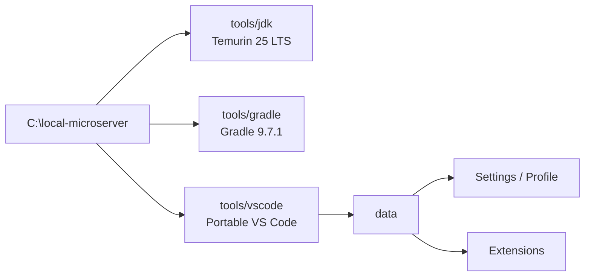
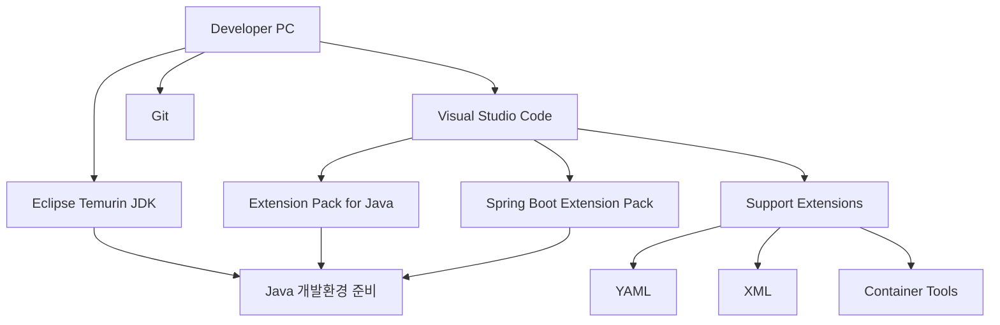

# VS Code Java / Spring Boot 개발환경 설정 원칙

## 1. 문서 목적

본 문서는 MicroServer 프로젝트의 표준 개발 도구인 **Visual Studio Code(VS Code)** 개발환경 구성에 대한 전체 방향과 세부 가이드의 진행 순서를 설명한다.

VS Code 환경 구성은 하나의 문서에서 모든 내용을 다루지 않고 다음과 같이 역할별로 분리한다.

```text
VS Code 개발환경 구성
 ├─ VS Code 설정 원칙
 ├─ VS Code 설치 및 기본 설정
 ├─ Java 개발 Extension 구성
 ├─ Spring Boot Extension 구성
 ├─ 개발 지원 Extension 및 Profile 구성
 └─ JDK 연계 및 개발환경 운영
```

현재 단계에서는 아직 MicroServer Spring Boot 프로젝트를 생성하지 않는다.

따라서 다음 작업은 이후 가이드에서 진행한다.

- Spring Boot 프로젝트 생성
- `build.gradle` / `settings.gradle` 작성 및 수정
- Gradle Dependency 구성
- Java Package / Class 작성
- `application.yml` 작성
- 애플리케이션 실행
- Debug 실행
- JUnit 테스트 작성
- Database 연결

본 단계의 목표는 **프로젝트를 생성하기 전에 VS Code를 Java / Spring Boot 개발용 IDE로 사용할 수 있도록 준비하는 것**이다.

---

## 2. 전체 개발환경 구성 순서

MicroServer 개발환경은 다음 순서로 구성한다.


현재 가이드는 다음 범위를 담당한다.


---

## 3. VS Code 환경 구성 원칙

MicroServer 프로젝트에서는 다음 원칙으로 VS Code 개발환경을 구성한다.

### 3.1 VS Code를 표준 IDE로 사용

프로젝트의 기본 개발 IDE는 VS Code로 통일한다.

개발자별로 다른 IDE를 사용하면 다음 항목에서 차이가 발생할 수 있다.

- JDK 인식 방식
- Build Tool 연계 방식
- Formatter
- Debug 설정
- Extension 지원
- Workspace 설정

따라서 프로젝트 가이드와 예제는 VS Code를 기준으로 작성한다.


### 3.2 Windows VS Code는 ZIP + Portable Mode를 기본으로 구성

MicroServer의 Windows 개발환경은 VS Code를 일반 User Installer로 설치하여
사용자 Profile 영역에 분산시키기보다 **Windows ZIP 배포본을 프로젝트 개발도구 영역에 압축 해제하고
Portable Mode로 사용하는 방식**을 기본으로 한다.

표준 위치:

```text
C:\local-microserver\tools\vscode
```


!!! tip "VS Code Windows ZIP 다운로드"
    MicroServer Windows 개발환경에서는 **VS Code Stable의 Windows ZIP 배포본**을 사용한다.

    공식 Download 페이지:

    **[Visual Studio Code 공식 Download](https://code.visualstudio.com/Download)**

    Download 페이지의 **Windows** 영역에서 다음 항목을 선택한다.

    ```text
    .zip
      ├─ x64
      └─ Arm64
    ```

    일반적인 Intel / AMD 기반 Windows 10·11 개발 PC는 **x64 ZIP**을 선택한다.

    최신 Stable 버전을 바로 받을 수도 있다.

    - **[Windows x64 ZIP - Latest Stable](https://update.code.visualstudio.com/latest/win32-x64-archive/stable)**
    - **[Windows Arm64 ZIP - Latest Stable](https://update.code.visualstudio.com/latest/win32-arm64-archive/stable)**

    대부분의 일반적인 회사용 Intel / AMD 노트북과 Desktop은 `x64`를 사용한다.
    Windows ARM 장비인 경우에만 `Arm64`를 선택한다.

!!! note "직접 다운로드 링크의 Version"
    위 `Latest Stable` 링크는 특정 VS Code Version을 고정한 주소가 아니라
    **현재 시점의 최신 Stable ZIP**을 내려받는 주소이다.

    프로젝트에서 VS Code Version까지 고정하여 배포할 경우에는
    검증한 Version의 ZIP을 별도로 보관하고 배포 Package의 Version 정보를 함께 기록한다.

VS Code ZIP을 위 경로에 압축 해제한 뒤 VS Code 실행 Directory 바로 아래에
`data` Directory를 만들면 Portable Mode가 활성화된다.

```text
C:\local-microserver\tools\vscode
├─ Code.exe
├─ bin\
├─ resources\
├─ ...
└─ data\
```

Portable Mode가 활성화되면 VS Code가 관리하는 주요 사용자 데이터가
설치 Directory 근처의 `data` 아래에 저장된다.

```text
data
├─ user-data     → Settings, UI 상태, Profile 등 VS Code User Data
└─ extensions    → 설치한 Extension
```

이 구조를 사용하는 가장 큰 이유는 JDK와 Gradle뿐 아니라 VS Code의
**설정과 Extension까지 동일한 개발환경 Package에 포함**할 수 있기 때문이다.



!!! important "Installer 방식과 Portable Mode를 혼합하지 않음"
    Windows Portable Mode는 **ZIP 배포본**을 기준으로 사용한다.

    Windows User Installer 또는 System Installer로 설치한 VS Code Directory에
    단순히 `data` 폴더를 추가하는 방식은 사용하지 않는다.

    MicroServer 배포용 개발환경은 처음부터 ZIP 배포본으로 별도 구성한다.

!!! note "Portable이라고 모든 외부 도구까지 자동 포함되는 것은 아님"
    Portable Mode는 VS Code가 관리하는 Settings, Extension, UI 상태 등을
    `data` 영역으로 모으는 기능이다.

    JDK, Gradle, Git, Docker Desktop처럼 VS Code 외부에서 실행되는 도구는
    별도로 준비해야 한다.

    MicroServer에서는 JDK와 Gradle도 `C:\local-microserver` 아래에 함께 배치하여
    개발환경 Package의 독립성을 높인다.


### 3.3 Java 기능은 Extension Pack으로 구성

Java 개발 기능은 개별 Extension을 임의로 조합하기보다 **Extension Pack for Java**를 기본 구성으로 사용한다.

이를 통해 개발자별 Extension 누락을 줄일 수 있다.

### 3.4 Spring Boot 기능은 Spring Boot Extension Pack으로 구성

Spring Boot 개발 기능은 **Spring Boot Extension Pack**을 기본 구성으로 사용한다.

Java Extension이 Java 언어 자체의 개발환경을 제공한다면 Spring Boot Extension은 그 위에 Spring 전용 개발 기능을 추가한다.

### 3.5 프로젝트별 JDK 운영

JDK는 OS 전체에 하나의 Java 버전을 고정하는 방식보다, 앞 단계에서 준비한 Eclipse Temurin JDK를 **프로젝트별 VS Code Workspace에서 선택하는 방식**을 기본으로 한다.

```text
Developer PC
 ├─ Temurin JDK 17
 ├─ Temurin JDK 21
 ├─ Temurin JDK 25 LTS
 └─ VS Code
      ├─ Project A → JDK A
      └─ Project B → JDK B
```

실제 Workspace 설정은 프로젝트 생성 이후 적용한다.

### 3.6 개발환경은 Directory 단위로 전달 가능한 구조를 지향

Windows 개발환경은 가능한 한 다음 Root 아래에서 관리한다.

```text
C:\local-microserver
│
├─ tools
│  ├─ jdk
│  │  └─ temurin-25
│  ├─ gradle
│  │  └─ gradle-9.7.1
│  └─ vscode
│     ├─ Code.exe
│     └─ data
│        ├─ user-data
│        └─ extensions
│
├─ gradle-home
├─ workspace
├─ repos
└─ env
   ├─ setup.cmd
   ├─ setup.ps1
   └─ start-vscode.cmd
```

이렇게 구성하면 개발환경을 다른 개발자에게 전달할 때
JDK, Gradle, VS Code, Extension, 공통 Settings를 하나의 기준 Directory에서 관리할 수 있다.

다만 **개발자가 실제로 사용하던 Portable VS Code의 `data`를 그대로 배포하지 않는다.**

배포용 환경은 별도로 깨끗하게 구성하여 다음 원칙을 적용한다.

- Microsoft / GitHub 계정에 로그인하지 않는다.
- Settings Sync를 사용하지 않는다.
- 개인 프로젝트나 개인 Workspace를 열지 않는다.
- 프로젝트 공통 Extension만 설치한다.
- 프로젝트 공통 Settings만 적용한다.
- 개인 인증정보나 Token을 저장하지 않는다.
- 배포 전 VS Code를 완전히 종료한 후 Package를 만든다.

이를 통해 VS Code Portable Mode의 장점은 유지하면서
개인 환경이 다른 개발자에게 전달되는 위험을 줄인다.


---

## 4. 세부 가이드 구성

### 4.1 VS Code 설치 및 기본 설정

다음 내용을 다룬다.

- Windows ZIP 배포본을 이용한 Portable Mode 구성
- `C:\local-microserver\tools\vscode` 표준 배치
- Portable `data` Directory와 User Data / Extension 저장 구조
- `start-vscode.cmd`를 이용한 독립 실행환경 구성
- Portable VS Code Update 및 배포 Package 관리
- macOS VS Code 설치와 Portable Mode 참고
- `code` 명령 사용 방식
- 주요 화면 구성
- Command Palette
- Extensions 화면
- Terminal
- UTF-8 등 기본 Editor 설정
- User Settings와 Workspace Settings의 차이

→ [VS Code 설치 및 기본 설정](vscode_install_basic_setup.md)

### 4.2 Java 개발 Extension 구성

다음 내용을 다룬다.

- Extension Pack for Java 설치
- Java Extension Pack을 사용하는 이유
- Language Support for Java
- Debugger for Java
- Test Runner for Java
- Gradle for Java
- Maven for Java (비교/호환)
- Project Manager for Java
- Visual Studio IntelliCode
- 각 Extension의 역할과 이후 사용 시점

→ [Java 개발 Extension 구성](java_extension_setup.md)

### 4.3 Spring Boot Extension 구성

다음 내용을 다룬다.

- Spring Boot Extension Pack 설치
- Spring Boot Tools
- Spring Initializr Java Support
- Spring Boot Dashboard
- Java Extension과 Spring Extension의 관계
- 현재 단계와 프로젝트 생성 이후 단계의 구분

→ [Spring Boot Extension 구성](spring_boot_extension_setup.md)

### 4.4 개발 지원 Extension 및 Profile 구성

다음 내용을 다룬다.

- YAML
- XML
- Container Tools
- CLI 일괄 설치
- 설치 상태 확인
- VS Code Profile
- Java Spring Profile Template
- Extension 자동 업데이트와 운영 원칙

→ [개발 지원 Extension 및 Profile 구성](support_extension_profile_setup.md)

### 4.5 JDK 연계 및 개발환경 운영

다음 내용을 다룬다.

- VS Code와 JDK의 관계
- `Java: Configure Java Runtime`
- 프로젝트별 JDK 운영 방향
- `JAVA_HOME` 의존 최소화
- Extension 문제 확인
- Output / Reload
- 현재 단계에서 하지 않는 작업
- 최종 환경 확인 체크리스트

→ [JDK 연계 및 개발환경 운영](jdk_workspace_environment_setup.md)

---

## 5. 완료 기준

VS Code 환경 구성 단계가 끝났을 때 다음 상태가 되어 있어야 한다.



완료 기준:

- Windows에서는 VS Code ZIP 배포본이 `C:\local-microserver\tools\vscode`에 준비되어 있다.
- Windows Portable Mode의 `data` Directory가 준비되어 있다.
- VS Code가 정상 실행된다.
- Java 개발용 Extension이 준비되어 있다.
- Spring Boot 개발용 Extension이 준비되어 있다.
- YAML / XML / Container 개발 지원 Extension이 준비되어 있다.
- Eclipse Temurin JDK가 준비되어 있다.
- VS Code의 Settings / Extension이 Portable `data` 영역에서 관리되는 구조를 이해했다.
- VS Code에서 프로젝트별 JDK를 연결할 수 있는 구조를 이해했다.
- 아직 Spring Boot 프로젝트를 생성하지 않았다.

---

## 6. 다음 단계

VS Code 환경 구성이 끝나면 **Spring Boot 프로젝트 생성 단계**로 진행한다.

```text
JDK 설치 및 설정
        ↓
Gradle 설치 및 기본 환경 구성
        ↓
VS Code 개발환경 구성       ← 현재
        ↓
Spring Boot 프로젝트 생성
        ↓
프로젝트 JDK / Gradle / VS Code 설정
```

JDK와 Gradle 기본 환경은 앞 단계에서 이미 준비되어 있다.

VS Code 단계에서는 IDE와 Java / Spring Boot 개발 Extension을 준비하고,
실제 프로젝트 JDK Runtime, Gradle Wrapper, `build.gradle`, `settings.gradle`, Workspace 설정 등은
Spring Boot 프로젝트가 생성된 이후의 **프로젝트 개발환경 설정 단계**에서 적용한다.


---

## 참고

- [VS Code 공식 Download](https://code.visualstudio.com/Download)
- [VS Code Portable Mode](https://code.visualstudio.com/docs/setup/portable)
- [VS Code Command Line Interface](https://code.visualstudio.com/docs/configure/command-line)
