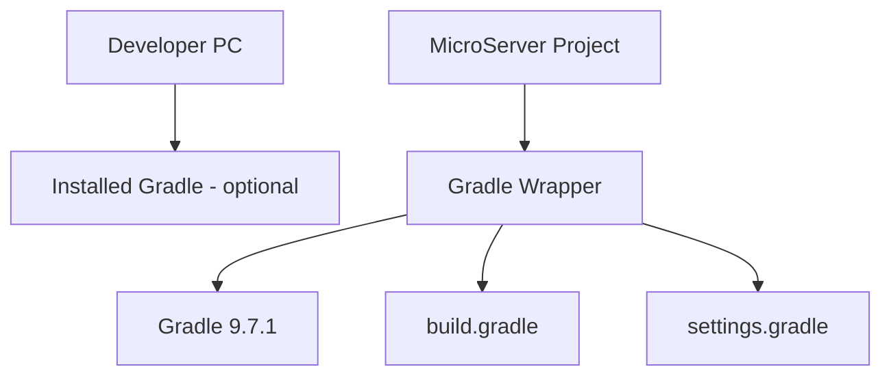

# Gradle Wrapper 및 프로젝트 Gradle 설정 가이드

## 1. 문서 목적

본 문서는 생성된 MicroServer Spring Boot 프로젝트의 Build 기준을
**Gradle Wrapper 중심으로 확정**하고, `build.gradle`과 `settings.gradle`의 기본 구조를 이해하는 방법을 설명한다.

MicroServer의 기본 Build Tool은 **Gradle + Groovy DSL**이다.

이번 단계의 핵심은 개발 PC에 설치한 `gradle` 명령을 사용하는 것이 아니라
프로젝트에 포함된 Wrapper를 통해 **모든 개발자와 CI/CD가 동일한 Gradle 버전으로 Build하도록 만드는 것**이다.

주요 목표:

- Spring Initializr가 생성한 Gradle Wrapper 확인
- Wrapper 구성 파일 이해
- Gradle 9.7.1 기준 확인 / 고정
- `settings.gradle` 역할 이해
- `build.gradle` 역할 이해
- Java Toolchain 26 확인
- Spring Boot Gradle Plugin 확인
- Dependency Configuration 이해
- Windows / macOS Wrapper 실행 확인
- 이후 모든 Project Build를 Wrapper 중심으로 실행
- 같은 설정을 Maven에서는 어떻게 표현하는지 비교

---

## 2. 현재 단계의 위치

```text
Spring Boot Project 생성
        ↓
JDK / VS Code Workspace 설정
        ↓
[ Gradle Wrapper / 프로젝트 Gradle 설정 ]      ← 현재
        ↓
Spring Boot 초기 실행 및 Build 검증
        ↓
Gradle Multi-Project 구성
```

---

## 3. 개발 PC Gradle과 Gradle Wrapper



### 개발 PC Gradle

```text
gradle
```

역할:

- Gradle 자체 학습
- Wrapper가 없는 프로젝트의 Wrapper 생성
- Wrapper 복구 / 업그레이드 보조

### 프로젝트 Gradle Wrapper

Windows:

```text
gradlew.bat
```

macOS / Linux:

```text
./gradlew
```

역할:

- Project Gradle Version 고정
- 개발자별 Gradle Version 차이 감소
- CI/CD와 Local Build 기준 일치
- 필요한 Gradle Distribution 자동 Download

!!! important "프로젝트 Build 표준"
    MicroServer 프로젝트 Build 명령은 특별한 이유가 없으면 `gradle`이 아니라
    **`gradlew` / `gradlew.bat` 기준으로 작성한다.**

---

## 4. 프로젝트 기준 버전

현재 MicroServer 기준:

```text
Spring Boot : 4.1.0
Java        : 26
Gradle      : 9.7.1
DSL         : Groovy
```

Spring Boot 4.1.0은 Gradle 8.14 이상 8.x와 Gradle 9.x를 지원한다.

Gradle 9.7.1은 Java 26에서 실행할 수 있으므로 현재 프로젝트 기준과 호환된다.

---

## 5. Spring Initializr 생성 파일 확인

Project Root에서 다음 파일을 확인한다.

```text
microserver/
├─ gradle/
│  └─ wrapper/
│     ├─ gradle-wrapper.jar
│     └─ gradle-wrapper.properties
├─ gradlew
├─ gradlew.bat
├─ build.gradle
├─ settings.gradle
└─ src/
```

각 파일의 역할:

| 파일 | 역할 |
|---|---|
| `gradlew` | macOS / Linux Wrapper Script |
| `gradlew.bat` | Windows Wrapper Script |
| `gradle-wrapper.jar` | Wrapper 실행 코드 |
| `gradle-wrapper.properties` | Gradle Distribution Version / URL |
| `settings.gradle` | Root Project 이름과 Subproject 구성 |
| `build.gradle` | Plugin, Dependency, Java, Build 설정 |

---

## 6. Maven 프로젝트와 파일 구조 비교

### Gradle

```text
microserver/
├─ gradle/
│  └─ wrapper/
├─ gradlew
├─ gradlew.bat
├─ settings.gradle
└─ build.gradle
```

### Maven 대응

```text
microserver/
├─ .mvn/
│  └─ wrapper/
├─ mvnw
├─ mvnw.cmd
└─ pom.xml
```

핵심 차이는 Maven이 많은 프로젝트 정보를 `pom.xml`에 집중하는 반면,
Gradle은 **프로젝트 구조와 Build Logic을 `settings.gradle`과 `build.gradle`로 분리**한다는 점이다.

---

## 7. Wrapper Version 확인

### Windows

```powershell
.\gradlew.bat --version
```

### macOS / Linux

```bash
./gradlew --version
```

확인 예:

```text
Gradle 9.7.1
JVM: 26
```

Gradle 버전뿐 아니라 실제로 어떤 JVM으로 Gradle이 실행되는지도 확인한다.

---

## 8. Wrapper Properties 확인

파일:

```text
gradle/wrapper/gradle-wrapper.properties
```

핵심 항목:

```properties
distributionUrl=https\://services.gradle.org/distributions/gradle-9.7.1-bin.zip
```

`distributionUrl`에 선언된 버전이 프로젝트가 사용할 Gradle 버전이다.

!!! note
    개발 PC의 `gradle --version`이 9.7.1이 아니더라도
    `./gradlew --version`이 9.7.1이면 프로젝트 Build는 9.7.1 기준으로 실행된다.

---

## 9. Wrapper Version을 변경해야 하는 경우

다음 경우 Wrapper를 갱신한다.

- Spring Initializr 생성 버전과 프로젝트 표준이 다른 경우
- Gradle Patch Version 업데이트가 필요한 경우
- Wrapper 파일을 복구해야 하는 경우

### Windows

```powershell
.\gradlew.bat :wrapper --gradle-version 9.7.1
```

### macOS / Linux

```bash
./gradlew :wrapper --gradle-version 9.7.1
```

Gradle 공식 가이드에서는 Wrapper 파일을 수동으로 직접 수정하기보다 Wrapper Task를 이용한 갱신을 권장한다.

---

## 10. `settings.gradle` 이해

단일 Project 초기 상태에서는 다음과 같이 단순할 수 있다.

```groovy
rootProject.name = 'microserver'
```

`settings.gradle`은 Gradle Build의 **프로젝트 구조 진입점**이다.

향후 Multi-Project로 전환하면 다음과 같이 Subproject를 선언한다.

```groovy
rootProject.name = 'microserver'

include 'module-common'
include 'runtime'
include 'admin'
```

### Maven 대응

Maven에서는 Parent `pom.xml`에 다음과 같이 Module을 선언한다.

```xml
<modules>
    <module>module-common</module>
    <module>runtime</module>
    <module>admin</module>
</modules>
```

즉 다음과 같이 이해한다.

```text
Gradle settings.gradle include
        ↕
Maven pom.xml <modules>
```

---

## 11. `build.gradle` 기본 구조

Spring Boot 4.1.0 / Java 26 기준 기본 형태는 다음과 같다.

```groovy
plugins {
    id 'java'
    id 'org.springframework.boot' version '4.1.0'
    id 'io.spring.dependency-management' version '1.1.7'
}

group = 'io.github.teammicroserver'
version = '0.0.1-SNAPSHOT'

java {
    toolchain {
        languageVersion = JavaLanguageVersion.of(26)
    }
}

repositories {
    mavenCentral()
}

dependencies {
    implementation 'org.springframework.boot:spring-boot-starter-webmvc'
    testImplementation 'org.springframework.boot:spring-boot-starter-webmvc-test'
    testRuntimeOnly 'org.junit.platform:junit-platform-launcher'
}

tasks.named('test') {
    useJUnitPlatform()
}
```

Spring Initializr 생성 결과는 시점이나 선택 Dependency에 따라 일부 항목이 달라질 수 있다.

---

## 12. `plugins {}` 이해

```groovy
plugins {
    id 'java'
    id 'org.springframework.boot' version '4.1.0'
    id 'io.spring.dependency-management' version '1.1.7'
}
```

역할:

### `java`

Java Compile, Test, JAR 등의 기본 Task와 Source Set을 제공한다.

### `org.springframework.boot`

Spring Boot 실행 및 Packaging 기능을 제공한다.

대표 Task:

```text
bootRun
bootJar
```

### `io.spring.dependency-management`

Spring Boot가 관리하는 Dependency Version을 사용하기 쉽게 한다.

---

## 13. Maven Plugin 설정과 비교

Maven에서는 Plugin이 대체로 다음 영역에 위치한다.

```xml
<build>
    <plugins>
        <plugin>
            <groupId>org.springframework.boot</groupId>
            <artifactId>spring-boot-maven-plugin</artifactId>
        </plugin>
    </plugins>
</build>
```

Gradle에서는:

```groovy
plugins {
    id 'org.springframework.boot' version '4.1.0'
}
```

처럼 선언한다.

Gradle의 Plugin은 Task와 DSL, Configuration을 Build에 추가하는 핵심 확장 단위이다.

---

## 14. Java Toolchain 확인

Gradle에서는 Java Version을 다음과 같이 명시한다.

```groovy
java {
    toolchain {
        languageVersion = JavaLanguageVersion.of(26)
    }
}
```

의미:

```text
MicroServer Source Build Java 기준
→ Java 26
```

### Maven 대응

Spring Boot Parent POM을 사용하는 Maven에서는 다음과 같이 표현할 수 있다.

```xml
<properties>
    <java.version>26</java.version>
</properties>
```

Gradle Toolchain은 단순한 Source Compatibility 값보다
Build Task가 사용할 Java Toolchain을 명시적으로 모델링할 수 있다는 장점이 있다.

---

## 15. Repository 설정

Gradle:

```groovy
repositories {
    mavenCentral()
}
```

여기서 `mavenCentral()`이라는 이름 때문에 Build Tool이 Maven인 것으로 오해하면 안 된다.

`Maven Central`은 **Artifact Repository 이름 / 형식**이고,
Gradle도 Maven Repository에서 Dependency를 다운로드할 수 있다.

### Maven 대응

Spring Boot Maven 프로젝트도 기본적으로 Maven Central의 Artifact를 사용한다.

즉:

```text
Build Tool = Gradle
Repository = Maven Central
```

은 정상적인 조합이다.

---

## 16. Dependency Configuration 이해

Gradle은 Dependency마다 사용 범위를 Configuration으로 표현한다.

대표 Configuration:

| Gradle | 의미 | Maven과 대략 대응 |
|---|---|---|
| `implementation` | Compile / Runtime에 필요한 구현 Dependency | 일반 `compile` Dependency |
| `api` | Consumer에게 노출되는 API Dependency | Java Library에서 사용, Maven compile과 유사 |
| `compileOnly` | Compile 시에만 필요 | `provided`와 일부 유사 |
| `runtimeOnly` | Runtime 시에만 필요 | `runtime` |
| `testImplementation` | Test Compile / Runtime | `test` |
| `testRuntimeOnly` | Test Runtime 전용 | `test` Runtime 성격 |

!!! note
    Gradle Configuration과 Maven Scope는 개념이 유사하지만 완전히 1:1 대응하지 않는다.

---

## 17. Dependency 선언 비교

### Gradle

```groovy
dependencies {
    implementation 'org.springframework.boot:spring-boot-starter-webmvc'
}
```

### Maven 대응

```xml
<dependency>
    <groupId>org.springframework.boot</groupId>
    <artifactId>spring-boot-starter-webmvc</artifactId>
</dependency>
```

Gradle의 문자열 표현:

```text
group:name:version
```

예:

```text
org.mybatis:mybatis:3.x.x
```

Spring Boot가 Version을 관리하는 Dependency는 Version을 생략할 수 있다.

---

## 18. Project Coordinate 이해

Gradle:

```groovy
group = 'io.github.teammicroserver'
version = '0.0.1-SNAPSHOT'
```

Project 이름:

```groovy
rootProject.name = 'microserver'
```

결과적으로 다음 Maven Coordinate 개념과 대응한다.

```text
io.github.teammicroserver:microserver:0.0.1-SNAPSHOT
```

Maven에서는:

```xml
<groupId>io.github.teammicroserver</groupId>
<artifactId>microserver</artifactId>
<version>0.0.1-SNAPSHOT</version>
```

---

## 19. Gradle Task 목록 확인

### Windows

```powershell
.\gradlew.bat tasks
```

### macOS / Linux

```bash
./gradlew tasks
```

주요 Task:

```text
build
clean
test
classes
jar
bootJar
bootRun
```

Gradle에서는 Build 기능을 **Task 단위**로 이해하는 것이 중요하다.

---

## 20. Maven Lifecycle과 Gradle Task 비교

Maven은 Lifecycle Phase를 중심으로 실행한다.

```text
validate
compile
test
package
verify
install
deploy
```

Gradle은 Task Dependency Graph를 통해 필요한 Task를 연결한다.

예:

```text
build
 ├─ check
 │   └─ test
 └─ assemble
     └─ jar / bootJar
```

따라서 다음 명령이 비슷한 목적을 가지더라도 내부 실행 모델은 다르다.

```text
Maven  : ./mvnw package
Gradle : ./gradlew build
```

---

## 21. Gradle Wrapper 실행 권한 - macOS / Linux

확인:

```bash
ls -l gradlew
```

실행 권한이 없다면:

```bash
chmod +x gradlew
```

Git에서도 실행 권한을 유지한다.

```bash
git update-index --chmod=+x gradlew
```

확인:

```bash
git diff --summary
```

---

## 22. Gradle User Home과 개인 설정

기본 위치:

### Windows

```text
C:\Users\<사용자>\.gradle
```

### macOS

```text
~/.gradle
```

사용자 설정 예:

```text
~/.gradle/gradle.properties
```

사내 Repository Credential이나 Proxy 설정이 필요한 경우
개인 환경 정보와 프로젝트 공통 설정을 분리한다.

!!! warning "Credential"
    사용자 ID / Password / Token을 `build.gradle`에 직접 작성하여 Commit하지 않는다.

### Maven 대응

```text
Gradle : ~/.gradle/gradle.properties
Maven  : ~/.m2/settings.xml
```

완전히 동일한 구조는 아니지만 **개인별 Build 환경 설정을 Project Source와 분리한다는 원칙**은 같다.

---

## 23. Project Build에 전역 Gradle을 사용하지 않는 이유

개발자 A:

```text
Gradle 9.7.1
```

개발자 B:

```text
Gradle 9.5.0
```

CI Server:

```text
Gradle 9.6.1
```

이런 환경에서 직접 `gradle build`를 사용하면 Build Tool Version 차이가 생긴다.

Wrapper를 사용하면:

```text
Developer A ─┐
Developer B ─┼─→ gradlew → Gradle 9.7.1
CI Server   ─┘
```

으로 통일할 수 있다.

---

## 24. Build Script 변경 후 VS Code 반영

`build.gradle` 또는 `settings.gradle`을 변경하면 VS Code Java / Gradle Extension이 Project Model을 다시 Import해야 할 수 있다.

기본적으로 자동 갱신되도록 구성하되 문제가 있는 경우 다음을 확인한다.

```text
Gradle Projects View
Java Projects View
Output → Build Server for Gradle
Output → Language Support for Java
```

필요하면 Java Project Import 또는 VS Code Reload를 수행한다.

---

## 25. 현재 단계에서 하지 않는 작업

```text
Gradle Multi-Project 전환
module-common 생성
runtime 생성
admin 생성
Oracle Driver 추가
Datasource 구성
Security 구성
공통 Framework 구현
```

현재 목표는 **단일 Spring Boot Project의 Build 기준을 Gradle Wrapper로 확정**하는 것이다.

---

## 26. 체크리스트

- [ ] `gradlew` / `gradlew.bat`이 존재한다.
- [ ] `gradle/wrapper/gradle-wrapper.properties`가 존재한다.
- [ ] Wrapper Gradle Version이 9.7.1이다.
- [ ] `./gradlew --version` 또는 `gradlew.bat --version`이 정상 실행된다.
- [ ] Gradle이 Java 26 JVM을 사용하는지 확인했다.
- [ ] `settings.gradle`의 역할을 이해했다.
- [ ] `build.gradle`의 역할을 이해했다.
- [ ] Spring Boot Gradle Plugin을 확인했다.
- [ ] Java Toolchain 26 설정을 확인했다.
- [ ] `implementation`, `testImplementation`의 의미를 이해했다.
- [ ] Project Build는 Wrapper를 사용한다는 원칙을 이해했다.
- [ ] Maven의 `pom.xml`, Lifecycle, Wrapper와 대응 관계를 이해했다.

---

## 27. 다음 단계

다음 단계에서는 현재 단일 Module 프로젝트가 정상적으로 Build / Test / Run 되는지 검증한다.

```text
Spring Boot Project 생성
        ↓
JDK / VS Code Workspace 설정
        ↓
Gradle Wrapper / 프로젝트 Gradle 설정       ← 현재 완료
        ↓
초기 Build / Test / Run 검증
        ↓
Gradle Multi-Project 구성
```

---

## 28. 공식 참고 자료

- Gradle Wrapper  
  <https://docs.gradle.org/current/userguide/gradle_wrapper.html>

- Gradle Build Lifecycle  
  <https://docs.gradle.org/current/userguide/build_lifecycle.html>

- Gradle Dependency Management  
  <https://docs.gradle.org/current/userguide/dependency_management_basics.html>

- Spring Boot Gradle Plugin  
  <https://docs.spring.io/spring-boot/gradle-plugin/>

- Spring Boot System Requirements  
  <https://docs.spring.io/spring-boot/system-requirements.html>
