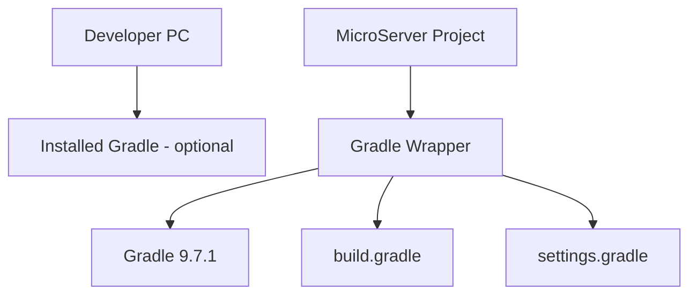

# Gradle Wrapper 확인 및 프로젝트 Build 기준 가이드

## 1. 문서 목적

본 문서는 생성된 MicroServer Spring Boot 프로젝트의 Build 기준을
**Gradle Wrapper 중심으로 확정**하고, `build.gradle`과 `settings.gradle`의 기본 구조를 이해하는 방법을 설명한다.

MicroServer의 기본 Build Tool은 **Gradle + Groovy DSL**이다.

이번 단계의 핵심은 개발 PC에 설치한 `gradle` 명령을 사용하는 것이 아니라
프로젝트에 포함된 Wrapper를 통해 **모든 개발자와 CI/CD가 동일한 Gradle 버전으로 Build하도록 만드는 것**이다.

주요 목표:

- Spring Initializr가 생성한 Gradle Wrapper 확인
- Wrapper 구성 파일 이해
- Gradle 9.7.1 기준 확인 / 고정
- `settings.gradle` 역할 이해
- `build.gradle` 역할 이해
- Java Toolchain 26 확인
- Spring Boot Gradle Plugin 확인
- Dependency Configuration 이해
- Windows / macOS Wrapper 실행 확인
- 이후 모든 Project Build를 Wrapper 중심으로 실행
- 같은 설정을 Maven에서는 어떻게 표현하는지 비교

---

## 2. 현재 단계의 위치

```text
Spring Boot Project 생성
        ↓
JDK / VS Code Workspace 설정
        ↓
[ Gradle Wrapper 확인 / 프로젝트 Build 기준 ]      ← 현재
        ↓
Spring Boot 초기 실행 및 Build 검증
        ↓
Gradle Multi-Project 구성
```

---

## 3. 개발 PC Gradle과 Gradle Wrapper



### 개발 PC Gradle

```text
gradle
```

역할:

- Gradle 자체 학습
- Wrapper가 없는 프로젝트의 Wrapper 생성
- Wrapper 복구 / 업그레이드 보조

### 프로젝트 Gradle Wrapper

Windows:

```text
gradlew.bat
```

macOS / Linux:

```text
./gradlew
```

역할:

- Project Gradle Version 고정
- 개발자별 Gradle Version 차이 감소
- CI/CD와 Local Build 기준 일치
- 필요한 Gradle Distribution 자동 Download

!!! important "프로젝트 Build 표준"
    MicroServer 프로젝트 Build 명령은 특별한 이유가 없으면 `gradle`이 아니라
    **`gradlew` / `gradlew.bat` 기준으로 작성한다.**

---

## 4. 프로젝트 기준 버전

현재 MicroServer 기준:

```text
Spring Boot : 4.1.0
Java        : 26
Gradle      : 9.7.1
DSL         : Groovy
```

Spring Boot 4.1.0은 Gradle 8.14 이상 8.x와 Gradle 9.x를 지원한다.

Gradle 9.7.1은 Java 26에서 실행할 수 있으므로 현재 프로젝트 기준과 호환된다.

---

## 5. Spring Initializr 생성 파일 확인

Project Root에서 다음 파일을 확인한다.

```text
microserver/
├─ gradle/
│  └─ wrapper/
│     ├─ gradle-wrapper.jar
│     └─ gradle-wrapper.properties
├─ gradlew
├─ gradlew.bat
├─ build.gradle
├─ settings.gradle
└─ src/
```

각 파일의 역할:

| 파일 | 역할 |
|---|---|
| `gradlew` | macOS / Linux Wrapper Script |
| `gradlew.bat` | Windows Wrapper Script |
| `gradle-wrapper.jar` | Wrapper 실행 코드 |
| `gradle-wrapper.properties` | Gradle Distribution Version / URL |
| `settings.gradle` | Root Project 이름과 Subproject 구성 |
| `build.gradle` | Plugin, Dependency, Java, Build 설정 |

---

## 6. Maven 프로젝트와 파일 구조 비교

### Gradle

```text
microserver/
├─ gradle/
│  └─ wrapper/
├─ gradlew
├─ gradlew.bat
├─ settings.gradle
└─ build.gradle
```

### Maven 대응

```text
microserver/
├─ .mvn/
│  └─ wrapper/
├─ mvnw
├─ mvnw.cmd
└─ pom.xml
```

핵심 차이는 Maven이 많은 프로젝트 정보를 `pom.xml`에 집중하는 반면,
Gradle은 **프로젝트 구조와 Build Logic을 `settings.gradle`과 `build.gradle`로 분리**한다는 점이다.

---

## 7. Wrapper Version 확인

### Windows

```powershell
.\gradlew.bat --version
```

### macOS / Linux

```bash
./gradlew --version
```

확인 예:

```text
Gradle 9.7.1
JVM: 26
```

Gradle 버전뿐 아니라 실제로 어떤 JVM으로 Gradle이 실행되는지도 확인한다.

---

## 8. Wrapper Properties 확인

파일:

```text
gradle/wrapper/gradle-wrapper.properties
```

핵심 항목:

```properties
distributionUrl=https\://services.gradle.org/distributions/gradle-9.7.1-bin.zip
```

`distributionUrl`에 선언된 버전이 프로젝트가 사용할 Gradle 버전이다.

!!! note
    개발 PC의 `gradle --version`이 9.7.1이 아니더라도
    `./gradlew --version`이 9.7.1이면 프로젝트 Build는 9.7.1 기준으로 실행된다.

---

## 9. Wrapper Version을 변경해야 하는 경우

다음 경우 Gradle Wrapper가 사용할 Gradle Version을 변경하거나 갱신한다.

- Spring Initializr가 생성한 Gradle Version과 프로젝트 표준 Version이 다른 경우
- Gradle Patch Version 업데이트가 필요한 경우
- Wrapper 설정을 특정 Gradle Version으로 맞춰야 하는 경우
- Wrapper 파일을 복구하거나 다시 생성해야 하는 경우

!!! important "Gradle Wrapper Version 변경 명령"

    아래 명령은 **Gradle Wrapper가 사용할 Gradle Version을 변경하는 명령**이다.

    예를 들어 `9.7.1`을 지정하면
    이 Project의 Gradle Wrapper가 **Gradle 9.7.1을 사용하도록 Wrapper 설정을 갱신**한다.

    ```text
    Gradle Wrapper Version 변경
            ↓
    wrapper Task 실행
            ↓
    --gradle-version 9.7.1 지정
            ↓
    Gradle Wrapper가 사용할 Version을 9.7.1로 변경
    ```

### Windows

```powershell
.\gradlew.bat wrapper --gradle-version 9.7.1
```

의미:

```text
.\gradlew.bat
→ 현재 Project의 Gradle Wrapper를 사용하여 Gradle 실행

wrapper
→ Gradle Wrapper 관련 파일과 설정을 생성 / 갱신하는 Task

--gradle-version 9.7.1
→ Gradle Wrapper가 사용할 Gradle Version을 9.7.1로 변경
```

### macOS / Linux

```bash
./gradlew wrapper --gradle-version 9.7.1
```

동일하게 현재 Project의 Gradle Wrapper가 사용할 Gradle Version을
**9.7.1로 변경**한다.

### 실행 후 변경되는 핵심 설정

명령 실행 후 다음 파일의 Wrapper 설정이 갱신된다.

```text
gradle/wrapper/gradle-wrapper.properties
```

대표적으로 `distributionUrl`이 지정한 Gradle Version을 가리키게 된다.

```properties
distributionUrl=https\://services.gradle.org/distributions/gradle-9.7.1-bin.zip
```

즉 다음과 같이 이해하면 된다.

```text
.\gradlew.bat wrapper --gradle-version 9.7.1
        ↓
Gradle Wrapper Version을 9.7.1로 변경
        ↓
gradle-wrapper.properties 갱신
        ↓
이후 gradlew / gradlew.bat 실행 시 Gradle 9.7.1 사용
```

!!! note "`wrapper`와 `:wrapper`"

    Root Project의 `wrapper` Task는 다음 두 형태로 표현할 수 있다.

    ```text
    wrapper
    :wrapper
    ```

    `:wrapper`는 Root Project의 Task Path를 명시한 표현이다.

    현재 MicroServer처럼 단일 Root Project에서 실행하는 일반적인 예제에서는
    보다 간단하게 다음 형식을 사용한다.

    ```powershell
    .\gradlew.bat wrapper --gradle-version 9.7.1
    ```

Gradle Wrapper Version 변경은 `gradle-wrapper.properties`의 Version 문자열을
직접 수정하는 방식보다 **Wrapper Task를 통해 갱신하는 방식을 기본으로 사용**한다.

---

## 10. `settings.gradle` 이해

단일 Project 초기 상태에서는 다음과 같이 단순할 수 있다.

```groovy
rootProject.name = 'microserver'
```

`settings.gradle`은 Gradle Build의 **프로젝트 구조 진입점**이다.

향후 Multi-Project로 전환하면 다음과 같이 Subproject를 선언한다.

```groovy
rootProject.name = 'microserver'

include 'module-common'
include 'runtime'
include 'admin'
```

### Maven 대응

Maven에서는 Parent `pom.xml`에 다음과 같이 Module을 선언한다.

```xml
<modules>
    <module>module-common</module>
    <module>runtime</module>
    <module>admin</module>
</modules>
```

즉 다음과 같이 이해한다.

```text
Gradle settings.gradle include
        ↕
Maven pom.xml <modules>
```

---

## 11. `build.gradle` 기본 구조

Spring Boot 4.1.0 / Java 26 기준 기본 형태는 다음과 같다.

```groovy
plugins {
    id 'java'
    id 'org.springframework.boot' version '4.1.0'
    id 'io.spring.dependency-management' version '1.1.7'
}

group = 'io.github.teammicroserver'
version = '0.0.1-SNAPSHOT'

java {
    toolchain {
        languageVersion = JavaLanguageVersion.of(26)
    }
}

repositories {
    mavenCentral()
}

dependencies {
    implementation 'org.springframework.boot:spring-boot-starter-webmvc'
    testImplementation 'org.springframework.boot:spring-boot-starter-webmvc-test'
    testRuntimeOnly 'org.junit.platform:junit-platform-launcher'
}

tasks.named('test') {
    useJUnitPlatform()
}
```

Spring Initializr 생성 결과는 시점이나 선택 Dependency에 따라 일부 항목이 달라질 수 있다.

---

## 12. `plugins {}` 이해

```groovy
plugins {
    id 'java'
    id 'org.springframework.boot' version '4.1.0'
    id 'io.spring.dependency-management' version '1.1.7'
}
```

역할:

### `java`

Java Compile, Test, JAR 등의 기본 Task와 Source Set을 제공한다.

### `org.springframework.boot`

Spring Boot 실행 및 Packaging 기능을 제공한다.

대표 Task:

```text
bootRun
bootJar
```

### `io.spring.dependency-management`

Spring Boot가 관리하는 Dependency Version을 사용하기 쉽게 한다.

---

## 13. Maven Plugin 설정과 비교

Maven에서는 Plugin이 대체로 다음 영역에 위치한다.

```xml
<build>
    <plugins>
        <plugin>
            <groupId>org.springframework.boot</groupId>
            <artifactId>spring-boot-maven-plugin</artifactId>
        </plugin>
    </plugins>
</build>
```

Gradle에서는:

```groovy
plugins {
    id 'org.springframework.boot' version '4.1.0'
}
```

처럼 선언한다.

Gradle의 Plugin은 Task와 DSL, Configuration을 Build에 추가하는 핵심 확장 단위이다.

---

## 14. Java Toolchain 확인

Gradle에서는 Java Version을 다음과 같이 명시한다.

```groovy
java {
    toolchain {
        languageVersion = JavaLanguageVersion.of(26)
    }
}
```

의미:

```text
MicroServer Source Build Java 기준
→ Java 26
```

### Maven 대응

Spring Boot Parent POM을 사용하는 Maven에서는 다음과 같이 표현할 수 있다.

```xml
<properties>
    <java.version>26</java.version>
</properties>
```

Gradle Toolchain은 단순한 Source Compatibility 값보다
Build Task가 사용할 Java Toolchain을 명시적으로 모델링할 수 있다는 장점이 있다.

---

## 15. Repository 설정

`build.gradle`의 `repositories {}`는
**Project에서 사용하는 Dependency를 어디에서 검색하고 다운로드할지 지정하는 영역**이다.

현재 MicroServer Project에서는 다음 설정을 사용한다.

```groovy
repositories {
    mavenCentral()
}
```

`mavenCentral()`은 Gradle에게 다음과 같이 알려주는 설정이다.

```text
"이 Project에서 필요한 Library / Dependency를
Maven Central Repository에서 검색하고 다운로드한다."
```

### 15.1 Build Tool과 Repository는 서로 다른 개념

여기서 `mavenCentral()`이라는 이름 때문에
현재 Project의 Build Tool이 Maven이라고 생각하면 안 된다.

**Gradle / Maven은 Build Tool이고, Maven Central은 Artifact Repository이다.**

역할을 구분하면 다음과 같다.

| 구분 | 예 | 역할 |
|---|---|---|
| Build Tool | Gradle, Maven | Compile / Test / Packaging / Dependency 관리 등 Build 수행 |
| Artifact Repository | Maven Central | Library / Plugin 등의 Artifact를 저장하고 제공 |

현재 MicroServer Project는 다음 조합이다.

```text
Build Tool
→ Gradle

Artifact Repository
→ Maven Central
```

즉:

```text
Gradle
→ Project Build를 수행

Maven Central
→ Build에 필요한 외부 Library를 제공
```

서로 담당하는 역할이 다르므로
**Gradle Project가 Maven Central을 사용하는 것은 일반적인 구성**이다.

### 15.2 Dependency가 다운로드되는 흐름

예를 들어 `build.gradle`에 다음 Dependency가 있다고 가정한다.

```groovy
dependencies {
    implementation 'org.springframework.boot:spring-boot-starter-webmvc'
}
```

Gradle은 Dependency 선언만 보고 Library 파일을 직접 가지고 있는 것이 아니다.

`repositories {}`에 설정된 Repository를 이용해 필요한 Artifact를 찾는다.

```text
build.gradle

dependencies {
    implementation 'org.springframework.boot:spring-boot-starter-webmvc'
}
        ↓
Gradle이 Dependency 확인
        ↓
repositories {
    mavenCentral()
}
        ↓
Maven Central Repository 조회
        ↓
필요한 Artifact / Metadata 다운로드
        ↓
Gradle Cache 저장
        ↓
Compile / Test / Runtime 등에 사용
```

따라서 `dependencies {}`와 `repositories {}`는 서로 연관되어 있다.

```text
dependencies
→ 무엇을 사용할 것인가?

repositories
→ 그것을 어디에서 가져올 것인가?
```

### 15.3 Maven Central이란

Maven Central은 Java / JVM 생태계에서 널리 사용하는
대표적인 Public Artifact Repository이다.

Spring, JUnit, Jackson, Logback 등
많은 Open Source Library가 Maven Central을 통해 배포된다.

Gradle은 Maven Repository 형식을 지원하므로
Maven Build Tool을 사용하지 않더라도 Maven Central의 Artifact를 사용할 수 있다.

```text
Maven Central
        ↓
Artifact Repository
        ↓
Spring / JUnit / Jackson / 기타 Library 제공
        ↓
Gradle 또는 Maven에서 사용 가능
```

!!! important "`Maven`이라는 이름이 두 곳에서 등장하지만 역할이 다름"

    ```text
    Maven
    → Build Tool

    Maven Central
    → Artifact Repository
    ```

    이름은 관련되어 있지만 동일한 개념이 아니다.

### 15.4 Maven Project도 Maven Central을 사용할 수 있음

Maven Project 역시 기본적으로 Maven Central의 Artifact를 사용할 수 있다.

즉 Gradle과 Maven 모두 같은 Repository에서 Dependency를 받을 수 있다.

```text
                 Maven Central
                      │
              ┌───────┴───────┐
              ↓               ↓
           Gradle            Maven
         Build Tool        Build Tool
```

차이는 **어느 Repository를 사용하는가**가 아니라
**Build를 어떤 Tool과 설정 방식으로 수행하는가**에 있다.

예:

```text
Gradle
→ build.gradle
→ repositories { mavenCentral() }
→ dependencies { ... }

Maven
→ pom.xml
→ repositories / 기본 Central 설정
→ dependencies
```

따라서 다음 구성은 정상적이다.

```text
Build Tool = Gradle
Repository = Maven Central
```

### 15.5 Maven Central 외 Repository도 사용할 수 있음

Gradle은 Maven Central만 사용할 수 있는 것이 아니다.

필요에 따라 여러 Artifact Repository를 구성할 수 있다.

예:

```groovy
repositories {
    mavenCentral()

    // 필요 시 사내 Maven Repository 등을 추가할 수 있다.
    // maven {
    //     url = uri('https://repository.example.com/maven')
    // }
}
```

실제 금융 / Enterprise 프로젝트에서는
외부 인터넷의 Maven Central에 직접 접근하지 않고
Nexus 또는 Artifactory 같은 **사내 Artifact Repository**를 경유하도록 구성하는 경우도 많다.

개념적으로:

```text
개발자 / CI
     ↓
   Gradle
     ↓
사내 Artifact Repository
(Nexus / Artifactory 등)
     ↓
Maven Central 등 외부 Repository
```

이 경우에도 Build Tool은 계속 Gradle이며,
**Dependency를 가져오는 Repository 위치만 달라지는 것**이다.

!!! note "MicroServer 현재 단계"

    현재 MicroServer Project에서는 우선 Spring Initializr가 생성한 기본 설정인

    ```groovy
    repositories {
        mavenCentral()
    }
    ```

    을 그대로 사용한다.

    사내 Repository, Nexus / Artifactory, 인증 정보 등의 구성은
    실제 운영 환경 또는 사내 개발환경 연계 단계에서 별도로 다룬다.

---

## 16. Dependency Configuration 이해

Gradle은 Dependency마다 **어느 범위에서 사용할지**를 Configuration으로 구분한다.

```groovy
dependencies {
    implementation 'org.springframework.boot:spring-boot-starter-webmvc'
    compileOnly 'org.projectlombok:lombok:<version>'
    runtimeOnly 'org.postgresql:postgresql:<version>'

    testImplementation 'org.springframework.boot:spring-boot-starter-webmvc-test'
    testRuntimeOnly 'org.junit.platform:junit-platform-launcher'
}
```

대표 Configuration:

| Gradle | 주요 의미 | Maven과 대략 대응 |
|---|---|---|
| `implementation` | Compile / Runtime에서 사용하는 일반 Dependency | `compile`과 유사 |
| `api` | Library의 공개 API를 통해 Consumer에도 노출해야 하는 Dependency | `compile`과 유사 |
| `compileOnly` | Compile할 때만 필요 | `provided`와 일부 유사 |
| `runtimeOnly` | Runtime에만 필요 | `runtime` |
| `testImplementation` | Test Compile / Runtime | `test` |
| `testRuntimeOnly` | Test Runtime에만 필요 | 정확한 1:1 Scope 없음 |

!!! note "Gradle과 Maven Scope는 완전히 1:1이 아님"

    역할이 비슷한 항목을 비교한 것이며
    Dependency 전달 방식과 Classpath 구성에는 차이가 있다.

### `implementation`

현재 Spring Boot Application에서 가장 기본적으로 사용하는 Configuration이다.

```groovy
dependencies {
    implementation 'org.springframework.boot:spring-boot-starter-webmvc'
}
```

의미:

```text
현재 Module의 Compile / Runtime에 사용
→ 다른 Module에 공개할 목적은 아님
```

Maven에서는 일반 `compile` Dependency와 가장 비슷하다.

```xml
<dependency>
    <groupId>org.springframework.boot</groupId>
    <artifactId>spring-boot-starter-webmvc</artifactId>
</dependency>
```

### `api`

`api`는 **공통 Library Module의 공개 API에 특정 Dependency Type이 노출될 때** 사용한다.

예를 들어 `module-common`이 Jackson의 `ObjectMapper`를 직접 반환한다고 가정한다.

```java
public ObjectMapper createMapper() {
    return new ObjectMapper();
}
```

이 경우 `module-common`을 사용하는 다른 Module도
`ObjectMapper` Type을 알아야 하므로:

```groovy
plugins {
    id 'java-library'
}

dependencies {
    api 'com.fasterxml.jackson.core:jackson-databind:<version>'
}
```

처럼 선언할 수 있다.

```text
runtime / admin
      ↓
module-common
      ↓ api
jackson-databind
```

`module-common`을 사용하는 Module은
Jackson Dependency를 별도로 선언하지 않아도 Compile Classpath에서 사용할 수 있다.

다만 Java Source에서 `ObjectMapper`를 직접 사용한다면
Java `import` 문은 여전히 필요하다.

!!! important "`api`를 공통 Dependency 창고처럼 사용하지 않음"

    `module-common`에 모든 공통 Library를 `api`로 몰아넣으면
    다른 Module이 직접 사용하는 Dependency가 숨겨질 수 있다.

    기준은 다음과 같이 잡는다.

    ```text
    module-common의 공개 API에 Library Type이 노출됨
    → module-common의 api

    module-common 내부에서만 사용
    → module-common의 implementation

    runtime이 직접 사용하는 Library
    → runtime의 implementation

    admin이 직접 사용하는 Library
    → admin의 implementation
    ```

    즉 **편의를 위해 모든 공통 Dependency를 `api`로 전달하지 않는다.**

!!! tip "현재 MicroServer에서는"

    현재 단계는 Spring Boot Application이므로
    대부분 `implementation`을 사용한다.

    `api`는 향후 `module-common` 같은 Library Module에
    `java-library` Plugin을 적용할 때 주로 사용한다.

### `compileOnly`

Compile 시에는 필요하지만 Runtime에는 포함하지 않는다.

```groovy
dependencies {
    compileOnly 'org.projectlombok:lombok:<version>'
}
```

Maven의 `provided`와 일부 유사하다.

```xml
<dependency>
    <groupId>org.projectlombok</groupId>
    <artifactId>lombok</artifactId>
    <version>...</version>
    <scope>provided</scope>
</dependency>
```

### `runtimeOnly`

Compile에는 직접 필요하지 않고 실행 시에만 필요하다.

```groovy
dependencies {
    runtimeOnly 'org.postgresql:postgresql:<version>'
}
```

JDBC Driver가 대표적인 예다.

Maven:

```xml
<dependency>
    <groupId>org.postgresql</groupId>
    <artifactId>postgresql</artifactId>
    <version>...</version>
    <scope>runtime</scope>
</dependency>
```

### `testImplementation`

Test Source Compile과 Test 실행에 사용한다.

```groovy
dependencies {
    testImplementation 'org.springframework.boot:spring-boot-starter-webmvc-test'
}
```

Maven의 `test` Scope와 유사하다.

### `testRuntimeOnly`

Test Compile에는 필요하지 않고 Test 실행 시에만 사용한다.

```groovy
dependencies {
    testRuntimeOnly 'org.junit.platform:junit-platform-launcher'
}
```

Maven에는 `testRuntimeOnly`와 정확히 같은 표준 Scope는 없다.

---

## 17. Dependency 선언과 Coordinate 이해

Gradle Dependency 선언은 다음 두 정보를 함께 표현한다.

```text
Configuration
→ 언제 사용할 것인가?

Coordinate
→ 어떤 Library를 사용할 것인가?
```

예:

```groovy
implementation 'org.mybatis:mybatis:3.x.x'
```

구조:

```text
implementation 'org.mybatis:mybatis:3.x.x'
      │              │       │      │
      │              │       │      └─ version
      │              │       └──────── name
      │              └──────────────── group
      └─────────────────────────────── Configuration
```

즉:

```text
implementation
→ Compile / Runtime에서 사용

org.mybatis
→ Group

mybatis
→ Artifact 이름

3.x.x
→ Version
```

Maven에서는 같은 정보를 XML로 표현한다.

```xml
<dependency>
    <groupId>org.mybatis</groupId>
    <artifactId>mybatis</artifactId>
    <version>3.x.x</version>
    <scope>compile</scope>
</dependency>
```

### Spring Boot Dependency에서 Version이 없는 이유

현재 Project 예:

```groovy
dependencies {
    implementation 'org.springframework.boot:spring-boot-starter-webmvc'
}
```

일반적인 형식은 `group:name:version`이지만
Spring Boot가 관리하는 Dependency는 Version을 생략할 수 있다.

```text
Spring Boot Dependency Management
        ↓
관리 대상 Dependency Version 제공
        ↓
개별 Dependency Version 생략 가능
```

관리 대상이 아닌 Dependency는 Version을 직접 지정해야 할 수 있다.

```groovy
implementation 'org.mybatis:mybatis:3.x.x'
```

!!! important "Version 생략 여부"

    Version을 생략할 수 있는지는
    해당 Dependency가 Spring Boot BOM / Dependency Management의
    관리 대상인지 확인해야 한다.

---

## 18. Project Coordinate 이해

Dependency가 `group:name:version`으로 식별되듯
**우리 Project도 Artifact가 되면 Coordinate를 가진다.**

현재 MicroServer 기준:

`build.gradle`:

```groovy
group = 'io.github.microserverlab'
version = '0.0.1-SNAPSHOT'
```

`settings.gradle`:

```groovy
rootProject.name = 'microserver'
```

개념적인 Project Coordinate:

```text
io.github.microserverlab:microserver:0.0.1-SNAPSHOT
```

대응 관계:

| Gradle | Maven |
|---|---|
| `group` | `groupId` |
| `rootProject.name` | `artifactId`에 대응하는 이름으로 이해 |
| `version` | `version` |

Maven:

```xml
<groupId>io.github.microserverlab</groupId>
<artifactId>microserver</artifactId>
<version>0.0.1-SNAPSHOT</version>
```

향후 이 Project 또는 Library Module을 Repository에 Publish하면
다른 Project에서 Dependency로 사용할 수 있다.

예:

```groovy
dependencies {
    implementation 'io.github.microserverlab:microserver:0.0.1-SNAPSHOT'
}
```

!!! note "`rootProject.name`과 artifactId"

    현재 단순 Project에서는 `rootProject.name`을
    Maven의 `artifactId`와 대응해서 이해하면 편리하다.

    실제 Publish Artifact 이름은 별도 Publishing / Archive 설정에 따라 달라질 수 있다.

### 16~18장 핵심 정리

```text
Repository
→ 어디에서 가져오는가?

Dependency Coordinate
→ 무엇을 가져오는가?

Configuration
→ 언제 사용하는가?

Project Coordinate
→ 우리 Project는 어떤 Artifact인가?
```

그리고 Multi-Project에서는 다음 원칙을 사용한다.

```text
module-common의 공개 API에 필요한 Dependency
→ api

module-common 내부 구현용 Dependency
→ implementation

runtime / admin이 직접 사용하는 Dependency
→ 각 Module에서 implementation

전체 Module의 Dependency Version 통일
→ BOM / Version Catalog / Platform 등으로 관리
```

즉 `module-common`의 `api`는
**공통 Dependency를 한곳에 모아 편하게 전달하기 위한 용도라기보다
공개 API에 필요한 Dependency를 Consumer에게 전달하기 위한 용도**로 이해한다.

---

## 19. Gradle Task 목록 확인

### Windows

```powershell
.\gradlew.bat tasks
```

### macOS / Linux

```bash
./gradlew tasks
```

주요 Task:

```text
build
clean
test
classes
jar
bootJar
bootRun
```

Gradle에서는 Build 기능을 **Task 단위**로 이해하는 것이 중요하다.

---

## 20. Maven Lifecycle과 Gradle Task 비교

Maven은 Lifecycle Phase를 중심으로 실행한다.

```text
validate
compile
test
package
verify
install
deploy
```

Gradle은 Task Dependency Graph를 통해 필요한 Task를 연결한다.

예:

```text
build
 ├─ check
 │   └─ test
 └─ assemble
     └─ jar / bootJar
```

따라서 다음 명령이 비슷한 목적을 가지더라도 내부 실행 모델은 다르다.

```text
Maven  : ./mvnw package
Gradle : ./gradlew build
```

---

## 21. Gradle Wrapper 실행 권한 - macOS / Linux

확인:

```bash
ls -l gradlew
```

실행 권한이 없다면:

```bash
chmod +x gradlew
```

Git에서도 실행 권한을 유지한다.

```bash
git update-index --chmod=+x gradlew
```

확인:

```bash
git diff --summary
```

---

## 22. `GRADLE_HOME`과 `GRADLE_USER_HOME` 구분

MicroServer Portable 환경에서는 Gradle 관련 경로를
`C:\local-microserver` 하위에서 관리한다.

가장 먼저 구분해야 할 점은
**`GRADLE_HOME`과 `GRADLE_USER_HOME`은 서로 다른 목적의 경로**라는 것이다.

```text
GRADLE_HOME
→ C:\local-microserver\tools\gradle\gradle-9.7.1\
→ Gradle 프로그램 설치 위치

GRADLE_USER_HOME
→ C:\local-microserver\gradle-home\
→ Gradle 실행 데이터 저장 위치
```

!!! important "`gradle-home`은 폴더 이름"

    ```text
    C:\local-microserver\gradle-home\
    ```

    위 경로의 `gradle-home`은 단순한 **실제 디렉터리 이름**이다.

    이 디렉터리는 `GRADLE_HOME`이 아니라
    `GRADLE_USER_HOME` 환경변수가 가리키는 위치이다.

    ```text
    GRADLE_HOME
    → C:\local-microserver\tools\gradle\gradle-9.7.1\

    GRADLE_USER_HOME
    → C:\local-microserver\gradle-home\
    ```

### 22.1 `GRADLE_HOME` - Gradle 프로그램 설치 위치

MicroServer에서 Gradle 프로그램 자체는 다음 실제 디렉터리에 설치되어 있다.

```text
C:\local-microserver\tools\gradle\gradle-9.7.1\
```

구조 예:

```text
C:\local-microserver\tools\gradle\gradle-9.7.1\
├─ bin\
├─ lib\
├─ init.d\
└─ ...
```

즉:

```text
GRADLE_HOME
→ Gradle 프로그램 설치 디렉터리
```

### 22.2 `GRADLE_USER_HOME` - Gradle 실행 데이터 저장 위치

Gradle은 실행되면서 Dependency Cache, Daemon, Wrapper Distribution 등
여러 실행 데이터를 저장한다.

Windows의 일반적인 기본 위치는:

```text
C:\Users\<사용자>\.gradle\
```

이지만 MicroServer Portable 환경에서는 다음 실제 디렉터리를 사용한다.

```text
C:\local-microserver\gradle-home\
```

이 경로를 `GRADLE_USER_HOME`으로 지정한다.

```text
GRADLE_USER_HOME
→ C:\local-microserver\gradle-home\
```

Gradle 또는 Gradle Wrapper가 실행되면
이 디렉터리 아래에 필요한 하위 디렉터리와 데이터가 생성된다.

```text
C:\local-microserver\gradle-home\
├─ .tmp\
├─ caches\
├─ daemon\
├─ native\
├─ notifications\
├─ workers\
└─ wrapper\
```

| 실제 디렉터리 | 역할 |
|---|---|
| `C:\local-microserver\gradle-home\caches\` | Dependency / Plugin 등 Gradle Cache |
| `C:\local-microserver\gradle-home\daemon\` | Gradle Daemon 관련 데이터 / 로그 |
| `C:\local-microserver\gradle-home\wrapper\` | Wrapper가 다운로드한 Gradle Distribution |
| `C:\local-microserver\gradle-home\workers\` | Gradle Worker 관련 데이터 |
| `C:\local-microserver\gradle-home\.tmp\` | Gradle 실행 중 임시 데이터 |

!!! note "`GRADLE_USER_HOME` 디렉터리와 하위 데이터 생성"

    MicroServer에서는 다음 실제 디렉터리를
    `GRADLE_USER_HOME`으로 사용한다.

    ```text
    C:\local-microserver\gradle-home\
    ```

    Gradle 또는 Gradle Wrapper가 실행되면
    `caches`, `daemon`, `wrapper` 등의 하위 디렉터리와 데이터가
    필요에 따라 자동으로 생성된다.

    즉:

    ```text
    C:\local-microserver\gradle-home\
    → GRADLE_USER_HOME이 가리키는 실제 디렉터리
    → Gradle 실행 데이터 저장 영역

    C:\local-microserver\tools\gradle\gradle-9.7.1\
    → GRADLE_HOME
    → Gradle 프로그램 설치 디렉터리
    ```

### 22.3 절대경로와 상대경로 표현

현재 PowerShell 위치가 다음과 같다면:

```text
C:\local-microserver
```

`GRADLE_USER_HOME` 디렉터리를 상대경로로 다음처럼 표현할 수도 있다.

```text
.\gradle-home\
```

즉:

```text
.\gradle-home\
= C:\local-microserver\gradle-home\
```

다만 `.\gradle-home\`은 **현재 작업 디렉터리가 `C:\local-microserver`일 때만**
같은 위치를 의미한다.

따라서 가이드에서는 혼동을 줄이기 위해
가능하면 절대경로를 기준으로 설명한다.

```text
C:\local-microserver\gradle-home\
```

### 22.4 두 경로를 한 번에 비교

```text
C:\local-microserver\
│
├─ tools\
│  └─ gradle\
│     └─ gradle-9.7.1\
│        └─ Gradle 프로그램
│
│        ↑
│     GRADLE_HOME
│
└─ gradle-home\
   ├─ caches\
   ├─ daemon\
   ├─ wrapper\
   └─ ...
        ↑
   GRADLE_USER_HOME
```

| 환경변수 | 실제 디렉터리 | 역할 |
|---|---|---|
| `GRADLE_HOME` | `C:\local-microserver\tools\gradle\gradle-9.7.1\` | Gradle 프로그램 설치 위치 |
| `GRADLE_USER_HOME` | `C:\local-microserver\gradle-home\` | Cache / Wrapper / Daemon 등 실행 데이터 저장 위치 |

### 22.5 Gradle Wrapper 실행 시 어떤 경로를 사용하는가

Project에서 다음 명령을 실행한다고 가정한다.

```powershell
.\gradlew.bat --version
```

Gradle Wrapper는 Project의 다음 설정 파일을 확인한다.

```text
C:\local-microserver\workspace\microserver\gradle\wrapper\gradle-wrapper.properties
```

여기에 선언된 Gradle Version을 확인한 뒤
필요한 Gradle Distribution을 `GRADLE_USER_HOME` 아래에서 관리한다.

```text
C:\local-microserver\workspace\microserver\gradlew.bat
        ↓
gradle-wrapper.properties 확인
        ↓
Gradle 9.7.1 필요
        ↓
GRADLE_USER_HOME 확인
        ↓
C:\local-microserver\gradle-home\
        ↓
wrapper\dists\ 등에 Distribution 저장 / 사용
```

즉 다음 두 위치는 역할이 다르다.

```text
C:\local-microserver\tools\gradle\gradle-9.7.1\
→ 개발환경에 직접 설치한 Gradle

C:\local-microserver\gradle-home\wrapper\
→ Project Wrapper가 다운로드한 Gradle Distribution 저장 영역
```

!!! tip "MicroServer Project Build 표준"

    MicroServer Project의 일반 Build는
    직접 설치된 `gradle` 명령보다 Project Wrapper를 기준으로 한다.

    ```powershell
    .\gradlew.bat ...
    ```

### 22.6 Project의 `gradle\wrapper`와 `GRADLE_USER_HOME\wrapper` 구분

이름은 비슷하지만 역할이 다르다.

#### Project 내부 Wrapper 설정

```text
C:\local-microserver\workspace\microserver\gradle\wrapper\
```

주요 파일:

```text
gradle-wrapper.jar
gradle-wrapper.properties
```

역할:

```text
Project가 사용할 Gradle Version / Distribution 설정
```

#### `GRADLE_USER_HOME` 내부 Wrapper 데이터

```text
C:\local-microserver\gradle-home\wrapper\
```

역할:

```text
Wrapper가 다운로드한 Gradle Distribution 저장
```

즉:

```text
C:\local-microserver\workspace\microserver\gradle\wrapper\
→ Project Wrapper 설정

C:\local-microserver\gradle-home\wrapper\
→ Wrapper 실행 데이터 / 다운로드 영역
```

### 22.7 VS Code 실행환경과 연결

MicroServer Portable 환경에서는 VS Code를 실행할 때
개발환경용 환경변수를 전달하여 Gradle 관련 경로도
`C:\local-microserver` 하위로 통일한다.

```text
GRADLE_HOME
→ C:\local-microserver\tools\gradle\gradle-9.7.1\

GRADLE_USER_HOME
→ C:\local-microserver\gradle-home\
```

!!! tip "Server / CI 환경"

    `C:\local-microserver\gradle-home\`은 **MicroServer 로컬 개발환경의 표준 경로**이다.

    Server / CI 환경에서는 해당 환경에 설정된 `GRADLE_USER_HOME`을 사용하며,
    별도로 지정하지 않았다면 Gradle 기본 User Home을 사용한다.

### 22.8 개인 Gradle 설정

사용자 단위 Gradle 설정이 필요한 경우
`GRADLE_USER_HOME` 아래의 `gradle.properties`를 사용할 수 있다.

MicroServer 기준 실제 파일 경로:

```text
C:\local-microserver\gradle-home\gradle.properties
```

예를 들어 사내 Repository 접속, Proxy, JVM 옵션 등
개인 환경에 필요한 값을 관리할 수 있다.

!!! tip "`GRADLE_USER_HOME\gradle.properties` 우선순위"

    `GRADLE_USER_HOME`의 `gradle.properties`는 개발자별 Gradle 설정에 사용한다.

    동일한 Gradle Property가 Project의 `gradle.properties`에도 선언되어 있다면
    일반적으로 `GRADLE_USER_HOME`의 설정이 우선 적용된다.

    ```text
    C:\local-microserver\gradle-home\gradle.properties
    → 개발자별 설정 / Override

    Project\gradle.properties
    → Project 공통 설정
    ```

!!! warning "Credential"

    Repository ID / Password / Token 같은 민감정보를
    `build.gradle`에 직접 작성하여 Git에 Commit하지 않는다.

### 핵심 정리

```text
GRADLE_HOME
→ C:\local-microserver\tools\gradle\gradle-9.7.1\
→ Gradle 프로그램 설치 디렉터리


GRADLE_USER_HOME
→ C:\local-microserver\gradle-home\
→ Gradle 실행 데이터 저장 디렉터리


.\gradle-home\
→ C:\local-microserver에서 볼 때의 상대경로 표현
→ 가이드에서는 혼동 방지를 위해 절대경로 사용 권장
```

---

## 23. Project Build에 전역 Gradle을 사용하지 않는 이유

개발자 A:

```text
Gradle 9.7.1
```

개발자 B:

```text
Gradle 9.5.0
```

CI Server:

```text
Gradle 9.6.1
```

이런 환경에서 직접 `gradle build`를 사용하면 Build Tool Version 차이가 생긴다.

Wrapper를 사용하면:

```text
Developer A ─┐
Developer B ─┼─→ gradlew → Gradle 9.7.1
CI Server   ─┘
```

으로 통일할 수 있다.

---

## 24. Build Script 변경 후 VS Code 반영

`build.gradle` 또는 `settings.gradle`을 변경하면 VS Code Java / Gradle Extension이 Project Model을 다시 Import해야 할 수 있다.

기본적으로 자동 갱신되도록 구성하되 문제가 있는 경우 다음을 확인한다.

```text
Gradle Projects View
Java Projects View
Output → Build Server for Gradle
Output → Language Support for Java
```

필요하면 Java Project Import 또는 VS Code Reload를 수행한다.

---

## 25. 현재 단계에서 하지 않는 작업

```text
Gradle Multi-Project 전환
module-common 생성
runtime 생성
admin 생성
Oracle Driver 추가
Datasource 구성
Security 구성
공통 Framework 구현
```

현재 목표는 **단일 Spring Boot Project의 Build 기준을 Gradle Wrapper로 확정**하는 것이다.

---

## 26. 체크리스트

- [ ] `gradlew` / `gradlew.bat`이 존재한다.
- [ ] `gradle/wrapper/gradle-wrapper.properties`가 존재한다.
- [ ] Wrapper Gradle Version이 9.7.1이다.
- [ ] `./gradlew --version` 또는 `gradlew.bat --version`이 정상 실행된다.
- [ ] Gradle이 Java 26 JVM을 사용하는지 확인했다.
- [ ] `settings.gradle`의 역할을 이해했다.
- [ ] `build.gradle`의 역할을 이해했다.
- [ ] Spring Boot Gradle Plugin을 확인했다.
- [ ] Java Toolchain 26 설정을 확인했다.
- [ ] `implementation`, `testImplementation`의 의미를 이해했다.
- [ ] `GRADLE_USER_HOME`이 `C:\local-microserver\gradle-home`을 사용하는지 확인했다.
- [ ] `tools\gradle`과 `gradle-home`의 역할 차이를 이해했다.
- [ ] Project Build는 Wrapper를 사용한다는 원칙을 이해했다.
- [ ] Maven의 `pom.xml`, Lifecycle, Wrapper와 대응 관계를 이해했다.

---

## 27. 다음 단계

다음 단계에서는 현재 단일 Module 프로젝트가 정상적으로 Build / Test / Run 되는지 검증한다.

```text
Spring Boot Project 생성
        ↓
JDK / VS Code Workspace 설정
        ↓
Gradle Wrapper 확인 / 프로젝트 Build 기준       ← 현재 완료
        ↓
초기 Build / Test / Run 검증
        ↓
Gradle Multi-Project 구성
```

---

## 28. 공식 참고 자료

- Gradle Wrapper  
  <https://docs.gradle.org/current/userguide/gradle_wrapper.html>

- Gradle Build Lifecycle  
  <https://docs.gradle.org/current/userguide/build_lifecycle.html>

- Gradle Dependency Management  
  <https://docs.gradle.org/current/userguide/dependency_management_basics.html>

- Spring Boot Gradle Plugin  
  <https://docs.spring.io/spring-boot/gradle-plugin/>

- Spring Boot System Requirements  
  <https://docs.spring.io/spring-boot/system-requirements.html>
