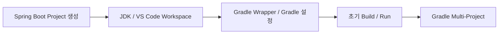
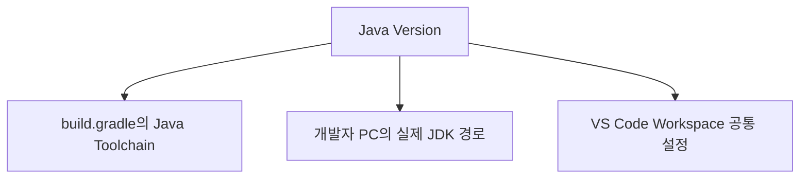
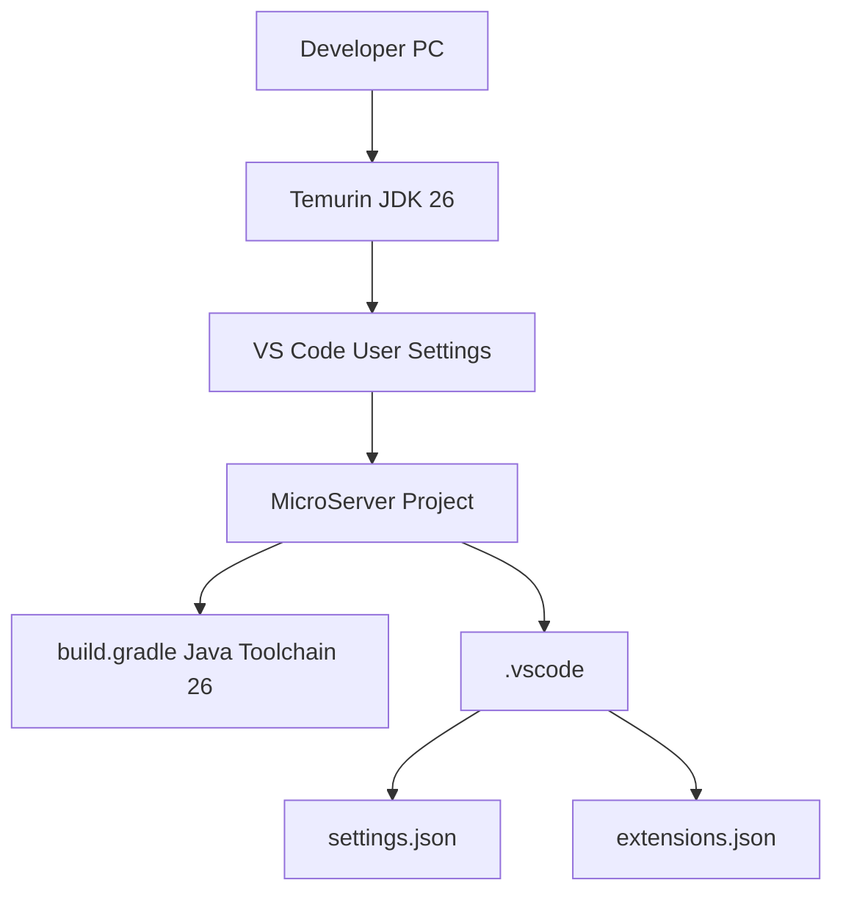

# 프로젝트 JDK / VS Code Workspace 설정 가이드

## 1. 문서 목적

본 문서는 생성된 MicroServer Spring Boot 프로젝트를 VS Code에서 개발할 수 있도록
**프로젝트 JDK와 VS Code Workspace 설정을 실제로 구성**하는 방법을 설명한다.

앞 단계의 JDK 설치 가이드에서는 JDK Binary만 준비했고,
VS Code 환경 구성 단계에서는 프로젝트별 JDK 운영 개념만 확인했다.

이제 실제 `microserver` 프로젝트가 존재하므로
프로젝트 개발환경에 필요한 설정을 적용한다.

현재 단계의 주요 목표는 다음과 같다.

- VS Code에서 MicroServer Project를 정상 Import
- Java 26 Runtime 확인
- 로컬 JDK 경로와 프로젝트 설정의 역할 분리
- `java.configuration.runtimes` 구성
- `.vscode/settings.json` 생성
- `.vscode/extensions.json` 생성
- OS별 절대경로가 Git에 공유되지 않도록 구성
- Java Runtime / Workspace 상태 확인

---

## 2. 현재 단계의 위치



현재:

```text
Spring Boot Project 생성
        ↓
[ 프로젝트 JDK / VS Code Workspace 설정 ]     ← 현재
        ↓
Gradle Wrapper 및 프로젝트 Gradle 설정
```

---

## 3. 가장 중요한 운영 원칙

MicroServer에서는 다음 세 가지를 구분한다.



각 역할:

| 구분 | 역할 | Git 공유 |
|---|---|---|
| `build.gradle` Java Toolchain | 프로젝트 Build 기준 | O |
| `java.configuration.runtimes` | 개발 PC의 실제 JDK 경로 매핑 | X 권장 |
| `.vscode/settings.json` | 공유 가능한 Workspace 설정 | O |
| `.vscode/extensions.json` | 권장 Extension 목록 | O |

!!! info "중요"

    **프로젝트의 Java Version 기준은 `build.gradle`의 Java Toolchain이다.**

    VS Code의 `java.configuration.runtimes`는
    개발 PC에 설치된 실제 JDK Directory를 VS Code에 알려주는 로컬 설정이다.

    두 설정의 역할을 혼동하지 않는다.

### Maven과 비교

Maven 프로젝트에서는 Java 기준을 주로 `pom.xml`의 `<java.version>` 또는 Compiler 설정으로 관리한다.
Gradle 프로젝트에서는 이번 가이드 기준으로 `build.gradle`의 Java Toolchain을 사용한다.

```text
Maven  : pom.xml <java.version>26</java.version>
Gradle : build.gradle → JavaLanguageVersion.of(26)
```

---

## 4. 왜 JDK 절대경로를 Workspace에 직접 Commit하지 않는가

앞 단계에서 JDK를 다음처럼 준비했다.

Windows:

```text
C:\dev\jdks\temurin-26
```

macOS:

```text
/Users/<USER>/dev/jdks/temurin-26.jdk/Contents/Home
```

두 OS의 경로가 다르다.

개발자별 Directory도 다를 수 있다.

따라서 `.vscode/settings.json`에 다음과 같이 절대경로를 넣고 Commit하면:

```json
{
  "java.configuration.runtimes": [
    {
      "name": "JavaSE-26",
      "path": "C:\\dev\\jdks\\temurin-26"
    }
  ]
}
```

macOS 개발자에게는 유효하지 않다.

반대도 마찬가지이다.

따라서 MicroServer에서는 **JDK 절대경로 매핑은 VS Code User Settings에서 관리**하고,
프로젝트 Repository에는 OS에 독립적인 Workspace 설정만 공유한다.

---

## 5. VS Code User Settings와 Workspace Settings

VS Code 설정 범위:

```text
User Settings
→ 해당 개발자의 VS Code 전체

Workspace Settings
→ 현재 Project / Workspace
```

MicroServer 운영:

```text
User Settings
 └─ 실제 JDK 설치 경로

Workspace Settings
 ├─ UTF-8
 ├─ Java Build Configuration Update 정책
 └─ 프로젝트 공통 IDE 설정

extensions.json
 └─ 프로젝트 권장 Extension
```

---

## 6. Project Root 열기

VS Code:

```text
File
→ Open Folder...
→ microserver
```

Explorer Root에서 다음 파일을 바로 확인할 수 있어야 한다.

```text
build.gradle
settings.gradle
gradlew
gradlew.bat
src/
```

---

## 7. Workspace Trust 확인

본인이 Clone하거나 생성한 MicroServer Repository라면
VS Code가 Workspace Trust를 요청할 때 Source를 확인한 후 Trust한다.

Java Language Server, Gradle, Debugger 등 일부 기능은
Restricted Mode에서 제한될 수 있다.

신뢰할 수 없는 외부 Repository는 내용을 먼저 확인한다.

---

## 8. Java Project Import

VS Code는 `build.gradle`과 `settings.gradle`을 감지하여 Gradle Java Project를 Import한다.

Java Projects View를 확인한다.

필요한 경우 Command Palette:

```text
Java: Import Java Projects in Workspace
```

Project Import가 완료될 때까지 Status Bar 또는 Output을 확인한다.

---

## 9. Project Java Version 확인

`build.gradle`에서 Java Toolchain Version을 확인한다.

예:

```groovy
java {
    toolchain {
        languageVersion = JavaLanguageVersion.of(26)
    }
}
```

현재 MicroServer 기준:

```text
Java 26
```

!!! note

    Gradle Project의 Java Version을 변경하려면
    VS Code 설정만 바꾸는 것이 아니라 Build Script인 `build.gradle`의 Toolchain을 함께 변경해야 한다.

---

## 10. Windows VS Code User Settings에 JDK 등록

Command Palette:

```text
Preferences: Open User Settings (JSON)
```

기존 설정이 있다면 삭제하지 말고 필요한 항목을 병합한다.

예:

```json
{
  "java.configuration.runtimes": [
    {
      "name": "JavaSE-26",
      "path": "C:\\dev\\jdks\\temurin-26",
      "default": true
    }
  ]
}
```

JDK Home:

```text
C:\dev\jdks\temurin-26
```

다음 경로를 넣지 않는다.

```text
X C:\dev\jdks\temurin-26\bin
X C:\dev\jdks\temurin-26\bin\java.exe
```

---

## 11. macOS VS Code User Settings에 JDK 등록

실제 User Home을 확인한다.

```bash
echo $HOME
```

예:

```text
/Users/jangkwan
```

User Settings:

```text
Preferences: Open User Settings (JSON)
```

예:

```json
{
  "java.configuration.runtimes": [
    {
      "name": "JavaSE-26",
      "path": "/Users/<USER>/dev/jdks/temurin-26.jdk/Contents/Home",
      "default": true
    }
  ]
}
```

실제 `<USER>` 부분을 개발자 Mac의 User Name으로 변경한다.

JDK Home:

```text
/Users/<USER>/dev/jdks/temurin-26.jdk/Contents/Home
```

`.jdk` Bundle Root가 아니라 `Contents/Home`까지 지정한다.

---

## 12. 여러 JDK가 있는 경우

예:

```json
{
  "java.configuration.runtimes": [
    {
      "name": "JavaSE-17",
      "path": "/path/to/temurin-17"
    },
    {
      "name": "JavaSE-21",
      "path": "/path/to/temurin-21"
    },
    {
      "name": "JavaSE-26",
      "path": "/path/to/temurin-26",
      "default": true
    }
  ]
}
```

현재 MicroServer Project는:

```text
JavaSE-26
```

을 사용한다.

---

## 13. `default: true`의 의미

`java.configuration.runtimes`에서:

```json
"default": true
```

를 지정할 수 있다.

다만 VS Code 공식 Java 문서에서 설명하는 것처럼
Maven / Gradle Build Project의 실제 Java Version은 Build Script의 설정이 중요하다.

따라서 다음 관계를 기억한다.

```text
java.configuration.runtimes
→ VS Code가 Local JDK를 찾는 기준

build.gradle
→ Gradle Project의 Build Java 기준
```

---

## 14. Java Runtime 확인

Command Palette:

```text
Java: Configure Java Runtime
```

화면에서 MicroServer Project가 사용하는 Runtime 정보를 확인한다.

확인 대상:

```text
Java 26
Eclipse Temurin
Project: microserver
```

표시되는 세부 UI는 Extension Version에 따라 달라질 수 있다.

---

## 15. Java Language Server Runtime과 Project JDK

다음 설정이 존재한다.

```text
java.jdt.ls.java.home
```

이 설정은 **Java Language Server 자체를 실행할 JDK**를 지정하는 설정이다.

Project Source Compile JDK와 동일한 개념이 아니다.

현재 Java Extension은 Java Language Server 실행을 위해
지원 가능한 최신 JDK 또는 내장 Runtime을 사용할 수 있다.

MicroServer에서는 특별한 문제가 없는 한
`java.jdt.ls.java.home`을 프로젝트 Workspace에 강제로 지정하지 않는다.

!!! tip "문제 발생 시"

    Java Extension이 시작되지 않거나 잘못된 JDK를 사용한다면
    `java.jdt.ls.java.home`을 문제 해결 목적으로 검토할 수 있다.

    하지만 이 값 역시 개발자 PC의 절대경로이므로
    팀 공통 Workspace 설정으로 Commit하기 전에 OS 차이를 고려해야 한다.

---

## 16. `.vscode` Directory 생성

Project Root:

```text
microserver/
```

아래에 다음 Directory를 만든다.

```text
.vscode/
```

최종:

```text
microserver/
├─ .vscode/
├─ gradle/
├─ src/
├─ settings.gradle
└─ build.gradle
```

---

## 17. `.vscode/settings.json`

생성:

```text
microserver/.vscode/settings.json
```

초기 권장 설정:

```json
{
  "files.encoding": "utf8",
  "java.configuration.updateBuildConfiguration": "automatic"
}
```

역할:

```text
files.encoding
→ Workspace 파일 Encoding 기준

java.configuration.updateBuildConfiguration
→ build.gradle / settings.gradle 같은 Build 설정 변경 시
   Java Project Classpath / Configuration 갱신
```

이 설정에는 JDK 절대경로를 넣지 않는다.

---

## 18. Build Configuration 자동 갱신

다음 설정:

```json
"java.configuration.updateBuildConfiguration": "automatic"
```

은 Gradle `build.gradle` / `settings.gradle` 등이 변경되었을 때
VS Code Java Project의 Classpath / Build Configuration 갱신을 자동으로 수행하도록 한다.

Gradle Multi-Project 전환 과정에서 Build Script가 많이 변경되므로
초기 프로젝트에서는 자동 갱신을 사용한다.

문제가 생기면 Command Palette에서 수동 Import / Clean 명령을 사용할 수 있다.

---

## 19. `.vscode/extensions.json`

생성:

```text
microserver/.vscode/extensions.json
```

권장:

```json
{
  "recommendations": [
    "vscjava.vscode-java-pack",
    "vscjava.vscode-gradle",
    "vmware.vscode-boot-dev-pack",
    "redhat.vscode-yaml",
    "redhat.vscode-xml",
    "ms-azuretools.vscode-containers"
  ]
}
```

역할:

```text
Extension Pack for Java
Gradle for Java
Spring Boot Extension Pack
YAML
XML
Container Tools
```

VS Code는 Workspace를 처음 연 개발자에게
권장 Extension을 확인하거나 설치할 수 있도록 안내한다.

---

## 20. `.vscode` Git 관리 원칙

현재 생성한:

```text
.vscode/settings.json
.vscode/extensions.json
```

은 팀 공통 프로젝트 설정이므로 Git에 Commit한다.

반대로 다음과 같은 개인 경로 / 개인 설정은 넣지 않는다.

```text
개인 JDK 절대경로
개인 Theme
개인 Font
개인 Key Binding
개인 Terminal Profile
개인 Credential
```

---

## 21. `.gitignore` 확인

`.gitignore`에 다음과 같이 `.vscode/` 전체가 제외되어 있다면:

```gitignore
.vscode/
```

현재 프로젝트 정책과 충돌한다.

필요한 경우 전체 `.vscode` 제외를 제거하고
공유하지 않을 특정 파일만 개별적으로 제외한다.

현재 공유 대상:

```text
.vscode/settings.json
.vscode/extensions.json
```

---

## 22. Workspace 설정 구조

현재:

```text
microserver/
├─ .vscode/
│  ├─ settings.json
│  └─ extensions.json
├─ gradle/
├─ src/
├─ settings.gradle
├─ build.gradle
├─ gradlew
└─ gradlew.bat
```

---

## 23. VS Code Reload

설정 변경 후 필요하면:

```text
Command Palette
→ Developer: Reload Window
```

Java Project Import가 다시 수행될 수 있다.

---

## 24. Java Language Server 문제 해결

Java Project가 비정상적으로 인식되는 경우:

```text
Java: Clean Java Language Server Workspace
```

를 사용할 수 있다.

이 명령은 Java Language Server Workspace Cache를 정리하고
Project를 다시 Import하는 문제 해결 수단이다.

정상 상태에서 반복 실행할 필요는 없다.

---

## 25. Gradle Projects View 확인

Explorer의 Gradle Projects View에서:

```text
microserver
```

Project가 표시되는지 확인한다.

현재는 Gradle Task를 본격 실행하지 않는다.

Wrapper / Gradle 설정은 다음 문서에서 진행한다.

→ [Gradle Wrapper 및 프로젝트 Gradle 설정](project_gradle_setup.md)

---

## 26. Spring Boot Dashboard 확인

Spring Boot Dashboard에서 Application이 표시되는지 확인한다.

아직 실행하지 않는다.

현재 확인 목적:

```text
VS Code가 Gradle Project 인식
        ↓
Java Extension 인식
        ↓
Spring Boot Extension 인식
```

---

## 27. 현재 단계에서 하지 않는 작업

다음은 아직 진행하지 않는다.

```text
Gradle Wrapper Version 변경
clean / build
Spring Boot 실행
Gradle Multi-Project 구성
Oracle Driver
Datasource
Controller / Service / DAO
```

---

## 28. Git 변경사항 확인

```bash
git status
```

주요 변경:

```text
.vscode/settings.json
.vscode/extensions.json
```

User Settings의 JDK 경로는 Repository File이 아니므로
Git 변경사항에 나타나지 않는 것이 정상이다.

---

## 29. Git Commit

```bash
git add .vscode/settings.json .vscode/extensions.json
git status
```

Commit:

```bash
git commit -m "chore: configure VS Code workspace"
```

Push:

```bash
git push
```

---

## 30. 완료 상태



---

## 31. 체크리스트

- [ ] `build.gradle`의 Java Toolchain Version이 26이다.
- [ ] Windows/macOS에 맞는 JDK Home을 확인했다.
- [ ] `java.configuration.runtimes`를 User Settings에 등록했다.
- [ ] `Java: Configure Java Runtime`에서 Project Runtime을 확인했다.
- [ ] JDK 절대경로를 Workspace Repository에 Commit하지 않았다.
- [ ] `.vscode/settings.json`을 생성했다.
- [ ] `.vscode/extensions.json`을 생성했다.
- [ ] 권장 Extension 목록에 Gradle for Java를 포함했다.
- [ ] Java / Gradle Project가 정상 Import된다.
- [ ] Spring Boot Dashboard에서 Project를 확인할 수 있다.
- [ ] Git Commit / Push를 완료했다.

---

## 32. 다음 단계

다음 단계에서는 Spring Initializr가 생성한 Gradle Wrapper를 검토하고
MicroServer Project의 Gradle 실행 기준을 확정한다.

→ [Gradle Wrapper 및 프로젝트 Gradle 설정](project_gradle_setup.md)

```text
Project 생성
        ↓
JDK / VS Code Workspace 설정       ← 현재 완료
        ↓
Gradle Wrapper / Gradle 설정
```

---

## 33. 공식 참고 자료

- Managing Java Projects in VS Code  
  <https://code.visualstudio.com/docs/java/java-project>

- VS Code User and Workspace Settings  
  <https://code.visualstudio.com/docs/configure/settings>

- Workspace Extension Recommendations  
  <https://code.visualstudio.com/docs/configure/extensions/extension-marketplace>

- Language Support for Java by Red Hat  
  <https://github.com/redhat-developer/vscode-java>

- Java Build Tools in VS Code  
  <https://code.visualstudio.com/docs/java/java-build>
