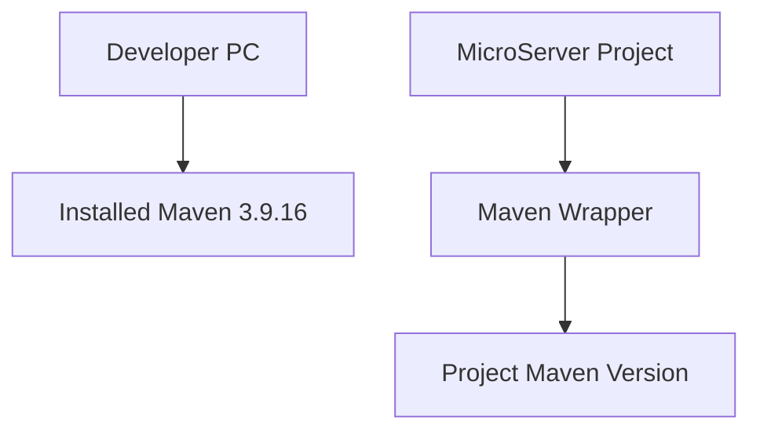
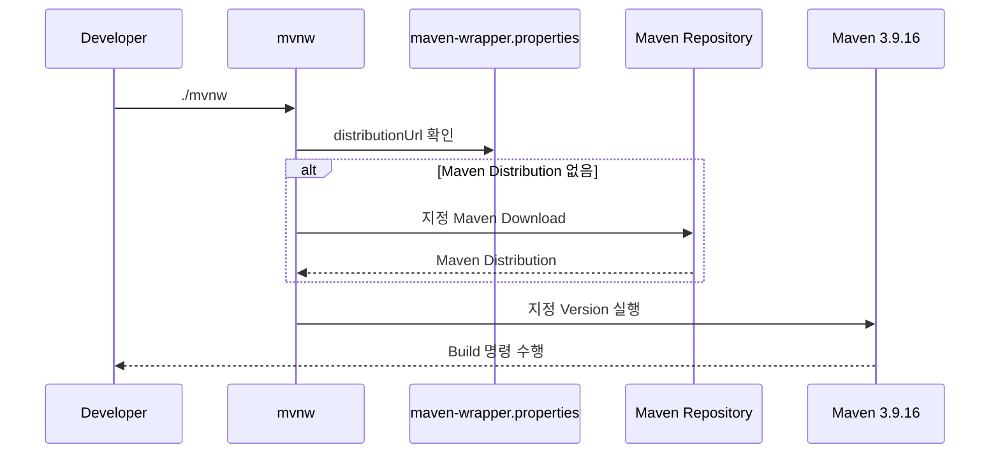

# Maven Wrapper 및 프로젝트 Maven 설정 가이드

## 1. 문서 목적

본 문서는 생성된 MicroServer Spring Boot Project의 Maven 환경을
**개발 PC Maven이 아니라 프로젝트 자체의 Build 기준으로 전환**하는 방법을 설명한다.

앞 단계에서 Apache Maven 3.9.16을 개발 PC에 설치했다.

그 Maven은 다음 목적이었다.

```text
개발 PC Maven
→ Maven Tool 자체 준비
```

이번 단계에서는 다음을 구성한다.

```text
Project Maven Wrapper
→ MicroServer Build Version 고정
```

주요 목표:

- Spring Initializr 생성 Maven Wrapper 확인
- Wrapper 구성 파일 이해
- MicroServer Maven Version을 3.9.16으로 확인 / 고정
- Windows / macOS Wrapper 실행 확인
- `pom.xml` 기본 Build 기준 확인
- 이후 모든 Project Build를 Wrapper 중심으로 실행
- 개인 `.m2/settings.xml`과 Project 설정의 역할 분리

---

## 2. 현재 단계의 위치

```text
Spring Boot Project 생성
        ↓
JDK / VS Code Workspace 설정
        ↓
[ Maven Wrapper / 프로젝트 Maven 설정 ]      ← 현재
        ↓
Spring Boot 초기 실행 및 Build 검증
```

---

## 3. 개발 PC Maven과 Maven Wrapper

두 Maven의 역할을 구분한다.



### 개발 PC Maven

```text
mvn
```

역할:

- Wrapper가 없을 때 초기 설정
- Wrapper 생성 / 업데이트
- 일반 Maven Tool 준비

### 프로젝트 Maven Wrapper

Windows:

```text
mvnw.cmd
```

macOS / Linux:

```text
./mvnw
```

역할:

- Project Maven Version 고정
- 개발자별 Maven Version 차이 감소
- CI/CD와 Local Build 기준 일치
- 필요한 Maven Distribution 자동 Download

---

## 4. Maven Version 기준

현재 MicroServer 기준:

```text
Apache Maven 3.9.16
```

Spring Boot 4.1.0은 공식적으로 Maven 3.6.3 이상을 지원한다.

따라서 Maven 3.9.16은 Spring Boot 4.1.0 Build 요구사항을 만족한다.

!!! info "Maven Version 운영"

    개발 PC에 설치된 Maven Version과
    프로젝트 Maven Wrapper Version이 반드시 같아야 하는 것은 아니다.

    실제 MicroServer Project Build의 기준은 Wrapper Version이다.

---

## 5. Spring Initializr Maven Wrapper 확인

Project Root:

```text
microserver/
```

다음 파일을 확인한다.

```text
.mvn/
mvnw
mvnw.cmd
```

상세:

```text
microserver/
├─ .mvn/
│  └─ wrapper/
│     └─ maven-wrapper.properties
├─ mvnw
├─ mvnw.cmd
└─ pom.xml
```

Spring Initializr Maven Project는 일반적으로 Maven Wrapper를 함께 생성한다.

---

## 6. Wrapper Properties 확인

파일:

```text
.mvn/wrapper/maven-wrapper.properties
```

확인할 핵심 항목:

```text
distributionUrl
```

예시 형태:

```properties
distributionUrl=https://repo.maven.apache.org/maven2/org/apache/maven/apache-maven/<VERSION>/apache-maven-<VERSION>-bin.zip
```

실제 `<VERSION>` 값을 확인한다.

---

## 7. Wrapper Version 확인 원칙

현재 `distributionUrl`이:

```text
3.9.16
```

을 사용한다면 그대로 유지한다.

다른 Version이라면 프로젝트 표준에 맞춰 3.9.16으로 변경할 수 있다.

단순 문자열을 수동 수정하는 방법도 있지만,
Wrapper Script 및 관련 설정을 함께 갱신하기 위해
Apache Maven Wrapper Plugin을 이용하는 방법을 권장한다.

---

## 8. Wrapper를 다시 생성해야 하는 경우

다음 경우에 Wrapper 설정을 다시 적용한다.

- Wrapper File이 없음
- Wrapper Version을 Project 표준으로 변경
- Wrapper Script 손상
- Spring Initializr 생성 Version과 Project 표준이 다름

Apache Maven 공식 방식:

```bash
mvn wrapper:wrapper
```

특정 Maven Version:

```bash
mvn wrapper:wrapper -Dmaven=3.9.16
```

현재 Maven Wrapper의 기본 설치 Type은 Script 중심 구성을 사용할 수 있다.

---

## 9. JDK를 임시 연결하는 이유

MicroServer에서는 시스템 `JAVA_HOME`을 고정하지 않는다.

따라서 개발 PC Maven인:

```text
mvn
```

을 이용해 Wrapper를 갱신할 때는
현재 Terminal Session에 JDK 26을 임시 연결한다.

---

## 10. Windows Wrapper 갱신

PowerShell:

```powershell
$env:JAVA_HOME="C:\dev\jdks\temurin-26"
$env:Path="$env:JAVA_HOME\bin;$env:Path"
```

Java 확인:

```powershell
java -version
```

Maven:

```powershell
mvn -version
```

Wrapper 갱신:

```powershell
mvn wrapper:wrapper -Dmaven=3.9.16
```

완료 후 변경 파일을 확인한다.

```powershell
git status
```

---

## 11. macOS Wrapper 갱신

Terminal:

```bash
export JAVA_HOME="$HOME/dev/jdks/temurin-26.jdk/Contents/Home"
export PATH="$JAVA_HOME/bin:$PATH"
```

확인:

```bash
java -version
mvn -version
```

Wrapper 갱신:

```bash
mvn wrapper:wrapper -Dmaven=3.9.16
```

---

## 12. macOS `mvnw` 실행 권한

확인:

```bash
ls -l mvnw
```

실행 권한이 없다면:

```bash
chmod +x mvnw
```

Git에서도 실행 권한을 유지해야 한다면:

```bash
git update-index --chmod=+x mvnw
```

다시 확인:

```bash
git diff --summary
```

---

## 13. Wrapper 실행 확인 - Windows

현재 Terminal에서 JDK를 임시 연결한다.

```powershell
$env:JAVA_HOME="C:\dev\jdks\temurin-26"
$env:Path="$env:JAVA_HOME\bin;$env:Path"
```

Wrapper:

```powershell
.\mvnw.cmd -version
```

확인:

```text
Apache Maven 3.9.16
Java version: 26...
Java home: C:\dev\jdks\temurin-26
```

---

## 14. Wrapper 실행 확인 - macOS

```bash
export JAVA_HOME="$HOME/dev/jdks/temurin-26.jdk/Contents/Home"
export PATH="$JAVA_HOME/bin:$PATH"
```

Wrapper:

```bash
./mvnw -version
```

확인:

```text
Apache Maven 3.9.16
Java version: 26...
```

Java Home도 Temurin 26인지 확인한다.

---

## 15. Wrapper가 Maven을 Download하는 구조

Wrapper 실행 흐름:



처음 실행 시 Download 시간이 필요할 수 있다.

---

## 16. 이후 `mvn`보다 Wrapper를 우선 사용

이제 MicroServer Project Build는 Wrapper를 기본으로 한다.

Windows:

```powershell
.\mvnw.cmd <goal>
```

macOS:

```bash
./mvnw <goal>
```

예:

```text
clean
test
package
verify
spring-boot:run
```

개발 PC에 설치된 `mvn` 명령은
Wrapper 관리나 특수한 초기 작업이 아니면 일상 Project Build 기준으로 사용하지 않는다.

---

## 17. `pom.xml` Project 기준 확인

현재 `pom.xml`에서 다음 항목을 확인한다.

```text
Spring Boot Parent
Group ID
Artifact ID
Project Version
Java Version
Dependencies
Build Plugin
```

기준:

```text
Spring Boot : 4.1.0
Java        : 26
Packaging   : jar
```

---

## 18. Spring Boot Parent 확인

Spring Initializr가 생성한 Maven Project는
Spring Boot Parent를 사용할 수 있다.

형태:

```xml
<parent>
    <groupId>org.springframework.boot</groupId>
    <artifactId>spring-boot-starter-parent</artifactId>
    <version>4.1.0</version>
    <relativePath/>
</parent>
```

Spring Boot Parent는 Spring Boot가 관리하는 Dependency와 Plugin 기본값을 제공한다.

현재는 Parent 구조를 변경하지 않는다.

Multi Module 구성 단계에서 Root Parent 구조를 다시 설계한다.

---

## 19. Java Version

```xml
<properties>
    <java.version>26</java.version>
</properties>
```

이 값이 Project Build의 Java Version 기준이다.

VS Code User Settings의 JDK Path와 역할이 다르다.

---

## 20. Spring Web Dependency 확인

Spring Boot 4에서 Spring MVC Web Starter는 다음 Artifact를 사용할 수 있다.

```xml
<dependency>
    <groupId>org.springframework.boot</groupId>
    <artifactId>spring-boot-starter-webmvc</artifactId>
</dependency>
```

Spring Initializr 결과를 기준으로 확인한다.

프로젝트를 Boot 3 문서 예제와 비교하여
무조건 `spring-boot-starter-web`으로 되돌리지 않는다.

---

## 21. Test Dependency 확인

Spring Boot 4의 Web MVC Test Starter 예:

```xml
<dependency>
    <groupId>org.springframework.boot</groupId>
    <artifactId>spring-boot-starter-webmvc-test</artifactId>
    <scope>test</scope>
</dependency>
```

Spring Boot 4는 기능별 Test Starter도 세분화했다.

Initializr가 생성한 현재 Version의 Dependency를 우선한다.

---

## 22. Spring Boot Maven Plugin

확인:

```xml
<build>
    <plugins>
        <plugin>
            <groupId>org.springframework.boot</groupId>
            <artifactId>spring-boot-maven-plugin</artifactId>
        </plugin>
    </plugins>
</build>
```

이 Plugin은 Spring Boot Application Packaging 및 실행 관련 기능을 제공한다.

현재는 Plugin 상세 Configuration을 추가하지 않는다.

---

## 23. `.m2/settings.xml`과 Project POM 구분

개인 Maven 환경:

```text
~/.m2/settings.xml
```

Windows:

```text
C:\Users\<USER>\.m2\settings.xml
```

용도:

```text
Nexus / Artifactory Mirror
Proxy
Repository 인증
개인 Maven 설정
```

Project:

```text
pom.xml
.mvn/
mvnw
mvnw.cmd
```

용도:

```text
Dependency
Plugin
Java Version
Project Build
Maven Wrapper
```

개인 Credential이 포함될 수 있는 `settings.xml`을 Git Repository에 Commit하지 않는다.

---

## 24. Wrapper Checksum

Apache Maven Wrapper는 Download Artifact에 대해
SHA-256 Checksum 검증 설정을 지원한다.

관련 Property:

```text
wrapperSha256Sum
distributionSha256Sum
```

기업 Build 보안 정책에서 Supply Chain 검증이 필요한 경우
Wrapper Distribution Checksum 고정을 검토할 수 있다.

현재 초기 Project에서는 공식 Repository와 Wrapper 기본값을 사용하고,
CI/CD 표준화 단계에서 Checksum 정책을 함께 확정할 수 있다.

---

## 25. 현재는 Build Goal을 본격 실행하지 않는다

현재 Wrapper 동작 확인은:

```text
-version
```

까지만 수행한다.

다음 단계에서:

```text
clean test
package
spring-boot:run
```

을 순차적으로 검증한다.

→ [Spring Boot 초기 실행 및 Build 검증](../project_verification/project_initial_run_verification.md)

---

## 26. Git 변경사항 확인

Wrapper Version을 변경했다면:

```bash
git status
git diff
```

확인 대상:

```text
.mvn/wrapper/maven-wrapper.properties
mvnw
mvnw.cmd
```

필요한 경우 Wrapper 관련 파일을 모두 Commit한다.

---

## 27. Git Commit

예:

```bash
git add .mvn mvnw mvnw.cmd pom.xml
git status
```

Commit:

```bash
git commit -m "build: configure project Maven wrapper"
```

Push:

```bash
git push
```

`pom.xml`에 실제 변경이 없다면 변경된 파일만 Add한다.

---

## 28. 완료 상태

```text
Developer Maven   → 3.9.16 준비
Project Wrapper   → Maven 3.9.16 기준
Project Java      → 26
Spring Boot       → 4.1.0
```

---

## 29. 체크리스트

- [ ] `.mvn/wrapper/maven-wrapper.properties`를 확인했다.
- [ ] `mvnw`, `mvnw.cmd`가 존재한다.
- [ ] Wrapper Maven Version을 확인했다.
- [ ] 필요한 경우 Maven 3.9.16으로 Wrapper를 갱신했다.
- [ ] Windows에서 `.\mvnw.cmd -version`을 확인했다.
- [ ] macOS에서 `./mvnw -version`을 확인했다.
- [ ] Wrapper가 Java 26을 사용한다.
- [ ] `pom.xml`의 Spring Boot Version을 확인했다.
- [ ] `pom.xml`의 Java Version을 확인했다.
- [ ] Spring Boot 4 Starter 구성을 확인했다.
- [ ] 개인 `.m2/settings.xml`을 Git에 Commit하지 않는다.
- [ ] 앞으로 Project Build는 Maven Wrapper를 우선 사용한다.
- [ ] Git 변경사항을 Commit / Push했다.

---

## 30. 다음 단계

이제 Project Tool 설정이 완료되었다.

다음 단계에서는 실제로 Compile, Test, Package, Spring Boot Run을 수행하여
현재 단일 Module Project가 정상 상태인지 검증한다.

→ [Spring Boot 초기 실행 및 Build 검증](../project_verification/project_initial_run_verification.md)

```text
JDK / VS Code 설정
        ↓
Maven Wrapper 설정              ← 현재 완료
        ↓
Build / Test / Run 검증
```

---

## 31. 공식 참고 자료

- Apache Maven Wrapper  
  <https://maven.apache.org/tools/wrapper/>

- Apache Maven Wrapper Overview  
  <https://maven.apache.org/tools/mavenwrapper.html>

- Apache Maven  
  <https://maven.apache.org/>

- Spring Boot System Requirements  
  <https://docs.spring.io/spring-boot/system-requirements.html>

- Spring Boot 4 Modularization  
  <https://spring.io/blog/2025/10/28/modularizing-spring-boot>
