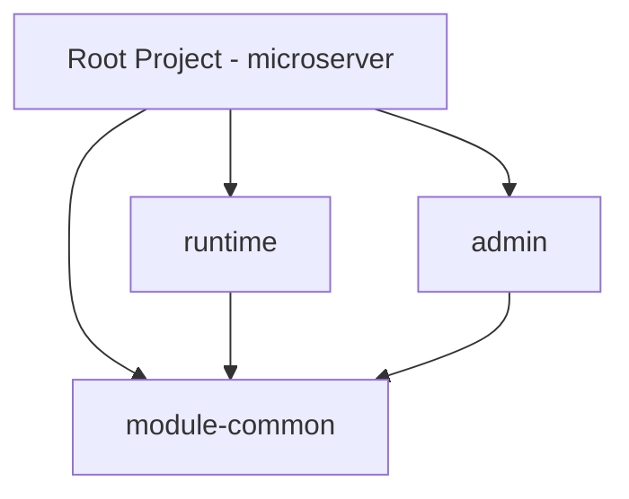
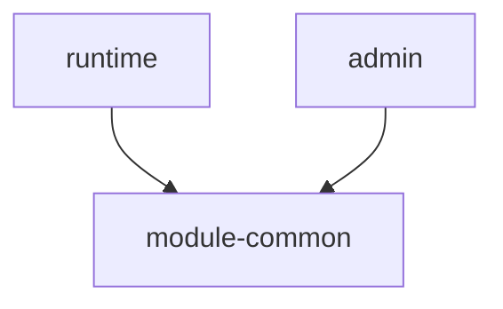
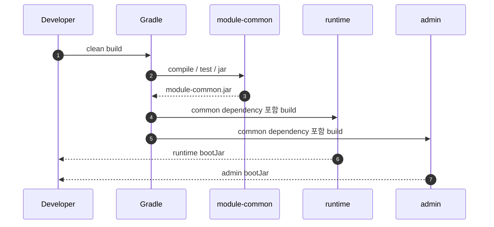
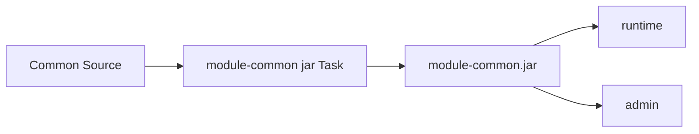

# Gradle Multi-Project 기본 구성 가이드

## 1. 문서 목적

본 문서는 최초 단일 Spring Boot 프로젝트를
**Gradle Multi-Project Build 구조**로 확장하는 방법을 설명한다.

MicroServer의 목표는 단순히 Directory를 여러 개 만드는 것이 아니라
공통 기능과 실행 애플리케이션의 책임을 분리하고, 공통 기능을 JAR로 재사용할 수 있는 구조를 만드는 것이다.

초기 Module은 다음 세 개를 기준으로 한다.

```text
module-common
runtime
admin
```

주요 목표:

- Gradle Root Project / Subproject 개념 이해
- `settings.gradle`에서 Subproject 선언
- Root `build.gradle`에서 공통 Build 정책 정의
- `module-common`을 재사용 가능한 Java Library로 구성
- `runtime`, `admin`을 Spring Boot Application으로 구성
- Module 간 Project Dependency 정의
- 전체 Build 및 개별 Module Build 확인
- Gradle 구성을 Maven Multi Module 방식과 비교

---

## 2. 현재 단계의 위치

```text
Spring Boot Project 생성
        ↓
JDK / VS Code Workspace 설정
        ↓
Gradle Wrapper 설정
        ↓
초기 Build / Run 검증
        ↓
[ Gradle Multi-Project 구성 ]       ← 현재
        ↓
공통 Framework 구현
```

단일 프로젝트가 정상적으로 Build / Run 되는 것을 먼저 확인한 뒤 구조를 변경한다.

---

## 3. Multi-Project Build란

Gradle에서는 하나의 Root Build 안에 여러 Project를 포함하는 구조를
**Multi-Project Build**라고 한다.



Gradle에서 각 Module은 하나의 **Subproject**이다.

Maven의 `Multi Module Project`와 목적은 유사하지만 프로젝트 구조를 선언하는 방식이 다르다.

---

## 4. 목표 Directory 구조

```text
microserver/
├─ gradle/
│  └─ wrapper/
├─ gradlew
├─ gradlew.bat
├─ settings.gradle
├─ build.gradle
│
├─ module-common/
│  ├─ build.gradle
│  └─ src/
│     ├─ main/java/
│     └─ test/java/
│
├─ runtime/
│  ├─ build.gradle
│  └─ src/
│     ├─ main/java/
│     ├─ main/resources/
│     └─ test/java/
│
└─ admin/
   ├─ build.gradle
   └─ src/
      ├─ main/java/
      ├─ main/resources/
      └─ test/java/
```

Root Project는 전체 Build 구조와 공통 정책을 관리하고,
실제 Java Source는 각 Subproject에 위치하도록 구성한다.

---

## 5. Maven 구조와 비교

### Gradle

```text
microserver/
├─ settings.gradle
├─ build.gradle
├─ module-common/build.gradle
├─ runtime/build.gradle
└─ admin/build.gradle
```

### Maven 대응

```text
microserver/
├─ pom.xml
├─ module-common/pom.xml
├─ runtime/pom.xml
└─ admin/pom.xml
```

Maven Parent POM에 집중되어 있던 역할이 Gradle에서는 다음처럼 나뉜다.

| 역할 | Gradle | Maven |
|---|---|---|
| Project / Module 목록 | `settings.gradle` | Parent `pom.xml`의 `<modules>` |
| 공통 Build 정책 | Root `build.gradle` | Parent POM |
| Module Build 설정 | 각 Module `build.gradle` | 각 Module `pom.xml` |
| Module Dependency | `implementation project(...)` | `<dependency>` |

---

## 6. 기존 단일 Project 백업 확인

구조 변경 전 반드시 Git 상태를 확인한다.

```bash
git status
```

기존 단일 Project가 정상 Build되는 Commit이 존재해야 한다.

권장:

```text
1. 단일 Spring Boot Build 성공
2. Commit
3. Multi-Project 전환
4. Build 검증
5. Commit
```

문제가 발생했을 때 구조 변경 전 상태로 돌아갈 수 있어야 한다.

---

## 7. `settings.gradle`에서 Subproject 선언

Root `settings.gradle`:

```groovy
rootProject.name = 'microserver'

include 'module-common'
include 'runtime'
include 'admin'
```

Gradle은 이 설정을 통해 세 Directory를 하나의 Build에 포함된 Subproject로 인식한다.

Gradle 9에서는 `include`한 Project Directory가 실제로 존재해야 한다.

먼저 Directory를 생성한다.

### Windows PowerShell

```powershell
New-Item -ItemType Directory module-common
New-Item -ItemType Directory runtime
New-Item -ItemType Directory admin
```

### macOS / Linux

```bash
mkdir -p module-common runtime admin
```

---

## 8. Maven `<modules>`와 비교

Gradle:

```groovy
include 'module-common'
include 'runtime'
include 'admin'
```

Maven:

```xml
<modules>
    <module>module-common</module>
    <module>runtime</module>
    <module>admin</module>
</modules>
```

둘 다 **전체 Build에 포함할 Module을 선언한다**는 목적은 같다.

차이점:

```text
Maven
→ Parent POM 내부 XML

Gradle
→ settings.gradle 전용 Script
```

---

## 9. Root `build.gradle` 역할

초기 Root `build.gradle`은 공통 Version과 Repository 정책을 관리한다.

예:

```groovy
plugins {
    id 'org.springframework.boot' version '4.1.0' apply false
    id 'io.spring.dependency-management' version '1.1.7' apply false
}

allprojects {
    group = 'io.github.teammicroserver'
    version = '0.0.1-SNAPSHOT'

    repositories {
        mavenCentral()
    }
}
```

`apply false`는 Root Project 자체에는 Spring Boot Plugin을 적용하지 않으면서
Subproject가 동일한 Plugin Version을 사용할 수 있도록 기준을 둔다는 의미이다.

!!! note
    초기 단계에서는 Root Build Script를 지나치게 추상화하지 않는다.
    Gradle 기본 구조를 이해한 뒤 공통 설정이 반복되면 Convention Plugin 등을 검토한다.

---

## 10. Parent POM과 비교

Maven Parent POM에서는 다음과 같은 정보를 중앙 관리한다.

```xml
<groupId>io.github.teammicroserver</groupId>
<version>0.0.1-SNAPSHOT</version>

<modules>
    ...
</modules>

<dependencyManagement>
    ...
</dependencyManagement>

<build>
    <pluginManagement>
        ...
    </pluginManagement>
</build>
```

Gradle에서는 역할별로 다음처럼 분리한다.

```text
settings.gradle
→ Subproject 목록

Root build.gradle
→ Plugin Version / Group / Version / Repository / 공통 정책

Subproject build.gradle
→ 실제 Plugin / Dependency / Task 구성
```

---

## 11. `module-common` 구성

`module-common`은 실행 애플리케이션이 아니라
다른 Module이 사용하는 **공통 Library JAR**이다.

파일:

```text
module-common/build.gradle
```

예:

```groovy
plugins {
    id 'java-library'
    id 'io.spring.dependency-management'
}

java {
    toolchain {
        languageVersion = JavaLanguageVersion.of(26)
    }
}

dependencyManagement {
    imports {
        mavenBom org.springframework.boot.gradle.plugin.SpringBootPlugin.BOM_COORDINATES
    }
}

dependencies {
    testImplementation 'org.springframework.boot:spring-boot-starter-test'
    testRuntimeOnly 'org.junit.platform:junit-platform-launcher'
}

tasks.named('test') {
    useJUnitPlatform()
}
```

`java-library` Plugin을 사용하면 Library 역할에 맞게 `api`, `implementation` 등의 Dependency 경계를 표현할 수 있다.

---

## 12. `java`와 `java-library` 차이

일반 Java Module:

```groovy
plugins {
    id 'java'
}
```

재사용 Library Module:

```groovy
plugins {
    id 'java-library'
}
```

`java-library`는 다음과 같이 외부 Module에 노출되는 Dependency와 내부 구현 Dependency를 구분할 수 있다.

```groovy
dependencies {
    api 'some:public-api:1.0.0'
    implementation 'some:internal-lib:1.0.0'
}
```

MicroServer에서는 `module-common`이 다른 Module이 사용하는 공통 JAR이므로
`java-library`를 기본으로 사용한다.

---

## 13. `runtime` 구성

`runtime`은 실제 업무 API를 제공하는 Spring Boot 실행 Module이다.

파일:

```text
runtime/build.gradle
```

예:

```groovy
plugins {
    id 'java'
    id 'org.springframework.boot'
    id 'io.spring.dependency-management'
}

java {
    toolchain {
        languageVersion = JavaLanguageVersion.of(26)
    }
}

dependencies {
    implementation project(':module-common')
    implementation 'org.springframework.boot:spring-boot-starter-webmvc'

    testImplementation 'org.springframework.boot:spring-boot-starter-webmvc-test'
    testRuntimeOnly 'org.junit.platform:junit-platform-launcher'
}

tasks.named('test') {
    useJUnitPlatform()
}
```

핵심:

```groovy
implementation project(':module-common')
```

이 설정으로 `runtime`이 `module-common`을 Project Dependency로 사용한다.

---

## 14. Maven Module Dependency와 비교

Gradle:

```groovy
dependencies {
    implementation project(':module-common')
}
```

Maven:

```xml
<dependency>
    <groupId>io.github.teammicroserver</groupId>
    <artifactId>module-common</artifactId>
    <version>${project.version}</version>
</dependency>
```

Gradle의 Project Dependency는 같은 Multi-Project Build 안에서 Module 관계를 직접 모델링한다.

`runtime`을 Build할 때 필요한 경우 `module-common`의 Build가 먼저 수행된다.

---

## 15. `admin` 구성

`admin`도 별도의 Spring Boot 실행 Module로 구성한다.

```text
admin/build.gradle
```

예:

```groovy
plugins {
    id 'java'
    id 'org.springframework.boot'
    id 'io.spring.dependency-management'
}

java {
    toolchain {
        languageVersion = JavaLanguageVersion.of(26)
    }
}

dependencies {
    implementation project(':module-common')
    implementation 'org.springframework.boot:spring-boot-starter-webmvc'

    testImplementation 'org.springframework.boot:spring-boot-starter-webmvc-test'
    testRuntimeOnly 'org.junit.platform:junit-platform-launcher'
}

tasks.named('test') {
    useJUnitPlatform()
}
```

초기에는 `runtime`과 유사하지만 이후 Admin 전용 기능이 추가되면서 Dependency와 Package가 달라진다.

---

## 16. Module Dependency 방향

의존 방향은 다음을 기본 원칙으로 한다.



금지:

```text
module-common → runtime
module-common → admin
```

공통 Module이 실행 Module을 참조하면 재사용성과 독립성이 떨어진다.

---

## 17. 기존 Source 이동 원칙

최초 단일 Spring Boot 프로젝트의 Source는 실행 Module로 이동한다.

기존:

```text
microserver/
└─ src/
   ├─ main/
   └─ test/
```

변경:

```text
microserver/
├─ runtime/
│  └─ src/
│     ├─ main/
│     └─ test/
├─ module-common/
└─ admin/
```

초기 Application Class는 우선 `runtime`에 배치하는 것을 기본으로 한다.

Admin Application Class는 Admin Module을 실제로 구현하는 단계에서 별도로 만든다.

---

## 18. Root `src/` 처리

Multi-Project 전환 후 Root Project 자체에서 Java Source를 Build하지 않는다면
Root `src/` Directory는 남겨두지 않는다.

목표:

```text
Root Project
→ Build 구조 / 공통 정책 관리

Subproject
→ 실제 Source 보유
```

Source 이동 후 Git 상태를 반드시 확인한다.

```bash
git status
```

---

## 19. Gradle Project 목록 확인

### Windows

```powershell
.\gradlew.bat projects
```

### macOS / Linux

```bash
./gradlew projects
```

예상 구조:

```text
Root project 'microserver'
+--- Project ':admin'
+--- Project ':module-common'
\--- Project ':runtime'
```

이 명령은 `settings.gradle`이 올바르게 해석되고 있는지 확인하는 데 매우 유용하다.

---

## 20. 전체 Build

### Windows

```powershell
.\gradlew.bat clean build
```

### macOS / Linux

```bash
./gradlew clean build
```

Gradle은 Task Dependency와 Project Dependency를 분석하여 필요한 순서로 Build한다.



---

## 21. Build 결과 Directory

Gradle 기본 Build 결과는 각 Project의 `build/`에 생성된다.

예:

```text
module-common/build/libs/
runtime/build/libs/
admin/build/libs/
```

Maven의 `target/`과 대응한다.

```text
Gradle : build/
Maven  : target/
```

`.gitignore`에 `build/`가 포함되어 있어야 한다.

---

## 22. 특정 Module만 Build

Gradle Project Path를 사용한다.

### runtime

```bash
./gradlew :runtime:build
```

### module-common

```bash
./gradlew :module-common:build
```

### admin

```bash
./gradlew :admin:build
```

Windows에서는 `./gradlew` 대신 다음을 사용한다.

```powershell
.\gradlew.bat :runtime:build
```

`runtime`이 `module-common`에 의존하므로 필요한 공통 Project Task가 함께 실행될 수 있다.

---

## 23. 특정 Module 실행

runtime:

```bash
./gradlew :runtime:bootRun
```

admin:

```bash
./gradlew :admin:bootRun
```

Windows:

```powershell
.\gradlew.bat :runtime:bootRun
```

`module-common`은 실행 애플리케이션이 아니므로 `bootRun` 대상이 아니다.

---

## 24. Maven Reactor Build와 비교

Maven에서는 Parent POM 기준으로 Reactor가 Module Build 순서를 계산한다.

```bash
./mvnw clean package
```

Gradle에서는 Task Graph와 Project Dependency가 Build 순서를 결정한다.

```bash
./gradlew clean build
```

목적:

```text
전체 Module Build
공통 Module 선행 Build
실행 Module에서 공통 Artifact 사용
```

은 유사하지만 내부 모델은 다르다.

---

## 25. Dependency 구조 확인

전체 Dependency:

```bash
./gradlew dependencies
```

runtime의 Dependency:

```bash
./gradlew :runtime:dependencies
```

특정 Dependency가 왜 포함되었는지 확인:

```bash
./gradlew :runtime:dependencyInsight --dependency spring-core
```

Maven 대응:

```bash
./mvnw dependency:tree
```

Gradle의 `dependencyInsight`는 Version 충돌이나 특정 Dependency 선택 이유를 분석할 때 특히 유용하다.

---

## 26. 공통 Dependency Version 관리 방향

초기 단계에서는 Spring Boot의 Dependency Management를 활용한다.

다음 고급 기능은 프로젝트를 진행하면서 필요성이 생길 때 검토한다.

```text
Gradle Version Catalog
Java Platform Project
Convention Plugin
Dependency Constraints
```

처음부터 모든 Gradle 기능을 도입하면 Build 구조 자체를 이해하기 어렵다.

현재 목표는:

```text
Root / Subproject
settings.gradle
build.gradle
Plugin
Dependency
Task
```

를 정확히 이해하는 것이다.

---

## 27. 공통 Build 설정 중복에 대한 운영 원칙

초기 Module의 `java.toolchain`이나 Test 설정이 반복될 수 있다.

처음에는 명시적인 설정을 유지해 각 Module의 역할을 이해한다.

프로젝트가 안정화된 뒤 다음 형태로 공통화를 검토할 수 있다.

```groovy
subprojects {
    apply plugin: 'java'

    java {
        toolchain {
            languageVersion = JavaLanguageVersion.of(26)
        }
    }
}
```

하지만 `module-common`의 `java-library`와 실행 Module의 Spring Boot Plugin처럼
Module 역할에 따라 다른 설정은 무조건 하나로 합치지 않는다.

---

## 28. Root Plugin `apply false`의 의미

Root:

```groovy
plugins {
    id 'org.springframework.boot' version '4.1.0' apply false
}
```

의미:

```text
Spring Boot Plugin Version은 Root에서 관리
        ↓
Root 자체에는 Spring Boot Plugin 적용 안 함
        ↓
runtime / admin에서 실제 적용
```

Root Project는 실행 Application이 아니므로 `bootJar`, `bootRun`이 필요하지 않다.

---

## 29. `module-common` JAR 사용 흐름



개발 중 같은 Multi-Project Build 안에서는 실제로 매번 JAR 파일을 수동 복사하지 않는다.

```groovy
implementation project(':module-common')
```

Project Dependency를 통해 Gradle이 Classpath와 Build 순서를 관리한다.

JAR은 배포 / Repository Publish가 필요한 단계에서 별도로 다룬다.

---

## 30. VS Code에서 Multi-Project 확인

Gradle for Java가 설치된 VS Code에서 다음을 확인한다.

```text
Gradle Projects
Java Projects
Spring Boot Dashboard
```

예상:

```text
Gradle Projects
└─ microserver
   ├─ module-common
   ├─ runtime
   └─ admin
```

새 Module을 추가한 뒤 IDE 반영이 늦으면:

```text
Java: Import Java projects in workspace
```

또는 Gradle Project Refresh / VS Code Reload를 수행한다.

---

## 31. `.gitignore` 확인

Gradle 기준 최소 Build 제외:

```gitignore
.gradle/
**/build/
```

프로젝트에 포함해야 하는 Wrapper:

```text
gradlew
gradlew.bat
gradle/wrapper/gradle-wrapper.jar
gradle/wrapper/gradle-wrapper.properties
```

!!! warning
    `.gradle/` Cache Directory와 `gradle/` Wrapper Directory를 혼동하지 않는다.

```text
.gradle/      → Local Cache, Git 제외
gradle/       → Wrapper 파일, Git 포함
```

---

## 32. Maven `.gitignore`와 비교

Maven:

```gitignore
target/
```

Gradle:

```gitignore
.gradle/
**/build/
```

두 Build Tool을 비교 학습하기 위해 Maven 문서와 예제가 Repository에 존재하더라도
실제 MicroServer Source Build 결과는 Gradle 기준으로 제외한다.

---

## 33. 검증 순서

Multi-Project 전환 후 다음 순서로 검증한다.

```text
1. ./gradlew projects
        ↓
2. ./gradlew clean test
        ↓
3. ./gradlew clean build
        ↓
4. module-common JAR 확인
        ↓
5. runtime bootJar 확인
        ↓
6. ./gradlew :runtime:bootRun
        ↓
7. VS Code Gradle / Java Project 확인
```

한 번에 기능 개발까지 진행하지 않는다.

---

## 34. 자주 발생하는 문제

### `Project with path ':module-common' could not be found`

확인:

```groovy
include 'module-common'
```

그리고 실제 Directory가 존재하는지 확인한다.

### Plugin을 찾지 못하는 경우

Root `build.gradle`의 Plugin Version과 각 Subproject의 Plugin 선언을 확인한다.

### Java Version이 다른 경우

```bash
./gradlew --version
```

과 각 Module의 Toolchain 설정을 확인한다.

### `runtime`에서 Common Class를 찾지 못하는 경우

```groovy
implementation project(':module-common')
```

설정과 Package Import를 확인한다.

### Root에서 `bootRun`이 보이지 않는 경우

정상일 수 있다.

실제 Spring Boot 실행 Module을 지정한다.

```bash
./gradlew :runtime:bootRun
```

---

## 35. 체크리스트

- [ ] `settings.gradle`에 `module-common`, `runtime`, `admin`이 포함되어 있다.
- [ ] 각 Subproject Directory가 실제로 존재한다.
- [ ] 각 Subproject에 `build.gradle`이 존재한다.
- [ ] `module-common`은 `java-library` 기반이다.
- [ ] `runtime`, `admin`은 Spring Boot Plugin을 사용한다.
- [ ] `runtime`, `admin`이 `module-common`에 의존한다.
- [ ] `module-common`이 `runtime`, `admin`에 의존하지 않는다.
- [ ] Java Toolchain이 26으로 설정되어 있다.
- [ ] `./gradlew projects`에서 모든 Project가 표시된다.
- [ ] `./gradlew clean build`가 성공한다.
- [ ] `module-common/build/libs`에 JAR이 생성된다.
- [ ] `runtime/build/libs`에 실행 Artifact가 생성된다.
- [ ] `./gradlew :runtime:bootRun`이 정상 실행된다.
- [ ] `.gradle/`, `build/`가 Git에서 제외된다.
- [ ] Gradle 설정과 Maven Multi Module 대응 관계를 이해했다.

---

## 36. 다음 단계

Multi-Project 구조가 안정적으로 Build되면
각 Module의 Package와 책임을 구체화한다.

```text
Gradle Multi-Project 구성       ← 현재 완료
        ↓
module-common 기본 구조
        ↓
runtime 기본 구조
        ↓
admin 기본 구조
        ↓
공통 Response / Exception / Logging
        ↓
Database / Security / API 표준
```

---

## 37. 공식 참고 자료

- Gradle Multi-Project Builds  
  <https://docs.gradle.org/current/userguide/multi_project_builds.html>

- Gradle Settings File Basics  
  <https://docs.gradle.org/current/userguide/settings_file_basics.html>

- Gradle Java Library Plugin  
  <https://docs.gradle.org/current/userguide/java_library_plugin.html>

- Gradle Dependency Management  
  <https://docs.gradle.org/current/userguide/dependency_management_basics.html>

- Spring Boot Gradle Plugin  
  <https://docs.spring.io/spring-boot/gradle-plugin/>
