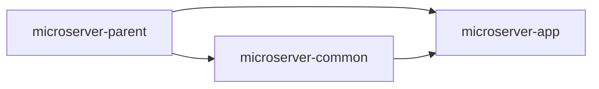
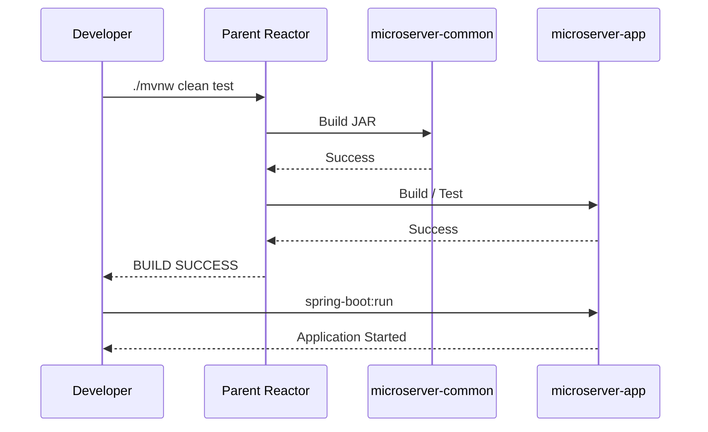

# Maven 멀티모듈 기본 구성 가이드 - 비교 / 참고

!!! info "MicroServer Build Tool 기준"
    현재 Team-Microserver의 **주 Build Tool은 Gradle + Groovy DSL**이다.

    이 문서는 Maven 프로젝트의 설정 방식을 비교하고 기존 Maven 기반 프로젝트를 이해하기 위한 참고 자료로 유지한다.
    실제 MicroServer 구축 절차는 [Gradle Multi-Project 기본 구성](gradle_multi_module_setup.md)을 우선한다.

    이후 가이드에서는 Gradle 설정을 먼저 제시하고 필요한 경우 Maven 대응 설정을 함께 설명한다.

---

## 1. 문서 목적

본 문서는 정상 동작이 확인된 단일 Spring Boot Project를
MicroServer의 기본 **Maven Multi Module 구조**로 전환하는 방법을 설명한다.

MicroServer는 향후 공통 기능을 Application Source와 분리하여
별도 JAR Module로 제공하는 구조를 사용한다.

초기 Multi Module 구조는 복잡하게 나누지 않고
다음 세 역할로 시작한다.

```text
Root Parent / Aggregator
        +
Application Module
        +
Common JAR Module
```

현재 단계의 목표는 다음과 같다.

- Root Project를 Parent / Aggregator POM으로 변경
- 실행 Application을 `microserver-app` Module로 분리
- 공통 영역을 `microserver-common` JAR Module로 생성
- Application → Common Dependency 구성
- Maven Reactor Build 검증
- VS Code Multi Module Import 검증
- Spring Boot Application 실행 검증

아직 Controller / Service / DAO 등 세부 Architecture 구현은 진행하지 않는다.

---

## 2. 왜 Multi Module로 구성하는가

MicroServer의 주요 방향 중 하나는
공통 기능을 Application 내부에 뒤섞지 않고
**독립된 JAR Module로 구성하여 재사용 가능하게 만드는 것**이다.

개념:


향후 공통 Module에는 다음과 같은 기능이 들어갈 수 있다.

```text
공통 Utility
공통 Exception
공통 Response Model
공통 Validation
공통 Logging 지원
Filter 기반 공통 처리
AOP 기반 공통 관심사
Security 공통 지원
기타 Framework 공통 기능
```

그러나 현재는 Module 구조만 만든다.

---

## 3. Layer와 Module을 구분한다

Multi Module과 Controller / Service / DAO Layer는 서로 다른 개념이다.

```text
Module
→ Build / Dependency 경계

Layer
→ Application 내부 책임 분리
```

예:

```text
microserver-app
 ├─ Controller
 ├─ Service
 └─ DAO

microserver-common
 └─ 공통 Framework 기능
```

Controller / Service / DAO를 각각 Maven Module로 나누는 것이 현재 목표가 아니다.

---

## 4. 초기 Multi Module 구조

최종 목표:

```text
microserver/
├─ .git/
├─ .mvn/
├─ .vscode/
├─ mvnw
├─ mvnw.cmd
├─ pom.xml                         ← Parent / Aggregator
│
├─ microserver-common/
│  ├─ pom.xml
│  └─ src/
│     └─ main/java/
│
└─ microserver-app/
   ├─ pom.xml
   └─ src/
      ├─ main/
      └─ test/
```

---

## 5. Module 역할

### Root

```text
microserver
```

역할:

- Parent POM
- Maven Module Aggregator
- 공통 Group / Version / Java Version 기준
- 전체 Reactor Build Entry Point

Packaging:

```text
pom
```

### Application

```text
microserver-app
```

역할:

- Spring Boot Main Application
- 실행 가능한 JAR
- 향후 Controller / Service / DAO
- Runtime Configuration
- Common Module 사용

Packaging:

```text
jar
```

### Common

```text
microserver-common
```

역할:

- 공통 기능
- Application에서 Dependency로 사용
- 독립 JAR Build

Packaging:

```text
jar
```

---

## 6. 왜 처음부터 Module을 많이 만들지 않는가

다음처럼 많은 Module을 처음부터 만들 수도 있다.

```text
common-util
common-web
common-security
common-data
core
domain
infra
api
batch
```

하지만 실제 책임과 Dependency가 확인되기 전에
Module을 과도하게 분리하면 구조가 복잡해진다.

현재는:

```text
app
common
```

두 Module로 시작한다.

기능이 커지고 경계가 명확해질 때 추가 Module로 분리한다.

---

## 7. Maven Parent와 Aggregator

Maven에서 Parent와 Aggregator는 개념적으로 구분된다.

### Parent

Child Module이 공통 설정을 상속한다.

```text
Java Version
Dependency Management
Plugin Management
Project Version
```

### Aggregator

Root POM의 `<modules>`에 Child Module을 선언하여
전체 Module을 하나의 Reactor Build로 묶는다.

MicroServer Root POM은 두 역할을 함께 사용한다.

```text
Parent
+
Aggregator
```

---

## 8. Root POM은 `pom` Packaging

Maven의 Parent / Aggregator Project는:

```xml
<packaging>pom</packaging>
```

을 사용한다.

Root 자체는 Application JAR를 만들지 않는다.

실행 JAR는:

```text
microserver-app
```

에서 생성한다.

---

## 9. 변경 전 Baseline

현재 구조:

```text
microserver/
├─ src/
│  ├─ main/
│  └─ test/
├─ pom.xml
├─ mvnw
└─ mvnw.cmd
```

앞 단계에서 다음 검증이 모두 성공한 상태여야 한다.

```text
clean test      → SUCCESS
package         → SUCCESS
spring-boot:run → SUCCESS
```

검증이 실패한 상태에서 Multi Module 변경을 시작하지 않는다.

---

## 10. 변경 전 Git 상태

```bash
git status
```

가능하면:

```text
working tree clean
```

상태에서 시작한다.

!!! tip "안전한 기준점"

    Multi Module 변경은 Directory 이동과 POM 변경이 동시에 발생한다.

    따라서 시작 전에 Git Working Tree를 깨끗하게 유지하면
    변경사항 비교와 Rollback이 쉬워진다.

---

## 11. Module Directory 생성

### Windows PowerShell

```powershell
New-Item -ItemType Directory -Force microserver-app
New-Item -ItemType Directory -Force microserver-common
```

### macOS

```bash
mkdir -p microserver-app
mkdir -p microserver-common
```

---

## 12. 기존 `src`를 Application Module로 이동

기존 Spring Boot Source 전체를:

```text
src/
```

에서:

```text
microserver-app/src/
```

로 이동한다.

### Windows

```powershell
Move-Item .\src .\microserver-app\
```

### macOS

```bash
mv src microserver-app/
```

결과:

```text
microserver-app/
└─ src/
   ├─ main/
   └─ test/
```

Main Application과 기존 Test가 함께 이동한다.

---

## 13. 기존 Root `pom.xml` 보관

Root `pom.xml`을 바로 덮어쓰기 전에
Git이 변경 이력을 관리하므로 별도 Backup File은 필수는 아니다.

그래도 내용을 비교하면서 작업한다.

확인:

```bash
git diff
```

Multi Module 변환 후 Root POM과 Application POM으로 역할을 나눈다.

---

## 14. Root Parent POM 작성

Root:

```text
microserver/pom.xml
```

예:

```xml
<?xml version="1.0" encoding="UTF-8"?>
<project xmlns="http://maven.apache.org/POM/4.0.0"
         xmlns:xsi="http://www.w3.org/2001/XMLSchema-instance"
         xsi:schemaLocation="http://maven.apache.org/POM/4.0.0
                             https://maven.apache.org/xsd/maven-4.0.0.xsd">

    <modelVersion>4.0.0</modelVersion>

    <parent>
        <groupId>org.springframework.boot</groupId>
        <artifactId>spring-boot-starter-parent</artifactId>
        <version>4.1.0</version>
        <relativePath/>
    </parent>

    <groupId>io.github.teammicroserver</groupId>
    <artifactId>microserver-parent</artifactId>
    <version>0.0.1-SNAPSHOT</version>
    <packaging>pom</packaging>

    <name>microserver-parent</name>
    <description>MicroServer Parent Project</description>

    <properties>
        <java.version>26</java.version>
    </properties>

    <modules>
        <module>microserver-common</module>
        <module>microserver-app</module>
    </modules>

</project>
```

---

## 15. Root Artifact ID 변경 이유

최초 단일 Project:

```text
artifactId = microserver
```

Multi Module Root는 실제 실행 Artifact가 아니므로:

```text
artifactId = microserver-parent
```

로 역할을 명확히 한다.

실행 Application은:

```text
microserver-app
```

으로 이동한다.

---

## 16. Root POM의 Module 순서

```xml
<modules>
    <module>microserver-common</module>
    <module>microserver-app</module>
</modules>
```

Application이 Common에 의존하므로
구조상 Common을 먼저 적는다.

Maven Reactor는 실제 Dependency 관계도 고려하여 Build 순서를 정한다.

---

## 17. Common Module POM

생성:

```text
microserver-common/pom.xml
```

내용:

```xml
<?xml version="1.0" encoding="UTF-8"?>
<project xmlns="http://maven.apache.org/POM/4.0.0"
         xmlns:xsi="http://www.w3.org/2001/XMLSchema-instance"
         xsi:schemaLocation="http://maven.apache.org/POM/4.0.0
                             https://maven.apache.org/xsd/maven-4.0.0.xsd">

    <modelVersion>4.0.0</modelVersion>

    <parent>
        <groupId>io.github.teammicroserver</groupId>
        <artifactId>microserver-parent</artifactId>
        <version>0.0.1-SNAPSHOT</version>
        <relativePath>../pom.xml</relativePath>
    </parent>

    <artifactId>microserver-common</artifactId>
    <packaging>jar</packaging>

    <name>microserver-common</name>
    <description>MicroServer Common Library</description>

</project>
```

---

## 18. Common Module에 Spring Boot Plugin을 넣지 않는다

Common Module은 실행 Application이 아니다.

따라서:

```text
spring-boot-maven-plugin
```

을 Common Module에 직접 선언하지 않는다.

Common의 목표:

```text
일반 JAR
```

Application에서 Dependency로 사용할 수 있도록 한다.

---

## 19. Common Source Directory

생성:

### Windows

```powershell
New-Item -ItemType Directory -Force `
  .\microserver-common\src\main\java\io\github\teammicroserver\common
```

### macOS

```bash
mkdir -p microserver-common/src/main/java/io/github/teammicroserver/common
```

---

## 20. Common Marker Class

Common JAR가 실제 Java Source를 포함하는지 확인하기 위한
최소 Marker Class를 만든다.

파일:

```text
microserver-common/src/main/java/io/github/teammicroserver/common/CommonMarker.java
```

내용:

```java
package io.github.teammicroserver.common;

/**
 * MicroServer Common Module marker.
 */
public final class CommonMarker {

    private CommonMarker() {
    }
}
```

이 Class는 Business 기능을 구현하기 위한 것이 아니다.

현재 Common Module의 Package와 JAR Build를 검증하기 위한 최소 Source이다.

---

## 21. Application Module POM

생성:

```text
microserver-app/pom.xml
```

예:

```xml
<?xml version="1.0" encoding="UTF-8"?>
<project xmlns="http://maven.apache.org/POM/4.0.0"
         xmlns:xsi="http://www.w3.org/2001/XMLSchema-instance"
         xsi:schemaLocation="http://maven.apache.org/POM/4.0.0
                             https://maven.apache.org/xsd/maven-4.0.0.xsd">

    <modelVersion>4.0.0</modelVersion>

    <parent>
        <groupId>io.github.teammicroserver</groupId>
        <artifactId>microserver-parent</artifactId>
        <version>0.0.1-SNAPSHOT</version>
        <relativePath>../pom.xml</relativePath>
    </parent>

    <artifactId>microserver-app</artifactId>
    <packaging>jar</packaging>

    <name>microserver-app</name>
    <description>MicroServer Spring Boot Application</description>

    <dependencies>

        <dependency>
            <groupId>io.github.teammicroserver</groupId>
            <artifactId>microserver-common</artifactId>
            <version>${project.version}</version>
        </dependency>

        <dependency>
            <groupId>org.springframework.boot</groupId>
            <artifactId>spring-boot-starter-webmvc</artifactId>
        </dependency>

        <dependency>
            <groupId>org.springframework.boot</groupId>
            <artifactId>spring-boot-starter-webmvc-test</artifactId>
            <scope>test</scope>
        </dependency>

    </dependencies>

    <build>
        <plugins>
            <plugin>
                <groupId>org.springframework.boot</groupId>
                <artifactId>spring-boot-maven-plugin</artifactId>
            </plugin>
        </plugins>
    </build>

</project>
```

---

## 22. 기존 Dependency 이동

기존 Root `pom.xml`에 있던 Application Dependency는
Application Module POM으로 이동한다.

예:

```text
Spring Web MVC
Spring Web MVC Test
Spring Boot Maven Plugin
```

Root Parent에는 실행 Application Dependency를 두지 않는다.

---

## 23. Dependency 방향

현재:



실제 Dependency:

```text
microserver-app
        ↓ depends on
microserver-common
```

반대 방향은 만들지 않는다.

```text
X microserver-common
      ↓
  microserver-app
```

Common이 Application에 의존하면 재사용성이 깨진다.

---

## 24. Parent 상속 구조

```text
Spring Boot Parent
        ↓
microserver-parent
        ↓
 ┌──────┴─────────┐
 ↓                ↓
common            app
```

Root Parent에서:

```text
Java Version
Spring Boot Dependency Management
Spring Boot Plugin Management
Project Version
```

등의 공통 기준을 상속받을 수 있다.

---

## 25. Wrapper 위치

Maven Wrapper는 Root에 유지한다.

```text
microserver/
├─ .mvn/
├─ mvnw
├─ mvnw.cmd
├─ pom.xml
├─ microserver-common/
└─ microserver-app/
```

각 Module마다 Wrapper를 따로 만들지 않는다.

전체 Project는 Root Wrapper를 사용한다.

---

## 26. 전체 구조 확인

```text
microserver/
├─ .git/
├─ .mvn/
├─ .vscode/
├─ mvnw
├─ mvnw.cmd
├─ pom.xml
│
├─ microserver-common/
│  ├─ pom.xml
│  └─ src/
│     └─ main/
│        └─ java/
│           └─ io/github/teammicroserver/common/
│              └─ CommonMarker.java
│
└─ microserver-app/
   ├─ pom.xml
   └─ src/
      ├─ main/
      │  ├─ java/
      │  │  └─ io/github/teammicroserver/
      │  │     └─ *Application.java
      │  └─ resources/
      │     └─ application.properties
      └─ test/
         └─ java/
            └─ io/github/teammicroserver/
               └─ *ApplicationTests.java
```

---

## 27. VS Code Project 갱신

Module이 새로 추가되었으므로
VS Code Java Project를 갱신한다.

Command Palette:

```text
Java: Import Java Projects in Workspace
```

Java Projects View에서 다음 Project가 인식되는지 확인한다.

```text
microserver-common
microserver-app
```

필요한 경우:

```text
Developer: Reload Window
```

---

## 28. Maven Reactor Build

Terminal JDK 설정은 이전과 동일하게 적용한다.

### Windows

```powershell
$env:JAVA_HOME="C:\dev\jdks\temurin-26"
$env:Path="$env:JAVA_HOME\bin;$env:Path"

.\mvnw.cmd clean test
```

### macOS

```bash
export JAVA_HOME="$HOME/dev/jdks/temurin-26.jdk/Contents/Home"
export PATH="$JAVA_HOME/bin:$PATH"

./mvnw clean test
```

---

## 29. Reactor Build Order 확인

Build Log에서 다음과 같은 Reactor 순서를 확인할 수 있다.

```text
microserver-parent
microserver-common
microserver-app
```

실제 Log 표시는 Maven Version에 따라 다를 수 있다.

최종:

```text
BUILD SUCCESS
```

이어야 한다.

---

## 30. Common Module 단독 Build

### Windows

```powershell
.\mvnw.cmd -pl microserver-common clean package
```

### macOS

```bash
./mvnw -pl microserver-common clean package
```

결과:

```text
microserver-common/target/
```

아래에 JAR가 생성되는지 확인한다.

---

## 31. Application과 필요한 Module 함께 Build

Application은 Common에 의존한다.

Maven Reactor 옵션:

```text
-pl
→ Build할 Project 선택

-am
→ 해당 Project가 필요로 하는 Module도 함께 Build
```

### Windows

```powershell
.\mvnw.cmd -pl microserver-app -am clean test
```

### macOS

```bash
./mvnw -pl microserver-app -am clean test
```

이 명령은 `microserver-app`과
필요한 `microserver-common`을 함께 Build한다.

---

## 32. 전체 Package

### Windows

```powershell
.\mvnw.cmd clean package
```

### macOS

```bash
./mvnw clean package
```

결과:

```text
microserver-common/target/
microserver-app/target/
```

각 Module별 Build 결과가 생성된다.

---

## 33. Application 실행

### Windows

```powershell
.\mvnw.cmd -pl microserver-app -am spring-boot:run
```

### macOS

```bash
./mvnw -pl microserver-app -am spring-boot:run
```

다만 `spring-boot:run` Goal의 Reactor 처리 방식이나
현재 Module 상태에 따라 Root에서 실행이 불편한 경우
Application Module Directory에서 실행할 수 있다.

```bash
cd microserver-app
../mvnw spring-boot:run
```

Windows:

```powershell
Set-Location .\microserver-app
..\mvnw.cmd spring-boot:run
```

---

## 34. Application 정상 기동

Log:

```text
Started ...Application
```

기존 Single Module과 동일하게 8080 Port에서 정상 기동되는지 확인한다.

Multi Module 전환 후에도 Application 동작이 유지되어야 한다.

---

## 35. Application JAR 확인

```text
microserver-app/target/
```

예:

```text
microserver-app-0.0.1-SNAPSHOT.jar
```

실행 가능한 Spring Boot JAR는 Application Module에서 생성된다.

---

## 36. Common JAR 확인

```text
microserver-common/target/
```

예:

```text
microserver-common-0.0.1-SNAPSHOT.jar
```

Common은 일반 JAR로 생성된다.

이것이 향후 MicroServer의 공통 기능을 JAR 형태로 제공하는 기본 구조가 된다.

---

## 37. Dependency Tree 확인

Application Module이 Common Module을 Dependency로 인식하는지 확인한다.

### Windows

```powershell
.\mvnw.cmd -pl microserver-app dependency:tree
```

### macOS

```bash
./mvnw -pl microserver-app dependency:tree
```

결과에서:

```text
io.github.teammicroserver:microserver-common
```

을 확인한다.

---

## 38. Root에 `src`가 남아 있지 않는지 확인

Root:

```text
microserver/src
```

가 남아 있지 않아야 한다.

Root의 역할은 Parent / Aggregator이다.

Source는 Module에 위치한다.

```text
microserver-common/src
microserver-app/src
```

---

## 39. 현재 단계에서 하지 않는 구조

아직 다음 Module을 만들지 않는다.

```text
microserver-web
microserver-service
microserver-dao
microserver-security
microserver-cache
microserver-batch
```

필요성이 확인되면 이후 Architecture 단계에서 분리한다.

---

## 40. Controller / Service / DAO는 어디에 두는가

현재 기본 방향은 Application Module에서 Layer를 구분하는 것이다.

향후 예:

```text
microserver-app/
└─ src/main/java/io/github/teammicroserver/
   ├─ controller/
   ├─ service/
   └─ dao/
```

각 Layer의 책임:

```text
Controller
→ 요청 / 응답 기본 처리

Service
→ Business 처리
→ Transaction 기본 경계

DAO
→ Database Access
```

그러나 실제 Package와 Source 생성은 해당 Architecture 구현 단계에서 진행한다.

---

## 41. Common Module 향후 방향

향후 Common Module에는 횡단 관심사와 공통 기능이 들어갈 수 있다.

예:

```text
common.exception
common.response
common.util
common.filter
common.aop
common.security
common.logging
```

필요에 따라 Common이 커지면 다시 Submodule로 분리할 수 있다.

현재는 한 개 Common JAR로 시작한다.

---

## 42. Dependency 순환 금지

다음 구조를 유지한다.

```text
app
 ↓
common
```

순환:

```text
app → common → app
```

을 만들지 않는다.

Module Dependency는 단방향을 기본으로 설계한다.

---

## 43. Root Parent에 Business Dependency를 넣지 않는다

Root POM은 공통 Build 기준을 담당한다.

다음 Dependency를 Root `<dependencies>`에 무작정 넣지 않는다.

```text
Web
Security
Oracle
JPA
MyBatis
업무 Library
```

실제 필요한 Module에 선언한다.

이 원칙은 Module 간 Dependency를 명확하게 유지하는 데 중요하다.

---

## 44. Dependency Management와 Plugin Management

현재는 Spring Boot Parent가 제공하는 Version Management를 활용한다.

별도 회사 공통 Dependency BOM이나
세부 Plugin Version 정책이 필요해지면 Root POM의:

```text
dependencyManagement
pluginManagement
```

를 단계적으로 확장한다.

현재 Multi Module 기본 구성에서 과도하게 추가하지 않는다.

---

## 45. Git 변경사항

```bash
git status
git diff
```

주요 변경:

```text
src/ 이동
Root pom.xml 변경
microserver-app/pom.xml 추가
microserver-common/pom.xml 추가
CommonMarker.java 추가
```

Git은 Source 이동을 Rename 형태로 인식할 수도 있다.

---

## 46. Build 결과 Git 제외

각 Module:

```text
microserver-app/target/
microserver-common/target/
```

은 Git에 포함하지 않는다.

일반적으로 Root `.gitignore`의:

```gitignore
target/
```

Pattern이 하위 Directory까지 원하는 방식으로 적용되는지 확인한다.

필요하면:

```gitignore
**/target/
```

형태를 사용할 수 있다.

---

## 47. Git Commit

모든 Build가 성공한 후 Commit한다.

```bash
git add .
git status
```

Commit 예:

```bash
git commit -m "refactor: convert project to Maven multi-module structure"
```

Push:

```bash
git push
```

!!! warning

    Multi Module Build가 실패하는 상태를 기준점으로 Commit하지 않는다.

    Root 전체 Build와 Application 실행이 정상임을 확인한 후 Commit한다.

---

## 48. 최종 검증 흐름



---

## 49. 완료 상태

```text
microserver-parent
 ├─ microserver-common   → Common JAR
 └─ microserver-app      → Spring Boot Executable JAR
```

Build:

```text
Root clean test       → SUCCESS
Root package          → SUCCESS
Common JAR            → 생성
Application JAR       → 생성
Application Run       → SUCCESS
VS Code Modules       → 인식
```

---

## 50. 체크리스트

### Root

- [ ] Root `pom.xml` Packaging이 `pom`이다.
- [ ] Root Artifact가 `microserver-parent`이다.
- [ ] Java Version이 26이다.
- [ ] `microserver-common`, `microserver-app` Module을 선언했다.
- [ ] Root `src`가 제거되었다.

### Common

- [ ] `microserver-common` Module을 생성했다.
- [ ] Packaging이 JAR이다.
- [ ] Root Parent를 상속한다.
- [ ] Spring Boot Maven Plugin을 직접 선언하지 않았다.
- [ ] Common JAR가 정상 생성된다.

### Application

- [ ] 기존 `src`를 `microserver-app`으로 이동했다.
- [ ] Root Parent를 상속한다.
- [ ] `microserver-common`에 의존한다.
- [ ] Spring Web MVC Starter가 있다.
- [ ] Spring Boot Maven Plugin이 있다.
- [ ] Application Test가 성공한다.
- [ ] Executable JAR가 생성된다.
- [ ] Application이 정상 기동된다.

### VS Code / Maven

- [ ] VS Code에서 두 Module이 인식된다.
- [ ] `Java: Import Java Projects in Workspace`를 확인했다.
- [ ] Root Wrapper로 전체 Build한다.
- [ ] `-pl`, `-am` Module Build를 확인했다.
- [ ] 전체 `clean test`가 성공한다.

### Git

- [ ] `target/`이 Commit되지 않는다.
- [ ] Multi Module 변경사항을 확인했다.
- [ ] Build 성공 후 Commit했다.
- [ ] Remote에 Push했다.

---

## 51. 다음 단계

Maven Multi Module 기본 구조가 완성되면
이제 MicroServer Framework의 실제 공통 구조와 Application Architecture를 구현한다.

다음 단계에서는 예를 들어 다음 주제를 순차적으로 진행할 수 있다.

```text
공통 Module 기본 Package
        ↓
Application Layer 구조
        ↓
Controller / Service / DAO
        ↓
Filter
        ↓
AOP
        ↓
Datasource / Transaction
        ↓
Cache / Startup Bean
        ↓
Security
```

Multi Module 단계에서는 구조의 기반까지만 확정하고
구체 기능은 이후 각각 별도 문서와 Commit으로 구현한다.

---

## 52. 공식 참고 자료

- Maven Guide to Working with Multiple Modules  
  <https://maven.apache.org/guides/mini/guide-multiple-modules.html>

- Maven POM Reference  
  <https://maven.apache.org/pom.html>

- Maven Introduction to the POM  
  <https://maven.apache.org/guides/introduction/introduction-to-the-pom.html>

- Maven Build Lifecycle  
  <https://maven.apache.org/guides/introduction/introduction-to-the-lifecycle.html>

- Managing Java Projects in VS Code  
  <https://code.visualstudio.com/docs/java/java-project>

- Spring Boot 4 Modularization  
  <https://spring.io/blog/2025/10/28/modularizing-spring-boot>
