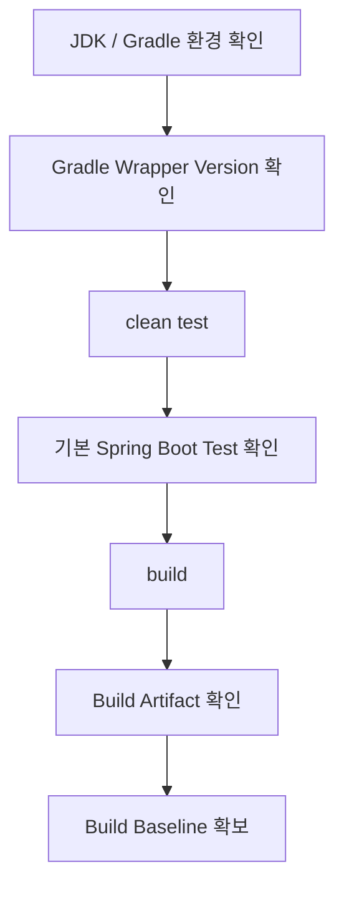

# Spring Boot 초기 Build 및 Test 검증 가이드

## 1. 문서 목적

본 문서는 Spring Boot 프로젝트 생성과
JDK / VS Code 연계, Gradle Wrapper 확인이 완료된 상태에서
**최초 단일 Module Spring Boot Project가 정상적으로 Test되고 Build되는지 검증**한다.

이 단계의 완료 기준은 다음과 같다.

```text
JDK / Gradle 환경 확인
        ↓
Gradle Wrapper 확인
        ↓
clean test
        ↓
기본 Spring Boot Test 확인
        ↓
build
        ↓
Executable JAR / Plain JAR 생성 확인
        ↓
초기 Build Baseline 확보
```

실행과 기동 검증은 다음 문서에서 별도로 다룬다.

→ [Spring Boot 실행 방법](project_run_methods.md)

## 2. 검증 범위

현재 MicroServer 초기 Project의 기준 Version은 다음과 같다.

```text
Spring Boot : 4.1.1
Java        : 25
Gradle      : 9.7.1
DSL         : Groovy
```

Spring Boot 4.1.1은 Java 17 이상을 요구하며 Java 26까지 호환되고,
Gradle 8.14 이상 8.x 또는 Gradle 9.x를 공식 지원한다.

Gradle 9.7.1은 Java 25에서 실행할 수 있으므로
현재 MicroServer의 Java 25 / Gradle 9.7.1 조합은 정상적인 범위이다.

현재 검증:

- Java 25
- Gradle Wrapper
- `GRADLE_USER_HOME`
- Compile
- 기본 Spring Boot Test
- Build / Packaging
- Spring Boot Executable JAR 생성
- Compile
- 기본 Spring Boot Test
- Build / Packaging
- Spring Boot Executable JAR 생성
- Plain JAR 생성 여부 확인

아직 검증하지 않음:

- Oracle Datasource
- Controller Business API
- Service
- DAO
- Security
- Filter
- AOP
- Transaction
- Cache
- Multi-Project

!!! note "이번 문서의 범위"

    이 문서는 **Build / Test / Packaging**까지만 검증한다.

    Spring Boot Application 실행 방식과 IDE 실행 방법은
    다음 문서에서 별도로 다룬다.

    → [Spring Boot 실행 방법](project_run_methods.md)

---

## 3. Build / Test 검증 흐름



---

## 4. Terminal의 JDK 환경

VS Code의 Java Runtime 설정과 Integrated Terminal의 Shell 환경은
서로 같은 개념이 아니다.

Gradle Wrapper Script를 Terminal에서 실행하려면
Gradle을 기동할 Java를 찾을 수 있어야 한다.

MicroServer Portable 환경에서는 VS Code 실행 시
개발환경용 환경변수를 전달하도록 구성하므로,
**표준 실행 방식으로 VS Code를 실행했다면 Integrated Terminal도 먼저 현재 값을 확인한다.**

Windows PowerShell:

```powershell
$env:JAVA_HOME
java -version
javac -version
```

MicroServer 기준 `JAVA_HOME`:

```text
C:\local-microserver\tools\jdk\temurin-25
```

!!! note "수동 설정은 필요한 경우에만"

    표준 MicroServer 실행환경에서 `JAVA_HOME`이 이미 정상 전달되어 있다면
    Terminal에서 매번 다시 설정할 필요가 없다.

    환경변수가 전달되지 않은 Terminal을 별도로 실행했거나
    다른 JDK가 잡힌 경우에만 현재 Session에서 임시로 연결한다.

---

## 5. Windows PowerShell JDK 연결

먼저 현재 Terminal 환경을 확인한다.

```powershell
$env:JAVA_HOME
java -version
javac -version
```

기대 기준:

```text
JAVA_HOME
→ C:\local-microserver\tools\jdk\temurin-25

java / javac
→ Java 25
```

현재 Session에 JDK가 연결되어 있지 않은 경우에만 임시로 설정한다.

```powershell
$env:JAVA_HOME="C:\local-microserver\tools\jdk\temurin-25"
$env:Path="$env:JAVA_HOME\bin;$env:Path"
```

다시 확인:

```powershell
java -version
javac -version
```

이 설정은 현재 PowerShell Session에만 적용된다.

---

## 6. macOS JDK 연결

macOS에서는 먼저 설치된 Java 25를 확인한다.

```bash
/usr/libexec/java_home -v 25
```

현재 Shell Session에서 Java 25를 사용하려면:

```bash
export JAVA_HOME=$(/usr/libexec/java_home -v 25)
export PATH="$JAVA_HOME/bin:$PATH"
```

확인:

```bash
echo "$JAVA_HOME"
java -version
javac -version
```

!!! note

    macOS의 실제 JDK 설치 경로는 설치 방식에 따라 달라질 수 있으므로
    특정 사용자 디렉터리를 가이드에 고정하지 않는다.

---

## 7. Project Root 확인

현재 Directory가 MicroServer Project Root인지 확인한다.

Windows:

```powershell
Get-Location
```

macOS / Linux:

```bash
pwd
```

Project Root에는 최소 다음 파일이 있어야 한다.

```text
build.gradle
settings.gradle
gradlew
gradlew.bat
gradle/
└─ wrapper/
   ├─ gradle-wrapper.jar
   └─ gradle-wrapper.properties
src/
```

!!! important

    이후 `.\gradlew.bat ...` / `./gradlew ...` 명령은
    특별한 설명이 없는 한 이 Project Root에서 실행한다.

---

## 8. Gradle Wrapper Version 확인

### Windows

```powershell
.\gradlew.bat --version
```

### macOS / Linux

```bash
./gradlew --version
```

Gradle 9.7.1의 `--version` 출력에서는
Gradle Version과 함께 **Launcher JVM / Daemon JVM** 정보를 확인할 수 있다.

확인 기준:

```text
Gradle 9.7.1

Launcher JVM
→ Java 25 기준 확인

Daemon JVM
→ Java 25 기준 확인
```

실제 출력의 Vendor, 설치 경로 등의 문구는 환경에 따라 달라질 수 있다.

!!! tip "`GRADLE_USER_HOME`도 함께 확인"

    MicroServer Windows Portable 환경에서는 다음 값을 확인한다.

    ```powershell
    $env:GRADLE_USER_HOME
    ```

    기대값:

    ```text
    C:\local-microserver\gradle-home
    ```

    Wrapper 기반 Project Build는 별도 설치 Gradle의 `GRADLE_HOME`보다
    Project의 Wrapper와 `GRADLE_USER_HOME`을 중심으로 동작한다.

---

## 9. `clean test` 실행

### Windows

```powershell
.\gradlew.bat clean test
```

### macOS / Linux

```bash
./gradlew clean test
```

대표적인 Task 흐름은 다음과 같이 이해한다.

```text
clean
→ 이전 build/ 결과 제거

test
→ main Source Compile / Resource 처리
→ test Source Compile / Resource 처리
→ Test 실행
```

실제 Gradle은 Task Dependency Graph에 따라 필요한 Task를 결정하므로
출력되는 Task 순서는 Project 구성에 따라 일부 달라질 수 있다.

기본 Spring Boot Test가 정상 실행되어야 한다.

---

## 10. Test 성공 확인

가장 먼저 Gradle 실행 마지막 부분의 다음 상태를 확인한다.

```text
BUILD SUCCESSFUL
```

Test 결과를 자세히 확인하려면 다음 결과를 사용할 수 있다.

```text
build/reports/tests/test/index.html
build/test-results/test/
```

!!! note

    `Failures: 0`, `Errors: 0` 같은 표현이
    항상 Gradle Console에 동일한 형식으로 표시되는 것은 아니다.

    Console에서는 `BUILD SUCCESSFUL`을 우선 확인하고,
    상세 Test 결과가 필요하면 Gradle Test Report를 확인한다.

---

## 11. `clean test`에서 실행되는 기본 Spring Boot Test

앞 단계에서 다음 명령을 실행했다.

```powershell
.\gradlew.bat clean test
```

이때 Gradle의 `test` Task는 Project의 Test Source를 Compile한 뒤
JUnit Test를 실행한다.

현재 MicroServer Project에는 Spring Initializr가 생성한
다음 기본 Test Class가 포함되어 있다.

```java
package io.github.microserverlab.microserver;

import org.junit.jupiter.api.Test;
import org.springframework.boot.test.context.SpringBootTest;

@SpringBootTest
class MicroserverApplicationTests {

    @Test
    void contextLoads() {
    }

}
```

즉 앞에서 수행한 `clean test`에서는
이 `MicroserverApplicationTests`도 실행된다.

```text
.\gradlew.bat clean test
        ↓
Gradle test Task
        ↓
Test Source Compile
        ↓
MicroserverApplicationTests 실행
        ↓
@SpringBootTest
        ↓
Spring Boot ApplicationContext 생성 시도
        ↓
contextLoads() Test 실행
```

### `@SpringBootTest`

```java
@SpringBootTest
```

Spring Boot Application을 Test 환경에서 구성하여
`ApplicationContext`가 정상적으로 생성되는지 확인할 수 있도록 한다.

현재 단계에서는 Controller나 Service 같은 업무 기능을 검증하는 것이 아니라,
**Spring Boot Project의 기본 구성 자체가 정상적으로 올라올 수 있는지**를 확인하는 용도이다.

### `@Test`

```java
@Test
void contextLoads() {
}
```

`@Test`는 JUnit이 실행할 Test Method라는 의미이다.

`contextLoads()` 내부에는 별도의 Test Code가 없지만,
이 Method가 실행되는 과정에서 `@SpringBootTest`에 의해
Spring Boot의 `ApplicationContext`가 생성된다.

따라서 Application 설정, Bean 구성, Dependency 등의 문제로
ApplicationContext 생성에 실패하면 이 Test도 실패한다.

```text
ApplicationContext 생성 성공
→ contextLoads() 성공
→ Gradle test 계속 진행

ApplicationContext 생성 실패
→ contextLoads() 실패
→ Gradle test 실패
```

!!! note "`contextLoads()`의 목적"

    `contextLoads()`는 업무 기능이나 API의 정상 동작을 검증하는 Test가 아니다.

    현재 초기 검증 단계에서는 다음 Baseline을 확인한다.

    ```text
    Spring Boot Project
            ↓
    기본 ApplicationContext 생성 가능
            ↓
    초기 Project 구성 정상
    ```

    따라서 현재 단계에서는 이 Test를 삭제하지 않고
    **초기 Project Baseline 검증용 Test**로 사용한다.

---

## 12. Test 실패 시 바로 다음 단계로 넘어가지 않는다

다음과 같은 문제가 발생하면 Multi-Project 구성을 진행하지 않는다.

```text
Compilation Error
Dependency Resolution Error
Test Failure
JDK Version Error
Plugin Error
```

현재 단일 Project 상태에서 원인을 먼저 해결한다.

---

## 13. Build / Package 실행

Test 성공 후 전체 Build를 수행한다.

### Windows

```powershell
.\gradlew.bat build
```

### macOS / Linux

```bash
./gradlew build
```

Gradle의 `build` Task는 일반적으로 다음 영역을 함께 검증한다.

```text
Compile
→ Test / Check
→ Assemble
→ Packaging
```

Spring Boot Gradle Plugin과 Java Plugin이 적용된 현재 Project에서는
`assemble`이 `bootJar`에 의존하므로 `build` 실행 시 Executable JAR도 생성된다.

!!! note "`clean test` 후 다시 `build`하는 이유"

    `build` 자체에도 Test가 포함되므로 기능상 일부 중복이 있다.

    이 가이드에서는 문제 발생 시 원인을 구분하기 쉽도록

    ```text
    clean test
    → Test Baseline 먼저 확인

    build
    → Packaging까지 확장 확인
    ```

    순서로 검증한다.

    앞 단계 결과가 그대로 유효하면 일부 Task는 `UP-TO-DATE`로 처리될 수 있다.

---

## 14. Build Artifact 확인

정상 Build 후 다음 Directory가 생성된다.

```text
build/
└─ libs/
```

확인:

Windows:

```powershell
Get-ChildItem .\build\libs
```

macOS / Linux:

```bash
ls -la build/libs
```

Spring Boot Gradle Plugin 4.1.1의 기본 Packaging에서는
Executable JAR와 Plain JAR가 함께 생성될 수 있다.

예:

```text
microserver-0.0.1-SNAPSHOT.jar
microserver-0.0.1-SNAPSHOT-plain.jar
```

구분:

```text
microserver-0.0.1-SNAPSHOT.jar
→ Spring Boot Executable JAR
→ java -jar 실행 대상

microserver-0.0.1-SNAPSHOT-plain.jar
→ 일반 Plain JAR
→ Spring Boot Executable JAR가 아님
```

실제 Artifact 이름은 Project 이름, Version,
`bootJar` / `jar` 설정에 따라 달라질 수 있다.

!!! tip "`bootJar`만 별도로 확인할 수도 있음"

    필요하면 다음 Task를 직접 실행할 수 있다.

    ```powershell
    .\gradlew.bat bootJar
    ```

    하지만 현재 Baseline 검증에서는 전체 `build`가 성공하는지를 기준으로 확인한다.

### `bootJar`와 Plain JAR의 차이

Spring Boot Project에서는 일반 Java Plugin의 `jar` Task와
Spring Boot Plugin의 `bootJar` Task를 구분해서 이해하면 좋다.

```text
Gradle Java Plugin
        ↓
       jar
        ↓
일반 Java JAR
        ↓
*-plain.jar
```

```text
Spring Boot Gradle Plugin
        ↓
      bootJar
        ↓
Spring Boot Executable JAR
        ↓
*.jar
```

#### Spring Boot Executable JAR

```text
microserver-0.0.1-SNAPSHOT.jar
```

`bootJar` Task가 만드는 Spring Boot 실행용 Archive이다.

내부에는 Application Class뿐 아니라
Spring Boot Loader와 Runtime Dependency를 실행할 수 있는 구조가 포함된다.

대표적인 내부 구조:

```text
META-INF/
BOOT-INF/
├─ classes/
└─ lib/
```

따라서 다음과 같이 직접 실행할 수 있다.

```powershell
java -jar .\build\libs\microserver-0.0.1-SNAPSHOT.jar
```

#### Plain JAR

```text
microserver-0.0.1-SNAPSHOT-plain.jar
```

일반 Java `jar` Task가 만드는 Archive이다.

Spring Boot Executable JAR처럼 Dependency와 Boot Loader를 포함한
실행 Package가 아니므로 현재 Application 실행 대상으로 사용하지 않는다.

일반 JAR는 향후 Multi-Project에서
`module-common`과 같은 **Library Module**을 Packaging할 때 중요해진다.

```text
module-common
→ 공통 Utility / DTO / Exception / Framework Code
→ 일반 JAR
→ 다른 Module이 Dependency로 사용

runtime / admin
→ Spring Boot Application
→ bootJar
→ 실행 / 배포
```

!!! tip "`bootJar` Task"

    Spring Boot Executable JAR만 별도로 만들고 싶다면 다음 Task를 실행할 수 있다.

    ```powershell
    .\gradlew.bat bootJar
    ```

    현재 초기 Baseline 검증에서는 Test와 Packaging을 함께 확인하기 위해
    `bootJar`만 실행하기보다 전체 `build` 성공을 기준으로 본다.

---

## 15. `build/` Git 제외 확인

```bash
git status
```

정상적으로 `.gitignore`가 적용되어 있다면
`build/` Build 결과는 Git 변경사항으로 나타나지 않아야 한다.

Build Artifact를 Git에 Commit하지 않는다.

---

## 16. 완료 기준

다음 항목이 정상이라면 초기 Build / Test Baseline이 확보된 것이다.

```text
Gradle Wrapper      → Gradle 9.7.1
Java                → Java 25
clean test          → BUILD SUCCESSFUL
contextLoads()      → 성공
build               → BUILD SUCCESSFUL
Executable JAR      → 생성
Plain JAR           → 생성 여부 확인 / 용도 구분
build/              → Git 제외
```

다음 단계에서는 같은 Project를 여러 방식으로 실제 실행한다.

→ [Spring Boot 실행 방법](project_run_methods.md)
