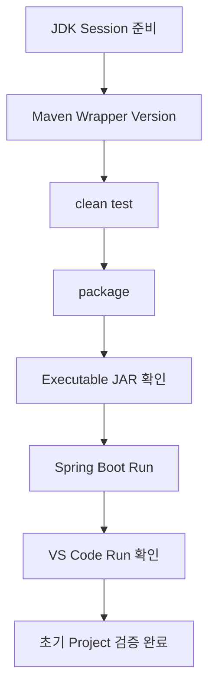
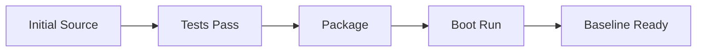

# Spring Boot 초기 실행 및 Build 검증 가이드

## 1. 문서 목적

본 문서는 Spring Boot 프로젝트 생성과
JDK / VS Code / Maven Wrapper 설정이 완료된 상태에서
**최초 단일 Module Spring Boot Project가 정상적으로 Build되고 실행되는지 검증**한다.

이 단계는 Maven Multi Module 구조로 변경하기 전에 수행한다.

왜 먼저 검증하는가?

```text
초기 단일 Project 정상
        ↓
Multi Module 변경
        ↓
문제 발생
        ↓
Multi Module 변경사항을 원인으로 좁힐 수 있음
```

반대로 초기 Project를 검증하지 않고 바로 Multi Module로 변경하면
문제가 Project 생성 때문인지 구조 변경 때문인지 구분하기 어렵다.

---

## 2. 검증 범위

현재 검증:

- Java 26
- Maven Wrapper
- Maven Project Import
- Compile
- 기본 Spring Boot Test
- Package
- Executable JAR 생성
- Spring Boot Application 기동
- VS Code Run / Debug 가능 여부
- Spring Boot Dashboard 인식

아직 검증하지 않음:

- Oracle Datasource
- Controller Business API
- Service
- DAO
- Security
- Filter
- AOP
- Transaction
- Cache
- Multi Module

---

## 3. 검증 흐름



---

## 4. Terminal의 JDK 환경

VS Code에서 Project JDK를 설정했다고 해서
Integrated Terminal의 Shell 환경변수가 자동으로 동일하게 설정되는 것은 아니다.

Maven Wrapper Script는 Terminal에서 Java를 찾아야 한다.

MicroServer에서는 시스템 `JAVA_HOME`을 영구 고정하지 않으므로
현재 Terminal Session에 JDK를 임시 연결한다.

---

## 5. Windows PowerShell JDK 연결

```powershell
$env:JAVA_HOME="C:\dev\jdks\temurin-26"
$env:Path="$env:JAVA_HOME\bin;$env:Path"
```

확인:

```powershell
java -version
javac -version
```

기대:

```text
Java 26
```

---

## 6. macOS JDK 연결

```bash
export JAVA_HOME="$HOME/dev/jdks/temurin-26.jdk/Contents/Home"
export PATH="$JAVA_HOME/bin:$PATH"
```

확인:

```bash
java -version
javac -version
```

---

## 7. Project Root 확인

현재 Directory:

Windows:

```powershell
Get-Location
```

macOS:

```bash
pwd
```

다음 파일이 있어야 한다.

```text
pom.xml
mvnw
mvnw.cmd
src/
```

---

## 8. Maven Wrapper Version 확인

### Windows

```powershell
.\mvnw.cmd -version
```

### macOS

```bash
./mvnw -version
```

확인:

```text
Apache Maven 3.9.16
Java version: 26
```

---

## 9. `clean test` 실행

### Windows

```powershell
.\mvnw.cmd clean test
```

### macOS

```bash
./mvnw clean test
```

Maven Lifecycle:

```text
clean
  ↓
compile
  ↓
testCompile
  ↓
test
```

기본 Spring Boot Test가 정상 실행되어야 한다.

---

## 10. Test 성공 확인

Maven 마지막 부분에서 다음 상태를 확인한다.

```text
BUILD SUCCESS
```

Test:

```text
Failures: 0
Errors: 0
```

실제 출력 형식은 Maven / Plugin Version에 따라 다를 수 있다.

---

## 11. `contextLoads()`의 의미

Spring Initializr 기본 Test:

```java
@SpringBootTest
class ...ApplicationTests {

    @Test
    void contextLoads() {
    }
}
```

이 Test는 복잡한 업무 기능을 검증하는 것이 아니다.

현재 목적:

```text
Spring Boot ApplicationContext
        ↓
기본 구성 가능 여부 확인
```

따라서 초기 환경 검증 단계에서 삭제하지 않는다.

---

## 12. Test 실패 시 바로 다음 단계로 넘어가지 않는다

다음과 같은 문제가 발생하면 Multi Module 구성을 진행하지 않는다.

```text
Compilation Error
Dependency Resolution Error
Test Failure
JDK Version Error
Plugin Error
```

현재 단일 Project 상태에서 원인을 먼저 해결한다.

---

## 13. Package 실행

Test 성공 후 Package를 수행한다.

### Windows

```powershell
.\mvnw.cmd package
```

### macOS

```bash
./mvnw package
```

Maven은 Test도 기본 Lifecycle에 포함하여 수행한다.

---

## 14. Build Artifact 확인

정상 Build 후:

```text
target/
```

Directory가 생성된다.

확인:

Windows:

```powershell
Get-ChildItem .\target
```

macOS:

```bash
ls -la target
```

Spring Boot Executable JAR가 생성된다.

예:

```text
microserver-0.0.1-SNAPSHOT.jar
```

실제 Artifact 이름은 `pom.xml` 값에 따라 달라질 수 있다.

---

## 15. `target/` Git 제외 확인

```bash
git status
```

정상적으로 `.gitignore`가 적용되어 있다면
`target/` Build 결과는 Git 변경사항으로 나타나지 않아야 한다.

Build Artifact를 Git에 Commit하지 않는다.

---

## 16. Spring Boot Maven Plugin 실행

### Windows

```powershell
.\mvnw.cmd spring-boot:run
```

### macOS

```bash
./mvnw spring-boot:run
```

Application Log를 확인한다.

---

## 17. 정상 기동 확인

Log에서 다음과 같은 정보를 확인한다.

```text
Spring Boot Version
Java Version
Embedded Web Server
Port 8080
Started ...Application
```

Spring Boot 4.1 Web MVC Project에서는
내장 Servlet Container가 시작된다.

현재 Controller를 아직 만들지 않았으므로
Root URL에 Business Response가 없어도 정상이다.

---

## 18. `localhost:8080` 확인

Browser:

```text
http://localhost:8080
```

현재 Controller / Static Page가 없기 때문에
404 Response가 나타날 수 있다.

!!! info "404가 실패를 의미하지 않음"

    현재 검증 목적은 Application이 정상 기동되어
    Web Server가 8080 Port에서 요청을 받을 수 있는지 확인하는 것이다.

    아직 Controller를 만들지 않았으므로 `/` URL에 404가 반환될 수 있다.

---

## 19. Application 종료

Terminal:

```text
Ctrl + C
```

정상 종료되는지 확인한다.

---

## 20. Executable JAR 직접 실행

Package 결과를 직접 실행할 수도 있다.

먼저 JAR 이름 확인:

```bash
ls target
```

Windows PowerShell:

```powershell
java -jar .\target\microserver-0.0.1-SNAPSHOT.jar
```

macOS:

```bash
java -jar target/microserver-0.0.1-SNAPSHOT.jar
```

실제 JAR 이름이 다르면 해당 파일명을 사용한다.

---

## 21. Maven 실행과 JAR 실행의 차이

```text
./mvnw spring-boot:run
→ Maven Plugin을 통해 실행

java -jar target/...jar
→ Package된 Executable JAR 직접 실행
```

두 방식 모두 정상적으로 Application을 실행할 수 있어야 한다.

---

## 22. VS Code Main Class 실행

생성된:

```text
*Application.java
```

파일을 연다.

Main Method 위 또는 Editor의 Run 기능을 이용하여 실행한다.

Java Extension과 Spring Boot Extension이 정상적으로 Project를 인식하면
VS Code에서도 Application 실행이 가능하다.

---

## 23. VS Code Debug 실행

Main Class:

```text
Run
Debug
```

중 Debug를 선택한다.

현재 Breakpoint를 별도로 만들 필요는 없다.

목적:

```text
VS Code Java Debugger
        ↓
Project JDK
        ↓
Spring Boot Application
```

연계가 가능한지 확인한다.

Application 기동 후 종료한다.

---

## 24. Spring Boot Dashboard 실행

Spring Boot Dashboard에서
MicroServer Application을 선택한다.

다음 기능을 확인할 수 있다.

```text
Start
Stop
Debug
```

Dashboard 실행도 정상인지 확인한다.

CLI Build가 정상인데 Dashboard만 문제가 있다면
Spring Boot Extension 상태를 점검한다.

---

## 25. VS Code Output 확인

문제가 있을 경우:

```text
View
→ Output
```

다음 Channel을 확인한다.

```text
Language Support for Java
Maven for Java
Spring Boot Tools
```

---

## 26. Dependency Download

첫 Maven Build에서는 Local Repository에 없는 Dependency를 Download한다.

Local Repository:

Windows:

```text
C:\Users\<USER>\.m2\repository
```

macOS:

```text
~/.m2/repository
```

첫 Build가 이후 Build보다 오래 걸릴 수 있다.

---

## 27. Network / Repository 오류

Dependency Download 실패 시 다음을 확인한다.

```text
Internet
Proxy
회사 Nexus / Artifactory
~/.m2/settings.xml
Repository 인증
```

개인 `settings.xml` 문제라면 Project `pom.xml`에 Credential을 추가하지 않는다.

---

## 28. Port 8080 충돌

Spring Boot 실행 중 다음 형태의 오류가 발생할 수 있다.

```text
Port 8080 was already in use
```

Windows:

```powershell
netstat -ano | findstr :8080
```

macOS:

```bash
lsof -i :8080
```

현재 단계에서는 임의로 `server.port`를 영구 변경하기보다
충돌 Process를 확인하고 정리한다.

---

## 29. Java Version 오류

Wrapper:

```text
Java version: ...
```

가 26이 아닌 경우 현재 Terminal의 환경을 다시 확인한다.

Windows:

```powershell
$env:JAVA_HOME
where.exe java
```

macOS:

```bash
echo $JAVA_HOME
which java
```

---

## 30. VS Code는 정상인데 Terminal Build가 실패하는 경우

가능한 구조:

```text
VS Code Java Runtime
→ Java 26

Terminal
→ 다른 Java 또는 Java 없음
```

이는 두 환경의 JDK 탐색 경로가 다르기 때문이다.

Terminal에서 현재 Session JDK를 다시 연결한다.

---

## 31. `pom.xml` 변경 후 VS Code가 반영하지 않는 경우

Command Palette:

```text
Java: Import Java Projects in Workspace
```

또는 문제가 지속되면:

```text
Java: Clean Java Language Server Workspace
```

사용 후 Project를 다시 Import한다.

---

## 32. 초기 검증 결과

모두 성공해야 한다.

```text
Wrapper Version      → OK
Java 26              → OK
clean test           → BUILD SUCCESS
package              → BUILD SUCCESS
Executable JAR       → 생성
spring-boot:run      → 정상 기동
VS Code Run          → 정상
Spring Dashboard     → Project 인식
```

---

## 33. 이 단계에서 소스 코드를 추가하지 않는 이유

초기 실행 확인을 위해:

```text
HelloController
TestController
SampleService
```

같은 임시 코드를 만들지 않는다.

현재 생성된 Spring Boot Application 자체의 정상 여부만 확인한다.

업무 / Framework Source는
Multi Module 구조를 먼저 만든 후 해당 구조 안에서 작성한다.

---

## 34. Git 상태 확인

Build 수행 후:

```bash
git status
```

Build Output 때문에 Repository가 Dirty 상태가 되지 않는지 확인한다.

정상:

```text
nothing to commit, working tree clean
```

또는 의도한 설정 변경만 있어야 한다.

---

## 35. 검증 단계 Commit

이 단계에서 Source File 변경이 없다면
검증만을 위해 Empty Commit을 강제로 만들 필요는 없다.

대신 앞 단계의 설정 Commit이 존재하고
현재 Build가 성공하는 상태를 확인한다.

필요하다면 Git Tag나 별도 Project 기록 정책을 이후 정할 수 있다.

---

## 36. 완료 기준



이 상태는 다음 Multi Module 변경 전의 **Baseline**이다.

---

## 37. 체크리스트

- [ ] Maven Wrapper가 Maven 3.9.16을 사용한다.
- [ ] Wrapper가 Java 26을 사용한다.
- [ ] `clean test`가 성공한다.
- [ ] 기본 `contextLoads` Test가 성공한다.
- [ ] `package`가 성공한다.
- [ ] Executable JAR가 생성된다.
- [ ] `target/`이 Git에서 제외된다.
- [ ] `spring-boot:run`으로 정상 기동된다.
- [ ] 8080 Port에서 Web Server가 실행된다.
- [ ] Controller가 없으므로 `/`의 404가 정상일 수 있음을 확인했다.
- [ ] `java -jar` 실행이 가능하다.
- [ ] VS Code Run이 가능하다.
- [ ] VS Code Debug가 가능하다.
- [ ] Spring Boot Dashboard가 Application을 인식한다.
- [ ] Git Working Tree 상태를 확인했다.

---

## 38. 다음 단계

초기 단일 Module Project가 정상임을 확인했다.

다음 단계에서는 Project를
**Parent + Application Module + Common JAR Module** 구조로 전환한다.

→ [Maven 멀티모듈 기본 구성](../project_structure/maven_multi_module_setup.md)

```text
Single Module Baseline 검증       ← 현재 완료
        ↓
Maven Multi Module 구성
        ↓
공통 Framework 구현
```

---

## 39. 공식 참고 자료

- Spring Boot Maven Plugin  
  <https://docs.spring.io/spring-boot/maven-plugin/>

- Apache Maven Build Lifecycle  
  <https://maven.apache.org/guides/introduction/introduction-to-the-lifecycle.html>

- Running and Debugging Java in VS Code  
  <https://code.visualstudio.com/docs/java/java-debugging>

- Spring Boot in Visual Studio Code  
  <https://code.visualstudio.com/docs/java/java-spring-boot>
