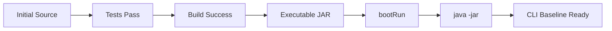

# 초기 Project 검증 및 Troubleshooting 가이드

## 1. 문서 목적

본 문서는 초기 Build / Test와 Spring Boot 실행 검증 이후
**발생할 수 있는 대표적인 문제를 확인하고 최종 Project Baseline을 확정**한다.

앞 단계:

```text
초기 Build / Test 검증
        ↓
Spring Boot 실행 방법 검증
        ↓
[ 초기 Project 검증 / Troubleshooting ]  ← 현재
        ↓
문제 유형별 확인
→ Network / Port / Java / VS Code / Output Log
        ↓
최종 Baseline 확정
        ↓
Gradle Multi-Project 구성
```

관련 문서:

- [Spring Boot 초기 Build 및 Test 검증](project_initial_build_verification.md)
- [Spring Boot 실행 방법](project_run_methods.md)

## 2. Dependency / Gradle Distribution Download

Gradle Wrapper를 처음 실행할 때
해당 Gradle Distribution이 `GRADLE_USER_HOME`에 없다면 다운로드될 수 있다.

MicroServer Windows Portable 환경 기준:

```text
C:\local-microserver\gradle-home\wrapper\dists\
```

또한 Test / Build를 처음 수행할 때
Local Cache에 없는 Plugin 및 Dependency가 Repository에서 다운로드될 수 있다.

Dependency Cache:

```text
C:\local-microserver\gradle-home\caches\
```

macOS / Linux에서 `GRADLE_USER_HOME`을 별도로 지정하지 않았다면
기본적으로 다음 위치를 사용한다.

```text
~/.gradle/
```

!!! note

    Gradle Distribution Download는 반드시 "첫 Build"에서만 발생하는 것이 아니다.

    예를 들어 그 전에:

    ```text
    ./gradlew --version
    ```

    을 실행했다면 그 시점에 Wrapper Distribution이 먼저 다운로드될 수 있다.

첫 Dependency Resolution은 이후 실행보다 시간이 더 걸릴 수 있다.

---

## 3. Network / Repository 오류

Dependency 또는 Plugin Download 실패 시 다음 항목을 확인한다.

```text
Internet / Network
Proxy
Repository 설정
회사 Nexus / Artifactory
Repository 인증
GRADLE_USER_HOME\gradle.properties
```

MicroServer Windows Portable 환경의 개인 Gradle 설정 파일:

```text
C:\local-microserver\gradle-home\gradle.properties
```

Project 공통 설정이 필요한 경우에는 Project의 `gradle.properties`도 구분해서 확인한다.

!!! warning "Credential"

    Repository ID / Password / Token 같은 Credential을
    `build.gradle`에 직접 작성하여 Git에 Commit하지 않는다.

    개발자별 민감정보는 Project Source와 분리하여 관리한다.

---

## 4. Port 8080 충돌

Spring Boot 실행 중 다음 형태의 오류가 발생할 수 있다.

```text
Port 8080 was already in use
```

Windows:

```powershell
netstat -ano | findstr :8080
```

macOS:

```bash
lsof -i :8080
```

현재 단계에서는 임의로 `server.port`를 영구 변경하기보다
충돌 Process를 확인하고 정리한다.

---

## 5. Java Version 오류

먼저 Wrapper Version 정보를 확인한다.

```powershell
.\gradlew.bat --version
```

Gradle 9.7.1에서는 다음 JVM 정보를 구분해서 확인한다.

```text
Launcher JVM
Daemon JVM
```

MicroServer Local 기준으로 두 JVM이 Java 25 환경을 사용하는지 확인한다.

Windows:

```powershell
$env:JAVA_HOME
where.exe java
java -version
```

macOS / Linux:

```bash
echo "$JAVA_HOME"
which java
java -version
```

!!! note "Gradle JVM과 Java Toolchain"

    Gradle을 실행하는 JVM과
    Project Compile / Test 등에 사용하는 Java Toolchain은 개념적으로 구분된다.

    현재 MicroServer Local Baseline에서는 환경을 단순하게 유지하기 위해
    Gradle 실행 JVM과 Project Toolchain 모두 Java 25 기준으로 확인한다.

---

## 6. VS Code는 정상인데 Terminal Build가 실패하는 경우

가능한 구조:

```text
VS Code Java Runtime
→ Java 25

Integrated Terminal 또는 별도 PowerShell
→ 다른 Java / JAVA_HOME 미설정
```

VS Code Java Runtime 설정과 Shell 환경변수는 서로 다른 경로로 적용될 수 있다.

MicroServer 표준 실행 방식으로 VS Code를 실행했다면
Integrated Terminal에 환경변수가 전달되었는지 먼저 확인한다.

```powershell
$env:JAVA_HOME
$env:GRADLE_USER_HOME
java -version
```

기대 기준:

```text
JAVA_HOME
→ C:\local-microserver\tools\jdk\temurin-25

GRADLE_USER_HOME
→ C:\local-microserver\gradle-home
```

값이 다르면 현재 Terminal이 MicroServer 개발환경을 상속받아 실행되었는지 확인한다.

---

## 7. `build.gradle` / `settings.gradle` 변경 후 VS Code가 반영하지 않는 경우

Gradle Build Script를 변경한 뒤 VS Code의 Java Project Model이 갱신되지 않는 경우
Command Palette에서 다음 명령을 사용할 수 있다.

```text
Java: Import Java Projects into Workspace
```

문제가 지속되면:

```text
Java: Clean Java Language Server Workspace
```

를 실행하여 Java Language Server Workspace를 정리한 후 다시 확인한다.

!!! note

    Extension Version에 따라 메뉴 문구나 동작 방식이 조금 달라질 수 있다.
    먼저 CLI의 Gradle Build가 정상인지 확인한 뒤 IDE Import 문제를 분리해서 점검한다.

    문제가 계속되면 다음 장의 `VS Code Output Log 확인`에서
    Java / Gradle 관련 Output Channel을 확인한다.

---

## 8. VS Code Output Log 확인

CLI의 Gradle Build는 정상인데
VS Code의 Java Project 인식, Run / Debug,
Spring Boot Dashboard 등에 문제가 있을 경우
VS Code의 `Output` 패널에서 Extension Log를 확인할 수 있다.

### Output 패널 열기

VS Code 메뉴:

```text
View
→ Output
```

또는 화면 하단 Panel에서 다음 `Output` 탭을 선택한다.

```text
Problems | Output | Debug Console | Terminal
           ↑
         Output
```

`Output`과 `Terminal`은 역할이 다르다.

```text
Terminal
→ 사용자가 PowerShell / Shell 명령을 직접 실행하는 영역

Output
→ VS Code와 Extension이 내부적으로 수행한 작업의 Log를 확인하는 영역
```

예를 들어 다음과 같은 문구가 Output에 표시될 수 있다.

```text
Activating task providers java
```

이런 메시지는 사용자가 직접 실행한 명령 결과가 아니라
VS Code의 Java 관련 Extension이 내부적으로 동작하면서 남긴 Log이다.

### Output Channel이란?

`Output` 패널에는 여러 Extension과 VS Code 기능의 Log가 함께 존재한다.

따라서 어떤 기능의 Log를 볼 것인지 선택해야 하는데,
이 Log Source를 **Output Channel**이라고 한다.

```text
Output
   ↓
Channel 선택
   ↓
Language Support for Java
Gradle for Java
Build Server for Gradle
Spring Boot Tools
...
```

즉 `Channel`은 별도의 화면이나 메뉴 기능이 아니라
**현재 Output 패널에 어떤 Extension의 Log를 표시할 것인지 선택하는 항목**이다.

일반적으로 Output 패널 오른쪽 위의 Channel 선택 Drop-down에서
원하는 항목을 선택할 수 있다.

!!! note "Channel 이름은 환경에 따라 조금 다를 수 있음"

    설치된 Extension Version과 VS Code Version에 따라
    실제 Channel 이름은 조금 다르게 표시될 수 있다.

    예:

    ```text
    Language Support for Java
    Gradle for Java
    Build Server for Gradle
    Spring Boot Tools
    ```

    정확히 같은 이름이 없더라도
    `Java`, `Gradle`, `Spring Boot` 관련 이름을 가진 Channel을 확인한다.

### Java Project 인식 문제가 있을 때

다음 Channel을 먼저 확인한다.

```text
Language Support for Java
```

주로 다음 내용을 확인할 수 있다.

```text
Java Language Server 시작 여부
JDK 인식 여부
Java Project Import 상태
Classpath 구성
Java Source 분석 오류
```

예를 들어:

```text
CLI
.\gradlew.bat build
→ 정상

VS Code Editor
→ Java Source에 오류 표시
→ Project가 제대로 인식되지 않음
```

과 같은 경우라면
`Language Support for Java` Channel을 확인한다.

!!! tip "Java Language Server 관련 문제"

    다음과 같은 경우 Java Language Server Log가 도움이 된다.

    ```text
    import 문에 오류 표시
    Class를 찾지 못함
    Java Project View가 이상함
    Main Class Run / Debug가 나타나지 않음
    ```

### Gradle Project 인식 문제가 있을 때

다음 Channel을 확인한다.

```text
Gradle for Java
```

환경에 따라 다음 이름이 보일 수도 있다.

```text
Build Server for Gradle
```

주로 다음 내용을 확인한다.

```text
Gradle Project Import
Gradle Wrapper 실행
Gradle Build Server 시작
Dependency Resolution
build.gradle / settings.gradle 인식
Gradle JVM 관련 오류
```

예:

```text
CLI
.\gradlew.bat build
→ 정상

VS Code
Gradle Project View
→ Project가 나타나지 않음
```

이라면 Project Source 자체보다는
VS Code Gradle Extension 또는 Project Import 문제일 가능성이 있으므로
Gradle 관련 Output Channel을 확인한다.

### Spring Boot Dashboard 문제가 있을 때

Spring Boot Dashboard에서
`microserver` Application이 나타나지 않거나
Run / Debug / Stop Action이 정상적으로 동작하지 않는 경우에는
Spring Boot 관련 Channel을 확인한다.

예:

```text
Spring Boot Tools
```

주로 다음 내용을 확인한다.

```text
Spring Boot Project 검색
Application Main Class 인식
Spring Boot Dashboard 등록
Application 실행 관련 오류
```

예를 들어:

```text
.\gradlew.bat bootRun
→ 정상 기동

Spring Boot Dashboard
→ microserver Application이 나타나지 않음
```

이라면 Spring Boot Extension 연계 문제를 의심할 수 있다.

### VS Code Run / Debug 문제가 있을 때

Main Class의 `Run | Debug` CodeLens가 보이지 않거나,
Run / Debug 실행 중 문제가 발생하면 다음 영역을 함께 확인한다.

```text
Output
→ Java 관련 Channel

Debug Console
→ Debug 실행 중 발생한 Log / Message
```

구분:

```text
Output
→ Extension / Project 인식 / Language Server 상태 확인

Debug Console
→ 실제 Debug Session 실행 상태 확인
```

### 문제 유형별 확인 Channel

| 문제 상황 | 먼저 확인할 영역 |
|---|---|
| Java Source / Project 인식 문제 | `Language Support for Java` |
| Gradle Project Import 문제 | `Gradle for Java` / `Build Server for Gradle` |
| Gradle Wrapper / Build Server 연계 문제 | Gradle 관련 Output Channel |
| Spring Boot Dashboard 인식 문제 | `Spring Boot Tools` |
| VS Code Run 문제 | Java 관련 Output Channel |
| VS Code Debug 문제 | Java 관련 Output + `Debug Console` |

### CLI와 VS Code 문제를 분리해서 확인

VS Code에서 문제가 발생했다고 해서
바로 Project Source나 `build.gradle`의 문제라고 판단하지 않는다.

먼저 Terminal에서 Project 자체가 정상인지 확인한다.

```powershell
.\gradlew.bat clean test
.\gradlew.bat build
.\gradlew.bat bootRun
```

다음과 같이 구분해서 판단한다.

```text
CLI도 실패
→ Project / JDK / Gradle / Dependency 문제 가능성

CLI는 정상
VS Code만 실패
→ Extension / Project Import / IDE 연계 문제 가능성
```

!!! important "Output을 보는 목적"

    `Output`은 일반적인 Application 실행 결과를 보는 곳이라기보다
    **VS Code Extension 내부 동작을 확인하는 진단용 Log 영역**으로 이해하면 된다.

    ```text
    Terminal
    → 내가 실행한 명령 확인

    Output
    → VS Code Extension 내부 동작 확인

    Output Channel
    → 어떤 Extension의 내부 Log를 볼지 선택
    ```

    따라서 CLI Build는 정상인데
    VS Code에서만 Java / Gradle / Spring Boot 기능이 이상할 때
    해당 Output Channel을 선택하여 오류 Message를 확인한다.

### Output Log의 한글이 깨져 보이는 경우

Java 관련 Output Log에서 날짜 / Locale 정보의 일부 한글이
`���` 형태로 깨져 보일 수 있다.

이 현상은 Source File Encoding과는 별개이다.

```text
files.encoding
→ .java / .json / .properties 등 Source File 읽기 / 저장 Encoding

VS Code Output Log
→ Extension / Java Process가 출력하는 내부 Log
```

따라서 `files.encoding`이 `utf8`로 설정되어 있어도
Extension Output의 일부 Locale 문자열이 깨져 보일 수 있다.

!!! note "한글 깨짐만으로 Project 오류로 판단하지 않음"

    다음 항목이 모두 정상이라면:

    ```text
    Gradle Build 정상
    Spring Boot Run 정상
    VS Code Run / Debug 정상
    Spring Boot Dashboard 정상
    ```

    Output Log 일부의 한글 깨짐만으로
    Project Build 또는 Application 오류로 판단하지 않는다.

    실제 오류 여부는 `ERROR`, Exception, Build Failure,
    Project Import 실패 등 기능상 문제가 함께 발생하는지를 기준으로 판단한다.

---

## 9. 초기 검증 결과

앞의 Build / Test 및 실행 문서에서 수행한 결과를 종합하여 다음 항목을 확인한다.

```text
Wrapper Version       → Gradle 9.7.1
Launcher / Daemon JVM → Java 25 기준
GRADLE_USER_HOME      → Local 표준 경로 확인
clean test            → BUILD SUCCESSFUL
build                 → BUILD SUCCESSFUL
Executable JAR        → 생성
bootRun               → 정상 기동
java -jar             → 정상 기동
```

IDE 연계 검증:

```text
VS Code Run           → 정상
VS Code Debug         → 정상
Spring Boot Dashboard → Application 인식
```

!!! important "Baseline 판정"

    CLI 검증이 정상이라면 Project 자체의 초기 Build / Run Baseline은 확보된 것으로 본다.

    VS Code Run / Debug / Dashboard에만 문제가 있다면
    Project Build 실패로 바로 판단하지 않고 IDE 연계 문제를 별도로 점검한다.

---

## 10. 이 단계에서 소스 코드를 추가하지 않는 이유

초기 실행 확인을 위해:

```text
HelloController
TestController
SampleService
```

같은 임시 코드를 만들지 않는다.

현재 생성된 Spring Boot Application 자체의 정상 여부만 확인한다.

업무 / Framework Source는
Multi-Project 구조를 먼저 만든 후 해당 구조 안에서 작성한다.

---

## 11. Git 상태 확인

Build 수행 후:

```bash
git status
```

Build Output 때문에 Repository가 Dirty 상태가 되지 않는지 확인한다.

정상:

```text
nothing to commit, working tree clean
```

또는 의도한 설정 변경만 있어야 한다.

---

## 12. 검증 단계 Commit

이 단계에서 Source File 변경이 없다면
검증만을 위해 Empty Commit을 강제로 만들 필요는 없다.

대신 앞 단계의 설정 Commit이 존재하고
현재 Build가 성공하는 상태를 확인한다.

필요하다면 Git Tag나 별도 Project 기록 정책을 이후 정할 수 있다.

---

## 13. 완료 기준



이 상태를 다음 Multi-Project 변경 전의 **Project Baseline**으로 확정한다.

VS Code Run / Debug / Dashboard 검증은
이 Baseline 위에서 IDE 연계 상태를 추가 확인하는 단계로 본다.

---

## 14. 체크리스트

### 핵심 CLI Baseline

- [ ] Gradle Wrapper가 Gradle 9.7.1을 사용한다.
- [ ] Gradle Launcher / Daemon JVM이 Local 기준 Java 25를 사용한다.
- [ ] `GRADLE_USER_HOME`이 Local 표준 경로를 사용한다.
- [ ] `clean test`가 성공한다.
- [ ] 기본 `contextLoads()` Test가 성공한다.
- [ ] Gradle Test Report를 확인할 수 있다.
- [ ] `build`가 성공한다.
- [ ] Spring Boot Executable JAR가 생성된다.
- [ ] Plain JAR가 있다면 Executable JAR와 구분할 수 있다.
- [ ] `build/`가 Git에서 제외된다.
- [ ] `bootRun`으로 정상 기동된다.
- [ ] 기본 설정 기준 8080 Port에서 Web Server가 실행된다.
- [ ] Controller가 없으므로 `/`의 404가 정상일 수 있음을 확인했다.
- [ ] Executable JAR를 `java -jar`로 직접 실행할 수 있다.
- [ ] Git Working Tree 상태를 확인했다.

### IDE 연계 확인

- [ ] VS Code Run이 가능하다.
- [ ] VS Code Debug가 가능하다.
- [ ] Spring Boot Dashboard가 Application을 인식한다.
- [ ] 문제가 발생하면 VS Code Output Channel에서 Java / Gradle / Spring Boot 관련 Log를 확인할 수 있다.

---

## 15. 다음 단계

초기 단일 Module Project의 Build / Test / 실행 / IDE 연계가 정상임을 확인했다.

다음 단계에서는 Project를
**Root Project + Application Subproject + Common JAR Subproject** 구조로 전환한다.

→ [Gradle Multi-Project 기본 구성](../project_structure/gradle_multi_module_setup.md)

```text
Single Module Baseline 검증       ← 현재 완료
        ↓
Gradle Multi-Project 구성
        ↓
공통 Framework 구현
```

---

## 16. 공식 참고 자료

- Spring Boot 4.1.1 System Requirements  
  <https://docs.spring.io/spring-boot/system-requirements.html>

- Spring Boot Gradle Plugin  
  <https://docs.spring.io/spring-boot/gradle-plugin/>

- Spring Boot Executable Archive Packaging  
  <https://docs.spring.io/spring-boot/gradle-plugin/packaging.html>

- Gradle 9.7.1 Compatibility Matrix  
  <https://docs.gradle.org/current/userguide/compatibility.html>

- Gradle Build Lifecycle  
  <https://docs.gradle.org/current/userguide/build_lifecycle.html>

- Gradle Command-Line Interface  
  <https://docs.gradle.org/current/userguide/command_line_interface.html>

- Running and Debugging Java in VS Code  
  <https://code.visualstudio.com/docs/java/java-debugging>

- Spring Boot in Visual Studio Code  
  <https://code.visualstudio.com/docs/java/java-spring-boot>
