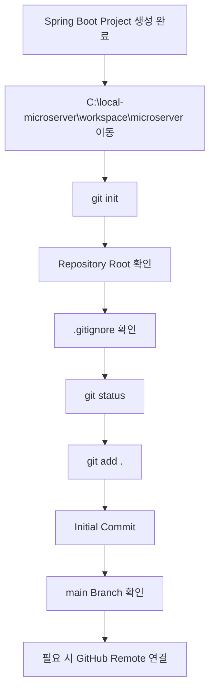

# Spring Boot 프로젝트 Git 초기화 가이드

## 1. 문서 목적

본 문서는 Spring Initializr로 생성한 MicroServer Spring Boot 프로젝트를
**독립적인 Git Repository로 초기화하고 최초 Commit 기준점을 생성하는 절차**를 설명한다.

선행 문서:

→ [Spring Boot 프로젝트 생성](spring_boot_project_create.md)

현재 단계의 Project Root:

```text
C:\local-microserver\workspace\microserver
```

현재 단계에서는 다음을 진행한다.

```text
Spring Boot 프로젝트 생성 완료
        ↓
Project Root 이동
        ↓
Git Repository 초기화
        ↓
Repository Root 확인
        ↓
.gitignore 확인
        ↓
최초 Git 상태 확인
        ↓
git add
        ↓
Initial Commit
        ↓
필요 시 GitHub Remote 연결
```

---

## 2. Git 초기화 순서 기준

신규 MicroServer 프로젝트에서는 다음 순서를 표준으로 사용한다.

```text
workspace 준비
        ↓
Spring Initializr Project 생성
        ↓
생성 결과 확인
        ↓
git init
        ↓
Initial Commit
        ↓
필요 시 GitHub Remote 연결
```

즉 **Git Repository를 먼저 만든 뒤 생성 파일을 복사하는 방식이 아니라,
Spring Boot 프로젝트를 먼저 생성한 후 해당 Project Root에서 `git init`을 수행**한다.

이 방식은 다음 장점이 있다.

- Initializr 생성 작업과 Git 초기화를 분리할 수 있다.
- 실제 생성된 Directory를 확인한 뒤 Repository Root를 확정할 수 있다.
- `microserver\microserver` 같은 Directory 중첩을 Git 초기화 전에 확인할 수 있다.
- 신규 프로젝트에서 임시 생성 후 복사하는 절차를 줄일 수 있다.

---

## 3. Project Root 이동

PowerShell:

```powershell
Set-Location C:\local-microserver\workspace\microserver
```

현재 Directory 확인:

```powershell
Get-Location
```

기대값:

```text
C:\local-microserver\workspace\microserver
```

Project 파일 확인:

```powershell
Get-ChildItem -Force
```

최소 다음 항목이 있어야 한다.

```text
build.gradle
settings.gradle
gradlew
gradlew.bat
gradle
src
.gitignore
```

!!! important "Git 초기화 전에 Project Root 확인"
    다음 위치에서 `git init`을 실행한다.

    ```text
    O C:\local-microserver\workspace\microserver
    ```

    다음 위치에서는 실행하지 않는다.

    ```text
    X C:\local-microserver
    X C:\local-microserver\workspace
    ```

---

## 4. 기존 Git 상태 확인

Git 초기화 전에 다음을 실행할 수 있다.

```powershell
git status
```

아직 Git Repository가 아니라면 다음과 같은 메시지가 나올 수 있다.

```text
fatal: not a git repository
```

신규 Spring Boot 프로젝트라면 정상적인 상태이다.

---

## 5. Git Repository 초기화

Project Root에서 실행한다.

```powershell
git init
```

초기화되면 Project Root 아래에 `.git` Directory가 생성된다.

```text
C:\local-microserver
└─ workspace
   └─ microserver
      ├─ .git
      ├─ .gitignore
      ├─ gradle
      ├─ src
      ├─ build.gradle
      └─ settings.gradle
```

`.git`은 Source File이 아니라 다음 정보를 관리하는 Git Repository Metadata이다.

```text
Commit History
Branch
Index
HEAD
Remote
Repository 설정
```

---

## 6. Repository Root 확인

```powershell
git rev-parse --show-toplevel
```

기대 결과:

```text
C:/local-microserver/workspace/microserver
```

이 결과가 다음처럼 상위 Directory를 가리킨다면 잘못된 위치에서 Git Repository가 생성된 것이다.

```text
X C:/local-microserver
X C:/local-microserver/workspace
```

정상:

```text
O C:/local-microserver/workspace/microserver
```

---

## 7. `.gitignore` 확인

Spring Initializr가 생성한 `.gitignore`를 확인한다.

```powershell
Get-Content .gitignore
```

Gradle Project의 대표적인 제외 대상:

```gitignore
.gradle/
build/
```

반대로 다음 Gradle Wrapper 파일은 Git 관리 대상이다.

```text
gradlew
gradlew.bat
gradle/wrapper/gradle-wrapper.jar
gradle/wrapper/gradle-wrapper.properties
```

!!! warning "Gradle Wrapper를 `.gitignore`로 제외하지 않음"
    Wrapper는 개발자마다 별도의 Gradle 설치를 강제하지 않고
    프로젝트에서 정한 Gradle Version을 재현하는 데 사용된다.

### 7.1 Repository 밖 Local Secret

다음 Local Secret 파일은 Source Repository 밖에 있다.

```text
C:\local-microserver\env\local-env.ps1
```

따라서 Project `.gitignore` 대상이 아니다.

```text
Repository 밖 Secret
→ Git Ignore 대상 아님
→ 개발환경 공유 ZIP / Package에서는 제외
```

향후 Repository 내부에 `.env` 같은 Secret 파일을 만들면
그때는 해당 Repository의 `.gitignore` 정책을 적용한다.

---

## 8. 최초 Git 상태 확인

Git 초기화 후:

```powershell
git status
```

Spring Boot 생성 파일이 `Untracked files`로 나타날 수 있다.

대표적인 Git 관리 대상:

```text
.gitignore
.gitattributes
build.gradle
settings.gradle
gradlew
gradlew.bat
gradle/wrapper/...
src/...
```

`.gradle/`이나 `build/`는 `.gitignore`에 의해 제외되어야 한다.

현재는 Build를 아직 실행하지 않았으므로 `build/`가 존재하지 않을 수도 있다.

---

## 9. 최초 Commit

전체 변경사항을 Staging 한다.

```powershell
git add .
```

상태 확인:

```powershell
git status
```

Commit:

```powershell
git commit -m "chore: create initial Spring Boot project"
```

이 Commit은 다음 상태를 나타내는 기준점이다.

```text
Spring Initializr 기본 생성 상태
+
Gradle Wrapper
+
기본 Source / Test
+
.gitignore
```

아직 다음 설정은 포함하지 않는다.

```text
Project JDK 상세 설정
Gradle 표준화
Oracle JDBC / Datasource
Multi-Project
Framework 공통 기능
```

!!! tip "단계별 Commit"
    프로젝트 생성 상태를 하나의 Commit으로 남겨 두면
    이후 설정 단계에서 문제가 발생했을 때
    Spring Boot 기본 생성 상태와 비교하기 쉽다.

---

## 10. Branch 확인

현재 Branch 확인:

```powershell
git branch
```

Git 설정이나 Version에 따라 초기 Branch 이름이 다를 수 있다.

프로젝트 표준 Branch를 `main`으로 사용할 경우:

```powershell
git branch -M main
```

확인:

```powershell
git branch
```

정상:

```text
* main
```

---

## 11. GitHub Remote 연결

### 11.1 Remote Repository가 아직 없는 경우

현재 Local Repository만 유지해도 된다.

```text
C:\local-microserver\workspace\microserver
└─ .git
```

나중에 GitHub Repository를 만든 뒤 Remote를 연결할 수 있다.

### 11.2 GitHub에 빈 Repository가 있는 경우

Remote를 연결한다.

```powershell
git remote add origin <GitHub Repository URL>
```

확인:

```powershell
git remote -v
```

Branch를 `main`으로 맞춘다.

```powershell
git branch -M main
```

Push:

```powershell
git push -u origin main
```

### 11.3 GitHub Repository 생성 시 권장

신규 MicroServer Source Repository는
가능하면 **빈 Repository**로 생성한다.

GitHub에서 Repository 생성 시 다음 항목을 미리 만들지 않는 방식을 권장한다.

```text
README
.gitignore
LICENSE
```

이유는 Local에서 이미 최초 Commit을 만들었기 때문이다.

---

## 12. Remote에 기존 Commit이 있는 경우

GitHub Repository를 만들면서 README, LICENSE, `.gitignore` 등을 추가했다면
Remote Repository에 이미 Commit History가 존재할 수 있다.

이 경우 Local Initial Commit과 Remote Initial Commit이 서로 다른 History가 될 수 있으므로
단순 `git push` 전에 Remote 상태를 확인해야 한다.

현재 신규 프로젝트에서는 이런 상황을 피하기 위해
**GitHub Repository를 빈 상태로 만든 뒤 Local Commit을 Push하는 방식**을 기본으로 한다.

---

## 13. 이미 Git Repository를 Clone한 경우

이미 GitHub Repository에 기존 Commit이 있고
이를 먼저 Clone한 경우는 신규 프로젝트 절차와 다르다.

예:

```text
C:\local-microserver\workspace\microserver
├─ .git
├─ README.md
└─ ...
```

이 경우에는 다시 `git init`을 하지 않는다.

권장 흐름:

```text
기존 Repository Clone
        ↓
Spring Initializr Project 임시 생성
        ↓
생성 결과 확인
        ↓
기존 Repository Root에 필요한 파일 병합
        ↓
.git / 기존 History 유지
        ↓
git status
```

!!! warning "기존 `.git`을 삭제하거나 덮어쓰지 않음"
    `.git`은 해당 Repository의 History와 Remote 정보를 가지고 있다.

    Initializr 결과를 기존 Repository에 반영할 때
    `.git` Directory를 삭제하거나 교체하지 않는다.

---

## 14. 현재 단계에서 하지 않는 작업

현재 단계는 **Git Repository 초기화와 최초 Commit**까지만 담당한다.

아직 다음 명령은 실행하지 않는다.

```text
gradlew.bat build
gradlew.bat bootRun
```

다음 구성도 아직 하지 않는다.

```text
.vscode/settings.json
.vscode/extensions.json
application-local.yml
Oracle JDBC Driver
Datasource
Docker Compose
Controller
Service
DAO
Filter
AOP
Security
Transaction
Cache
Gradle Multi-Project
```

---

## 15. 전체 흐름 요약



최종 구조:

```text
C:\local-microserver
└─ workspace
   └─ microserver
      ├─ .git
      ├─ .gitignore
      ├─ gradle
      │  └─ wrapper
      ├─ src
      ├─ build.gradle
      ├─ settings.gradle
      ├─ gradlew
      └─ gradlew.bat
```

---

## 16. 체크리스트

### 16.1 Repository 초기화

- [ ] Project Root가 `C:\local-microserver\workspace\microserver`이다.
- [ ] `C:\local-microserver`에는 `git init`을 하지 않았다.
- [ ] `C:\local-microserver\workspace`에는 `git init`을 하지 않았다.
- [ ] Project Root에서 `git init`을 실행했다.
- [ ] `.git` Directory가 생성되었다.
- [ ] `git rev-parse --show-toplevel` 결과가 Project Root이다.

### 16.2 Git 관리 대상

- [ ] `.gitignore`를 확인했다.
- [ ] `.gradle/`과 `build/`가 제외 대상이다.
- [ ] `gradlew`, `gradlew.bat`, `gradle/wrapper/`는 Git 관리 대상이다.
- [ ] Repository 밖 `local-env.ps1`은 Project `.gitignore` 대상이 아님을 확인했다.

### 16.3 최초 Commit

- [ ] `git status`로 생성 파일을 확인했다.
- [ ] `git add .`을 실행했다.
- [ ] 최초 Commit을 생성했다.
- [ ] Branch 이름을 확인했다.
- [ ] 필요하면 `main`으로 변경했다.
- [ ] GitHub Remote가 있다면 연결 상태를 확인했다.

### 16.4 단계 범위

- [ ] 아직 Build / Run을 하지 않았다.
- [ ] 아직 Project JDK / VS Code 상세 설정을 하지 않았다.
- [ ] 아직 Oracle JDBC / Datasource를 연결하지 않았다.
- [ ] 아직 Gradle Multi-Project를 구성하지 않았다.

---

## 17. 다음 단계

Git Repository 초기화와 최초 Commit이 완료되면
Spring Initializr가 생성한 프로젝트 구조와 기본 파일을 확인한다.

```text
Spring Boot 프로젝트 생성
        ↓
Git Repository 초기화 / 최초 Commit      ← 현재 완료
        ↓
생성 프로젝트 구조 확인 및 초기 정리
        ↓
프로젝트 JDK / VS Code Workspace 설정
```

다음 문서:

**[생성 프로젝트 구조 확인 및 초기 정리](spring_boot_project_initial_review.md)**
