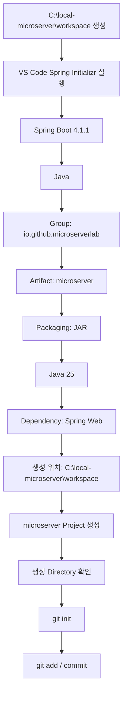

# Spring Boot 프로젝트 생성 가이드

## 1. 문서 목적

본 문서는 앞 단계에서 준비한 JDK, Gradle, VS Code, Docker / Oracle 로컬 개발환경을 기반으로
MicroServer의 **최초 Spring Boot 프로젝트를 VS Code의 Spring Initializr로 생성하는 실제 절차**를 설명한다.

이 문서는 VS Code에서 프로젝트를 생성할 때 나타나는 Wizard 흐름과
가이드의 설명 순서를 최대한 동일하게 맞추는 것을 기준으로 한다.

현재 단계에서는 다음까지 진행한다.

```text
workspace Directory 준비
        ↓
VS Code Spring Initializr 실행
        ↓
Spring Boot Version 선택
        ↓
Language 선택
        ↓
Group ID 입력
        ↓
Artifact ID 입력
        ↓
Packaging 선택
        ↓
Java Version 선택
        ↓
Dependency 선택
        ↓
프로젝트 생성 위치 선택
        ↓
Spring Boot Project 생성
        ↓
Git Repository 초기화
        ↓
생성 상태 확인
```

아직 다음 작업은 진행하지 않는다.

- 프로젝트별 VS Code Workspace JDK 상세 설정
- Gradle Wrapper Version 표준화
- Build / Run 검증
- Gradle Multi-Project 구성
- Oracle JDBC Driver / Datasource 구성
- Controller / Service / DAO 구현
- Filter / AOP 구현
- Security / Transaction / Cache 구성
- 업무 Schema Object 구현

!!! info "프로젝트 생성과 Git 초기화의 순서"
    본 가이드에서는 **Spring Boot 프로젝트를 먼저 생성한 뒤 `git init`을 수행**한다.

    Spring Initializr의 프로젝트 생성 자체에는 Git Repository가 필요하지 않으며,
    프로젝트가 정상적으로 생성된 뒤 해당 Directory를 Git Repository로 만드는 편이
    생성 과정과 Git 초기화를 명확하게 분리할 수 있다.

---

## 2. 현재 단계의 위치

MicroServer 프로젝트 구축 흐름은 다음과 같다.


현재 문서:

```text
JDK / Gradle / VS Code / Oracle 환경 준비
        ↓
[ Spring Boot 프로젝트 생성 ]             ← 현재
        ↓
생성 프로젝트 구조 확인 및 초기 정리
        ↓
프로젝트 JDK / VS Code Workspace 설정
        ↓
Gradle Wrapper / 프로젝트 Gradle 설정
        ↓
초기 Build / Run 검증
```

---

## 3. 프로젝트 생성 Directory 기준

MicroServer 로컬 개발환경 Root:

```text
C:\local-microserver
```

프로젝트 Source는 다음 `workspace` Directory 아래에 둔다.

```text
C:\local-microserver
└─ workspace
```

Spring Boot 프로젝트가 생성되면 최종 구조는 다음이 된다.

```text
C:\local-microserver
└─ workspace
   └─ microserver
      ├─ build.gradle
      ├─ settings.gradle
      ├─ gradlew
      ├─ gradlew.bat
      ├─ gradle
      └─ src
```

### 3.1 `workspace` Directory 생성

아직 `workspace` Directory가 없다면 PowerShell에서 생성한다.

```powershell
New-Item -ItemType Directory -Force C:\local-microserver\workspace
```

확인:

```powershell
Get-ChildItem C:\local-microserver
```

다음 Directory가 보이면 된다.

```text
workspace
```

!!! important "`microserver` Directory는 지금 수동으로 만들지 않음"
    VS Code Spring Initializr에서 `Artifact ID`를 `microserver`로 입력한 뒤
    생성 위치로 `C:\local-microserver\workspace`를 선택하면
    Initializr가 프로젝트 Directory를 생성하도록 한다.

    최종 목표:

    ```text
    C:\local-microserver\workspace\microserver
    ```

    이렇게 하면 다음과 같은 중첩 Directory를 만드는 실수를 피할 수 있다.

    ```text
    X C:\local-microserver\workspace\microserver\microserver
    ```

---

## 4. 프로젝트 생성 기준

현재 MicroServer 프로젝트 생성 기준:

```text
Spring Boot : 4.1.1
Java        : 25
Build Tool  : Gradle - Groovy
Packaging   : JAR
```

프로젝트 식별정보:

```text
Team / Organization : team-microserver
Java Group          : io.github.microserverlab
Project             : microserver
```

Spring Initializr 입력 기준:

| 항목 | 입력 / 선택 값 |
|---|---|
| Build Tool | Gradle |
| Spring Boot | `4.1.1` |
| Language | Java |
| Group ID | `io.github.microserverlab` |
| Artifact ID | `microserver` |
| Packaging | JAR |
| Java | `25` |
| Dependency | Spring Web |

생성 후 기준값:

```text
Project Name      : microserver
Gradle Root Name  : microserver
Base Package      : io.github.microserverlab.microserver
```

!!! note "VS Code Initializr에서 직접 묻지 않는 값"
    VS Code의 Spring Initializr Java Support Wizard는
    주로 다음 값을 순서대로 입력 / 선택하도록 구성한다.

    ```text
    Spring Boot Version
    Language
    Group ID
    Artifact ID
    Packaging
    Java Version
    Dependencies
    생성 위치
    ```

    웹 기반 `start.spring.io` 화면에서 볼 수 있는
    `Name`, `Description`, `Package Name` 등의 항목이
    VS Code Wizard에서 별도 입력 단계로 나타나지 않을 수 있다.

    따라서 본 가이드에서는 **실제 VS Code Wizard에서 나타나는 항목을 기준으로 진행**한다.

---

## 5. Spring Initializr 실행

MicroServer Portable VS Code를 실행한다.

Windows에서는 다음 Shortcut을 사용하는 것을 기준으로 한다.

```text
MicroServer VS Code.lnk
```

Command Palette를 연다.

```text
Ctrl + Shift + P
```

검색:

```text
Spring Initializr
```

다음과 같은 Gradle 프로젝트 생성 명령을 선택한다.

```text
Spring Initializr: Create a Gradle Project...
```

또는 Extension Version에 따라 다음처럼 표시될 수 있다.

```text
Spring Initializr: Generate a Gradle Project...
```

!!! note "Command 이름은 Version에 따라 조금 다를 수 있음"
    중요한 기준은 다음 두 가지이다.

    ```text
    Spring Initializr
    Gradle Project
    ```

---

## 6. Step 1 - Spring Boot Version 선택

Spring Initializr가 먼저 Spring Boot Version을 묻는다.

현재 선택:

```text
4.1.1
```

선택 흐름:

```text
Specify Spring Boot version
        ↓
4.1.1
```

!!! important "Default가 아니라 프로젝트 표준 Version 확인"
    Spring Initializr의 기본 Version은 시간이 지나면 달라질 수 있다.

    따라서 화면의 첫 번째 항목을 무조건 선택하지 않고
    현재 MicroServer 프로젝트 표준 Version을 확인한다.

현재 기준:

```text
Spring Boot 4.1.1
```

---

## 7. Step 2 - Project Language 선택

다음으로 Project Language를 선택한다.

```text
Java
```

선택 흐름:

```text
Specify project language
        ↓
Java
```

현재 프로젝트에서는 Kotlin이나 Groovy를 사용하지 않는다.

---

## 8. Step 3 - Group ID 입력

다음 화면에서 Group ID를 입력한다.

입력:

```text
io.github.microserverlab
```

흐름:

```text
Input Group Id
        ↓
io.github.microserverlab
```

### 8.1 Group ID 의미

`Group`은 Gradle / Maven Artifact와 Java Namespace의 기준이 되는 식별값이다.

```text
io.github.microserverlab
```

구조:

```text
io.github
└─ microserverlab
```

Team 이름과 Java Group은 서로 다른 값이다.

```text
Team / Organization : team-microserver
Java Group          : io.github.microserverlab
```

!!! note "회사 프로젝트에서는 공식 Naming Rule 우선"
    `io.github.microserverlab`은 현재 MicroServer 프로젝트에서 정한 Group이다.

    실제 회사 프로젝트에서는 공식 Domain이나 Java Package Naming Rule이 있다면
    해당 기준을 우선한다.

---

## 9. Step 4 - Artifact ID 입력

다음 화면에서 Artifact ID를 입력한다.

```text
microserver
```

흐름:

```text
Input Artifact Id
        ↓
microserver
```

`Artifact ID`는 현재 프로젝트 이름과 동일하게 사용한다.

```text
Project  : microserver
Artifact : microserver
```

이 값은 이후 생성되는 Project Directory 이름에도 사용된다.

최종 Directory:

```text
C:\local-microserver\workspace\microserver
```

!!! important "Team 이름을 Artifact에 사용하지 않음"
    다음처럼 입력하지 않는다.

    ```text
    X team-microserver
    X microserverlab
    ```

    프로젝트 이름은 다음이다.

    ```text
    O microserver
    ```

---

## 10. Step 5 - Packaging 선택

Packaging Type을 선택한다.

```text
JAR
```

흐름:

```text
Specify packaging type
        ↓
JAR
```

현재 MicroServer는 Spring Boot Embedded Server 기반 Application 실행을 기준으로 하므로
기본 Packaging은 JAR을 사용한다.

현재 선택하지 않음:

```text
WAR
```

---

## 11. Step 6 - Java Version 선택

Java Version 선택 화면에서 다음을 선택한다.

```text
25
```

흐름:

```text
Specify Java version
        ↓
25
```

현재 로컬 표준 JDK:

```text
C:\local-microserver\tools\jdk\temurin-25
```

따라서 Initializr에서도 Java 25를 선택한다.

!!! warning "지원 가능한 최대 Version과 프로젝트 표준 Version은 다를 수 있음"
    Spring Boot가 더 높은 Java Version을 지원하더라도
    프로젝트에서 준비한 표준 JDK Version을 기준으로 선택한다.

---

## 12. Step 7 - Dependency 선택

다음 화면에서 Dependency를 선택한다.

현재 최초 생성 단계에서 선택할 Dependency:

```text
Spring Web
```

Dependency 검색창에 다음을 입력한다.

```text
Spring Web
```

검색 결과에서 `Spring Web`을 선택한다.

선택 완료 후:

```text
Selected 1 dependency
```

또는 이와 유사한 선택 완료 항목을 눌러 다음 단계로 이동한다.

### 12.1 왜 Spring Web만 선택하는가

현재 단계에서는 최소 Spring Boot Web Project를 만든다.

```text
Spring Web
```

현재 선택하지 않음:

```text
Spring Security
Validation
JDBC API
Oracle Driver
Spring Data JPA
MyBatis
Actuator
Lombok
DevTools
Flyway
Liquibase
Cache
Batch
Kafka
```

구성 원칙:

```text
최소 프로젝트 생성
        ↓
프로젝트 구조 확인
        ↓
JDK / Gradle 설정
        ↓
Build / Run 검증
        ↓
필요 Dependency 단계별 추가
```

Spring Boot 4에서 `Spring Web` 선택 결과의 실제 Gradle Dependency는
생성된 `build.gradle`을 기준으로 확인한다.

---

## 13. Step 8 - 프로젝트 생성 위치 선택

Dependency 선택이 끝나면 Windows Folder 선택 창이 열린다.

이 화면은 **JDK나 Gradle 설치 경로를 선택하는 화면이 아니다.**

Spring Boot 프로젝트를 어느 Directory 아래에 생성할지 선택하는 화면이다.

현재 선택할 Directory:

```text
C:\local-microserver\workspace
```

즉 Windows Folder 선택 창에서 다음 경로로 이동한다.

```text
C:
└─ local-microserver
   └─ workspace
```

`workspace` Directory를 선택한 상태에서:

```text
Generate into this folder
```

버튼을 누른다.

### 13.1 왜 `workspace`를 선택하는가

Artifact ID가 다음으로 설정되어 있다.

```text
microserver
```

따라서 프로젝트가 다음 구조로 생성되는 것을 목표로 한다.

```text
C:\local-microserver\workspace
└─ microserver
   ├─ build.gradle
   ├─ settings.gradle
   ├─ gradlew
   ├─ gradlew.bat
   ├─ gradle
   └─ src
```

!!! warning "`microserver` 안에 다시 `microserver`를 만들지 않음"
    Folder 선택 화면에서 생성 위치를 잘못 지정하면
    Directory가 불필요하게 중첩될 수 있다.

    최종적으로 다음 구조인지 반드시 확인한다.

    ```text
    O C:\local-microserver\workspace\microserver\build.gradle
    ```

    다음 구조는 사용하지 않는다.

    ```text
    X C:\local-microserver\workspace\microserver\microserver\build.gradle
    ```

---

## 14. Step 9 - 프로젝트 생성 완료

Spring Initializr가 프로젝트 생성을 완료하면
VS Code 오른쪽 아래에 프로젝트 생성 완료 메시지가 나타날 수 있다.

Extension 설정에 따라 다음과 같은 선택지가 표시될 수 있다.

```text
Open
Add to Workspace
```

현재는 생성된 프로젝트를 확인할 수 있도록 `Open`을 선택하거나,
직접 다음 Directory를 연다.

```text
C:\local-microserver\workspace\microserver
```

VS Code:

```text
File
→ Open Folder...
→ C:\local-microserver\workspace\microserver
```

---

## 15. 생성 Directory 확인

PowerShell에서 확인한다.

```powershell
Get-ChildItem C:\local-microserver\workspace\microserver -Force
```

최소 다음 파일 / Directory가 존재하는지 확인한다.

```text
microserver
├─ gradle
│  └─ wrapper
├─ src
├─ .gitignore
├─ build.gradle
├─ settings.gradle
├─ gradlew
└─ gradlew.bat
```

Spring Initializr Version에 따라 다음 파일도 있을 수 있다.

```text
.gitattributes
HELP.md
```

!!! important "아직 Build하지 않음"
    지금은 Spring Boot Project가 정상적으로 생성되었는지만 확인한다.

    아직 다음 명령은 실행하지 않는다.

    ```text
    gradlew.bat build
    gradlew.bat bootRun
    ```

---

## 16. Git Repository 초기화

Spring Boot 프로젝트 생성이 정상적으로 끝난 뒤
프로젝트 Root를 Git Repository로 만든다.

Project Root:

```text
C:\local-microserver\workspace\microserver
```

PowerShell:

```powershell
Set-Location C:\local-microserver\workspace\microserver
```

현재 Git 상태 확인:

```powershell
git status
```

아직 Git Repository가 아니라면 다음과 같은 오류가 나올 수 있다.

```text
fatal: not a git repository
```

이제 Git Repository를 초기화한다.

```powershell
git init
```

확인:

```powershell
git rev-parse --show-toplevel
```

기대 결과:

```text
C:/local-microserver/workspace/microserver
```

구조:

```text
C:\local-microserver
└─ workspace
   └─ microserver
      ├─ .git
      ├─ gradle
      ├─ src
      ├─ build.gradle
      └─ settings.gradle
```

!!! important "`workspace` 자체에는 git init하지 않음"
    다음 위치에서는 `git init`을 실행하지 않는다.

    ```text
    X C:\local-microserver
    X C:\local-microserver\workspace
    ```

    실제 Source Repository Root에서만 실행한다.

    ```text
    O C:\local-microserver\workspace\microserver
    ```

---

## 17. `.gitignore` 확인

Spring Initializr가 생성한 `.gitignore`를 확인한다.

```powershell
Get-Content .gitignore
```

Gradle Project의 대표적인 제외 대상:

```gitignore
.gradle/
build/
```

반대로 Gradle Wrapper는 Git 관리 대상이다.

```text
gradlew
gradlew.bat
gradle/wrapper/gradle-wrapper.jar
gradle/wrapper/gradle-wrapper.properties
```

!!! note "Repository 밖 Secret은 별도 관리"
    다음 파일은 Source Repository 밖에 있다.

    ```text
    C:\local-microserver\env\local-env.ps1
    ```

    따라서 Project `.gitignore`로 제외하는 대상이 아니다.

    실제 개발환경 ZIP / 배포 Package에서는 제외한다.

---

## 18. 최초 Git 상태 확인

Git 초기화 후:

```powershell
git status
```

다음과 같은 Spring Boot 생성 파일이 Untracked 상태로 보일 수 있다.

```text
.gradle 관련 제외 항목을 제외한 생성 파일
build.gradle
settings.gradle
gradlew
gradlew.bat
gradle/wrapper/...
src/...
.gitignore
.gitattributes
```

아직 Build / Run 설정 등을 추가하지 않은
**순수 Spring Boot 생성 상태**를 첫 Git 기준점으로 남긴다.

---

## 19. 최초 Commit

전체 변경사항 추가:

```powershell
git add .
```

확인:

```powershell
git status
```

Commit:

```powershell
git commit -m "chore: create initial Spring Boot project"
```

현재 단계에서 Remote Repository 연결 여부는 별도로 결정할 수 있다.

### 19.1 Remote Repository가 아직 없는 경우

현재 Local Repository만 유지해도 된다.

```text
C:\local-microserver\workspace\microserver
└─ .git
```

나중에 GitHub Repository를 만든 후 Remote를 연결한다.

### 19.2 GitHub에 빈 Repository가 이미 있는 경우

Remote URL을 연결한 후 Push할 수 있다.

개념:

```powershell
git remote add origin <GitHub Repository URL>
git branch -M main
git push -u origin main
```

!!! warning "Remote에 기존 Commit이 있는 경우"
    GitHub Repository를 생성하면서 README, LICENSE, `.gitignore` 등을 미리 생성했다면
    Remote Repository에 이미 Commit History가 존재할 수 있다.

    이 경우 단순 Push 전에 Remote History를 확인해야 한다.

    MicroServer 신규 Source Repository는 가능하면
    **빈 GitHub Repository를 만들고 Local Initial Commit을 Push하는 방식**을 권장한다.

---

## 20. 왜 프로젝트 생성 후 `git init`을 하는가

두 가지 방법 모두 기술적으로 가능하다.

```text
방법 A
git init
→ Spring Boot 생성

방법 B
Spring Boot 생성
→ git init
```

본 가이드는 **방법 B**를 사용한다.

```text
workspace 준비
        ↓
Spring Initializr Project 생성
        ↓
생성 결과 확인
        ↓
git init
        ↓
Initial Commit
```

이 방식의 장점:

- Spring Initializr 생성 작업과 Git 초기화를 분리할 수 있다.
- `.git` Directory와 Initializr 생성 파일의 충돌을 신경 쓸 필요가 없다.
- 프로젝트가 실제로 생성된 Directory를 확인한 뒤 Repository Root를 확정할 수 있다.
- `microserver\microserver`와 같은 Directory 중첩 여부를 Git 초기화 전에 확인할 수 있다.
- 임시 Directory에 생성한 뒤 복사하는 불필요한 절차를 제거할 수 있다.

따라서 **신규 MicroServer 프로젝트 생성 기준은 `Project 생성 → git init` 순서로 통일**한다.

---

## 21. 기존 Git Repository를 Clone한 경우

이미 GitHub에 Source Repository와 Commit이 존재하고
이를 먼저 Clone한 상황은 신규 생성 절차와 다르다.

예:

```text
C:\local-microserver\workspace\microserver
├─ .git
├─ README.md
└─ ...
```

이 경우에는 Spring Initializr로 기존 Repository 위에 바로 생성하기 전에
기존 파일과 생성 파일의 충돌 여부를 검토해야 한다.

```text
기존 Repository Clone
        ↓
Initializr 임시 생성
        ↓
생성 파일 확인
        ↓
기존 Repository Root로 병합
        ↓
git status
```

!!! note "현재 신규 프로젝트 표준 절차와 구분"
    이 절은 **이미 Source Repository에 기존 Commit이 있는 경우에만** 적용한다.

    처음 MicroServer 프로젝트를 만드는 현재 표준 절차는 다음이다.

    ```text
    Spring Initializr 생성
    → git init
    → Initial Commit
    → Remote 연결
    ```

---

## 22. 현재 단계에서 수정하지 않는 항목

다음 항목은 아직 추가하거나 수정하지 않는다.

```text
.vscode/settings.json
.vscode/extensions.json
application-local.yml
Oracle JDBC Driver
Datasource
Docker Compose
Controller
Service
DAO
Filter
AOP
Security
Transaction
Cache
Gradle Multi-Project
```

또한 아직 다음 명령을 실행하지 않는다.

```text
gradlew.bat build
gradlew.bat bootRun
```

현재 단계는 **프로젝트 생성 + Git 기준점 생성**까지만 담당한다.

---

## 23. 전체 생성 절차 요약



최종 구조:

```text
C:\local-microserver
└─ workspace
   └─ microserver
      ├─ .git
      ├─ .gitignore
      ├─ gradle
      │  └─ wrapper
      ├─ src
      ├─ build.gradle
      ├─ settings.gradle
      ├─ gradlew
      └─ gradlew.bat
```

---

## 24. 체크리스트

### 24.1 Directory

- [ ] `C:\local-microserver\workspace` Directory를 생성했다.
- [ ] `workspace` 자체에는 `git init`을 하지 않았다.
- [ ] 프로젝트 최종 위치가 `C:\local-microserver\workspace\microserver`이다.
- [ ] `microserver\microserver`처럼 Directory가 중첩되지 않았다.

### 24.2 Spring Initializr

- [ ] `Spring Initializr: Create/Generate a Gradle Project`를 실행했다.
- [ ] Spring Boot `4.1.1`을 선택했다.
- [ ] Language는 Java를 선택했다.
- [ ] Group ID는 `io.github.microserverlab`이다.
- [ ] Artifact ID는 `microserver`이다.
- [ ] Packaging은 JAR이다.
- [ ] Java Version은 `25`이다.
- [ ] Dependency는 우선 `Spring Web`만 선택했다.
- [ ] 생성 위치로 `C:\local-microserver\workspace`를 선택했다.
- [ ] `Generate into this folder`를 실행했다.

### 24.3 생성 결과

- [ ] `build.gradle`이 존재한다.
- [ ] `settings.gradle`이 존재한다.
- [ ] `gradlew` / `gradlew.bat`이 존재한다.
- [ ] `gradle/wrapper/`가 존재한다.
- [ ] `src/main` / `src/test`가 존재한다.

### 24.4 Git

- [ ] Project 생성 후 `C:\local-microserver\workspace\microserver`에서 `git init`을 실행했다.
- [ ] `git rev-parse --show-toplevel` 결과가 Project Root이다.
- [ ] `.gitignore`를 확인했다.
- [ ] Gradle Wrapper는 Git 관리 대상이다.
- [ ] 최초 생성 상태를 Commit했다.

### 24.5 단계 범위

- [ ] 아직 Build / Run을 하지 않았다.
- [ ] 아직 Project JDK / VS Code 상세 설정을 하지 않았다.
- [ ] 아직 Oracle JDBC / Datasource를 연결하지 않았다.
- [ ] 아직 Gradle Multi-Project를 구성하지 않았다.

---

## 25. 다음 단계

다음 문서에서는 생성된 Spring Boot Project의 구조와
Initializr가 생성한 주요 파일을 하나씩 확인한다.

```text
Spring Boot 프로젝트 생성
        ↓
Git Repository 초기화             ← 현재 완료
        ↓
생성 프로젝트 구조 확인 및 초기 정리
        ↓
프로젝트 JDK / VS Code Workspace 설정
        ↓
Gradle Wrapper / Gradle 설정
        ↓
초기 Build / Run 검증
```

다음 문서:

**[생성 프로젝트 구조 확인 및 초기 정리](spring_boot_project_initial_review.md)**

---

## 26. 공식 참고 자료

- [Spring Initializr](https://start.spring.io/)
- [Spring Boot](https://spring.io/projects/spring-boot/)
- [Spring Boot System Requirements](https://docs.spring.io/spring-boot/system-requirements.html)
- [Spring Initializr Java Support](https://marketplace.visualstudio.com/items?itemName=vscjava.vscode-spring-initializr)
- [Spring Boot in Visual Studio Code](https://code.visualstudio.com/docs/java/java-spring-boot)
