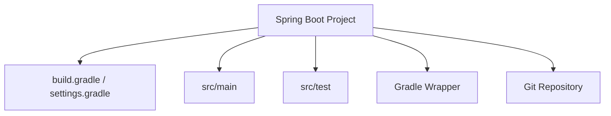

# Spring Boot 프로젝트 생성 가이드

## 1. 문서 목적

본 문서는 앞 단계에서 준비한 JDK, Gradle, VS Code, Docker / Oracle 로컬 개발환경을 기반으로
MicroServer의 **최초 Spring Boot 프로젝트를 생성**하는 방법을 설명한다.

현재 단계에서는 애플리케이션의 기본 골격만 생성한다.

아직 다음 작업은 진행하지 않는다.

- 프로젝트별 VS Code Workspace JDK 상세 설정
- Gradle Wrapper 버전 표준화
- Gradle Multi-Project 구성
- Controller / Service / DAO 구현
- Filter / AOP 구현
- Spring Security 구성
- Oracle JDBC Driver 추가
- Datasource 구성
- Transaction 구성
- Cache 구성
- 업무 Table / Schema 구성

이 문서의 목표는 다음과 같다.

```text
Spring Initializr
        ↓
Spring Boot 기본 프로젝트 생성
        ↓
프로젝트 파일 구조 확인
        ↓
Git 변경사항 확인
        ↓
다음 프로젝트 개발환경 설정 단계로 이동
```

---

## 2. 현재 단계의 위치

MicroServer 프로젝트 구축 흐름은 다음과 같다.


현재 문서는 다음 위치에 해당한다.

```text
JDK / Gradle / VS Code / Oracle 환경 준비
        ↓
[ Spring Boot 프로젝트 생성 ]          ← 현재
        ↓
프로젝트 JDK / VS Code Workspace 설정
        ↓
Gradle Wrapper 및 프로젝트 Gradle 설정
        ↓
초기 실행 및 Build 검증
        ↓
Gradle Multi-Project 구성
```

!!! info "프로젝트 생성 단계의 원칙"

    이번 단계에서는 **Spring Boot 기본 프로젝트를 만들기만 한다.**

    프로젝트 생성 직후 여러 설정과 기능을 한꺼번에 추가하지 않는다.

    이후 각 단계에서 설정을 하나씩 적용하고 검증함으로써,
    문제가 발생했을 때 어느 단계에서 문제가 생겼는지 추적할 수 있도록 한다.

---

## 3. Spring Boot 버전 기준

본 가이드 작성 기준일은 **2026-08-24**이다.

MicroServer 초기 프로젝트는 다음 버전을 기준으로 한다.

```text
Spring Boot : 4.1.0
Java        : 26
Build Tool  : Gradle - Groovy
Packaging   : JAR
```

Spring Boot 4.1.0은 공식 문서 기준으로 다음 환경을 지원한다.

```text
Minimum Java : 17
Maximum Java : 26
Gradle       : 8.14 이상 8.x 또는 9.x
```

MicroServer는 앞 단계에서 준비한 Eclipse Temurin JDK 26을 사용한다.

!!! info "Spring Boot 버전 운영"

    Spring Initializr의 기본 Version은 시간이 지나면 변경될 수 있다.

    따라서 단순히 `Default` 또는 `Latest`를 선택하지 않고
    **프로젝트 생성 시점의 프로젝트 표준 Version을 명시적으로 확인하여 선택**한다.

    프로젝트 표준 Version을 변경할 경우 JDK, Gradle, Build, CI/CD 및 관련 문서를 함께 검토한다.

---

## 4. Spring Boot 4의 Web Starter

Spring Boot 4에서는 기능별 Starter가 보다 세분화되었다.

Spring MVC 기반 Web Application의 주요 Starter는 다음과 같다.

```text
spring-boot-starter-webmvc
```

Test 지원 Starter:

```text
spring-boot-starter-webmvc-test
```

Spring Initializr 화면에서는 일반적으로 다음 Dependency를 선택한다.

```text
Spring Web
```

Initializr가 선택한 Spring Boot Version에 맞는 Starter 구성을 생성하도록 한다.

현재 단계에서는 Web Application의 기본 기동을 검증할 수 있도록 **Spring Web만 추가**한다.

---

## 5. 최초 프로젝트 Dependency 원칙

Spring Initializr에서 Dependency를 많이 선택하지 않는다.

현재 선택:

```text
Spring Web
```

현재 선택하지 않음:

```text
Spring Security
Validation
JDBC API
Oracle Driver
Spring Data JPA
MyBatis
Actuator
Lombok
DevTools
Flyway
Liquibase
Cache
Batch
Kafka
```

이유는 다음과 같다.

```text
최소 Spring Boot Project
        ↓
기본 Build / Run 검증
        ↓
Gradle Multi-Project 구성
        ↓
필요 기능을 단계별 추가
```

처음부터 많은 Dependency를 추가하면
문제가 발생했을 때 원인을 특정하기 어려워진다.

---

## 6. Project Coordinate 기준

본 가이드에서는 다음 값을 프로젝트 생성 예시로 사용한다.

```text
Group       : io.github.teammicroserver
Artifact    : microserver
Name        : microserver
Package     : io.github.teammicroserver
Version     : 0.0.1-SNAPSHOT
```

Project Coordinate (Maven 표기와 동일한 개념):

```text
io.github.teammicroserver:microserver:0.0.1-SNAPSHOT
```

!!! note "Group ID"

    `groupId`는 일반적으로 조직이 관리하는 Domain / Namespace를 기준으로 정한다.

    현재 값은 Team-Microserver 프로젝트를 위한 프로젝트 Namespace 예시이다.

    실제 회사 또는 조직의 공식 Java Package Naming Rule이 별도로 있다면
    프로젝트 생성 전에 해당 기준으로 변경한다.

---

## 7. Spring Initializr를 사용하는 이유

Spring Boot 프로젝트를 수동으로 처음부터 만들 수도 있지만
MicroServer에서는 Spring Initializr를 사용한다.

Spring Initializr는 다음 기본 파일을 생성한다.

```text
build.gradle
settings.gradle
gradlew
gradlew.bat
gradle/wrapper/
src/main/java/
src/main/resources/
src/test/java/
.gitignore
```

또한 선택한 Spring Boot Version과 Java Version,
Dependency에 맞는 기본 Gradle Project를 생성한다.

---

## 8. VS Code에서 Spring Initializr 실행

앞 단계에서 Spring Boot Extension Pack과
Spring Initializr Java Support Extension이 설치되어 있어야 한다.

Command Palette:

### Windows

```text
Ctrl + Shift + P
```

### macOS

```text
Command + Shift + P
```

검색:

```text
Spring Initializr
```

Spring Initializr의 Gradle Project 생성 명령을 선택한다.

VS Code Extension Version에 따라 표시되는 명령 문구가 조금 달라질 수 있으므로
`Spring Initializr`로 검색하여 Gradle Project 생성 Wizard를 시작한다.

---

## 9. Spring Initializr 선택 값

Wizard에서는 다음 기준으로 선택한다.

| 항목 | 선택 값 |
|---|---|
| Build Tool | Gradle - Groovy |
| Language | Java |
| Spring Boot | 4.1.0 |
| Group | `io.github.teammicroserver` |
| Artifact | `microserver` |
| Name | `microserver` |
| Description | MicroServer Framework |
| Package Name | `io.github.teammicroserver` |
| Packaging | JAR |
| Java | 26 |

Dependency:

```text
Spring Web
```

### Maven과 비교

같은 프로젝트를 Maven으로 생성했다면 Build Tool 선택과 생성 파일은 다음처럼 달라진다.

| 구분 | Gradle - Groovy | Maven |
|---|---|---|
| Build Script | `build.gradle` | `pom.xml` |
| Project 구조 | `settings.gradle` | Parent / Module `pom.xml` |
| Wrapper | `gradlew`, `gradlew.bat` | `mvnw`, `mvnw.cmd` |
| Wrapper 설정 | `gradle/wrapper/` | `.mvn/wrapper/` |

이번 프로젝트에서는 **Gradle을 실제 Build 기준으로 사용하고 Maven은 대응 개념을 이해하기 위한 비교 대상으로 사용한다.**

---

## 10. 이미 Git Repository를 Clone한 경우

MicroServer Source Repository를 이미 Clone해 두었다면
**`.git` 디렉터리를 삭제하거나 덮어쓰지 않는 것**이 중요하다.

예:

```text
workspace/
└─ microserver/
   ├─ .git/
   ├─ README.md
   └─ ...
```

Spring Initializr Extension의 생성 방식이나 Version에 따라
선택한 Directory 아래에 Artifact 이름의 하위 Directory가 추가될 수 있다.

따라서 기존 Git Repository가 있는 경우 다음 방법을 권장한다.

```text
1. Spring Initializr Project를 임시 Directory에 생성
2. 생성 결과 확인
3. 생성된 Project 파일을 기존 microserver Repository Root로 이동
4. 기존 .git Directory는 유지
```

!!! warning "`.git` Directory"

    기존 Repository의 `.git` Directory는 Project Source가 아니라
    Git Repository 자체의 Metadata이다.

    Spring Boot Project를 넣는 과정에서 `.git`을 삭제하거나
    다른 Repository의 `.git`으로 교체하지 않는다.

---

## 11. 생성 위치 예시

예:

```text
C:\dev\workspace\
```

또는:

```text
~/dev/workspace/
```

임시 생성 결과:

```text
workspace/
├─ microserver-generated/
└─ microserver/                 ← 기존 Git Repository
```

최종적으로 Spring Boot Project의 `build.gradle`과 `settings.gradle`이
Git Repository Root에 위치하도록 한다.

```text
microserver/
├─ .git/
├─ gradle/
├─ src/
├─ .gitignore
├─ gradlew
├─ gradlew.bat
├─ settings.gradle
└─ build.gradle
```

다음처럼 한 단계 더 중첩되지 않도록 주의한다.

```text
X microserver/
    └─ microserver/
        ├─ build.gradle
        └─ src/
```

원하는 구조:

```text
O microserver/
    ├─ build.gradle
    └─ src/
```

---

## 12. Windows에서 생성 파일 이동 예시

생성 Project가 임시 Directory에 있다면
필요한 파일을 기존 Repository Root로 이동한다.

GUI Explorer를 이용해도 된다.

PowerShell을 사용하는 경우 실제 경로를 확인한 후 진행한다.

예:

```powershell
Get-ChildItem -Force
```

숨김 Directory인 `.mvn`도 반드시 함께 이동한다.

!!! warning

    이동 명령은 실제 Directory 상태에 따라 달라지므로
    `.git` Directory를 포함한 전체 Directory를 통째로 덮어쓰는 명령을 사용하지 않는다.

---

## 13. macOS에서 생성 파일 확인

Terminal:

```bash
ls -la
```

생성 결과에서 다음 Hidden File / Directory도 확인한다.

```text
.mvn
.gitignore
```

Finder에서 Hidden File을 확인해야 하는 경우:

```text
Command + Shift + .
```

를 사용할 수 있다.

---

## 14. 생성 후 기본 구조

정상적으로 생성되면 다음과 유사한 구조가 된다.

```text
microserver/
├─ .git/
├─ gradle/
│  └─ wrapper/
│     ├─ gradle-wrapper.jar
│     └─ gradle-wrapper.properties
├─ src/
│  ├─ main/
│  │  ├─ java/
│  │  │  └─ io/github/teammicroserver/
│  │  │     └─ *Application.java
│  │  └─ resources/
│  │     └─ application.properties
│  └─ test/
│     └─ java/
│        └─ io/github/teammicroserver/
│           └─ *ApplicationTests.java
├─ .gitignore
├─ gradlew
├─ gradlew.bat
├─ settings.gradle
└─ build.gradle
```

Spring Initializr Version에 따라 생성 파일의 세부 구성이 달라질 수 있다.

---

## 15. Main Application Class

생성된 Java Source에는 Spring Boot Main Class가 존재한다.

형태:

```java
@SpringBootApplication
public class ...Application {

    public static void main(String[] args) {
        SpringApplication.run(...Application.class, args);
    }
}
```

`@SpringBootApplication`은 Spring Boot Application의 기본 Entry Point를 구성한다.

현재는 이 Class를 수정하지 않는다.

---

## 16. Test Class

Spring Initializr는 기본 Test Class도 생성한다.

형태:

```java
@SpringBootTest
class ...ApplicationTests {

    @Test
    void contextLoads() {
    }
}
```

현재 Test는 Application Context가 기본적으로 구성되는지를 확인하기 위한 최소 Test이다.

삭제하지 않는다.

이 Test는 이후 **초기 실행 및 Build 검증 가이드**에서 사용한다.

---

## 17. `application.properties`

Spring Initializr가 다음 파일을 생성할 수 있다.

```text
src/main/resources/application.properties
```

현재는 이 파일을 비워둔 상태로 유지해도 된다.

아직 다음 설정을 하지 않는다.

```text
server.port
Datasource
Oracle URL
Logging
Spring Profile
Security
Cache
```

`application.yml`로 변경하는 작업도
설정 파일 운영 기준을 정하는 단계에서 진행한다.

---

## 18. `build.gradle` / `settings.gradle` 기본 확인

현재는 `build.gradle`과 `settings.gradle`을 적극적으로 수정하지 않고
Spring Initializr가 생성한 내용을 확인만 한다.

확인 항목:

```text
Spring Boot Gradle Plugin Version
Group
Project Name
Version
Java Toolchain
Dependencies
Spring Boot Gradle Plugin
```

기대 기준:

```text
Spring Boot 4.1.0
Java 26
Spring Web
```

Spring Boot 4의 실제 Starter Artifact 이름은
Initializr가 선택한 Version에 맞게 생성한 값을 우선한다.

---

## 19. Gradle Wrapper 파일 확인

Spring Initializr Gradle Project에는 Gradle Wrapper가 함께 생성된다.

확인:

```text
gradle/wrapper/
gradlew
gradlew.bat
```

현재 단계에서는 Wrapper Version을 변경하지 않는다.

다음 문서에서 실제 Project Gradle 표준을 확인한다.

→ [Gradle Wrapper 및 프로젝트 Gradle 설정](project_environment/project_gradle_setup.md)

---

## 20. `.gitignore` 확인

Spring Initializr가 생성한 `.gitignore`를 확인한다.

대표적으로 Build 결과 Directory인 다음 항목이 Git에서 제외되어야 한다.

```text
.gradle/
build/
```

기존 Repository에 `.gitignore`가 이미 존재했다면
단순히 한 파일로 덮어쓰지 말고 기존 항목과 Initializr 생성 항목을 병합한다.

---

## 21. 현재는 Build하지 않는다

Spring Boot Project가 생성되면 바로 실행하고 싶을 수 있지만
현재 문서에서는 아직 Build를 실행하지 않는다.

```text
Project 생성
        ↓
JDK / VS Code Workspace 설정
        ↓
Gradle Wrapper 설정
        ↓
Build / Run 검증
```

이 순서를 유지한다.

따라서 현재는:

```text
gradle build
./gradlew build
./gradlew bootRun
```

등을 아직 실행하지 않는다.

---

## 22. VS Code로 Project Root 열기

VS Code:

```text
File
→ Open Folder...
```

다음 Directory를 연다.

```text
microserver/
```

즉 `build.gradle`과 `settings.gradle`이 바로 보이는 Directory를 Workspace Root로 연다.

정상:

```text
Explorer
microserver
 ├─ gradle
 ├─ src
 ├─ settings.gradle
 ├─ build.gradle
 ├─ gradlew
 └─ gradlew.bat
```

---

## 23. Java Project 인식 확인

VS Code Java / Gradle Extension은 `build.gradle`이 있는 Folder를 열면
Java Project를 자동으로 Import할 수 있다.

Explorer에서 Java Projects View가 나타나는지 확인한다.

필요한 경우 Command Palette:

```text
Java: Import Java Projects in Workspace
```

현재는 Import 상태만 확인한다.

---

## 24. Spring Boot Dashboard 확인

Spring Boot Dashboard를 열어
생성한 Application이 인식되는지 확인할 수 있다.

현재는 Dashboard에 Application이 표시되는지만 확인하고
실행은 이후 검증 단계에서 진행한다.

---

## 25. 현재 단계에서 수정하지 않는 항목

다음 파일을 미리 만들거나 수정하지 않는다.

```text
.vscode/settings.json
.vscode/extensions.json
application-local.yml
Docker Compose
Oracle JDBC Dependency
업무 Package
Controller
Service
DAO
Filter
AOP
Security
```

각각 이후 단계에서 목적을 설명한 후 추가한다.

---

## 26. Git 변경사항 확인

Repository Root:

```bash
git status
```

예상:

```text
new file: gradle/wrapper/...
new file: gradlew
new file: gradlew.bat
new file: settings.gradle
new file: build.gradle
new file: src/...
```

기존 README나 `.gitignore`가 있다면 변경사항도 함께 검토한다.

---

## 27. Git Commit

Project 생성 상태를 하나의 기준점으로 남긴다.

```bash
git add .
git status
```

Commit 예:

```bash
git commit -m "chore: create initial Spring Boot project"
```

Remote Repository에 Push:

```bash
git push
```

!!! tip "단계별 Commit"

    MicroServer 프로젝트는 한 번에 모든 구조를 만드는 대신
    각 단계별로 정상 상태를 Commit하여 변경 기준점을 남긴다.

    이후 Workspace, Gradle, Multi-Project 설정에서 문제가 생겼을 때
    어느 단계의 변경인지 쉽게 비교할 수 있다.

---

## 28. 완료 상태



현재 완료 상태:

```text
Spring Boot Project     → 생성 완료
build.gradle / settings.gradle → 생성 완료
Main Class              → 생성 완료
기본 Test               → 생성 완료
Gradle Wrapper           → 생성 여부 확인
Git Repository          → 변경사항 Commit

Workspace JDK           → 다음 단계
Gradle 표준화            → 이후 단계
Build / Run             → 이후 단계
Multi Module            → 이후 단계
```

---

## 29. 체크리스트

- [ ] Spring Boot 4.1.0을 선택했다.
- [ ] Java 26을 선택했다.
- [ ] Gradle - Groovy Project를 생성했다.
- [ ] Packaging을 JAR로 선택했다.
- [ ] Spring Web Dependency만 우선 추가했다.
- [ ] Project Root에 `build.gradle`과 `settings.gradle`이 있다.
- [ ] `gradle/wrapper`, `gradlew`, `gradlew.bat`을 확인했다.
- [ ] Main Application Class를 확인했다.
- [ ] 기본 Test Class를 확인했다.
- [ ] VS Code에서 Project Root를 열었다.
- [ ] Java Project가 인식된다.
- [ ] 아직 Build / Application 실행을 하지 않았다.
- [ ] 아직 Oracle / Datasource를 연결하지 않았다.
- [ ] Git Commit / Push를 완료했다.

---

## 30. 다음 단계

다음 단계에서는 생성된 실제 Project를 기준으로
JDK와 VS Code Workspace 환경을 구성한다.

→ [프로젝트 JDK / VS Code Workspace 설정](project_environment/project_jdk_vscode_setup.md)

```text
Spring Boot Project 생성        ← 현재 완료
        ↓
프로젝트 JDK / VS Code Workspace 설정
        ↓
Gradle Wrapper / Gradle 설정
        ↓
초기 실행 및 Build 검증
```

---

## 31. 공식 참고 자료

- Spring Initializr  
  <https://start.spring.io/>

- Spring Boot  
  <https://spring.io/projects/spring-boot>

- Spring Boot System Requirements  
  <https://docs.spring.io/spring-boot/system-requirements.html>

- Spring Boot 4 Modularization  
  <https://spring.io/blog/2025/10/28/modularizing-spring-boot>

- Spring Boot in Visual Studio Code  
  <https://code.visualstudio.com/docs/java/java-spring-boot>
