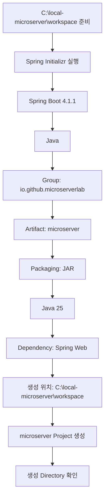

# Spring Boot 프로젝트 생성 가이드

## 1. 문서 목적

본 문서는 앞 단계에서 준비한 JDK, Gradle, VS Code, Docker / Oracle 로컬 개발환경을 기반으로
MicroServer의 **최초 Spring Boot 프로젝트를 VS Code의 Spring Initializr로 생성하는 실제 절차**를 설명한다.

이 문서는 VS Code에서 프로젝트를 생성할 때 나타나는 Wizard 흐름과
가이드의 설명 순서를 최대한 동일하게 맞추는 것을 기준으로 한다.

현재 단계에서는 다음까지 진행한다.

```text
workspace Directory 준비
        ↓
VS Code Spring Initializr 실행
        ↓
Spring Boot Version 선택
        ↓
Language 선택
        ↓
Group ID 입력
        ↓
Artifact ID 입력
        ↓
Packaging 선택
        ↓
Java Version 선택
        ↓
Dependency 선택
        ↓
프로젝트 생성 위치 선택
        ↓
Spring Boot Project 생성
        ↓
생성 Directory 확인
```

현재 문서에서는 **Git Repository 초기화와 Commit은 진행하지 않는다.**

다음 문서에서 이어서 진행한다.

→ [Git Repository 초기화 및 최초 Commit](spring_boot_git_init.md)

---

## 2. 현재 단계의 위치

MicroServer 프로젝트 구축 흐름은 다음과 같다.


현재 문서:

```text
JDK / Gradle / VS Code / Oracle 환경 준비
        ↓
[ Spring Boot 프로젝트 생성 ]             ← 현재
        ↓
Git Repository 초기화 / 최초 Commit
        ↓
생성 프로젝트 구조 확인 및 초기 정리
        ↓
프로젝트 JDK / VS Code Workspace 설정
        ↓
Gradle Wrapper / 프로젝트 Gradle 설정
        ↓
초기 Build / Run 검증
```

---

## 3. 프로젝트 생성 Directory 기준

MicroServer 로컬 개발환경 Root:

```text
C:\local-microserver
```

프로젝트 Source는 다음 `workspace` Directory 아래에 둔다.

```text
C:\local-microserver
└─ workspace
```

Spring Boot 프로젝트가 생성되면 다음 구조가 된다.

```text
C:\local-microserver
└─ workspace
   └─ microserver
      ├─ build.gradle
      ├─ settings.gradle
      ├─ gradlew
      ├─ gradlew.bat
      ├─ gradle
      └─ src
```

### 3.1 `workspace` Directory 생성

아직 `workspace` Directory가 없다면 PowerShell에서 생성한다.

```powershell
New-Item -ItemType Directory -Force C:\local-microserver\workspace
```

확인:

```powershell
Get-ChildItem C:\local-microserver
```

다음 Directory가 보이면 된다.

```text
workspace
```

!!! important "`microserver` Directory는 미리 만들지 않음"
    VS Code Spring Initializr에서 `Artifact ID`를 `microserver`로 입력하고
    생성 위치로 `C:\local-microserver\workspace`를 선택한다.

    Initializr가 다음 프로젝트 Directory를 생성하도록 한다.

    ```text
    C:\local-microserver\workspace\microserver
    ```

    다음처럼 Directory가 중첩되지 않도록 한다.

    ```text
    X C:\local-microserver\workspace\microserver\microserver
    ```

---

## 4. 프로젝트 생성 기준

현재 MicroServer 프로젝트 생성 기준:

```text
Spring Boot : 4.1.1
Java        : 25
Build Tool  : Gradle - Groovy
Packaging   : JAR
```

프로젝트 식별정보:

```text
Team / Organization : team-microserver
Java Group          : io.github.microserverlab
Project             : microserver
```

Spring Initializr 입력 기준:

| 항목 | 입력 / 선택 값 |
|---|---|
| Build Tool | Gradle |
| Spring Boot | `4.1.1` |
| Language | Java |
| Group ID | `io.github.microserverlab` |
| Artifact ID | `microserver` |
| Packaging | JAR |
| Java | `25` |
| Dependency | Spring Web |

생성 후 기준값:

```text
Project Name      : microserver
Gradle Root Name  : microserver
Base Package      : io.github.microserverlab.microserver
```

!!! note "VS Code Initializr에서 직접 묻지 않는 값"
    VS Code의 Spring Initializr Wizard는 주로 다음 값을 순서대로 입력 / 선택하도록 구성한다.

    ```text
    Spring Boot Version
    Language
    Group ID
    Artifact ID
    Packaging
    Java Version
    Dependencies
    생성 위치
    ```

    웹 기반 `start.spring.io` 화면에서 볼 수 있는 `Name`, `Description`, `Package Name` 등의 항목은
    VS Code Wizard에서 별도 입력 단계로 나타나지 않을 수 있다.

    따라서 본 가이드에서는 **실제 VS Code Wizard의 진행 순서**를 기준으로 설명한다.

---

## 5. Spring Initializr 실행

MicroServer Portable VS Code를 실행한다.

Windows에서는 다음 Shortcut을 사용하는 것을 기준으로 한다.

```text
MicroServer VS Code.lnk
```

Command Palette를 연다.

```text
Ctrl + Shift + P
```

검색:

```text
Spring Initializr
```

다음과 같은 Gradle 프로젝트 생성 명령을 선택한다.

```text
Spring Initializr: Create a Gradle Project...
```

Extension Version에 따라 다음처럼 표시될 수도 있다.

```text
Spring Initializr: Generate a Gradle Project...
```

!!! note "Command 이름은 Version에 따라 다를 수 있음"
    중요한 기준은 다음 두 가지이다.

    ```text
    Spring Initializr
    Gradle Project
    ```

---

## 6. Step 1 - Spring Boot Version 선택

Spring Initializr가 Spring Boot Version을 묻는다.

현재 선택:

```text
4.1.1
```

흐름:

```text
Specify Spring Boot version
        ↓
4.1.1
```

!!! important "프로젝트 표준 Version 확인"
    Spring Initializr의 기본 Version은 시간이 지나면 달라질 수 있다.

    화면의 첫 번째 항목을 무조건 선택하지 않고
    현재 MicroServer 프로젝트 표준 Version을 확인한다.

---

## 7. Step 2 - Project Language 선택

다음으로 Project Language를 선택한다.

```text
Java
```

흐름:

```text
Specify project language
        ↓
Java
```

현재 프로젝트에서는 Kotlin이나 Groovy를 사용하지 않는다.

---

## 8. Step 3 - Group ID 입력

Group ID를 입력한다.

```text
io.github.microserverlab
```

흐름:

```text
Input Group Id
        ↓
io.github.microserverlab
```

### 8.1 Group ID 의미

`Group`은 Gradle / Maven Artifact와 Java Namespace의 기준이 되는 식별값이다.

```text
io.github.microserverlab
```

Team 이름과 Java Group은 서로 다른 값이다.

```text
Team / Organization : team-microserver
Java Group          : io.github.microserverlab
```

실제 회사 프로젝트에서는 공식 Domain이나 Java Package Naming Rule이 있다면
해당 기준을 우선한다.

---

## 9. Step 4 - Artifact ID 입력

Artifact ID를 입력한다.

```text
microserver
```

흐름:

```text
Input Artifact Id
        ↓
microserver
```

현재 프로젝트 이름과 동일하게 사용한다.

```text
Project  : microserver
Artifact : microserver
```

이 값은 생성되는 Project Directory 이름에도 사용된다.

최종 Directory:

```text
C:\local-microserver\workspace\microserver
```

!!! important "Team 이름을 Artifact에 사용하지 않음"
    다음처럼 입력하지 않는다.

    ```text
    X team-microserver
    X microserverlab
    ```

    프로젝트 이름은 다음이다.

    ```text
    O microserver
    ```

---

## 10. Step 5 - Packaging 선택

Packaging Type:

```text
JAR
```

흐름:

```text
Specify packaging type
        ↓
JAR
```

현재 MicroServer는 Spring Boot Embedded Server 기반 Application 실행을 기준으로 하므로
기본 Packaging은 JAR을 사용한다.

---

## 11. Step 6 - Java Version 선택

Java Version:

```text
25
```

흐름:

```text
Specify Java version
        ↓
25
```

현재 로컬 표준 JDK:

```text
C:\local-microserver\tools\jdk\temurin-25
```

따라서 Initializr에서도 Java 25를 선택한다.

---

## 12. Step 7 - Dependency 선택

현재 최초 생성 단계에서 선택할 Dependency:

```text
Spring Web
```

Dependency 검색창에 다음을 입력한다.

```text
Spring Web
```

검색 결과에서 `Spring Web`을 선택한다.

선택 완료 후 `Selected 1 dependency` 또는 이와 유사한 완료 항목을 눌러 다음 단계로 이동한다.

### 12.1 왜 Spring Web만 선택하는가

현재 단계에서는 최소 Spring Boot Web Project를 만든다.

현재 선택하지 않음:

```text
Spring Security
Validation
JDBC API
Oracle Driver
Spring Data JPA
MyBatis
Actuator
Lombok
DevTools
Flyway
Liquibase
Cache
Batch
Kafka
```

구성 원칙:

```text
최소 프로젝트 생성
        ↓
프로젝트 구조 확인
        ↓
JDK / Gradle 설정
        ↓
Build / Run 검증
        ↓
필요 Dependency 단계별 추가
```

Spring Boot 4에서 `Spring Web` 선택 결과의 실제 Gradle Dependency는
생성된 `build.gradle`을 기준으로 확인한다.

---

## 13. Step 8 - 프로젝트 생성 위치 선택

Dependency 선택이 끝나면 Windows Folder 선택 창이 열린다.

이 화면은 **JDK나 Gradle 설치 경로를 선택하는 화면이 아니다.**

Spring Boot 프로젝트를 어느 Directory 아래에 생성할지 선택하는 화면이다.

현재 선택할 Directory:

```text
C:\local-microserver\workspace
```

Windows Folder 선택 창에서 다음 경로로 이동한다.

```text
C:
└─ local-microserver
   └─ workspace
```

`workspace` Directory를 선택한 상태에서:

```text
Generate into this folder
```

버튼을 누른다.

### 13.1 왜 `workspace`를 선택하는가

Artifact ID:

```text
microserver
```

따라서 다음 구조로 생성되는 것을 목표로 한다.

```text
C:\local-microserver\workspace
└─ microserver
   ├─ build.gradle
   ├─ settings.gradle
   ├─ gradlew
   ├─ gradlew.bat
   ├─ gradle
   └─ src
```

!!! warning "Directory 중첩 주의"
    정상:

    ```text
    O C:\local-microserver\workspace\microserver\build.gradle
    ```

    잘못된 구조:

    ```text
    X C:\local-microserver\workspace\microserver\microserver\build.gradle
    ```

---

## 14. Step 9 - 프로젝트 생성 완료

Spring Initializr가 프로젝트 생성을 완료하면
VS Code 오른쪽 아래에 생성 완료 메시지가 나타날 수 있다.

Extension 설정에 따라 다음과 같은 선택지가 표시될 수 있다.

```text
Open
Add to Workspace
```

현재는 생성된 프로젝트를 확인할 수 있도록 `Open`을 선택하거나
직접 다음 Directory를 연다.

```text
C:\local-microserver\workspace\microserver
```

VS Code:

```text
File
→ Open Folder...
→ C:\local-microserver\workspace\microserver
```

---

## 15. 생성 Directory 확인

PowerShell:

```powershell
Get-ChildItem C:\local-microserver\workspace\microserver -Force
```

최소 다음 파일 / Directory가 존재하는지 확인한다.

```text
microserver
├─ gradle
│  └─ wrapper
├─ src
├─ .gitignore
├─ build.gradle
├─ settings.gradle
├─ gradlew
└─ gradlew.bat
```

Spring Initializr Version에 따라 다음 파일도 있을 수 있다.

```text
.gitattributes
HELP.md
```

!!! important "아직 Git 초기화와 Build는 하지 않음"
    이 문서의 완료 기준은 **Spring Boot 프로젝트 생성까지**이다.

    다음 작업은 다음 문서에서 수행한다.

    ```text
    git init
    git add
    git commit
    ```

    또한 아직 다음 명령도 실행하지 않는다.

    ```text
    gradlew.bat build
    gradlew.bat bootRun
    ```

---

## 16. 현재 단계 완료 상태



완료 기준:

- [ ] `C:\local-microserver\workspace`가 존재한다.
- [ ] Spring Boot `4.1.1`을 선택했다.
- [ ] Language는 Java이다.
- [ ] Group ID는 `io.github.microserverlab`이다.
- [ ] Artifact ID는 `microserver`이다.
- [ ] Packaging은 JAR이다.
- [ ] Java Version은 `25`이다.
- [ ] Dependency는 우선 `Spring Web`만 선택했다.
- [ ] 생성 위치는 `C:\local-microserver\workspace`이다.
- [ ] `C:\local-microserver\workspace\microserver`가 생성되었다.
- [ ] `build.gradle`, `settings.gradle`, `src`, Gradle Wrapper가 존재한다.
- [ ] 아직 `git init`을 하지 않았다.
- [ ] 아직 Build / Run을 하지 않았다.

---

## 17. 다음 단계

Spring Boot 프로젝트 생성이 완료되면
해당 Project Root를 Git Repository로 초기화하고 최초 Commit을 만든다.

```text
Spring Boot 프로젝트 생성            ← 현재 완료
        ↓
Git Repository 초기화 / 최초 Commit
        ↓
생성 프로젝트 구조 확인 및 초기 정리
        ↓
프로젝트 JDK / VS Code Workspace 설정
```

다음 문서:

**[Git Repository 초기화 및 최초 Commit](spring_boot_git_init.md)**
