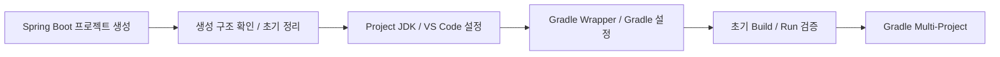
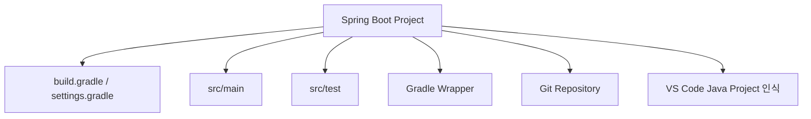

# 생성 프로젝트 구조 확인 및 초기 정리 가이드

## 1. 문서 목적

본 문서는 Spring Initializr로 생성하여 기존 Git Repository Root에 반영한
MicroServer Spring Boot 프로젝트의 **초기 파일 구조와 생성 결과를 확인하고,
다음 프로젝트 개발환경 설정 단계로 넘어가기 위한 기준 상태를 정리**한다.

선행 문서:

→ [Spring Boot 프로젝트 생성](spring_boot_project_create.md)

현재 단계에서는 다음을 확인한다.

- Repository Root 구조
- Spring Boot Main Application Class
- 기본 Test Class
- `application.properties`
- `build.gradle`
- `settings.gradle`
- Gradle Wrapper
- `.gitignore`
- VS Code Java Project 인식
- Spring Boot Dashboard 인식
- Git 변경사항
- 초기 생성 상태 Commit

현재 단계에서는 **Build / Run을 아직 수행하지 않는다.**

---

## 2. 현재 단계의 위치



현재:

```text
Spring Boot Project 생성
        ↓
[ 생성 프로젝트 구조 확인 및 초기 정리 ]   ← 현재
        ↓
Project JDK / VS Code Workspace 설정
        ↓
Gradle Wrapper / Gradle 설정
        ↓
Build / Run
```

---

## 3. Repository Root 확인

MicroServer Source Repository 위치:

```text
C:\local-microserver\workspace\microserver
```

PowerShell:

```powershell
Set-Location C:\local-microserver\workspace\microserver
```

Git Repository Root 확인:

```powershell
git rev-parse --show-toplevel
```

기대 결과:

```text
C:/local-microserver/workspace/microserver
```

!!! important "Repository Root를 먼저 확인"
    이후 모든 Project 파일은 이 Repository Root를 기준으로 확인한다.

    다음처럼 한 단계 더 중첩되어 있으면 정리해야 한다.

    ```text
    X workspace\microserver\microserver\build.gradle
    ```

    정상:

    ```text
    O workspace\microserver\build.gradle
    ```

---

## 4. 생성 후 기본 구조 확인

정상적으로 반영되면 다음과 유사한 구조가 된다.

```text
C:\local-microserver\workspace\microserver
│
├─ .git
├─ .gitignore
├─ .gitattributes                 ← Initializr Version에 따라 존재 가능
├─ gradle
│  └─ wrapper
│     ├─ gradle-wrapper.jar
│     └─ gradle-wrapper.properties
│
├─ src
│  ├─ main
│  │  ├─ java
│  │  │  └─ io
│  │  │     └─ github
│  │  │        └─ microserverlab
│  │  │           └─ microserver
│  │  │              └─ *Application.java
│  │  └─ resources
│  │     └─ application.properties
│  │
│  └─ test
│     └─ java
│        └─ io
│           └─ github
│              └─ microserverlab
│                 └─ microserver
│                    └─ *ApplicationTests.java
│
├─ build.gradle
├─ settings.gradle
├─ gradlew
├─ gradlew.bat
├─ README.md                      ← 기존 Repository에 있던 경우
└─ HELP.md                        ← Initializr Version에 따라 존재 가능
```

!!! note "생성 파일은 Initializr Version에 따라 조금 달라질 수 있음"
    `.gitattributes`, `HELP.md` 등의 존재 여부는 Initializr Version에 따라 달라질 수 있다.

    핵심 확인 대상은 다음이다.

    ```text
    build.gradle
    settings.gradle
    gradlew
    gradlew.bat
    gradle/wrapper/
    src/main/
    src/test/
    ```

---

## 5. Gradle Project와 Maven Project 구분

현재 MicroServer는 **Gradle - Groovy** 프로젝트이다.

따라서 다음 파일이 존재한다.

```text
build.gradle
settings.gradle
gradle/wrapper/
gradlew
gradlew.bat
```

다음 파일은 Maven Project에 해당한다.

```text
pom.xml
.mvn/
mvnw
mvnw.cmd
```

!!! warning "`.mvn`은 현재 프로젝트 확인 대상이 아님"
    이전 가이드에서는 Gradle Project 생성 후 `.mvn` Directory를 함께 이동하거나 확인하도록 기술된 부분이 있었다.

    이는 Maven Wrapper 구조와 혼동된 내용이다.

    현재 MicroServer Gradle Project에서는 `.mvn`을 만들거나 복사하지 않는다.

---

## 6. Main Application Class 확인

다음 경로 아래에 Spring Boot Main Class가 생성된다.

```text
src/main/java/io/github/microserverlab/microserver/
```

Class 이름은 Artifact / Name에 따라 다음과 유사할 수 있다.

```text
MicroserverApplication.java
```

기본 형태:

```java
@SpringBootApplication
public class MicroserverApplication {

    public static void main(String[] args) {
        SpringApplication.run(MicroserverApplication.class, args);
    }
}
```

### 6.1 `@SpringBootApplication`

`@SpringBootApplication`은 Spring Boot Application의 대표적인 시작 Annotation이다.

현재 단계에서는 다음 작업을 하지 않는다.

```text
ComponentScan 범위 변경
추가 Configuration 등록
Bean 직접 등록
ApplicationRunner 추가
Environment 처리
```

생성된 Main Class를 기본 상태로 유지한다.

### 6.2 Base Package 위치

Main Application Class의 Base Package는 다음을 사용한다.

```text
io.github.microserverlab.microserver
```

구성:

```text
io.github
└─ microserverlab        ← Group / Namespace
   └─ microserver        ← Project
```

Team / Organization 이름과 Java Group은 서로 구분한다.

```text
Team / Organization : team-microserver
Java Group          : io.github.microserverlab
Project             : microserver
```

향후 주요 Application Package는 이 Base Package 아래에 구성할 수 있다.

```text
io.github.microserverlab.microserver
├─ web
├─ service
├─ persistence
├─ common
└─ configuration
```

!!! note "회사 프로젝트에서는 공식 Naming Rule을 우선"
    `io.github.microserverlab`은 MicroServer 프로젝트에서 정한 Group이다.

    실제 회사 프로젝트에서 공식 Domain 또는 Java Package Naming Rule이 있다면
    해당 프로젝트의 표준을 우선한다.
실제 Package 구조는 Framework 기본 구조 단계에서 확정한다.

---

## 7. 기본 Test Class 확인

Spring Initializr는 기본 Test Class를 생성한다.

경로 예:

```text
src/test/java/io/github/microserverlab/microserver/MicroserverApplicationTests.java
```

형태:

```java
@SpringBootTest
class MicroserverApplicationTests {

    @Test
    void contextLoads() {
    }
}
```

이 Test는 Spring Application Context가 기본적으로 구성되는지 검증할 때 사용할 수 있다.

현재 단계에서는 삭제하지 않는다.

다음 **초기 Build / Run 검증** 단계에서 실제 Test 실행 여부를 확인한다.

---

## 8. `application.properties` 확인

기본 설정 파일:

```text
src/main/resources/application.properties
```

Spring Initializr가 빈 파일 또는 최소 내용으로 생성할 수 있다.

현재는 다음 설정을 추가하지 않는다.

```text
server.port
Datasource
Oracle URL
DB Username / Password
Logging 상세 설정
Spring Profile
Security
Cache
Transaction
```

`application.yml`로 전환하는 작업도
프로젝트 설정 파일 운영 기준을 정하는 단계에서 진행한다.

!!! important "DB가 준비되어 있어도 아직 연결하지 않음"
    앞 단계에서 Oracle Container와 `MICROSERVER` Schema가 준비되어 있어도
    현재 Spring Boot Project 생성 결과 확인 단계에서는 JDBC / Datasource를 아직 연결하지 않는다.

---

## 9. `settings.gradle` 확인

`settings.gradle`은 Gradle Build의 Project 이름과 이후 Multi-Project 구조의 기준이 되는 파일이다.

현재 단계에서는 내용을 적극적으로 수정하지 않고 생성값을 확인한다.

대표 확인 항목:

```text
rootProject.name
```

기대 개념:

```groovy
rootProject.name = 'microserver'
```

!!! important "프로젝트 이름은 `microserver`"
    Team / Organization 이름은 `team-microserver`이고,
    Gradle Root Project 이름은 실제 프로젝트 이름인 `microserver`를 사용한다.

정확한 생성 문법은 Initializr 결과를 기준으로 한다.

!!! note "Multi-Project는 아직 구성하지 않음"
    이후 Gradle Multi-Project 단계에서는 `settings.gradle`에 Subproject를 등록하게 된다.

    현재는 단일 Spring Boot Project 상태를 유지한다.

---

## 10. `build.gradle` 기본 확인

현재 단계에서는 `build.gradle`을 수정하기보다
Spring Initializr가 생성한 기준값이 올바른지 확인한다.

확인 항목:

```text
Spring Boot Plugin Version
Group
Version
Java Toolchain
Repositories
Spring Web Dependency
Test Dependency
```

### 10.1 Spring Boot Plugin

현재 프로젝트 기준:

```text
4.1.1
```

예:

```groovy
plugins {
    id 'java'
    id 'org.springframework.boot' version '4.1.1'
}
```

Initializr가 추가하는 다른 Plugin은 실제 생성 결과를 기준으로 확인한다.

### 10.2 Group / Version

기준:

```text
Group   : io.github.microserverlab
Version : 0.0.1-SNAPSHOT
```

MicroServer 프로젝트의 Java Group은 `io.github.microserverlab`으로 정한다.

```text
Team / Organization : team-microserver
Java Group          : io.github.microserverlab
Project             : microserver
```

Team 이름과 Java Group은 동일한 문자열을 사용할 필요가 없으며,
각각 조직 식별과 Java Namespace라는 서로 다른 역할을 가진다.

실제 회사 프로젝트에서는 공식 Domain이나 Java Package Naming Rule이 있다면
해당 기준을 우선한다.


### 10.3 Java Toolchain

현재 MicroServer 프로젝트 표준:

```text
Java 25
```

생성 결과에서 Java Toolchain 또는 Java Version이 25로 설정되어 있는지 확인한다.

개념 예:

```groovy
java {
    toolchain {
        languageVersion = JavaLanguageVersion.of(25)
    }
}
```

!!! important "Language Server JDK와 Project Target JDK는 구분"
    Portable VS Code User Settings에서 등록한 JDK와
    `build.gradle`의 Java Toolchain은 역할이 다르다.

    현재 생성 결과에서 Java 25 기준이 들어갔는지만 확인하고,
    실제 Project JDK / VS Code / Gradle JDK 연계는 다음 전용 문서에서 구성한다.

### 10.4 Spring Web Dependency

Spring Boot 4의 현재 Initializr `Spring Web` 선택은
Spring MVC 기반 Starter를 생성한다.

확인할 Artifact:

```text
org.springframework.boot:spring-boot-starter-webmvc
```

예:

```groovy
dependencies {
    implementation 'org.springframework.boot:spring-boot-starter-webmvc'
}
```

!!! note "과거 `spring-boot-starter-web` 예제를 그대로 복사하지 않음"
    Spring Boot 4에서는 Starter 구조가 세분화되었다.

    현재 Project는 Initializr가 생성한 `spring-boot-starter-webmvc`를 기준으로 한다.

### 10.5 Test Dependency

Spring Boot 4에서는 Test Starter도 기능별로 세분화될 수 있다.

따라서 과거 Spring Boot 3 예제의 Test Dependency를 임의로 덮어쓰지 않고
**현재 Initializr가 생성한 Test Dependency를 우선 보존**한다.

현재 단계에서는 Test Dependency Version이나 구성을 임의로 변경하지 않는다.

---

## 11. Gradle Wrapper 확인

Spring Initializr로 Gradle Project를 만들면 Wrapper 파일이 함께 생성된다.

확인:

```text
gradle/
└─ wrapper/
   ├─ gradle-wrapper.jar
   └─ gradle-wrapper.properties

gradlew
gradlew.bat
```

PowerShell:

```powershell
Get-ChildItem .\gradle\wrapper
```

현재 단계에서는 Wrapper Version을 변경하지 않는다.

다음 문서:

```text
프로젝트 JDK / VS Code 설정
        ↓
Gradle Wrapper 및 프로젝트 Gradle 설정
```

에서 MicroServer 표준 Gradle 기준과 비교한다.

!!! important "Gradle Wrapper는 Git 관리 대상"
    다음 파일은 Git에 포함한다.

    ```text
    gradlew
    gradlew.bat
    gradle/wrapper/gradle-wrapper.jar
    gradle/wrapper/gradle-wrapper.properties
    ```

---

## 12. `.gitignore` 확인

Repository Root:

```text
C:\local-microserver\workspace\microserver\.gitignore
```

Gradle Build 결과에 대한 대표 제외 기준:

```gitignore
.gradle/
build/
```

기존 Repository에 `.gitignore`가 이미 있었다면
Initializr 생성 내용과 병합되었는지 확인한다.

!!! warning "Gradle Wrapper를 제외하지 않음"
    다음 파일을 `.gitignore`로 제외하면 안 된다.

    ```text
    gradlew
    gradlew.bat
    gradle/wrapper/
    ```

Repository 밖에 있는 다음 개발환경 파일은 `.gitignore`와 관계없다.

```text
C:\local-microserver\env\local-env.ps1
```

이 파일은 Git Repository 밖에 있으므로
공유용 개발환경 Package에서 제외하는 정책으로 관리한다.

---

## 13. 현재 Project Root를 VS Code에서 열기

MicroServer Portable VS Code는 다음 Shortcut으로 실행하는 것을 권장한다.

```text
MicroServer VS Code.lnk
```

VS Code에서:

```text
File
→ Open Folder...
```

다음 Directory를 연다.

```text
C:\local-microserver\workspace\microserver
```

또는 향후 `.code-workspace`를 사용할 경우 프로젝트가 해당 Workspace에 포함되도록 구성한다.

현재 Project Root를 열었을 때 Explorer에서 최소 다음이 바로 보여야 한다.

```text
microserver
├─ gradle
├─ src
├─ settings.gradle
├─ build.gradle
├─ gradlew
└─ gradlew.bat
```

---

## 14. Java Project 인식 확인

VS Code Java / Gradle Extension은
`build.gradle`이 있는 Folder를 열면 Java Project를 Import할 수 있다.

확인 항목:

```text
Java Projects View
Gradle View
Java: Ready 상태
```

필요한 경우 Command Palette에서:

```text
Java: Import Java Projects in Workspace
```

를 사용할 수 있다.

!!! note "Import와 Build 검증은 다른 작업"
    VS Code가 Project를 Java Project로 인식하는 것은
    실제 `gradlew build`가 성공했다는 의미가 아니다.

    현재는 Project Import / 인식 상태까지만 확인한다.

---

## 15. Spring Boot Dashboard 확인

Spring Boot Extension Pack이 설치되어 있다면
Spring Boot Dashboard에서 생성된 Application을 인식할 수 있다.

확인 목적:

```text
Spring Boot Dashboard
        ↓
MicroserverApplication 표시 여부
```

현재는 Dashboard에서 Application이 보이는지만 확인한다.

**Run 버튼으로 실행하지 않는다.**

Application 실행은 초기 Build / Run 검증 단계에서 진행한다.

---

## 16. 현재 단계에서 수정하지 않는 항목

다음 파일이나 구성을 미리 추가하지 않는다.

```text
.vscode/settings.json
.vscode/extensions.json
application-local.yml
Docker Compose
Oracle JDBC Dependency
Datasource
DB 접속정보
업무 Package
Controller
Service
DAO
Filter
AOP
Security
Cache
Multi-Project
```

각 항목은 목적과 적용 범위를 설명하는 별도 단계에서 추가한다.

---

## 17. 현재는 Build / Run하지 않음

아직 다음 명령을 실행하지 않는다.

Windows:

```powershell
.\gradlew.bat build
```

```powershell
.\gradlew.bat bootRun
```

macOS / Linux:

```bash
./gradlew build
```

```bash
./gradlew bootRun
```

현재 순서:

```text
생성 구조 확인
        ↓
JDK / VS Code Project 설정
        ↓
Gradle Wrapper / Gradle 설정
        ↓
Build / Test
        ↓
Application Run
```

이 순서를 유지한다.

---

## 18. Git 변경사항 확인

Repository Root에서:

```powershell
git status
```

신규 생성 상태에서는 다음과 같은 파일들이 변경사항으로 나타날 수 있다.

```text
gradle/wrapper/...
gradlew
gradlew.bat
settings.gradle
build.gradle
src/...
.gitattributes
.gitignore
```

기존 Repository에 있던 다음 파일도 변경될 수 있으므로 내용을 확인한다.

```text
README.md
.gitignore
```

!!! tip "Git Status에서 `.git`은 나오지 않음"
    `.git` Directory 자체는 Git의 내부 Metadata이므로
    일반적인 Working Tree 변경 파일로 Commit하는 대상이 아니다.

---

## 19. 생성 상태 Commit 기준

프로젝트 생성 결과가 정상적으로 정리되었다면
이 상태를 하나의 Git 기준점으로 남긴다.

```powershell
git add .
```

다시 확인:

```powershell
git status
```

Commit 예:

```powershell
git commit -m "chore: create initial Spring Boot project"
```

Remote Repository에 Push:

```powershell
git push
```

!!! tip "단계별 Commit"
    MicroServer 프로젝트는 여러 설정을 한 번에 적용하기보다
    각 단계에서 정상 상태를 Commit하여 변경 기준점을 남기는 방식을 사용한다.

    다음 단계에서 JDK / VS Code / Gradle 설정을 적용했을 때 문제가 발생하면
    Spring Boot 기본 생성 상태와 쉽게 비교할 수 있다.

---

## 20. 생성 Project 완료 상태



현재 완료 기준:

```text
Spring Boot Project                → 생성 완료
Repository Root                    → 정상
build.gradle / settings.gradle     → 확인 완료
Spring Boot                        → 4.1.1
Java Toolchain                     → 25
Spring Web                         → webmvc 기준 확인
Main Class                         → 확인 완료
기본 Test                          → 확인 완료
Gradle Wrapper                     → 존재 확인
.gitignore                         → 병합 / 확인
VS Code Java Project               → 인식 확인
Spring Boot Dashboard              → 인식 확인
Git Commit                         → 생성 기준점 기록

Project JDK 상세 연계              → 다음 단계
Gradle Wrapper 표준화              → 이후 단계
Build / Run                        → 이후 단계
Multi-Project                      → 이후 단계
Oracle Datasource                  → 이후 단계
```

---

## 21. 체크리스트

### 21.1 Project Root

- [ ] Repository Root가 `C:\local-microserver\workspace\microserver`이다.
- [ ] `build.gradle`이 Repository Root에 있다.
- [ ] `settings.gradle`이 Repository Root에 있다.
- [ ] Project Directory가 `microserver\microserver`로 중첩되지 않았다.
- [ ] 기존 `.git` Directory를 유지했다.

### 21.2 Spring Boot / Java

- [ ] Spring Boot Plugin Version이 `4.1.1`이다.
- [ ] Gradle `rootProject.name`은 `microserver`이다.
- [ ] Team 이름 `team-microserver`, Java Group `io.github.microserverlab`, 프로젝트 이름 `microserver`를 구분했다.
- [ ] `Group`은 `io.github.microserverlab`이다.
- [ ] Java 기준이 `25`이다.
- [ ] `Spring Web` 선택 결과로 `spring-boot-starter-webmvc`가 구성되었는지 확인했다.
- [ ] Main Application Class가 존재한다.
- [ ] 기본 Test Class가 존재한다.
- [ ] `application.properties`를 아직 불필요하게 수정하지 않았다.

### 21.3 Gradle

- [ ] `gradlew`가 존재한다.
- [ ] `gradlew.bat`이 존재한다.
- [ ] `gradle/wrapper/`가 존재한다.
- [ ] Maven용 `.mvn`을 만들거나 복사하지 않았다.
- [ ] 아직 Wrapper Version을 임의로 변경하지 않았다.

### 21.4 VS Code / Git

- [ ] VS Code가 Project를 Java Project로 인식한다.
- [ ] Spring Boot Dashboard에서 Application을 확인할 수 있다.
- [ ] 아직 Application을 실행하지 않았다.
- [ ] `git status`로 생성 변경사항을 확인했다.
- [ ] 생성 상태를 Commit / Push했다.

---

## 22. 다음 단계

다음 단계에서는 실제 생성된 Project를 기준으로
JDK와 VS Code Workspace 환경을 연결한다.

```text
Spring Boot 프로젝트 생성
        ↓
생성 프로젝트 구조 확인            ← 현재 완료
        ↓
프로젝트 JDK / VS Code Workspace 설정
        ↓
Gradle Wrapper / 프로젝트 Gradle 설정
        ↓
초기 Build / Run 검증
```

다음 문서:

**[프로젝트 JDK / VS Code Workspace 설정](project_environment/project_jdk_vscode_setup.md)**

---

## 23. 공식 참고 자료

- [Spring Boot](https://spring.io/projects/spring-boot/)
- [Spring Boot System Requirements](https://docs.spring.io/spring-boot/system-requirements.html)
- [Spring Boot Build Systems](https://docs.spring.io/spring-boot/reference/using/build-systems.html)
- [Spring Boot in Visual Studio Code](https://code.visualstudio.com/docs/java/java-spring-boot)
