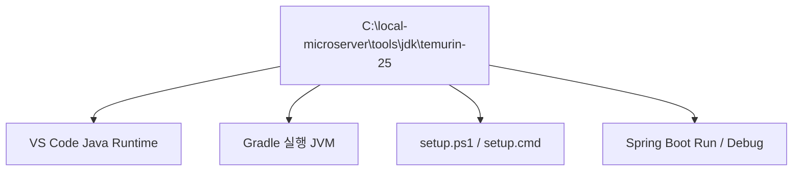

# Windows JDK 설치 및 검증

## 1. 문서 목적

본 문서는 Windows 개발 PC에 **Eclipse Temurin JDK 25 LTS**을 준비하고,
MicroServer 프로젝트에서 정한 로컬 개발환경 경로에 배치한 뒤 정상 동작을 검증하는 방법을 설명한다.

Windows 개발환경의 기준 Root는 다음과 같다.

```text
C:\local-microserver
```

JDK 설치 위치는 다음을 사용한다.

```text
C:\local-microserver\tools\jdk\temurin-25
```

!!! tip "전체 JDK 운영 원칙"
    JDK Vendor, Version, 시스템 전역 `JAVA_HOME`을 사용하지 않는 이유 등은 다음 문서에서 설명한다.

    **[JDK 개발환경 구성 및 운영 기준](jdk_setup.md)**

---

## 2. Windows 개발 장비 Architecture 확인

Temurin을 다운로드하기 전에 개발 PC의 CPU Architecture를 확인한다.

PowerShell:

```powershell
$env:PROCESSOR_ARCHITECTURE
```

일반적인 x64 Windows PC에서는 다음과 같이 표시된다.

```text
AMD64
```

이 경우 Temurin 다운로드 기준은 다음과 같다.

```text
Operating System : Windows
Architecture     : x64
Package Type     : JDK
JVM              : HotSpot
```

현재 MicroServer Windows 표준 개발환경은 **Windows x64**를 기준으로 한다.

!!! warning "Windows ARM64 환경"
    Eclipse Adoptium의 2026년 8월 Temurin 배포 기준으로
    **JDK 25의 Windows AArch64(ARM64) Binary는 현재 제공되지 않는다.**

    따라서 Windows ARM64 장비에서 동일한 Temurin 25 개발환경이 필요한 경우
    Adoptium의 최신 지원 현황을 다시 확인한 후 대안을 검토해야 한다.

    **[Eclipse Temurin 최신 Release 정보](https://adoptium.net/news/)**

!!! tip "PowerShell의 `$env:`"
    PowerShell에서 `$env:`는 Windows 환경변수를 읽거나 설정할 때 사용하는 문법이다.

    다음 명령은 현재 `PROCESSOR_ARCHITECTURE` 환경변수 값을 확인한다.

    ```powershell
    $env:PROCESSOR_ARCHITECTURE
    ```

    현재 단계에서는 이 값을 변경하는 것이 아니라 CPU Architecture를 확인하기 위해 읽기만 한다.

---

## 3. Eclipse Temurin JDK 다운로드

Eclipse Adoptium 공식 사이트에서 Temurin JDK를 다운로드한다.

- Eclipse Adoptium: <https://adoptium.net/>
- Temurin Releases: <https://adoptium.net/temurin/releases/>

다운로드 기준:

```text
Version      : 25 (LTS)
Operating OS : Windows
Architecture : x64
Package Type : JDK
JVM          : HotSpot
Archive      : ZIP
```

!!! info "Java 25 LTS"
    MicroServer 프로젝트는 장기적인 개발환경 안정성을 위해
    Feature Release인 Java 26 대신 **Java 25 LTS**를 표준으로 사용한다.

    Temurin 25의 세부 Patch Version은 보안 Update에 따라 변경될 수 있으므로
    다운로드 시점의 최신 Java 25 LTS Release를 사용한다.

MicroServer 프로젝트에서는 MSI Installer보다 **ZIP 압축 배포본**을 사용한다.

!!! warning "JRE가 아니라 JDK 선택"
    다운로드 시 반드시 다음 항목을 확인한다.

    ```text
    Package Type : JDK
    ```

    `javac.exe` 등의 개발 도구가 필요하므로 JRE Package를 선택하지 않는다.

---

## 4. JDK 디렉터리 준비

JDK는 다음 위치에 보관한다.

```text
C:\local-microserver\tools\jdk
```

PowerShell에서 디렉터리를 생성한다.

```powershell
New-Item -ItemType Directory -Force C:\local-microserver\tools\jdk
```

여러 JDK Version을 함께 보관하면 다음과 같은 구조가 된다.

```text
C:\local-microserver
└─ tools
   └─ jdk
      ├─ temurin-17
      ├─ temurin-21
      └─ temurin-25
```

!!! note "Git Repository와 분리"
    실제 프로젝트 Source는 다음과 같이 별도의 `repos` 영역에서 관리한다.

    ```text
    C:\local-microserver
    ├─ tools
    │  └─ jdk
    │      └─ temurin-25
    │
    └─ repos
       └─ microserver
          └─ .git
    ```

    JDK Binary 자체는 Git Repository에 포함하지 않는다.

---

## 5. JDK ZIP 압축 해제

다운로드한 Temurin ZIP 파일을 다음 경로 아래에 압축 해제한다.

```text
C:\local-microserver\tools\jdk
```

Release에 따라 압축 해제 후 디렉터리 이름이 다음처럼 생성될 수 있다.

```text
jdk-25.0.4+7
```

관리 편의를 위해 최종 Directory를 다음과 같이 정리한다.

```text
C:\local-microserver\tools\jdk\temurin-25
```

정상적인 구조 예:

```text
C:\local-microserver\tools\jdk\temurin-25
├─ bin\
├─ conf\
├─ include\
├─ legal\
├─ lib\
└─ release
```

!!! note "JDK 25의 `jmods` Directory"
    Temurin JDK 25부터는 배포 구성에 따라 `jmods` Directory가 기본 Archive에 포함되지 않을 수 있다.

    따라서 `jmods` Directory가 없다는 이유만으로 JDK 설치가 잘못된 것으로 판단하지 않는다.

    현재 가이드에서 필수적으로 확인하는 항목은 다음과 같다.

    ```text
    bin\java.exe
    bin\javac.exe
    release
    ```

!!! warning "중첩 Directory 확인"
    압축을 해제할 때 다음처럼 Directory가 한 단계 더 중첩되지 않았는지 확인한다.

    ```text
    X  C:\local-microserver\tools\jdk\temurin-25\jdk-25.0.4+7\bin
    ```

    최종적으로 `temurin-25` 바로 아래에 `bin`, `lib`, `release` 등이 위치하도록 정리한다.

---

## 6. JDK Home 확인

JDK Home은 JDK의 최상위 Directory를 의미한다.

```text
C:\local-microserver\tools\jdk\temurin-25
```

다음 경로와 혼동하지 않는다.

```text
O  C:\local-microserver\tools\jdk\temurin-25
X  C:\local-microserver\tools\jdk\temurin-25\bin
X  C:\local-microserver\tools\jdk\temurin-25\bin\java.exe
```

이 JDK Home 경로는 이후 Gradle과 VS Code 환경을 구성할 때 다시 사용한다.

---

## 7. JDK 정상 동작 확인

현재 단계에서는 시스템 `JAVA_HOME`과 시스템 PATH를 영구 설정하지 않는다.

따라서 새 PowerShell에서 다음 명령이 바로 실행되지 않아도 설치 오류는 아니다.

```powershell
java -version
```

JDK 자체가 정상적으로 준비되었는지는 실행파일을 절대경로로 호출하여 확인한다.

### 7.1 Java Runtime 확인

```powershell
& "C:\local-microserver\tools\jdk\temurin-25\bin\java.exe" -version
```

정상적인 경우 Java 25 계열 정보가 표시된다.

```text
openjdk version "25..."
OpenJDK Runtime Environment Temurin-25...
OpenJDK 64-Bit Server VM Temurin-25...
```

### 7.2 Java Compiler 확인

```powershell
& "C:\local-microserver\tools\jdk\temurin-25\bin\javac.exe" -version
```

정상적인 경우:

```text
javac 25...
```

---

## 8. 필수 파일 확인

다음 파일이 존재하는지 확인한다.

```text
C:\local-microserver\tools\jdk\temurin-25
│
├─ bin\java.exe
├─ bin\javac.exe
└─ release
```

특히 `javac.exe`가 없다면 JDK가 아닌 JRE 또는 다른 Runtime Package를 내려받지 않았는지 확인한다.

---

## 9. JAVA_HOME과 PATH는 아직 영구 설정하지 않음

MicroServer 프로젝트에서는 Windows 시스템 환경변수에 프로젝트 JDK를 영구 등록하는 방식을 기본으로 사용하지 않는다.

현재 단계에서는 다음 작업을 수행하지 않는다.

```text
시스템 JAVA_HOME 영구 등록
시스템 PATH에 JDK\bin 영구 추가
```

향후 실제 개발 시에는 용도에 따라 다음과 같이 연결한다.



!!! tip "왜 지금 JAVA_HOME을 설정하지 않는가?"
    한 개발 PC에서 서로 다른 JDK가 필요한 프로젝트를 동시에 운영할 수 있기 때문이다.

    MicroServer JDK를 Windows 시스템 전체 기본 Java로 고정하기보다
    이후 프로젝트 / 도구 단위로 필요한 JDK를 연결한다.

---

## 10. 설치 완료 확인

JDK Home:

```text
C:\local-microserver\tools\jdk\temurin-25
```

최종 확인:

```powershell
& "C:\local-microserver\tools\jdk\temurin-25\bin\java.exe" -version
& "C:\local-microserver\tools\jdk\temurin-25\bin\javac.exe" -version
```

두 명령이 모두 Java 25 계열로 정상 실행되면 Windows JDK 준비가 완료된 것이다.

---

## 11. 체크리스트

- [ ] Windows 개발 장비 Architecture를 확인했다.
- [ ] Eclipse Temurin JDK 25 LTS을 선택했다.
- [ ] JRE가 아닌 JDK Package를 선택했다.
- [ ] Windows용 ZIP 배포본을 사용했다.
- [ ] JDK를 `C:\local-microserver\tools\jdk\temurin-25`에 배치했다.
- [ ] `bin\java.exe`가 존재한다.
- [ ] `bin\javac.exe`가 존재한다.
- [ ] `java.exe -version`이 정상 실행된다.
- [ ] `javac.exe -version`이 정상 실행된다.
- [ ] 시스템 전역 `JAVA_HOME`을 프로젝트용으로 영구 설정하지 않았다.
- [ ] 시스템 전역 PATH에 프로젝트 JDK `bin`을 추가하지 않았다.

---

## 12. 다음 단계

JDK 준비가 완료되면 Gradle 기본 환경 구성으로 진행한다.

현재 단계에서는 아직 다음 설정을 하지 않는다.

- VS Code Java Runtime
- `.vscode/settings.json`
- `java.configuration.runtimes`
- Spring Boot 프로젝트 JDK
- Gradle Wrapper
- 애플리케이션 Run / Debug

이 설정들은 이후 각 전용 가이드에서 단계별로 진행한다.
