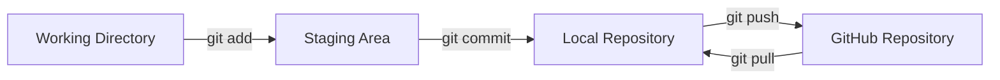
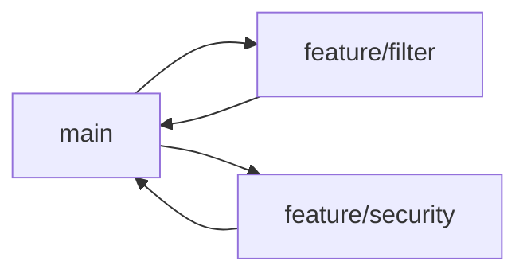

# Windows Git / GitHub 환경 구성

## 1. 문서 목적

본 문서는 MicroServer 프로젝트의 소스코드와 기술문서를 Git으로 관리하고 GitHub 원격 저장소와 연동하기 위한 기본 개발환경을 구성한다.

프로젝트에서는 Git을 단순 백업 도구가 아니라 다음 목적의 **표준 형상관리 도구**로 사용한다.

- 소스코드 변경 이력 관리
- 기능 단위 Commit
- 원격 저장소 Push / Pull
- 브랜치 기반 병렬 개발
- 문서 변경 이력 관리
- GitHub 기반 협업 및 리뷰

---

## 2. Git 기반 개발 흐름



기본 작업 흐름은 다음과 같다.

```bash
git status
git add .
git commit -m "docs: add environment setup guide"
git push
```

---

## 3. MicroServer Directory와 Git Repository 관리 범위

MicroServer Windows 개발환경은 `C:\local-microserver` 아래에
개발도구, 실행 Script, Workspace를 함께 배치하지만
**`C:\local-microserver` 전체를 하나의 Git Repository로 관리하지 않는다.**

Git은 실제 Source 또는 기술문서처럼 형상관리가 필요한
**각 프로젝트 Directory만 개별 Repository로 관리**한다.

### 3.1 전체 Directory와 Git 경계

권장 구조:

```text
C:\local-microserver                    ← Git Repository 아님
│
├─ tools                                ← Git 관리 대상 아님
│  ├─ jdk
│  ├─ gradle
│  └─ vscode
│
├─ gradle-home                          ← Git 관리 대상 아님
│
├─ env                                  ← Git 관리 대상 아님
│  ├─ setup.cmd
│  ├─ setup.ps1
│  ├─ start-vscode.cmd
│  ├─ local-env.example.cmd
│  └─ local-env.cmd
│
└─ workspace                            ← Repository들을 보관하는 상위 Directory
   │
   ├─ microserver                       ← Git Repository A
   │  ├─ .git
   │  ├─ .gitignore
   │  ├─ .gitattributes
   │  ├─ settings.gradle
   │  ├─ build.gradle
   │  ├─ gradlew
   │  ├─ gradlew.bat
   │  ├─ gradle
   │  └─ ...
   │
   └─ microserver-docs                  ← Git Repository B
      ├─ .git
      ├─ .gitignore
      ├─ mkdocs.yml
      ├─ docs
      └─ ...
```

핵심은 **`.git` Directory가 어디에 있느냐**이다.

다음 위치에는 `.git`을 만들지 않는다.

```text
C:\local-microserver\.git
C:\local-microserver\workspace\.git
```

대신 실제 Repository마다 `.git`이 존재한다.

```text
C:\local-microserver\workspace\microserver\.git
C:\local-microserver\workspace\microserver-docs\.git
```

!!! important "`workspace` 전체를 GitHub에 올리는 것이 아님"
    `workspace`는 여러 프로젝트 Repository를 모아두는 **상위 작업 Directory**이다.

    GitHub에는 `workspace` 자체가 올라가는 것이 아니라
    그 아래의 각 Repository가 독립적으로 Push된다.

    ```text
    workspace
    ├─ microserver       → GitHub Repository A
    └─ microserver-docs  → GitHub Repository B
    ```

### 3.2 Git이 볼 수 있는 범위

Git은 현재 Repository Root와 그 하위 파일만 관리한다.

예를 들어 다음 Repository에서 작업한다고 가정한다.

```text
C:\local-microserver\workspace\microserver
```

이 Repository에서 `git status`를 실행하면 Git이 확인하는 범위는 다음과 같다.

```text
C:\local-microserver\workspace\microserver
└─ 하위 Directory / File
```

다음 Directory들은 해당 Repository 바깥이므로 Git 관리 대상이 아니다.

```text
C:\local-microserver\tools
C:\local-microserver\env
C:\local-microserver\gradle-home
C:\local-microserver\workspace\microserver-docs
```

Repository Root 확인:

```bash
git rev-parse --show-toplevel
```

Windows PowerShell 예:

```powershell
cd C:\local-microserver\workspace\microserver
git rev-parse --show-toplevel
```

정상 예:

```text
C:/local-microserver/workspace/microserver
```

### 3.3 `C:\local-microserver`에 `.gitignore`가 필요한가?

**현재 표준 구조에서는 필요하지 않다.**

이유는 `C:\local-microserver` 자체가 Git Repository가 아니기 때문이다.

```text
C:\local-microserver
├─ .git 없음
└─ Git Repository 아님
```

따라서 다음 파일을 만들어도:

```text
C:\local-microserver\.gitignore
```

현재 프로젝트 Repository의 Git 동작에는 영향을 주지 않는다.

`.gitignore`는 **Git Work Tree 안에 있을 때 의미가 있다.**

| 위치 | Git Repository 여부 | `.gitignore` 필요 |
|---|---:|---:|
| `C:\local-microserver` | 아니오 | 필요 없음 |
| `C:\local-microserver\workspace` | 아니오 | 필요 없음 |
| `C:\local-microserver\workspace\microserver` | 예 | 필요 |
| `C:\local-microserver\workspace\microserver-docs` | 예 | 필요 |

!!! note "`local-env.cmd`도 Root `.gitignore`로 막을 필요가 없음"
    다음 파일은:

    ```text
    C:\local-microserver\env\local-env.cmd
    ```

    `microserver` Repository 밖에 있으므로
    `microserver\.gitignore`가 없어도 해당 Repository에 Commit될 수 없다.

### 3.4 Git 제외와 개발환경 Package 제외는 다른 문제

특히 다음 두 개념을 구분한다.

```text
Git에 올라가지 않음
        ≠
ZIP 배포 Package에 자동으로 포함되지 않음
```

`local-env.cmd`는 Git Repository 밖에 있으므로 Git에는 올라가지 않는다.

하지만 `C:\local-microserver` 전체를 직접 ZIP으로 압축하면
일반 파일인 `local-env.cmd`도 ZIP에 포함될 수 있다.

따라서 Secret 보호는 다음과 같이 나눈다.

```text
Git Repository 내부 파일
→ .gitignore

C:\local-microserver 개발환경 Package
→ 압축 / 배포할 때 Secret 파일 직접 제외
```

예:

```text
배포 포함
C:\local-microserver\env\local-env.example.cmd

배포 제외
C:\local-microserver\env\local-env.cmd
```

### 3.5 Repository 생성 위치 주의

`git init`은 반드시 실제 프로젝트 Root에서 실행한다.

올바른 예:

```powershell
cd C:\local-microserver\workspace\microserver
git init
```

잘못된 예:

```powershell
cd C:\local-microserver
git init
```

또는:

```powershell
cd C:\local-microserver\workspace
git init
```

상위 Directory에서 실수로 `git init`을 실행하면
JDK, Gradle, Portable VS Code, 다른 Repository까지
하나의 Git Work Tree 안에 들어갈 수 있다.

!!! warning "`git init` 실행 전 현재 Directory 확인"
    Windows에서는 먼저 다음 명령으로 현재 위치를 확인한다.

    ```powershell
    Get-Location
    ```

---

## 4. Git 설치

### 4.1 Windows

Git for Windows를 설치한다.

설치 완료 후 PowerShell을 새로 열고 확인한다.

```powershell
git --version
```

정상 예시:

```text
git version 2.x.x.windows.x
```

## 5. Git 사용자 정보 설정

Commit에는 작성자 정보가 기록되므로 최초 1회 사용자 정보를 설정한다.

```bash
git config --global user.name "Your Name"
git config --global user.email "your-email@example.com"
```

확인:

```bash
git config --global --list
```

특정 프로젝트만 다른 계정을 사용할 경우 저장소 디렉터리에서 `--global`을 제외하고 설정한다.

```bash
git config user.name "Project User"
git config user.email "project@example.com"
```

---

## 6. 기본 브랜치 설정

새 Git 저장소 생성 시 기본 브랜치를 `main`으로 사용하도록 설정할 수 있다.

```bash
git config --global init.defaultBranch main
```

---

## 7. 줄바꿈 정책


프로젝트에서는 가능하면 `.gitattributes`를 저장소에 두어 저장소 기준을 통일한다.

예:

```gitattributes
* text=auto

*.java text eol=lf
*.xml text eol=lf
*.yml text eol=lf
*.yaml text eol=lf
*.md text eol=lf
*.sh text eol=lf
*.bat text eol=crlf
*.cmd text eol=crlf
```

개별 PC의 기본 설정은 다음과 같이 사용할 수 있다.

### Windows

```powershell
git config --global core.autocrlf true
```

## 8. GitHub 인증 방식

GitHub 원격 저장소 연결은 크게 HTTPS와 SSH 방식이 있다.

| 방식 | 특징 |
|---|---|
| HTTPS | 설정이 단순하고 Credential Manager와 함께 사용 가능 |
| SSH | 키 기반 인증으로 개발환경에서 편리하게 사용 가능 |

프로젝트 개발환경에서는 SSH 방식을 권장한다.

---

## 9. SSH Key 생성

### 9.1 기존 키 확인

```bash
ls ~/.ssh
```

Windows PowerShell에서도 사용자 홈의 `.ssh` 디렉터리를 확인할 수 있다.

```powershell
Get-ChildItem $HOME\.ssh
```

### 9.2 SSH Key 생성

```bash
ssh-keygen -t ed25519 -C "your-email@example.com"
```

기본 저장 위치를 사용할 경우 Enter를 입력한다.

```text
~/.ssh/id_ed25519
~/.ssh/id_ed25519.pub
```

공개키 확인:

#### Windows

```powershell
Get-Content $HOME\.ssh\id_ed25519.pub
```

## 10. GitHub SSH 연결 확인

```bash
ssh -T git@github.com
```

최초 연결에서는 GitHub 서버 fingerprint 확인 메시지가 나타날 수 있다.

정상적으로 인증되면 GitHub 계정이 확인되었다는 메시지가 출력된다.

---

## 11. 프로젝트 Clone

프로젝트 저장소의 SSH URL을 사용한다.

예:

```bash
cd ~/workspace
git clone git@github.com:Team-Microserver/<repository>.git
```

Windows 예:

```powershell
cd C:\local-microserver\workspace
git clone git@github.com:Team-Microserver/<repository>.git
```

Clone 후:

```bash
cd <repository>
git status
```

---

## 12. 기존 로컬 프로젝트를 GitHub와 연결

이미 로컬에 소스가 있는 경우 실제 **프로젝트 Root Directory**로 이동한 뒤 진행한다.

!!! warning "MicroServer Root 또는 workspace Root에서 `git init`하지 않음"
    Git Repository는 실제 Source Project 단위로 만든다.

```bash
git init
git add .
git commit -m "chore: initialize project"
git branch -M main
git remote add origin git@github.com:Team-Microserver/<repository>.git
git push -u origin main
```

원격 저장소 확인:

```bash
git remote -v
```

---

## 13. 기본 개발 작업 흐름

기능 작업 전 항상 현재 상태를 확인한다.

```bash
git status
git pull
```

작업 후 변경 파일 확인:

```bash
git status
git diff
```

Staging:

```bash
git add .
```

Commit:

```bash
git commit -m "feat: add request pre-processing filter"
```

Push:

```bash
git push
```

---

## 14. Commit 메시지 권장 규칙

프로젝트 변경 이력을 읽기 쉽게 하기 위해 다음 Prefix를 권장한다.

| Prefix | 용도 |
|---|---|
| `feat` | 기능 추가 |
| `fix` | 오류 수정 |
| `docs` | 문서 변경 |
| `refactor` | 리팩터링 |
| `test` | 테스트 추가/수정 |
| `build` | Gradle/Maven, Dependency 등 빌드 변경 |
| `chore` | 기타 설정 및 유지보수 |

예:

```text
feat: add common response wrapper
fix: handle authentication exception
docs: add Oracle Docker setup guide
build: configure Gradle multi-project build
```

Commit은 가능한 한 **하나의 의미 있는 변경 단위**로 나눈다.

---

## 15. 브랜치 운영 기본안

초기 학습/구축 단계에서는 지나치게 복잡한 Git Flow보다 단순한 브랜치 모델을 사용한다.



예:

```bash
git switch -c feature/common-filter
```

작업 완료 후:

```bash
git add .
git commit -m "feat: add common request filter"
git push -u origin feature/common-filter
```

---

## 16. 프로젝트 Repository의 `.gitignore`

`.gitignore`는 **각 Git Repository 내부에서**
형상관리할 필요가 없는 생성 파일, Cache, 개인 설정, Local Secret을 제외하기 위해 사용한다.

현재 MicroServer 구조에서는 Application Repository에 다음과 같이 둔다.

```text
C:\local-microserver\workspace\microserver\.gitignore
```

기술문서가 별도 Repository라면 해당 Repository에도 별도의 `.gitignore`를 둔다.

```text
C:\local-microserver\workspace\microserver-docs\.gitignore
```

!!! important "MicroServer Root에는 `.gitignore`가 필요하지 않음"
    다음 위치는 Git Repository가 아니므로 `.gitignore`를 둘 필요가 없다.

    ```text
    C:\local-microserver
    C:\local-microserver\workspace
    ```

    `.gitignore`는 실제 Repository별로 관리한다.

### 16.1 Application Repository용 복사 / 붙여넣기 Sample

```gitignore
# ============================================================
# MicroServer Application .gitignore
# ============================================================

# Gradle
.gradle/
build/

# Java build output
*.class
*.war

# IDE
.idea/
*.iml

# VS Code 개인 설정을 Repository에서 관리하지 않는 경우
.vscode/

# Local application environment / secrets
.env
.env.*
!.env.example
*.local

# Logs / Temp
*.log
logs/
tmp/
temp/

# OS
.DS_Store
Thumbs.db
```

!!! note "Gradle Wrapper는 Git에 포함"
    다음 파일은 Repository에 포함하는 것이 기본이다.

    ```text
    gradlew
    gradlew.bat
    gradle/wrapper/gradle-wrapper.jar
    gradle/wrapper/gradle-wrapper.properties
    ```

### 16.2 기술문서 Repository용 복사 / 붙여넣기 Sample

```gitignore
# ============================================================
# MicroServer Docs .gitignore
# ============================================================

# MkDocs build output
site/

# Python virtual environment
.venv/
venv/
__pycache__/
*.pyc

# IDE
.vscode/
.idea/

# OS
.DS_Store
Thumbs.db

# Logs
*.log
```

모든 Repository에 동일한 `.gitignore`를 복사하기보다
**Repository 역할에 맞는 규칙을 사용**한다.

### 16.3 `.vscode/` 관리 여부

현재 Sample은 `.vscode/` 전체를 제외한다.

프로젝트 생성 이후 팀 공용 Workspace 설정을 Git으로 관리하기로 결정하면
`.vscode/` 전체를 제외하지 않고 필요한 파일만 선택적으로 추적할 수 있다.

예:

```text
.vscode/settings.json
.vscode/extensions.json
.vscode/tasks.json
.vscode/launch.json
```

개인 절대경로, Password, Token 등의 값은 공용 설정 파일에 직접 작성하지 않는다.

### 16.4 Ignore 적용 여부 확인

```bash
git check-ignore -v <file>
```

예:

```bash
git check-ignore -v .env
```

### 16.5 이미 추적 중인 파일

이미 Git이 추적 중인 파일은 `.gitignore`에 추가해도 자동으로 추적이 중단되지 않는다.

```bash
git rm --cached <file>
```

Directory:

```bash
git rm -r --cached <directory>
```

### 16.6 `local-env.cmd`와 `.gitignore`의 관계

Windows 개발환경의 다음 파일:

```text
C:\local-microserver\env\local-env.cmd
```

은 Application Repository 밖에 있으므로
Application `.gitignore`에 `local-env.cmd` 규칙을 넣을 필요가 없다.

반대로 Repository 내부에 `.env` 같은 Local Secret을 만들면
그 파일은 Repository 범위 안에 있으므로 해당 Repository의 `.gitignore`로 제외한다.

```text
Repository 밖의 Secret
→ Git Ignore 대상 아님
→ 개발환경 배포 Package에서 제외

Repository 안의 Secret
→ .gitignore로 제외
```

---

## 17. 실수로 잘못 Commit한 Secret 처리

일반 생성 파일을 잘못 추적한 경우에는 앞 절의 `git rm --cached`로 정리할 수 있다.

하지만 Password, Token, Private Key 같은 Secret을 이미 Commit 또는 Push한 경우에는
단순히 `.gitignore`를 추가하는 것만으로 충분하지 않다.

```text
Secret Commit / Push 발견
        ↓
Credential 즉시 폐기 또는 변경
        ↓
Git 추적에서 제거
        ↓
.gitignore 정책 보완
        ↓
필요 시 Repository History 정리 검토
```

!!! danger "이미 Push된 Secret은 노출된 것으로 간주"
    Secret이 GitHub 원격 저장소까지 Push되었다면
    이후 Commit에서 파일을 삭제해도 과거 History에 남아 있을 수 있다.

---

## 18. 자주 사용하는 Git 명령

```bash
# 상태 확인
git status

# 변경 내용 확인
git diff

# 최근 Commit 확인
git log --oneline --graph --decorate -20

# 원격 저장소 확인
git remote -v

# 원격 변경 가져오기
git fetch

# 현재 브랜치 확인
git branch

# 브랜치 생성 및 이동
git switch -c feature/example

# main 이동
git switch main

# 최신 변경 반영
git pull
```

---

## 19. 프로젝트 작업 시작 전 체크

```bash
git status
git branch --show-current
git pull
```

작업 종료 전 체크:

```bash
git status
git diff
git add .
git commit -m "<type>: <message>"
git push
```

---

## 20. 문제 해결

### `Permission denied (publickey)`

확인:

```bash
ssh -T git@github.com
```

추가 확인:

```bash
ssh-add -l
```

필요한 경우 SSH Agent에 키를 등록한다.

```bash
ssh-add ~/.ssh/id_ed25519
```

### `fatal: not a git repository`

현재 위치 확인:

```bash
pwd
```

Windows:

```powershell
Get-Location
```

프로젝트 루트로 이동한 후 다시 실행한다.

### Push 전에 원격 변경이 존재하는 경우

```bash
git pull --rebase
```

충돌이 발생하면 충돌 파일을 수정한 후 계속 진행한다.

---

## 21. 확인 체크리스트

- [ ] Git이 설치되어 있다.
- [ ] `git --version`이 정상 실행된다.
- [ ] 사용자 이름과 이메일을 설정했다.
- [ ] GitHub SSH Key를 등록했다.
- [ ] `ssh -T git@github.com` 연결이 성공한다.
- [ ] `C:\local-microserver` Root가 Git Repository가 아님을 확인했다.
- [ ] `workspace`는 Repository를 보관하는 상위 Directory임을 이해했다.
- [ ] 각 프로젝트 Directory에 개별 `.git`이 존재하는 구조를 사용한다.
- [ ] MicroServer 저장소를 `C:\local-microserver\workspace` 아래에 Clone했다.
- [ ] `.gitignore`는 각 Repository Root에서 관리한다.
- [ ] `C:\local-microserver` Root에는 `.gitignore`가 필요하지 않음을 이해했다.
- [ ] Repository 밖의 `local-env.cmd`는 Git이 아니라 배포 Package에서 제외한다.
- [ ] Commit 메시지 규칙을 이해했다.
- [ ] Push / Pull이 정상 동작한다.
