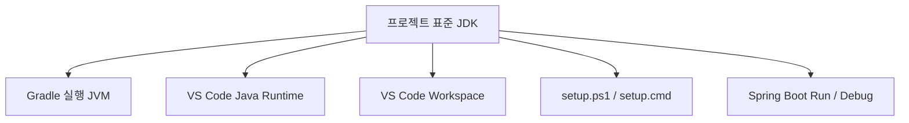

# Windows JDK 구성 및 운영 기준

## 1. 문서 목적

본 문서는 MicroServer 프로젝트의 Java 개발환경에서 사용할 **Eclipse Temurin JDK(Java Development Kit)** 의 표준 구성과 운영 기준을 정의한다.

JDK는 Gradle Build, VS Code Java Runtime, Spring Boot 애플리케이션 실행에 공통으로 사용되는 Java 개발 기반이다.

따라서 실제 프로젝트를 생성하거나 Build Tool과 IDE를 구성하기 전에 다음 기준을 먼저 정한다.

- 프로젝트에서 사용할 JDK 배포판과 Version
- JDK와 JRE의 역할 구분
- JDK Binary의 설치 및 보관 위치
- Windows / macOS 환경별 JDK 구성 방식
- 여러 JDK Version을 함께 관리하는 방법
- 시스템 전역 `JAVA_HOME`과 `PATH` 사용 원칙
- 이후 Gradle / VS Code / Spring Boot 환경과 JDK를 연결하는 기준

실제 JDK 다운로드, 압축 해제, 실행 검증은 운영체제별 가이드에서 진행한다.

---

## 2. 개발환경 구성에서 JDK의 위치

MicroServer 프로젝트의 개발환경은 다음 순서로 구성한다.


JDK는 이후 Gradle, VS Code, Spring Boot가 공통으로 사용하는 Java 실행 및 개발 기반이므로 Build Tool이나 IDE보다 먼저 준비한다.

Windows 개발환경에서는 앞 단계에서 정의한 다음 Root Directory를 기준으로 JDK를 관리한다.

```text
C:\local-microserver
```

JDK의 기본 배치 위치는 다음과 같다.

```text
C:\local-microserver\tools\jdk
```

!!! tip "프로젝트 로컬 개발환경 전체 기준"
    JDK뿐 아니라 Gradle, VS Code Workspace, Git Repository, 환경 초기화 Script를
    하나의 기준 경로에서 관리하는 전체 구조는 다음 가이드에서 설명한다.

    **[프로젝트 로컬 개발환경 구성](../01_foundation/project_local_environment_setup.md)**

---

## 3. 프로젝트 표준 JDK

### 3.1 Eclipse Temurin 사용

MicroServer 프로젝트의 OpenJDK 배포판은 **Eclipse Temurin**으로 통일한다.

Java에는 여러 OpenJDK 배포판이 존재한다.

예:

- Eclipse Temurin
- Oracle JDK
- Amazon Corretto
- Microsoft Build of OpenJDK

기능적으로 호환되더라도 개발자마다 서로 다른 Vendor의 JDK를 사용하면 설치 위치, 배포 방식, 업데이트 정책 등이 달라질 수 있다.

따라서 개발환경의 일관성과 재현성을 위해 Eclipse Temurin을 프로젝트 표준 JDK 배포판으로 사용한다.

### 3.2 프로젝트 기준 Version

현재 MicroServer 프로젝트의 JDK 기준은 다음과 같다.

```text
Vendor       : Eclipse Temurin
Java Version : 25 (LTS)
Package Type : JDK
JVM          : HotSpot
```

본 프로젝트에서는 **Java 25 LTS**를 기준으로 개발환경을 구성한다.

Java 25는 LTS(Long-Term Support) Release이므로 장기간 유지되는 프로젝트의 표준 JDK로 사용하기에 적합하다.

Eclipse Adoptium의 Temurin Release Roadmap 기준으로 Java 25 LTS는 장기 제공 대상이며,
MicroServer와 같이 개발환경 표준을 정의하고 장기간 유지할 가능성이 있는 프로젝트에서는
단기 Feature Release보다 LTS Version을 기준으로 사용하는 것을 원칙으로 한다.

!!! info "왜 Java 25 LTS를 사용하는가?"
    Java 26은 6개월 주기의 Feature Release이고, Java 25는 LTS Release이다.

    MicroServer 프로젝트는 단순 최신 기능 검증이 아니라
    **금융 SI 개발환경과 Framework의 기준을 장기간 유지하는 것**을 목표로 하므로
    최신 Feature Release보다 최신 LTS인 Java 25를 프로젝트 표준으로 사용한다.

    Temurin의 LTS 지원 일정은 Eclipse Adoptium 공식 Support / Release Roadmap을 기준으로 확인한다.

    **[Eclipse Temurin Support / Release Roadmap](https://adoptium.net/support/)**

!!! info "JDK Version 변경 시 확인 범위"
    프로젝트 진행 중 JDK 기준 Version이 변경되면 JDK Binary만 교체하는 것으로 끝나지 않는다.

    다음 영역을 함께 확인해야 한다.

    - 개발자 로컬 JDK
    - Gradle 실행 JVM
    - VS Code Java Runtime
    - Spring Boot / Gradle 호환성
    - 테스트 및 Build 환경
    - CI/CD Java 환경
    - 프로젝트 기술문서

---

## 4. JDK와 JRE의 차이

Java 개발환경에서는 JRE가 아니라 반드시 **JDK**가 필요하다.

```text
JDK
├─ Java Runtime
├─ javac Compiler
├─ Debug / Diagnostic Tools
├─ javadoc
└─ 기타 Java 개발 도구
```

JRE는 Java 애플리케이션 실행에 필요한 Runtime 중심의 환경이다.

반면 JDK에는 Java Runtime뿐 아니라 Java Source를 Compile하는 `javac`와 개발 및 진단에 필요한 여러 도구가 포함된다.

따라서 Eclipse Temurin 다운로드 시 다음 항목을 확인한다.

```text
Package Type : JDK
```

!!! warning "JRE Package를 선택하지 않음"
    MicroServer는 Java Source Compile과 Gradle Build가 필요한 개발 프로젝트이므로
    Runtime만 제공하는 JRE Package가 아니라 반드시 JDK Package를 사용한다.

---

## 5. JDK 설치 및 보관 원칙

### 5.1 Installer보다 압축 배포본 사용

MicroServer 프로젝트에서는 운영체제 Installer를 이용하여 시스템 영역에 JDK를 설치하기보다
**압축 배포본을 내려받아 프로젝트에서 정한 개발도구 Directory에 직접 보관하는 방식**을 기본으로 한다.

| 운영체제 | 권장 배포 형식 |
|---|---|
| Windows | ZIP |
| macOS | TAR.GZ |

압축 배포본을 사용하는 이유는 다음과 같다.

- JDK 설치 위치를 명확하게 관리할 수 있다.
- 여러 JDK Version을 동시에 보관하기 쉽다.
- 시스템 Java 환경을 직접 변경하지 않아도 된다.
- 기존 Java 프로젝트에 미치는 영향을 줄일 수 있다.
- 필요하지 않은 JDK를 Directory 단위로 제거할 수 있다.

### 5.2 Windows JDK 보관 위치

Windows에서는 다음 Directory를 JDK 관리 Root로 사용한다.

```text
C:\local-microserver\tools\jdk
```

프로젝트 표준 JDK 25 LTS는 다음 위치에 배치한다.

```text
C:\local-microserver\tools\jdk\temurin-25
```

전체 구조 예:

```text
C:\local-microserver
├─ tools
│  └─ jdk
│      ├─ temurin-17
│      ├─ temurin-21
│      └─ temurin-25
│
├─ gradle-home
├─ workspace
├─ repos
└─ env
```

### 5.3 JDK는 Git Repository에 포함하지 않음

JDK Binary는 프로젝트 Source와 분리하여 관리한다.

```text
C:\local-microserver
├─ tools
│  └─ jdk
│      └─ temurin-25
│
└─ repos
   └─ microserver
      └─ .git
```

JDK는 용량이 크고 운영체제와 CPU Architecture에 따라 Binary가 달라지므로 프로젝트 Git Repository의 형상관리 대상에 포함하지 않는다.

!!! note "Git Repository와 개발환경 패키지는 구분"
    JDK를 Git Repository에 포함하지 않는다는 의미이지,
    개발환경 전달용 Package에 JDK를 포함할 수 없다는 의미는 아니다.

    Git Repository는 Source와 프로젝트 설정의 형상관리가 목적이고,
    개발환경 Package는 동일한 개발환경을 다른 개발자에게 전달하는 것이 목적이다.

---

## 6. 여러 JDK Version 관리

개발 장비에서는 하나의 JDK Version만 보관할 필요가 없다.

프로젝트마다 요구하는 Java Version이 다를 수 있으므로 JDK를 Version별 Directory로 구분하여 관리한다.

### 6.1 Windows

```text
C:\local-microserver\tools\jdk
├─ temurin-17
├─ temurin-21
└─ temurin-25
```

## 7. 시스템 전역 Java 설정 원칙

MicroServer 프로젝트에서는 프로젝트용 JDK를 Windows 또는 macOS의 시스템 기본 Java로 고정하는 방식을 사용하지 않는다.

다음 설정을 기본 운영 방식으로 사용하지 않는다.

```text
시스템 JAVA_HOME 영구 등록
시스템 PATH에 프로젝트 JDK bin 영구 등록
운영체제 기본 Java를 MicroServer JDK로 변경
```

시스템 `JAVA_HOME`을 특정 프로젝트 JDK로 고정하면 같은 개발 장비에서 실행되는 다른 Java 프로젝트에 영향을 줄 수 있기 때문이다.

따라서 MicroServer에서는 JDK Binary를 독립적으로 보관하고,
실제 사용하는 개발도구 또는 프로젝트에서 해당 JDK를 명시적으로 선택하도록 한다.



!!! tip "JDK 설치와 JDK 연결은 구분"
    현재 JDK 단계에서는 **JDK Binary를 정해진 위치에 준비하고 정상 동작하는지 검증**한다.

    다음 설정은 이후 Gradle / VS Code / 프로젝트 개발환경 가이드에서 진행한다.

    - `JAVA_HOME` Session 설정
    - Gradle 실행 JVM
    - VS Code Java Runtime
    - `java.configuration.runtimes`
    - VS Code Workspace JDK
    - Spring Boot Run / Debug JDK

    일반 Terminal에서 사용할 `setup.ps1` / `setup.cmd` 역시
    관련 개발도구의 실제 경로가 확정된 이후 구성한다.

---

## 8. OS별 JDK 구성

### 8.1 Windows JDK

Windows에서는 다음 경로를 프로젝트 표준 JDK Home으로 사용한다.

```text
C:\local-microserver\tools\jdk\temurin-25
```

Windows Architecture 확인, Eclipse Temurin ZIP 다운로드, Directory 구성,
`java.exe` / `javac.exe` 실행 검증은 다음 가이드에서 진행한다.

**[Windows JDK 설치 및 검증](windows_jdk_setup.md)**

## 9. JDK 운영 및 문제 해결

JDK 설치 이후 Version 변경이나 실행 문제를 확인할 때는 다음 가이드를 사용한다.

**[JDK 운영 및 문제 해결](jdk_management_troubleshooting.md)**

주요 확인 항목은 다음과 같다.

- 여러 JDK Version 병행 관리
- JDK Patch Update 시 주의사항
- `java -version` 실행 문제
- `javac` 파일 누락
- CPU Architecture 불일치
- 압축 해제 후 Directory 구조 확인
- JDK Home 확인
- 실제 실행 중인 Java 확인

---

## 10. JDK 환경 구성 기준 정리

MicroServer 프로젝트의 JDK 개발환경 기준은 다음과 같다.

| 구분 | 기준 |
|---|---|
| JDK Vendor | Eclipse Temurin |
| Java Version | 25 LTS |
| Package Type | JDK |
| JVM | HotSpot |
| Windows 배포 형식 | ZIP |
| macOS 배포 형식 | TAR.GZ |
| Windows JDK Root | `C:\local-microserver\tools\jdk` |
| Windows JDK Home | `C:\local-microserver\tools\jdk\temurin-25` |
| macOS JDK Root | `~/dev/jdks` |
| Git Repository 포함 | 하지 않음 |
| 시스템 `JAVA_HOME` 영구 등록 | 기본 방식으로 사용하지 않음 |
| 시스템 PATH 등록 | 기본 방식으로 사용하지 않음 |
| 여러 JDK Version | Directory별 병행 관리 |

---

## 11. 확인 항목

다음 기준을 확인한다.

- [ ] Eclipse Temurin을 프로젝트 표준 JDK 배포판으로 사용한다.
- [ ] MicroServer 프로젝트 기준 Java Version이 25 LTS임을 확인했다.
- [ ] JRE가 아니라 JDK Package를 사용해야 함을 이해했다.
- [ ] Windows JDK Root가 `C:\local-microserver\tools\jdk`임을 확인했다.
- [ ] 프로젝트 표준 JDK Home이 `C:\local-microserver\tools\jdk\temurin-25`임을 확인했다.
- [ ] JDK Binary는 프로젝트 Git Repository에 포함하지 않는다.
- [ ] 여러 JDK Version을 Directory별로 병행 관리할 수 있다.
- [ ] 시스템 전역 `JAVA_HOME`을 MicroServer 프로젝트용으로 고정하지 않는다.
- [ ] 실제 JDK 연결은 Gradle / VS Code / 프로젝트 개발환경 단계에서 진행한다.

---

## 12. 관련 가이드

OS별 실제 JDK 설치 및 검증은 다음 문서에서 진행한다.

- **[Windows JDK 설치 및 검증](windows_jdk_setup.md)**
- **[macOS JDK 설치 및 검증](macos_jdk_setup.md)**

JDK Version 관리 및 문제 해결은 다음 문서를 참고한다.

- **[JDK 운영 및 문제 해결](jdk_management_troubleshooting.md)**

JDK 준비가 완료되면 다음 단계인 Gradle 개발환경 구성으로 진행한다.
