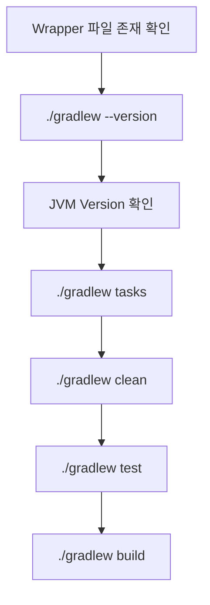

# Windows Gradle 명령어 / Cache / 문제 해결

## 1. 문서 목적

본 문서는 Gradle 개발환경을 구성한 이후 자주 사용하는 다음 내용을 정리한다.

- Gradle 기본 명령
- Wrapper 기준 명령 실행
- Maven 명령과의 비교
- Gradle User Home
- Dependency / Wrapper Cache
- Gradle Daemon
- 프로젝트 `.gradle` Directory
- 자주 발생하는 기본 문제 해결

실제 MicroServer 프로젝트 Build에서는 **Gradle Wrapper 사용을 기본 원칙**으로 한다.

---

## 2. 명령 실행 원칙

### 개발 PC Gradle 확인

```bash
gradle --version
gradle --help
```

이 명령은 개발 PC에 설치된 Gradle을 확인하는 용도이다.

### 프로젝트 Gradle 실행

macOS / Linux:

```bash
./gradlew
```

Windows:

```powershell
.\gradlew.bat
```

실제 프로젝트에서는 아래 Wrapper 명령을 기준으로 사용한다.

---

## 3. 자주 사용하는 기본 명령

### 3.1 Gradle Version 확인

macOS / Linux:

```bash
./gradlew --version
```

Windows:

```powershell
.\gradlew.bat --version
```

확인 내용:

- Gradle Version
- JVM Version
- OS
- Groovy Version
- Kotlin Version

---

### 3.2 사용 가능한 Task 확인

macOS / Linux:

```bash
./gradlew tasks
```

Windows:

```powershell
.\gradlew.bat tasks
```

Gradle은 Maven Lifecycle보다 **Task 중심**으로 동작하므로 어떤 Task가 있는지 확인하는 습관이 중요하다.

---

### 3.3 Multi-Project 목록 확인

```bash
./gradlew projects
```

Windows:

```powershell
.\gradlew.bat projects
```

Multi-Project 구성 이후 Root Project와 Subproject 구조를 확인할 때 사용한다.

---

### 3.4 Clean

```bash
./gradlew clean
```

Build 결과 Directory를 정리한다.

일반적으로 다음 Directory의 Build 결과가 정리된다.

```text
build/
```

---

### 3.5 Test

```bash
./gradlew test
```

Test Task를 실행한다.

---

### 3.6 Build

```bash
./gradlew build
```

Java Plugin / Spring Boot Plugin 구성에 따라 Compile, Test 및 Packaging 관련 Task가 연결되어 실행된다.

`build`를 단순히 Maven의 `package`와 완전히 같은 것으로 이해하기보다 **Gradle Build Lifecycle에 연결된 주요 Task를 수행하는 상위 Task**로 이해한다.

---

### 3.7 Spring Boot 실행

```bash
./gradlew bootRun
```

Windows:

```powershell
.\gradlew.bat bootRun
```

Spring Boot Gradle Plugin이 적용된 프로젝트에서 Application을 실행할 때 사용한다.

---

### 3.8 Dependency 확인

```bash
./gradlew dependencies
```

특정 Configuration을 지정할 수도 있다.

예:

```bash
./gradlew dependencies --configuration runtimeClasspath
```

---

### 3.9 특정 Dependency 분석

```bash
./gradlew dependencyInsight \
  --dependency jackson \
  --configuration runtimeClasspath
```

어떤 Dependency가 특정 Version을 가져왔는지 분석할 때 유용하다.

---

## 4. Maven 명령 대응표

| 목적 | Gradle | Maven |
|---|---|---|
| Version 확인 | `./gradlew --version` | `./mvnw -version` |
| Task / Goal 확인 | `./gradlew tasks` | `./mvnw help:describe ...` |
| Clean | `./gradlew clean` | `./mvnw clean` |
| Test | `./gradlew test` | `./mvnw test` |
| Build | `./gradlew build` | `./mvnw package` 또는 `verify` |
| Spring Boot 실행 | `./gradlew bootRun` | `./mvnw spring-boot:run` |
| Dependency 전체 확인 | `./gradlew dependencies` | `./mvnw dependency:tree` |
| 특정 Dependency 분석 | `./gradlew dependencyInsight` | `./mvnw dependency:tree -Dincludes=...` |
| Multi-Project 목록 | `./gradlew projects` | Parent POM `<modules>` 확인 |

!!! note
    Maven Lifecycle과 Gradle Task Graph는 실행 모델이 다르므로 명령을 완전히 1:1 관계로 해석하지 않는다.

---

## 5. Gradle User Home이란

Gradle은 사용자별 Cache 및 설정을 보관하는 Directory를 사용한다.

기본 위치:

### Windows

```text
C:\Users\<사용자>\.gradle
```

## 6. `GRADLE_HOME`, `GRADLE_USER_HOME`, 프로젝트 `.gradle` 구분

이 세 가지 이름이 비슷해서 자주 혼동된다.

| 구분 | 예 | 역할 |
|---|---|---|
| `GRADLE_HOME` | `C:\dev\tools\gradle\gradle-9.7.1` | 개발 PC에 설치한 Gradle 프로그램 위치 |
| `GRADLE_USER_HOME` | `C:\Users\user\.gradle` | 사용자별 Cache / Wrapper Distribution / 설정 |
| 프로젝트 `.gradle/` | `<project>/.gradle` | 해당 프로젝트의 Local Build 상태 및 Cache |

쉽게 표현하면:

```text
GRADLE_HOME
→ Gradle 프로그램

GRADLE_USER_HOME
→ 사용자 공용 Gradle 작업 공간

프로젝트 .gradle
→ 특정 프로젝트의 Gradle 작업 공간
```

---

## 7. Gradle User Home 주요 구조

예:

```text
.gradle/
├─ caches/
├─ daemon/
├─ wrapper/
└─ gradle.properties
```

대표적인 역할:

| Directory / File | 역할 |
|---|---|
| `caches/` | Dependency 및 Gradle 내부 Cache |
| `daemon/` | Gradle Daemon 관련 데이터 |
| `wrapper/` | Wrapper가 다운로드한 Gradle Distribution |
| `gradle.properties` | 사용자별 Gradle Property |

실제 Gradle Version과 Plugin 구성에 따라 추가 Directory가 생성될 수 있다.

---

## 8. Maven `.m2`와 비교

Maven 사용자는 Gradle User Home을 `.m2`와 비교하면 이해하기 쉽다.

Maven:

```text
~/.m2/
├─ repository/
└─ settings.xml
```

Gradle:

```text
~/.gradle/
├─ caches/
├─ wrapper/
└─ gradle.properties
```

개념적으로는 다음이 비슷하다.

```text
Maven ~/.m2/repository
        ↕
Gradle ~/.gradle/caches
```

하지만 Maven의 `settings.xml`과 Gradle의 `gradle.properties`는 완전히 같은 역할을 하지 않는다.

Gradle의 Repository, Proxy, 인증 설정은 다음 여러 위치를 조합할 수 있다.

- `repositories {}`
- `gradle.properties`
- Environment Variable
- Init Script
- 회사 표준 Plugin / Convention

---

## 9. Credential 관리 원칙

사내 Nexus, Artifactory 등 Repository 인증정보가 필요할 수 있다.

다음과 같은 민감정보를 Project Repository에 직접 Commit하지 않는다.

```text
Repository Password
Access Token
Private Credential
```

예를 들어 사용자 Home의 Gradle Property나 환경변수를 활용하고, 프로젝트 Source에는 Property 이름만 참조하는 방식을 사용할 수 있다.

실제 인증 방식은 프로젝트 보안정책에 맞춰 별도 정의한다.

---

## 10. Gradle Wrapper Cache

Wrapper가 다운로드한 Gradle Distribution은 일반적으로 다음 아래에 저장된다.

```text
~/.gradle/wrapper/dists
```

예:

```text
~/.gradle/
└─ wrapper/
   └─ dists/
      └─ gradle-9.7.1-bin/
```

프로젝트마다 Gradle 전체 Binary를 복사하지 않고 사용자 Cache에서 재사용한다.

따라서 한 번 다운로드된 Distribution은 동일한 Wrapper 설정을 사용하는 Build에서 다시 활용된다.

---

## 11. Dependency Cache

외부 Dependency 관련 Cache는 다음 아래에서 관리된다.

```text
~/.gradle/caches
```

예를 들어 Maven Central에서 받은 Library가 매 Build마다 다시 다운로드되는 것이 아니라 Cache를 활용한다.

단, Gradle의 Cache 구조는 내부 구현에 의해 관리되므로 개발자가 임의로 특정 내부 Directory 구조에 의존해서는 안 된다.

---

## 12. Gradle Daemon

Gradle은 반복 Build 성능 향상을 위해 Background JVM Process인 **Gradle Daemon**을 사용할 수 있다.

개념적으로:

```text
첫 Build
→ JVM 시작
→ Gradle 초기화
→ Build

다음 Build
→ 기존 Daemon 재사용
→ 초기화 비용 감소
→ Build
```

현재 실행 중인 Daemon 확인:

```bash
./gradlew --status
```

Daemon 종료:

```bash
./gradlew --stop
```

문제 분석이나 JDK 변경 후 기존 Daemon 상태가 의심될 때 유용하다.

---

## 13. 기본 문제 해결

### 13.1 `gradle` 명령을 찾을 수 없음

Windows:

```powershell
Get-Command gradle
```

macOS:

```bash
which gradle
```

확인할 사항:

```text
GRADLE_HOME
PATH
Gradle bin Directory
```

---

### 13.2 `java` Version이 예상과 다름

확인:

```bash
java -version
gradle --version
```

Windows:

```powershell
$env:JAVA_HOME
Get-Command java
```

macOS:

```bash
echo "$JAVA_HOME"
which java
```

Gradle 출력의 JVM Version까지 확인해야 한다.

---

### 13.3 `gradle`은 되는데 `gradlew`가 안 됨

이 경우 시스템 Gradle은 정상이고 프로젝트 Wrapper에 문제가 있을 가능성이 있다.

다음 파일을 확인한다.

```text
gradlew
gradlew.bat
gradle/wrapper/gradle-wrapper.jar
gradle/wrapper/gradle-wrapper.properties
```


```bash
ls -l gradlew
chmod +x gradlew
```

---

### 13.4 Wrapper가 Gradle을 다운로드하지 못함

다음 가능성을 확인한다.

- 인터넷 차단
- Proxy
- Firewall
- 사내망 외부 URL 접근 제한
- 잘못된 `distributionUrl`
- 인증이 필요한 사내 Distribution Server

Wrapper 설정 확인:

```text
gradle/wrapper/gradle-wrapper.properties
```

예:

```properties
distributionUrl=https\://services.gradle.org/distributions/gradle-9.7.1-bin.zip
```

금융권 폐쇄망이라면 사내 Repository 정책을 확인해야 한다.

---

### 13.5 Dependency 다운로드 실패

확인할 항목:

- Maven Central 접근 가능 여부
- 사내 Nexus / Artifactory URL
- Proxy
- Repository 인증
- Dependency Version
- SSL 인증서
- 사내 Repository Mirror 정책

Dependency 문제를 단순히 Cache 삭제부터 시도하지 않는 것이 좋다.

먼저 실제 오류 메시지와 Repository 접근 문제를 확인한다.

---

### 13.6 Cache가 의심되는 경우

Gradle Cache:

```text
~/.gradle/caches
```

프로젝트 Local Gradle Directory:

```text
<project>/.gradle
```

무조건 전체 `.gradle`을 삭제하기보다 먼저 다음 순서로 확인한다.

```text
1. 실제 Build Error 확인
2. Java / Gradle Version 확인
3. Repository / Network 확인
4. Daemon 상태 확인
5. 필요한 범위의 Cache 문제 여부 확인
6. 최종적으로 Cache 정리 검토
```

---

### 13.7 JDK를 바꿨는데 이전 Java를 사용하는 것 같음

Gradle Daemon이 기존 JVM으로 실행 중일 수 있다.

먼저 현재 정보를 확인한다.

```bash
./gradlew --version
```

필요하면 Daemon을 종료한다.

```bash
./gradlew --stop
```

그 다음 원하는 JDK를 현재 Session에 연결하고 다시 실행한다.

---

## 14. 프로젝트 Build 기본 확인 순서

Spring Boot 프로젝트 생성 이후 Build 문제가 발생하면 다음 순서로 점검하면 좋다.



특정 단계에서 실패하면 그 단계의 오류를 먼저 해결한다.

---

## 15. 기본 체크리스트

- [ ] 개발 PC `gradle --version`과 프로젝트 `./gradlew --version`의 차이를 안다.
- [ ] 프로젝트 Build는 Wrapper로 실행한다.
- [ ] `GRADLE_HOME`과 `GRADLE_USER_HOME`을 구분할 수 있다.
- [ ] `~/.gradle/caches`의 역할을 이해한다.
- [ ] `~/.gradle/wrapper/dists`의 역할을 이해한다.
- [ ] 프로젝트 `.gradle/`과 사용자 `~/.gradle/`을 구분할 수 있다.
- [ ] `./gradlew tasks`로 Task를 확인할 수 있다.
- [ ] `./gradlew build`로 Build를 수행할 수 있다.
- [ ] `./gradlew dependencies`로 Dependency를 확인할 수 있다.
- [ ] Build 문제 발생 시 Cache 전체 삭제보다 원인 확인을 먼저 수행한다.

---

## 16. 다음 단계

Gradle 기본 환경과 Wrapper 개념을 이해했다면 다음 단계는 VS Code 개발환경 구성이다.

```text
JDK 설치 및 설정
        ↓
Gradle 개요 / 설치 / Wrapper 이해       ← 현재 완료
        ↓
VS Code 개발환경 구성
        ↓
Spring Boot 프로젝트 생성
        ↓
프로젝트 JDK / Gradle / VS Code 설정
```

Spring Boot 프로젝트 생성 이후에는 다음 파일을 실제로 수정하고 검증한다.

```text
settings.gradle
build.gradle
gradlew
gradlew.bat
gradle/wrapper/gradle-wrapper.properties
```

이후 Multi-Project, Plugin, Dependency, 공통 Module Build 구조를 단계적으로 구성한다.

---

## 17. 공식 참고 자료

- [Gradle Command-Line Interface](https://docs.gradle.org/current/userguide/command_line_interface.html)
- [Gradle Wrapper](https://docs.gradle.org/current/userguide/gradle_wrapper.html)
- [Gradle Dependency Management](https://docs.gradle.org/current/userguide/core_dependency_management.html)
- [Gradle Build Environment](https://docs.gradle.org/current/userguide/build_environment.html)
- [Gradle Compatibility Matrix](https://docs.gradle.org/current/userguide/compatibility.html)
