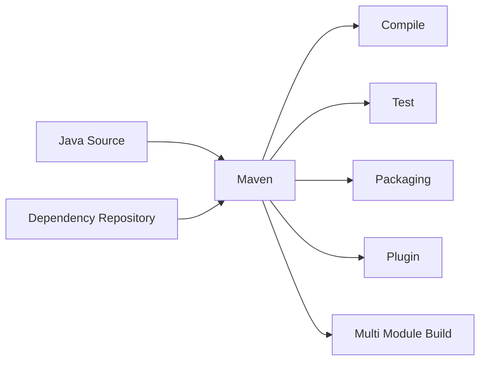
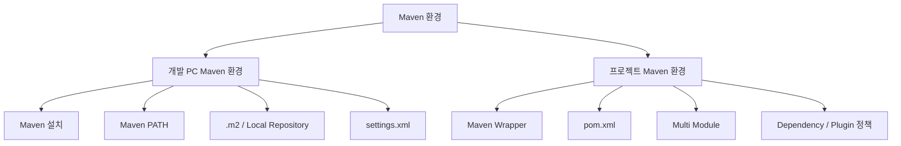

# Windows Maven 설치 및 기본 환경 구성 - 비교 / 참고

!!! info "MicroServer Build Tool 기준"
    현재 Team-Microserver의 **주 Build Tool은 Gradle + Groovy DSL**이다.

    이 문서는 Maven 프로젝트의 설정 방식을 비교하고 기존 Maven 기반 프로젝트를 이해하기 위한 참고 자료로 유지한다.
    실제 MicroServer 구축 절차는 [Gradle 설치 및 기본 환경 구성](../gradle/gradle_setup.md)을 우선한다.

    이후 가이드에서는 Gradle 설정을 먼저 제시하고 필요한 경우 Maven 대응 설정을 함께 설명한다.

---

## 1. 문서 목적

본 문서는 MicroServer 프로젝트 개발에 사용할 **Apache Maven**을 개발 PC에 준비하고,
Maven 명령을 사용할 수 있는 기본 환경을 구성하는 방법을 설명한다.

현재 단계에서는 아직 Spring Boot 프로젝트를 생성하지 않는다.

따라서 본 문서에서는 **Maven 자체의 설치와 개발 PC 수준의 기본 환경 구성**만 진행한다.

현재 단계에서 다루는 범위는 다음과 같다.

- Apache Maven 역할 이해
- Maven 버전 기준 확인
- Windows / macOS Maven Binary 설치
- Maven 실행 경로 구성
- 앞 단계에서 준비한 Eclipse Temurin JDK를 이용한 Maven 실행 확인
- `.m2` 및 Local Repository 이해
- 사용자별 `settings.xml` 역할 이해
- Maven Wrapper의 목적과 적용 시점 이해
- Maven 설치 관련 기본 문제 해결

다음과 같은 **프로젝트 종속 설정은 아직 진행하지 않는다.**

- `pom.xml` 작성 및 수정
- Spring Boot Parent / BOM 설정
- Maven Wrapper 생성 및 프로젝트 포함
- 프로젝트 Maven 버전 고정
- 멀티모듈 Maven 프로젝트 구성
- 부모 POM 구성
- 공통 모듈 JAR 구성
- Dependency Management
- Plugin Management
- Maven Compiler 설정
- 실제 프로젝트 Build
- 특정 Module Build
- Dependency Tree 분석
- Effective POM 분석

위 내용은 Spring Boot 프로젝트를 생성한 이후
**프로젝트 Maven / Build 환경 설정 단계**에서 순차적으로 구성한다.

---

## 2. 개발환경 구성에서 Maven의 위치

MicroServer 프로젝트의 개발도구 환경은 다음 순서로 구성한다.


현재 문서는 다음 단계에 해당한다.

```text
Git / GitHub 환경 구성
        ↓
Eclipse Temurin JDK 준비
        ↓
[ Apache Maven 설치 ]       ← 현재
        ↓
VS Code 개발환경 구성
        ↓
Spring Boot 프로젝트 생성
        ↓
프로젝트별 JDK / Maven / VS Code 설정
```

JDK가 Java 실행환경을 제공한다면 Maven은 Java 프로젝트의 Build 및 Dependency 관리 도구 역할을 담당한다.

현재는 Maven을 **개발 PC에 사용할 수 있는 상태로 준비**하고,
실제 MicroServer 프로젝트와 Maven을 연결하는 작업은 프로젝트 생성 이후 진행한다.

---

## 3. Maven의 역할

Maven은 Java 프로젝트의 **Build 및 Dependency 관리 도구**이다.

향후 MicroServer 프로젝트가 생성되면 Maven은 다음 역할을 담당한다.



대표적인 역할:

- Java Source Compile
- Unit Test 실행
- Dependency 관리
- JAR / WAR Packaging
- Plugin 실행
- Build Lifecycle 관리
- Multi Module Build
- Repository 연계

현재는 Maven이 관리할 실제 프로젝트가 존재하지 않으므로 위 기능을 실행하지 않는다.

현재 단계의 목표는 다음과 같다.

```text
Apache Maven Binary 준비
        ↓
Maven 실행 경로 구성
        ↓
Temurin JDK로 Maven 실행 확인
        ↓
개발 PC Maven 기본환경 준비 완료
```

---

## 4. 개발 PC Maven 환경과 프로젝트 Maven 환경 구분

Maven 환경은 크게 **개발 PC Maven 환경**과 **프로젝트 Maven 환경**으로 구분한다.



### 현재 단계

현재는 다음 영역만 구성한다.

```text
개발 PC Maven 환경
```

### 프로젝트 생성 이후

Spring Boot 프로젝트를 생성한 이후 다음 영역을 구성한다.

```text
프로젝트 Maven 환경
```

이 두 영역을 분리하면 아직 프로젝트가 존재하지 않는 상태에서
`pom.xml`, Wrapper, Multi Module 설정 등이 먼저 등장하는 문제를 방지할 수 있다.

---

## 5. Maven 버전 기준

MicroServer 프로젝트에서는 Apache Maven의 **현재 안정 버전(Stable Release)** 을 기준으로 설치한다.

본 문서 작성 시점의 Apache Maven 공식 Stable Release는 다음과 같다.

```text
Apache Maven 3.9.16
```

실제 설치 시점에는 Apache Maven 공식 다운로드 페이지에서 최신 Stable Release를 다시 확인한다.

> 프로젝트가 생성된 이후에는 Maven Wrapper를 이용하여
> 해당 프로젝트가 사용할 Maven 버전을 명확하게 고정할 예정이다.
>
> 현재 단계에서는 프로젝트가 존재하지 않으므로 Wrapper를 생성하지 않는다.

---

## 6. 사전 준비

Maven은 Java로 실행되는 도구이므로 JDK가 필요하다.

앞 단계에서 다음 환경이 준비되어 있어야 한다.

- Eclipse Temurin JDK 다운로드 완료
- JDK 압축 해제 완료
- JDK Home 경로 확인
- `java` / `javac` 직접 실행 확인 완료

JDK Home 예:

### Windows

```text
C:\dev\jdks\temurin-26
```

# Windows 환경

## 7. Windows Maven 다운로드

Apache Maven 공식 사이트에서 **Binary ZIP Archive**를 다운로드한다.

예:

```text
apache-maven-3.9.16-bin.zip
```

다음 파일과 혼동하지 않는다.

```text
O  Binary ZIP Archive
X  Source Archive
```

Source Archive는 Maven 자체 Source Code이므로 일반 개발환경 설치용으로 사용하지 않는다.

---

## 8. Maven Binary 무결성 확인

Apache Maven 공식 다운로드 페이지에서는 Binary 배포본과 함께
Checksum 및 Signature 검증 정보를 제공한다.

보안 정책이나 개발환경 정책상 다운로드 파일 검증이 필요한 경우
공식 사이트에서 제공하는 **SHA-512 Checksum**을 이용하여 다운로드한 파일이 변조되지 않았는지 확인할 수 있다.

Windows PowerShell 예:

```powershell
Get-FileHash .\apache-maven-3.9.16-bin.zip -Algorithm SHA512
```

출력된 Hash 값을 Apache Maven 공식 다운로드 페이지에서 제공하는 SHA-512 값과 비교한다.

개인 학습환경에서는 선택적으로 수행할 수 있지만,
기업 또는 보안 요구사항이 있는 개발환경에서는 검증을 권장한다.

---

## 9. Windows Maven 압축 해제

다운로드한 ZIP 파일을 개발도구 디렉터리에 압축 해제한다.

권장 예:

```text
C:\dev\tools\apache-maven-3.9.16
```

개발도구 구조 예:

```text
C:\dev\
 ├─ jdks\
 │   └─ temurin-26\
 │
 └─ tools\
     └─ apache-maven-3.9.16\
         ├─ bin\
         ├─ boot\
         ├─ conf\
         └─ lib\
```

JDK와 Maven을 서로 다른 역할의 개발도구로 구분하여 보관한다.

---

## 10. Windows Maven `bin` PATH 등록

Maven 명령을 어느 디렉터리에서나 사용할 수 있도록
Maven의 `bin` 디렉터리를 Windows 사용자 `Path`에 추가한다.

```text
C:\dev\tools\apache-maven-3.9.16\bin
```

Windows:

```text
시스템 환경 변수 편집
→ 환경 변수
→ 사용자 변수
→ Path
```

Maven `bin` 경로를 추가한다.

!!! note
    Maven `bin` 경로를 PATH에 추가하는 것과
    JDK `bin` 경로를 시스템 PATH에 추가하는 것은 서로 다른 설정이다.

본 프로젝트에서는 JDK `bin`을 시스템 PATH에 영구 등록하지 않는다.

---

## 11. Windows Maven 실행파일 확인

환경변수 변경 후 새로운 PowerShell을 실행한다.

Maven 실행파일 위치를 확인한다.

```powershell
where.exe mvn
```

정상 예:

```text
C:\dev\tools\apache-maven-3.9.16\bin\mvn.cmd
```

이 단계에서 Maven 실행파일은 확인되지만,
Java가 시스템 PATH에 없거나 `JAVA_HOME`이 설정되어 있지 않다면
아직 `mvn -version` 실행은 실패할 수 있다.

현재 JDK 운영 방식에서는 정상적인 상태이다.

---

## 12. Windows에서 Temurin JDK를 임시 연결

Maven 실행 검증을 위해 현재 PowerShell Session에서만 Temurin JDK를 연결한다.

```powershell
$env:JAVA_HOME="C:\dev\jdks\temurin-26"
$env:Path="$env:JAVA_HOME\bin;$env:Path"
```

확인:

```powershell
java -version
javac -version
mvn -version
```

Maven 출력에서 다음 항목을 확인한다.

```text
Apache Maven 3.9.16
Java version: ...
Java home: ...
OS name: ...
```

`Java home`이 앞 단계에서 준비한 Eclipse Temurin JDK Home을 가리키는지 확인한다.

PowerShell을 종료하면 이 Session에서 설정한 `JAVA_HOME`과 JDK PATH는 사라진다.

즉, 시스템 전역 `JAVA_HOME`은 변경하지 않는다.

---

## 13. Windows 검증 목적

현재 검증의 목적은 다음 두 가지이다.

```text
1. Maven Binary가 정상 설치되었는가?
2. Maven이 준비된 Temurin JDK에서 정상 실행되는가?
```

현재 단계에서는 다음 환경을 만들지 않는다.

```text
System JAVA_HOME = Temurin JDK
System PATH      = Temurin JDK/bin
```

향후 프로젝트가 생성되면 프로젝트 JDK와 Build 환경을 별도로 구성한다.

---
