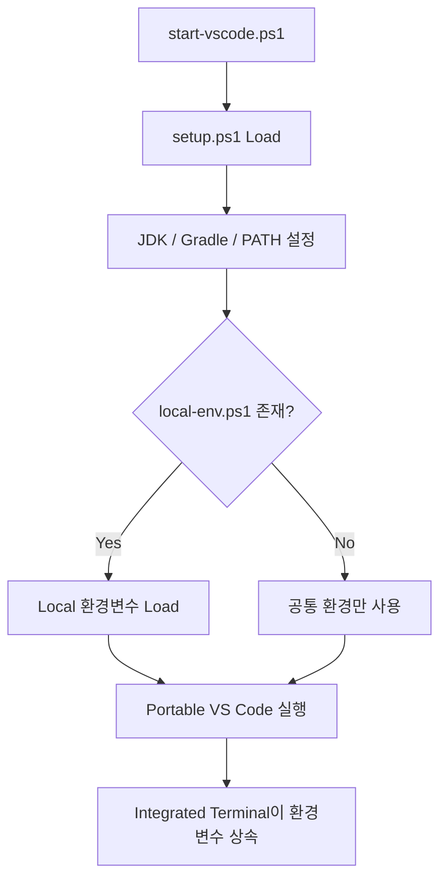

# Windows VS Code Portable 설정

## 1. 문서 목적

본 문서는 설치가 완료된 Windows VS Code ZIP 배포본을
MicroServer 표준 **Portable VS Code 실행환경**으로 구성하는 절차를 설명한다.

이 문서에서는 다음 항목을 다룬다.

- `data` Directory 생성 및 Portable Mode 활성화
- Portable `data` Directory의 역할
- `setup.ps1`, `start-vscode.ps1` 기반 실행환경
- 개발자별 `local-env.ps1` 분리
- Shortcut과 MicroServer Icon 구성
- 환경변수를 적용한 Portable VS Code 실행
- Portable VS Code Update
- 다른 개발자에게 전달할 Package 구성
- Credential / Secret / 개인 User Data 제외 기준
- Portable Mode의 적용 범위

Encoding, Auto Save, Format On Save 등 Editor 기본 정책은 다음
**VS Code 기본 설정** 문서에서 다룬다.

`settings.json`과 Java/JDK Runtime 등 실제 User Scope 상세 설정은
그 다음 **VS Code User Settings** 문서에서 구성한다.

## 2. Portable 환경 구성

### 2.4 Portable Mode 활성화

Windows와 Linux에서 VS Code Portable Mode는
VS Code 실행 Directory 바로 아래에 **`data` Directory를 생성**하여 활성화한다.

PowerShell:

```powershell
New-Item -ItemType Directory -Force C:\local-microserver\tools\vscode\data
```

최종 구조:

```text
C:\local-microserver\tools\vscode
├─ Code.exe
├─ bin\
├─ appx\
├─ policies\
├─ tools\
├─ ...
└─ data\
```

이 상태에서 `Code.exe`를 실행하면 Portable Mode로 동작한다.

!!! important "`data` 폴더가 Portable Mode의 기준"
    단순히 VS Code ZIP을 압축 해제한 것만으로는
    VS Code 사용자 데이터가 모두 Portable 영역에 저장되는 것은 아니다.

    **VS Code 실행 Directory에 `data` 폴더가 존재해야 Portable Mode가 활성화된다.**

### 2.5 Portable `data` Directory의 역할

VS Code가 Portable Mode로 실행되면 Settings, Extension, UI 상태 등
VS Code가 관리하는 데이터가 `data` 아래에 저장된다.

대표 구조:

```text
C:\local-microserver\tools\vscode\data
├─ user-data
│  └─ User
│     └─ settings.json
└─ extensions
   └─ ...
```

역할:

| Directory | 역할 |
|---|---|
| `data\user-data` | Settings, Profile, UI 상태 등 VS Code User Data |
| `data\extensions` | 설치한 VS Code Extension |
| `data\tmp` | 선택적으로 Portable TMP 영역으로 사용 가능 |

일반 설치에서는 Settings와 Extension이 사용자 Profile Directory에 분산될 수 있지만,
Portable Mode에서는 VS Code 관련 데이터를 Package 안쪽으로 모을 수 있다.

```text
일반 설치
C:\Users\<사용자>\AppData\Roaming\Code
C:\Users\<사용자>\.vscode\extensions

Portable Mode
C:\local-microserver\tools\vscode\data\user-data
C:\local-microserver\tools\vscode\data\extensions
```

### 2.6 Portable VS Code 실행

PowerShell에서 직접 실행:

```powershell
& "C:\local-microserver\tools\vscode\Code.exe"
```

CLI Version 확인:

```powershell
& "C:\local-microserver\tools\vscode\bin\code.cmd" --version
```

VS Code Portable 자체의 실행 확인에는 위와 같이 **절대경로로 실행**해도 된다.

향후 `setup.ps1` 또는 `start-vscode.ps1`에서 VS Code의 `bin` Directory를
현재 Session PATH에 추가하면 다음 명령도 사용할 수 있다.

```powershell
code --version
```

### 2.7 PowerShell 기반 MicroServer VS Code 실행

MicroServer Windows 개발환경의 실행 Script는 **PowerShell(`.ps1`)을 기본으로 사용**한다.

기존 CMD Script를 병행하지 않고 다음 역할을 PowerShell Script로 분리한다.

```text
C:\local-microserver
│
├─ env
│  ├─ setup.ps1
│  ├─ start-vscode.ps1
│  ├─ create-vscode-shortcut.ps1
│  ├─ local-env.example.ps1
│  └─ local-env.ps1
│
├─ icons
│  └─ microserver.ico
│
└─ MicroServer VS Code.lnk
```

역할:

| 파일 | 역할 |
|---|---|
| `setup.ps1` | 현재 PowerShell Session에 JDK / Gradle / PATH / Local 환경변수 적용 |
| `start-vscode.ps1` | 환경을 준비한 뒤 Portable VS Code 실행 |
| `local-env.example.ps1` | 개발자별 Local 설정 Sample |
| `local-env.ps1` | 개발자 개인 Local Secret / 설정 |
| `create-vscode-shortcut.ps1` | MicroServer Root에 VS Code 실행 바로가기 생성 |
| `icons\microserver.ico` | 바로가기에서 사용할 MicroServer Icon |

!!! important "CMD Script를 기본 실행 방식으로 사용하지 않음"
    MicroServer Windows 개발환경의 공통 Script는 PowerShell을 기준으로 작성한다.

    `setup.ps1`, `start-vscode.ps1`, `local-env.ps1`를 기본 Package에 함께 제공하지 않는다.

### 2.7.1 `local-env.example.ps1`

배포 Package에는 실제 Secret이 없는 Sample을 포함한다.

```powershell
# MicroServer Local Environment Example

$env:ORACLE_PWD = '<strong-local-password>'
```

개발자는 최초 1회 다음과 같이 파일을 복사한다.

```text
local-env.example.ps1
        ↓ 복사
local-env.ps1
```

실제 `local-env.ps1` 예:

```powershell
# Developer Local Environment

$env:ORACLE_PWD = '<개발자-개인-로컬-비밀번호>'
```

!!! danger "`local-env.ps1`은 배포하지 않음"
    실제 Password, Token 등 개발자별 Secret이 들어갈 수 있으므로
    `C:\local-microserver` 개발환경 Package를 다른 개발자에게 전달할 때
    현재 개발자의 `local-env.ps1`은 제외한다.

    이 파일은 실제 Source Git Repository 밖에 있으므로
    프로젝트 `.gitignore`로 보호하는 파일이 아니다.

### 2.7.2 `setup.ps1`

`setup.ps1`은 현재 PowerShell Session에 MicroServer 개발환경을 적용하는 보조 Script이다.

주요 설정:

```text
LOCAL_MICROSERVER
JAVA_HOME
GRADLE_HOME
GRADLE_USER_HOME
PATH
ORACLE_PWD 등 Local 환경변수
```

일반 PowerShell에서 직접 Build 또는 환경 검증을 할 때는
**Dot Sourcing** 방식으로 실행한다.

```powershell
. C:\local-microserver\env\setup.ps1
```

앞의 `.`은 Script가 설정한 환경변수를 현재 PowerShell Session에 적용하기 위한 것이다.

### 2.7.3 `start-vscode.ps1`

일상적인 VS Code 개발에서는 `setup.ps1`을 직접 실행하기보다
`start-vscode.ps1`이 환경을 준비한 뒤 Portable VS Code를 실행한다.

동작 흐름:



개념적인 실행 Script:

```powershell
$setupScript = Join-Path $PSScriptRoot 'setup.ps1'

. $setupScript -Quiet

$codeExe = Join-Path $env:LOCAL_MICROSERVER 'tools\vscode\Code.exe'

Start-Process -FilePath $codeExe
```

### 2.7.4 MicroServer 실행 Icon

바로가기에서 사용할 Icon은 개발환경 Package에 다음 위치로 제공한다.

```text
C:\local-microserver\icons\microserver.ico
```

Icon 파일은 개발환경 Package 안에 계속 보관한다.

바탕화면에 `.ico` 파일 자체를 복사하는 것이 아니라
**이 Icon을 참조하는 Windows 바로가기(`.lnk`)를 바탕화면으로 복사해서 사용**한다.

### 2.7.5 VS Code 실행 바로가기 생성

다음 Script를 한 번 실행하면:

```text
C:\local-microserver\env\create-vscode-shortcut.ps1
```

다음 바로가기가 생성된다.

```text
C:\local-microserver\MicroServer VS Code.lnk
```

PowerShell:

```powershell
& C:\local-microserver\env\create-vscode-shortcut.ps1
```

생성되는 바로가기의 역할:

```text
MicroServer VS Code.lnk 더블클릭
        ↓
PowerShell 실행
        ↓
start-vscode.ps1
        ↓
setup.ps1
        ↓
local-env.ps1
        ↓
Portable VS Code
```

바로가기는 다음 Icon을 사용한다.

```text
C:\local-microserver\icons\microserver.ico
```

### 2.7.6 바탕화면에서 사용하는 방법

`create-vscode-shortcut.ps1` 실행 후 Windows Explorer에서 다음 파일을 찾는다.

```text
C:\local-microserver\MicroServer VS Code.lnk
```

이 파일을 **복사하여 Windows 바탕화면에 붙여넣는다.**

```text
C:\local-microserver\MicroServer VS Code.lnk
        ↓ 복사
Windows 바탕화면
        ↓
더블클릭
        ↓
MicroServer 개발환경이 적용된 VS Code 실행
```

!!! tip "바로가기 원본은 MicroServer Root에 유지"
    개발환경 Package에는 `C:\local-microserver\MicroServer VS Code.lnk`를 기준 바로가기로 유지한다.

    개발자는 필요할 경우 해당 바로가기를 바탕화면으로 복사하여 사용한다.

    Shortcut의 Target과 Icon은 `C:\local-microserver` 내부 경로를 참조하므로
    개발환경을 표준 경로에 배치하는 것이 중요하다.

!!! note "PowerShell Script 실행이 차단되는 경우"
    회사 보안정책이나 PowerShell 실행정책에 의해 `.ps1` Script 실행이 제한될 수 있다.

    본 가이드에서는 보안정책 변경이나 실행정책 우회 명령을 별도로 안내하지 않는다.

    **Script 실행이 차단되거나 권한 관련 경고가 발생하면 개발환경을 배포하거나 운영하는 팀에 문의한다.**

### 2.7.7 환경변수 확인

바로가기를 통해 VS Code를 실행한 뒤 Integrated PowerShell에서 설정 여부를 확인할 수 있다.

```powershell
$env:JAVA_HOME
$env:GRADLE_HOME
```

Secret 값은 직접 출력하지 않고 설정 여부만 확인한다.

```powershell
if ($env:ORACLE_PWD) {
    "ORACLE_PWD is set"
} else {
    "ORACLE_PWD is not set"
}
```

!!! warning "Local 환경변수 변경 후 VS Code 재시작"
    `local-env.ps1`을 수정한 경우 기존 Portable VS Code를 완전히 종료하고
    `MicroServer VS Code` 바로가기로 다시 실행한다.


### 2.8 Windows 설치 및 Portable Mode 확인

다음 파일과 Directory를 확인한다.

```text
C:\local-microserver\tools\vscode\Code.exe
C:\local-microserver\tools\vscode\bin\code.cmd
C:\local-microserver\tools\vscode\data
```

PowerShell:

```powershell
Test-Path C:\local-microserver\tools\vscode\Code.exe
Test-Path C:\local-microserver\tools\vscode\data
```

Version:

```powershell
& "C:\local-microserver\tools\vscode\bin\code.cmd" --version
```

두 `Test-Path`가 `True`이고 VS Code Version이 정상 출력되면
Windows Portable VS Code 기본 준비가 완료된 것이다.

### 2.9 Portable VS Code Update

Windows ZIP Portable Mode는 일반 Installer 방식의 자동 업데이트를 사용하지 않는다.

Update할 때는 다음 순서로 관리한다.

```text
새 VS Code ZIP 다운로드
        ↓
새 Directory에 압축 해제
        ↓
기존 Portable VS Code 종료
        ↓
기존 data Directory를 새 VS Code Directory로 이동/복사
        ↓
새 Code.exe 실행 및 검증
        ↓
이전 Version 정리
```

`data` Directory를 새 VS Code 설치 Directory로 옮기면
기존 Settings와 Extension을 이어서 사용할 수 있다.

!!! warning "실행파일 위에 무작정 덮어쓰지 않음"
    Update 시에는 새 Version을 별도 Directory에서 먼저 검증한 뒤
    `data`를 이동하는 방식이 문제 발생 시 이전 Version으로 되돌리기 쉽다.

### 2.10 다른 개발자에게 전달할 Portable 환경 만들기

MicroServer 개발환경 Package는 다음처럼 구성할 수 있다.

```text
C:\local-microserver                       ← Git Repository 아님
│
├─ tools
│  ├─ jdk
│  │  └─ temurin-25
│  ├─ gradle
│  │  └─ gradle-9.7.1
│  └─ vscode
│     ├─ Code.exe
│     └─ data
│        ├─ user-data
│        └─ extensions
│
├─ gradle-home
│
├─ workspace
│  ├─ microserver.code-workspace
│  ├─ microserver                         ← Git Repository
│  │  └─ .git
│  └─ microserver-docs                    ← 별도 Git Repository
│     └─ .git
│
├─ env
│  ├─ setup.ps1
│  ├─ start-vscode.ps1
│  ├─ create-vscode-shortcut.ps1
│  ├─ local-env.example.ps1               ← 배포 포함
│  └─ local-env.ps1                       ← 배포 제외
│
├─ icons
│  └─ microserver.ico
│
└─ MicroServer VS Code.lnk
```

이 구조의 장점은 다음과 같다.

- 개발도구의 위치를 한 Root에서 관리할 수 있다.
- VS Code Extension을 개발자마다 다시 설치하는 작업을 줄일 수 있다.
- 공통 VS Code Settings를 미리 적용할 수 있다.
- Windows 시스템 전역 Java / Gradle 설정에 대한 의존성을 줄일 수 있다.
- 개발환경 Package를 압축하여 동일 Root에 풀어 재사용하기 쉽다.
- 실제 Source Repository는 `workspace` 아래에서 개별 Git Repository로 관리할 수 있다.

하지만 **실제 개인 개발에 사용한 `data` 폴더를 그대로 다른 개발자에게 전달하는 것은 피한다.**

배포용 Portable VS Code는 별도로 깨끗하게 구성한다.

권장 절차:

```text
새 VS Code ZIP 압축 해제
        ↓
빈 data Directory 생성
        ↓
프로젝트 표준 Extension만 설치
        ↓
공통 Settings만 설정
        ↓
계정 로그인 / Settings Sync 사용하지 않음
        ↓
개인 Repository / Workspace 열지 않음
        ↓
VS Code 완전 종료
        ↓
배포 Package 생성
```

!!! important "Git 관리 범위와 개발환경 Package 범위는 다름"
    `C:\local-microserver` 자체는 Git Repository가 아니다.

    따라서 `C:\local-microserver\.gitignore`는 필요하지 않다.

    `.gitignore`는 `workspace\microserver` 같은 실제 Repository 내부에서 관리한다.

    반면 `local-env.ps1`는 Git과 관계없이 ZIP에 포함될 수 있으므로
    개발환경 배포 Package에서 별도로 제외한다.

!!! important "계정 / Credential / 개인 상태를 Package에 포함하지 않음"
    Portable `data`는 Settings와 Extension뿐 아니라 VS Code의 여러 User Data를 함께 관리한다.

    따라서 개인이 장기간 사용한 Portable 환경을 정리해서 배포하기보다
    **배포용 Instance를 처음부터 별도로 만드는 방식**이 안전하고 관리하기 쉽다.

### 2.11 Portable Mode의 범위

Portable VS Code Directory를 복사한다고 해서 다음 외부 요소까지 모두 자동으로 복제되는 것은 아니다.

```text
Git 설치
Docker Desktop / Docker Engine
OS Credential Store
외부 CLI
네트워크 / Proxy
인증서
사내 보안 Agent
```

MicroServer Package에서 JDK와 Gradle은 별도로 함께 제공할 수 있지만,
OS 설치나 권한이 필요한 도구는 각 개발 장비에서 별도 구성이 필요할 수 있다.

이 구분을 이해하면 Portable Mode를 "PC 전체 개발환경을 가상화하는 기능"으로 오해하지 않을 수 있다.

## 3. Portable 설정 체크리스트

- [ ] `C:\local-microserver\tools\vscode\data`를 생성했다.
- [ ] Settings와 Extension이 Portable `data` 아래에서 관리되는 구조를 이해했다.
- [ ] `setup.ps1`과 `start-vscode.ps1`의 역할을 이해했다.
- [ ] `local-env.example.ps1`과 개인 `local-env.ps1`을 구분했다.
- [ ] `MicroServer VS Code.lnk`를 생성했다.
- [ ] Shortcut으로 VS Code를 실행했다.
- [ ] Integrated Terminal이 MicroServer 환경변수를 상속하는 구조를 확인했다.
- [ ] 실제 Secret이 포함된 `local-env.ps1`은 배포에서 제외한다.
- [ ] 개인이 장기간 사용한 `data`를 그대로 다른 개발자에게 전달하지 않는다.
- [ ] 배포용 Portable Instance를 별도로 구성한다.
- [ ] Git / Docker 등 OS 관리 도구는 Portable VS Code와 별도 범위임을 이해했다.

## 4. 다음 단계


**[VS Code 기본 설정](vscode_basic_settings.md)**

## 5. 공식 참고

- [VS Code Portable Mode](https://code.visualstudio.com/docs/setup/portable)
- [VS Code Command Line Interface](https://code.visualstudio.com/docs/configure/command-line)
