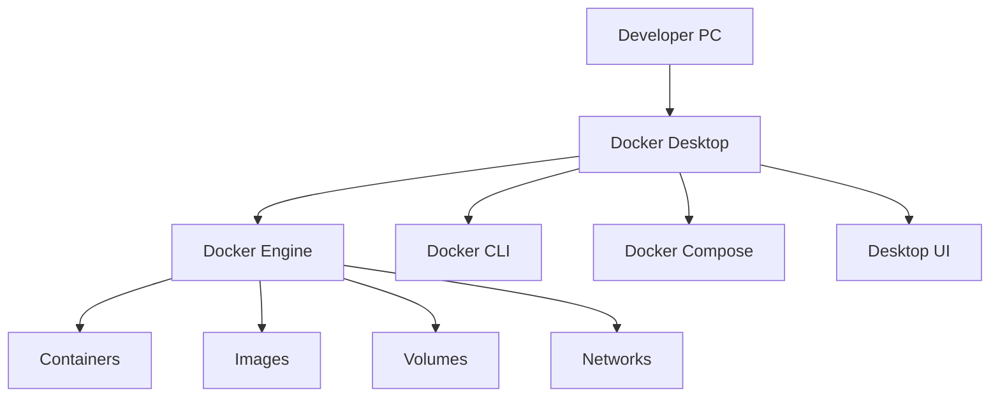

# Windows Docker Desktop 개요 및 공통 환경

## 1. 문서 목적

본 문서는 MicroServer 프로젝트에서 Docker Desktop을 사용하는 이유와
공통 개념, 개발환경에서의 역할, Container Tools와의 관계를 설명한다.

Windows와 macOS의 실제 다운로드 및 설치 절차는 운영체제별 문서로 분리한다.

```text
Docker Desktop 개요 및 공통 환경 가이드
        ↓
┌──────────────────────┬──────────────────────┐
│ Windows 설치 가이드  │ macOS 설치 가이드    │
└──────────────────────┴──────────────────────┘
        ↓
Oracle Database Free 로컬 개발환경 구성
```

!!! info "운영체제별 설치 문서"
    - [Windows Docker Desktop 설치 가이드](docker_desktop_windows_setup.md)
    - [macOS Docker Desktop 설치 가이드](docker_desktop_macos_setup.md)

---

## 2. 개발환경 구성에서 Docker Desktop의 위치

MicroServer 개발환경은 다음 순서로 준비한다.


현재 문서는 다음 단계에 해당한다.

```text
Git / GitHub
    ↓
Eclipse Temurin JDK
    ↓
Gradle
    ↓
VS Code
    ↓
[ Docker Desktop ]              ← 현재
    ↓
Oracle Database Free
```

Docker Desktop을 먼저 독립적으로 준비하면
이후 Oracle뿐 아니라 Redis, Kafka, 기타 개발용 Container를 추가할 때 동일 환경을 재사용할 수 있다.

---

## 3. Docker Desktop의 역할

Docker 관련 도구를 하나의 Desktop Application으로 제공한다.

개념적으로 다음과 같이 이해할 수 있다.



주요 구성:

| 구성 | 역할 |
|---|---|
| Docker Engine | Image를 이용하여 Container 실행 |
| Docker CLI | `docker` 명령 제공 |
| Docker Compose | 여러 Container 구성을 YAML로 관리 |
| Docker Desktop UI | Container / Image / Volume 상태 확인 |

MicroServer에서는 **Linux Container 기반 개발환경**을 기준으로 한다.


### 3.1 VS Code Container Tools와 Docker Desktop의 차이

VS Code에서 **Container Tools** Extension을 설치했더라도
Docker Engine이 설치되는 것은 아니다.

두 도구의 역할은 다음과 같이 구분한다.

```text
VS Code
  ↓
Container Tools Extension
  ↓
Docker CLI / Docker Engine
  ↓
Docker Desktop
  ↓
WSL 2 기반 Linux Container
```

| 구분 | 역할 | 별도 설치 |
|---|---|---|
| VS Code Container Tools | VS Code에서 Container / Image / Registry 등을 조회하고 관리하는 IDE 기능 | VS Code Extension으로 설치 |
| Docker Desktop | Docker Engine, Docker CLI, Docker Compose와 Desktop UI 제공 | OS에 별도 설치 |
| WSL 2 | Windows에서 Linux Container를 실행하기 위한 기반 | Windows 기능 / WSL 설치 필요 |

!!! important "Container Tools만 설치해서는 Container를 실행할 수 없음"
    VS Code의 Container Tools는 실제 Container Runtime이 아니다.

    Windows 개발 PC에서 실제 Linux Container를 실행하려면
    Docker Desktop과 WSL 2 기반 Docker Engine이 정상적으로 동작해야 한다.

---

## 4. Container를 사용하는 이유

개발 PC에 Oracle Database 같은 Server Software를 직접 설치하면
OS별 설치 과정, 버전, 설정 파일, Service 상태가 개발자마다 달라질 수 있다.

Container 기반으로 구성하면 다음과 같은 장점이 있다.

```text
동일 Image
    ↓
동일한 Server Software 구성
    ↓
개발자별 독립 실행
    ↓
삭제 / 재생성 용이
    ↓
로컬 개발환경 재현성 향상
```

특히 Database나 Middleware처럼 설치와 초기화 과정이 복잡한 제품을
개발 PC에서 격리하여 운영할 때 유용하다.

---

## 14. Docker Desktop 라이선스 및 회사 사용 정책

Docker Desktop은 사용 목적과 조직 규모에 따라 Subscription 조건이 달라질 수 있다.

Docker 공식 문서 기준으로 **직원 수가 250명을 초과하거나 연 매출이 미화 1,000만 달러를 초과하는 조직의 상업적 사용**에는
유료 Subscription이 필요할 수 있다.
또한 정부 기관 등은 별도 조건이 적용될 수 있으므로 설치 시점의 Docker Subscription Service Agreement를 확인한다.

따라서 회사 개발 PC에서 사용하는 경우 다음을 확인한다.

- 회사의 Docker Desktop 사용 정책
- 조직의 Docker Subscription 보유 여부
- 보안 Software와의 충돌 여부
- 개발 PC Virtualization 정책
- 관리자 권한 정책

!!! warning
    Docker Desktop의 사용 조건과 Oracle Database Free의 사용 조건은 서로 다른 제품 정책이다.
    각각 별도로 확인한다.

---

## 15. Docker Compose 확인

Docker Desktop에는 Docker Compose를 함께 사용할 수 있는 구성이 제공된다.

확인:

```bash
docker compose version
```

정상 예:

```text
Docker Compose version ...
```

현재 표준 명령은 다음 형식이다.

```bash
docker compose
```

Legacy Standalone Compose에서 사용하던:

```bash
docker-compose
```

형식은 기존 환경 호환 목적이 아니라면 새 가이드의 기본 명령으로 사용하지 않는다.

현재 단계에서는 Compose 기능 존재 여부만 확인한다.

실제 `compose.yml` 또는 `docker-compose.local.yml`은
프로젝트가 생성된 이후 프로젝트 로컬 인프라 구성 단계에서 작성한다.

---

## 18. Image / Container / Volume의 차이

Docker를 처음 사용할 때 다음 세 개념을 혼동하기 쉽다.


### Image

Server Software와 실행환경의 Template이다.

예:

```text
Oracle Database Free Image
```

### Container

Image를 기반으로 실제 실행되는 Instance이다.

예:

```text
microserver-oracle
```

### Volume

Container Life Cycle과 분리하여 Data를 보관한다.

예:

```text
microserver-oracle-data
```

특히 Database Container에서는 Volume이 중요하다.

```text
Container 삭제
    ≠
Database Data 삭제

Volume까지 삭제
    =
Database Data 삭제 가능
```

Oracle 문서에서 이 차이를 다시 실제 명령과 함께 설명한다.

---

## 19. Docker Desktop Resource 이해

Oracle Database는 일반적인 경량 Web Container보다
Memory와 Disk를 더 많이 사용한다.

다음 항목을 확인한다.

- Host 전체 Memory
- Docker Desktop 사용 가능 Resource
- Docker Image 저장 공간
- Named Volume 저장 공간
- SSD 여유 공간
- 동시에 실행하는 Container 수

현재 단계에서는 임의의 Memory Limit 값을 프로젝트 표준으로 강제하지 않는다.

개발 PC 사양과 동시에 실행하는 개발 도구에 따라 Resource 요구량이 달라질 수 있기 때문이다.

---

## 20. Docker Disk 사용 확인

Docker가 사용하는 Disk 현황을 확인할 수 있다.

```bash
docker system df
```

Image:

```bash
docker image ls
```

Volume:

```bash
docker volume ls
```

Container:

```bash
docker ps -a
```

Oracle Image와 Database Volume을 사용하기 시작하면 Disk 사용량이 증가하므로
정기적으로 확인할 수 있다.

---

## 21. Docker Desktop UI

Docker Desktop UI에서도 주요 상태를 확인할 수 있다.

대표 영역:

```text
Containers
Images
Volumes
Builds
Settings
```

CLI를 기본 기준으로 사용하되
Container Logs나 Resource 상태를 빠르게 확인할 때 Desktop UI를 함께 사용할 수 있다.

---

## 10. 설치 완료 후 공통 확인

운영체제별 Docker Desktop 설치가 끝나면 다음 항목을 확인한다.

```bash
docker --version
docker version
docker info
docker compose version
docker run --rm hello-world
```

확인 기준:

```text
Docker CLI           ✅
Docker Desktop       ✅
Docker Engine        ✅
Docker Compose       ✅
Container 실행       ✅
```

`docker version`은 단순히 Client Version만 확인하는 명령이 아니다.
정상 상태에서는 **Client와 Server 정보가 모두 표시**되어야 한다.

!!! warning "Client만 나오고 Server 연결 오류가 발생하는 경우"
    Docker CLI는 설치되어 있지만 Docker Engine이 실행되지 않은 상태일 수 있다.

    Docker Desktop을 실행하고 Engine이 완전히 시작된 뒤 다시 확인한다.

---

## 11. 현재 단계에서 하지 않는 작업

현재 문서는 Docker Desktop 공통 개념과 기본 환경을 이해하는 단계이다.

다음 작업은 이후 문서에서 진행한다.

```text
Oracle Database Image Pull
Oracle Container 생성
Oracle Volume 생성
FREEPDB1 접속
Spring Boot 프로젝트 생성
Docker Compose 프로젝트 파일 작성
application-local.yml 작성
```

---

## 12. 체크리스트

- [ ] Docker Desktop과 VS Code Container Tools의 역할 차이를 이해했다.
- [ ] MicroServer에서는 Linux Container 기반 환경을 사용한다는 것을 이해했다.
- [ ] Windows와 macOS 설치 문서가 분리되어 있음을 확인했다.
- [ ] Docker Engine / CLI / Compose의 역할을 이해했다.
- [ ] Image / Container / Volume의 차이를 이해했다.
- [ ] 회사 개발 PC라면 Docker Desktop 사용 정책과 Subscription 조건을 확인한다.
- [ ] OS별 설치 완료 후 `docker version`에서 Client / Server가 모두 조회되는지 확인한다.
- [ ] `docker run --rm hello-world`로 실제 Container 실행을 검증한다.
- [ ] Oracle Database 구성은 아직 진행하지 않았다.

---

## 13. 다음 단계

사용 중인 운영체제에 맞는 Docker Desktop 설치 문서를 진행한다.

```text
Windows 개발 PC
→ docker_desktop_windows_setup.md

macOS 개발 PC
→ docker_desktop_macos_setup.md
```

설치와 기본 검증이 완료되면 다음 문서로 이동한다.

```text
Oracle Database Free 로컬 개발환경 구성
```

---

## 14. 공식 참고 자료

!!! tip "Docker 공식 문서 모음"
    설치 및 설정 시에는 아래 Docker 공식 문서를 기준으로 확인한다.

    - [Docker Desktop 공식 다운로드 페이지](https://www.docker.com/products/docker-desktop/)
    - [Get Docker Desktop](https://docs.docker.com/get-started/introduction/get-docker-desktop/)
    - [Docker Desktop for Windows 설치](https://docs.docker.com/desktop/setup/install/windows-install/)
    - [Docker Desktop WSL 2 Backend](https://docs.docker.com/desktop/features/wsl/)
    - [Docker Desktop for Mac 설치](https://docs.docker.com/desktop/setup/install/mac-install/)
    - [Docker Compose 설치 및 사용](https://docs.docker.com/compose/install/)

    Docker Desktop Version과 다운로드 경로는 변경될 수 있다.
    오래된 Blog나 제3자 Download Site를 이용하지 말고
    **Docker 공식 다운로드 페이지 또는 공식 설치 문서**에서 최신 Installer를 받는다.
