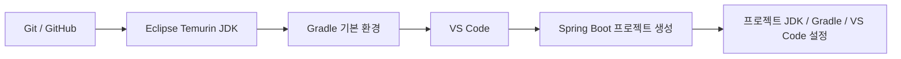
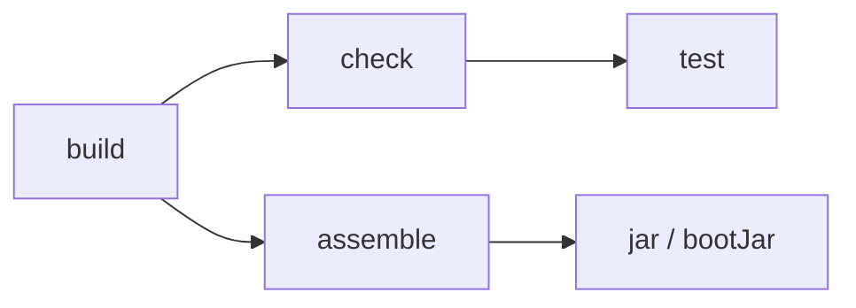
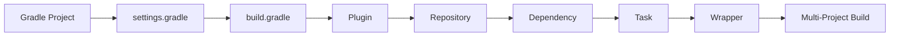

# macOS Gradle 개요 및 프로젝트 기준

## 1. 문서 목적

본 문서는 MicroServer 프로젝트에서 사용하는 **Gradle Build Tool의 기본 개념과 프로젝트 적용 기준**을 설명한다.

MicroServer 프로젝트는 **Gradle + Groovy DSL**을 기본 Build 방식으로 사용한다.


macOS 개발환경도 기존 Windows 개발환경에서 확정한 운영 원칙을 그대로 적용한다.

Windows에서는 `C:\local-microserver`를 기준 Root로 사용했으며, macOS에서는 이에 대응하는 다음 경로를 기준으로 사용한다.

```text
Windows : C:\local-microserver
macOS   : ~/local-microserver
```

운영체제별 경로와 실행 Script 형식은 다르지만 다음 원칙은 동일하다.

- 프로젝트 관련 개발도구와 Workspace를 하나의 기준 Root 아래에서 관리한다.
- 시스템 전역 `JAVA_HOME`, `GRADLE_HOME`, `PATH` 설정에 대한 의존성을 최소화한다.
- JDK는 `tools/jdk` 하위에서 프로젝트 전용으로 관리한다.
- 개발 PC용 Gradle은 `tools/gradle` 하위에 배치할 수 있다.
- Gradle 사용자 데이터는 `gradle-home`으로 분리하여 관리한다.
- 실제 프로젝트 Build는 Local Gradle이 아니라 **Gradle Wrapper**를 기준으로 한다.
- Git Repository는 `repos`, VS Code Workspace는 `workspace`에서 관리한다.
- 환경 초기화 Script는 `env`에서 관리한다.
- 개발환경을 다른 장비로 옮기더라도 동일한 Directory 관계를 유지할 수 있도록 구성한다.

!!! important "Windows 환경을 버리고 macOS를 새로 설계하는 것이 아님"
    macOS 환경은 Windows에서 먼저 확정한 MicroServer 로컬 개발환경의 **운영 원칙과 Directory 역할을 그대로 가져오고**,
    경로 표기와 실행 Script 등 OS 차이가 있는 부분만 macOS 방식으로 변경한다.

본 문서에서는 실제 프로젝트를 구성하기 전에 다음 내용을 먼저 이해하는 것을 목적으로 한다.

- Gradle의 역할과 기본 개념
- Maven과 Gradle의 주요 차이
- Gradle Task 기반 Build 방식
- `settings.gradle`과 `build.gradle`의 역할
- Gradle Groovy DSL 사용 기준
- 개발 PC에 설치된 Gradle과 프로젝트 Gradle Wrapper의 차이
- MicroServer 프로젝트의 Gradle 운영 원칙

현재 단계에서는 아직 실제 Spring Boot 프로젝트를 생성하거나 Build Script를 수정하지 않는다.

다음과 같은 프로젝트 종속 설정은 Spring Boot 프로젝트 생성 이후 별도 단계에서 진행한다.

- `build.gradle` 작성 및 수정
- `settings.gradle` 구성
- Spring Boot Gradle Plugin 설정
- Gradle Wrapper Version 고정
- Multi-Project 구성
- Subproject 간 Dependency 설정
- 공통 Module JAR 구성
- Dependency 및 Plugin 정책 구성
- 실제 프로젝트 Build 및 Module별 Build

본 문서에서는 우선 Gradle의 구조와 프로젝트 적용 원칙을 이해하는 데 집중한다.

| 문서 | 주요 내용 |
|---|---|
| **Gradle 개요 및 MicroServer 프로젝트 기준** | Gradle 역할, Maven과의 차이, Groovy DSL, 프로젝트 Build 원칙 |
| **Gradle 설치 및 기본 환경 구성** | 공식 다운로드, Windows/macOS 설치, PATH 및 실행 확인 |
| **Gradle Wrapper 및 프로젝트 운영 원칙** | Wrapper 개념, 동작 구조, Git 관리, 버전 고정 원칙 |
| **Gradle 명령어·Cache·문제 해결** | 자주 사용하는 명령, User Home, Cache, Troubleshooting |

현재 문서는 그중 **Gradle을 왜 사용하고, MicroServer 프로젝트에서 어떤 기준으로 운영할 것인지**를 이해하는 문서이다.

---

## 2. MicroServer Build Tool 기준

MicroServer 프로젝트의 Build 기준은 다음과 같다.

```text
Build Tool  : Gradle
DSL         : Groovy DSL
Gradle      : 9.7.1
Java        : 25 LTS
Spring Boot : 4.1.0
```

작성 기준일은 **2026-08-25**이다.

Spring Boot 4.1.0은 공식적으로 다음 Build 환경을 지원한다.

```text
Java        : 17 ~ 26
Gradle 8.x  : 8.14 이상
Gradle 9.x  : 지원
```

또한 Gradle 9.7.1은 Java 25 LTS을 Gradle 실행 JVM으로 사용할 수 있다.

따라서 MicroServer 프로젝트에서는 다음 조합을 표준 기준으로 사용한다.

```text
Java 25 LTS
   +
Gradle 9.7.1
   +
Spring Boot 4.1.0
```

!!! info "공식 문서"
    - [Gradle Compatibility Matrix](https://docs.gradle.org/current/userguide/compatibility.html)
    - [Gradle 9.7.1 Release Notes](https://docs.gradle.org/9.7.1/release-notes.html)
    - [Spring Boot System Requirements](https://docs.spring.io/spring-boot/system-requirements.html)

---


## 3. 개발환경 구성에서 Gradle의 위치

Windows에서 사용한 개발환경 구조를 macOS에서는 다음과 같이 대응시킨다.

```text
~/local-microserver
│
├─ tools
│  ├─ jdk
│  │  └─ temurin-25
│  │
│  └─ gradle
│     └─ gradle-9.7.1
│
├─ gradle-home
│
├─ workspace
│  └─ microserver.code-workspace
│
├─ repos
│  └─ microserver
│     ├─ .git
│     ├─ gradlew
│     ├─ gradlew.bat
│     ├─ gradle
│     │  └─ wrapper
│     ├─ settings.gradle
│     ├─ build.gradle
│     └─ src
│
├─ env
│  ├─ setup.sh
│  └─ start-vscode.command
│
└─ README.md
```

Windows와 macOS의 대응 관계는 다음과 같다.

| 구분 | Windows | macOS |
|---|---|---|
| 개발환경 Root | `C:\local-microserver` | `~/local-microserver` |
| JDK | `tools\jdk\temurin-25` | `tools/jdk/temurin-25` |
| Local Gradle | `tools\gradle\gradle-9.7.1` | `tools/gradle/gradle-9.7.1` |
| Gradle User Home | `gradle-home` | `gradle-home` |
| Workspace | `workspace` | `workspace` |
| Git Repository | `repos` | `repos` |
| 환경 Script | `env\setup.ps1`, `setup.cmd` | `env/setup.sh` |
| VS Code 실행 | Windows Shortcut / Script | `start-vscode.command` 또는 Launcher |
| 프로젝트 Build | `gradlew.bat` | `./gradlew` |

!!! note "Directory 이름은 가능한 한 동일하게 유지"
    Windows와 macOS에서 Root의 절대경로 표기만 다르게 하고,
    `tools`, `gradle-home`, `workspace`, `repos`, `env`와 같은 하위 Directory 이름은 동일하게 유지한다.


MicroServer 프로젝트의 기본 개발환경 구성 순서는 다음과 같다.



현재 단계에서는 아직 실제 Spring Boot 프로젝트를 생성하지 않는다.

```text
Git / GitHub 환경 구성
        ↓
Eclipse Temurin JDK 준비
        ↓
Gradle 개념 및 기본 환경 구성       ← 현재
        ↓
VS Code 개발환경 구성
        ↓
Spring Boot 프로젝트 생성
        ↓
프로젝트별 JDK / Gradle / VS Code 설정
```

Gradle을 먼저 설치하는 이유는 단순히 `gradle` 명령을 사용하기 위한 것만은 아니다.

이 단계에서 다음 개념을 먼저 이해해 두면 이후 Spring Boot 프로젝트의 `build.gradle`, `settings.gradle`, `gradlew` 구조를 볼 때 훨씬 이해하기 쉽다.

---

## 4. Gradle은 무엇을 하는가

JDK가 Java 프로그램을 **컴파일하고 실행할 수 있는 환경**을 제공한다면, Gradle은 Java 프로젝트를 **어떤 순서와 규칙으로 Build할 것인지 관리하는 Build Automation Tool**이다.

Gradle이 담당하는 대표적인 기능은 다음과 같다.

- Java Source Compile
- Test 실행
- JAR / Boot JAR 생성
- 외부 Library Dependency 관리
- Build Plugin 적용
- Spring Boot Application 실행
- Multi-Project Build
- Build Task 실행 순서 관리
- CI/CD Build 기준 제공

예를 들어 개발자가 다음 명령을 실행한다고 가정한다.

```bash
./gradlew build
```

Gradle은 단순히 Java Compiler만 실행하는 것이 아니다.

개념적으로 다음과 같은 과정을 수행한다.


즉, Gradle은 프로젝트 Build 전체 과정을 관리하는 **Build 실행 관리자**라고 이해하면 된다.

---

## 5. Gradle과 Maven을 같이 이해하기

기존 Maven 경험이 있다면 Gradle을 Maven과 대응해서 이해하는 것이 가장 빠르다.

| Maven | Gradle | 의미 |
|---|---|---|
| `pom.xml` | `build.gradle` | Build 및 Dependency 설정 |
| Parent POM / `<modules>` | `settings.gradle` + Root `build.gradle` | 전체 프로젝트 및 Subproject 구성 |
| `<dependency>` | `dependencies {}` | Dependency 선언 |
| `<plugin>` | `plugins {}` | Build Plugin 적용 |
| `mvnw` / `mvnw.cmd` | `gradlew` / `gradlew.bat` | 프로젝트 고정 Build Tool 실행 |
| Maven Lifecycle | Gradle Task | Build 실행 단위 |
| `target/` | `build/` | Build 결과 Directory |
| `~/.m2/repository` | `~/.gradle/caches` | Dependency 관련 Local Cache |
| `mvn package` | `./gradlew build` | Build / Test / Packaging |
| `mvn test` | `./gradlew test` | Test 실행 |
| `mvn spring-boot:run` | `./gradlew bootRun` | Spring Boot 실행 |
| `mvn dependency:tree` | `./gradlew dependencies` | Dependency 구조 확인 |

### 5.1 가장 중요한 차이

Maven은 정해진 **Lifecycle Phase**를 중심으로 Build가 진행된다.

```text
validate
  ↓
compile
  ↓
test
  ↓
package
  ↓
verify
  ↓
install
  ↓
deploy
```

Gradle은 **Task와 Task 간 의존관계(Task Graph)**를 중심으로 실행된다.



따라서 Maven의 특정 Phase와 Gradle Task를 무조건 1:1로 대응시키기보다는,

> **Gradle에서는 필요한 작업을 Task로 정의하고, Task 간 관계를 연결하여 Build 흐름을 만든다.**

라고 이해하는 것이 좋다.

---

## 6. Gradle Project의 핵심 파일

Spring Boot Gradle 프로젝트를 생성하면 처음에는 여러 파일이 보인다.

대표적인 구조는 다음과 같다.

```text
microserver/
├─ build.gradle
├─ settings.gradle
├─ gradlew
├─ gradlew.bat
├─ gradle/
│  └─ wrapper/
│     ├─ gradle-wrapper.jar
│     └─ gradle-wrapper.properties
└─ src/
```

각 파일의 역할은 다음과 같다.

| 파일 | 역할 |
|---|---|
| `settings.gradle` | 전체 Gradle Project 이름과 포함할 Subproject 정의 |
| `build.gradle` | Plugin, Dependency, Java 설정, Build 규칙 정의 |
| `gradlew` | macOS/Linux용 Gradle Wrapper 실행 Script |
| `gradle-wrapper.jar` | Wrapper 실행에 필요한 작은 실행 JAR |
| `gradle-wrapper.properties` | 프로젝트에서 사용할 Gradle Version과 Distribution URL 정의 |

처음에는 다음처럼 구분하면 이해하기 쉽다.

```text
settings.gradle
→ "이 Build에 어떤 Project들이 참여하는가?"

build.gradle
→ "이 Project를 어떻게 Build할 것인가?"

gradlew / gradlew.bat
→ "어떤 Gradle Version으로 Build를 시작할 것인가?"
```

Multi-Project 구조에서는 이 세 가지 역할이 더 명확하게 드러난다.

---

## 7. Groovy DSL을 사용하는 이유

Gradle Build Script는 대표적으로 다음 두 DSL을 사용할 수 있다.

```text
Groovy DSL  : build.gradle
Kotlin DSL  : build.gradle.kts
```

MicroServer 프로젝트에서는 **Groovy DSL**을 기본으로 사용한다.

```groovy
dependencies {
    implementation 'org.springframework.boot:spring-boot-starter-webmvc'
}
```

Kotlin DSL에서는 같은 개념을 다음처럼 표현한다.

```kotlin
dependencies {
    implementation("org.springframework.boot:spring-boot-starter-webmvc")
}
```

MicroServer에서 Groovy DSL을 선택하는 이유는 다음과 같다.

- Gradle 자체 구조와 개념 학습에 먼저 집중하기 쉽다.
- 기존 Spring / Java 프로젝트의 Groovy DSL 예제가 많이 축적되어 있다.
- Build Script가 상대적으로 간결하다.
- Maven `pom.xml`과 비교하면서 Gradle 구조를 학습하기 좋다.
- 프로젝트 초기 단계에 불필요한 DSL 학습 부담을 줄일 수 있다.

!!! note "프로젝트 표준"
    MicroServer의 Gradle 예제는 특별한 언급이 없으면 `build.gradle` 기준으로 작성한다.

향후 Gradle 구조와 운영 경험이 충분히 쌓이면 Kotlin DSL 전환 여부를 별도로 검토할 수 있다.

---

## 8. 개발 PC Gradle과 프로젝트 Gradle은 다르다

Gradle을 처음 접할 때 가장 헷갈리기 쉬운 부분이다.

Gradle 실행 방법은 크게 두 가지로 구분한다.

### 8.1 개발 PC에 설치한 Gradle

```bash
gradle --version
gradle tasks
```

이 명령은 **현재 PC의 PATH에 등록된 Gradle**을 사용한다.

즉, 개발자 A와 개발자 B의 설치 Version이 다를 수 있다.

```text
개발자 A PC → Gradle 9.7.1
개발자 B PC → Gradle 9.6.0
CI Server   → Gradle 9.5.0
```

이 상태에서 각자 `gradle build`를 실행하면 실행 환경이 달라질 수 있다.

### 8.2 프로젝트에 포함된 Gradle Wrapper

프로젝트에서는 다음 명령을 사용한다.

macOS / Linux:

```bash
./gradlew build
```


Wrapper를 사용하면 프로젝트가 지정한 Gradle Version을 사용한다.

```text
개발자 A
개발자 B
CI Server
GitHub Actions
        │
        └── gradlew
              │
              └── Gradle 9.7.1
```

따라서 **개발 PC에 어떤 Gradle이 설치되어 있는지와 실제 프로젝트 Build Version을 분리할 수 있다.**

이 개념이 Gradle 운영에서 매우 중요하다.

---


## 8.3 macOS Local Gradle 및 Gradle User Home 기준

Windows 환경에서 Local Gradle과 Gradle 사용자 데이터를 MicroServer Root 안에서 관리했던 원칙을 macOS에서도 동일하게 적용한다.

```text
Local Gradle
~/local-microserver/tools/gradle/gradle-9.7.1

Gradle User Home
~/local-microserver/gradle-home
```

개념적으로 환경 Script에서는 다음 값을 사용할 수 있다.

```bash
export LOCAL_MICROSERVER="$HOME/local-microserver"
export JAVA_HOME="$LOCAL_MICROSERVER/tools/jdk/temurin-25"
export GRADLE_HOME="$LOCAL_MICROSERVER/tools/gradle/gradle-9.7.1"
export GRADLE_USER_HOME="$LOCAL_MICROSERVER/gradle-home"
export PATH="$JAVA_HOME/bin:$GRADLE_HOME/bin:$PATH"
```

이 설정은 시스템 전체에 영구 적용하기보다 MicroServer 개발환경을 시작할 때 `env/setup.sh` 등을 통해 적용하는 방향을 기본으로 한다.

!!! note "Local Gradle과 Wrapper의 역할"
    `tools/gradle/gradle-9.7.1`은 Gradle 학습, Version 확인, 초기 Wrapper 생성 및 복구를 위한 개발 PC용 도구이다.

    실제 MicroServer 프로젝트의 Build 기준은 기존 Windows 환경과 동일하게 프로젝트 Repository의
    `gradlew` / `gradlew.bat` 및 `gradle-wrapper.properties`이다.

!!! note "gradle-home은 개발환경 Package에서 선택적으로 제외 가능"
    `gradle-home`에는 Dependency Cache, Wrapper Distribution 등 용량이 큰 데이터가 쌓일 수 있다.
    일반적인 개발환경 Package 전달 시에는 제외하고 새 환경에서 다시 생성하는 것을 우선 고려한다.
    단, 폐쇄망이나 외부 다운로드가 제한된 환경에서는 포함 여부를 별도로 검토할 수 있다.

---

## 9. MicroServer의 Gradle 운영 원칙

MicroServer 프로젝트에서는 다음 원칙을 사용한다.

### 원칙 1. 실제 프로젝트 Build는 Wrapper를 사용한다

```text
권장

./gradlew build
.\gradlew build
```

```text
프로젝트 Build에서 가급적 사용하지 않음

gradle build
```

### 원칙 2. 프로젝트 Gradle Version은 Wrapper에서 고정한다

Gradle Version 기준은 개인 PC가 아니라 다음 파일에서 관리한다.

```text
gradle/wrapper/gradle-wrapper.properties
```

예:

```properties
distributionUrl=https\://services.gradle.org/distributions/gradle-9.7.1-bin.zip
```

### 원칙 3. Wrapper 파일은 프로젝트 Source와 함께 Git으로 관리한다

다음 파일은 프로젝트 구성원이 모두 동일한 Build 환경을 사용하기 위한 **프로젝트 Build 자산**이다.

```text
gradlew
gradlew.bat
gradle/wrapper/gradle-wrapper.jar
gradle/wrapper/gradle-wrapper.properties
```

### 원칙 4. 개발 PC Gradle 설치본은 보조 도구로 본다

개발 PC 설치본은 다음 용도로 사용한다.

- Gradle 학습
- Version 및 명령 확인
- Wrapper가 없는 초기 프로젝트에서 Wrapper 생성
- Wrapper 복구 및 관리

실제 프로젝트 Build의 최종 기준은 Wrapper이다.

### 원칙 5. JDK Version과 Gradle Version은 서로 독립적으로 관리한다

Gradle은 JVM 위에서 실행되므로 어떤 Java로 Gradle을 실행하는지도 중요하다.

```text
JDK
 └─ Gradle 실행 JVM

Gradle
 └─ Build 실행 Engine

Gradle Java Toolchain
 └─ Source Compile에 사용할 Java
```

이 세 개념은 서로 관련은 있지만 완전히 같은 설정은 아니다.

프로젝트 생성 이후 Java Toolchain을 별도로 구성한다.

---


### 원칙 6. 개발자 개인 Home 경로에 대한 직접 의존을 최소화한다

Script와 설정에서 특정 사용자명을 포함한 절대경로를 직접 작성하지 않는다.

```text
지양
/Users/kim/...

권장
$HOME/local-microserver
$LOCAL_MICROSERVER
```

가능하면 `local-microserver` 내부의 상대적인 Directory 관계를 기준으로 구성한다.

### 원칙 7. Build / Cache와 Wrapper의 Git 관리 범위를 구분한다

다음 Build 및 Cache Directory는 일반적으로 Git 형상관리 대상에서 제외한다.

```gitignore
.gradle/
build/
```

반면 프로젝트의 Gradle Wrapper는 Git으로 관리한다.

```text
gradlew
gradlew.bat
gradle/wrapper/gradle-wrapper.jar
gradle/wrapper/gradle-wrapper.properties
```

### 원칙 8. 개발환경 Package에 개인 보안정보를 포함하지 않는다

개발환경을 압축하여 다른 Mac으로 전달할 경우 다음 정보는 포함하지 않는다.

```text
GitHub Access Token
DB 계정 비밀번호
API Key
인증서 개인키
사내 시스템 계정정보
개인 SSH Private Key
```


---

## 10. 현재 단계에서 하지 않는 것

현재는 아직 실제 Spring Boot 프로젝트를 생성하지 않았으므로 다음 작업은 진행하지 않는다.

- `build.gradle` 상세 작성
- `settings.gradle` Multi-Project 구성
- Spring Boot Gradle Plugin 세부 설정
- Subproject 간 Dependency 구성
- 공통 Module JAR 구성
- Version Catalog
- Convention Plugin
- `buildSrc`
- Composite Build
- Custom Plugin
- 복잡한 Custom Task

이러한 내용은 Spring Boot 프로젝트 생성 이후 단계적으로 적용한다.

---

## 11. Gradle 학습 순서

MicroServer 프로젝트에서는 다음 순서로 Gradle을 이해한다.



초기에는 고급 기능보다 다음 기본 개념을 정확히 이해하는 것이 더 중요하다.

```text
Project
Build Script
Plugin
Repository
Dependency
Task
Wrapper
Multi-Project
```

---


## 12. Windows 개발환경에서 가져온 기준 정리

macOS Gradle 환경은 별개의 새로운 운영 기준을 만드는 것이 아니라 Windows에서 확정한 기준을 다음과 같이 계승한다.

| 항목 | 공통 운영 기준 |
|---|---|
| Root 관리 | 모든 프로젝트 개발환경을 하나의 기준 Root 아래에서 관리 |
| JDK | `tools/jdk` 하위의 프로젝트 전용 JDK 사용 |
| Java 표준 | **Eclipse Temurin Java 25 LTS** |
| Gradle | Local Gradle과 프로젝트 Wrapper 역할 분리 |
| Local Gradle | `tools/gradle/gradle-9.7.1` |
| Gradle User Home | Root 하위 `gradle-home` 사용 가능 |
| 프로젝트 Build | Wrapper 사용 필수 |
| Repository | `repos` 하위에서 Repository별 관리 |
| Workspace | `workspace` 하위에서 관리 |
| 환경변수 | 시스템 전역 설정보다 프로젝트 Local 환경 우선 |
| 환경 Script | OS별 Script를 `env` 하위에서 관리 |
| 전달 방식 | 동일 Directory 구조를 기준으로 Package 구성 가능 |
| 보안 | Token, 비밀번호, 개인키 등은 Package에서 제외 |

macOS에서 달라지는 것은 주로 다음 영역이다.

```text
경로 구분자       \  →  /
실행 Script       .ps1 / .cmd → .sh / .command
Wrapper 실행      gradlew.bat → ./gradlew
VS Code 실행      Windows Shortcut → macOS Launcher / .command
OS 실행 권한      chmod 등 macOS/Unix 권한 처리 필요
```

따라서 이후 macOS JDK, Gradle, VS Code 문서도 이 공통 원칙을 기준으로 구성한다.

---

## 13. 다음 문서

다음 단계에서는 개발 PC에 Gradle을 설치하고 실행 가능한 상태로 구성한다.

→ [Gradle 설치 및 기본 환경 구성](gradle_installation.md)

설치보다 Wrapper 개념을 먼저 자세히 확인하고 싶다면 다음 문서를 참고한다.

→ [Gradle Wrapper 및 프로젝트 운영 원칙](gradle_wrapper.md)

---

## 14. 공식 참고 자료

- [Gradle User Manual](https://docs.gradle.org/current/userguide/userguide.html)
- [Gradle Getting Started](https://docs.gradle.org/current/userguide/getting_started.html)
- [Gradle Compatibility Matrix](https://docs.gradle.org/current/userguide/compatibility.html)
- [Gradle 9.7.1 Release Notes](https://docs.gradle.org/9.7.1/release-notes.html)
- [Spring Boot System Requirements](https://docs.spring.io/spring-boot/system-requirements.html)
