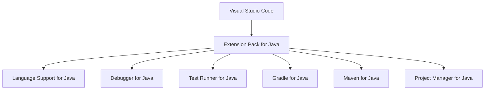

# macOS Java 개발 Extension 구성

## 1. 문서 목적

본 문서는 VS Code를 Java 개발용 IDE로 사용하기 위해 **Extension Pack for Java**를 설치하고,
MicroServer Portable 환경에서 Java Extension이 정상적으로 동작하는지 확인하는 방법을 설명한다.

현재 단계의 목표:

- Extension Pack for Java 설치
- Java 개발에 필요한 주요 Extension 구성 이해
- MicroServer Java 25 Runtime 인식 확인
- Java 관련 VS Code 명령 등록 확인

현재 단계에서는 Java / Spring Boot Project를 생성하거나 Build하지 않는다.

---

## 2. Java Extension 구성 방식

VS Code는 범용 Code Editor이므로 Java Source 분석, 자동완성, Refactoring, Debug, Test 등의 기능은
Java Extension을 통해 제공한다.

MicroServer에서는 개별 Extension을 하나씩 설치하지 않고 **Extension Pack for Java**를 표준으로 사용한다.



주요 구성:

| Extension | 역할 | MicroServer 사용 |
|---|---|---|
| Language Support for Java | Java Source 분석, 자동완성, Refactoring | 필수 |
| Debugger for Java | Java Debug | 필수 |
| Test Runner for Java | JUnit Test 실행 / Debug | 필수 |
| Gradle for Java | Gradle Project / Task 연계 | 주 Build Tool |
| Maven for Java | Maven Project 지원 | Extension Pack 기본 구성 유지 |
| Project Manager for Java | Java Project / Dependency 탐색 | 사용 |

!!! note "Extension Pack 구성"
    Extension Pack의 실제 포함 Extension은 Marketplace Update에 따라 변경될 수 있다.

    MicroServer 문서에서는 개별 Version보다 **Java 개발에 필요한 역할과 표준 Extension Pack 사용**을 기준으로 관리한다.

---

### 2.1 Portable Mode의 Extension 저장 위치

MicroServer Portable VS Code의 Extension은 다음 위치에서 관리한다.

```text
~/local-microserver/tools/vscode/
├─ Visual Studio Code.app
└─ code-portable-data/
   ├─ user-data/
   └─ extensions/
```

Java Extension Pack도 다음 Directory에 설치된다.

```text
~/local-microserver/tools/vscode/code-portable-data/extensions
```

!!! important "MicroServer Portable VS Code에서 설치"
    일반 VS Code와 MicroServer Portable VS Code가 함께 설치되어 있다면 Extension 환경이 서로 다를 수 있다.

    반드시 **MicroServer Portable VS Code를 실행한 상태에서 Extension Pack을 설치**한다.

---

## 3. Extension Pack for Java 설치

MicroServer Portable VS Code에서 Extensions 화면을 연다.

```text
Command + Shift + X
```

검색:

```text
Extension Pack for Java
```

다음을 확인한다.

```text
Publisher    : Microsoft
Extension ID : vscjava.vscode-java-pack
```

`Install`을 선택한다.

설치가 완료되면 포함된 Java Extension들도 함께 설치된다.

### CLI로 설치하는 경우

GUI 설치가 기본이며, 필요한 경우 MicroServer VS Code의 CLI를 직접 사용할 수 있다.

```bash
"$HOME/local-microserver/tools/vscode/Visual Studio Code.app/Contents/Resources/app/bin/code" \
  --install-extension vscjava.vscode-java-pack
```

!!! tip "일반 code 명령과 구분"
    일반 VS Code가 함께 설치되어 있다면 단순히 `code --install-extension ...`을 실행했을 때
    어느 VS Code CLI가 선택되는지 환경에 따라 달라질 수 있다.

    CLI 설치가 필요하면 위의 MicroServer VS Code 경로를 직접 사용하는 것이 명확하다.

---

### 3.1 Java Runtime 인식 확인

MicroServer Portable VS Code는 `start-vscode.command`가 `setup.sh`을 적용한 뒤 실행된다.

```text
start-vscode.command
        ↓
setup.sh
        ↓
JAVA_HOME
        ↓
~/local-microserver/tools/jdk/temurin-25/Contents/Home
        ↓
MicroServer Portable VS Code
```

따라서 Java Extension 설치 단계에서 JDK 경로를 `settings.json`에 다시 중복 등록하지 않는다.

Integrated Terminal을 열어 Java 환경을 확인한다.

```bash
echo "$JAVA_HOME"
java -version
javac -version
```

`JAVA_HOME`은 다음 구조를 가리켜야 한다.

```text
~/local-microserver/tools/jdk/temurin-25/Contents/Home
```

Java Version은 Java 25가 확인되어야 한다.

Java Extension 설치 후 Command Palette를 연다.

```text
Command + Shift + P
```

다음을 실행한다.

```text
Java: Configure Java Runtime
```

이 명령은 현재 단계에서 **JDK 경로를 새로 등록하기 위한 절차가 아니라 Java Extension의 Runtime 인식 상태를 확인하기 위해 사용**한다.

!!! note "아직 Java Project가 없는 경우"
    현재 Workspace에 Java Project가 없다면 다음 메시지가 나타날 수 있다.

    ```text
    There are no Java projects opened in the current workspace.
    ```

    이는 JDK를 찾지 못했다는 의미가 아니라 현재 Workspace에 Java Project가 아직 없다는 의미다.

!!! important "JDK 경로 관리 기준"
    MicroServer 전용 JDK 경로는 `setup.sh`의 `JAVA_HOME`에서 관리한다.

    `java.jdt.ls.java.home`이나 `java.configuration.runtimes`에 개발자별 JDK 절대경로를 기본값으로 중복 관리하지 않는다.

    여러 JDK를 동시에 사용하거나 Java Extension Runtime을 명시적으로 고정해야 하는 경우에만 개발자 개인 User Settings에서 별도로 구성한다.

---

## 4. 주요 Java Extension 역할

### 4.1 Language Support for Java

Extension ID:

```text
redhat.java
```

VS Code에서 Java Source를 이해하고 분석하는 핵심 Extension이다.

주요 기능:

- Java 문법 및 Type 분석
- Error / Warning 표시
- IntelliSense / 자동완성
- Import 관리
- Definition / Reference 탐색
- Rename 등 Refactoring
- Java Project 구조 인식

```text
VS Code
   ↓
Language Support for Java
   ↓
Java Language Server
   ↓
JDK / Java Source / Project Structure 분석
```

MicroServer Java 개발환경의 핵심 Extension이다.

---

### 4.2 Debugger / Test Runner

**Debugger for Java**

```text
Extension ID : vscjava.vscode-java-debug
```

Breakpoint, Step Into / Over / Out, 변수와 Call Stack 확인 등 Java Debug 기능을 제공한다.

**Test Runner for Java**

```text
Extension ID : vscjava.vscode-java-test
```

JUnit Test 탐색, Class / Method 단위 실행, Test Debug 및 결과 확인 기능을 제공한다.

현재 단계에서는 Application Class와 Test Code가 없으므로 실제 Debug / Test는 진행하지 않는다.

---

### 4.3 Gradle / Maven

MicroServer의 주 Build Tool은 **Gradle**이다.

**Gradle for Java**

```text
Extension ID : vscjava.vscode-gradle
```

주요 역할:

- Gradle Project Import
- Gradle Projects / Tasks View
- Gradle Task 실행
- Dependency 확인
- `build.gradle` 작성 지원

역할은 다음과 같이 구분한다.

```text
Gradle for Java
→ VS Code에서 Gradle Project와 Task를 다루는 IDE 기능

Gradle Wrapper
→ 실제 MicroServer Project Build 수행
```

Project 생성 이후 실제 Build는 Gradle Wrapper를 기준으로 한다.

```text
./gradlew tasks
./gradlew test
./gradlew build
./gradlew bootRun
```

**Maven for Java**

```text
Extension ID : vscjava.vscode-maven
```

Extension Pack에 함께 포함되므로 설치 상태를 유지하지만,
MicroServer의 실제 Build Tool 표준은 Gradle이다.

---

### 4.4 Project Manager for Java

Extension ID:

```text
vscjava.vscode-java-dependency
```

Java Project 구조와 Dependency를 VS Code에서 탐색할 수 있도록 지원한다.

주요 기능:

- Java Projects View
- Package / Project 탐색
- Java Dependency 확인
- Class / Package 생성 지원

실제 Project 구조 확인은 MicroServer Project 생성 이후 진행한다.

---

## 5. 설치 상태 확인

Extensions 화면에서 다음 조건으로 검색한다.

```text
@installed
```

다음 Java Extension이 설치되어 있는지 확인한다.

```text
Extension Pack for Java
Language Support for Java by Red Hat
Debugger for Java
Test Runner for Java
Gradle for Java
Maven for Java
Project Manager for Java
```

Portable Extension Directory:

```text
~/local-microserver/tools/vscode/code-portable-data/extensions
```

필요한 경우 Terminal에서도 설치 목록을 확인할 수 있다.

```bash
"$HOME/local-microserver/tools/vscode/Visual Studio Code.app/Contents/Resources/app/bin/code" \
  --list-extensions
```

---

## 6. Java 명령 확인

Command Palette를 연다.

```text
Command + Shift + P
```

검색:

```text
Java:
```

Java Extension이 정상적으로 활성화되었다면 Java 관련 명령이 표시된다.

예:

```text
Java: Configure Java Runtime
Java: Clean Java Language Server Workspace
Java: ...
```

현재 단계에서는 **Java 관련 명령이 정상적으로 등록되어 있는지 확인**한다.

설치 직후 명령이 보이지 않는다면 다음 명령으로 VS Code Window를 Reload한다.

```text
Developer: Reload Window
```

---

## 7. Portable 개발환경 Package 적용 기준

Portable VS Code에 Extension Pack을 설치하면 Extension도
`code-portable-data/extensions`에 저장된다.

```text
~/local-microserver/tools/vscode/
├─ Visual Studio Code.app
└─ code-portable-data/
   ├─ user-data/
   └─ extensions/
      ├─ redhat.java-...
      ├─ vscjava.vscode-java-debug-...
      ├─ vscjava.vscode-java-test-...
      ├─ vscjava.vscode-gradle-...
      └─ ...
```

따라서 표준 개발환경 Package에 Portable Data를 포함하면
다른 개발자가 Extension을 하나씩 다시 설치하는 작업을 줄일 수 있다.

다만 JDK Binary는 Extension에 포함되지 않으며 MicroServer에서 별도로 관리한다.

```text
~/local-microserver/tools/jdk/temurin-25/Contents/Home
```

Extension은 Update될 수 있으므로 표준 Package를 만들 때
VS Code와 주요 Extension Version을 함께 기록한다.

---

## 8. 현재 단계에서 하지 않는 작업

Java Extension 구성이 완료되어도 아직 다음 작업은 진행하지 않는다.

```text
Java Project 생성
Spring Boot Project 생성
Package / Class 생성
build.gradle / settings.gradle 구성
Gradle Build
JUnit Test 작성
Debug 실행
```

현재 단계의 목적은 **VS Code에 Java 개발 기능을 준비하고 Java 25 실행환경이 정상적으로 인식되는지 확인하는 것**이다.

---

## 9. 체크리스트

- [ ] MicroServer Portable VS Code에 Extension Pack for Java가 설치되어 있다.
- [ ] 주요 Java Extension이 모두 설치되어 있다.
- [ ] Extension이 `code-portable-data/extensions`에서 관리된다.
- [ ] Integrated Terminal에서 `JAVA_HOME`이 MicroServer Temurin 25를 가리킨다.
- [ ] `java -version`, `javac -version`에서 Java 25가 확인된다.
- [ ] User Settings에 개발자별 JDK 경로를 기본값으로 중복 등록하지 않았다.
- [ ] Command Palette에서 `Java:` 관련 명령이 표시된다.
- [ ] `Java: Configure Java Runtime`으로 Java Runtime 인식 상태를 확인했다.
- [ ] 아직 Java / Spring Boot Project를 생성하지 않았다.

---

## 10. 다음 단계

Java 개발 Extension 구성이 끝나면 Spring Boot 개발 기능을 추가한다.

```text
JDK 준비
   ↓
Gradle 준비
   ↓
VS Code 설치 / Portable 구성
   ↓
VS Code User Settings
   ↓
Extension Pack for Java        ← 현재 완료
   ↓
Spring Boot Extension Pack
   ↓
개발 지원 Extension
```

Gradle 기본 환경은 앞 단계에서 준비했으며,
실제 Project Build는 Project 생성 이후 Gradle Wrapper로 수행한다.

## 참고

- [Visual Studio Marketplace - Extension Pack for Java](https://marketplace.visualstudio.com/items?itemName=vscjava.vscode-java-pack)
- [VS Code Portable Mode](https://code.visualstudio.com/docs/setup/portable)
- [VS Code Java Extensions](https://code.visualstudio.com/docs/java/extensions)
- [Getting Started with Java in VS Code](https://code.visualstudio.com/docs/java/java-tutorial)
- [Managing Java Projects](https://code.visualstudio.com/docs/java/java-project)
- [Java build tools in VS Code](https://code.visualstudio.com/docs/java/java-build)
