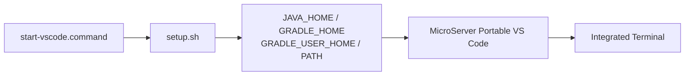

# macOS JDK 연계 및 개발환경 운영

## 1. 문서 목적

본 문서는 앞 단계에서 구성한 MicroServer Portable VS Code가
**Eclipse Temurin JDK 25와 Gradle 환경을 정상적으로 상속받아 실행되는지 최종 확인**하고,
Project 생성 전 개발환경 운영 기준을 정리한다.

JDK 설치 방법, Portable VS Code 구성, Java / Spring Boot Extension 설치 방법은 앞 문서에서 이미 다루었으므로 반복하지 않는다.

현재 단계의 목표:

- `setup.sh`과 `start-vscode.command`의 역할 확인
- Portable VS Code의 `JAVA_HOME` / Gradle 환경 확인
- Java 25 실행 상태 확인
- 시스템 Java 환경과 MicroServer Session 환경의 구분
- Project 생성 이후 Java Version 관리 방향 이해

현재는 아직 Spring Boot Project를 생성하지 않는다.

---

## 2. MicroServer Java 환경의 기준

MicroServer 개발환경에서는 Java 관련 설정을 여러 곳에 중복하지 않는다.

현재 기준은 다음과 같다.

```text
setup.sh
→ MicroServer VS Code Session의 JAVA_HOME / GRADLE_HOME 설정

start-vscode.command
→ setup.sh 적용
→ MicroServer Portable VS Code 실행

Project 생성 이후
→ build.gradle Java Toolchain
→ Project가 요구하는 Java Version 정의
```

현재 JDK:

```text
~/local-microserver/tools/jdk/temurin-25/Contents/Home
```

현재 Gradle:

```text
~/local-microserver/tools/gradle/gradle-9.7.1
```

Gradle User Home:

```text
~/local-microserver/gradle-home
```

!!! important "User Settings에 JDK 경로를 중복 관리하지 않음"
    MicroServer 표준 macOS 구성에서는 개발자 계정명이 포함된 JDK 절대경로를
    VS Code User Settings에 다시 등록하지 않는다.

    Java Version의 Project 기준은 Project 생성 이후 Gradle Java Toolchain에서 관리한다.

---

## 3. VS Code와 JDK의 관계

VS Code 자체는 Java JDK로 실행되는 Application이 아니다.

```text
VS Code
→ Electron Runtime으로 실행

Java Extension
→ Java 개발 기능 제공

JDK
→ Java Compiler / Runtime 제공

Gradle
→ Build 수행
```

따라서 Eclipse의 `eclipse.ini -vm`처럼 VS Code Application 자체에 JVM을 지정하는 방식으로 접근하지 않는다.

MicroServer에서는 VS Code를 실행하기 전에 Session 환경을 구성하여
Integrated Terminal과 개발도구가 동일한 기준을 사용하도록 한다.

---

## 4. 실행환경 적용 구조

`start-vscode.command`는 `setup.sh`을 읽은 뒤 Portable VS Code를 실행한다.



`setup.sh`의 핵심 환경은 다음과 같다.

```bash
export LOCAL_MICROSERVER="${LOCAL_MICROSERVER:-$HOME/local-microserver}"

export JAVA_HOME="$LOCAL_MICROSERVER/tools/jdk/temurin-25/Contents/Home"
export GRADLE_HOME="$LOCAL_MICROSERVER/tools/gradle/gradle-9.7.1"
export GRADLE_USER_HOME="$LOCAL_MICROSERVER/gradle-home"

export PATH="$JAVA_HOME/bin:$GRADLE_HOME/bin:$PATH"
```

환경 설정의 Source of Truth는 `setup.sh`이다.

---

## 5. Portable VS Code에서 환경 확인

MicroServer Launcher 또는 `start-vscode.command`로 VS Code를 실행한 뒤
Integrated Terminal을 새로 연다.

다음을 확인한다.

```bash
echo "$LOCAL_MICROSERVER"
echo "$JAVA_HOME"
echo "$GRADLE_HOME"
echo "$GRADLE_USER_HOME"
```

기준:

```text
LOCAL_MICROSERVER
→ ~/local-microserver

JAVA_HOME
→ ~/local-microserver/tools/jdk/temurin-25/Contents/Home

GRADLE_HOME
→ ~/local-microserver/tools/gradle/gradle-9.7.1

GRADLE_USER_HOME
→ ~/local-microserver/gradle-home
```

실제 Java와 Gradle도 확인한다.

```bash
java -version
javac -version
gradle --version
```

현재 단계에서는 다음이 확인되면 된다.

```text
Java / javac
→ Java 25

Gradle
→ Gradle 9.7.1
→ JVM이 MicroServer Temurin 25 사용
```

!!! note "Project Build는 아직 실행하지 않음"
    현재는 Project 생성 전이므로 `./gradlew build` 같은 Wrapper Build는 실행하지 않는다.

---

## 6. System JAVA_HOME과 Session JAVA_HOME

일반 macOS Terminal의 Java 환경과 MicroServer VS Code의 Java 환경은 서로 다를 수 있다.

```text
일반 Terminal
→ 사용자의 기본 Java 환경

MicroServer VS Code
→ start-vscode.command
→ setup.sh
→ MicroServer Session JAVA_HOME
→ Temurin 25
```

MicroServer는 macOS 전체의 `JAVA_HOME`을 Java 25로 영구 변경하지 않는다.

이 구조를 사용하면 다른 Java Application의 환경을 유지하면서
MicroServer 개발환경만 Java 25를 사용할 수 있다.

### Shell 초기화 파일 주의

Integrated Terminal은 시작 과정에서 `.zshrc` 등의 Shell 초기화 파일을 읽을 수 있다.

Shell 설정이 다음처럼 `JAVA_HOME`을 무조건 다시 지정하거나 비우면
MicroServer VS Code가 상속한 값을 덮어쓸 수 있다.

잘못된 예:

```bash
export JAVA_HOME=
```

MicroServer에서 전달된 값을 유지하면서 일반 Terminal의 기본값을 제공해야 한다면 다음과 같은 방식으로 구성할 수 있다.

```bash
export JAVA_HOME="${JAVA_HOME:-<일반 Terminal에서 사용할 JDK Home>}"
```

즉 이미 `JAVA_HOME`이 전달된 경우에는 그 값을 유지한다.

---

## 7. 환경 변경 후 재확인

`setup.sh`의 JDK / Gradle 경로를 변경한 경우에는
이미 실행 중인 MicroServer VS Code를 완전히 종료한 뒤 다시 시작한다.

```text
MicroServer Portable VS Code 완전 종료
        ↓
MicroServer Launcher 또는 start-vscode.command 실행
        ↓
Integrated Terminal 새로 생성
        ↓
JAVA_HOME / Java / Gradle 확인
```

기존 Integrated Terminal은 이전 환경을 유지할 수 있으므로 새 Terminal을 사용한다.

---

## 8. Project 생성 이후 Java Version 관리

현재는 Project가 없으므로 Project별 JDK 설정 파일을 만들지 않는다.

Spring Boot Project가 생성된 이후에는 **Gradle Java Toolchain**을 Project Java Version의 기준으로 사용한다.

예:

```groovy
java {
    toolchain {
        languageVersion = JavaLanguageVersion.of(25)
    }
}
```

역할을 구분하면 다음과 같다.

```text
setup.sh / JAVA_HOME
→ MicroServer 개발 Session의 Java 실행환경

build.gradle / Java Toolchain
→ Project가 요구하는 Java Version

Gradle Wrapper
→ Project가 사용할 Gradle Version
```

Project별 JDK를 VS Code User Settings에 중복해서 고정하는 것을 기본 운영 방식으로 사용하지 않는다.

여러 JDK를 동시에 사용하는 특수한 개발환경이나 Java Extension Runtime을 별도로 고정해야 하는 경우에는
필요한 설정을 개발자 환경에 한정하여 추가한다.

---

## 9. Java / Spring Extension 문제 확인

Extension 관련 메뉴나 Java 기능이 정상적으로 보이지 않을 때는 다음 순서로 확인한다.

1. Extensions 화면에서 해당 Extension이 `Enabled` 상태인지 확인한다.
2. Command Palette에서 `Developer: Reload Window`를 실행한다.
3. `View → Output`에서 관련 Extension Log를 확인한다.
4. Integrated Terminal에서 `JAVA_HOME`과 `java -version`을 다시 확인한다.

주요 Output:

```text
Language Support for Java
Spring Boot Tools
Gradle for Java / Build Server for Gradle
```

Project 생성 이후 Java Project 인식이 비정상일 때는 다음 명령을 문제 해결 수단으로 사용할 수 있다.

```text
Java: Clean Java Language Server Workspace
```

현재 Project 생성 전 단계에서는 실행할 필요가 없다.

!!! note "Java: Configure Java Runtime"
    Project가 없는 현재 단계에서는 `Java: Configure Java Runtime`을 필수 확인 절차로 사용하지 않는다.

    실제 Project가 생성된 이후 Java Project의 Runtime 인식 상태를 확인할 필요가 있을 때 사용한다.

---

## 10. 현재 단계 완료 기준

이 문서까지 완료하면 개발 PC는 다음 상태가 된다.

```text
MicroServer Portable VS Code
        +
Extension Pack for Java
        +
Spring Boot Extension Pack
        +
지원 Extension
        +
Temurin JDK 25
        +
Gradle 9.7.1
        +
MicroServer Session 환경 정상 적용
```

아직 다음 작업은 하지 않는다.

```text
Spring Boot Project 생성
build.gradle / settings.gradle 구성
Gradle Wrapper Build
Java Package / Class 작성
application.yml 작성
Application 실행 / Debug
```

---

## 11. 체크리스트

- [ ] MicroServer Portable VS Code를 전용 Launcher 또는 `start-vscode.command`로 실행했다.
- [ ] `LOCAL_MICROSERVER`가 정상적으로 적용되어 있다.
- [ ] `JAVA_HOME`이 MicroServer Temurin 25를 가리킨다.
- [ ] `GRADLE_HOME`이 Gradle 9.7.1을 가리킨다.
- [ ] `GRADLE_USER_HOME`이 MicroServer `gradle-home`을 가리킨다.
- [ ] `java -version`, `javac -version`에서 Java 25가 확인된다.
- [ ] `gradle --version`에서 Gradle 9.7.1과 Java 25가 확인된다.
- [ ] System Java 환경과 MicroServer Session Java 환경의 차이를 이해했다.
- [ ] Project Java Version은 Project 생성 이후 Gradle Java Toolchain으로 관리한다.
- [ ] 아직 Spring Boot Project를 생성하지 않았다.

---

## 12. 다음 단계

이 문서까지 완료하면 VS Code 개발환경 구성이 끝난다.

다음 단계에서는 **Spring Boot Project를 실제로 생성**한다.

```text
JDK / Gradle 준비
        ↓
VS Code Portable 구성
        ↓
Java / Spring Boot / 지원 Extension
        ↓
JDK / Gradle 실행환경 확인       ← 현재 완료
        ↓
Spring Boot Project 생성
        ↓
Project 개발환경 설정
```

**[Spring Boot Project 생성](../../03_project_creation_verification/01_project_creation/spring_boot_project_create.md)**

## 참고

- [VS Code Portable Mode](https://code.visualstudio.com/docs/setup/portable)
- [Managing Java Projects in VS Code](https://code.visualstudio.com/docs/java/java-project)
- [Java Extensions for Visual Studio Code](https://code.visualstudio.com/docs/java/extensions)
