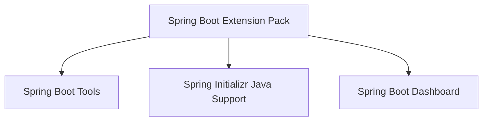
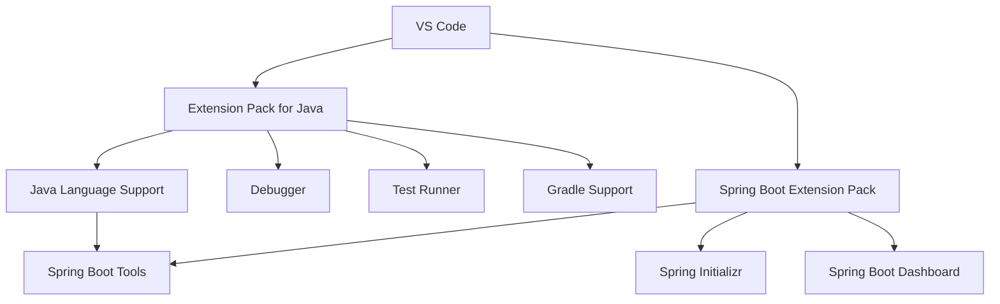

# macOS Spring Boot Extension 구성

## 1. 문서 목적

본 문서는 VS Code에 Spring Boot 개발 기능을 추가하기 위해 **Spring Boot Extension Pack**을 설치하고,
MicroServer Portable 환경에서 주요 Spring Boot Extension이 정상적으로 구성되었는지 확인하는 방법을 설명한다.

현재 단계의 목표:

- Spring Boot Extension Pack 설치
- 주요 Spring Boot Extension의 역할 이해
- Java Extension과 Spring Boot Extension의 관계 이해
- Spring 관련 VS Code 명령 등록 확인

현재 단계에서는 **Spring Boot Project를 생성하지 않는다.**

---

## 2. Spring Boot Extension 구성 방식

Spring Boot Extension은 Java 개발환경을 대체하는 것이 아니라
**Extension Pack for Java 위에 Spring Boot 개발 기능을 추가**한다.

```text
VS Code
   ↓
Extension Pack for Java
   ↓
Java 개발 기능
   ↓
Spring Boot Extension Pack
   ↓
Spring Boot 전용 개발 기능
```

Spring Boot Extension Pack의 주요 구성은 다음과 같다.



| Extension | 주요 역할 |
|---|---|
| Spring Boot Tools | Spring Boot Source / 설정 파일 지원 |
| Spring Initializr Java Support | Spring Boot Project 생성 지원 |
| Spring Boot Dashboard | Spring Boot Application 실행 / 관리 |

!!! note "사전 조건"
    다음 환경이 먼저 준비되어 있어야 한다.

    - Eclipse Temurin JDK
    - Gradle 기본 환경
    - MicroServer Portable VS Code
    - Extension Pack for Java

---

### 2.1 Portable Mode의 Extension 저장 위치

Spring Boot Extension도 Java Extension과 동일하게
MicroServer Portable VS Code의 Extension Directory에서 관리한다.

```text
~/local-microserver/tools/vscode/
├─ Visual Studio Code.app
└─ code-portable-data/
   ├─ user-data/
   └─ extensions/
      ├─ Java Extension...
      └─ Spring Boot Extension...
```

실제 Extension Directory:

```text
~/local-microserver/tools/vscode/code-portable-data/extensions
```

!!! important "MicroServer Portable VS Code에서 설치"
    일반 VS Code와 MicroServer Portable VS Code가 함께 설치되어 있다면
    Extension 환경이 서로 다를 수 있다.

    반드시 **MicroServer Portable VS Code를 실행한 상태에서 설치**한다.

---

## 3. Spring Boot Extension Pack 설치

MicroServer Portable VS Code에서 Extensions 화면을 연다.

```text
Command + Shift + X
```

검색:

```text
Spring Boot Extension Pack
```

다음을 확인한다.

```text
Publisher    : VMware
Extension ID : vmware.vscode-boot-dev-pack
```

`Install`을 선택한다.

설치가 완료되면 Spring Boot 개발에 필요한 주요 Extension도 함께 설치된다.

### CLI로 설치하는 경우

GUI 설치가 기본이며, 필요한 경우 MicroServer VS Code의 CLI를 직접 사용할 수 있다.

```bash
"$HOME/local-microserver/tools/vscode/Visual Studio Code.app/Contents/Resources/app/bin/code" \
  --install-extension vmware.vscode-boot-dev-pack
```

!!! tip "일반 code 명령과 구분"
    일반 VS Code가 함께 설치되어 있다면 단순히 `code --install-extension ...`을 실행했을 때
    어느 VS Code CLI가 선택되는지 환경에 따라 달라질 수 있다.

    CLI 설치가 필요하면 MicroServer VS Code의 CLI 경로를 직접 사용하는 것이 명확하다.

---

## 4. 주요 Spring Boot Extension

### 4.1 Spring Boot Tools

Extension ID:

```text
vmware.vscode-spring-boot
```

Java Language Support 위에서 동작하며
Spring Framework / Spring Boot에 특화된 개발 기능을 제공한다.

주요 기능:

- Spring 관련 Source 분석 및 Navigation
- Spring 관련 자동완성
- Spring Boot Configuration Property 지원
- Spring 관련 Validation
- Spring Boot 관련 정보 표시
- Spring Code Template 지원

관계:

```text
Language Support for Java
        ↓
Java Source 분석
        ↓
Spring Boot Tools
        ↓
Spring Framework / Spring Boot 전용 지원
```

Spring Boot 설정 파일도 지원한다.

```text
application.properties
application.yml
application-*.properties
application-*.yml
```

Project Dependency와 Spring Boot Metadata가 구성된 이후에는
Property 자동완성, 설명, 잘못된 Key 확인 등의 기능을 사용할 수 있다.

현재는 아직 Project가 없으므로 설정 파일을 생성하거나 검증하지 않는다.

---

### 4.2 Spring Initializr Java Support

Extension ID:

```text
vscjava.vscode-spring-initializr
```

Spring Initializr를 VS Code에서 사용할 수 있도록 지원한다.

주요 기능:

- Spring Boot Project 생성
- Spring Boot Version 선택
- Java Version 선택
- Gradle / Maven 선택
- Group / Artifact 설정
- Dependency 선택

Command Palette에서는 다음과 같은 Spring Initializr 명령을 사용할 수 있다.

```text
Spring Initializr
```

!!! important "현재 단계에서는 Project를 생성하지 않음"
    Spring Initializr Extension은 설치만 한다.

    실제 Spring Boot Project 생성은 VS Code 개발환경 구성이 완료된 이후
    **Spring Boot Project 생성 가이드**에서 진행한다.

---

### 4.3 Spring Boot Dashboard

Extension ID:

```text
vscjava.vscode-spring-boot-dashboard
```

Workspace에 포함된 Spring Boot Application을 한 곳에서 확인하고 관리할 수 있도록 지원한다.

Project 생성 이후 다음 기능을 사용한다.

- Spring Boot Application 목록 확인
- Application 실행 / 중지
- Application 상태 확인
- Debug 실행

현재는 Spring Boot Project가 없으므로 Dashboard에 Application이 표시되지 않는 것이 정상이다.

```text
현재
Spring Boot Dashboard
→ Application 없음

Project 생성 이후
Spring Boot Dashboard
→ MicroServer Application 표시
```

---

## 5. Java Extension과 Spring Boot Extension의 관계

두 Extension Pack은 중복 설치가 아니라 담당 영역이 다르다.



역할을 구분하면 다음과 같다.

```text
Extension Pack for Java
→ Java 언어 / Java Project 개발 기반

Spring Boot Extension Pack
→ Java 개발환경 위에 Spring Boot 전용 기능 추가
```

MicroServer에서는 두 Extension Pack을 함께 사용한다.

---

## 6. 설치 상태 및 명령 확인

### 6.1 설치 상태 확인

Extensions 화면에서 다음 조건으로 검색한다.

```text
@installed
```

다음 Extension이 설치되어 있는지 확인한다.

```text
Spring Boot Extension Pack
Spring Boot Tools
Spring Initializr Java Support
Spring Boot Dashboard
```

주요 Extension ID:

```text
vmware.vscode-boot-dev-pack
vmware.vscode-spring-boot
vscjava.vscode-spring-initializr
vscjava.vscode-spring-boot-dashboard
```

Extension은 다음 위치에서 관리된다.

```text
~/local-microserver/tools/vscode/code-portable-data/extensions
```

필요한 경우 Terminal에서도 설치 목록을 확인할 수 있다.

```bash
"$HOME/local-microserver/tools/vscode/Visual Studio Code.app/Contents/Resources/app/bin/code" \
  --list-extensions
```

---

### 6.2 Spring 관련 명령 확인

Command Palette를 연다.

```text
Command + Shift + P
```

검색:

```text
Spring
```

또는:

```text
Spring Boot
```

Spring 관련 명령이 표시되면 Extension이 정상적으로 등록된 것이다.

현재 단계에서는 **명령이 등록되어 있는지만 확인**하고
Spring Initializr를 실행하여 Project를 생성하지 않는다.

설치 직후 Spring 관련 명령이 보이지 않는다면 다음 명령으로 VS Code Window를 Reload한다.

```text
Developer: Reload Window
```

---

## 7. Portable 개발환경 Package 적용 기준

Spring Boot Extension Pack도 Portable Data의 `extensions` Directory에 저장된다.

```text
~/local-microserver/tools/vscode/
├─ Visual Studio Code.app
└─ code-portable-data/
   ├─ user-data/
   └─ extensions/
      ├─ Java Extension...
      ├─ Spring Boot Tools...
      ├─ Spring Initializr...
      └─ Spring Boot Dashboard...
```

따라서 Java / Spring Boot Extension이 구성된 Portable Data를
표준 개발환경 Package에 포함하면 개발자별 Extension 설치 작업을 줄일 수 있다.

Extension은 Update될 수 있으므로 표준 Package를 만들 때
VS Code와 주요 Extension Version을 함께 기록한다.

---

## 8. 현재 단계에서 하지 않는 작업

Spring Boot Extension 구성이 완료되어도 아직 다음 작업은 진행하지 않는다.

```text
Spring Initializr 실행
Spring Boot Project 생성
build.gradle / settings.gradle 구성
Spring Dependency 추가
Application Class 작성
application.yml 작성
Spring Boot 실행 / Debug
Actuator 설정
```

현재 단계의 목적은 **VS Code에 Spring Boot 개발 기능을 준비하는 것**이다.

실제 Project 생성과 Spring Boot 기능 검증은 이후 Project 생성 단계에서 진행한다.

---

## 9. 체크리스트

- [ ] Extension Pack for Java가 먼저 설치되어 있다.
- [ ] MicroServer Portable VS Code에 Spring Boot Extension Pack이 설치되어 있다.
- [ ] Spring Boot Tools가 설치되어 있다.
- [ ] Spring Initializr Java Support가 설치되어 있다.
- [ ] Spring Boot Dashboard가 설치되어 있다.
- [ ] Extension이 `code-portable-data/extensions`에서 관리된다.
- [ ] Command Palette에서 Spring 관련 명령이 표시된다.
- [ ] Dashboard에 Application이 없는 것이 현재 단계에서는 정상임을 이해했다.
- [ ] 아직 Spring Initializr를 실행하지 않았다.
- [ ] 아직 Spring Boot Project를 생성하지 않았다.

---

## 10. 다음 단계

다음 단계에서는 Java / Spring Boot 개발 과정에서 사용할
지원 Extension과 VS Code Profile을 구성한다.

```text
JDK 준비
   ↓
Gradle 준비
   ↓
VS Code 설치 / Portable 구성
   ↓
VS Code User Settings
   ↓
Extension Pack for Java
   ↓
Spring Boot Extension Pack        ← 현재 완료
   ↓
개발 지원 Extension / Profile
   ↓
JDK 연계 및 환경 운영 확인
   ↓
Spring Boot Project 생성
```

Spring Initializr를 이용한 실제 Project 생성은 이후 Project 생성 가이드에서 진행한다.

**[Spring Boot Project 생성](../../03_project_creation_verification/01_project_creation/spring_boot_project_create.md)**

## 참고

- [VS Code Portable Mode](https://code.visualstudio.com/docs/setup/portable)
- [Spring Boot in Visual Studio Code](https://code.visualstudio.com/docs/java/java-spring-boot)
- [Java Extensions for Visual Studio Code](https://code.visualstudio.com/docs/java/extensions)
- [Spring Boot Extension Pack](https://marketplace.visualstudio.com/items?itemName=vmware.vscode-boot-dev-pack)
