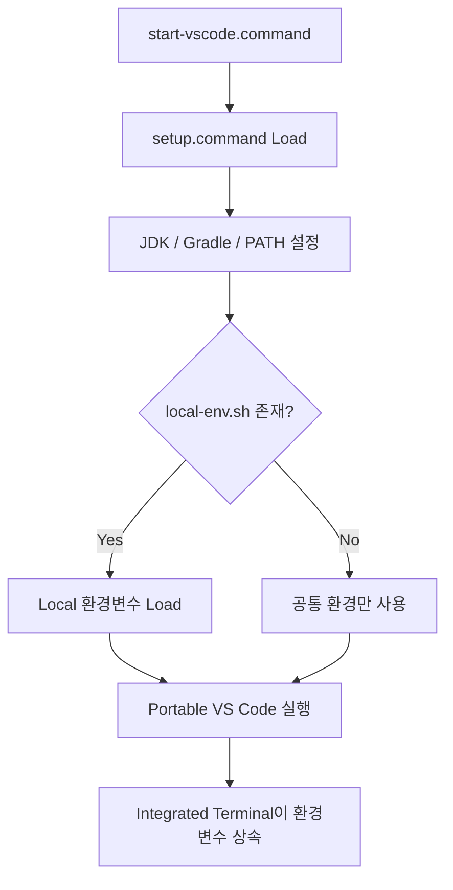

# macOS VS Code 설치

## 1. macOS 표준 설치 방식 - Application + Portable Mode

Apple Silicon용 Visual Studio Code Application을 사용한다.

```text
~/local-microserver/tools/vscode/
├─ Visual Studio Code.app
└─ code-portable-data/
```

macOS Portable Mode에서는 `code-portable-data`가 `Visual Studio Code.app`의 **형제 Directory**여야 한다.

기존 VS Code 환경을 Portable Mode로 옮길 경우 User Data와 Extension을 각각
`code-portable-data/user-data`, `code-portable-data/extensions`로 복사할 수 있다.

Portable Mode가 동작하지 않는 경우 다운로드된 App의 quarantine 속성이 원인일 수 있다.
회사 장비에서는 조직 보안정책을 먼저 확인한다.


## 1. 문서 목적

본 문서는 MicroServer 개발환경에서 사용할 Visual Studio Code를 설치하고,
`~/local-microserver` 하위에서 독립적으로 관리할 수 있도록 Portable 환경을 구성하는 절차를 설명한다.

설치형 프로그램처럼 시스템 전역에 설치하지 않고 다음 위치에 압축 해제하여 사용한다.

```text
~/local-microserver/tools/vscode
```

현재 MicroServer 개발환경의 VS Code 기준 Version은 다음과 같다.

```text
VS Code : 1.134.0
```

이 문서에서는 다음 작업에 집중한다.

- `~/local-microserver/tools/vscode`에 압축 해제
- `data` Directory 생성 및 Portable Mode 활성화
- VS Code 실행 및 Version 확인
- `start-vscode.command`을 이용한 독립 실행
- 개발자별 Local Secret을 `local-env.sh`로 분리
- Portable VS Code Update
- 다른 개발자에게 전달할 배포용 Portable 환경 구성
- macOS에서의 VS Code 설치 및 Portable Mode 참고

Editor의 Encoding, Auto Save, Format On Save, User Settings / Workspace Settings 등은
다음 문서인 **VS Code 기본 설정 가이드**에서 별도로 다룬다.

```bash
# MicroServer Local Environment Example
export ORACLE_PWD='<strong-local-password>'
```

개발자는 최초 1회 다음과 같이 파일을 복사한다.

```text
local-env.example.sh
        ↓ 복사
local-env.sh
```

실제 `local-env.sh` 예:

```bash
# Developer Local Environment

$env:ORACLE_PWD = '<개발자-개인-로컬-비밀번호>'
```

!!! danger "`local-env.sh`은 배포하지 않음"
    실제 Password, Token 등 개발자별 Secret이 들어갈 수 있으므로
    `~/local-microserver` 개발환경 Package를 다른 개발자에게 전달할 때
    현재 개발자의 `local-env.sh`은 제외한다.

    이 파일은 실제 Source Git Repository 밖에 있으므로
    프로젝트 `.gitignore`로 보호하는 파일이 아니다.

### 2.7.2 `setup.command`

`setup.command`은 현재 Terminal Session에 MicroServer 개발환경을 적용하는 보조 Script이다.

주요 설정:

```text
LOCAL_MICROSERVER
JAVA_HOME
GRADLE_HOME
GRADLE_USER_HOME
PATH
ORACLE_PWD 등 Local 환경변수
```

일반 Terminal에서 직접 Build 또는 환경 검증을 할 때는
**Dot Sourcing** 방식으로 실행한다.

```bash
. ~/local-microserver/env/setup.command
```

앞의 `.`은 Script가 설정한 환경변수를 현재 Terminal Session에 적용하기 위한 것이다.

### 2.7.3 `start-vscode.command`

일상적인 VS Code 개발에서는 `setup.command`을 직접 실행하기보다
`start-vscode.command`이 환경을 준비한 뒤 Portable VS Code를 실행한다.

동작 흐름:



개념적인 실행 Script:

```bash
$setupScript = Join-Path $PSScriptRoot 'setup.command'

. $setupScript -Quiet

$codeExe = Join-Path $env:LOCAL_MICROSERVER 'tools\vscode\Visual Studio Code.app'

Start-Process -FilePath $codeExe
```

### 2.7.4 MicroServer 실행 Icon

바로가기에서 사용할 Icon은 개발환경 Package에 다음 위치로 제공한다.

```text
~/local-microserver/icons/microserver.ico
```

Icon 파일은 개발환경 Package 안에 계속 보관한다.

바탕화면에 `.ico` 파일 자체를 복사하는 것이 아니라
**이 Icon을 참조하는 macOS Desktop 실행 Shortcut(`.lnk`)를 바탕화면으로 복사해서 사용**한다.

### 2.7.5 VS Code 실행 바로가기 생성

다음 Script를 한 번 실행하면:

```text
~/local-microserver/env/create-vscode-shortcut.command
```

다음 바로가기가 생성된다.

```text
~/Desktop/MicroServer VS Code.command
```

Terminal:

```bash
& ~/local-microserver/env/create-vscode-shortcut.command
```

생성되는 바로가기의 역할:

```text
MicroServer VS Code.lnk 더블클릭
        ↓
Terminal 실행
        ↓
start-vscode.command
        ↓
setup.command
        ↓
local-env.sh
        ↓
Portable VS Code
```

바로가기는 다음 Icon을 사용한다.

```text
~/local-microserver/icons/microserver.ico
```

### 2.7.6 바탕화면에서 사용하는 방법


```text
~/Desktop/MicroServer VS Code.command
```


```text
~/Desktop/MicroServer VS Code.command
        ↓ 복사
        ↓
더블클릭
        ↓
MicroServer 개발환경이 적용된 VS Code 실행
```

!!! tip "바로가기 원본은 MicroServer Root에 유지"
    개발환경 Package에는 `~/Desktop/MicroServer VS Code.command`를 기준 바로가기로 유지한다.

    개발자는 필요할 경우 해당 바로가기를 바탕화면으로 복사하여 사용한다.

    Shortcut의 Target과 Icon은 `~/local-microserver` 내부 경로를 참조하므로
    개발환경을 표준 경로에 배치하는 것이 중요하다.

!!! note "Terminal Script 실행이 차단되는 경우"
    회사 보안정책이나 macOS Gatekeeper 정책에 의해 `.command` Script 또는 Application 실행이 제한될 수 있다.

    본 가이드에서는 보안정책 변경이나 실행정책 우회 명령을 별도로 안내하지 않는다.

    **Script 실행이 차단되거나 권한 관련 경고가 발생하면 개발환경을 배포하거나 운영하는 팀에 문의한다.**

### 2.7.7 환경변수 확인

바로가기를 통해 VS Code를 실행한 뒤 Integrated Terminal에서 설정 여부를 확인할 수 있다.

```bash
$env:JAVA_HOME
$env:GRADLE_HOME
```

Secret 값은 직접 출력하지 않고 설정 여부만 확인한다.

```bash
if ($env:ORACLE_PWD) {
    "ORACLE_PWD is set"
} else {
    "ORACLE_PWD is not set"
}
```

!!! warning "Local 환경변수 변경 후 VS Code 재시작"
    `local-env.sh`을 수정한 경우 기존 Portable VS Code를 완전히 종료하고
    `MicroServer VS Code` 바로가기로 다시 실행한다.


### 2.9 Portable VS Code Update


Update할 때는 다음 순서로 관리한다.

```text
새 VS Code ZIP 다운로드
        ↓
새 Directory에 압축 해제
        ↓
기존 Portable VS Code 종료
        ↓
기존 code-portable-data Directory를 새 VS Code Directory로 이동/복사
        ↓
새 Visual Studio Code.app 실행 및 검증
        ↓
이전 Version 정리
```

`data` Directory를 새 VS Code 설치 Directory로 옮기면
기존 Settings와 Extension을 이어서 사용할 수 있다.

!!! warning "실행파일 위에 무작정 덮어쓰지 않음"
    Update 시에는 새 Version을 별도 Directory에서 먼저 검증한 뒤
    `data`를 이동하는 방식이 문제 발생 시 이전 Version으로 되돌리기 쉽다.

### 2.10 다른 개발자에게 전달할 Portable 환경 만들기

MicroServer 개발환경 Package는 다음처럼 구성할 수 있다.

```text
~/local-microserver                       ← Git Repository 아님
│
├─ tools
│  ├─ jdk
│  │  └─ temurin-25
│  ├─ gradle
│  │  └─ gradle-9.7.1
│  └─ vscode
│     ├─ Visual Studio Code.app
│     └─ data
│        ├─ user-data
│        └─ extensions
│
├─ gradle-home
│
├─ workspace
│  ├─ microserver.code-workspace
│  ├─ microserver                         ← Git Repository
│  │  └─ .git
│  └─ microserver-docs                    ← 별도 Git Repository
│     └─ .git
│
├─ env
│  ├─ setup.command
│  ├─ start-vscode.command
│  ├─ create-vscode-shortcut.command
│  ├─ local-env.example.sh               ← 배포 포함
│  └─ local-env.sh                       ← 배포 제외
│
├─ icons
│  └─ microserver.ico
│
└─ MicroServer VS Code.lnk
```

이 구조의 장점은 다음과 같다.

- 개발도구의 위치를 한 Root에서 관리할 수 있다.
- VS Code Extension을 개발자마다 다시 설치하는 작업을 줄일 수 있다.
- 공통 VS Code Settings를 미리 적용할 수 있다.
- 개발환경 Package를 압축하여 동일 Root에 풀어 재사용하기 쉽다.
- 실제 Source Repository는 `workspace` 아래에서 개별 Git Repository로 관리할 수 있다.

하지만 **실제 개인 개발에 사용한 `data` 폴더를 그대로 다른 개발자에게 전달하는 것은 피한다.**

배포용 Portable VS Code는 별도로 깨끗하게 구성한다.

권장 절차:

```text
새 VS Code ZIP 압축 해제
        ↓
빈 code-portable-data Directory 생성
        ↓
프로젝트 표준 Extension만 설치
        ↓
공통 Settings만 설정
        ↓
계정 로그인 / Settings Sync 사용하지 않음
        ↓
개인 Repository / Workspace 열지 않음
        ↓
VS Code 완전 종료
        ↓
배포 Package 생성
```

!!! important "Git 관리 범위와 개발환경 Package 범위는 다름"
    `~/local-microserver` 자체는 Git Repository가 아니다.

    따라서 `~/local-microserver/.gitignore`는 필요하지 않다.

    `.gitignore`는 `workspace\microserver` 같은 실제 Repository 내부에서 관리한다.

    반면 `local-env.sh`는 Git과 관계없이 ZIP에 포함될 수 있으므로
    개발환경 배포 Package에서 별도로 제외한다.

!!! important "계정 / Credential / 개인 상태를 Package에 포함하지 않음"
    Portable `data`는 Settings와 Extension뿐 아니라 VS Code의 여러 User Data를 함께 관리한다.

    따라서 개인이 장기간 사용한 Portable 환경을 정리해서 배포하기보다
    **배포용 Instance를 처음부터 별도로 만드는 방식**이 안전하고 관리하기 쉽다.

### 2.11 Portable Mode의 범위

Portable VS Code Directory를 복사한다고 해서 다음 외부 요소까지 모두 자동으로 복제되는 것은 아니다.

```text
Git 설치
Docker Desktop / Docker Engine
OS Credential Store
외부 CLI
네트워크 / Proxy
인증서
사내 보안 Agent
```

MicroServer Package에서 JDK와 Gradle은 별도로 함께 제공할 수 있지만,
OS 설치나 권한이 필요한 도구는 각 개발 장비에서 별도 구성이 필요할 수 있다.

이 구분을 이해하면 Portable Mode를 "PC 전체 개발환경을 가상화하는 기능"으로 오해하지 않을 수 있다.

## 3. macOS 설치

macOS에서도 VS Code Portable Mode를 사용할 수 있다.

macOS에서는 기존 개발환경 정책을 유지하면서 Portable Mode 사용 방법을 참고한다.

### 3.1 애플리케이션 준비

macOS용 Visual Studio Code는 공식 Download 페이지에서 다운로드한다.

!!! tip "macOS VS Code 다운로드"
    **[Visual Studio Code 공식 Download](https://code.visualstudio.com/Download)**

    macOS 영역에서 개발 장비에 맞는 항목을 선택한다.

    ```text
    Mac
    ├─ Intel chip
    ├─ Apple silicon
    └─ Universal
    ```

    Apple Silicon Mac은 `Apple silicon`,
    Intel Mac은 `Intel chip`을 선택한다.

    macOS Portable Mode는 Application 기반으로 구성하며
    일반 VS Code Application과 `code-portable-data` Directory를 사용하는 방식이다.

일반적인 Application 위치:

```text
/Applications/Visual Studio Code.app
```

### 3.2 macOS Portable Mode

macOS에서는 Windows처럼 Application 내부에 `data`를 만드는 방식이 아니라,
**`Visual Studio Code.app`과 같은 위치에 `code-portable-data` Directory를 둔다.**

```text
Visual Studio Code.app
code-portable-data/
```

Portable User Data와 Extension은 이 Directory 아래에서 관리된다.

!!! note "macOS Portable Directory 이름"
    Stable VS Code는 `code-portable-data`를 사용한다.

    VS Code Insiders는 별도 Portable Directory 이름을 사용하므로
    Stable과 혼동하지 않는다.

### 3.3 quarantine으로 Portable Mode가 동작하지 않는 경우

다운로드한 macOS Application이 quarantine 상태이면 Portable Mode가 정상 동작하지 않을 수 있다.

필요한 경우 공식 가이드에 따라 quarantine Attribute를 확인하고 제거한다.

```bash
xattr -dr com.apple.quarantine "Visual Studio Code.app"
```

보안 정책이 적용된 회사 장비에서는 임의로 실행하기 전에
조직의 macOS 보안 정책을 우선 확인한다.

### 3.4 `code` 명령 PATH 등록

VS Code에서 Command Palette를 연다.

```text
Command + Shift + P
```

다음 명령을 검색한다.

```text
Shell Command: Install 'code' command in PATH
```

실행 후 새 Terminal에서 확인한다.

```bash
code --version
```

### 3.5 macOS Update

macOS Portable Mode는 일반 설치 방식과 Update 운영 방식이 다르다.

macOS Application은 일반적인 VS Code Update 방식을 사용할 수 있으며
`code-portable-data`는 Application과 분리된 Portable User Data로 유지할 수 있다.

!!! note "Windows와 macOS 표준 경로는 구분"
    현재 MicroServer의 `~/local-microserver` Package 구조는 macOS 개발환경 기준이다.

    macOS에서 전체 개발도구 Root를 별도로 표준화할 경우
    JDK / Gradle / VS Code Portable Directory 구조도 함께 조정한다.

## 4. 체크리스트

### 4.2 배포 환경

- [ ] 개인이 장기간 사용한 `data` Directory를 그대로 배포하지 않는다.
- [ ] 배포용 Portable VS Code는 별도 Instance로 구성한다.
- [ ] 배포용 Instance에서는 개인 계정 로그인과 Settings Sync를 사용하지 않는다.
- [ ] 프로젝트 표준 Extension과 공통 Settings만 포함한다.
- [ ] JDK / Gradle / Git / Docker 등 VS Code 외부 도구의 관리 범위를 구분한다.
- [ ] 실제 `local-env.sh`는 개발환경 배포 Package에서 제외한다.
- [ ] `.gitignore`는 `workspace` 아래 실제 Repository에서 관리한다.
- [ ] `icons\microserver.ico`가 준비되어 있다.
- [ ] `MicroServer VS Code.lnk`를 생성하고 필요한 경우 바탕화면에 복사했다.
- [ ] Terminal Script 실행이 보안정책으로 차단되면 개발환경 배포/운영 팀에 문의한다.

## 5. 다음 단계

VS Code 설치와 Portable Mode 구성이 완료되면 Editor의 기본 설정을 구성한다.


다음 문서:

**[VS Code 기본 설정](vscode_basic_setup.md)**

기본 설정 문서에서는 주요 화면, Command Palette, Integrated Terminal,
Encoding, Auto Save, Format On Save, User Settings와 Workspace Settings 등을 구성한다.

## 6. 공식 참고

- [VS Code 공식 Download](https://code.visualstudio.com/Download)
- [VS Code Portable Mode](https://code.visualstudio.com/docs/setup/portable)
- [VS Code Command Line Interface](https://code.visualstudio.com/docs/configure/command-line)
