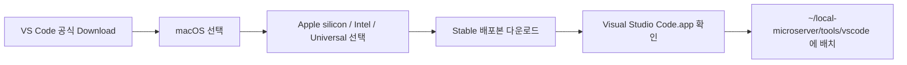

# macOS VS Code 설치

## 1. 문서 목적

본 문서는 MicroServer 개발환경에서 사용할 Visual Studio Code macOS 배포본을 다운로드하고,
`~/local-microserver/tools/vscode`에 설치하는 절차를 설명한다.

현재 MicroServer macOS 표준 환경에서는 **VS Code Stable macOS Application 배포본**을 사용하며,
일반적인 `/Applications` 시스템 설치 방식 대신 다음 위치에 Application을 배치하여 사용한다.

```text
~/local-microserver/tools/vscode
```

현재 MicroServer 개발환경의 VS Code 기준 Version은 다음과 같다.

```text
VS Code : 1.134.0
```

이 문서에서는 다음 작업에 집중한다.

- macOS용 VS Code Stable 배포본 다운로드
- Mac Architecture 확인
- `~/local-microserver/tools/vscode` Directory 준비
- `Visual Studio Code.app` 배치
- Application 및 CLI 위치 확인
- VS Code 최초 실행 및 Version 확인

`code-portable-data` Directory 생성과 Portable Mode 활성화, 실행 Script,
Portable Update, 다른 개발자에게 전달할 Package 구성은 다음 **VS Code Portable 설정** 문서에서 수행한다.

Editor의 Encoding, Auto Save, Format On Save와 Settings 적용 범위는
그 다음 **VS Code 기본 설정** 문서에서 다룬다.

---

## 2. macOS VS Code 설치

MicroServer의 macOS 표준 VS Code 환경은 Microsoft가 제공하는 **macOS Application 배포본**을 사용한다.

일반적인 개인 개발환경에서는 `.dmg`를 열고 `Visual Studio Code.app`을 `/Applications`에 복사하는 방식이 일반적이지만,
MicroServer는 JDK, Gradle, VS Code와 주요 설정을 `~/local-microserver` 아래에서
독립적으로 관리하고 다른 개발자에게 전달할 수 있는 구조를 지향한다.

### 2.1 macOS 표준 설치 방식

```text
배포 형식     : macOS Application
설치 방식     : Application 배치
VS Code 위치  : ~/local-microserver/tools/vscode
Application   : Visual Studio Code.app
Portable Mode : 사용
Channel       : Stable
```

!!! info "왜 /Applications가 아닌 local-microserver 아래에 배치하는가?"
    MicroServer 개발환경은 JDK, Gradle, VS Code를 하나의 Root Directory 아래에서 관리하는 것을 기본 원칙으로 한다.

    ```text
    ~/local-microserver
    └─ tools
       ├─ jdk
       ├─ gradle
       └─ vscode
    ```

    macOS VS Code는 일반 Application 배포본에서도 Portable Mode를 지원한다.

---

### 2.2 macOS VS Code 다운로드

Visual Studio Code 공식 Download 페이지에서 macOS용 Stable 배포본을 다운로드한다.

!!! tip "공식 Download 페이지"
    **[Visual Studio Code 공식 Download](https://code.visualstudio.com/Download)**

    macOS 영역에서는 Architecture에 따라 다음 배포본을 선택할 수 있다.

    ```text
    macOS
    ├─ Universal
    ├─ Intel chip
    └─ Apple silicon
    ```

    Apple Silicon Mac에서는 **Apple silicon(Arm64)** 또는 **Universal** 배포본을 사용할 수 있다.

#### 2.2.1 Mac Architecture 확인

Terminal:

```bash
uname -m
```

Apple Silicon을 Native로 실행 중이면 일반적으로:

```text
arm64
```

Intel Mac 또는 Rosetta 환경에서는:

```text
x86_64
```

처럼 표시될 수 있다.

!!! note "MicroServer macOS 기본 문서는 Apple Silicon 기준"
    현재 MicroServer macOS 개발환경은 Apple Silicon Mac을 기본 기준으로 작성한다.

    따라서 특별한 이유가 없다면 **Apple silicon Stable 배포본**을 우선 사용한다.

    `uname -m` 결과가 `x86_64`라면 Terminal 자체가 Rosetta로 실행되고 있는지도 함께 확인한다.

#### 2.2.2 Download 페이지에서 macOS 선택

공식 Download 페이지:

```text
https://code.visualstudio.com/Download
```

Apple Silicon 기준:

```text
Operating System : macOS
Architecture     : Apple silicon (Arm64)
Channel          : Stable
```

Intel Mac:

```text
Operating System : macOS
Architecture     : Intel chip (x64)
Channel          : Stable
```

두 Architecture를 모두 지원해야 한다면 **Universal** 배포본을 사용할 수 있다.

#### 2.2.3 최신 Stable 직접 다운로드

Download 페이지를 거치지 않고 최신 Stable macOS 배포본을 바로 받을 수도 있다.

**Apple Silicon (Arm64):**

**[VS Code macOS Apple Silicon - Latest Stable 직접 다운로드](https://update.code.visualstudio.com/latest/darwin-arm64/stable)**

**Intel x64:**

**[VS Code macOS Intel x64 - Latest Stable 직접 다운로드](https://update.code.visualstudio.com/latest/darwin/stable)**

**Universal:**

**[VS Code macOS Universal - Latest Stable 직접 다운로드](https://update.code.visualstudio.com/latest/darwin-universal/stable)**

!!! info "`latest` 주소의 의미"
    위 직접 다운로드 주소의 `latest`는 **현재 제공되는 최신 Stable Version**을 의미한다.

    새로운 Stable Version이 Release되면 같은 URL에서도 새 Version이 다운로드될 수 있다.

    따라서 최초 개발환경 구성에는 편리하지만,
    팀 배포 Package를 운영할 때는 실제 검증한 VS Code Version을 별도로 기록한다.

#### 2.2.4 다운로드 파일 확인

macOS에서는 Browser와 배포 방식에 따라 `.dmg` 또는 압축된 Application 형태로 받을 수 있다.

핵심 확인 대상은 최종적으로 다음 Application이 존재하는지 여부다.

```text
Visual Studio Code.app
```

!!! warning "일반 /Applications 설치와 혼동하지 않음"
    Microsoft 공식 일반 설치 절차는 `.dmg`를 열고 `Visual Studio Code.app`을 `/Applications`로 Drag & Drop하는 방식이다.

    이 방식도 정상적인 macOS 설치 방법이지만,
    **MicroServer Portable 개발환경 표준에서는 Application을 `~/local-microserver/tools/vscode`에 배치한다.**

#### 2.2.5 다운로드 후 다음 작업

```text
~/local-microserver/tools/vscode
```

진행 흐름:



---

### 2.3 VS Code Directory 준비

```bash
mkdir -p "$HOME/local-microserver/tools/vscode"
```

확인:

```bash
ls -ld "$HOME/local-microserver/tools/vscode"
```

---

### 2.4 Visual Studio Code.app 배치

다운로드한 `.dmg`를 열거나 압축을 해제하여 `Visual Studio Code.app`을 확인한다.

Finder에서 Application을 다음 위치로 복사한다.

```text
~/local-microserver/tools/vscode/Visual Studio Code.app
```

정상 구조:

```text
~/local-microserver/tools/vscode
└─ Visual Studio Code.app
```

Terminal 확인:

```bash
ls -ld "$HOME/local-microserver/tools/vscode/Visual Studio Code.app"
```

Application 내부 CLI 확인:

```bash
ls -l \
  "$HOME/local-microserver/tools/vscode/Visual Studio Code.app/Contents/Resources/app/bin/code"
```

!!! note "현재 단계에서는 code-portable-data를 생성하지 않음"
    다음 **VS Code Portable 설정** 단계에서 아래 구조를 만든다.

    ```text
    ~/local-microserver/tools/vscode
    ├─ Visual Studio Code.app
    └─ code-portable-data
    ```

---

## 3. 설치 확인

### 3.1 Application 존재 확인

```bash
test -d "$HOME/local-microserver/tools/vscode/Visual Studio Code.app" \
  && echo "VS Code Application OK"
```

CLI 확인:

```bash
test -x \
  "$HOME/local-microserver/tools/vscode/Visual Studio Code.app/Contents/Resources/app/bin/code" \
  && echo "VS Code CLI OK"
```

### 3.2 VS Code 최초 실행

```bash
open "$HOME/local-microserver/tools/vscode/Visual Studio Code.app"
```

### 3.3 Version 확인

```bash
"$HOME/local-microserver/tools/vscode/Visual Studio Code.app/Contents/Resources/app/bin/code" \
  --version
```

Version과 Architecture를 확인한다.

### 3.4 `code` 명령은 아직 필수 아님

Microsoft의 일반 macOS 가이드에서는 Command Palette에서 다음 명령으로 `code`를 PATH에 추가할 수 있다.

```text
Shell Command: Install 'code' command in PATH
```

하지만 MicroServer는 시스템 전역 설정을 최소화하고 `~/local-microserver` 아래의 개발환경을 명시적으로 운영하는 것을 우선한다.

---

## 4. macOS 보안 / quarantine 참고

Portable Mode가 정상 동작하지 않는 경우 확인한다.

```bash
xattr \
  "$HOME/local-microserver/tools/vscode/Visual Studio Code.app"
```

공식 배포처에서 받은 VS Code임을 확인한 후 필요한 경우:

```bash
xattr -dr com.apple.quarantine \
  "$HOME/local-microserver/tools/vscode/Visual Studio Code.app"
```

!!! warning "무조건 제거하지 않음"
    quarantine 제거는 Portable Mode가 정상 동작하지 않는 경우에 확인 후 수행한다.

---

## 5. 체크리스트

- [ ] VS Code 공식 Download 페이지에서 macOS Stable 배포본을 확인했다.
- [ ] Mac Architecture를 확인했다.
- [ ] Apple Silicon 환경에서는 Apple silicon(Arm64) 또는 Universal 배포본을 선택했다.
- [ ] `~/local-microserver/tools/vscode` Directory를 준비했다.
- [ ] `Visual Studio Code.app`을 표준 Directory에 배치했다.
- [ ] Application 내부 `code` CLI가 존재한다.
- [ ] VS Code가 정상 실행된다.
- [ ] Version을 확인했다.
- [ ] `code-portable-data` 구성은 다음 단계에서 수행한다.

---

## 6. 다음 단계


**[VS Code Portable 설정](vscode_portable_setup.md)**

---

## 7. 공식 참고

- [Visual Studio Code 공식 Download](https://code.visualstudio.com/Download)
- [Installing Visual Studio Code on macOS](https://code.visualstudio.com/docs/setup/mac)
- [VS Code Portable Mode](https://code.visualstudio.com/docs/setup/portable)
