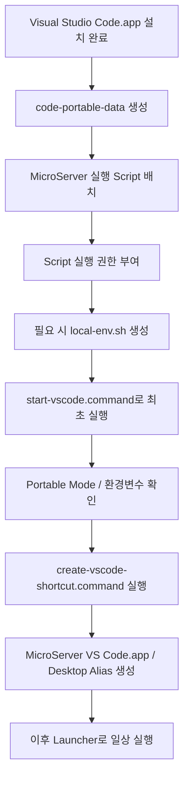
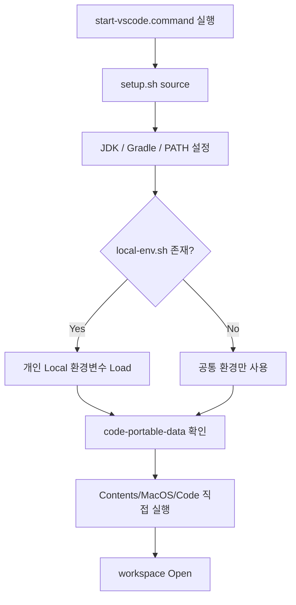

# macOS VS Code Portable 설정

## 1. 문서 목적

본 문서는 `~/local-microserver/tools/vscode`에 설치한 Visual Studio
Code를 MicroServer 표준 **macOS Portable VS Code 실행환경**으로 구성하는
절차를 설명한다.

이 문서는 단순히 Script와 Directory를 나열하는 것이 아니라 다음 두 사용
시나리오를 기준으로 설명한다.

1.  **표준 Portable 개발환경을 처음 구성하는 경우**
2.  **이미 구성된 MicroServer 개발환경 Package를 전달받아 사용하는
    경우**

최초 구성 시에는 다음 순서로 진행한다.



!!! important "이 문서는 새 개발환경 구성을 기본 기준으로 한다"
    MicroServer macOS 개발환경은 기존 개인 VS Code 환경을 그대로 복사하는 방식이 아니라
    **깨끗한 Portable Instance를 새로 만드는 방식**을 기본으로 한다.

    기존 VS Code User Data와 Extension Migration은 기본 절차가 아니며,
    문서 후반의 선택 사항에서만 설명한다.

---

## 2. Script 구성 이해 - 실행 전 참고

Portable 환경을 구성할 때 사용하는 Script와 Directory 구조를 먼저 확인한다. 이 절은 **구성 이해를 위한 참고 영역**이며, 실제 작업은 3장부터 Step 순서대로 수행한다.

```text
~/local-microserver
│
├─ env
│  ├─ setup.sh
│  ├─ start-vscode.command
│  ├─ create-vscode-shortcut.command
│  ├─ local-env.example.sh
│  └─ local-env.sh
│
├─ icons
│  └─ microserver-vscode.icns
│
├─ tools
│  └─ vscode
│     ├─ Visual Studio Code.app
│     └─ code-portable-data
│
└─ MicroServer VS Code.app
```

각 Script의 역할과 사용 시점은 다음과 같다.

| Script | 역할 / 목적 | 개발자가 직접 실행? | 사용 시점 | 다운로드 |
| --- | --- | --- | --- | --- |
| `setup.sh` | JDK / Gradle / PATH 등 MicroServer 공통 환경을 설정한다. | **아니오** | `start-vscode.command`가 자동 호출 | [다운로드](env_scripts/setup.sh) |
| `start-vscode.command` | 공통 환경을 적용하고 Portable VS Code를 실행한다. | **최초 검증 시 1회** | Portable 환경 최초 실행 및 문제 확인 시 | [다운로드](env_scripts/start-vscode.command) |
| `create-vscode-shortcut.command` | `MicroServer VS Code.app`, Icon, Desktop Alias를 생성한다. | **최초 1회** | Portable VS Code 정상 실행 확인 후 | [다운로드](env_scripts/create-vscode-shortcut.command) |
| `local-env.example.sh` | 개인 환경변수 작성 형식을 제공하는 Sample이다. | **실행하지 않음** | 개인 설정이 필요한 경우 `local-env.sh` 생성에 사용 | [다운로드](env_scripts/local-env.example.sh) |
| `local-env.sh` | Password, Token, Local DB 정보 등 개인 설정을 저장한다. | **실행하지 않음** | 필요한 경우 Sample을 복사하여 개발자가 작성 | 직접 생성 |

!!! tip "여기서는 Script의 역할만 이해하면 된다"
    이 절의 Script 설명은 **참고용**이다. 지금 여기서 Script를 하나씩 실행하는 단계가 아니다.

    실제 최초 구성 작업은 **3. 최초 Portable 개발환경 구성**부터 Step 순서대로 수행한다.

    Script의 전체 소스와 명령별 상세 주석은 문서 하단의 **16. 참고 가이드 - 실행 Script 전체 내용**에서 확인한다.

핵심 관계는 다음과 같다.

```text
start-vscode.command
        ↓
setup.sh
        ↓
local-env.sh 존재 시 Load
        ↓
JDK / Gradle / PATH 적용
        ↓
Portable VS Code 실행
```

!!! important "`setup.sh`은 일상적으로 직접 실행할 필요가 없다"
    일반적인 VS Code 개발에서는 다음 명령을 매번 실행하지 않는다.

    ```bash
    source "$HOME/local-microserver/env/setup.sh"
    ```

    `start-vscode.command`가 내부에서 자동으로 `setup.sh`을 읽고
    환경변수를 적용한 뒤 VS Code를 실행한다.

    `setup.sh`을 직접 `source`하는 경우는 일반 Terminal에서
    Java / Gradle Build나 환경 검증을 직접 수행할 때다.

---

## 3. 최초 Portable 개발환경 구성

이 절은 **MicroServer macOS 개발환경을 처음 만드는 사람**이 순서대로
수행한다.

---

### 3.1 Step 1. Portable Mode Directory 생성

macOS Portable Mode에서는 `Visual Studio Code.app` 내부에 Directory를
만드는 것이 아니라 Application과 같은 위치에 **`code-portable-data`** 를
만든다.

Windows와 비교하면 다음과 같다.

```text
Windows

C:\local-microserver\tools\vscode
├─ Code.exe
└─ data
```

```text
macOS

~/local-microserver/tools/vscode
├─ Visual Studio Code.app
└─ code-portable-data
```

기존에 실행 중인 VS Code가 있다면 먼저 완전히 종료한다.

```text
VS Code
→ Command + Q
```

Portable Directory 생성:

```bash
mkdir -p "$HOME/local-microserver/tools/vscode/code-portable-data"
```

확인:

```bash
ls -la "$HOME/local-microserver/tools/vscode"
```

정상 구조:

```text
~/local-microserver/tools/vscode
├─ Visual Studio Code.app
└─ code-portable-data
```

!!! important "`code-portable-data`가 macOS Portable Mode의 기준"
    Stable VS Code에서는 정확히 다음 이름을 사용한다.

    ```text
    code-portable-data
    ```

    VS Code Insiders의 `code-insiders-portable-data`와 혼동하지 않는다.

---

### 3.2 Step 2. MicroServer 실행 Script 배치

Portable 실행환경에서 사용할 Script는 이 가이드 문서와 같은 Directory의
`env_scripts` Directory에서 제공한다.

```text
05_vscode/
├─ vscode_portable_setup.md
└─ env_scripts/
   ├─ setup.sh
   ├─ start-vscode.command
   ├─ create-vscode-shortcut.command
   └─ local-env.example.sh
```

#### Script 배치

Script의 역할과 다운로드 링크는 앞의 **2. Script 구성 이해 - 실행 전 참고** 표에서 한 번만 제공한다.

!!! note "이 Step에서 개발자가 해야 할 작업"
    이 단계에서는 Script 내용을 분석하거나 각각 실행하지 않는다.

    **4개의 Script 파일을 내려받아 `~/local-microserver/env`에 배치하는 것까지만 수행한다.**

문서 저장소에서 Script를 제공하는 위치:

```text
05_vscode/
├─ vscode_portable_setup.md
└─ env_scripts/
   ├─ setup.sh
   ├─ start-vscode.command
   ├─ create-vscode-shortcut.command
   └─ local-env.example.sh
```

실제 MicroServer 개발환경에서 Script가 위치할 표준 Directory를 생성한다.

```bash
mkdir -p "$HOME/local-microserver/env"
```

다운로드한 파일을 다음 위치에 배치한다.

```text
~/local-microserver/env
├─ setup.sh
├─ start-vscode.command
├─ create-vscode-shortcut.command
└─ local-env.example.sh
```

문서 Repository를 Local에 Clone하여 작업 중이라면 다음과 같이 복사할 수 있다.

```bash
cp env_scripts/setup.sh "$HOME/local-microserver/env/"
cp env_scripts/start-vscode.command "$HOME/local-microserver/env/"
cp env_scripts/create-vscode-shortcut.command "$HOME/local-microserver/env/"
cp env_scripts/local-env.example.sh "$HOME/local-microserver/env/"
```

!!! tip "`env_scripts`와 `~/local-microserver/env`의 차이"
    `env_scripts`는 **가이드 문서에서 Script를 제공하는 배포 위치**다.

    `~/local-microserver/env`는 **개발자의 Mac에서 Script가 실제로 사용되는 실행 위치**다.

!!! info "Script 내부 동작이 궁금한 경우"
    최초 구성 중에는 Script의 내부 명령을 하나씩 수행할 필요가 없다.

    각 Script의 전체 내용과 명령별 설명은 문서 하단의 **16. 참고 가이드 - 실행 Script 전체 내용**을 참고한다.

---

### 3.3 Step 3. Script 실행 권한 부여

macOS에서는 `.command` Script가 실행 가능해야 한다.

```bash
chmod +x "$HOME/local-microserver/env/start-vscode.command"
chmod +x "$HOME/local-microserver/env/create-vscode-shortcut.command"
```

확인:

```bash
ls -l "$HOME/local-microserver/env/start-vscode.command"
ls -l "$HOME/local-microserver/env/create-vscode-shortcut.command"
```

권한에 `x`가 포함되어 있으면 실행 가능하다.

예:

```text
-rwxr-xr-x
```

`setup.sh`은 `source` 방식으로 사용하므로 별도 실행 권한이 필수는
아니다.

---

### 3.4 Step 4. 필요 시 개발자 개인 `local-env.sh` 생성

DB Password, Token 등 개인 환경변수가 필요한 경우에만 수행한다.

Sample 복사:

```bash
cp "$HOME/local-microserver/env/local-env.example.sh" \
   "$HOME/local-microserver/env/local-env.sh"
```

생성 결과:

```text
~/local-microserver/env
├─ local-env.example.sh     ← 배포용 Sample
└─ local-env.sh             ← 개인 Local 설정
```

`local-env.sh`을 열어 필요한 값만 설정한다.

예:

```bash
export ORACLE_PWD="<개발자-개인-비밀번호>"
```

!!! danger "`local-env.sh`은 배포하지 않는다"
    `local-env.sh`에는 Password, Token 등 개인 Secret이 들어갈 수 있다.

    다른 개발자에게 MicroServer Package를 전달할 때는 다음 파일만 포함한다.

    ```text
    local-env.example.sh
    ```

    다음 파일은 제외한다.

    ```text
    local-env.sh
    ```

개인 Local 환경변수가 아직 필요하지 않다면 이 Step은 건너뛰어도 된다.

---

### 3.5 Step 5. `start-vscode.command`로 최초 실행

`code-portable-data`와 Script 준비가 완료된 뒤 **이 단계에서 처음으로
MicroServer Portable VS Code를 실행한다.**

실행 전에 일반 VS Code를 포함하여 실행 중인 VS Code를 모두 종료한다.

```text
VS Code
→ Command + Q
```

!!! important "기존 VS Code Process를 먼저 종료한다"
    MicroServer Portable VS Code의 실행환경을 정확하게 검증하기 위해
    기존 VS Code Process가 없는 상태에서 `start-vscode.command`를 실행한다.

이제 다음 Script로 실행한다.

```bash
"$HOME/local-microserver/env/start-vscode.command"
```

`start-vscode.command`는 VS Code를 **Background Process로 실행한 뒤 종료**한다.
따라서 VS Code가 열린 후 실행에 사용한 Terminal은 다시 Prompt로 돌아온다.

```text
start-vscode.command 실행
        ↓
setup.sh 적용
        ↓
VS Code Background 실행
        ↓
start-vscode.command 종료
        ↓
Terminal Prompt 복귀
```

Script 내부 실행 흐름:



!!! important "왜 설치 단계에서 VS Code를 실행하지 않았는가?"
    `code-portable-data`가 없는 상태에서 VS Code를 실행하면 일반 VS Code
    환경과 Portable VS Code 환경을 명확하게 구분하기 어렵다.

    따라서 설치 문서에서는 Application 파일 존재까지만 확인하고,
    실제 실행은 `code-portable-data`를 만든 뒤 이 단계에서 처음 수행한다.

처음 실행하면 VS Code Welcome 화면이 표시될 수 있다.

GitHub Copilot을 사용하지 않고 Codex를 별도로 구성할 예정이라면 Copilot
로그인 화면에서는 다음을 선택할 수 있다.

```text
Continue without Signing In
```

GitHub Repository 인증과 GitHub Copilot 사용 여부는 별개다.

---

### 3.6 Step 6. Portable Mode 정상 동작 확인

최초 실행 후 새 Terminal에서 확인한다.

```bash
find "$HOME/local-microserver/tools/vscode/code-portable-data" \
  -maxdepth 2 -type d
```

대표적으로 다음 Directory가 생성되어 있어야 한다.

```text
code-portable-data
code-portable-data/user-data
code-portable-data/extensions
```

Portable Mode의 주요 저장 위치:

```text
Extension
~/local-microserver/tools/vscode/code-portable-data/extensions
```

```text
User Data
~/local-microserver/tools/vscode/code-portable-data/user-data
```

```text
User Settings
~/local-microserver/tools/vscode/code-portable-data/user-data/User/settings.json
```

일반 macOS VS Code와 비교:

```text
일반 VS Code

~/Library/Application Support/Code
~/.vscode/extensions
```

```text
MicroServer Portable VS Code

~/local-microserver/tools/vscode/code-portable-data/user-data
~/local-microserver/tools/vscode/code-portable-data/extensions
```

---

### 3.7 Step 7. MicroServer 환경변수 확인

MicroServer VS Code의 Integrated Terminal을 새로 열고 확인한다.

```bash
echo "$LOCAL_MICROSERVER"
echo "$JAVA_HOME"
echo "$GRADLE_HOME"
echo "$GRADLE_USER_HOME"
```

예상:

```text
/Users/<USER>/local-microserver
/Users/<USER>/local-microserver/tools/jdk/temurin-25/Contents/Home
/Users/<USER>/local-microserver/tools/gradle/gradle-9.7.1
/Users/<USER>/local-microserver/gradle-home
```

Java:

```bash
java -version
```

Gradle:

```bash
gradle --version
```

Project Build는 설치된 Gradle보다 Gradle Wrapper 사용을 기본으로 한다.

```bash
./gradlew --version
```

!!! important "`JAVA_HOME`이 비어 있으면 바로 `source setup.sh`로 정상 처리하지 않는다"
    `source "$HOME/local-microserver/env/setup.sh"`을 실행하면
    현재 Terminal Session에는 환경변수가 주입되므로 문제가 가려질 수 있다.

    먼저 `~/.zshrc`, `~/.zprofile` 등 macOS Shell 초기화 파일이
    MicroServer에서 전달한 `JAVA_HOME`을 다시 덮어쓰는지 확인한다.

확인:

```bash
grep -nH "JAVA_HOME" \
  ~/.zshenv \
  ~/.zprofile \
  ~/.zshrc \
  ~/.zlogin \
  ~/.profile \
  2>/dev/null
```

예를 들어 다음 설정은 앞에서 전달된 `JAVA_HOME`을 강제로 빈 값으로 만든다.

```bash
export JAVA_HOME=
```

일반 macOS Terminal에서도 별도의 Java 환경이 필요한 경우
`JAVA_HOME` 설정 자체를 제거하는 것이 아니라,
**외부에서 이미 전달된 값이 있으면 그 값을 유지하고 없을 때만 기본 Java를 설정**한다.

예:

```bash
export JAVA_HOME="${JAVA_HOME:-/Volumes/data/localDevMicroServer/jdk/jdk-17.0.14+7/Contents/Home}"
```

동작:

```text
일반 macOS Terminal
        ↓
JAVA_HOME이 아직 없음
        ↓
.zshrc의 기본 Java 적용

MicroServer VS Code
        ↓
setup.sh에서 Java 25 설정
        ↓
.zshrc 실행
        ↓
이미 JAVA_HOME이 있으므로 Java 25 유지
```

!!! tip "환경변수 관리 원칙"
    MicroServer 전용 JDK / Gradle 경로의 기준은 `setup.sh` 한 곳에서 관리한다.

    VS Code `settings.json`에 동일한 `JAVA_HOME`, `GRADLE_HOME`을 다시 작성하여
    중복 관리하지 않는다.

Shell 설정을 수정했다면 VS Code를 `Command + Q`로 완전히 종료한 뒤
다시 `start-vscode.command`로 실행하고 새 Integrated Terminal에서 확인한다.

```bash
"$HOME/local-microserver/env/start-vscode.command"
```

문제가 계속되는 경우에만 `setup.sh` 자체를 진단한다.

```bash
source "$HOME/local-microserver/env/setup.sh"

echo "$JAVA_HOME"
echo "$GRADLE_HOME"
echo "$GRADLE_USER_HOME"
```

이때 값이 정상 출력되면 `setup.sh` 자체는 정상이며,
Shell 초기화 파일에서 환경변수를 덮어쓰는 부분을 다시 확인한다.

Secret은 값 자체를 출력하지 않고 설정 여부만 확인한다.

```bash
if [[ -n "$ORACLE_PWD" ]]; then
  echo "ORACLE_PWD is set"
else
  echo "ORACLE_PWD is not set"
fi
```

---

### 3.8 Step 8. MicroServer 실행 Shortcut / Icon 생성

Portable Mode와 환경변수가 정상임을 확인한 뒤 **최초 1회** 다음 Script를
실행한다.

```bash
"$HOME/local-microserver/env/create-vscode-shortcut.command"
```

이 Script는 다음 작업을 수행한다.

```text
Visual Studio Code.app의 Icon 확인
        ↓
~/local-microserver/icons/microserver-vscode.icns 생성
        ↓
~/local-microserver/MicroServer VS Code.app 생성
        ↓
Desktop Finder Alias 생성
```

생성 결과:

```text
~/local-microserver
├─ icons
│  └─ microserver-vscode.icns
│
└─ MicroServer VS Code.app
```

Desktop:

```text
~/Desktop
└─ MicroServer VS Code
```

Windows의 `.lnk` Shortcut에 대응하여 macOS에서는 **Launcher
Application + Finder Alias** 방식을 사용한다.

---

### 3.9 Step 9. Desktop / Dock 실행 확인

Desktop의 다음 Icon을 더블클릭한다.

```text
MicroServer VS Code
```

실행 흐름:

```text
Desktop Alias
        ↓
MicroServer VS Code.app
        ↓
start-vscode.command
        ↓
setup.sh
        ↓
local-env.sh 존재 시 Load
        ↓
MicroServer Portable VS Code
```

Dock에 고정하려면 다음 Application을 Finder에서 찾아 Dock으로 Drag &
Drop한다.

```text
~/local-microserver/MicroServer VS Code.app
```

이 시점부터 일상적인 개발에서는 Terminal에서 Script를 직접 실행하지 않고
**Desktop 또는 Dock의 `MicroServer VS Code` Launcher를 사용**하면 된다.

---

## 4. 최초 구성 완료 후 개발자가 평소 사용하는 방법

최초 구성이 끝난 후에는 아래 과정만 기억하면 된다.

```text
MicroServer VS Code Icon 더블클릭
        ↓
환경변수 자동 적용
        ↓
Portable VS Code 실행
        ↓
workspace Open
```

개발자가 매번 다음 명령을 직접 실행할 필요는 없다.

```bash
source "$HOME/local-microserver/env/setup.sh"
```

```bash
"$HOME/local-microserver/env/start-vscode.command"
```

위 명령들은 Launcher 내부에서 자동으로 연결된다.

다만 Launcher에 문제가 있는지 확인해야 할 때는 다음 명령으로 Portable VS
Code를 직접 실행할 수 있다.

```bash
"$HOME/local-microserver/env/start-vscode.command"
```

---

## 5. 완성된 개발환경 Package를 전달받은 개발자

이 절은 다른 개발자가 이미 구성해 둔 MicroServer 개발환경 Package를
전달받은 경우다.

배포 Package는 다음 구조를 기준으로 한다.

```text
~/local-microserver
│
├─ tools
│  ├─ jdk
│  │  └─ temurin-25
│  │     └─ Contents
│  │        └─ Home
│  ├─ gradle
│  │  └─ gradle-9.7.1
│  └─ vscode
│     ├─ Visual Studio Code.app
│     └─ code-portable-data
│
├─ gradle-home
├─ workspace
│
├─ env
│  ├─ setup.sh
│  ├─ start-vscode.command
│  ├─ create-vscode-shortcut.command
│  └─ local-env.example.sh
│
└─ icons
   └─ microserver-vscode.icns
```

`local-env.sh`은 배포 Package에 포함하지 않는다.

---

### 5.1 Step 1. Package 배치

전달받은 `local-microserver` Directory를 다음 위치에 배치한다.

```text
~/local-microserver
```

다른 위치에 배치하면 Script가 참조하는 표준 경로와 달라질 수 있으므로
기본적으로 표준 위치를 사용한다.

---

### 5.2 Step 2. Script 실행 권한 확인

압축 해제나 파일 전달 과정에서 실행 권한이 손실될 수 있다.

다음 명령을 한 번 실행한다.

```bash
chmod +x "$HOME/local-microserver/env/start-vscode.command"
chmod +x "$HOME/local-microserver/env/create-vscode-shortcut.command"
```

---

### 5.3 Step 3. 필요한 경우 개인 `local-env.sh` 생성

개인 DB Password나 Token이 필요한 경우:

```bash
cp "$HOME/local-microserver/env/local-env.example.sh" \
   "$HOME/local-microserver/env/local-env.sh"
```

그 후 자신의 환경에 맞게 값을 작성한다.

개인 설정이 필요하지 않다면 이 Step은 생략한다.

---

### 5.4 Step 4. Portable VS Code 최초 실행 확인

전달받은 환경에서 최초 1회 직접 실행해 본다.

```bash
"$HOME/local-microserver/env/start-vscode.command"
```

확인 항목:

```text
1. VS Code가 정상 실행되는가
2. workspace가 열리는가
3. JAVA_HOME이 정상인가
4. Gradle이 정상인가
5. Extension과 Settings가 Portable 영역에서 로드되는가
```

---

### 5.5 Step 5. 자신의 Mac에 Shortcut 생성

최초 실행이 정상이라면 자신의 Mac에서 한 번 실행한다.

```bash
"$HOME/local-microserver/env/create-vscode-shortcut.command"
```

이 작업은 각 개발자의:

```text
Desktop
Dock
Finder Alias
```

환경을 구성하는 단계이므로 **배포 Package 제작자가 대신 완료해 주는
개념이 아니라, Package를 받은 개발자의 Mac에서 최초 1회 수행**하는 것을
기본으로 한다.

---

### 5.6 Step 6. 이후 일상 실행

이후에는 다음 Icon만 사용한다.

```text
MicroServer VS Code
```

실행 흐름:

```text
Desktop / Dock
        ↓
MicroServer VS Code.app
        ↓
start-vscode.command
        ↓
setup.sh
        ↓
개인 local-env.sh
        ↓
Portable VS Code
```

즉, 배포본을 받은 개발자에게 필요한 최초 작업은 다음 다섯 단계로
정리된다.

```text
① ~/local-microserver에 Package 배치
        ↓
② Script 실행 권한 확인
        ↓
③ 필요 시 local-env.sh 생성
        ↓
④ start-vscode.command 최초 실행 검증
        ↓
⑤ create-vscode-shortcut.command 최초 1회 실행
        ↓
이후 MicroServer VS Code Icon으로 실행
```

---

## 6. 배포용 Portable Package를 만드는 사람

개인이 장기간 사용한 Portable 환경을 그대로 다른 개발자에게 전달하지
않는다.

배포용 환경은 별도의 깨끗한 Portable Instance를 기준으로 만든다.

권장 절차:

```text
새 Visual Studio Code.app 준비
        ↓
빈 code-portable-data 생성
        ↓
start-vscode.command로 Portable 실행
        ↓
프로젝트 표준 Extension만 설치
        ↓
공통 Settings만 구성
        ↓
개인 계정 로그인 / Settings Sync 최소화
        ↓
개인 Repository / 최근 파일 상태 정리
        ↓
VS Code 완전 종료
        ↓
local-env.sh 제외
        ↓
배포 Package 생성
```

배포 포함:

```text
setup.sh
start-vscode.command
create-vscode-shortcut.command
local-env.example.sh
공통 code-portable-data
표준 Extension
공통 Settings
JDK
Gradle
VS Code
```

배포 제외:

```text
local-env.sh
Password
Token
개인 Credential
개인 Repository 상태
개인 로그인 정보
```

!!! important "Git 관리 범위와 개발환경 Package 범위는 다르다"
    `~/local-microserver` 자체는 Git Repository가 아니다.

    실제 Git Repository는 다음과 같이 `workspace` 아래에서 개별 관리한다.

    ```text
    ~/local-microserver/workspace/microserver
    ~/local-microserver/workspace/microserver-docs
    ```

---

## 7. Portable Mode와 CLI Directory 옵션

Portable Mode가 활성화되면 `code-portable-data`가 User Data와 Extension
위치를 결정한다.

따라서 MicroServer 표준 실행 Script에서는 다음 옵션을 별도로 지정하지
않는다.

```text
--user-data-dir
--extensions-dir
```

Portable Mode의 Data Directory가 이 옵션보다 우선한다.

---

## 8. 기존 VS Code Migration - 선택 사항

!!! note "새 MicroServer 개발환경에서는 수행하지 않는다"
    이 절은 기존 개인 VS Code 환경을 반드시 이어서 사용해야 하는 경우에만 참고한다.

    새 MicroServer 개발환경을 구성하거나
    표준 배포 Package를 만드는 과정에서는 수행하지 않는다.

기존 macOS User Data:

```text
~/Library/Application Support/Code
```

기존 Extension:

```text
~/.vscode/extensions
```

Migration 대상:

```text
code-portable-data/
├─ user-data/
└─ extensions/
```

개인 Profile, 로그인 상태, UI 상태, Extension 상태가 함께 들어갈 수
있으므로 Migration한 개인 환경을 팀 배포 Package로 사용하지 않는다.

---

## 9. quarantine 문제 - Troubleshooting

정상적인 Portable 구성에서는 별도 작업이 필요하지 않다.

Application 실행이 macOS 보안 정책에 의해 차단되거나 Portable Mode
실행에 문제가 있을 때만 확인한다.

```bash
xattr "$HOME/local-microserver/tools/vscode/Visual Studio Code.app"
```

`com.apple.quarantine`이 문제로 확인되고 Microsoft 공식 배포처에서 받은
VS Code임을 확인한 경우 필요한 때만 제거한다.

```bash
xattr -dr com.apple.quarantine \
  "$HOME/local-microserver/tools/vscode/Visual Studio Code.app"
```

!!! warning "기본 설치 절차가 아니다"
    quarantine 제거는 최초 Portable 구성 시 항상 실행하는 명령이 아니다.

---

## 10. macOS Portable VS Code Update

macOS Portable Mode에서는 Application과 Portable Data가 분리되어 있다.

```text
Visual Studio Code.app
code-portable-data
```

따라서 Application이 Update되어도 Portable User Data를 계속 유지할 수
있다.

Update 후 확인:

```text
1. MicroServer VS Code Launcher 정상 실행
2. code-portable-data 유지
3. Extension 유지
4. User Settings 유지
5. JDK / Gradle 환경변수 유지
```

Windows ZIP Portable Mode처럼 새 ZIP Directory로 `data`를 이동하는
방식과 동일하게 취급하지 않는다.

---

## 11. Portable Mode의 범위

MicroServer Portable VS Code Package를 복사한다고 해서 다음 외부
요소까지 자동으로 복제되는 것은 아니다.

```text
Git 설치
Docker Desktop
macOS Keychain
외부 CLI
네트워크 / Proxy
인증서
사내 보안 Agent
```

JDK와 Gradle은 MicroServer Package 안에 함께 둘 수 있지만, OS 설치나
별도 권한이 필요한 도구는 각 Mac에서 따로 구성해야 할 수 있다.

---

## 12. 전체 실행 순서 요약

### 최초 표준 환경 구성자

```text
VS Code 설치
    ↓
code-portable-data 생성
    ↓
env Script 배치
    ↓
Script 실행 권한 부여
    ↓
필요 시 local-env.sh 생성
    ↓
start-vscode.command 최초 실행
    ↓
VS Code Background 실행 / Terminal Prompt 복귀
    ↓
Portable Mode 확인
    ↓
JDK / Gradle 환경변수 확인
    ↓
create-vscode-shortcut.command 실행
    ↓
Desktop / Dock Launcher 확인
    ↓
공통 Settings / Extension 구성
    ↓
배포 Package 준비
```

### Package를 전달받은 개발자

```text
~/local-microserver에 Package 배치
    ↓
Script 실행 권한 확인
    ↓
필요 시 개인 local-env.sh 생성
    ↓
start-vscode.command 최초 실행 검증
    ↓
create-vscode-shortcut.command 최초 1회 실행
    ↓
이후 MicroServer VS Code Icon으로 실행
```

### 일상적인 개발

```text
MicroServer VS Code Icon
    ↓
start-vscode.command
    ↓
setup.sh
    ↓
local-env.sh
    ↓
Portable VS Code
```

---

## 13. Portable 설정 체크리스트

#### 최초 구성

-   [ ] `Visual Studio Code.app`이 표준 위치에 있다.
-   [ ] `code-portable-data`를 생성했다.
-   [ ] `setup.sh`, `start-vscode.command`,
    `create-vscode-shortcut.command`를 배치했다.
-   [ ] `.command` Script에 실행 권한을 부여했다.
-   [ ] 필요한 경우 `local-env.sh`을 생성했다.
-   [ ] `start-vscode.command`로 최초 실행했다.
-   [ ] VS Code 실행 후 최초 실행 Terminal이 Prompt로 복귀했다.
-   [ ] `user-data`와 `extensions`가 Portable Directory 아래에 생성됐다.
-   [ ] Integrated Terminal에서 JDK / Gradle 환경변수를 확인했다.
-   [ ] `JAVA_HOME`이 비어 있다면 Shell 초기화 파일의 덮어쓰기 설정을 확인했다.
-   [ ] `create-vscode-shortcut.command`를 실행했다.
-   [ ] `MicroServer VS Code.app`과 Desktop Alias가 생성됐다.
-   [ ] Desktop 또는 Dock Launcher로 실행되는 것을 확인했다.

#### 배포 Package

-   [ ] `local-env.sh`을 배포에서 제외했다.
-   [ ] 개인 Password / Token / Credential을 제거했다.
-   [ ] 개인 로그인 상태와 개인 Workspace 상태를 배포본에 포함하지
    않았다.
-   [ ] 공통 Settings와 표준 Extension만 포함했다.

#### Package를 받은 개발자

-   [ ] Package를 `~/local-microserver`에 배치했다.
-   [ ] Script 실행 권한을 확인했다.
-   [ ] 필요한 경우 개인 `local-env.sh`을 만들었다.
-   [ ] `start-vscode.command`로 최초 실행을 확인했다.
-   [ ] 자신의 Mac에서 Shortcut을 생성했다.
-   [ ] 이후 `MicroServer VS Code` Launcher로 실행한다.

---

## 14. 다음 단계


**[VS Code 기본 설정](vscode_basic_settings.md)**

---

## 15. 공식 참고

-   [VS Code Portable
    Mode](https://code.visualstudio.com/docs/setup/portable)
-   [VS Code Command Line
    Interface](https://code.visualstudio.com/docs/configure/command-line)
-   [Installing Visual Studio Code on
    macOS](https://code.visualstudio.com/docs/setup/mac)

---

## 16. 참고 가이드 - 실행 Script 전체 내용

이 절은 다운로드 파일의 실제 내용을 문서에서도 바로 확인할 수 있도록
제공한다.

Script의 각 주요 명령에는 **무엇을 하는 명령인지, 왜 필요한지** 주석을
추가하였다.

!!! note "실행 시에는 다운로드 파일 사용"
    아래 코드는 설명과 검토를 위한 참고용이다.
    실제 구성 시에는 위의 `env_scripts` 다운로드 링크에서 파일을 받은 뒤
    `~/local-microserver/env`에 배치하여 사용한다.

### 16.1 `setup.sh` - 공통 개발환경 설정

[setup.sh 다운로드](env_scripts/setup.sh)

```bash
#!/bin/zsh

# -----------------------------------------------------------------------------
# MicroServer 공통 개발환경 설정 Script
#
# 목적:
#   - MicroServer의 표준 Root Directory를 정의한다.
#   - JDK / Gradle / Gradle User Home을 설정한다.
#   - PATH에 Java와 Gradle 실행 경로를 추가한다.
#   - 개발자 개인 설정 파일(local-env.sh)이 있으면 추가로 읽는다.
#
# 사용:
#   1) 일반적인 VS Code 실행 시 직접 실행하지 않는다.
#      start-vscode.command가 이 파일을 source한다.
#   2) 일반 Terminal에 같은 환경을 적용할 때만 다음처럼 사용한다.
#      source "$HOME/local-microserver/env/setup.sh"
# -----------------------------------------------------------------------------

# MicroServer 개발환경의 기준 Root Directory
export LOCAL_MICROSERVER="${LOCAL_MICROSERVER:-$HOME/local-microserver}"

# JDK의 실제 JAVA_HOME.
# macOS .jdk Bundle은 Contents/Home이 Java Home이다.
export JAVA_HOME="$LOCAL_MICROSERVER/tools/jdk/temurin-25/Contents/Home"

# 설치해 둔 Gradle의 Home Directory
export GRADLE_HOME="$LOCAL_MICROSERVER/tools/gradle/gradle-9.7.1"

# Gradle Cache, Wrapper, Daemon 등의 User Data 저장 위치
export GRADLE_USER_HOME="$LOCAL_MICROSERVER/gradle-home"

# 현재 Shell에서 java와 gradle 명령을 바로 사용할 수 있도록 PATH 앞쪽에 추가
export PATH="$JAVA_HOME/bin:$GRADLE_HOME/bin:$PATH"

# 개발자별 Password, Token, Local DB 정보 등을 둘 수 있는 개인 설정 파일
LOCAL_ENV_FILE="$LOCAL_MICROSERVER/env/local-env.sh"

# 개인 설정 파일이 존재할 때만 현재 Shell에 적용한다.
# 파일이 없어도 공통 개발환경은 정상 동작한다.
if [[ -f "$LOCAL_ENV_FILE" ]]; then
  source "$LOCAL_ENV_FILE"
fi
```

### 16.2 `start-vscode.command` - Portable VS Code 실행

[start-vscode.command 다운로드](env_scripts/start-vscode.command)

```bash
#!/bin/zsh

# -----------------------------------------------------------------------------
# MicroServer Portable VS Code 실행 Script
#
# 목적:
#   setup.sh을 읽어 JDK / Gradle / 개인 환경변수를 적용한 뒤
#   MicroServer용 Portable VS Code를 정확한 실행 파일로 Background 실행한다.
#
# 최초 구성:
#   code-portable-data를 만든 뒤 이 Script로 최초 실행을 검증한다.
#
# 평상시:
#   MicroServer VS Code.app Launcher가 이 Script를 자동 호출하므로
#   개발자가 매번 Terminal에서 직접 실행할 필요는 없다.
# -----------------------------------------------------------------------------

# 중간 명령에서 오류가 발생하면 Script를 계속 진행하지 않고 종료한다.
set -e

# MicroServer Root Directory
export LOCAL_MICROSERVER="${LOCAL_MICROSERVER:-$HOME/local-microserver}"

# 공통 환경변수 설정 Script
SETUP_SCRIPT="$LOCAL_MICROSERVER/env/setup.sh"

# VS Code 관련 표준 경로
VSCODE_ROOT="$LOCAL_MICROSERVER/tools/vscode"
VSCODE_APP="$VSCODE_ROOT/Visual Studio Code.app"

# macOS Application Bundle 내부의 실제 VS Code 실행 파일
VSCODE_BIN="$VSCODE_APP/Contents/MacOS/Code"

# 이 Directory가 VS Code Application과 같은 위치에 있어야 Portable Mode가 활성화된다.
PORTABLE_DATA="$VSCODE_ROOT/code-portable-data"

# VS Code 시작 시 열 MicroServer Workspace Root
WORKSPACE="$LOCAL_MICROSERVER/workspace"

# setup.sh이 없으면 표준 환경을 만들 수 없으므로 실행 중단
if [[ ! -f "$SETUP_SCRIPT" ]]; then
  echo "ERROR: setup.sh not found:"
  echo "  $SETUP_SCRIPT"
  exit 1
fi

# setup.sh을 현재 Process에 적용한다.
# 이 과정에서 JAVA_HOME / GRADLE_HOME / PATH / local-env.sh 등이 적용된다.
source "$SETUP_SCRIPT"

# VS Code Application 존재 여부 확인
if [[ ! -d "$VSCODE_APP" ]]; then
  echo "ERROR: Visual Studio Code.app not found:"
  echo "  $VSCODE_APP"
  exit 1
fi

# 실제 VS Code 실행 파일 존재 및 실행 가능 여부 확인
if [[ ! -x "$VSCODE_BIN" ]]; then
  echo "ERROR: VS Code executable not found:"
  echo "  $VSCODE_BIN"
  exit 1
fi

# Portable Mode Directory가 없으면 일반 VS Code 환경으로 실행될 수 있으므로 중단
if [[ ! -d "$PORTABLE_DATA" ]]; then
  echo "ERROR: Portable Mode directory not found:"
  echo "  $PORTABLE_DATA"
  echo
  echo "Create code-portable-data before launching MicroServer VS Code."
  exit 1
fi

# Workspace Directory가 없으면 생성
mkdir -p "$WORKSPACE"

# macOS의 open 명령을 사용하지 않고 정확한 Bundle 내부 실행 파일을 직접 실행한다.
# nohup + & 로 VS Code를 Background Process로 실행한다.
# 따라서 이 Script를 실행한 Terminal은 VS Code가 열린 뒤 다시 Prompt로 돌아온다.
# --new-window는 지정한 workspace를 새 VS Code Window로 열도록 요청한다.
nohup "$VSCODE_BIN" --new-window "$WORKSPACE"   >/dev/null 2>&1 &

# Background 실행을 시작한 뒤 Script를 정상 종료한다.
exit 0
```

### 16.3 `create-vscode-shortcut.command` - Launcher / Shortcut 생성

[create-vscode-shortcut.command
다운로드](env_scripts/create-vscode-shortcut.command)

```bash
#!/bin/zsh

# -----------------------------------------------------------------------------
# MicroServer VS Code Launcher / Desktop Alias 생성 Script
#
# 목적:
#   - 설치된 VS Code의 Icon을 MicroServer Launcher용으로 복사한다.
#   - ~/local-microserver/MicroServer VS Code.app 을 생성한다.
#   - Desktop에 Finder Alias를 생성한다.
#
# 실행 시점:
#   start-vscode.command로 Portable VS Code가 정상 실행되는 것을 확인한 뒤
#   개발자별 Mac에서 최초 1회 실행한다.
# -----------------------------------------------------------------------------

# 오류 발생 시 즉시 종료
set -e

# MicroServer Root Directory
export LOCAL_MICROSERVER="${LOCAL_MICROSERVER:-$HOME/local-microserver}"

# 원본 VS Code Application
SOURCE_APP="$LOCAL_MICROSERVER/tools/vscode/Visual Studio Code.app"

# 실제 Portable VS Code를 실행하는 Script
START_SCRIPT="$LOCAL_MICROSERVER/env/start-vscode.command"

# Launcher Icon 저장 Directory / 파일
ICONS_DIR="$LOCAL_MICROSERVER/icons"
ICON_FILE="$ICONS_DIR/microserver-vscode.icns"

# 생성할 MicroServer 전용 Launcher Application
LAUNCHER_APP="$LOCAL_MICROSERVER/MicroServer VS Code.app"

# Desktop에 생성할 Finder Alias 이름
DESKTOP_ALIAS="$HOME/Desktop/MicroServer VS Code"

# VS Code가 표준 위치에 설치되어 있는지 확인
if [[ ! -d "$SOURCE_APP" ]]; then
  echo "ERROR: Visual Studio Code.app not found:"
  echo "  $SOURCE_APP"
  exit 1
fi

# start-vscode.command가 실행 가능한지 확인
if [[ ! -x "$START_SCRIPT" ]]; then
  echo "ERROR: start-vscode.command is not executable:"
  echo "  $START_SCRIPT"
  echo "Run:"
  echo "  chmod +x \"$START_SCRIPT\""
  exit 1
fi

# Icon 저장 Directory 생성
mkdir -p "$ICONS_DIR"

# 일반적인 VS Code Icon 위치를 먼저 확인한다.
SOURCE_ICON=""
if [[ -f "$SOURCE_APP/Contents/Resources/Code.icns" ]]; then
  SOURCE_ICON="$SOURCE_APP/Contents/Resources/Code.icns"
else
  # Version에 따라 파일명이 다를 경우 첫 번째 .icns 파일을 찾는다.
  SOURCE_ICON="$(find "$SOURCE_APP/Contents/Resources" -maxdepth 1 -name '*.icns' -print -quit 2>/dev/null || true)"
fi

# Icon을 찾았으면 MicroServer 표준 위치로 복사
if [[ -n "$SOURCE_ICON" ]]; then
  cp "$SOURCE_ICON" "$ICON_FILE"
fi

# 기존 Launcher가 있으면 새로 만들기 위해 제거
rm -rf "$LAUNCHER_APP"

# macOS .app Bundle 기본 Directory 생성
mkdir -p "$LAUNCHER_APP/Contents/MacOS"
mkdir -p "$LAUNCHER_APP/Contents/Resources"

# Launcher가 실행할 작은 Shell Script 생성.
# 사용자가 Launcher를 더블클릭하면 start-vscode.command가 실행된다.
cat > "$LAUNCHER_APP/Contents/MacOS/microserver-vscode" <<'EOF'
#!/bin/zsh
exec "$HOME/local-microserver/env/start-vscode.command"
EOF

# Launcher 내부 실행 파일에 실행 권한 부여
chmod +x "$LAUNCHER_APP/Contents/MacOS/microserver-vscode"

# 복사한 Icon이 있으면 Launcher Resources에 포함
if [[ -f "$ICON_FILE" ]]; then
  cp "$ICON_FILE" "$LAUNCHER_APP/Contents/Resources/microserver-vscode.icns"
fi

# macOS가 Application으로 인식할 수 있도록 Info.plist 생성
cat > "$LAUNCHER_APP/Contents/Info.plist" <<'EOF'
<?xml version="1.0" encoding="UTF-8"?>
<!DOCTYPE plist PUBLIC "-//Apple//DTD PLIST 1.0//EN"
  "http://www.apple.com/DTDs/PropertyList-1.0.dtd">
<plist version="1.0">
<dict>
  <key>CFBundleName</key>
  <string>MicroServer VS Code</string>
  <key>CFBundleDisplayName</key>
  <string>MicroServer VS Code</string>
  <key>CFBundleIdentifier</key>
  <string>com.team-microserver.vscode-launcher</string>
  <key>CFBundleVersion</key>
  <string>1.0</string>
  <key>CFBundleShortVersionString</key>
  <string>1.0</string>
  <key>CFBundlePackageType</key>
  <string>APPL</string>
  <key>CFBundleExecutable</key>
  <string>microserver-vscode</string>
  <key>CFBundleIconFile</key>
  <string>microserver-vscode</string>
</dict>
</plist>
EOF

# 같은 이름의 이전 Desktop Alias가 있으면 제거
rm -f "$DESKTOP_ALIAS" 2>/dev/null || true

# Finder에게 MicroServer VS Code.app을 가리키는 Desktop Alias 생성을 요청
osascript <<EOF
tell application "Finder"
  set launcherApp to POSIX file "$LAUNCHER_APP" as alias
  set desktopFolder to desktop
  make new alias file at desktopFolder to launcherApp with properties {name:"MicroServer VS Code"}
end tell
EOF

echo
echo "MicroServer VS Code launcher created:"
echo "  $LAUNCHER_APP"
echo
echo "Desktop alias created:"
echo "  $DESKTOP_ALIAS"
echo
echo "You can also drag 'MicroServer VS Code.app' to the Dock."
```

### 16.4 `local-env.example.sh` - 개발자 개인 설정 Sample

[local-env.example.sh 다운로드](env_scripts/local-env.example.sh)

```bash
#!/bin/zsh

# -----------------------------------------------------------------------------
# MicroServer 개발자 개인 환경변수 Sample
#
# 목적:
#   공통 Package에 포함하면 안 되는 개발자별 Password, Token,
#   Local DB 접속정보 등의 작성 형식을 제공한다.
#
# 사용 방법:
#   아래 명령으로 개인 파일을 만든 뒤 필요한 항목만 수정한다.
#
#   cp "$HOME/local-microserver/env/local-env.example.sh" \
#      "$HOME/local-microserver/env/local-env.sh"
#
# 주의:
#   local-env.example.sh : 배포 가능
#   local-env.sh         : 개인 파일이므로 배포 제외
# -----------------------------------------------------------------------------

# 필요한 항목의 주석을 해제하고 개발자 자신의 값으로 설정한다.

# export ORACLE_PWD="<strong-local-password>"
# export DB_HOST="127.0.0.1"
# export DB_PORT="1521"
```