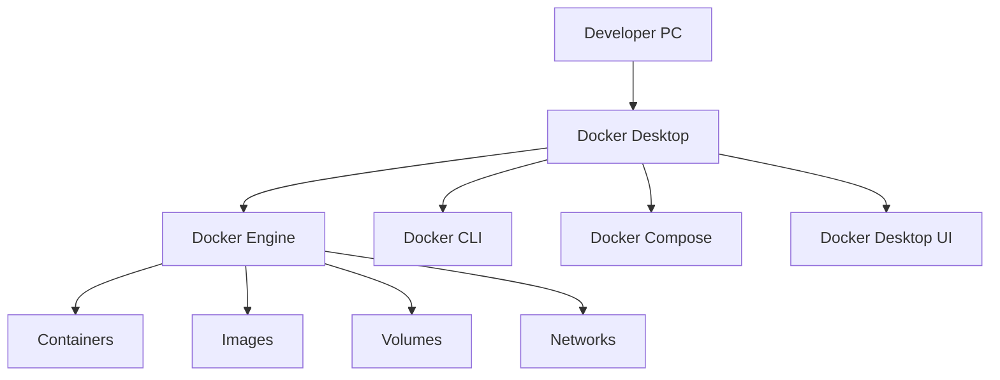

# macOS Docker Desktop 개요 및 공통 환경

## 1. 문서 목적

본 문서는 MicroServer 프로젝트에서 Docker Desktop을 사용하는 이유와
개발환경에서 필요한 Docker 공통 개념 및 운영 기준을 설명한다.

실제 Docker Desktop 다운로드, 설치 및 실행 검증은 운영체제별 설치 문서에서 진행한다.

```text
Docker Desktop 개요 및 공통 환경
        ↓
운영체제별 Docker Desktop 설치
        ↓
Oracle Database Free 로컬 개발환경 구성
```

macOS 설치:

**[macOS Docker Desktop 설치 가이드](docker_desktop_macos_setup.md)**

---

## 2. 개발환경 구성에서 Docker Desktop의 위치

MicroServer 개발환경은 다음 흐름으로 준비한다.


Docker Desktop을 독립적으로 준비하면 이후 Oracle뿐 아니라
Redis, Kafka 등 다른 개발용 Container 환경에도 동일한 실행 기반을 사용할 수 있다.

---

## 3. Docker Desktop의 역할

Docker Desktop은 macOS와 Windows에서 Container 개발환경을 사용할 수 있도록
Docker 관련 도구와 Desktop UI를 제공한다.



| 구성 | 역할 |
|---|---|
| Docker Engine | Image를 이용하여 Container 실행 |
| Docker CLI | `docker` 명령 제공 |
| Docker Compose | 여러 Container 구성을 YAML로 관리 |
| Docker Desktop UI | Container / Image / Volume 등의 상태 확인 |
| Docker Desktop Backend | macOS / Windows에서 Linux Container 실행 기반 제공 |

MicroServer의 로컬 개발환경은 **Linux Container 기반**을 사용한다.

OS별 Virtualization Backend와 설치 방식은 각 운영체제 설치 문서에서 다룬다.

---

### 3.1 VS Code Container Tools와 Docker Desktop

VS Code에 Container Tools Extension을 설치해도 Docker Engine이 설치되는 것은 아니다.

```text
VS Code
   ↓
Container Tools Extension
   ↓
Docker CLI
   ↓
Docker Engine
   ↓
Container
```

| 구분 | 역할 |
|---|---|
| VS Code Container Tools | VS Code에서 Container / Image / Registry 등을 조회하고 관리 |
| Docker Desktop | Docker Engine, Docker CLI, Docker Compose와 Desktop UI 제공 |

!!! important "Container Tools는 Container Runtime이 아님"
    Container Tools는 VS Code의 개발 지원 Extension이다.

    실제 Container를 실행하려면 Docker Desktop과 Docker Engine이 정상적으로 동작해야 한다.

---

## 4. Container를 사용하는 이유

Oracle Database와 같은 Server Software를 개발 PC에 직접 설치하면
OS별 설치 방법, Version, 설정 및 Service 상태가 개발자마다 달라질 수 있다.

Container 기반 환경에서는 동일한 Image를 기준으로 실행환경을 구성할 수 있다.

```text
동일 Image
    ↓
동일한 Server Software 구성
    ↓
개발자별 독립 실행
    ↓
삭제 / 재생성 용이
    ↓
로컬 개발환경 재현성 향상
```

특히 Database나 Middleware처럼 설치와 초기화가 복잡한 제품을
개발 PC에서 격리하여 운영할 때 유용하다.

---

## 5. Image / Container / Volume

Docker를 사용할 때 기본적으로 다음 세 개념을 구분한다.


### 5.1 Image

Server Software와 실행환경을 담은 Template이다.

예:

```text
Oracle Database Free Image
```

### 5.2 Container

Image를 기반으로 실제 실행되는 Instance이다.

예:

```text
microserver-oracle
```

### 5.3 Volume

Container Life Cycle과 분리하여 Data를 보관하는 저장 영역이다.

예:

```text
microserver-oracle-data
```

Database Container에서는 Container와 Volume의 차이가 중요하다.

```text
Container 삭제
≠
Database Data 삭제

Volume까지 삭제
=
Database Data 삭제 가능
```

Oracle Database 구성 문서에서 실제 Container와 Volume을 생성할 때 다시 확인한다.

---

## 6. Docker Compose

Docker Compose는 여러 Container와 관련 설정을 하나의 구성으로 관리할 때 사용한다.

현재 표준 명령 형식:

```bash
docker compose
```

Legacy Standalone Compose에서 사용하던 다음 형식은 새 MicroServer 가이드의 기본 명령으로 사용하지 않는다.

```bash
docker-compose
```

실제 Compose 파일은 이후 로컬 인프라 구성이 필요한 단계에서 작성한다.

---

## 7. Resource 및 Disk 관리

Database Container는 일반적인 경량 Application Container보다
Memory와 Disk를 더 많이 사용할 수 있다.

다음 항목을 고려한다.

- Host Memory
- Docker Desktop에서 사용할 수 있는 Resource
- Docker Image 저장 공간
- Named Volume 저장 공간
- SSD 여유 공간
- 동시에 실행하는 Container 수

현재 단계에서는 특정 Memory Limit을 MicroServer 표준값으로 강제하지 않는다.

Container를 사용하기 시작한 이후에는 필요에 따라 다음 명령으로 상태를 확인할 수 있다.

```bash
docker system df
docker ps -a
docker image ls
docker volume ls
```

---

## 8. Docker Desktop UI

Docker Desktop UI에서는 Container 환경의 주요 상태를 확인할 수 있다.

대표 영역:

```text
Containers
Images
Volumes
Builds
Settings
```

MicroServer 가이드에서는 CLI 명령을 기본 기준으로 사용하되,
Container Log나 상태를 빠르게 확인할 때 Docker Desktop UI를 함께 사용할 수 있다.

---

## 9. Docker Desktop 라이선스 및 회사 사용 정책

Docker Desktop은 사용 목적과 조직 규모에 따라 Subscription 조건이 달라질 수 있다.

회사 개발 PC에서 사용하는 경우 설치 시점의 Docker Subscription Service Agreement와
사내 정책을 확인한다.

확인 항목:

- 회사의 Docker Desktop 사용 정책
- 조직의 Docker Subscription 보유 여부
- 보안 Software와의 충돌 여부
- 개발 PC Virtualization 정책
- 관리자 권한 정책

!!! warning "제품별 사용 조건은 별도 확인"
    Docker Desktop과 Oracle Database Free는 서로 다른 제품이므로
    각각의 사용 조건을 별도로 확인한다.

---

## 10. 현재 단계에서 하지 않는 작업

현재 문서는 Docker Desktop의 역할과 공통 개념을 이해하는 단계이다.

다음 작업은 이후 문서에서 진행한다.

```text
Docker Desktop 실제 설치 / 실행 검증
Oracle Database Image Pull
Oracle Container / Volume 생성
Oracle Database 접속
Spring Boot Project와 Database 연결
Compose 구성 작성
```

---

## 11. 체크리스트

- [ ] Docker Desktop과 VS Code Container Tools의 역할 차이를 이해했다.
- [ ] MicroServer가 Linux Container 기반 로컬 환경을 사용한다는 것을 이해했다.
- [ ] Docker Engine / CLI / Compose의 역할을 이해했다.
- [ ] Image / Container / Volume의 차이를 이해했다.
- [ ] Docker Resource와 Disk 사용 특성을 이해했다.
- [ ] 회사 개발 PC에서는 Docker Desktop 사용 정책을 확인해야 함을 이해했다.
- [ ] 실제 설치와 동작 검증은 운영체제별 설치 문서에서 진행한다.
- [ ] 아직 Oracle Database Container를 구성하지 않았다.

---

## 12. 다음 단계

사용 중인 운영체제에 맞는 Docker Desktop 설치 문서를 진행한다.

macOS:

```text
docker_desktop_macos_setup.md
```

설치와 기본 검증이 완료되면 Oracle Database Free 로컬 개발환경 구성 단계로 이동한다.

## 참고

- [Docker Desktop 공식 다운로드](https://www.docker.com/products/docker-desktop/)
- [Get Docker Desktop](https://docs.docker.com/get-started/introduction/get-docker-desktop/)
- [Docker Desktop for Mac 설치](https://docs.docker.com/desktop/setup/install/mac-install/)
- [Docker Compose](https://docs.docker.com/compose/)
