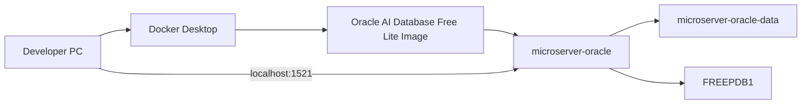

# macOS Oracle Database Free 설치 및 접속

## 1. 문서 목적

본 문서는 MicroServer 프로젝트의 로컬 Database 환경으로 사용할 **Oracle AI Database Free**를
Docker Desktop 위에 구성하고, 관리자 계정 `SYSTEM`으로 `FREEPDB1`에 정상 접속되는 상태까지 검증하는 절차를 설명한다.

현재 단계의 범위:

- Oracle 공식 Container Image Pull
- `ORACLE_PWD` 준비
- Named Volume 생성
- Oracle Container 생성
- Database Ready 상태 확인
- `SYSTEM`으로 `FREEPDB1` 접속 검증
- Container와 Database Data의 기본 운영 원칙

프로젝트 Tablespace와 `MICROSERVER` User는 다음 문서에서 구성한다.

**[Oracle Tablespace 및 프로젝트 사용자 구성](oracle_database_schema_setup.md)**

선행 문서:

- [Docker Desktop 개요 및 공통 환경](docker_desktop_setup.md)
- [macOS Docker Desktop 설치](docker_desktop_macos_setup.md)

---

## 2. 전체 구성



기본 구성값:

| 항목 | 값 |
|---|---|
| Host | `localhost` |
| Host Port | `1521` |
| Container Port | `1521` |
| Service Name | `FREEPDB1` |
| Admin User | `SYSTEM` |
| Container Name | `microserver-oracle` |
| Volume Name | `microserver-oracle-data` |
| Oracle Data Path | `/opt/oracle/oradata` |
| Image | `container-registry.oracle.com/database/free:latest-lite` |

전체 흐름:

```text
Docker Desktop 정상
        ↓
Oracle Image Pull
        ↓
ORACLE_PWD 준비
        ↓
Named Volume 생성
        ↓
Oracle Container 생성
        ↓
DATABASE IS READY TO USE! 확인
        ↓
SYSTEM → FREEPDB1 접속
        ↓
CON_NAME = FREEPDB1 확인
```

---

## 3. 사전 확인

Docker Desktop 설치 문서에서 기본 실행 검증을 완료한 상태를 전제로 한다.

현재 Terminal에서는 최소한 Docker Engine 연결 상태만 다시 확인한다.

```bash
docker version
```

정상 상태에서는 Client와 Server 정보가 모두 표시되어야 한다.

!!! warning "Docker Engine이 정상이 아니면 진행하지 않음"
    Server 연결 오류가 발생하면 Oracle Image Pull이나 Container 생성을 진행하지 않고
    Docker Desktop 상태를 먼저 확인한다.

### Apple Silicon Mac

Apple Silicon에서는 Oracle Image를 Pull하기 전에 다음 문서에서 ARM64 지원 상태를 확인한다.

**[Apple Silicon Oracle Docker 지원 및 검증](oracle_docker_apple_silicon_support.md)**

해당 문서의 핵심 확인 대상은 다음과 같다.

```text
Host  → arm64
Image → linux/arm64
```

Architecture 검증이 끝나면 본 문서의 공통 절차를 계속 진행한다.

---

## 4. Oracle Image Pull

MicroServer 로컬 Database는 Oracle이 제공하는 다음 Image를 사용한다.

```text
container-registry.oracle.com/database/free:latest-lite
```

Pull:

```bash
docker pull container-registry.oracle.com/database/free:latest-lite
```

확인:

```bash
docker image ls
```

Repository:

```text
container-registry.oracle.com/database/free
```

!!! note "`latest-lite`는 가변 Tag"
    `latest-lite`는 시간이 지나면 실제 Image가 변경될 수 있다.

    개발환경을 팀 표준으로 확정하는 시점에는 검증한 Version 또는 Digest를 기록한다.

Apple Silicon에서 Local Image Architecture를 확인하는 절차는 별도 Architecture 문서에서 다룬다.

---

## 5. Oracle SYSTEM Password 준비

Container 최초 구성 시 `SYS` / `SYSTEM` 계정에 사용할 Password를 `ORACLE_PWD`로 전달한다.

실제 Password를 Markdown이나 Git Repository에 기록하지 않는다.

현재 Terminal Session에서:

```bash
export ORACLE_PWD='<strong-local-password>'
```

설정 여부만 확인:

```bash
if [ -n "$ORACLE_PWD" ]; then echo "ORACLE_PWD is set"; else echo "ORACLE_PWD is not set"; fi
```

!!! important "Password 값은 출력하지 않음"
    확인할 때 `echo "$ORACLE_PWD"`처럼 실제 Password를 화면에 출력하지 않는다.

---

## 6. Named Volume 생성

Database Data를 Container Life Cycle과 분리하기 위해 Named Volume을 사용한다.

```bash
docker volume create microserver-oracle-data
```

확인:

```bash
docker volume ls
```

구조:

```text
microserver-oracle-data
        ↓
/opt/oracle/oradata
        ↓
Oracle Database Data
```

핵심:

```text
Container
→ Oracle 실행 Process

Named Volume
→ Oracle Database Data 보관
```

---

## 7. Oracle Container 생성

Container 생성:

```bash
docker run -d \
  --name microserver-oracle \
  -p 1521:1521 \
  -e ORACLE_PWD="$ORACLE_PWD" \
  -v microserver-oracle-data:/opt/oracle/oradata \
  container-registry.oracle.com/database/free:latest-lite
```

| 옵션 | 의미 |
|---|---|
| `-d` | Background 실행 |
| `--name microserver-oracle` | Container 이름 |
| `-p 1521:1521` | Host Port와 Oracle Listener Port 연결 |
| `-e ORACLE_PWD=...` | 최초 Database Password 전달 |
| `-v ...:/opt/oracle/oradata` | Database Data 영속화 |

Apple Silicon 표준 환경에서는 `--platform linux/amd64`를 기본 옵션으로 추가하지 않는다.

생성 상태:

```bash
docker ps
```

Container가 종료되어 있다면:

```bash
docker ps -a
docker logs microserver-oracle
```

---

## 8. Database Ready 확인

Container가 `Up` 상태라고 해서 Oracle Database가 즉시 접속 가능한 것은 아니다.

로그를 확인한다.

```bash
docker logs -f microserver-oracle
```

다음 메시지가 나타날 때까지 기다린다.

```text
DATABASE IS READY TO USE!
```

로그 Follow 종료:

```text
Control + C
```

```text
Container Running
        ↓
Oracle 초기화
        ↓
FREEPDB1 Open
        ↓
DATABASE IS READY TO USE!
        ↓
SQL 접속
```

---

## 9. 접속 정보 및 Port 확인

기본 접속 정보:

```text
Host         : localhost
Port         : 1521
Service Name : FREEPDB1
Admin User   : SYSTEM
Password     : ORACLE_PWD로 지정한 값
```

Host Port 확인:

```bash
nc -vz localhost 1521
```

!!! note "Port Open과 Database Ready는 다름"
    Port가 열려 있는 것만으로 Database 준비 완료를 판단하지 않는다.

    최종 기준은 다음과 같다.

    ```text
    Container Running
    + DATABASE IS READY TO USE!
    + FREEPDB1 SQL 접속 성공
    ```

---

## 10. SYSTEM으로 FREEPDB1 접속

Container 내부 SQL*Plus를 이용한다.

Password를 Command Line에 직접 넣지 않도록 Prompt 방식으로 접속한다.

```bash
docker exec -it microserver-oracle sqlplus SYSTEM@FREEPDB1
```

Password Prompt가 나타나면 Container 생성 시 지정한 Local Password를 입력한다.

정상 접속:

```text
SQL>
```

현재 PDB 확인:

```sql
SELECT sys_context('USERENV','CON_NAME') AS container_name FROM dual;
```

정상 결과:

```text
FREEPDB1
```

`CON_NAME`이 `FREEPDB1`이면 Oracle 기본 설치와 관리자 접속 검증이 완료된 것이다.

---

## 11. Container 운영과 Data 보존

중지:

```bash
docker stop microserver-oracle
```

다시 시작:

```bash
docker start microserver-oracle
```

Named Volume을 유지하므로 Stop / Start에서는 Database Data가 유지된다.

### Container만 삭제

```bash
docker rm -f microserver-oracle
```

Volume이 남아 있는지 확인한다.

```bash
docker volume ls
```

```text
microserver-oracle-data
```

### Database 완전 초기화

!!! danger "Database Data 전체 삭제"
    다음 작업은 Local Oracle Database Data를 삭제한다.

Container 제거:

```bash
docker rm -f microserver-oracle
```

Volume 제거:

```bash
docker volume rm microserver-oracle-data
```

핵심:

```text
Container 삭제
≠
Database Data 삭제

Named Volume 삭제
=
Database Data 삭제
```

---

## 12. 기존 Volume과 ORACLE_PWD

기존 Database Volume을 재사용하면서 Shell의 `ORACLE_PWD` 값만 변경해도
기존 Database Password가 자동으로 변경되는 것은 아니다.

```text
기존 Named Volume
        +
새 ORACLE_PWD
        ↓
기존 Database Password는 그대로일 수 있음
```

Password가 맞지 않을 때는 먼저 기존 Data를 유지할 것인지,
Volume까지 삭제하고 새 Database로 초기화할 것인지 결정한다.

---

## 13. 문제 해결

### 13.1 Container가 바로 종료됨

```bash
docker ps -a
docker logs microserver-oracle
```

확인 항목:

- Host Memory / Disk 여유 공간
- Oracle Image 상태
- Password 설정
- Named Volume 상태
- `1521` Port 충돌

### 13.2 1521 Port 충돌

```bash
lsof -i :1521
```

필요한 경우 Host Port를 변경할 수 있다.

```text
-p 1522:1521
```

이 경우 Host에서 접속할 JDBC URL도 `1522`를 사용해야 한다.

### 13.3 `ORA-12514`

다음을 확인한다.

```text
Service Name = FREEPDB1
Database Ready 완료 여부
```

로그:

```bash
docker logs -f microserver-oracle
```

### 13.4 SYSTEM Password가 맞지 않음

기존 Named Volume과 현재 `ORACLE_PWD`의 관계를 확인한다.

환경변수만 변경해도 기존 Database Password가 자동 변경되지는 않는다.

---

## 14. 보안 원칙

다음 정보는 Git Repository나 공유 개발환경 Package에 포함하지 않는다.

```text
SYSTEM Password
MICROSERVER Password
Production DB URL
Production DB User
Production DB Password
API Key / Token
```

Production Credential을 Local Database에 재사용하지 않는다.

---

## 15. 체크리스트

- [ ] Docker Engine이 정상이다.
- [ ] Apple Silicon이라면 Host / Image Architecture를 확인했다.
- [ ] Oracle 공식 `latest-lite` Image를 Pull했다.
- [ ] `ORACLE_PWD`를 실제 문서나 Git에 기록하지 않았다.
- [ ] `microserver-oracle-data` Named Volume을 생성했다.
- [ ] `microserver-oracle` Container가 실행 중이다.
- [ ] `DATABASE IS READY TO USE!`를 확인했다.
- [ ] `SYSTEM`으로 `FREEPDB1`에 접속할 수 있다.
- [ ] 현재 `CON_NAME`이 `FREEPDB1`이다.
- [ ] 아직 프로젝트 Tablespace / User를 생성하지 않았다.

---

## 16. 다음 단계

Oracle 기본 설치와 SYSTEM 접속 검증이 완료되면 프로젝트 Application Schema를 준비한다.

```text
Oracle Database Free 설치
        ↓
SYSTEM → FREEPDB1 접속 검증       ← 현재 완료
        ↓
MICROSERVER_DATA Tablespace
        ↓
MICROSERVER User
        ↓
권한 / Quota
```

**[Oracle Tablespace 및 프로젝트 사용자 구성](oracle_database_schema_setup.md)**

## 참고

- [Oracle AI Database Free - Get Started](https://www.oracle.com/database/free/get-started/)
- [Oracle Container Registry](https://container-registry.oracle.com/)
- [Apple Silicon Oracle Docker 지원 및 검증](oracle_docker_apple_silicon_support.md)
