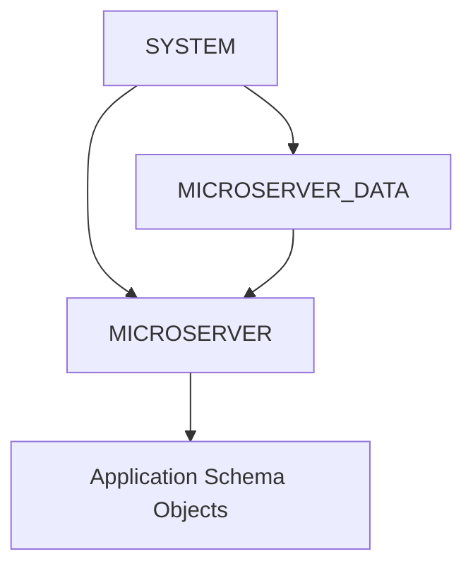

# macOS Oracle Tablespace 및 프로젝트 사용자 구성

## 1. 문서 목적

본 문서는 Oracle AI Database Free의 기본 설치와 `SYSTEM` 계정 접속이 완료된 이후,
MicroServer Application에서 사용할 **전용 Tablespace와 Schema User**를 구성하는 절차를 설명한다.

선행 문서:

**[Oracle Database Free 설치 및 접속](oracle_database_free_setup.md)**

현재 단계의 목표:

- `FREEPDB1` 접속 상태 확인
- 프로젝트 Tablespace `MICROSERVER_DATA` 생성
- `MICROSERVER` User 생성
- Default / Temporary Tablespace와 Quota 설정
- Application 개발에 필요한 기본 System Privilege 부여
- `MICROSERVER@FREEPDB1` 접속 검증

!!! tip "실행 SQL"
    SQL*Plus에서 실행할 SQL은 복사/붙여넣기 편의를 위해 가능한 한 한 줄 형태로 제공한다.

---

## 2. SYSTEM과 Application User 분리

Application에서 `SYSTEM` 계정을 사용하지 않는다.

```text
SYSTEM
→ Database 관리
→ Tablespace / User 구성

MICROSERVER
→ Application Schema
→ 업무 Object 소유
```



!!! warning "DBA Role을 기본 부여하지 않음"
    Local 개발환경이라도 `MICROSERVER`에 `DBA` Role을 습관적으로 부여하지 않는다.

    필요한 권한만 명시적으로 부여한다.

---

## 3. SYSTEM으로 FREEPDB1 확인

SYSTEM으로 접속한다.

```bash
docker exec -it microserver-oracle sqlplus SYSTEM@FREEPDB1
```

Password Prompt에서 Local SYSTEM Password를 입력한다.

현재 PDB:

```sql
SELECT sys_context('USERENV','CON_NAME') AS container_name FROM dual;
```

정상:

```text
FREEPDB1
```

!!! important "FREEPDB1에서 작업"
    프로젝트 Local User와 Tablespace는 `FREEPDB1`에 구성한다.

    `CDB$ROOT`에 잘못 생성하지 않도록 먼저 `CON_NAME`을 확인한다.

---

## 4. Tablespace 환경 확인

현재 `FREEPDB1`의 Tablespace 구성을 먼저 확인한다.

```sql
SELECT tablespace_name,contents,status FROM dba_tablespaces ORDER BY tablespace_name;
```

MicroServer 검증 환경에서는 다음과 같은 기본 구성이 확인되었다.

```text
SYSAUX     PERMANENT   ONLINE
SYSTEM     PERMANENT   ONLINE
TEMP       TEMPORARY   ONLINE
UNDOTBS1   UNDO        ONLINE
```

일반적인 Application용 `USERS` Tablespace는 존재하지 않았다.

환경마다 기본 Tablespace 구성이 다를 수 있으므로
`USERS`가 당연히 존재한다고 가정하지 않고 실제 조회 결과를 기준으로 한다.

### 4.1 Default Permanent Tablespace 확인

```sql
SELECT property_name,property_value FROM database_properties WHERE property_name='DEFAULT_PERMANENT_TABLESPACE';
```

MicroServer 검증 환경의 실제 실행 결과:

```text
PROPERTY_NAME
--------------------------------------------------------------------------------
PROPERTY_VALUE
--------------------------------------------------------------------------------
DEFAULT_PERMANENT_TABLESPACE
SYSTEM
```

즉 현재 `FREEPDB1`의 Default Permanent Tablespace는 `SYSTEM`이다.

```text
DEFAULT_PERMANENT_TABLESPACE
        ↓
      SYSTEM
```

이 상태에서 Default Tablespace를 지정하지 않고 Application User를 생성하면
`MICROSERVER`의 Default Tablespace가 `SYSTEM`으로 지정될 수 있다.

```sql
CREATE USER MICROSERVER IDENTIFIED BY "<local-password>";
```

`SYSTEM`은 Oracle System 관리 영역이므로 Application Object의 기본 저장공간으로 사용하지 않는다.

따라서 MicroServer에서는 다음 구조를 사용한다.

```text
SYSTEM
→ Oracle System 관리 영역

MICROSERVER_DATA
→ MicroServer Application 전용 영역
```

프로젝트 전용 `MICROSERVER_DATA` Tablespace를 먼저 생성한 뒤
`MICROSERVER` User의 Default Tablespace로 명시적으로 지정한다.

---

## 5. Datafile 위치 확인

`MICROSERVER_DATA` Tablespace를 생성하기 전에 Oracle이 Datafile 경로를 자동으로 관리하는지 확인한다.

### 5.1 Oracle Managed Files 설정 확인

```sql
SHOW PARAMETER db_create_file_dest;
```

MicroServer 검증 환경의 실제 실행 결과:

```text
NAME                                 TYPE        VALUE
------------------------------------ ----------- ------------------------------
db_create_file_dest                  string
```

`VALUE` 영역이 비어 있다.

즉 현재 검증 환경에서는 `db_create_file_dest`가 설정되어 있지 않으므로
`CREATE TABLESPACE` 실행 시 사용할 Datafile 위치를 명시적으로 결정해야 한다.

```text
db_create_file_dest
        ↓
     VALUE 없음
        ↓
기존 Datafile 경로 확인
        ↓
동일한 FREEPDB1 Directory 사용
```

### 5.2 기존 Datafile 경로 확인

현재 PDB에서 사용 중인 Datafile의 실제 위치를 조회한다.

```sql
SELECT tablespace_name,file_name FROM dba_data_files ORDER BY tablespace_name;
```

MicroServer 검증 환경의 실제 실행 결과:

```text
TABLESPACE_NAME
------------------------------
FILE_NAME
--------------------------------------------------------------------------------
SYSAUX
/opt/oracle/oradata/FREE/FREEPDB1/sysaux01.dbf

SYSTEM
/opt/oracle/oradata/FREE/FREEPDB1/system01.dbf
```

이 결과에서 `SYSAUX`와 `SYSTEM` Datafile이 모두 다음 Directory 아래에 있음을 확인할 수 있다.

```text
/opt/oracle/oradata/FREE/FREEPDB1/
```

따라서 MicroServer 프로젝트 Datafile도 같은 PDB Data Directory 아래에 생성한다.

```text
/opt/oracle/oradata/FREE/FREEPDB1/
├─ sysaux01.dbf
├─ system01.dbf
└─ microserver_data01.dbf       ← 생성 예정
```

!!! important "Datafile 경로 판단 기준"
    가이드에 적힌 경로를 무조건 사용하는 것이 아니라
    **현재 환경의 `dba_data_files` 조회 결과를 기준으로 Directory를 결정한다.**

    Image나 Database Version이 달라져 조회 경로가 다르다면
    실제 확인된 PDB Data Directory를 사용한다.

### 5.3 현재 검증 결과 정리

Tablespace 생성 전 확인 결과를 정리하면 다음과 같다.

| 확인 항목 | MicroServer 검증 결과 | 판단 |
|---|---|---|
| 현재 PDB | `FREEPDB1` | 프로젝트 Schema 구성 위치 |
| Default Permanent Tablespace | `SYSTEM` | Application용으로 사용하지 않음 |
| `db_create_file_dest` | 값 없음 | Datafile 경로 명시 필요 |
| 기존 Datafile Directory | `/opt/oracle/oradata/FREE/FREEPDB1/` | 프로젝트 Datafile 생성 위치 |
| Application Tablespace | 없음 | `MICROSERVER_DATA` 생성 필요 |

따라서 다음 단계에서 사용할 Datafile은 다음과 같다.

```text
/opt/oracle/oradata/FREE/FREEPDB1/microserver_data01.dbf
```

---

## 6. MICROSERVER_DATA Tablespace 생성

프로젝트 Tablespace:

```text
MICROSERVER_DATA
```

원본 검증 환경의 Datafile 경로를 기준으로 한 생성 SQL:

```sql
CREATE TABLESPACE MICROSERVER_DATA DATAFILE '/opt/oracle/oradata/FREE/FREEPDB1/microserver_data01.dbf' SIZE 100M AUTOEXTEND ON NEXT 100M MAXSIZE UNLIMITED;
```

설정:

| 설정 | 의미 |
|---|---|
| `SIZE 100M` | 최초 Datafile 크기 |
| `AUTOEXTEND ON` | 공간 부족 시 자동 확장 |
| `NEXT 100M` | 확장 단위 |
| `MAXSIZE UNLIMITED` | Oracle이 허용하는 범위에서 자동 확장 |

!!! note "Local 개발환경 기준"
    위 Size / Autoextend 정책은 Local 개발환경의 기본값이다.

    운영 DB의 Tablespace 정책은 실제 운영 기준에 따라 별도로 설계한다.

생성 확인:

```sql
SELECT tablespace_name,contents,status FROM dba_tablespaces WHERE tablespace_name='MICROSERVER_DATA';
```

Datafile:

```sql
SELECT tablespace_name,file_name,bytes/1024/1024 AS size_mb,autoextensible FROM dba_data_files WHERE tablespace_name='MICROSERVER_DATA';
```

---

## 7. MICROSERVER User 생성

새 환경에서는 **Tablespace를 먼저 만든 뒤 User를 생성**한다.

```sql
CREATE USER MICROSERVER IDENTIFIED BY "<local-password>" DEFAULT TABLESPACE MICROSERVER_DATA TEMPORARY TABLESPACE TEMP QUOTA UNLIMITED ON MICROSERVER_DATA;
```

구성:

```text
User                  MICROSERVER
Default Tablespace    MICROSERVER_DATA
Temporary Tablespace  TEMP
Quota                  UNLIMITED on MICROSERVER_DATA
```

!!! danger "Password 관리"
    `<local-password>`는 개발자 Local Password로 대체한다.

    실제 Password를 Markdown / Git에 기록하지 않고 Production Credential도 재사용하지 않는다.

---

## 8. 기본 개발 권한 부여

Application 개발에 필요한 기본 System Privilege를 명시적으로 부여한다.

```sql
GRANT CREATE SESSION TO MICROSERVER;
GRANT CREATE TABLE TO MICROSERVER;
GRANT CREATE SEQUENCE TO MICROSERVER;
GRANT CREATE VIEW TO MICROSERVER;
GRANT CREATE PROCEDURE TO MICROSERVER;
```

기본적으로 다음과 같은 광범위 권한은 부여하지 않는다.

```text
DBA
RESOURCE
UNLIMITED TABLESPACE
```

`MICROSERVER_DATA`에 필요한 Quota를 지정하는 구조를 사용한다.

---

## 9. 생성 결과 확인

User:

```sql
SELECT username,account_status,default_tablespace,temporary_tablespace FROM dba_users WHERE username='MICROSERVER';
```

정상 기준:

```text
USERNAME              MICROSERVER
ACCOUNT_STATUS         OPEN
DEFAULT_TABLESPACE     MICROSERVER_DATA
TEMPORARY_TABLESPACE   TEMP
```

System Privilege:

```sql
SELECT privilege FROM dba_sys_privs WHERE grantee='MICROSERVER' ORDER BY privilege;
```

예상:

```text
CREATE PROCEDURE
CREATE SEQUENCE
CREATE SESSION
CREATE TABLE
CREATE VIEW
```

Quota:

```sql
SELECT tablespace_name,username,bytes,max_bytes FROM dba_ts_quotas WHERE username='MICROSERVER';
```

핵심 확인:

```text
USERNAME         MICROSERVER
TABLESPACE_NAME  MICROSERVER_DATA
```

---

## 10. MICROSERVER 계정 접속 검증

SYSTEM Session을 종료한다.

```sql
exit
```

Password Prompt 방식으로 접속한다.

```bash
docker exec -it microserver-oracle sqlplus MICROSERVER@FREEPDB1
```

### 10.1 현재 User 확인

`MICROSERVER@FREEPDB1`으로 정상 접속되었는지 현재 User를 확인한다.

```sql
SELECT USER FROM dual;
```

MicroServer 검증 환경의 실제 실행 결과:

```text
USER
--------------------------------------------------------------------------------
MICROSERVER
```

즉 현재 SQL*Plus Session이 `MICROSERVER` 계정으로 연결되어 있음을 의미한다.

```text
SQL*Plus Session
        ↓
Current User
        ↓
MICROSERVER
```

!!! tip "접속 검증 핵심"
    `SELECT USER FROM dual;` 결과가 `MICROSERVER`이면
    Application Schema User로 정상 로그인된 상태이다.

### 10.2 현재 PDB 확인

현재 Session이 `FREEPDB1`에 연결되어 있는지도 확인한다.

```sql
SELECT sys_context('USERENV','CON_NAME') AS container_name FROM dual;
```

정상 기준:

```text
CONTAINER_NAME
--------------------------------------------------------------------------------
FREEPDB1
```

최종적으로 다음 두 조건이 모두 확인되어야 한다.

```text
User       → MICROSERVER
Container  → FREEPDB1
```

즉 최종 접속 상태는 다음과 같다.

```text
MICROSERVER@FREEPDB1
```

---

## 11. 기존 User가 있는 경우

이미 `MICROSERVER` User를 Tablespace 지정 없이 생성했다면 먼저 상태를 확인한다.

```sql
SELECT username,account_status,default_tablespace,temporary_tablespace FROM dba_users WHERE username='MICROSERVER';
```

Default Tablespace가 `SYSTEM`이라면 User를 삭제하지 않고 변경할 수 있다.

```sql
ALTER USER MICROSERVER DEFAULT TABLESPACE MICROSERVER_DATA TEMPORARY TABLESPACE TEMP;
```

Quota:

```sql
ALTER USER MICROSERVER QUOTA UNLIMITED ON MICROSERVER_DATA;
```

필요한 System Privilege가 없다면 8장의 기본 권한을 부여한다.

### `ORA-00959: tablespace 'USERS' does not exist`

다음과 같은 SQL에서 오류가 발생한다면:

```sql
ALTER USER MICROSERVER QUOTA UNLIMITED ON USERS;
```

현재 PDB에 `USERS` Tablespace가 실제로 존재하는지 확인한다.

```sql
SELECT tablespace_name,contents,status FROM dba_tablespaces ORDER BY tablespace_name;
```

MicroServer 표준에서는 `USERS`를 전제로 하지 않고 명시적인 `MICROSERVER_DATA` Tablespace를 사용한다.

---

## 12. Tablespace / User / Volume 관계

Oracle User 자체가 Tablespace 안에 저장되는 것은 아니다.

```text
MICROSERVER User / Schema
        ↓
Table / Index 등 Segment 생성
        ↓
MICROSERVER_DATA Tablespace
        ↓
microserver_data01.dbf
        ↓
/opt/oracle/oradata
        ↓
microserver-oracle-data Named Volume
```

따라서 Container를 삭제하더라도 Named Volume이 유지되면 Database Datafile은 유지될 수 있다.

Named Volume을 삭제하면 Oracle Database Data 자체가 삭제될 수 있으므로 주의한다.

---

## 13. 재구성 시 주의사항

User 삭제:

```sql
DROP USER MICROSERVER CASCADE;
```

`CASCADE`는 해당 User가 소유한 Schema Object까지 삭제하므로 실제 업무 Object가 존재하는 상태에서는 신중하게 사용한다.

Tablespace 삭제도 일반적인 개발 절차로 수행하지 않는다.

Local Database 전체 초기화가 목적이라면 개별 Object 삭제보다
Oracle Named Volume 전체 초기화가 필요한 상황인지 먼저 판단한다.

---

## 14. 현재 단계에서 하지 않는 작업

현재 완료 구조:

```text
FREEPDB1
   ↓
MICROSERVER_DATA
   ↓
MICROSERVER
```

다음 Object는 Project의 Database Schema 설계 이후 생성한다.

```text
Table
Sequence
Index
View
Procedure
Seed Data
Migration History
```

환경 확인 목적으로 임의의 업무 Table을 미리 만들지 않는다.

---

## 15. 보안 및 운영 원칙

- `SYSTEM`은 Application에서 사용하지 않는다.
- Application은 `MICROSERVER` 계정을 사용한다.
- Password를 Markdown / Git에 기록하지 않는다.
- Production Credential을 Local Database에 재사용하지 않는다.
- Local 환경이라고 `DBA` Role을 기본 부여하지 않는다.
- Tablespace와 Quota를 명시적으로 관리한다.
- 운영 Tablespace Size 정책은 운영 DBA 기준을 따른다.

---

## 16. 체크리스트

- [ ] `SYSTEM`으로 `FREEPDB1`에 접속했다.
- [ ] `CON_NAME`이 `FREEPDB1`이다.
- [ ] 실제 Tablespace와 Datafile Directory를 조회했다.
- [ ] `MICROSERVER_DATA` Tablespace를 생성했다.
- [ ] `MICROSERVER` User를 생성했다.
- [ ] Default Tablespace가 `MICROSERVER_DATA`이다.
- [ ] Temporary Tablespace가 `TEMP`이다.
- [ ] `MICROSERVER_DATA` Quota가 설정되어 있다.
- [ ] 필요한 System Privilege만 부여했다.
- [ ] `DBA` Role을 부여하지 않았다.
- [ ] `MICROSERVER@FREEPDB1`으로 접속할 수 있다.
- [ ] `SELECT USER FROM dual;` 결과가 `MICROSERVER`이다.
- [ ] 아직 업무 Schema Object를 생성하지 않았다.

---

## 17. 다음 단계

Oracle 프로젝트 Schema 준비가 완료되면 Spring Boot의 Database 연계 단계로 이동한다.

```text
MICROSERVER_DATA / MICROSERVER 완료       ← 현재 완료
        ↓
Oracle JDBC Driver
        ↓
Spring Boot Datasource
        ↓
Local Profile / Secret
        ↓
Schema / Migration
        ↓
DAO / Persistence
        ↓
Transaction
```

## 관련 문서

- [Oracle Database Free 설치 및 접속](oracle_database_free_setup.md)
- [Docker Desktop 개요 및 공통 환경](docker_desktop_setup.md)
- [macOS Docker Desktop 설치](docker_desktop_macos_setup.md)
- [Apple Silicon Oracle Docker 지원 및 검증](oracle_docker_apple_silicon_support.md)
