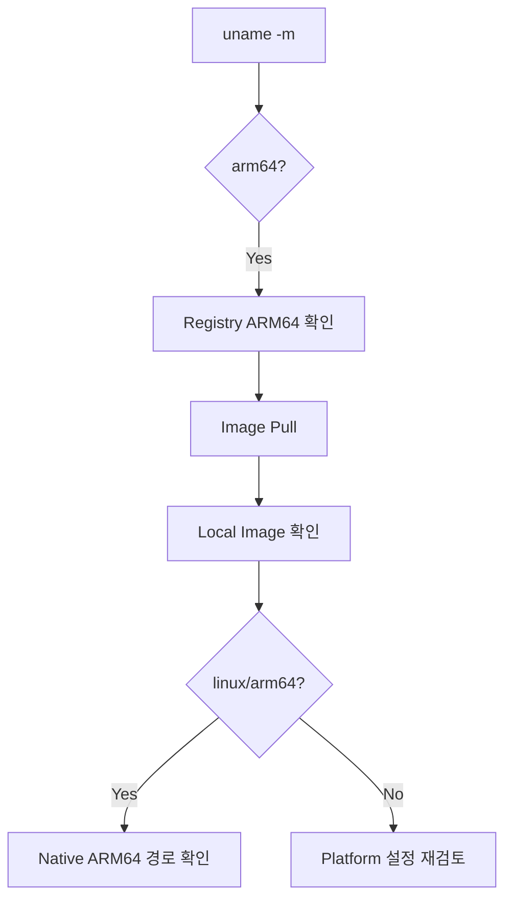

# Apple Silicon Oracle Docker 지원 및 검증 가이드

## 1. 문서 목적

본 문서는 Apple Silicon Mac에서 Oracle Database Container를 사용할 때
과거의 x86_64 / ARM64 호환성 문제와 현재 Oracle AI Database Free의 ARM64 지원을 구분하고,
MicroServer에서 사용하는 Image가 **Native ARM64 환경으로 실행되는지 검증**하는 방법을 설명한다.

일반적인 Oracle 설치 절차는 반복하지 않는다.

- Image Pull / Volume / Container 생성 → [Oracle Database Free 설치 및 접속](oracle_database_free_setup.md)
- Tablespace / `MICROSERVER` User → [Oracle Tablespace 및 프로젝트 사용자 구성](oracle_database_schema_setup.md)

현재 문서는 Apple Silicon 특화 항목만 다룬다.

```text
Host Architecture
        ↓
Registry Platform
        ↓
Local Image Architecture
        ↓
AMD64 강제 설정 여부
        ↓
Native ARM64 판정
```

---

## 2. 과거 문제와 현재 기준

Apple Silicon 초기에는 Oracle Database Container Image가 주로 x86_64 환경을 기준으로 제공되어
Emulation이나 별도 우회 구성이 필요한 경우가 있었다.

```text
과거
Apple Silicon arm64
        ↓
x86_64 Oracle Image
        ↓
Emulation / 우회
```

원본 문서 기준으로 Oracle은 2024년 11월 Oracle Database 23ai Free의
Arm 기반 Apple Mac용 Container Image 지원을 발표했으며,
현재 Free 계열의 ARM64 지원을 MicroServer 검증 기준으로 사용한다.

현재 MicroServer 기준:

```text
Host              Apple Silicon Mac
Host Architecture arm64
Docker             Docker Desktop for Apple silicon
Oracle Image       container-registry.oracle.com/database/free:latest-lite
Expected Platform  linux/arm64
AMD64 강제 옵션     사용하지 않음
```

!!! important "과거 Oracle Version과 구분"
    현재 Free Image의 ARM64 지원이 모든 과거 Oracle Database Version / Edition까지
    Native ARM64를 지원한다는 의미는 아니다.

    MicroServer에서는 현재 사용하는 Oracle AI Database Free Image를 기준으로 판단한다.

---

## 3. Host Architecture 확인

```bash
uname -m
```

Apple Silicon 정상 결과:

```text
arm64
```

`x86_64`라면 현재 Apple Silicon 검증 문서의 대상이 아니다.

Docker Desktop도 Apple Silicon용 Package를 사용하는 것을 기본으로 한다.

---

## 4. Registry Platform 확인

Image를 Pull하기 전에 Registry Manifest를 확인할 수 있다.

```bash
docker buildx imagetools inspect \
  container-registry.oracle.com/database/free:latest-lite
```

확인 대상:

```text
linux/arm64
```

`latest-lite`는 가변 Tag이므로 실제 개발환경 구성 시점의 Manifest를 직접 확인한다.

특정 Digest를 이 문서에 영구 고정하지 않는다.

---

## 5. AMD64 강제 설정 확인

현재 MicroServer 표준은 Native ARM64 실행이다.

따라서 기본 실행 명령에 다음 옵션을 넣지 않는다.

```text
--platform linux/amd64
```

또한 과거 다른 프로젝트에서 설정한 환경변수가 남아 있는지 확인한다.

```bash
echo "$DOCKER_DEFAULT_PLATFORM"
```

다음 값이 강제되어 있다면 주의한다.

```text
linux/amd64
```

현재 Shell에서 임시 해제:

```bash
unset DOCKER_DEFAULT_PLATFORM
```

Shell 초기화 파일에 영구 설정되어 있다면 다른 프로젝트에 미치는 영향을 확인한 뒤 조정한다.

MicroServer Oracle 환경에서는 다음을 기본 전제로 하지 않는다.

```text
Rosetta 기반 Oracle 실행
QEMU Emulation
x86_64 Docker VM
Colima x86_64 우회
```

---

## 6. Image Pull 및 Local Architecture 확인

일반 Oracle 가이드와 동일한 Image를 Pull한다.

```bash
docker pull container-registry.oracle.com/database/free:latest-lite
```

Local Image Architecture:

```bash
docker image inspect \
  container-registry.oracle.com/database/free:latest-lite \
  --format '{{.Os}}/{{.Architecture}}'
```

Apple Silicon Native 기대값:

```text
linux/arm64
```

정상 조합:

```text
Host  : arm64
Image : linux/arm64
```

주의 조합:

```text
Host  : arm64
Image : linux/amd64
```

---

## 7. linux/amd64 Image가 확인되는 경우

바로 Emulation 옵션을 추가하지 않고 다음을 먼저 확인한다.

- `DOCKER_DEFAULT_PLATFORM`이 `linux/amd64`로 설정되어 있는가?
- Pull 또는 Run 명령에 `--platform linux/amd64`가 들어갔는가?
- Docker Desktop이 Apple Silicon용인가?
- 기존 Local Image가 과거에 받은 Image인가?

필요한 경우 기존 Container 사용 여부를 먼저 확인한다.

```bash
docker ps -a
```

Image를 다시 받아야 한다면 기존 Database Data와의 관계를 확인한 뒤 진행한다.

```bash
docker image rm container-registry.oracle.com/database/free:latest-lite
docker pull container-registry.oracle.com/database/free:latest-lite
```

다시 확인:

```bash
docker image inspect \
  container-registry.oracle.com/database/free:latest-lite \
  --format '{{.Os}}/{{.Architecture}}'
```

!!! warning "Image와 Volume은 다름"
    Image를 정리하는 작업과 Named Volume을 삭제하는 작업은 별개이다.

    기존 Oracle Database Data가 필요하다면 `microserver-oracle-data` Volume을 삭제하지 않는다.

---

## 8. Native ARM64 판정

Architecture 문서의 핵심 판정은 다음 두 항목이다.

```text
Mac CPU       → arm64
Oracle Image  → linux/arm64
```



여기까지 확인되면 Apple Silicon Architecture 검증은 완료된다.

실제 Oracle Container 생성, `DATABASE IS READY TO USE!`, `FREEPDB1` 접속은
**Oracle Database Free 설치 및 접속 문서**에서 이어서 검증한다.

---

## 9. Architecture 관련 문제 해결

### 9.1 `exec format error`

가장 먼저 Host와 Image Architecture를 비교한다.

```bash
uname -m
```

```bash
docker image inspect \
  container-registry.oracle.com/database/free:latest-lite \
  --format '{{.Os}}/{{.Architecture}}'
```

불일치 예:

```text
Host  : arm64
Image : linux/amd64
```

현재 Free Image의 ARM64 경로를 사용하는 경우에는
Emulation을 먼저 추가하기보다 Platform 설정이 왜 AMD64를 선택했는지 확인한다.

### 9.2 Platform Warning

다음과 같은 Platform 불일치 Warning이 나타난다면:

```text
requested image's platform ...
does not match the detected host platform ...
```

확인 순서:

```text
uname -m
        ↓
DOCKER_DEFAULT_PLATFORM
        ↓
Local Image Architecture
        ↓
docker pull / run의 --platform 옵션
        ↓
Docker Desktop Package
```

### 9.3 Container 기동 문제

Host와 Image가 모두 ARM64인데 Container가 정상 기동하지 않는다면
모든 문제를 Architecture 문제로 판단하지 않는다.

일반 Oracle 가이드에서 다음을 확인한다.

```bash
docker ps -a
docker logs microserver-oracle
```

Memory, Disk, Volume, Password, Port 등의 일반 Container 원인도 확인한다.

---

## 10. Version / Tag 관리

`latest-lite`는 가변 Tag이다.

팀 표준 환경을 확정할 때는 실제 Image 정보를 확인한다.

```bash
docker image inspect container-registry.oracle.com/database/free:latest-lite
```

Repo Digest:

```bash
docker image inspect \
  container-registry.oracle.com/database/free:latest-lite \
  --format '{{json .RepoDigests}}'
```

ARM64 지원 확인뿐 아니라 팀 개발환경 재현성을 위해
검증한 Version / Digest를 기록할 수 있다.

---

## 11. 체크리스트

- [ ] Apple Silicon Mac에서 `uname -m` 결과가 `arm64`이다.
- [ ] Apple Silicon용 Docker Desktop을 사용한다.
- [ ] Registry Manifest에서 `linux/arm64` 지원을 확인했다.
- [ ] Oracle 공식 `latest-lite` Image를 사용한다.
- [ ] Local Image가 `linux/arm64`이다.
- [ ] `--platform linux/amd64`를 기본 옵션으로 사용하지 않는다.
- [ ] `DOCKER_DEFAULT_PLATFORM=linux/amd64`가 강제되지 않았다.
- [ ] QEMU / Rosetta를 Oracle 실행의 기본 전제로 하지 않는다.
- [ ] 실제 Container 실행과 FREEPDB1 접속은 Oracle 설치 문서에서 계속 검증한다.

---

## 12. 다음 단계

Apple Silicon Architecture 검증이 완료되면 일반 Oracle 설치 절차로 돌아간다.

```text
Host = arm64
        ↓
Image = linux/arm64             ← 현재 완료
        ↓
Oracle Container 생성
        ↓
DATABASE IS READY TO USE!
        ↓
SYSTEM → FREEPDB1
```

**[Oracle Database Free 설치 및 접속](oracle_database_free_setup.md)**

## 참고

- [Oracle Database Blog - Oracle Database 23ai Free Container Images for Arm-based Apple Mac](https://blogs.oracle.com/database/announcing-oracle-database-23ai-free-container-images-for-armbased-apple-macbook-computers)
- [Oracle Database Container Images](https://github.com/oracle/docker-images/tree/main/OracleDatabase/SingleInstance)
- [Oracle AI Database Free - Get Started](https://www.oracle.com/database/free/get-started/)
- [Docker Buildx Imagetools Inspect](https://docs.docker.com/reference/cli/docker/buildx/imagetools/inspect/)
- [Docker Image Inspect](https://docs.docker.com/reference/cli/docker/image/inspect/)
