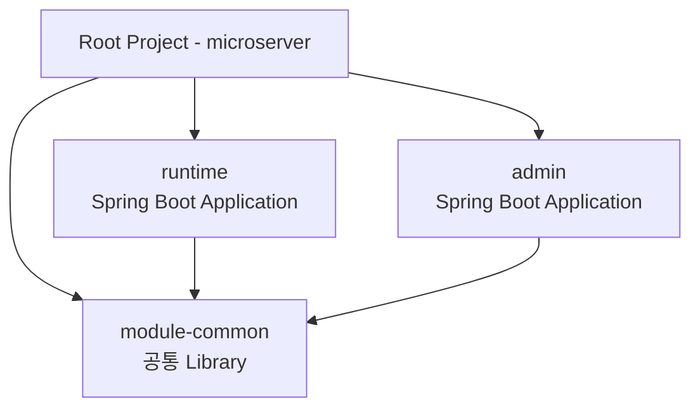
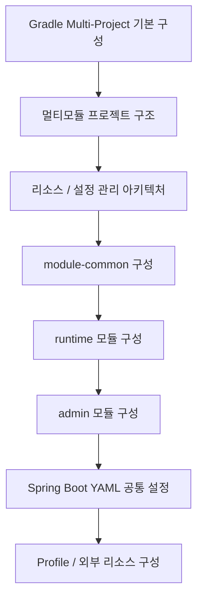

# 멀티모듈 프로젝트 구조

## 1. 문서 목적

본 문서는 Gradle Multi-Project 구성이 완료된 이후,
MicroServer의 각 Subproject를 **어떤 책임과 의존 방향으로 운영할 것인지** 정의한다.

이 문서는 `settings.gradle`, Root `build.gradle`, Project Dependency를 만드는 절차를 다시 설명하는 문서가 아니다.
해당 Build 구성 절차는 선행 문서인 **Gradle Multi-Project 기본 구성**에서 다룬다.

이 단계에서는 다음을 확정한다.

- Root Project와 Subproject의 역할
- Library Module과 실행 Application의 구분
- Module Dependency 방향
- Java Source / Resource의 소유 원칙
- `local-resource`와 JAR 내부 Resource의 경계
- Module별 Build / Test / Release 경계
- 향후 Module을 추가할 때의 판단 기준

선행 문서:

- `01_project_start/03_project_creation/project_structure/gradle_multi_module_setup.md`

관련 문서:

- [리소스 / 설정 관리 아키텍처](resource_configuration_architecture.md)
- [module-common 구성](module_common.md)
- [runtime 모듈 구성](runtime_module.md)
- [admin 모듈 구성](admin_module.md)

---

## 2. Build 구조와 Framework 구조를 구분한다

MicroServer 문서에서는 다음 두 단계를 명확히 구분한다.

```text
프로젝트 생성 / Build 구조
        ↓
Gradle Multi-Project 기본 구성

공통 기능 개발 / Framework 구조
        ↓
각 Module의 책임과 Resource 운영
```

즉 다음은 **프로젝트 생성 단계**의 관심사이다.

```text
settings.gradle
Root build.gradle
Subproject build.gradle
Gradle Project Dependency
전체 Build
개별 Module Build
```

반면 본 문서부터는 다음이 관심사이다.

```text
module-common은 무엇을 제공하는가?
runtime은 무엇을 소유하는가?
admin은 무엇을 소유하는가?
공통 설정은 어디에 두는가?
SQL과 Resource는 어느 Module에 두는가?
환경설정은 JAR 안에 둘 것인가 밖에 둘 것인가?
```

!!! important "같은 멀티모듈을 두 번 설명하지 않음"
    `01_project_start`의 Gradle 문서는 **구축 방법**을 설명하고,
    `02_framework`의 문서는 **운영 구조와 설계 원칙**을 설명한다.

---

## 3. 기본 Module 모델

초기 MicroServer는 다음 세 역할을 기준으로 한다.



### Root Project

역할:

```text
전체 Build Entry Point
Subproject 구성
공통 Build 정책
Plugin / Repository / Version 기준
```

Root 자체에는 업무 Java Source를 두지 않는 것을 기본으로 한다.

### module-common

역할:

```text
재사용 가능한 공통 Java 기능
공통 Exception / Response / Utility
공통 Framework 지원 기능
공통 기능이 직접 사용하는 Resource
공통 기능이 직접 사용하는 Mapper SQL
```

`module-common`은 실행 Application이 아니다.

### runtime

역할:

```text
실제 Runtime Spring Boot Application
업무 API / Runtime 기능
Application 시작점
Runtime 전용 Resource / SQL
실행환경 Configuration 연결
```

### admin

역할:

```text
관리자 Spring Boot Application
관리 기능 / 관리 API
Admin 전용 Resource / SQL
필요 시 Template / Static Resource
실행환경 Configuration 연결
```

---

## 4. Module과 Layer를 구분한다

Module은 Build와 Dependency의 경계이다.

```text
Module
→ Build / Dependency / 배포 경계
```

Layer는 Module 내부의 역할 분리이다.

```text
Controller
Service
Repository / Mapper
Domain
Configuration
```

따라서 다음처럼 Controller / Service / Mapper를 무조건 별도 Gradle Project로 나누지 않는다.

```text
X controller-module
X service-module
X mapper-module
```

초기에는 실제 기능과 의존 경계가 확인된 단위만 Module로 분리한다.

---

## 5. Dependency 방향

기본 Dependency 방향은 다음과 같다.

```text
runtime ──────► module-common
admin   ──────► module-common
```

금지:

```text
module-common ──────► runtime
module-common ──────► admin
```

Common이 실행 Application을 참조하기 시작하면 Common JAR의 재사용성이 떨어지고
Dependency Cycle이 발생할 가능성이 커진다.

### 업무 Module이 추가되는 경우

향후 실제 업무 경계가 확인되면 다음처럼 확장할 수 있다.

```text
runtime
  ├─► module-common
  ├─► module-customer
  └─► module-account
```

이때도 하위 업무 Module이 `runtime`의 Application Class나 Controller에 의존하지 않도록 한다.

---

## 6. Source와 Resource의 소유 원칙

MicroServer의 기본 원칙은 다음과 같다.

> **Java 코드와 그 코드가 직접 사용하는 Resource는 가능한 한 같은 Module이 소유한다.**

예:

```text
module-common
├─ CommonCodeService.java
├─ CommonCodeMapper.java
└─ src/main/resources/mybatis/common/CommonCodeMapper.xml
```

세 파일이 하나의 공통 기능을 구성한다면 같은 Module에 둔다.

이 원칙을 사용하면 다음이 일치한다.

```text
기능 변경 단위
Build 단위
Test 단위
Version 관리 단위
Resource 배포 단위
```

---

## 7. JAR 내부 Resource와 외부 Resource

Resource는 크게 두 종류로 구분한다.

### Module과 함께 Versioning해야 하는 Resource

```text
Mapper XML
Message Bundle
Template
Static Resource
Framework Metadata
Module Default Config
```

위 Resource는 해당 Module의:

```text
src/main/resources
```

에 둔다.

### 실행환경에 따라 달라지는 Resource

```text
DB 접속정보
외부 API URL
실제 인증서 / Private Key
Local 실행 설정
환경별 Logging Override
환경별 Secret
```

위 Resource는 JAR와 분리하여 외부 Configuration으로 관리한다.

자세한 기준은 [리소스 / 설정 관리 아키텍처](resource_configuration_architecture.md)에서 다룬다.

---

## 8. `local-resource`의 위치

초기 개념 구조:

```text
microserver/
├─ module-common/
├─ runtime/
├─ admin/
└─ local-resource/
```

`local-resource`는 새로운 업무 Module이 아니다.

역할:

```text
개발 / 실행환경 외부 Resource
Local Configuration
개발 인증서
개발 DB 초기화 Resource
환경별 Override Template
```

다음은 넣지 않는다.

```text
업무 Mapper SQL
Common Mapper SQL
Module Java와 같이 Release되어야 하는 Resource
일반 Dependency JAR
```

---

## 9. Configuration도 Module 책임을 따른다

설정 파일은 단순히 한곳에 모으는 것이 목적이 아니다.

다음 세 계층으로 본다.

```text
Framework Common
        ↓
Application / Module
        ↓
Environment Override
```

예:

```text
MyBatis 공통 정책
→ Common

spring.application.name
기본 server.port
→ runtime / admin

DB URL / Password
외부 API 주소
→ Environment
```

---

## 10. Build Artifact 기준

초기 목표 Artifact는 다음과 같다.

```text
module-common
→ 일반 Library JAR

runtime
→ 실행 가능한 Spring Boot JAR

admin
→ 실행 가능한 Spring Boot JAR
```

`module-common`을 사용하는 개발자가 JAR 파일을 수동 복사하지 않는다.

Gradle Project Dependency를 사용한다.

```groovy
dependencies {
    implementation project(':module-common')
}
```

---

## 11. Module 추가 판단 기준

다음 이유만으로 Module을 추가하지 않는다.

```text
Directory가 많아 보여서
Package가 커 보여서
클래스 종류가 달라서
나중에 쓸 것 같아서
```

다음 질문에 명확히 답할 수 있을 때 분리를 검토한다.

```text
독립적인 책임이 있는가?
Dependency 경계를 만들 필요가 있는가?
독립 Build / Test 가치가 있는가?
여러 Application이 재사용하는가?
Release 주기가 달라질 가능성이 있는가?
```

---

## 12. 초기에는 과도하게 공통화하지 않는다

다음 구조를 처음부터 만들지 않는다.

```text
module-common-util
module-common-web
module-common-data
module-common-security
module-common-config
module-common-log
...
```

초기에는 `module-common`에서 실제 공통 기능을 관찰한다.

공통 Module이 비대해지고 책임이 분명해졌을 때만 추가 Module로 분리한다.

---

## 13. 문서 진행 순서



---

## 14. 체크리스트

- [ ] Gradle Build 구성 문서와 Framework 구조 문서의 역할을 구분했다.
- [ ] Root에는 실제 업무 Source를 두지 않는다.
- [ ] `module-common`은 실행 Application이 아니다.
- [ ] `runtime`, `admin`은 실행 가능한 Spring Boot Application이다.
- [ ] `runtime`, `admin`에서 `module-common`으로 단방향 Dependency를 유지한다.
- [ ] Java 코드와 직접 연관된 Resource는 같은 Module이 소유한다.
- [ ] 환경별 값은 Module JAR와 분리한다.
- [ ] `local-resource`를 모든 Resource의 보관 장소로 사용하지 않는다.
- [ ] 실제 책임이 확인되기 전에 Module을 과도하게 분리하지 않는다.

---

## 15. 다음 단계

다음 문서에서는 설정과 Resource의 소유 위치를 구체적으로 정의한다.

→ [리소스 / 설정 관리 아키텍처](resource_configuration_architecture.md)
