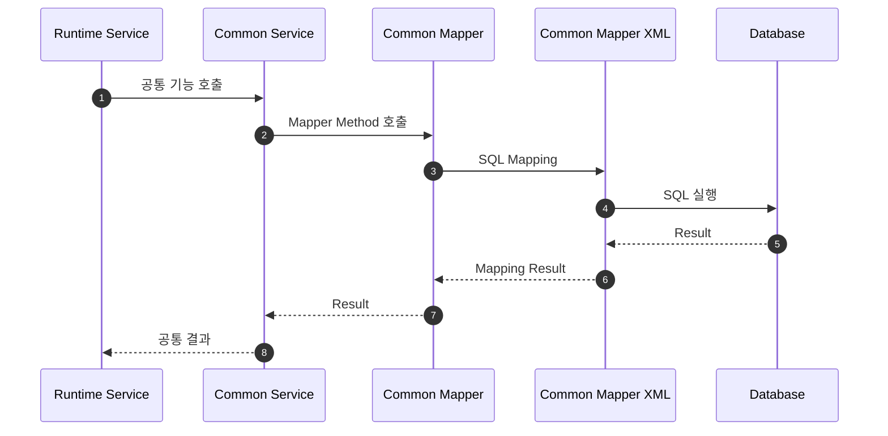

# MyBatis 구성

## 1. 문서 목적

본 문서는 MicroServer Multi-Project 환경에서 MyBatis를 구성할 때
**MyBatis Engine 설정, Mapper Interface, Mapper XML, Module Resource의 책임을 분리**하는 기준을 정의한다.

특히 다음을 해결한다.

- Common JAR 안의 Mapper XML을 실행 Application에서 사용할 수 있는가?
- Mapper SQL은 `local-resource`에 둘 것인가 Module에 둘 것인가?
- `mybatis-config.xml`과 Mapper XML은 무엇이 다른가?
- `classpath*:`를 왜 사용하는가?
- Mapper Interface Scan과 Mapper XML Scan은 어떻게 다른가?
- Common SQL을 업무 Application에서 어떤 경계로 사용할 것인가?

Datasource 자체의 생성 / Connection Pool 설정은 선행 `DataSource 구성` 문서에서 다룬다.

관련 문서:

- [리소스 / 설정 관리 아키텍처](../01_project_structure/resource_configuration_architecture.md)
- [module-common 구성](../01_project_structure/module_common.md)
- [Spring Boot YAML 공통 설정](../01_project_structure/spring_boot_configuration.md)

---

## 2. 가장 중요한 원칙

> **Java 코드와 그 코드가 직접 사용하는 Mapper SQL은 같은 Module이 소유한다.**

예:

```text
module-common
├─ CommonCodeService.java
├─ CommonCodeMapper.java
└─ src/main/resources/mybatis/common/CommonCodeMapper.xml
```

Common 기능의 Java와 SQL이 하나의 Build / Test / Version 단위가 된다.

---

## 3. MyBatis 구성 요소를 구분한다

### MyBatis Engine / Integration 설정

예:

```text
mapper-locations
mapUnderscoreToCamelCase
jdbcTypeForNull
executorType
typeAliasesPackage
typeHandlersPackage
```

### Mapper Interface

Java에서 SQL Mapping을 호출하는 Interface이다.

### Mapper XML

실제 SQL / ResultMap / SQL Fragment를 가진다.

```text
<select>
<insert>
<update>
<delete>
<resultMap>
<sql>
```

이 세 책임을 섞지 않는다.

---

## 4. `mybatis-config.xml`과 Mapper XML 차이

기존 Project의:

```text
local-resource/config/mybatis/mybatis-config.xml
```

은 일반적으로 MyBatis Engine 설정 파일이다.

```text
mybatis-config.xml
→ MyBatis가 어떻게 동작할 것인가

CommonCodeMapper.xml
→ 어떤 SQL을 실행할 것인가
```

새 프로젝트에서는 단순 Engine 설정을 Spring Boot YAML로 표현할 수 있다.

---

## 5. 기본 Mapper Resource 구조

```text
module-common/
└─ src/main/resources/mybatis/common/
   ├─ CommonCodeMapper.xml
   └─ SequenceMapper.xml

runtime/
└─ src/main/resources/mybatis/runtime/
   ├─ RuntimeJobMapper.xml
   └─ RuntimeStatusMapper.xml

admin/
└─ src/main/resources/mybatis/admin/
   ├─ AdminUserMapper.xml
   └─ AdminRoleMapper.xml
```

Module별 Namespace를 Directory에서도 구분한다.

---

## 6. Mapper SQL을 `local-resource`에 두지 않는다

지양:

```text
local-resource/mybatis/
├─ common/
├─ runtime/
└─ admin/
```

이렇게 하면 Java Module Version과 SQL Version이 분리된다.

문제:

```text
Common Java JAR는 Version A
SQL Directory는 Version B
```

어떤 SQL이 어떤 Java API와 한 세트인지 추적하기 어려워진다.

---

## 7. Gradle Resource Packaging

Gradle Java / Java Library Plugin의 표준 Production Resource 위치는:

```text
src/main/resources
```

이다.

해당 Resource는 Production Output과 JAR에 포함된다.

예:

```text
module-common.jar
├─ io/.../CommonCodeService.class
├─ io/.../CommonCodeMapper.class
└─ mybatis/common/CommonCodeMapper.xml
```

따라서 Common JAR는 Java와 SQL을 같이 제공할 수 있다.

---

## 8. 실행 Application에서 Common JAR 사용

Runtime:

```groovy
dependencies {
    implementation project(':module-common')
}
```

Admin:

```groovy
dependencies {
    implementation project(':module-common')
}
```

Gradle Project Dependency가 Runtime Classpath에 Common Resource도 제공한다.

개발 중 JAR를 수동 복사하지 않는다.

---

## 9. `mapper-locations`

MyBatis Spring Boot Starter는 `mapper-locations` Property로 Mapper XML 위치를 지정할 수 있다.

MicroServer 공통 Pattern 예:

```yaml
mybatis:
  mapper-locations: classpath*:/mybatis/**/*.xml
```

이 설정은 여러 Module / Dependency JAR에 나뉜 Mapper XML을 하나의 규칙으로 검색하기 위한 기준이다.

---

## 10. 왜 `classpath*:`를 사용하는가

Spring의 Resource Pattern Resolver는 `classpath*:` Prefix를 사용하여
Classpath의 여러 위치에서 같은 Pattern의 Resource를 찾을 수 있다.

개념:

```text
runtime classes/resources
        +
module-common.jar resources
        +
기타 업무 module jar resources
        ↓
classpath*:/mybatis/**/*.xml
```

`classpath*:`와 Ant-style Pattern 조합은 JAR 환경에서 충분히 검증해야 한다.
특히 Pattern 앞에 고정된 Root Directory인 `/mybatis/`를 두어 검색 기준을 명확히 한다.

---

## 11. Mapper Interface Scan과 XML Scan은 다르다

다음 두 작업은 별개이다.

```text
Mapper Interface를 Spring Bean으로 등록
Mapper XML Resource를 SqlSessionFactory가 읽음
```

둘 다 정상이어야 한다.

### Mapper Interface 등록

방법 후보:

```text
@Mapper
@MapperScan
```

### Mapper XML 검색

```text
mybatis.mapper-locations
```

XML이 JAR에 있다고 Mapper Interface Bean이 자동으로 생긴다고 단정하지 않는다.

---

## 12. Multi-Module Mapper Scan

여러 Module의 Mapper Interface가 존재하면 Scan 범위를 명확하게 구성한다.

예시 개념:

```java
@MapperScan({
    "io.github.microserverlab.microserver.common.mapper",
    "io.github.microserverlab.microserver.runtime.mapper"
})
```

실제 Base Package는 프로젝트 Package Architecture가 확정된 뒤 적용한다.

Package 문자열이 커지면 Marker Class 기반 Scan 방식도 검토할 수 있다.

---

## 13. Mapper Interface와 XML Namespace

권장:

```text
CommonCodeMapper.java
CommonCodeMapper.xml
```

XML Namespace는 Mapper Interface의 FQCN과 일치하도록 구성한다.

개념:

```xml
<mapper namespace="io.github....CommonCodeMapper">
```

Statement ID와 Java Method 이름도 일관되게 관리한다.

---

## 14. Common SQL 사용 흐름

권장:



Runtime은 Common Mapper XML의 물리 File Path를 알 필요가 없다.

---

## 15. 다른 Module의 Statement ID를 직접 호출하지 않는다

지양:

```text
Runtime Service
→ SqlSession.selectOne("common.selectCode")
```

권장:

```text
Runtime Service
→ CommonCodeService
→ CommonCodeMapper
```

Module 내부 SQL 구현을 Java API 뒤에 캡슐화한다.

---

## 16. MyBatis Engine 공통 설정

MicroServer 전체에서 동일해야 하는 정책은 Common YAML 후보이다.

예:

```yaml
mybatis:
  mapper-locations: classpath*:/mybatis/**/*.xml
  configuration:
    map-underscore-to-camel-case: true
    jdbc-type-for-null: NULL
```

실제 값은 구현 / 검증 과정에서 확정한다.

---

## 17. `mybatis-config.xml`을 유지해야 하는 경우

Spring Boot YAML만으로 충분하면 별도 XML Config를 만들지 않는다.

다음 요구가 실제로 있을 때 검토한다.

```text
복잡한 MyBatis Plugin
ObjectFactory
Legacy XML 설정 호환
복잡한 TypeHandler 설정
사내 Framework가 XML Config 요구
```

예:

```text
module-common/src/main/resources/mybatis/mybatis-config.xml
```

YAML:

```yaml
mybatis:
  config-location: classpath:/mybatis/mybatis-config.xml
```

동일한 설정을 YAML과 XML에 중복 선언하지 않는다.

---

## 18. MyBatis Starter Dependency 책임

MyBatis Spring Boot Starter는 실행 Application에서
MyBatis Auto Configuration을 제공한다.

실행 Application이 실제 DataSource / SqlSessionFactory를 구성하는 경우
해당 Application Build에 Starter Dependency가 필요하다.

Common Library는 자신이 실제로 사용하는 MyBatis API Dependency만 선언하고,
실행을 위해 필요하지 않은 Boot Starter를 무조건 Common에 넣지 않는다.

Dependency 위치는 실제 DataSource Architecture 확정 시 Build 파일과 함께 검증한다.

---

## 19. DB Script와 Mapper SQL 구분

Mapper:

```text
src/main/resources/mybatis/**/*.xml
→ Runtime Query
```

DB 초기화 / Migration:

```text
local-resource/db
또는 Migration Tool 표준 경로
→ DB 구조 / Version 관리
```

두 종류를 같은 Directory에 섞지 않는다.

---

## 20. SQL Fragment 공유 범위

MyBatis `<sql>` Fragment 공유는 가능하지만 범위를 제한한다.

권장:

```text
같은 Mapper 내부
같은 Module 내부의 명확한 공통 Fragment
```

주의:

```text
다른 Module의 Mapper XML 내부 Fragment를 직접 참조
```

다른 Module의 XML 내부 구현에 강하게 결합되면 Module 경계가 흐려진다.
공통 기능은 Java API / Mapper API로 제공하는 것을 우선한다.

---

## 21. Resource Name 충돌 방지

Classpath 전체 Scan을 사용하므로
Module별 Resource Path를 명확하게 한다.

좋음:

```text
mybatis/common/CommonCodeMapper.xml
mybatis/runtime/RuntimeJobMapper.xml
mybatis/admin/AdminUserMapper.xml
```

지양:

```text
mybatis/Mapper.xml
```

---

## 22. Common Module 단독 Build

```powershell
.\gradlew.bat :module-common:clean :module-common:build
```

Build 결과:

```text
module-common/build/libs/
```

---

## 23. JAR 내부 Mapper Resource 확인

필요한 경우:

```powershell
jar tf .\module-common\build\libs\module-common-*.jar
```

확인 예:

```text
mybatis/common/CommonCodeMapper.xml
```

Common Java Class는 보이는데 Mapper XML만 찾지 못할 경우 유용하다.

---

## 24. Runtime 통합 검증

```powershell
.\gradlew.bat :runtime:clean :runtime:build
```

실행:

```powershell
.\gradlew.bat :runtime:bootRun
```

향후 Test DB가 구성되면 다음을 검증한다.

```text
Runtime Mapper SQL
Common JAR Mapper SQL
Mapper Interface Scan
XML Resource Scan
Transaction
Result Mapping
```

---

## 25. 문제 해결 순서

### Common Class는 보이는데 SQL XML을 못 찾음

```text
module-common JAR 내부 Resource
src/main/resources 위치
mapper-locations
classpath* Pattern
XML Path
```

### Mapper Bean을 못 찾음

```text
@Mapper / @MapperScan
Mapper Package
Application Scan 범위
Project Dependency
```

### Namespace 오류

```text
Mapper Interface FQCN
XML namespace
Method Name
Statement id
```

### SQL은 읽는데 DB 실행 실패

```text
DataSource
Transaction
SQL 문법
DB 권한
Parameter Mapping
```

---

## 26. 향후 업무 Module 확장

업무 Module이 추가되면 같은 규칙을 적용한다.

```text
module-customer
└─ src/main/resources/mybatis/customer/

module-account
└─ src/main/resources/mybatis/account/
```

각 Module이 자신의 Mapper Interface와 SQL을 소유한다.

---

## 27. 체크리스트

- [ ] MyBatis Engine 설정과 Mapper SQL을 구분했다.
- [ ] Java Mapper Interface와 Mapper XML을 같은 기능 Module에서 관리한다.
- [ ] Mapper SQL을 `local-resource`에 모으지 않는다.
- [ ] `src/main/resources` 표준 경로를 사용한다.
- [ ] Common JAR에 Common Mapper XML이 포함된다.
- [ ] Multi-Module Resource 검색을 위한 `mapper-locations`를 구성한다.
- [ ] `classpath*:` Pattern을 실제 실행환경에서 검증한다.
- [ ] Mapper Interface Scan과 XML Resource Scan을 각각 확인한다.
- [ ] Common Statement ID를 다른 Module에서 문자열로 직접 호출하지 않는다.
- [ ] Mapper SQL과 DB Migration Script를 구분한다.
- [ ] 필요하지 않은 `mybatis-config.xml`을 Legacy 관성으로 만들지 않는다.

---

## 28. 다음 단계

MyBatis Resource 구조가 확정되면
DataSource / Transaction 설정과 연결하여 실제 DB Integration Test를 구성한다.

→ [Transaction 관리](transaction.md)
