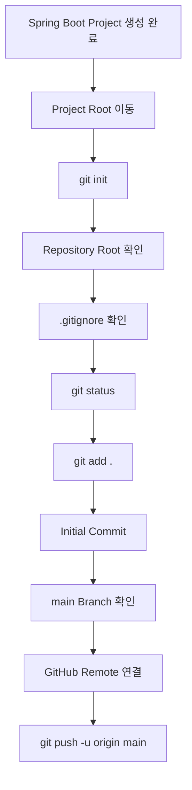
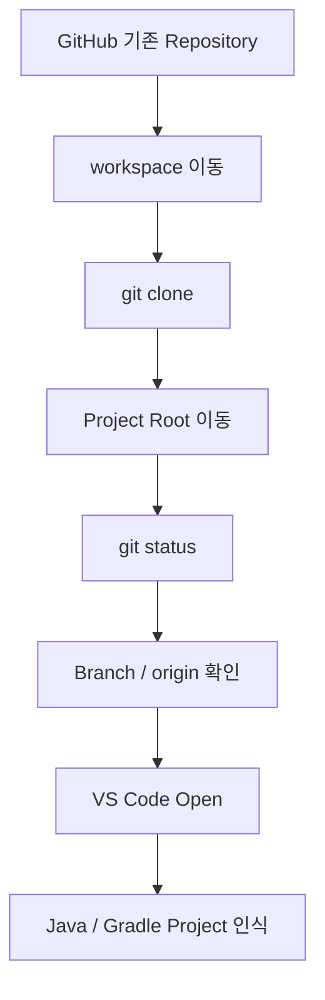

# Spring Boot 프로젝트 Git 초기화 가이드

## 1. 문서 목적

본 문서는 Spring Initializr로 생성한 MicroServer Spring Boot 프로젝트를
**독립적인 Git Repository로 초기화하고 최초 Commit 기준점을 생성한 뒤 GitHub Remote와 연결하는 절차**를 설명한다.

본 문서는 Windows와 macOS에서 동일한 Git Repository 구성 원칙을 사용한다.

운영체제에 따라 달라지는 부분은 다음 정도이다.

```text
Windows : C:\local-microserver\workspace\microserver / PowerShell
macOS   : ~/local-microserver/workspace/microserver / Terminal(zsh)
```

Git 명령과 Repository 구성 원칙은 동일하다.

선행 문서:

→ [Spring Boot 프로젝트 생성](spring_boot_project_create.md)

현재 단계에서는 다음을 진행한다.

```text
Spring Boot 프로젝트 생성 완료
        ↓
Project Root 이동
        ↓
Git Repository 초기화
        ↓
Repository Root 확인
        ↓
.gitignore 확인
        ↓
최초 Git 상태 확인
        ↓
git add
        ↓
Initial Commit
        ↓
main Branch 확인
        ↓
필요 시 GitHub Remote 연결 / Push
```

!!! note "이미 Repository가 존재하는 경우"
    기존 MicroServer Repository에 참여하는 개발자는
    프로젝트를 다시 생성하거나 `git init`을 수행하지 않는다.

    이 경우에는 본 문서의 **14. 기존 Repository에 참여하는 경우**를 참고하여
    Repository를 Clone한다.

---

## 2. Git 초기화 순서 기준

신규 MicroServer 프로젝트를 **처음 구축하는 경우** 다음 순서를 표준으로 사용한다.

```text
workspace 준비
        ↓
Spring Initializr Project 생성
        ↓
생성 결과 확인
        ↓
git init
        ↓
.gitignore 확인
        ↓
Initial Commit
        ↓
main Branch 확인
        ↓
GitHub Remote 연결
        ↓
Push
```

즉 Git Repository를 먼저 만든 뒤 생성 파일을 복사하는 방식이 아니라,
Spring Boot 프로젝트를 먼저 생성한 후 해당 Project Root에서 `git init`을 수행한다.

이 방식은 다음 장점이 있다.

- Initializr 생성 작업과 Git 초기화를 분리할 수 있다.
- 실제 생성된 Directory를 확인한 뒤 Repository Root를 확정할 수 있다.
- `microserver/microserver` 같은 Directory 중첩을 Git 초기화 전에 확인할 수 있다.
- 최초 생성 상태를 하나의 Commit 기준점으로 남길 수 있다.

---

## 3. Project Root 기준

MicroServer Source Repository의 논리적 위치:

```text
<MICROSERVER_HOME>
└─ workspace
   └─ microserver              ← Project / Repository Root
```

운영체제별 기본 위치:

| 운영체제 | Project Root |
|---|---|
| Windows | `C:\local-microserver\workspace\microserver` |
| macOS | `~/local-microserver/workspace/microserver` |

최소 다음 항목이 있는 Directory가 Project Root이다.

```text
microserver
├─ build.gradle
├─ settings.gradle
├─ gradlew
├─ gradlew.bat
├─ gradle
├─ src
└─ .gitignore
```

!!! important "Git Repository Root"
    `git init`은 반드시 `microserver` Project Root에서 실행한다.

    ```text
    O <MICROSERVER_HOME>/workspace/microserver

    X <MICROSERVER_HOME>
    X <MICROSERVER_HOME>/workspace
    ```

---

## 4. Project Root 이동

=== "Windows"

    PowerShell:

    ```powershell
    Set-Location C:\local-microserver\workspace\microserver
    ```

    현재 Directory:

    ```powershell
    Get-Location
    ```

    파일 확인:

    ```powershell
    Get-ChildItem -Force
    ```

=== "macOS"

    Terminal(zsh):

    ```bash
    cd ~/local-microserver/workspace/microserver
    ```

    현재 Directory:

    ```bash
    pwd
    ```

    파일 확인:

    ```bash
    ls -la
    ```

Project Root에 `build.gradle`, `settings.gradle`, `src` 등이 있는지 확인한다.

---

## 5. 기존 Git 상태 확인

Git 초기화 전에 다음 명령을 실행할 수 있다.

```bash
git status
```

아직 Git Repository가 아니라면 다음과 같은 메시지가 나올 수 있다.

```text
fatal: not a git repository
```

신규 Spring Boot 프로젝트를 처음 Git Repository로 구성하는 단계라면 정상적인 상태이다.

반대로 `git status`가 정상적으로 동작하고 기존 Commit / Branch가 확인된다면
이미 Git Repository일 수 있으므로 무조건 `git init`을 반복하지 않는다.

---

## 6. Git Repository 초기화

Project Root에서 실행한다.

```bash
git init
```

이 명령은 Windows PowerShell과 macOS Terminal에서 동일하다.

초기화되면 Project Root 아래에 `.git` Directory가 생성된다.

```text
<MICROSERVER_HOME>
└─ workspace
   └─ microserver
      ├─ .git
      ├─ .gitignore
      ├─ gradle
      ├─ src
      ├─ build.gradle
      └─ settings.gradle
```

`.git`은 Source File이 아니라 Git Repository Metadata를 관리하는 Directory이다.

```text
Commit History
Branch
Index
HEAD
Remote
Repository 설정
```

!!! warning "`.git` Directory 직접 수정 금지"
    `.git`에는 Repository History와 상태 정보가 저장된다.

    일반적인 개발 과정에서는 `.git` 내부 파일을 직접 수정하거나
    다른 Repository의 `.git` Directory로 교체하지 않는다.

---

## 7. Repository Root 확인

다음 명령으로 Git이 인식하는 Repository Root를 확인한다.

```bash
git rev-parse --show-toplevel
```

Windows 예:

```text
C:/local-microserver/workspace/microserver
```

macOS 예:

```text
/Users/<USER>/local-microserver/workspace/microserver
```

핵심은 운영체제의 절대경로가 아니라 Repository Root가 다음 Project를 가리키는 것이다.

```text
O .../local-microserver/workspace/microserver
```

다음처럼 상위 Directory를 가리키면 현재 MicroServer 구성 기준과 맞지 않는다.

```text
X .../local-microserver
X .../local-microserver/workspace
```

---

## 8. `.gitignore` 확인

Spring Initializr가 생성한 `.gitignore`를 확인한다.

=== "Windows"

    ```powershell
    Get-Content .gitignore
    ```

=== "macOS"

    ```bash
    cat .gitignore
    ```

Gradle Project의 대표적인 제외 대상:

```gitignore
.gradle/
build/
```

반대로 다음 Gradle Wrapper 파일은 Git 관리 대상이다.

```text
gradlew
gradlew.bat
gradle/wrapper/gradle-wrapper.jar
gradle/wrapper/gradle-wrapper.properties
```

Windows와 macOS가 동일 Repository를 사용하므로
현재 운영체제에서 사용하지 않는 Wrapper Script도 삭제하지 않는다.

```text
Windows : gradlew.bat
macOS   : gradlew
```

!!! warning "Gradle Wrapper를 `.gitignore`로 제외하지 않음"
    Wrapper는 개발자마다 별도의 Gradle 설치를 강제하지 않고
    프로젝트에서 정한 Gradle Version을 재현하는 데 사용한다.

### 8.1 Repository 밖 Local Secret

Local Secret은 Source Repository 밖에서 관리하는 것을 원칙으로 한다.

예:

```text
Windows : C:\local-microserver\env\...
macOS   : ~/local-microserver/env/...
```

Repository 밖에 있는 파일은 Project `.gitignore`의 관리 대상이 아니다.

```text
Repository 밖 Secret
→ Project Git Ignore 대상 아님
→ 개발환경 공유 Package 작성 시 별도 제외
```

향후 Repository 내부에 `.env` 등의 Secret 파일을 만들 경우에는
Project `.gitignore` 정책을 적용한다.

---

## 9. 최초 Git 상태 확인

Git 초기화 후:

```bash
git status
```

Spring Boot 생성 파일이 `Untracked files`로 나타날 수 있다.

대표적인 Git 관리 대상:

```text
.gitignore
.gitattributes
build.gradle
settings.gradle
gradlew
gradlew.bat
gradle/wrapper/...
src/...
```

`.gradle/`이나 `build/`는 `.gitignore`에 의해 제외되어야 한다.

현재 Build를 아직 실행하지 않았다면 `build/`가 존재하지 않을 수도 있다.

---

## 10. Initial Commit

전체 변경사항을 Staging 한다.

```bash
git add .
```

상태 확인:

```bash
git status
```

Commit:

```bash
git commit -m "chore: create initial Spring Boot project"
```

이 Commit은 다음 상태를 나타내는 기준점이다.

```text
Spring Initializr 기본 생성 상태
+
Gradle Wrapper
+
기본 Source / Test
+
.gitignore
```

아직 다음 설정은 포함하지 않는 것을 기본으로 한다.

```text
Project JDK 상세 설정
Gradle 표준화
Oracle JDBC / Datasource
Multi-Project
Framework 공통 기능
```

!!! tip "단계별 Commit"
    프로젝트 생성 상태를 하나의 Commit으로 남겨 두면
    이후 설정 단계에서 문제가 발생했을 때
    Spring Boot 기본 생성 상태와 비교하기 쉽다.

---

## 11. Branch 확인

현재 Branch:

```bash
git branch
```

Git 설정이나 Version에 따라 초기 Branch 이름이 다를 수 있다.

MicroServer의 표준 Branch를 `main`으로 사용할 경우:

```bash
git branch -M main
```

확인:

```bash
git branch
```

정상:

```text
* main
```

`-M`은 현재 Branch 이름을 강제로 변경하는 옵션이다.

이미 Branch가 `main`이라면 다시 실행할 필요는 없다.

---

## 12. GitHub Remote 연결

### 12.1 Remote Repository가 아직 없는 경우

현재 Local Repository만 유지할 수 있다.

```text
<MICROSERVER_HOME>/workspace/microserver
└─ .git
```

이후 GitHub Repository를 생성한 뒤 Remote를 연결한다.

### 12.2 GitHub에 빈 Repository가 있는 경우

Remote를 연결한다.

```bash
git remote add origin <GitHub Repository URL>
```

확인:

```bash
git remote -v
```

예:

```text
origin  <GitHub Repository URL> (fetch)
origin  <GitHub Repository URL> (push)
```

Branch가 `main`인지 확인한 뒤 Push한다.

```bash
git push -u origin main
```

`-u` 옵션은 Local `main` Branch가 Remote의 `origin/main`을
Upstream Branch로 추적하도록 설정한다.

최초 Push 이후에는 일반적으로 다음처럼 사용할 수 있다.

```bash
git push
git pull
```

### 12.3 GitHub Repository 생성 시 권장

Local에서 이미 Spring Boot 프로젝트를 생성하고
`git init`과 Initial Commit까지 완료했다면,
GitHub에서는 **소스 파일이나 Initial Commit이 아직 없는 새 Repository**를 만드는 것을 권장한다.

여기서 말하는 **빈 Repository**는
GitHub에 Repository 자체가 존재하지 않는다는 뜻이 아니다.

다음처럼 GitHub에서 Repository 이름과 공개 범위 등을 지정해
Repository는 생성하되,
생성 단계에서 README, `.gitignore`, LICENSE를 추가하지 않는 상태를 의미한다.

```text
GitHub Repository 생성
├─ Repository name        : microserver
├─ Visibility             : Public 또는 Private
├─ Add a README file      : 선택하지 않음
├─ Add .gitignore         : 선택하지 않음
└─ Choose a license       : 선택하지 않음
```

이렇게 생성하면 GitHub에는 Repository 공간과 URL은 만들어지지만
아직 Source File이나 Commit History는 없는 상태가 된다.

예:

```text
GitHub
microserver Repository 생성 완료
        ↓
아직 Commit 없음
아직 Source 없음
        ↓
Local Repository의 Initial Commit을 최초 Push
```

Local에서 이미 다음 상태까지 만들어 놓았기 때문에:

```text
Spring Boot Project 생성
        ↓
git init
        ↓
git add .
        ↓
Initial Commit
```

GitHub에서도 다시 README, `.gitignore`, LICENSE를 생성해
별도의 Initial Commit을 만들 필요가 없다.

!!! warning "GitHub에서 README 등을 먼저 생성하지 않는 이유"
    GitHub Repository 생성 화면에서 README, `.gitignore`, LICENSE 중 하나라도 추가하면
    GitHub 쪽에 별도의 Initial Commit이 먼저 생성된다.

    그러면 Local Repository의 Initial Commit과
    GitHub Remote의 Initial Commit이 서로 다른 History에서 시작할 수 있다.

정상 권장 흐름:

```text
Local Spring Boot Project 생성
        ↓
git init
        ↓
Initial Commit
        ↓
GitHub에서 Repository 생성
(README / .gitignore / LICENSE는 생성하지 않음)
        ↓
git remote add origin <GitHub Repository URL>
        ↓
git push -u origin main
```

이 방식이면 Local에서 만든 Initial Commit이
GitHub Repository의 첫 번째 Commit이 된다.

---

## 13. GitHub에 이미 Commit이 생성되어 있는 경우

GitHub Repository를 생성하면서
README, LICENSE, `.gitignore` 등을 추가했다면
GitHub 쪽에는 이미 하나 이상의 Commit이 존재한다.

예:

```text
Local Repository
A --- Spring Boot Initial Commit

GitHub Remote
B --- README Initial Commit
```

이 경우 `A`와 `B`는 서로 다른 Initial Commit이므로
Local과 Remote가 같은 History에서 시작하지 않은 상태가 될 수 있다.

따라서 단순히 다음 명령만 실행하면 Push가 거절되거나
추가적인 병합 절차가 필요할 수 있다.

```bash
git push -u origin main
```

이 상황은 Git이 잘못된 것이 아니라
Local과 Remote 양쪽에서 각각 독립적으로 Commit을 생성했기 때문에 발생한다.

현재 MicroServer 신규 구축의 표준 절차에서는
이 문제를 처음부터 만들지 않는 방향을 권장한다.

```text
권장
Local에서 Initial Commit 생성
        ↓
GitHub Repository 생성
        ↓
README / .gitignore / LICENSE 추가하지 않음
        ↓
Local Commit을 최초 Push
```

반대로 이미 Remote에 Commit이 존재하는 Repository를 사용해야 한다면
Remote 상태를 먼저 확인한 뒤 해당 Repository의 History와
Local History를 어떻게 통합할지 결정해야 한다.

!!! note "이 절의 목적"
    이 절은 Remote History를 강제로 덮어쓰는 방법을 안내하기 위한 것이 아니다.

    신규 프로젝트에서는 Local과 Remote에
    서로 다른 Initial Commit을 만들지 않는 것이 가장 단순하고 안전하다.

---

## 14. 기존 Repository에 참여하는 경우

일반 개발자가 이미 존재하는 MicroServer 프로젝트에 참여하는 경우에는
**프로젝트 생성 및 Git 초기화 절차를 반복하지 않고 Source Repository를 Clone하는 것을 기본 방식으로 한다.**

```text
기존 GitHub Repository
        ↓
Local workspace 준비
        ↓
git clone
        ↓
Project Root 생성
        ↓
.git / Commit History / origin 구성
        ↓
VS Code에서 Project Open
```

### 14.1 Clone

먼저 Workspace로 이동한다.

=== "Windows"

    ```powershell
    Set-Location C:\local-microserver\workspace
    ```

=== "macOS"

    ```bash
    cd ~/local-microserver/workspace
    ```

Clone:

```bash
git clone <GitHub Repository URL>
```

Repository 이름이 `microserver`라면 일반적으로 다음 Directory가 생성된다.

```text
<MICROSERVER_HOME>
└─ workspace
   └─ microserver
      ├─ .git
      ├─ .gitignore
      ├─ gradle
      ├─ src
      ├─ build.gradle
      └─ settings.gradle
```

!!! important "Clone한 Repository에서는 `git init`을 하지 않음"
    `git clone`은 Source File뿐 아니라 다음 Repository 정보도 함께 구성한다.

    ```text
    .git
    Commit History
    Branch
    origin
    Remote Tracking 정보
    ```

### 14.2 Clone 상태 확인

Project Root로 이동한 후:

```bash
git status
git branch --show-current
git remote -v
git rev-parse --show-toplevel
```

Clone 직후 변경사항이 없다면 일반적으로 다음 상태가 된다.

```text
On branch main
Your branch is up to date with 'origin/main'.

nothing to commit, working tree clean
```

### 14.3 VS Code에서 열기

Clone된 `microserver` Project Root를 연다.

```text
File
→ Open Folder...
→ <MICROSERVER_HOME>/workspace/microserver
```

`build.gradle`과 `settings.gradle`이 바로 보이는 Project Root를 여는 것을 기준으로 한다.

Java / Gradle Extension이 설치되어 있다면
VS Code가 기존 프로젝트를 Java / Gradle Project로 Import한다.

### 14.4 Source Package로 전달받는 경우

Repository 접근이 제한된 폐쇄망이나 별도 반입 절차가 필요한 환경에서는
Source를 ZIP 또는 Directory Package로 전달받을 수도 있다.

다만 일반 개발환경의 표준 Source 획득 방식은 Git Clone을 권장한다.

```text
표준
Git Repository Clone

예외
Source ZIP / Directory Package
```

Source Package 방식에서는 `.git` 포함 여부와 Repository 연결 상태가
배포 방식에 따라 달라질 수 있으므로 별도의 환경 정책을 따른다.

---

## 15. GitHub 인증에 대한 이해

Browser에서 GitHub에 로그인한 것과
Terminal에서 Git 명령으로 Remote Repository에 접근하는 인증은 구분해서 이해한다.

Git Remote URL은 일반적으로 다음 방식 중 하나를 사용한다.

```text
HTTPS
SSH
```

현재 Repository가 어떤 방식을 사용하는지는 다음 명령으로 확인한다.

```bash
git remote -v
```

기존 프로젝트에 참여하는 개발자는 임의로 인증 방식을 변경하기보다
프로젝트에서 사용하는 Remote 방식을 우선 확인한다.

---

## 16. 현재 단계에서 하지 않는 작업

현재 단계는 Git Repository 구성과 최초 Source 관리 기준을 만드는 단계이다.

신규 구축 시 아직 다음 Build / Run 작업은 수행하지 않는다.

=== "Windows"

    ```powershell
    .\gradlew.bat build
    .\gradlew.bat bootRun
    ```

=== "macOS"

    ```bash
    ./gradlew build
    ./gradlew bootRun
    ```

다음 구성도 이후 단계에서 진행한다.

```text
Project JDK / VS Code 상세 설정
Oracle JDBC / Datasource
Docker Compose
Controller / Service / DAO
Filter / AOP
Security / Transaction / Cache
Gradle Multi-Project
```

---

## 17. 전체 흐름 요약

### 17.1 최초 프로젝트 구축



### 17.2 기존 프로젝트 참여



최종 Repository 구조:

```text
<MICROSERVER_HOME>
└─ workspace
   └─ microserver
      ├─ .git
      ├─ .gitignore
      ├─ gradle
      │  └─ wrapper
      ├─ src
      ├─ build.gradle
      ├─ settings.gradle
      ├─ gradlew
      └─ gradlew.bat
```

---

## 18. 체크리스트

### 18.1 최초 Repository 구축

- [ ] `microserver` Project Root에서 작업하고 있다.
- [ ] 상위 `local-microserver` 또는 `workspace`에서 `git init`을 하지 않았다.
- [ ] `git init`을 실행했다.
- [ ] `.git` Directory가 생성되었다.
- [ ] `git rev-parse --show-toplevel` 결과가 Project Root이다.
- [ ] `.gitignore`를 확인했다.
- [ ] `.gradle/`과 `build/`가 제외 대상이다.
- [ ] Gradle Wrapper는 Git 관리 대상이다.
- [ ] `git add .`을 실행했다.
- [ ] Initial Commit을 생성했다.
- [ ] Branch를 `main`으로 확인했다.
- [ ] GitHub Remote를 연결했다.
- [ ] 최초 Push가 필요한 경우 `git push -u origin main`을 실행했다.

### 18.2 기존 Repository 참여

- [ ] 프로젝트를 다시 생성하지 않았다.
- [ ] `git init`을 다시 실행하지 않았다.
- [ ] 기존 Repository를 `workspace`에 Clone했다.
- [ ] `git status`가 정상적으로 동작한다.
- [ ] 현재 Branch를 확인했다.
- [ ] `origin` Remote를 확인했다.
- [ ] Repository Root가 `microserver` Project Root이다.
- [ ] VS Code에서 `microserver` Project Root를 열었다.

### 18.3 단계 범위

- [ ] 아직 Build / Run 검증은 수행하지 않았다.
- [ ] 아직 Project JDK / VS Code 상세 설정은 이후 단계로 남겨 두었다.
- [ ] 아직 Oracle JDBC / Datasource를 연결하지 않았다.
- [ ] 아직 Gradle Multi-Project를 구성하지 않았다.

---

## 19. 다음 단계

Git Repository 초기화와 최초 Commit 또는
기존 Repository Clone이 완료되면 프로젝트 구조와 기본 파일을 확인한다.

```text
최초 구축
Spring Boot 프로젝트 생성
        ↓
Git Repository 초기화 / 최초 Commit

기존 프로젝트 참여
Git Repository Clone
        ↓
        └──────────────┐
                       ↓
             프로젝트 구조 확인
                       ↓
             Project JDK / VS Code 설정
                       ↓
             Gradle Wrapper / Gradle 설정
                       ↓
             Build / Run 검증
```

다음 문서:

**[생성 프로젝트 구조 확인 및 초기 정리](spring_boot_project_initial_review.md)**
