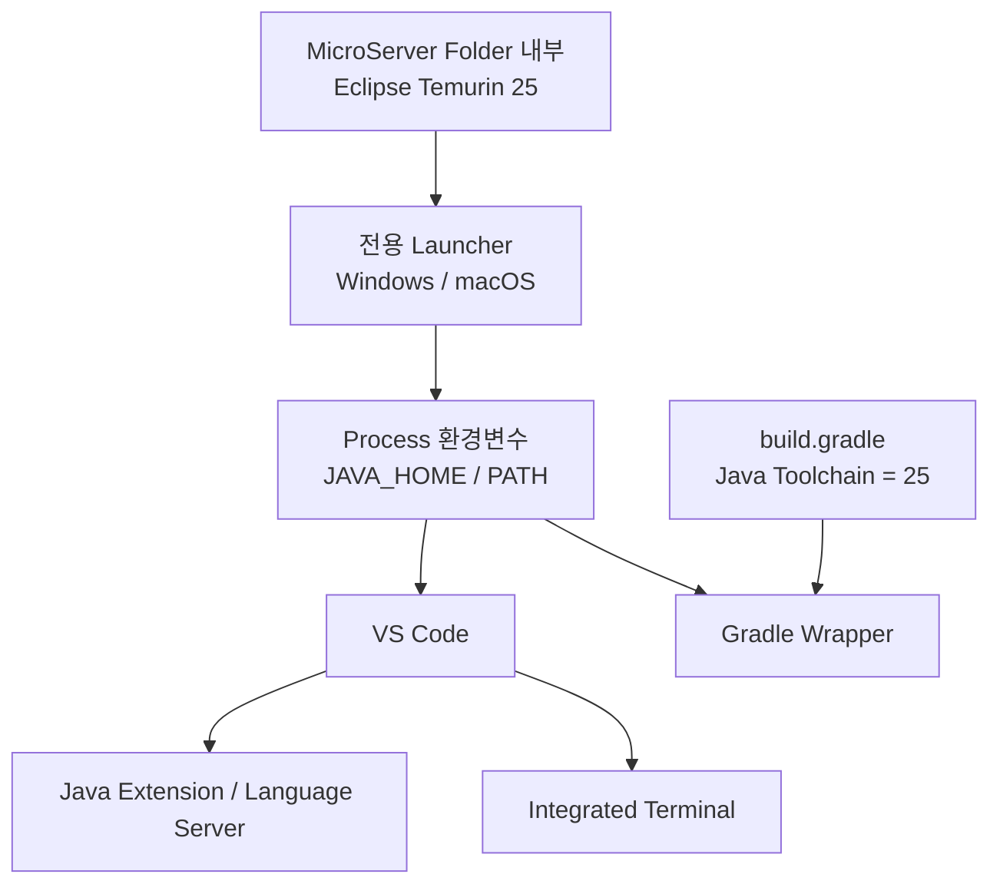
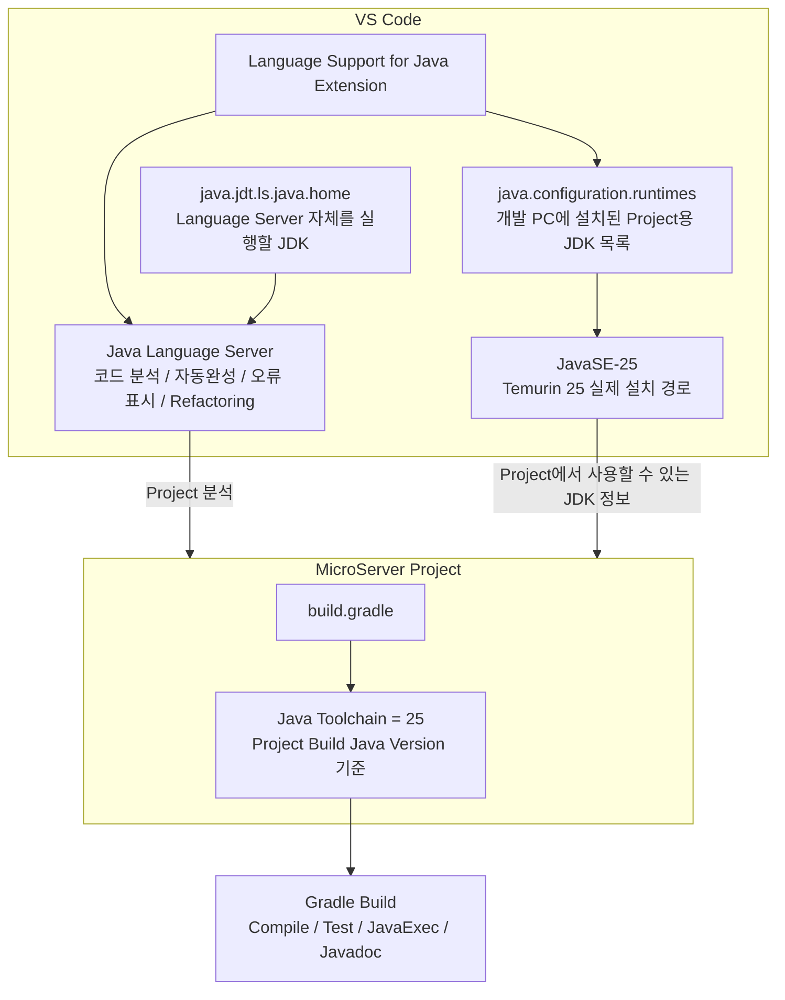

# VS Code Java 개발환경 개념 가이드

## 1. 문서 목적

본 문서는 MicroServer 프로젝트에서 혼동하기 쉬운 다음 세 가지 Java 설정의 역할을 구분한다.

```text
build.gradle Java Toolchain
java.configuration.runtimes
java.jdt.ls.java.home
```

현재 MicroServer 기준:

```text
Java Version : 25
JDK          : Eclipse Temurin 25
Build Tool   : Gradle
IDE          : VS Code
```

이 문서에서는 **개념만 이해**한다.

실제 설정은 다음 문서에서 진행한다.

→ [VS Code User / Workspace 설정](project_jdk_vscode_setup.md)

---

## 1.1 MicroServer Java 환경 표준 정책

MicroServer의 Java 개발환경은 **Windows와 macOS 모두 동일한 독립 실행 원칙**을 사용한다.

핵심은 OS 전역에 `JAVA_HOME`을 영구 설정하는 것이 아니라,
MicroServer 개발환경 폴더 내부에 JDK를 포함하고 **전용 Launcher가 VS Code를 실행할 때만**
해당 JDK의 `JAVA_HOME`과 `PATH`를 Process 환경변수로 주입하는 것이다.

```text
OS 전역 JAVA_HOME
→ 사용하지 않음

MicroServer Folder 내부 JDK
→ Eclipse Temurin 25 포함

Windows / macOS Launcher
→ VS Code 실행 시점에만 JAVA_HOME / PATH 주입

build.gradle Java Toolchain
→ Project Build Java Version = 25

java.configuration.runtimes
→ 기본 설정하지 않음

java.jdt.ls.java.home
→ 기본 설정하지 않음
```

!!! important "`JAVA_HOME`을 사용하지 않는다는 의미"

    MicroServer에서 `JAVA_HOME`이라는 환경변수 자체를 사용하지 않는다는 뜻이 아니다.

    **Windows/macOS의 시스템 전역 환경변수로 영구 등록하지 않고,
    MicroServer용 VS Code Process를 시작할 때만 폴더 내부 JDK 경로를 주입한다**는 의미이다.

    따라서 일반 Terminal, 다른 IDE, 다른 Project의 Java 환경에 영향을 주지 않는다.

### 공통 실행 구조



---

## 2. 세 설정을 먼저 한눈에 보기

| 설정 | 사용하는 주체 | 역할 |
|---|---|---|
| `build.gradle` Java Toolchain | **Gradle** | Project Build에 사용할 Java Version / Toolchain 기준 |
| `java.configuration.runtimes` | **VS Code Java Extension** | 개발 PC에 설치된 JDK Version과 실제 경로를 등록 |
| `java.jdt.ls.java.home` | **Java Language Server** | Java Language Server 자체를 실행할 JDK 지정 |

가장 간단하게 기억하면:

```text
build.gradle Java Toolchain
→ "이 Project는 Java 25로 Build한다."


java.configuration.runtimes
→ "내 PC의 Java 25 JDK는 이 Directory에 있다."


java.jdt.ls.java.home
→ "VS Code의 Java 분석 엔진 자체를 이 JDK로 실행한다."
```

!!! important "같은 JDK 경로가 보여도 역할은 서로 다름"

    `java.configuration.runtimes`와 `java.jdt.ls.java.home`에
    같은 Temurin 25 경로가 들어갈 수 있다.

    하지만 하나는 **Project용 JDK 등록**이고,
    다른 하나는 **Java Language Server 실행 JDK 지정**이다.

---

## 3. 전체 구조

다음 구조를 먼저 이해하면 세 설정의 역할이 훨씬 명확해진다.



이 구조를 기준으로 각 설정을 살펴본다.

!!! tip "세 설정을 보는 관점"

    세 설정 모두 JDK와 관련되어 있지만
    **누가 그 JDK를 사용하는지**가 다르다.

    ```text
    java.jdt.ls.java.home
    → Java Language Server가 사용할 JDK

    java.configuration.runtimes
    → VS Code Java Extension이 알고 있는 Project용 JDK 목록

    build.gradle Java Toolchain
    → Gradle이 Project Build에 사용할 Java Version 기준
    ```

---

## 4. `build.gradle` Java Toolchain

### 4.1 역할

현재 MicroServer의 `build.gradle`에는 다음과 같은 Java Toolchain 설정이 있다.

```groovy
java {
    toolchain {
        languageVersion = JavaLanguageVersion.of(25)
    }
}
```

이 설정은 Gradle에게 다음 기준을 전달한다.

```text
"이 Project의 Java Build Toolchain은 Java 25를 사용한다."
```

즉 **MicroServer Project 자체의 Java Version 기준**이다.

---

### 4.2 구체적으로 무엇에 영향을 주는가

Gradle Java Toolchain은 Java Build 작업에 필요한 Java Tool을 선택하는 기준으로 사용된다.

대표적으로:

```text
Java Source Compile
→ javac

Test 실행
→ java

JavaExec
→ java

Javadoc 생성
→ javadoc
```

개념적으로:

```text
build.gradle
Java Toolchain = 25
        ↓
Gradle
        ↓
조건에 맞는 Java 25 Toolchain 선택
        ↓
javac / java / javadoc
```

즉 단순히 소스 문법 표시용 Version이 아니라,
**Gradle Build에서 사용할 Java Toolchain을 Project 수준에서 선언하는 설정**이다.

---

### 4.3 왜 Git으로 공유하는가

개발자마다 JDK 설치 위치는 달라도
Project가 요구하는 Java Version은 같아야 한다.

예:

```text
개발자 A
C:\local-microserver\tools\jdk\temurin-25

개발자 B
D:\tools\jdk\temurin-25

macOS 개발자
/Users/user/jdks/temurin-25.jdk/Contents/Home
```

실제 경로는 다르지만 Project 기준은 공통이다.

```groovy
languageVersion = JavaLanguageVersion.of(25)
```

따라서 `build.gradle`은 Git으로 공유한다.

!!! important "절대경로를 넣는 설정이 아님"

    Toolchain에는 다음과 같은 개발자 PC의 경로를 넣지 않는다.

    ```text
    C:\local-microserver\tools\jdk\temurin-25
    ```

    Project에는 **Java 25라는 요구사항**을 기록한다.

---

### 4.4 Gradle 자체 실행 JDK와는 구분

다음 두 개념은 반드시 같은 것은 아니다.

```text
Gradle Daemon을 실행하는 JVM
        ≠
Project Java Toolchain
```

Java Toolchain은 Project의 Compile / Test 등에서 사용할 Java Tool 기준이다.

Gradle 자체 실행 JVM과 Toolchain 탐색 방법은
다음 **Gradle Wrapper / 프로젝트 Gradle 설정** 문서에서 다룬다.

---

## 5. `java.configuration.runtimes`

### 5.1 역할

`java.configuration.runtimes`는 VS Code의
**Language Support for Java Extension**이 사용하는 설정이다.

역할은:

> **Java Execution Environment와 개발 PC에 실제 설치된 JDK를 연결하는 것**

이다.

예:

```json
"java.configuration.runtimes": [
  {
    "name": "JavaSE-25",
    "path": "C:\\local-microserver\\tools\\jdk\\temurin-25",
    "default": true
  }
]
```

VS Code Java Extension은 이를 다음과 같이 이해한다.

```text
JavaSE-25
        ↓
이 PC에서 사용할 수 있는 JDK
        ↓
C:\local-microserver\tools\jdk\temurin-25
```

---

### 5.2 쉽게 이해하면 JDK 주소록

개발 PC에 여러 JDK가 있을 수 있다.

```text
Java 17 → C:\tools\jdk\temurin-17
Java 21 → C:\tools\jdk\temurin-21
Java 25 → C:\local-microserver\tools\jdk\temurin-25
```

이를 VS Code Java Extension에 등록하는 것이
`java.configuration.runtimes`이다.

```text
VS Code Java Extension의 JDK 목록

JavaSE-17 → JDK 17 Directory
JavaSE-21 → JDK 21 Directory
JavaSE-25 → JDK 25 Directory
```

따라서 이 설정은 **Project Java Version을 정의하는 Build 설정이 아니라
VS Code가 사용할 수 있는 로컬 JDK의 위치 정보**라고 이해하면 된다.

---

### 5.3 Toolchain과의 차이

두 설정의 역할을 나란히 보면 명확하다.

```text
build.gradle Java Toolchain
→ "MicroServer는 Java 25를 요구한다."


java.configuration.runtimes
→ "내 PC의 Java 25는 여기에 설치되어 있다."
```

MicroServer 기준:

```groovy
// Project 기준
java {
    toolchain {
        languageVersion = JavaLanguageVersion.of(25)
    }
}
```

```json
// 내 PC의 실제 JDK 위치
"java.configuration.runtimes": [
  {
    "name": "JavaSE-25",
    "path": "C:\\local-microserver\\tools\\jdk\\temurin-25"
  }
]
```

!!! important "`runtimes`가 Project Version을 결정하는 것은 아님"

    User Settings에 Java 25 JDK를 등록했다고 해서
    Gradle Project의 Java Version 기준이 결정되는 것은 아니다.

    Gradle Project의 기준은 `build.gradle`의 Java Toolchain이다.

---

### 5.4 `default: true`

```json
"default": true
```

이 값은 `java.configuration.runtimes`에 등록한 Runtime 중
기본 Runtime을 지정하는 옵션이다.

VS Code Java Extension 공식 설명상
이 기본 Runtime은 **Standalone Java File을 열 때 사용할 Runtime**으로 사용된다.

따라서 다음과 같이 이해하지 않는다.

```text
X 모든 Gradle Project를 이 Java Version으로 강제 Build한다.
```

Gradle Project에서는 계속:

```text
Project Build 기준
→ build.gradle Java Toolchain

로컬 JDK 정보
→ java.configuration.runtimes
```

으로 구분한다.

---

### 5.5 왜 User Settings에서 관리하는가

JDK 설치 경로는 개발 PC마다 다르다.

```text
C:\local-microserver\tools\jdk\temurin-25
D:\jdk\temurin-25
/Users/user/jdks/temurin-25.jdk/Contents/Home
```

`java.configuration.runtimes`는 로컬 JDK 경로를 명시적으로 등록할 수 있는 설정이지만,
**MicroServer 표준 환경에서는 기본적으로 설정하지 않는다.**

Windows/macOS 모두 전용 Launcher가 폴더 내부 JDK의 `JAVA_HOME` / `PATH`를
VS Code 실행 시점에 주입하므로 JDK 절대경로를 VS Code Settings에 중복해서 기록하지 않는다.

다만 여러 JDK를 VS Code에 명시적으로 등록해야 하거나 자동 인식 문제를 진단할 때는
개발 PC의 **User Settings**에서 선택적으로 사용할 수 있다.

```text
java.configuration.runtimes
→ 기본 설정하지 않음
→ 필요한 경우에만 User Settings에서 사용
→ Project Git 대상 아님
```

---

## 6. `java.jdt.ls.java.home`

### 6.1 먼저 Java Language Server란 무엇인가

VS Code 자체는 기본적으로 **범용 Text Editor / Code Editor**이다.

Java 문법과 Type, Classpath, Dependency, Method 관계 등을 깊게 분석하는 기능은
Java Extension이 제공하며, 그 핵심 역할을 수행하는 프로그램이
**Java Language Server(JDT Language Server)**이다.

VS Code에서 Java 파일을 열면 Java Language Server가 Background에서 실행되어
현재 Java Source와 Project 구조를 계속 분석한다.

대표적인 기능:

```text
Java Error / Warning 표시
자동완성
Go to Definition
Find References
Rename Refactoring
Import 정리
Code Action
Type / Method 분석
Classpath / Dependency 기반 Project 분석
```

예를 들어 다음처럼 입력했을 때:

```java
String name = "MicroServer";

name.
```

VS Code가 다음과 같은 Method를 자동완성 후보로 보여줄 수 있다.

```text
length()
substring()
toUpperCase()
charAt()
...
```

이것은 VS Code 자체가 `String`을 이해해서가 아니라,
Java Language Server가 `name` 변수의 Type이 `String`이라는 사실을 분석하고
사용 가능한 Method 정보를 VS Code Editor에 전달하기 때문이다.

또한 Java Class 이름을 `Ctrl + Click`해서 정의로 이동하거나,
사용처를 찾고, 이름을 안전하게 변경하는 Refactoring 기능도
Java Language Server의 분석 결과를 기반으로 동작한다.

!!! tip "Java Language Server는 VS Code 뒤에서 실행되는 Java 개발 도우미"

    다음처럼 이해하면 쉽다.

    ```text
    VS Code
    → 화면 / Editor / UI

    Language Support for Java Extension
    → VS Code에 Java 개발 기능을 연결

    Java Language Server
    → 실제 Java Source / Type / Classpath / Dependency 분석
    → 자동완성 / 오류표시 / 정의이동 / Refactoring 등의 결과 제공
    ```

    Java Language Server 자체도 **Java로 만들어진 프로그램**이므로
    실행하려면 JVM/JDK가 필요하다.

    이때 Language Server를 어떤 JDK로 실행할지 명시적으로 지정하는 설정이
    바로 다음 항목이다.

    ```json
    "java.jdt.ls.java.home":
      "C:\\local-microserver\\tools\\jdk\\temurin-25"
    ```

즉 Java Language Server는
**VS Code의 Java 개발 기능 뒤에서 실행되는 Java 전용 분석 프로그램**이라고 보면 된다.

---

### 6.2 `java.jdt.ls.java.home`의 역할

다음 설정:

```json
"java.jdt.ls.java.home":
  "C:\\local-microserver\\tools\\jdk\\temurin-25"
```

은:

```text
MicroServer를 Java 25로 Build한다.
```

라는 뜻이 아니다.

정확한 의미는:

```text
VS Code 뒤에서 실행되는 Java Language Server 프로그램 자체를
C:\local-microserver\tools\jdk\temurin-25
의 JVM/JDK로 실행한다.
```

이다.

즉 Project Build JDK가 아니라
**개발도구(Java Language Server)를 실행하기 위한 Tooling JDK 설정**이다.

---

### 6.3 `java.configuration.runtimes`와 비교

두 설정 모두 JDK 경로가 들어가므로 가장 많이 혼동된다.

```text
java.configuration.runtimes
        ↓
Project용으로 사용할 수 있는
로컬 JDK 목록 / 위치를 VS Code에 등록


java.jdt.ls.java.home
        ↓
Java Language Server 프로그램 자체를
어떤 JDK로 실행할지 지정
```

같은 JDK를 사용할 수도 있다.

```text
C:\local-microserver\tools\jdk\temurin-25
        │
        ├─ Project Runtime 등록
        │   → java.configuration.runtimes
        │
        └─ Language Server 실행
            → java.jdt.ls.java.home
```

경로가 같더라도 **사용 주체와 목적이 다르다.**

---

### 6.4 반드시 설정해야 하는가

현재 VS Code Marketplace에서 배포되는
Java Extension의 플랫폼별 버전은
Java Language Server 실행용 **내장 JRE를 포함할 수 있다.**

이 경우 `java.jdt.ls.java.home`을 지정하지 않아도
내장 Runtime으로 Language Server가 실행된다.

`java.jdt.ls.java.home`을 지정하면
내장 Runtime 대신 지정한 JDK로 Language Server를 실행하도록 할 수 있다.

따라서 MicroServer 표준 정책에서는:

```text
java.configuration.runtimes
→ 기본 설정하지 않음
→ 다중 JDK 등록 / 자동 인식 문제 등 필요한 경우에만 사용


java.jdt.ls.java.home
→ 기본 설정하지 않음
→ Language Server 실행 JDK를 특별히 고정해야 할 때만 사용
```

으로 구분한다.

정상적인 MicroServer 환경에서는 Launcher가 VS Code Process에 폴더 내부 JDK 환경을 전달하고,
Java Extension이 이를 바탕으로 동작할 수 있으므로 두 값을 Project 설정에 고정하지 않는다.

!!! tip "현재 User Settings 값은 유지 가능"

    현재 다음 설정이 이미 있고 정상적으로 동작한다면 유지해도 된다.

    ```json
    "java.jdt.ls.java.home":
      "C:\\local-microserver\\tools\\jdk\\temurin-25"
    ```

    다만 이 값을 **Project Java Version 설정으로 해석하지 않는다.**

---

## 7. Windows / macOS 공통 실행환경

MicroServer는 Windows와 macOS 모두 같은 원칙으로 VS Code를 실행한다.

### 7.1 Windows

전용 Launcher는 개념적으로 다음과 같이 동작한다.

```powershell
$env:JAVA_HOME = "<MicroServer Folder>\tools\jdk\temurin-25"
$env:PATH = "$env:JAVA_HOME\bin;$env:PATH"

# VS Code 실행
```

이 값은 Windows 시스템의 전역 `JAVA_HOME`을 변경하는 것이 아니다.

**Launcher에서 시작한 VS Code와 그 하위 Process에만 적용되는 환경변수**이다.

### 7.2 macOS

전용 Launcher 역시 같은 역할을 한다.

```bash
export JAVA_HOME="<MicroServer Folder>/tools/jdk/temurin-25/Contents/Home"
export PATH="$JAVA_HOME/bin:$PATH"

# VS Code 실행
```

macOS의 Shell Profile에 전역 `JAVA_HOME`을 영구 설정하는 것이 아니라,
MicroServer용 VS Code를 실행할 때만 필요한 JDK 환경을 구성한다.

### 7.3 Project `settings.json`

Windows/macOS 공통 Project 설정은 OS 독립적인 Editor 설정만 유지한다.

```json
{
  "files.encoding": "utf8",
  "files.autoGuessEncoding": false,
  "files.autoSave": "off",
  "editor.formatOnSave": false,
  "files.trimTrailingWhitespace": true,
  "files.insertFinalNewline": true
}
```

다음 두 설정은 기본적으로 넣지 않는다.

```json
"java.configuration.runtimes": [...]
```

```json
"java.jdt.ls.java.home": "..."
```

이렇게 하면 `.vscode/settings.json`을 Git으로 공유해도
Windows/macOS의 JDK 절대경로 차이가 Project 설정에 들어오지 않는다.

---

## 8. 세 설정 최종 비교

| 항목 | 질문 | 답 |
|---|---|---|
| `build.gradle` Toolchain | **Project를 어떤 Java로 Build하는가?** | Java 25 |
| `java.configuration.runtimes` | **내 PC에 Project용 JDK가 어디 있는가?** | Temurin 25 Directory |
| `java.jdt.ls.java.home` | **VS Code Java 분석 엔진을 어떤 JDK로 실행하는가?** | Temurin 25 또는 Extension 내장 Runtime |

한 문장씩 기억한다.

```text
Toolchain
→ Project Build의 Java 기준


runtimes
→ VS Code의 로컬 JDK 목록 / 위치


jdt.ls.java.home
→ Java Language Server 자체의 실행 JDK
```

!!! important "MicroServer Java Version을 확인할 때 가장 먼저 볼 곳"

    ```text
    build.gradle
        ↓
    JavaLanguageVersion.of(25)
    ```

    이것이 Project의 Java Version 기준이다.

---

## 9. Java Project Import와의 관계

VS Code에서 `microserver` Folder를 열면
Java / Gradle Extension이 `build.gradle` 등을 분석한다.

```text
MicroServer Launcher 실행
        ↓
폴더 내부 JDK 환경 주입
        ↓
VS Code 실행
        ↓
Project Folder / Workspace Open
        ↓
build.gradle / settings.gradle 감지
        ↓
Java Toolchain / Dependency / Source 분석
        ↓
Java Project Model 구성
        ↓
JAVA PROJECTS View에 microserver 표시
```

이 과정을 Java Project **Import**라고 한다.

정상적으로 `JAVA PROJECTS`에 `microserver`가 표시되면
이미 Import된 상태이다.

### 9.1 실행환경 확인

Launcher를 통해 VS Code를 실행한 뒤 Integrated Terminal에서 확인한다.

Windows:

```powershell
$env:JAVA_HOME
where.exe java
java --version
.\gradlew.bat -version
```

macOS:

```bash
echo $JAVA_HOME
which java
java --version
./gradlew -version
```

`JAVA_HOME`, `java`, Gradle 실행 JVM과 Project Toolchain을 함께 확인하면
독립 JDK 환경이 정상적으로 전달되었는지 검증할 수 있다.


---

## 10. MicroServer 운영 기준

```text
Project Java Version
→ build.gradle Java Toolchain
→ Java 25
→ Git 공유


JDK 실제 위치
→ MicroServer 개발환경 Folder 내부
→ OS 전역 JAVA_HOME에 의존하지 않음


VS Code 실행환경
→ Windows / macOS 전용 Launcher
→ 실행 시점에 JAVA_HOME / PATH 주입
→ VS Code 및 하위 Process에서만 사용


java.configuration.runtimes
→ 기본 설정하지 않음
→ 다중 JDK / 자동 인식 문제 등 필요한 경우에만 User Settings에서 사용


java.jdt.ls.java.home
→ 기본 설정하지 않음
→ Language Server JDK를 명시적으로 고정해야 할 때만 User Settings에서 사용


Project 공통 VS Code 설정
→ .vscode/settings.json
→ Editor / Encoding 등 OS 독립 설정만 유지
→ Git 공유
```

!!! important "최종 원칙"

    MicroServer의 Java 개발환경은 **Project가 Java Version을 선언하고,
    Launcher가 폴더 내부 JDK 실행환경을 제공하는 구조**로 운영한다.

    ```text
    build.gradle
    → 무엇을 사용할 것인가? (Java 25)

    MicroServer Folder 내부 JDK
    → 실제 JDK는 어디에 있는가?

    Launcher
    → VS Code 실행 시 해당 JDK를 어떻게 전달할 것인가?

    .vscode/settings.json
    → Project 공통 Editor 정책
    ```

    Windows와 macOS 모두 OS 전역 Java 환경에 대한 의존성을 제거하면서
    동일한 MicroServer 독립 개발환경 원칙을 유지한다.

---

## 11. 다음 문서

개념 이해가 끝나면 실제 설정을 진행한다.

→ [VS Code User / Workspace 설정](project_jdk_vscode_setup.md)

```text
VS Code Java 개발환경 개념       ← 현재
        ↓
VS Code User / Workspace 설정
        ↓
Java / Gradle / Spring Boot 인식 확인
        ↓
Gradle Wrapper / 프로젝트 Gradle 설정
```

---

## 12. 공식 참고 자료

- [Language Support for Java by Red Hat](https://github.com/redhat-developer/vscode-java)
- [JDK Requirements - vscode-java](https://github.com/redhat-developer/vscode-java/wiki/JDK-Requirements)
- [Managing Java Projects in VS Code](https://code.visualstudio.com/docs/java/java-project)
- [Gradle Java Toolchains](https://docs.gradle.org/current/userguide/toolchains.html)
