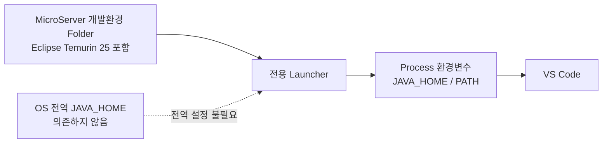
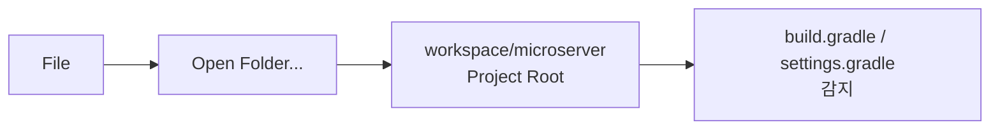
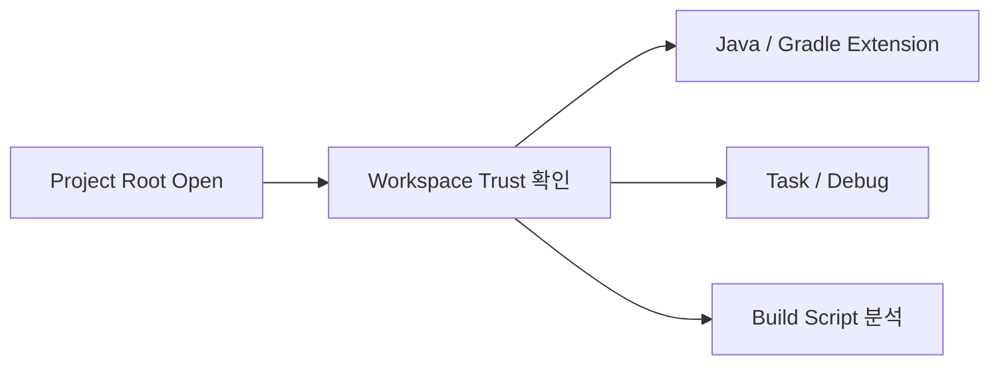
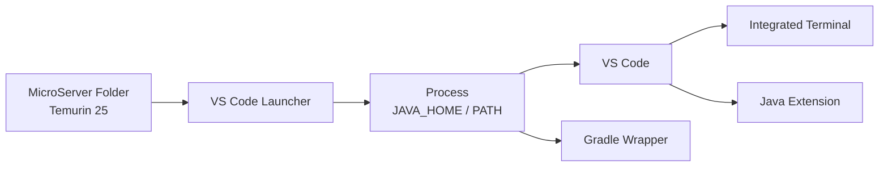
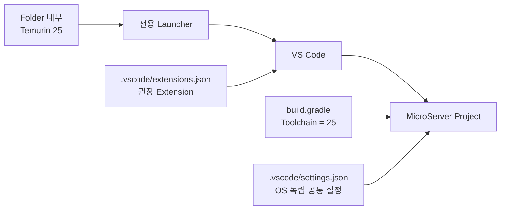

# 프로젝트 JDK / VS Code Workspace 설정

## 1. 문서 목적

본 문서는 MicroServer 프로젝트에서 **Windows와 macOS에 공통으로 적용할 JDK / VS Code Workspace 설정**을 구성한다.

Java 설정의 개념과 역할은 다음 문서를 먼저 참고한다.

→ [프로젝트 JDK / VS Code 개념](project_jdk_vscode_concepts.md)

현재 MicroServer 표준은 다음과 같다.

```text
Java Version : 25
JDK          : Eclipse Temurin 25
Build Tool   : Gradle
IDE          : VS Code
```

JDK 관리 원칙:



!!! important "Windows / macOS 공통 원칙"

    Windows와 macOS의 JDK Directory 구조와 Launcher 구현은 다를 수 있지만
    **Project 설정 정책은 동일하게 유지한다.**

    ```text
    Project Java Version
    → build.gradle Java Toolchain

    실제 JDK
    → MicroServer 개발환경 Folder 내부

    VS Code에 JDK 전달
    → 전용 Launcher의 Process 환경변수

    Project .vscode/settings.json
    → OS 독립적인 공통 설정만 저장
    ```

---

## 2. 실제 작업 요약

이 문서에서 수행할 작업은 다음과 같다.

| 순서 | 작업 | 적용 위치 | Git |
|---:|---|---|:---:|
| 1 | Project Root / Workspace 열기 | VS Code | - |
| 2 | Workspace Trust 확인 | VS Code | - |
| 3 | Java 25 Toolchain 확인 | `build.gradle` | O |
| 4 | Launcher 기반 JDK 실행환경 확인 | Windows / macOS | X |
| 5 | Workspace 공통 설정 | `.vscode/settings.json` | O |
| 6 | 권장 Extension 설정 | `.vscode/extensions.json` | O |
| 7 | `.gitignore` 확인 | `.gitignore` | O |

MicroServer 표준 구성에서는 다음 두 설정을 **기본적으로 사용하지 않는다.**

```text
java.configuration.runtimes
java.jdt.ls.java.home
```

JDK 경로를 VS Code Settings에 중복해서 기록하지 않고,
Launcher가 VS Code Process에 전달하는 JDK 환경을 사용한다.

---

## 3. MicroServer 개발환경 구조

Windows와 macOS 모두 개념적으로 다음 구조를 사용한다.

```text
MicroServer 개발환경
├─ tools/
│  └─ jdk/
│     └─ Temurin 25
├─ workspace/
│  └─ microserver/
│     ├─ .vscode/
│     ├─ gradle/
│     ├─ src/
│     ├─ build.gradle
│     ├─ settings.gradle
│     ├─ gradlew
│     └─ gradlew.bat
└─ VS Code Launcher
```

실제 JDK Home은 OS에 따라 다르다.

```text
Windows
→ <MicroServer Root>\tools\jdk\temurin-25

macOS
→ <MicroServer Root>/tools/jdk/temurin-25/Contents/Home
```

!!! note "Project에는 절대경로를 기록하지 않음"

    `C:\...`, `/Users/...`와 같은 개발 PC별 절대경로를
    Git으로 공유하는 Project 설정에 기록하지 않는다.

---

## 4. Project Root 열기

Git Clone으로 받은 MicroServer Project의 **Project Root를 VS Code에서 연다.**

Project Root는 다음 파일이 존재하는 Directory를 기준으로 판단한다.

```text
microserver/
├─ gradle/
├─ src/
├─ build.gradle
├─ settings.gradle
├─ gradlew
└─ gradlew.bat
```

VS Code에서 다음 순서로 연다.



실제 선택할 Directory:

```text
.../workspace/microserver
```


!!! important "Project Root 기준"

    OS별 절대경로가 아니라 **Gradle Project Root가 어디인지**가 중요하다.

    ```text
    X workspace 상위 Directory를 Project Root로 판단

    O build.gradle / settings.gradle이 존재하는
      microserver Project Root
    ```

---

## 5. Workspace Trust 확인

VS Code는 Project Folder 또는 Workspace를 처음 열 때
해당 코드와 설정을 신뢰하고 실행해도 되는지 확인할 수 있다.

이 기능이 **Workspace Trust**이다.

Java / Gradle Project에서는 Project를 열면 다음 기능들이 동작할 수 있다.



직접 생성하고 관리하는 MicroServer Repository라면 출처를 확인한 후 **Trust**를 선택한다.

Trust하지 않으면 Restricted Mode로 열릴 수 있으며
Java / Gradle Extension, Task, Debug 등의 일부 기능이 제한될 수 있다.

!!! tip "Workspace Trust의 역할"

    Workspace Trust는 다음을 설정하는 기능이 아니다.

    ```text
    Git 인증 / 권한
    Java Version
    JDK 경로
    Gradle Version
    ```

    Project 내부 코드와 Script를 VS Code가 실행해도 되는지 판단하는 보안 기능이다.

이미 해당 Folder 또는 상위 Folder가 Trust되어 있고 Java / Gradle 기능이 정상 동작한다면
별도의 변경 없이 다음 단계로 진행한다.

---

## 6. `build.gradle` Java Toolchain 확인

MicroServer Project의 Java 기준은 **Java 25**이다.

`build.gradle`에서 다음 설정을 확인한다.

```groovy
java {
    toolchain {
        languageVersion = JavaLanguageVersion.of(25)
    }
}
```

확인할 핵심 값:

```text
JavaLanguageVersion.of(25)
```

이 설정은 Windows/macOS에 관계없이 Git으로 공유되는 **Project Java Version 기준**이다.

!!! note "JDK 절대경로와 구분"

    ```mermaid
    flowchart LR
        BUILD["build.gradle<br/>Java Toolchain = 25"]
        REQUIRE["Project가 요구하는<br/>Java Version"]
        JDK["Folder 내부<br/>Temurin 25"]
        LAUNCHER["Launcher"]
        ENV["VS Code Process에<br/>JDK 환경 전달"]

        BUILD --> REQUIRE
        JDK --> LAUNCHER --> ENV
    ```

    `build.gradle`에는 Windows/macOS의 JDK 설치 절대경로를 넣지 않는다.

---

## 7. Launcher 기반 JDK 실행환경

### 7.1 공통 원칙

MicroServer는 OS 전역 `JAVA_HOME`을 표준 개발환경의 전제조건으로 사용하지 않는다.

전용 Launcher가 VS Code를 시작하기 전에
MicroServer Folder 내부 JDK를 기준으로 `JAVA_HOME`과 `PATH`를 구성한다.



이 환경변수는 **Launcher로 실행된 VS Code와 그 하위 Process에만 적용**한다.

### 7.2 Windows

Windows Launcher는 개념적으로 다음과 같이 동작한다.

```powershell
$env:JAVA_HOME = "<MicroServer Root>\tools\jdk\temurin-25"
$env:PATH = "$env:JAVA_HOME\bin;$env:PATH"

# MicroServer용 VS Code 실행
```

이는 Windows 시스템 환경변수에 `JAVA_HOME`을 영구 등록하는 방식과 다르다.

VS Code Integrated Terminal에서 확인한다.

```powershell
$env:JAVA_HOME
where.exe java
java --version
.\gradlew.bat -version
```

### 7.3 macOS

macOS도 동일한 원칙을 사용한다.

```bash
export JAVA_HOME="<MicroServer Root>/tools/jdk/temurin-25/Contents/Home"
export PATH="$JAVA_HOME/bin:$PATH"

# MicroServer용 VS Code 실행
```

VS Code Integrated Terminal에서 확인한다.

```bash
echo $JAVA_HOME
which java
java --version
./gradlew -version
```

!!! important "일반 VS Code 실행과 구분"

    MicroServer 표준 Launcher를 통하지 않고 Finder, Dock, Start Menu 등에서
    VS Code를 일반 실행하면 Launcher가 구성한 JDK 환경을 상속받지 못할 수 있다.

    MicroServer 독립 개발환경에서는 **전용 Launcher를 통한 실행을 표준**으로 한다.

---

## 8. VS Code Java 경로 설정 정책

MicroServer 표준 환경에서는 다음 두 설정을 기본적으로 사용하지 않는다.

```text
java.configuration.runtimes
java.jdt.ls.java.home
```

각 설정의 역할은 다음과 같다.

| 설정 | 역할 | MicroServer 기본 정책 |
|---|---|---|
| `java.configuration.runtimes` | VS Code Java Extension에 로컬 JDK 목록 / 위치를 명시적으로 등록 | 기본 미설정 |
| `java.jdt.ls.java.home` | Java Language Server 자체의 실행 JDK를 명시적으로 지정 | 기본 미설정 |

Launcher가 이미 폴더 내부 JDK 환경을 VS Code에 전달하므로
동일한 JDK 절대경로를 Settings에 다시 기록하지 않는다.

### 8.1 예외적으로 사용하는 경우

다음과 같은 경우에는 User Settings에서 선택적으로 사용할 수 있다.

```text
여러 JDK Version을 VS Code에 명시적으로 등록해야 하는 경우
특정 Java Execution Environment와 JDK를 강제로 연결해야 하는 경우
Launcher 환경을 전달했지만 Java Extension의 JDK 인식에 문제가 있는 경우
Java Language Server 자체의 실행 JDK를 특별히 고정해야 하는 경우
문제 분석을 위해 JDK 경로를 명시적으로 지정해야 하는 경우
```

!!! warning "Project 설정에 JDK 절대경로 금지"

    예외적으로 설정하더라도 다음 값은
    Project 공통 `.vscode/settings.json`에 넣지 않는다.

    ```text
    java.configuration.runtimes
    java.jdt.ls.java.home

    C:\...\temurin-25
    /Users/.../temurin-25/Contents/Home
    ```

    필요한 경우 개발 PC별 **User Settings**에서 관리한다.

---

## 9. `.vscode` Project 공통 설정

Project Root 아래에 `.vscode` Directory를 사용한다.

```text
microserver/
├─ .vscode/
│  ├─ settings.json
│  └─ extensions.json
├─ gradle/
├─ src/
├─ build.gradle
├─ settings.gradle
├─ gradlew
└─ gradlew.bat
```

`.vscode`에는 **Project 구성원이 공유할 OS 독립 설정**만 저장한다.

### 9.1 `settings.json`

파일:

```text
microserver/.vscode/settings.json
```

현재 MicroServer 공통 설정:

```json
{
  "files.encoding": "utf8",
  "files.autoGuessEncoding": false,
  "files.autoSave": "off",
  "editor.formatOnSave": false,
  "files.trimTrailingWhitespace": true,
  "files.insertFinalNewline": true
}
```

| 설정 | 역할 |
|---|---|
| `files.encoding` | 기본 File Encoding을 UTF-8로 사용 |
| `files.autoGuessEncoding` | Encoding 자동 추측 비활성화 |
| `files.autoSave` | 자동 저장 비활성화 |
| `editor.formatOnSave` | 저장 시 자동 Format 비활성화 |
| `files.trimTrailingWhitespace` | 저장 시 불필요한 후행 공백 제거 |
| `files.insertFinalNewline` | 파일 마지막 줄에 Newline 유지 |

이 설정은 Windows와 macOS에서 동일하게 사용한다.

!!! note "`java.configuration.updateBuildConfiguration`"

    기존 가이드에는 다음 설정이 포함되어 있었다.

    ```json
    "java.configuration.updateBuildConfiguration": "automatic"
    ```

    현재는 `.vscode/settings.json`을 **필요 최소한의 공통 설정**으로 유지한다.

    Gradle Build 설정 변경 시 자동 갱신 정책을 Project 차원에서 반드시 고정해야 할 필요가 생기면
    그때 별도로 추가 여부를 검토한다.

### 9.2 `extensions.json`

파일:

```text
microserver/.vscode/extensions.json
```

권장 Extension:

```json
{
  "recommendations": [
    "vscjava.vscode-java-pack",
    "vscjava.vscode-gradle",
    "vmware.vscode-boot-dev-pack",
    "redhat.vscode-yaml",
    "redhat.vscode-xml",
    "ms-azuretools.vscode-containers"
  ]
}
```

| Extension | 역할 |
|---|---|
| Extension Pack for Java | Java 개발 |
| Gradle for Java | Gradle Project / Task |
| Spring Boot Extension Pack | Spring Boot 개발 / Dashboard |
| YAML | YAML 편집 |
| XML | XML 편집 |
| Container Tools | Container 관련 기능 |

!!! note "Maven View"

    Extension Pack for Java에는 Maven 관련 Extension이 포함될 수 있어 Maven View가 표시될 수 있다.

    MicroServer는 `build.gradle` 기반 Gradle Project이므로
    Maven을 사용하지 않는다면 해당 View는 숨겨도 된다.

---

## 10. `.gitignore` 확인

다음 파일은 Project 구성원과 공유한다.

```text
.vscode/settings.json
.vscode/extensions.json
```

따라서 `.gitignore`에 다음 항목이 있으면 현재 정책과 충돌한다.

```gitignore
.vscode/
```

JDK 절대경로는 Project `.vscode`에 저장하지 않으므로
Windows/macOS별 JDK 경로를 `.gitignore`로 별도 관리할 필요가 없다.

---

## 11. 설정 완료 확인

### 11.1 공통 확인



### 11.2 Windows 확인

```powershell
$env:JAVA_HOME
where.exe java
java --version
.\gradlew.bat -version
```

### 11.3 macOS 확인

```bash
echo $JAVA_HOME
which java
java --version
./gradlew -version
```

VS Code의 `JAVA PROJECTS` View에서도 MicroServer Project가 정상 Import되고
Java 25 Runtime이 인식되는지 확인한다.

```text
microserver
└─ JRE System Library [JavaSE-25]
```

!!! success "완료 기준"

    ```mermaid
    flowchart LR
        START["Windows / macOS"]
        NO_GLOBAL["OS 전역 JAVA_HOME<br/>의존 없음"]
        ENV["Launcher가 Folder 내부<br/>JDK 환경 전달"]
        JAVA["Java 25 정상 인식"]
        IMPORT["Gradle Project<br/>정상 Import"]
        PORTABLE["Project 설정에<br/>OS별 JDK 절대경로 없음"]

        START --> NO_GLOBAL --> ENV --> JAVA --> IMPORT --> PORTABLE
    ```

다음 문서에서 Java / Gradle / Spring Boot의 실제 인식 상태를 확인한다.

→ [프로젝트 JDK / VS Code 설정 확인](project_jdk_vscode_verify.md)
