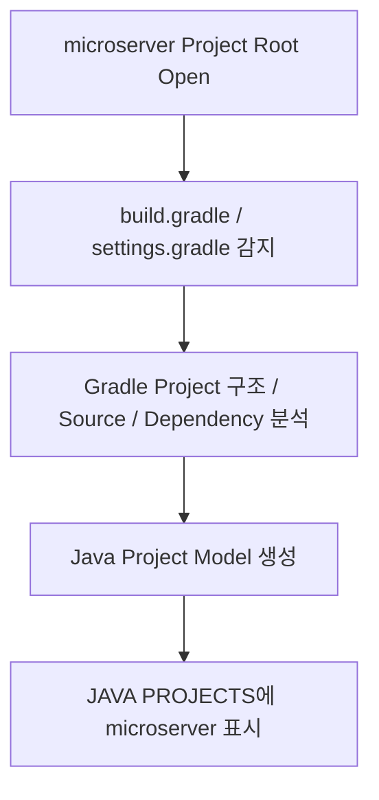

# VS Code Workspace Settings 가이드

## 1. 문서 목적

본 문서는 MicroServer Project Repository에서
팀이 공통으로 사용할 **VS Code Workspace 설정**을 구성한다.

User Settings의 JDK 경로 설정은 다음 문서에서 별도로 관리한다.

→ [VS Code User Settings](../../02_development_environment/04_vscode/vscode_user_settings.md)

현재 Project Root:

```text
C:\local-microserver\workspace\microserver
```

---

## 2. Workspace Settings란

Workspace Settings는 특정 Project에 적용되는 VS Code 설정이다.

MicroServer에서는 Project Root의 `.vscode` Directory를 사용한다.

정상적으로 Project 생성 후 초기 처리가 끝난 상태의 구조는 다음과 같이 본다.

```text
microserver/
├─ .vscode/
│  ├─ extensions.json
│  └─ settings.json
├─ build.gradle
├─ settings.gradle
├─ gradlew
├─ gradlew.bat
└─ src/
```

각 파일의 역할:

| 파일 | 역할 | Git |
|---|---|---|
| `.vscode/settings.json` | Project 공통 VS Code 설정 | O |
| `.vscode/extensions.json` | Project 권장 Extension 목록 | O |

!!! note "`NEWLY_CREATED_BY_SPRING_INITIALIZR`는 일회성 Marker"

    Spring Initializr Extension으로 Project를 생성하면
    다음 파일이 임시로 생성될 수 있다.

    ```text
    .vscode/NEWLY_CREATED_BY_SPRING_INITIALIZR
    ```

    이 파일은 Project가 Spring Initializr로 생성되었다는 정보를
    영구적으로 보관하기 위한 Project 설정 파일이 아니다.

    새로 생성된 Project Root를 VS Code로 처음 열면
    Spring Initializr Extension이 이 Marker를 감지하고
    `HELP.md` 또는 `README.md`를 Preview한 뒤 Marker를 삭제한다.

    ```text
    Spring Initializr로 Project 생성
            ↓
    NEWLY_CREATED_BY_SPRING_INITIALIZR 생성
            ↓
    Project Root를 VS Code로 Open
            ↓
    HELP.md / README.md Preview
            ↓
    Marker 삭제
    ```

    따라서 이 파일은 **팀 공통 Workspace 설정이 아니며 Git으로 공유하지 않는다.**

!!! important "개발자 개인 JDK 절대경로는 저장하지 않음"

    다음 항목은 User Settings에서 관리한다.

    ```text
    java.configuration.runtimes
    java.jdt.ls.java.home
    ```

    `.vscode/settings.json`에는 개발 PC별 JDK 절대경로를 넣지 않는다.

## 3. Project Root 열기

VS Code:

```text
File
→ Open Folder...
→ C:\local-microserver\workspace\microserver
```

Explorer에서 다음 구조를 확인한다.

```text
microserver
├─ gradle/
├─ src/
├─ build.gradle
├─ settings.gradle
├─ gradlew
└─ gradlew.bat
```

!!! important "Project Root를 정확히 열기"

    ```text
    X C:\local-microserver\workspace
    O C:\local-microserver\workspace\microserver
    ```

---

## 4. Workspace Trust

VS Code는 Project Folder를 처음 열 때
해당 Folder의 코드와 설정을 신뢰하고 실행해도 되는지 확인할 수 있다.

이를 **Workspace Trust**라고 한다.

Project를 Trust하면 Java / Gradle Extension, Task, Debugger 등
Project 개발 기능을 정상적으로 사용할 수 있다.

Trust하지 않으면 **Restricted Mode**로 열리며
일부 Extension / Task / Debug 기능이 제한될 수 있다.

!!! tip "MicroServer에서는"

    직접 생성하고 관리하는 MicroServer Project라면
    Trust 요청이 나타날 때 Project 출처를 확인한 후 **Trust**를 선택한다.

    Trust 요청이 나타나지 않고 Java / Gradle 기능이 정상 동작한다면
    별도 작업 없이 다음 단계로 진행한다.

    Workspace Trust는 Git 권한, Java Version, JDK 경로를 설정하는 기능이 아니라
    **Project 내부 코드와 설정의 실행을 허용할지 판단하는 VS Code 보안 기능**이다.

---

## 5. `.vscode/settings.json`

Project Root 아래의 다음 파일을 사용한다.

```text
microserver/.vscode/settings.json
```

MicroServer 권장 설정:

```json
{
  "files.encoding": "utf8",
  "java.configuration.updateBuildConfiguration": "automatic",
  "java.compile.nullAnalysis.mode": "automatic"
}
```

역할:

| 설정 | 역할 |
|---|---|
| `files.encoding` | Workspace 기본 Encoding을 UTF-8로 사용 |
| `java.configuration.updateBuildConfiguration` | Gradle Build 설정 변경 시 Java Project 구성 자동 갱신 |
| `java.compile.nullAnalysis.mode` | Null Annotation 감지 시 Null Analysis 자동 활성화 |

### 5.1 `java.configuration.updateBuildConfiguration`

`build.gradle`이나 `settings.gradle`이 변경되면
Java Extension이 Project Classpath / Build Configuration을 갱신할 수 있다.

```text
build.gradle / settings.gradle 변경
        ↓
Java Project Build Configuration 갱신
        ↓
Classpath / Dependency / Project Model 반영
```

### 5.2 Null Analysis를 Workspace 설정으로 관리하는 이유

Java Extension은 Project에서 `@NonNull`, `@Nullable`,
`@NullMarked` 등의 Null 관련 Annotation Type을 감지할 수 있다.

기본 모드는 `interactive`이므로 처음 감지했을 때 다음과 같이 사용자에게 묻는다.

```text
Null annotation types have been detected in the project.
Do you wish to enable null analysis for this project?
```

MicroServer에서는 Null Analysis를 팀 공통으로 사용하기 위해
다음 값을 Workspace Settings에 명시한다.

```json
"java.compile.nullAnalysis.mode": "automatic"
```

의미:

```text
Null Annotation 감지
        ↓
사용자에게 Enable / Disable 질문하지 않음
        ↓
Null Analysis 자동 활성화
```

따라서 개발자가 Repository를 Clone해서 열어도
`.vscode/settings.json`이 Git으로 전달되므로 동일한 Null Analysis 정책을 사용할 수 있다.

!!! tip "Portable VS Code를 복사해 주더라도 Workspace에 명시하는 이유"

    Portable VS Code의 `data` Directory까지 복사하면
    User Settings와 설치된 Extension 등 개인 개발환경도 함께 전달할 수 있다.

    하지만 Project 공통 정책은 Portable VS Code 복사본에 의존하지 않고
    Repository의 Workspace Settings에 명시하는 것이 더 명확하다.

    ```text
    Portable VS Code data/
    → 개발자 개인 VS Code 환경

    .vscode/settings.json
    → MicroServer Project 공통 개발 정책
    → Git으로 공유
    ```

    따라서 Null Analysis처럼 팀 전체에 동일하게 적용할 설정은
    Workspace Settings에 두는 것이 적합하다.

!!! important "JDK 절대경로를 넣지 않음"

    다음 값은 `.vscode/settings.json`에 작성하지 않는다.

    ```text
    java.configuration.runtimes
    java.jdt.ls.java.home
    C:\local-microserver\tools\jdk\temurin-25
    ```

    개발 PC별 JDK 경로는 VS Code User Settings에서 관리한다.

## 6. `.vscode/extensions.json`

Project Root 아래의 다음 파일을 사용한다.

```text
microserver/.vscode/extensions.json
```

권장 설정:

```json
{
  "recommendations": [
    "vscjava.vscode-java-pack",
    "vscjava.vscode-gradle",
    "vmware.vscode-boot-dev-pack",
    "redhat.vscode-yaml",
    "redhat.vscode-xml",
    "ms-azuretools.vscode-containers"
  ]
}
```

주요 Extension:

| Extension | 역할 |
|---|---|
| Extension Pack for Java | Java 개발 |
| Gradle for Java | Gradle Project / Task |
| Spring Boot Extension Pack | Spring Boot / Dashboard |
| YAML | YAML 편집 |
| XML | XML 편집 |
| Container Tools | Container 관련 기능 |

### 6.1 이미 설치했는데 왜 `extensions.json`에 다시 적는가

`extensions.json`의 `recommendations`는
**Extension을 다시 설치하는 설정이 아니다.**

현재 PC에 이미 설치되어 있는 Extension이라면
이 파일 때문에 중복 설치되거나 다시 설치되지 않는다.

이 파일의 목적은:

```text
"이 Project를 개발하려면
이 Extension들을 사용하는 것을 권장한다."
```

라는 **Project 개발환경 정보를 Repository에 남기는 것**이다.

즉 개발자 개인 PC에 이미 설치되어 있는지와는 별개로
Project가 요구하거나 권장하는 VS Code Extension 목록을 문서화한다.

!!! tip "`extensions.json`은 Project용 Extension 가이드"

    다음 두 개념을 구분한다.

    ```text
    내 PC에 Extension 설치
    → 현재 개발자 개인 VS Code 환경


    .vscode/extensions.json
    → 이 Project에서 권장하는 Extension 목록
    → Git으로 팀에 공유
    ```

    따라서 현재 개발 PC에 모든 Extension이 이미 설치되어 있어도
    `extensions.json`을 작성하는 의미가 있다.

### 6.2 다른 개발자에게 어떤 도움이 되는가

새 개발자가 Repository를 Clone하고 VS Code로 열었을 때
`extensions.json`의 추천 목록을 기준으로
Project에 필요한 Extension을 확인할 수 있다.

예:

```text
개발자 A
→ 이미 Java / Gradle / Spring Extension 설치
→ 별도 설치 필요 없음


개발자 B
→ 새 PC에서 Repository Clone
→ VS Code가 Project 권장 Extension 확인 가능
→ 필요한 Extension 설치


개발자 C
→ 일부 Extension만 설치
→ 누락된 권장 Extension 확인 가능
```

따라서 `extensions.json`은
**개발자별 VS Code 환경 차이를 줄이는 역할**을 한다.

### 6.3 무엇을 하지 않는가

`extensions.json`은 다음 기능을 하지 않는다.

```text
Extension을 강제로 설치
설치된 Extension을 다시 설치
Extension Version을 고정
Extension 설정값을 저장
```

즉:

```text
extensions.json
→ 권장 Extension 목록

settings.json
→ Project 공통 VS Code 설정
```

으로 역할을 구분한다.

!!! note "Maven View가 표시될 수 있음"

    Extension Pack for Java에는 Maven 관련 Extension이 포함될 수 있다.

    MicroServer는 다음 파일을 사용하는 **Gradle Project**이다.

    ```text
    build.gradle
    settings.gradle
    gradlew
    gradlew.bat
    ```

    Maven을 사용하지 않는다면 Maven View는 숨겨도 된다.

## 7. Java Project 자동 인식

VS Code에서 `microserver` Project Root를 열면
Java / Gradle Extension이 `build.gradle`과 `settings.gradle`을 감지한다.



이 과정을 Java Project **Import**라고 한다.

여기서 Import는 Project 파일을 복사하거나 가져오는 작업이 아니라
VS Code가 현재 Project를 Java Project로 인식하는 과정이다.

!!! important "자동 Import가 기본"

    `JAVA PROJECTS` View에 `microserver`가 보이면
    이미 자동 Import된 상태이다.

    정상 상태에서는 다음 명령을 별도로 실행하지 않는다.

    ```text
    Java: Import Java Projects in Workspace
    ```

    이 명령은 Project가 자동 인식되지 않거나
    Build Script 변경 후 Project Model이 갱신되지 않는 경우에 사용한다.

---

## 8. `.gitignore` 확인

MicroServer에서는 필요한 `.vscode` 공통 설정만 Git으로 공유한다.

현재 권장 정책:

```gitignore
# ------------------------------------------------------------
# VS Code
# ------------------------------------------------------------

# .vscode 하위 파일은 기본적으로 Git 제외
.vscode/*

# Project 공통 VS Code 설정만 Git 관리
!.vscode/settings.json
!.vscode/extensions.json
!.vscode/tasks.json
!.vscode/launch.json
```

이 규칙에 따라:

```text
.vscode/settings.json                     → Git O
.vscode/extensions.json                   → Git O
.vscode/tasks.json                        → 존재하면 Git O
.vscode/launch.json                       → 존재하면 Git O

.vscode/NEWLY_CREATED_BY_SPRING_INITIALIZR
                                         → Git X
```

따라서 Spring Initializr의 일회성 Marker를 위한
별도의 예외 규칙은 추가하지 않는다.

```gitignore
# 추가하지 않음
# !.vscode/NEWLY_CREATED_BY_SPRING_INITIALIZR
```

!!! note "User Settings와 구분"

    User Settings의 JDK 절대경로는 Repository 밖에 있으므로
    `.gitignore`로 제외할 필요가 없다.

    ```text
    VS Code User Settings
    → 개발 PC 개인 설정
    → Repository 밖

    .vscode/settings.json
    → Project 공통 설정
    → Repository 안
    → Git 공유
    ```

## 9. 설정 및 Project 인식 완료 확인

앞 단계의 User Settings와 현재 Workspace Settings까지 구성했으면
VS Code에서 MicroServer Project가 정상적으로 인식되는지 함께 확인한다.

### 9.1 Workspace 설정 확인

Workspace 구성:

```text
.vscode/settings.json
→ Project 공통 설정
→ Encoding / Build Configuration / Null Analysis 정책

.vscode/extensions.json
→ Project 권장 Extension 목록
```

확인:

- [ ] Project Root를 `microserver`로 열었다.
- [ ] Workspace Trust 상태를 확인했다.
- [ ] `.vscode/settings.json`에 UTF-8 설정이 있다.
- [ ] `java.configuration.updateBuildConfiguration`이 `automatic`이다.
- [ ] `java.compile.nullAnalysis.mode`가 `automatic`이다.
- [ ] `.vscode/settings.json`에 개발자 개인 JDK 절대경로가 없다.
- [ ] `.vscode/extensions.json`에 Project 권장 Extension 목록이 있다.
- [ ] `NEWLY_CREATED_BY_SPRING_INITIALIZR`는 일회성 Marker이며 Git 공유 대상이 아님을 확인했다.
- [ ] `.vscode/settings.json`과 `.vscode/extensions.json`이 Git 공유 대상임을 확인했다.

### 9.2 Java Runtime 적용 확인

User Settings에서 등록한 Java 25 Runtime이
현재 VS Code Java 환경에 정상적으로 적용되었는지 확인한다.

Command Palette:

```text
Ctrl + Shift + P
→ Java: Configure Java Runtime
```

현재 MicroServer 기준으로 다음 내용을 확인한다.

```text
Java Version : 25
JDK Home     : C:\local-microserver\tools\jdk\temurin-25
Project      : microserver
```

UI의 이름이나 표시 방식은 Java Extension Version에 따라 일부 다를 수 있다.

핵심은 **Java 25와 올바른 JDK Home이 인식되는지**이다.

!!! note "설정 위치는 User Settings"

    Runtime이 정상적으로 인식되지 않는다면
    Project의 `.vscode/settings.json`에 JDK 경로를 추가하지 않는다.

    [VS Code User Settings](../../02_development_environment/04_vscode/vscode_user_settings.md)의
    `java.configuration.runtimes` 설정을 다시 확인한다.

### 9.3 Java Project 인식 확인

`JAVA PROJECTS` View에 다음과 같이 표시되는지 확인한다.

```text
JAVA PROJECTS
└─ microserver
```

`microserver`가 표시되면
앞에서 설명한 Java Project 자동 Import가 정상적으로 완료된 상태이다.

정상 상태에서는 다음 명령을 별도로 실행하지 않는다.

```text
Java: Import Java Projects in Workspace
```

### 9.4 Gradle Project 인식 확인

Gradle View 또는 `GRADLE PROJECTS` View에서
`microserver`가 표시되는지 확인한다.

```text
GRADLE PROJECTS
└─ microserver
```

현재는 **Gradle Project가 인식되는지만 확인**한다.

Gradle Wrapper와 실제 Project Gradle 설정은 다음 문서에서 확인한다.

### 9.5 Spring Boot Application 인식 확인

Spring Boot Dashboard에서
MicroServer Spring Boot Application이 표시되는지 확인한다.

```text
Java Project 인식
        ↓
Gradle Project 인식
        ↓
Spring Boot Application 인식
        ↓
Spring Boot Dashboard 표시
```

!!! warning "현재 단계에서는 Build / Run하지 않음"

    현재는 VS Code가 Java / Gradle / Spring Boot Project를
    정상적으로 인식하는지만 확인한다.

    ```text
    Project 인식 성공
            ≠
    Gradle Build 성공
            ≠
    Spring Boot Run 성공
    ```

    실제 Build와 Application 실행 검증은 이후
    **초기 Build / Run 검증** 단계에서 수행한다.

### 9.6 최종 체크리스트

- [ ] `Java: Configure Java Runtime`에서 Java 25 / JDK Home을 확인했다.
- [ ] `JAVA PROJECTS`에 `microserver`가 표시된다.
- [ ] Gradle View에 `microserver`가 표시된다.
- [ ] Spring Boot Dashboard에 Application이 표시된다.
- [ ] 정상 상태에서는 수동 Java Import를 실행하지 않았다.
- [ ] 아직 Gradle Build 또는 Spring Boot Run은 수행하지 않았다.

---

## 10. 다음 단계

VS Code User Settings와 Workspace Settings,
그리고 Java / Gradle / Spring Boot Project 인식까지 확인했다.

다음 단계에서는 Spring Initializr가 생성한 Gradle Wrapper를 확인하고
MicroServer Project의 Gradle 실행 기준을 정리한다.

→ [Gradle Wrapper 및 프로젝트 Gradle 설정](project_gradle_setup.md)

```text
VS Code User Settings
        ↓
VS Code Workspace Settings
        ↓
Java / Gradle / Spring Boot 인식 확인
        ↓
Gradle Wrapper / 프로젝트 Gradle 설정        ← 다음
        ↓
초기 Build / Run 검증
```
