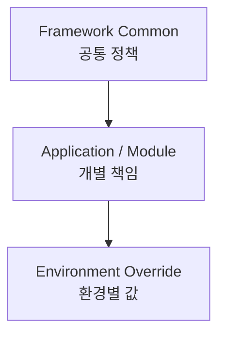
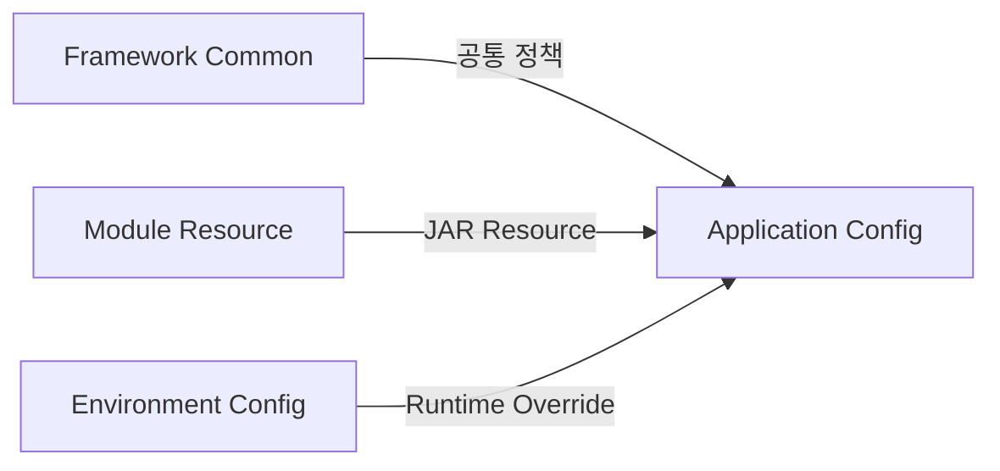

# 리소스 / 설정 관리 아키텍처

## 1. 문서 목적

본 문서는 MicroServer에서 **무엇을 공통화하고 무엇을 개별화할 것인지** 결정하기 위한
Resource / Configuration 설계 원칙을 정의한다.

기존 MicroServer에서는 Project Root와 같은 레벨에 `local-resource`를 두고,
Spring XML, Logback, MyBatis 설정, 인증서, DB 관련 Resource 등을 관리하는 구조를 사용했다.
새 MicroServer에서는 그 경험을 그대로 복사하지 않고,
Spring Boot + Gradle Multi-Project에 맞게 책임을 다시 정리한다.

주요 목표:

- 공통 Framework 설정과 Application 설정 구분
- 환경별 외부 설정 분리
- `local-resource`의 역할 재정의
- Module Resource 소유 원칙 확정
- Mapper SQL과 DB Script 구분
- Build Configuration과 Runtime Configuration 구분
- Secret과 Source Repository 분리

선행 문서:

- [멀티모듈 프로젝트 구조](../../04_multi_project_transition/03_framework_modules/multi_module_structure.md)

관련 문서:

- [Spring Boot YAML 공통 설정](spring_boot_configuration.md)
- [Profile / 외부 리소스 구성](profile_external_resources.md)
- [MyBatis 구성](../03_database/mybatis.md)

---

## 2. 가장 중요한 설계 원칙

MicroServer의 Configuration / Resource는 다음 세 계층으로 구분한다.



### Framework Common

여러 실행 Application에서 값과 의미가 동일해야 하는 정책이다.

예:

```text
MyBatis 공통 동작 정책
Jackson 공통 정책
공통 Logging 기준
공통 Web 정책
Framework Custom Property 기본값
```

### Application / Module

특정 실행 Application 또는 기능 Module만 의미를 가지는 값이다.

예:

```text
spring.application.name
기본 server.port
Runtime 전용 설정
Admin 전용 설정
Module 전용 Mapper SQL
Template / Static Resource
```

### Environment Override

동일한 Application이라도 환경에 따라 달라지는 값이다.

예:

```text
DB URL
DB Username / Password
외부 API URL
인증서 경로
실행 Port Override
환경별 Log Level
Timeout
```

---

## 3. 공통화의 기준은 '값이 같은가'가 아니다

두 Application에서 현재 같은 값을 사용한다고 해서 바로 Common으로 이동하지 않는다.

판단 기준은 다음이다.

> **같은 이유로 변경되는가?**

예:

```text
mybatis.configuration.map-underscore-to-camel-case
```

이 값이 MicroServer Framework 표준이라면 모든 Application이 같은 이유로 변경된다.
따라서 Common 후보이다.

반면:

```text
server.port
```

은 모든 Application이 사용하지만 Application마다 독립적으로 변경될 수 있다.
따라서 Common으로 만들지 않는다.

---

## 4. Resource 소유 판단 질문

새 Resource를 추가할 때 다음 순서로 판단한다.

```text
1. 이 Resource를 사용하는 Java 기능은 어느 Module에 있는가?
2. 해당 기능이 제거되면 이 Resource도 같이 제거되는가?
3. 환경이 바뀌어도 Resource 내용은 동일한가?
4. Secret 또는 운영정보를 포함하는가?
5. 여러 Application이 같은 이유로 공유하는가?
```

### 기능과 함께 움직이면

```text
해당 Module의 src/main/resources
```

### 환경과 함께 움직이면

```text
External Configuration / local-resource
```

### Framework 정책과 함께 움직이면

```text
Common Configuration
```

---

## 5. 기본 Ownership 표

| 대상 | 기본 소유 위치 | 판단 이유 |
|---|---|---|
| `spring.application.name` | 실행 Application | Application 정체성 |
| 기본 `server.port` | 실행 Application | App별 기본값 |
| Port Override | Environment | 실행 시 변경 |
| MyBatis 기본 동작 정책 | Common | Framework 정책 |
| Mapper Interface | 기능 Module | Java 기능 소유 |
| Mapper XML | 기능 Module | Java 기능과 같은 Release 단위 |
| 공통 Exception / Response | `module-common` | 공통 Java 기능 |
| Jackson 공통 정책 | Common | Framework 정책 |
| DB URL | Environment | 환경별 값 |
| DB ID / Password | Environment / Secret | Source와 분리 |
| 외부 API URL | Environment | 배포환경별 값 |
| 인증서 / Private Key | Environment / Secret | 보안 / 환경 의존 |
| Admin Template / Static | `admin` | Admin Application 기능 |
| DB 초기화 Script | DB Resource 정책 | Runtime Mapper와 성격이 다름 |
| Gradle Repository 설정 | Build Script | Runtime 설정이 아님 |

---

## 6. 목표 Directory 개념

```text
microserver/
│
├─ module-common/
│  └─ src/main/resources/
│     ├─ microserver-common.yml
│     └─ mybatis/common/
│
├─ runtime/
│  └─ src/main/resources/
│     ├─ application.yml
│     └─ mybatis/runtime/
│
├─ admin/
│  └─ src/main/resources/
│     ├─ application.yml
│     ├─ mybatis/admin/
│     ├─ templates/
│     └─ static/
│
└─ local-resource/
   ├─ config/
   ├─ cert/
   ├─ logback/
   └─ db/
```

!!! note "필요한 Directory만 생성"
    위 구조는 책임을 설명하기 위한 목표 구조이다.
    아직 사용하지 않는 Directory를 미리 모두 생성할 필요는 없다.

---

## 7. `src/main/resources`에 두어야 하는 것

해당 Module의 Build Artifact와 같이 배포되어야 하는 Resource는
표준 Resource Directory에 둔다.

```text
src/main/resources
```

예:

```text
Mapper XML
Message Bundle
Application Template
Static File
Framework Metadata
Module Default Property
```

Gradle의 Java / Java Library Plugin은 기본적으로 `src/main/resources`의 Resource를
해당 Production Output / JAR에 포함한다.

---

## 8. `local-resource`의 새 역할

기존 MicroServer에서 `local-resource`는 매우 많은 종류의 Resource를 담고 있었다.
새 프로젝트에서는 역할을 더 좁힌다.

> **JAR 안에 고정하지 않아야 하는 개발 / 실행환경 Resource를 관리하는 영역**

권장 대상:

```text
Local / Dev 외부 Configuration
개발 인증서
개발 DB 초기화 Script
환경별 Logging Override
실행환경 Sample / Template
```

비권장 대상:

```text
업무 Mapper XML
공통 Mapper XML
Module Template
Module 전용 Message Bundle
일반 Dependency JAR
Maven settings.xml
```

---

## 9. Mapper SQL은 Module이 소유한다

Mapper SQL은 Runtime Configuration이 아니다.
업무 기능 구현의 일부이다.

예:

```text
module-common
└─ src/main/resources/mybatis/common/CommonCodeMapper.xml

runtime
└─ src/main/resources/mybatis/runtime/RuntimeJobMapper.xml

admin
└─ src/main/resources/mybatis/admin/AdminUserMapper.xml
```

이렇게 하면 Java 기능과 SQL이 같은 Git / Build / JAR 단위로 움직인다.

자세한 내용은 [MyBatis 구성](../03_database/mybatis.md)에서 다룬다.

---

## 10. Mapper SQL과 DB Script는 다르다

둘 다 SQL을 포함할 수 있지만 목적이 다르다.

### Mapper SQL

```text
Application Runtime Query
SELECT / INSERT / UPDATE / DELETE
기능 Module과 같이 Versioning
```

### DB Script

```text
Schema 생성
Migration
Local DB 초기화
개발 Test Data
```

따라서 다음을 구분한다.

```text
src/main/resources/mybatis/
→ Runtime Query

local-resource/db/ 또는 Migration Tool 표준 경로
→ DB 구조 / 초기화
```

---

## 11. 기존 `mybatis-config.xml`은 SQL이 아니다

기존 Project의 다음 파일:

```text
local-resource/config/mybatis/mybatis-config.xml
```

은 일반적으로 Mapper SQL 파일과 다른 역할이다.

```text
mybatis-config.xml
→ MyBatis Engine 설정

*Mapper.xml
→ 실제 SQL Mapping
```

새 프로젝트에서는 단순 Engine 설정을 우선 Spring Boot YAML Property로 표현하고,
복잡한 XML 전용 설정이 실제로 필요할 때만 `mybatis-config.xml`을 유지한다.

---

## 12. Build와 Runtime을 구분한다

### Gradle이 담당

```text
Compile
Test
Dependency
Packaging
Subproject Build 순서
Artifact 생성
```

### Spring Runtime Configuration이 담당

```text
local / dev / test / prod
Port
DB 접속정보
외부 연계 URL
환경별 Logging
Runtime Feature 설정
```

따라서 환경마다 다른 JAR를 만드는 구조를 기본으로 하지 않는다.

```text
동일한 runtime.jar
        +
환경별 Configuration
```

을 기본으로 한다.

---

## 13. 기존 Maven Profile 개념의 전환

기존 Maven 기반 Project에서 다음처럼 Profile을 사용했을 수 있다.

```text
-Pdev
-Plocal
```

새 MicroServer에서는 Build Tool Profile을 환경설정의 중심으로 만들지 않는다.

```text
Gradle
→ Build

Spring Profile
→ Runtime Environment 선택

Environment Variable / External Config
→ 실제 환경 값
```

---

## 14. Secret은 Resource 공통화 대상이 아니다

다음 정보는 Git Repository의 공통 YAML에 두지 않는다.

```text
DB Password
API Token
Private Key
인증서 Password
운영 시스템 Credential
```

Application YAML에는 Placeholder만 사용할 수 있다.

```yaml
spring:
  datasource:
    username: ${DB_USERNAME}
    password: ${DB_PASSWORD}
```

실제 Secret 처리 방식은 운영환경의 Secret Store 또는 환경변수 정책을 우선한다.
Jasypt를 적용할 경우에도 별도 Jasypt 가이드의 정책에 따라 적용한다.

---

## 15. 공통화하지 않아야 하는 대표 값

```text
spring.application.name
server.port
spring.datasource.url
spring.datasource.username
spring.datasource.password
외부 API Host
실제 인증서 경로
개인 PC 절대경로
```

이 값들은 Application 또는 Environment의 책임이다.

---

## 16. 공통화하기 좋은 대표 값

```text
MyBatis 공통 동작 정책
Jackson 공통 정책
공통 Web 정책
Framework Custom Property 기본값
공통 Message 규칙
공통 Logging 기본 정책
```

다만 실제 모든 Application에서 동일한 의미를 가져야 한다.

---

## 17. 설정 Override는 의도적으로 사용한다

공통 YAML과 Application YAML에 같은 Key를 반복해서 정의하고
우선순위로 해결하는 방식을 기본 설계로 사용하지 않는다.

권장:

```text
Common
→ Common Key

Application
→ Application Key

Environment
→ 환경별 Override가 필요한 Key
```

즉 우선순위 기능은 필요할 때 사용하되,
설계 책임을 감추는 용도로 사용하지 않는다.

---

## 18. Git 관리 기준

`local-resource` 전체를 무조건 Git 제외하지 않는다.

### Git 관리 가능

```text
README
Directory 구조
Example / Template YAML
비밀정보 없는 개발 DB Script
```

### Git 제외

```text
실제 Password가 들어간 YAML
개인 인증서 / Private Key
Local 개인 설정
운영 접속정보
```

예:

```text
application-local.yml.example  → Commit 가능
application-local.yml          → 실제 정책에 따라 Git 제외
```

---

## 19. 향후 Config Module 분리 기준

초기에는 `module-common`에서 Framework Common Resource를 제공할 수 있다.

다음 상황이 실제로 생기면 별도 Config Module을 검토한다.

```text
공통 Config 자체가 매우 커짐
Common Java와 Release 주기가 달라짐
여러 독립 Application Group에서 같은 Config Artifact를 공유
Auto Configuration을 별도 제품처럼 제공
```

처음부터 `module-config`를 추가하는 것은 필수가 아니다.

---

## 20. 최종 책임 모델



정리:

```text
Framework 정책
→ Common

Java 기능 + SQL / Resource
→ 해당 Module

Application 정체성
→ 해당 실행 Application

DB / 외부 연계 / Secret
→ Environment
```

---

## 21. 체크리스트

- [ ] 공통 / Application / Environment 설정의 책임을 구분했다.
- [ ] 공통화 기준을 단순 중복 제거가 아니라 변경 책임으로 판단한다.
- [ ] Java 코드와 직접 연관된 Resource를 같은 Module에 둔다.
- [ ] Mapper SQL을 `local-resource`에 모으지 않는다.
- [ ] Mapper SQL과 DB Script를 구분한다.
- [ ] MyBatis Engine 설정과 Mapper SQL을 구분한다.
- [ ] DB 접속정보와 Secret을 JAR 내부에 고정하지 않는다.
- [ ] 환경별 차이를 Gradle Build Profile로 해결하지 않는다.
- [ ] `local-resource`의 역할을 외부 Runtime Resource로 제한한다.

---

## 22. 다음 단계

Module별 책임을 구체화한다.

→ [module-common 구성](../../04_multi_project_transition/03_framework_modules/module_common.md)
